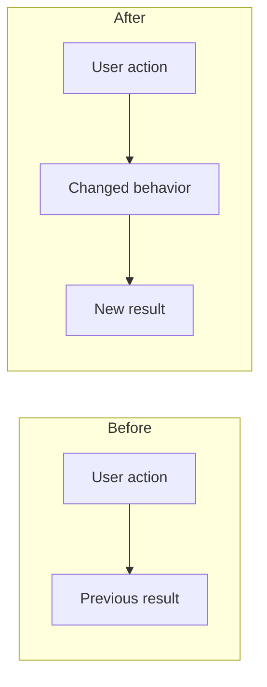
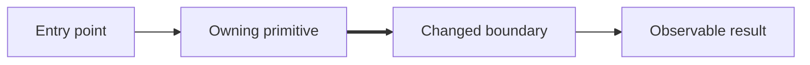

<!--
Escribí para un humano que revisa y para agentes de review.

Mantené siempre Problem and outcome, Review guidance, Solution y Validation.
Incluí las secciones condicionales solo cuando aporten información real.
Borrá las secciones sin usar y todos los comentarios de instrucción.

Empezá por el problema y el resultado, no por el inventario de la
implementación. Respaldá cada afirmación con código, tests, logs o issues.
No escribas relleno ("N/A") para preservar una sección.
-->

## Problem and outcome

{El problema original y por qué importa, en 1-3 frases.}

- **Outcome:** {Qué es observablemente distinto después de este PR.}
- **Invariant:** {Qué debe seguir siendo verdad en cualquier implementación aceptable.}
- **Scope boundary:** {Qué intencionalmente NO cambió.}
<!-- Solo para bugs. Borrar en otro caso. -->
- **Root cause:** {Solo bugs: la causa probada, no el síntoma visible.}

## Review guidance

- **Feedback requested:** {Correctness, arquitectura, seguridad, UX, migración, naming, o una pregunta concreta.}
- **Start here:** `{path:line}` — {Por qué este es el cambio load-bearing.}
- **Review order:** {Camino corto y ordenado por los archivos o commits importantes.}
- **Lower-attention areas:** {Cambios generados o mecánicos, y la evidencia que los verifica.}
- **Known risk or uncertainty:** {Preocupación concreta, o `None`.}

## Solution

{Cómo el cambio produce el resultado. Enfocate en comportamiento, ownership,
contratos y la primitiva existente que se reutiliza o extiende.}

<!-- Incluir cuando cambia comportamiento observable del usuario, operador o sistema. -->
## Behavior change

| | Before | After |
|---|---|---|
| **Observable behavior** | {Comportamiento previo} | {Comportamiento nuevo} |
| **Failure behavior** | {Fallo previo} | {Fallo nuevo o recuperación} |

<!--
Incluir cuando cambia un recorrido de interacción u operacional. Preferir un
Mermaid compacto before/after. Screenshots o video para cambios visuales.
-->
### User flow

<!--
Incluir cuando cambian límites de módulos, ownership, estado, persistencia,
flujo de datos, dependencias externas o contratos públicos. Diagramar solo la
arquitectura relevante, no cada archivo tocado.
-->
## Architecture

### Changed seams

| Boundary or contract | Change | Evidence |
|---|---|---|
| `{productor → consumidor}` | {Nuevo, removido o modificado} | `{path:line}`, test, trace o spec linkeada |

## Validation

- `{comando real}` — {resultado} — prueba {comportamiento o invariante}.
- {Evidencia de runtime, manual, visual, log o trace cuando aplique.}
- **Not verified:** {Verificación faltante concreta y por qué. Usar `Nothing material` solo cuando el comportamiento relevante al resultado está cubierto, y explicar por qué.}

<!-- Mantener solo las filas que apliquen. Borrar la sección si ninguna aplica. -->
## Delivery considerations

| Concern | Impact and required action | Evidence |
|---|---|---|
| Compatibility / migration | {Comportamiento existente o transición de datos} | {Evidencia} |
| Security / permissions / data | {Exposición cambiada y mitigación} | {Evidencia} |
| Rollout / rollback | {Postura de release y reversión segura} | {Evidencia} |
| Observability | {Cómo se vuelve visible una regresión} | {Evidencia} |
| Documentation / communication | {Material que cambió o debe cambiar} | {Evidencia} |

<!-- Borrar los tipos de link sin usar. Omitir la sección si no hay items relacionados. -->
## Links

- Closes #
- Related #
- Depends on #
- Supersedes #
