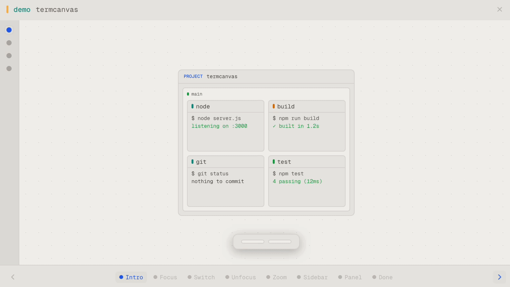
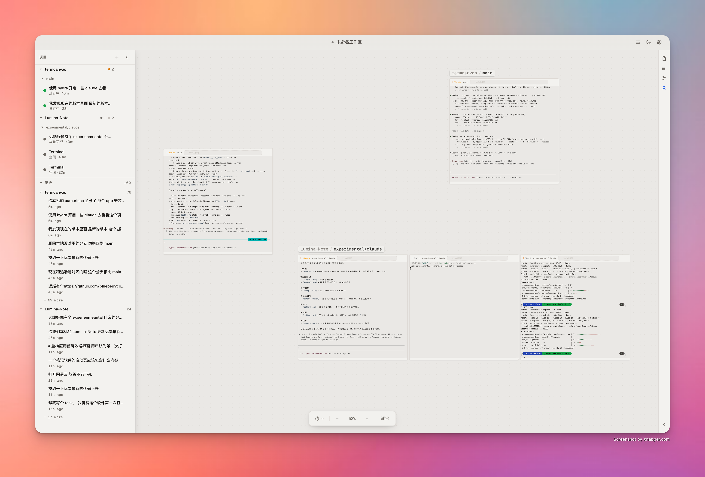
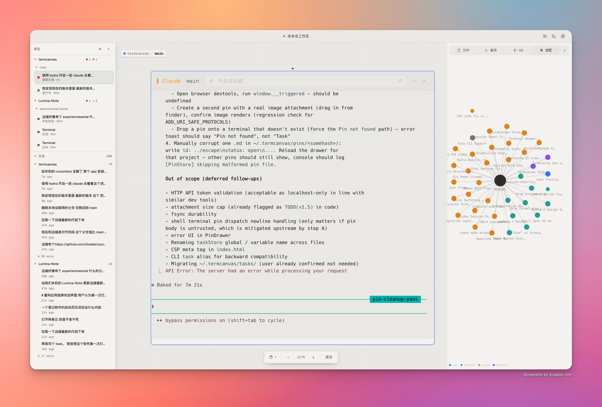

<div align="center">


# TermCanvas

**你的终端，铺在无限画布上。**

[](https://github.com/blueberrycongee/termcanvas/releases)
[](https://github.com/blueberrycongee/termcanvas/releases)
[](LICENSE)
[]()
[](https://website-ten-mu-37.vercel.app)

<br>



<br>



<br><br>



</div>

<br>

TermCanvas 把你所有的终端铺在一张无限空间画布上——不再有标签页，不再有分屏。自由拖拽、放大聚焦、缩小俯瞰。

它以 **Project → Worktree → Terminal** 三层结构来组织一切，和你使用 git 的方式完全一致。添加一个项目，TermCanvas 自动检测它的 worktree；在终端里新建一个 worktree，画布上立刻出现。

<p align="right"><a href="./README.md">English →</a></p>

> **第一次用 TermCanvas?** 先读完整的[**用户指南**](./docs/user-guide.zh.md) —— 每个交互都讲清楚、每个快捷键都列出来,加上那些不告诉你就永远发现不了的小细节(⌘E 聚焦连环、拖到 stash、会话回放等等)。

---

## 快速开始

**下载** —— 从 [GitHub Releases](https://github.com/blueberrycongee/termcanvas/releases) 获取最新构建。

> [!IMPORTANT]
> **Apple Silicon（M 系列）Mac 用户请下载文件名带 `arm64` 的版本**
> 文件名**带** `arm64` 的（例如 `TermCanvas-X.Y.Z-arm64.dmg`、`TermCanvas-X.Y.Z-arm64-mac.zip`）是 Apple Silicon 原生版本。**不带** `arm64` 的是 Intel (x64) 版本 —— 在 M 系列 Mac 上虽然能通过 Rosetta 2 启动，但画布 pan/zoom 会有明显卡顿。
>
> 安装后验证：打开**活动监视器**（Activity Monitor），找到 TermCanvas，看**种类**列 —— 应该显示 **Apple**，而不是 **Intel**。如果是 Intel，删除 app 后重新下载带 `arm64` 的版本。

> [!WARNING]
> **macOS 未签名应用提示**
> 如果 macOS 提示 TermCanvas“已损坏”，或因为应用未签名而阻止启动，先清除 quarantine 属性再重试：
>
> ```bash
> xattr -cr /Applications/TermCanvas.app
> ```
>
> 如果你把应用装在别的位置，把上面的路径改成实际的 `.app` 路径即可。

**从源码构建：**

这个仓库现在统一使用 `pnpm`，并以 `pnpm-lock.yaml` 作为唯一锁文件。

```bash
git clone https://github.com/blueberrycongee/termcanvas.git
cd termcanvas
pnpm install
pnpm dev
```

**安装命令行工具** —— 启动应用后，进入 设置 → 通用 → 命令行工具，点击注册。这会将 `termcanvas` 添加到你的 PATH。

注册也会安装 TermCanvas 的 Claude/Codex skills 和 lifecycle hooks。对于 Codex 0.129.0 及更新版本，TermCanvas 会在 `~/.codex/config.toml` 写入所需的 hook trust state，让自动生成的 hooks 被 Codex 视为已审核/可信，从而继续发送终端 lifecycle 和 telemetry 事件。

---

## 功能特性

### 画布

无限画布——自由平移、缩放、排列终端。三层层级：项目包含 worktree，worktree 包含终端。新建 worktree 时自动出现在画布上。

双击终端标题栏缩放适配。拖拽排序。框选多个终端。用 Free Canvas 工具直接在画布上手绘和标注——草图、批注、分组线与终端同屏共存。将完整布局保存为 `.termcanvas` 文件。

### AI 编程 Agent

原生支持 **Claude Code**、**Codex**、**Kimi**、**Gemini**、**OpenCode**。

- **瞄一眼就知道每个 tile 的状态** —— 彩色状态点告诉你 agent 在思考、等输入、空闲，还是刚完成
- **关掉再打开继续聊** —— 关闭并重新打开 agent 终端，不丢上下文
- **就地审查改动** —— 内联 diff 卡片让你不离开画布就能看 agent 改了什么

### 会话面板

把所有项目里 Claude / Codex 的历史会话按「项目 → worktree → 会话」组织好。点任意一行回放,或者跳到正在跑的对应终端。worktree 节点带 git 状态徽章,扫一眼就知道哪些是干净的。

### Git

commit 历史、diff 查看器、实时 git 状态——内置在侧边栏,看仓库变动不用离开画布。

### 终端

Shell、lazygit、tmux 与 AI agent 共存于同一画布。<kbd>⌘</kbd><kbd>F</kbd> 给常用终端加星,再用 <kbd>⌘</kbd><kbd>]</kbd> / <kbd>⌘</kbd><kbd>[</kbd> 在星标范围内循环——<kbd>⌘</kbd><kbd>G</kbd> 切换是循环全部终端、只循环星标,还是整个 worktree。自定义标题、逐 agent CLI 路径覆盖,你第一次手动调过尺寸后,新终端都沿用那个偏好。

### 用量追踪

看你在 Claude 和 Codex 上花了多少钱——按项目、按模型分,带 5 小时和 7 天速率限制的配额监控。登录后跨设备同步。

### 设置

可下载等宽字体 · 深色 / 浅色主题 · 可重绑快捷键 · 无障碍对比度调节 · 中英文 · 应用内自动更新。

---

## 命令行工具

两个 CLI 都随应用打包。在设置中注册后即可在任意终端使用。

### termcanvas

<details>
<summary>完整命令参考</summary>

```
用法: termcanvas <group> <command> [args]

Group：
  project        add | list | remove | rescan
  worktree       list | create | remove
  terminal       create | list | status | output | destroy | set-title
  workflow       通过 HTTP 调用 Lead-driven Hydra 工作流（init / dispatch / watch …）
  telemetry      get | events
  pin            add | list | show | update | rm
  diff           <worktree-path> [--summary]
  state          导出完整画布状态为 JSON

常用调用：
  project add <path>
  worktree create --repo <path> --branch <name> [--from <ref>]
  terminal create --worktree <path> --type <claude|codex|shell|…>
          [--prompt <text>] [--parent-terminal <id>] [--auto-approve]
  terminal output <id> [--lines N]              # 默认 50
  telemetry get --terminal <id>
  telemetry get --workflow <id> --repo <path>
  pin add --title <t> [--body <b>] [--link <url>] [--link-type <type>]

标志：
  --json    所有命令的机器可读输出
```

</details>

```bash
termcanvas project add ~/my-repo
termcanvas terminal create --worktree ~/my-repo --type claude
termcanvas terminal status <id>
termcanvas telemetry get --terminal <id>
termcanvas diff ~/my-repo --summary
```

---

## 找到功能在哪

每个主要功能在哪打开 / 怎么触发，按使用场景列在下面。所有快捷键均可在 **设置 → 快捷键** 中自定义；Windows/Linux 上 <kbd>⌘</kbd> 自动换成 <kbd>Ctrl</kbd>。

**发现层 — 不知道某个功能在哪时**

| 快捷键 | 入口 | 用来做什么 |
|---|---|---|
| <kbd>⌘</kbd><kbd>P</kbd> | Command Palette | 按名字调用任意 app 动作（切换面板、打开设置、切主题等） |
| <kbd>⌘</kbd><kbd>K</kbd> | 全局搜索 | 文件、终端、会话、git 分支/提交、memory，画布范围内模糊搜索 |
| <kbd>⌘</kbd><kbd>⇧</kbd><kbd>J</kbd> | Hub | 右侧 command center：实时终端、最近活动、waypoints、固定项 |
| <kbd>⌘</kbd><kbd>⇧</kbd><kbd>/</kbd> | 状态摘要 | 浮动小窗，列出画布上 3–5 个最值得看的信号 |

**画布导航**

| 快捷键 | 动作 |
|---|---|
| <kbd>⌘</kbd><kbd>E</kbd> | 切换聚焦：放大到聚焦的 / 缩小到看全 |
| <kbd>⌘</kbd><kbd>0</kbd> · <kbd>⌘</kbd><kbd>1</kbd> · <kbd>⌘</kbd><kbd>=</kbd> · <kbd>⌘</kbd><kbd>-</kbd> | 缩放：适配 · 100% · 放大 · 缩小 |
| <kbd>⌘</kbd><kbd>]</kbd> / <kbd>⌘</kbd><kbd>[</kbd> | 下一个 / 上一个终端（或 worktree / 星标，看 <kbd>⌘</kbd><kbd>G</kbd>） |
| <kbd>⌘</kbd><kbd>G</kbd> | 切换聚焦层级（终端 → worktree → 仅星标） |
| <kbd>⌘</kbd><kbd>F</kbd> | 给聚焦终端加星 / 取消加星 |
| <kbd>⌘</kbd><kbd>⇧</kbd><kbd>1</kbd>–<kbd>9</kbd> · <kbd>⌥</kbd><kbd>1</kbd>–<kbd>9</kbd> | 保存 / 召回空间 waypoint（按项目存，9 个槽） |
| <kbd>⌥</kbd><kbd>\`</kbd> | 飞到最近有输出的终端（连按可循环） |
| <kbd>V</kbd> · <kbd>H</kbd> · <kbd>Space</kbd>（按住） | 选择 · 抓手 · 临时平移 |

**多画布**

| 快捷键 | 动作 |
|---|---|
| <kbd>⌘</kbd><kbd>⇧</kbd><kbd>]</kbd> / <kbd>⌘</kbd><kbd>⇧</kbd><kbd>[</kbd> | 下一个 / 上一个画布（每个画布独立的视口、项目、waypoints） |
| <kbd>⌘</kbd><kbd>⇧</kbd><kbd>N</kbd> | 打开画布管理（重命名、排序、切换） |

**终端**

| 快捷键 | 动作 |
|---|---|
| <kbd>⌘</kbd><kbd>T</kbd> · <kbd>⌘</kbd><kbd>D</kbd> | 在聚焦 worktree 里新建 / 关闭终端 |
| <kbd>⌘</kbd><kbd>;</kbd> | 打开 composer（如未启用则内联重命名标题） |

**面板与浮层**

| 快捷键 | 动作 |
|---|---|
| <kbd>⌘</kbd><kbd>/</kbd> | 切换右栏（Files / Diff / Git / Memory） |
| <kbd>⌘</kbd><kbd>⇧</kbd><kbd>U</kbd> | Usage 仪表盘（花费 + 配额） |
| <kbd>⌘</kbd><kbd>⇧</kbd><kbd>H</kbd> | Sessions 浮层 |
| <kbd>⌘</kbd><kbd>⇧</kbd><kbd>T</kbd> | 快照历史（浏览并回滚画布状态，支持 diff） |
| <kbd>⌘</kbd><kbd>⇧</kbd><kbd>A</kbd> | 画布全局活动热力图 |

**Workspace**

| 快捷键 | 动作 |
|---|---|
| <kbd>⌘</kbd><kbd>O</kbd> | 添加项目 |
| <kbd>⌘</kbd><kbd>S</kbd> · <kbd>⌘</kbd><kbd>⇧</kbd><kbd>S</kbd> | 保存 / 另存为一个 `.termcanvas` 工作区文件 |
| <kbd>⌘</kbd><kbd>,</kbd> | 设置 |

---

<table>
<tr><td><b>桌面框架</b></td><td>Electron</td></tr>
<tr><td><b>前端</b></td><td>React · TypeScript</td></tr>
<tr><td><b>终端</b></td><td>xterm.js (WebGL) · node-pty</td></tr>
<tr><td><b>状态管理</b></td><td>Zustand</td></tr>
<tr><td><b>样式</b></td><td>Tailwind CSS · Geist</td></tr>
<tr><td><b>认证与同步</b></td><td>Supabase</td></tr>
<tr><td><b>构建</b></td><td>Vite · esbuild</td></tr>
</table>

<br>

**致谢** —— [lazygit](https://github.com/jesseduffield/lazygit) 作为内置终端类型集成，在画布上提供可视化的 git 管理。

---

## 路线图

TermCanvas 正在从本地桌面工具演进为**云原生 AI 开发平台**。以下是未来方向：

### 云端 Runtime

将任务执行从本地迁移到云端。在远程 runtime 上启动 AI agent——任务运行在托管环境中，具备完整的 git、工具链和依赖支持，而画布始终是你的统一控制面。

- **托管 agent 执行** —— 将 Claude、Codex 等 agent 任务委派给云端 worker，按需调度算力
- **持久远程会话** —— 合上笔记本，回来时 agent 仍在运行
- **并行云端 worker** —— 将 Hydra workflow 扩展到多个云实例，而非受限于本地终端

### 自动化 Vibe 流水线

基于云端 runtime，实现从想法到代码上线的端到端自动化：

- **意图 → 规划 → 实现 → 审查 → 合并** —— 全自动流水线，你描述需求，系统完成其余一切
- **持续 vibe 循环** —— agent 自主规划、实现、自审查、迭代，直到结果满足验收标准
- **流水线即代码** —— 为常见任务（bug 分类、功能实现、迁移、重构）定义可复用的 workflow 模板
- **人工审批检查点** —— 在任意阶段配置审批门禁，需要掌控时随时介入

### 愿景

目标很简单：**你描述意图，TermCanvas 搞定一切。** 画布成为自主 AI 开发的任务控制中心——监控进度、审查结果、需要时介入，让云端承担繁重工作。

---

**参与贡献** —— Fork、创建分支、发起 PR。基于 [MIT](LICENSE) 许可。
