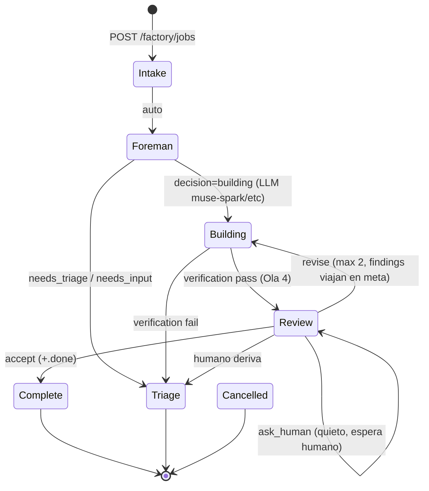
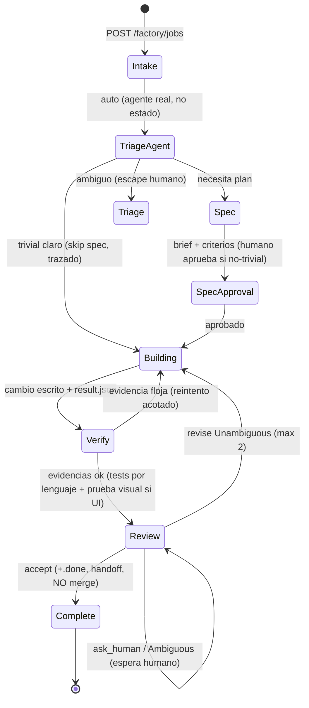

# MASTER PLAN — TermCanvas Software Factory
### De olas locales al mejor sistema: lo mejor de Warp + lo mejor local

> **Estado:** guía vigente desde 2026-09-03. Este documento es la fuente de verdad del proyecto Factory.
> **Norte (decisión):** construir lo mejor de Warp (reviewer agéntico con skills, definitions as code, measure/self-improvement) + lo mejor local (costo cero, datos en tu máquina, auditoría total en disco, override humano en un click). En grande desde ya.
> **Referencias:** `docs/wiki Warp/WarpFactories.md`, `docs/system_design.md` (Ola 4), https://docs.warp.dev/factories, https://github.com/warpdotdev/warp-factory-examples/tree/main/examples

---

## 0. Principios no-negociables

1. **NADA DE HARDCODEOS.** Ningún nombre propio de test ("Hola", "Hola mundo"), ninguna ruta absoluta de máquina (`C:\Users\...`), ninguna lista fija de "casos conocidos" como lógica de negocio. Lo configurable vive en `factory/factory.yaml` (versionado, con default sensato y override). Lo que hoy es heurística debe morir en la Ola 6.
2. **NADA DE SIMULACIONES FALSAS.** Mocks solo en tests, detrás de un gate explícito (`isPactJob` por id pact) y nunca en camino real. Un mock que tapa un bug es sabotaje. Si algo no se puede hacer de verdad todavía, se marca `ask_human`/`Triage` con la razón visible, no se inventa un `pass`.
3. **Definitions as code.** Agentes, skills, scorers y config viven en archivos versionados (`factory/`). Cambiar el comportamiento = cambiar un archivo + test, nunca editar TS a ciegas. Rollback = `git revert`.
4. **El humano decide.** Ningún veredicto automático mergea/aprueba solo: `accept` completa el flujo pero el override humano ("Aceptar igual", Adoptar/Descartar) siempre existe y queda en el timeline. Self-improvement propone, jamás aplica solo.
5. **Evidencia sobre relato.** Cada decisión del sistema deja traza en disco (`job.json`, `review.json`, `build.log`, timeline). Si no está en disco, no pasó.
6. **Contratos vivos.** Pacts F01–F14, polling 2.5s y endpoints existentes no se rompen sin migración explícita documentada acá.

---

## 1. Estado actual auditado (2026-09-03, con evidencia)

### 1.1 El loop hoy



### 1.2 Agentes y piezas (qué hay, archivo por archivo)

| Fase | Agente / pieza | Archivo | Estado real auditado |
|------|---------------|---------|----------------------|
| Intake | `workItemStore.create` + `job.json` atómico | `headless-runtime/workItem/workItemStore.ts`, `workItemDisk.ts`, `shared/types/workItem.ts` | Sólido. `reviewerRef` opcional agregado (Ola 4.1), restore con fallback, compat jobs viejos |
| Foreman | Decisión LLM `building/needs_triage/needs_input` + `json_schema` | `headless-runtime/foreman/foreman.ts`, `foremanPrompt.ts`, `foremanLog.ts` | Funciona, pero contexto mínimo (solo prompt+worktree+modelRef). Warp le pasa work item completo + findings + criteria. Prompt con ejemplos canónicos y rutas absolutas hardcodeadas (§1.4) |
| Building | `ImplementService` → runner → `ImplementAgent` (tools escritura) → `VerificationService` → `ResultWriter` | `headless-runtime/implement/*.ts`, `headless-runtime/runner/runnerExecutor.ts` | Real (cambio 1-3 archivos, pnpm real). Camino pact mock solo por id pact (correcto). Re-disparo revise→Building ok |
| Verificación | `pnpm test` 120s fail-fast → `pnpm build`, `build.log` 1MB, `result.json` | `headless-runtime/implement/verification.ts` | Solo sabe Node. Trivial-skip y flaky-ignore con nombres propios (§1.4). Non-Node → `skipped`+pass (fix reciente, exige daemon reiniciado) |
| Review | Selector disjunto + `reviewerRef` explícito + agente read-only + loop max 2 + acciones humanas | `headless-runtime/review/*.ts`, `shared/types/review.ts` | Funcional E2E (verificado job-mtkvx0rs). Debilidades conocidas: single-shot sin escalera de reintentos, sin fallback de modelo, parse estricto (mitigado: tolerancia de `id`), sin raw persistido (pendiente) |
| Observabilidad | Polling 2.5s, FlowBar, WorkItemList+stepper, VerificationPanel, ReviewPanel, ForemanLogPanel, botón copiar-resumen | `src/features/factoryLab/` | Buen nivel. Badges verdict, puerto descubierto, skeleton, 90% ancho |
| Contratos | Pacts F01–F14 | `software-testing-playground-v2/pacts/*.json` | Mock paths acotados a ids pact. No tocar sin actualizar tests |
| Skills locales | `skills/skills/{challenge,code-review,investigate,qa,security-audit,using-termcanvas}` | `skills/` | **Existen pero ningún agente las lee.** El reviewer lleva la rúbrica bakeada en el prompt. Oportunidad directa estilo Warp |

### 1.3 Brechas vs Warp (tabla honesta)

| Warp hoy | Nosotros hoy | Brecha |
|----------|--------------|--------|
| Reviewer agéntico con tools (re-ejecuta validación si la evidencia es floja) | Single-shot read-only, muere al primer flake | **Ola 5** |
| `agent.md` por agente (model/harness/skills como config) | Prompts bakeados en TS | **Ola 7** |
| Triage-agent y Spec-agent reales (brief con criterios, approval gate) | Triage = estado de escape; Spec no existe | **Ola 8** |
| Verify como etapa propia + prueba visual (computer-use) | Verify metida dentro de Building, solo Node | **Ola 9** |
| Skills leídas por agentes (`code-review`, `ui-verification`) | Skills huérfanas | **Ola 10** |
| Scorers (juez LLM, 1 pregunta, sampling 25%) + Benchmarks + Self-improvement con PRs `Regressions addressed` | Nada | **Olas 11–13** |
| Infra managed (cero flake local, modelos gestionados) | Server efímero local + cuotas propias | No replicable ni deseable; se compensa con reintentos + fallback + mensajes accionables |
| Automations (triggers por eventos) | Nada | **Ola 14 (opcional)** |

### 1.4 Deuda: hardcodeos y simulaciones a eliminar (inventario con ubicación)

> Regla: cada ítem muere en la ola indicada, con su reemplazo real. Grep de verificación incluido.

| # | Hardcodeo / simulación | Ubicación | Reemplazo real | Muere en |
|---|------------------------|-----------|----------------|----------|
| H1 | Rutas absolutas `C:\Users\Estudiante UCU\...` dentro de prompts y fallbacks | `headless-runtime/foreman/foremanPrompt.ts:90,104-108`, `FactoryLabPage.tsx` (`FALLBACK_WORKTREE`) + grep `C:\\Users` | Worktree/project-root resuelto en runtime; prohibir literales de máquina fuera de tests (test con grep) | Ola 6 |
| H2 | Nombres propios "Hola"/"Hola mundo"/typos (`carepta`…) como lógica de negocio | `headless-runtime/implement/minimalChange.ts` (~40 menciones), `verification.ts:252-330` | Parser genérico de intención (carpeta/archivo/contenido, cualquier nombre) + verificación por lenguaje de proyecto, no por nombre | Ola 6 |
| H3 | Lista fija de 4 flaky (`isKnownFlakyFailure` + `notOkMatches ≤ 4`) | `verification.ts:368-395` | Cuarentena real: test que falla sin que el diff lo toque → `quarantined` con evidencia (diff + log), nunca lista fija; re-chequeo periódico, no perdón eterno | Ola 6 |
| H4 | Tabla `REVIEWER_PAIRS` como única fuente | `reviewModelSelector.ts:44-49` | `reviewerRef` (hecho) + pares como **default en `factory.yaml`**, overrideable | Ola 6/7 |
| H5 | Timeouts/puertos/modelos default dispersos en constantes TS | `factoryServer.ts:41-44`, `foreman.ts:23-26`, `reviewAgent.ts:16`, etc. | `factory/factory.yaml` único: puertos, timeouts, modelos default, sampling | Ola 7 |
| H6 | Ejemplos canónicos con datos de juguete en prompts ("Hola mundo" → building 0.9) | `foremanPrompt.ts:108,117`, `implementPrompt.ts` | Ejemplos neutros o sección `examples` por proyecto; el prompt describe reglas, no casos de test | Ola 7 |
| H7 | Mock pact en `implementService` (legítimo pero frágil) | `implementService.ts:43-135` | Mantener, con regla blindada: solo tras `isPactJob`, test que falla si un job real toca el mock ( Pattern: `mock` solo bajo gate de id) | Transversal |
| H8 | Daemon standalone sin lifecycle (proceso suelto, restart manual, logs a consola) | Operativa (PID en 17680, `node --import tsx …factoryServer.ts`) | Script `pnpm factory` (levanta/mata/reinicia) + health con `version`/`buildId` visible en UI para saber qué código corre | Ola 5 |

---

## 2. Arquitectura target

### 2.1 Loop completo local



### 2.2 Definitions as code (formato local, espejo de Warp)

Formato real de Warp (verificado en `warp-factory-examples`, ej. reviewer `02-sdlc-issue-to-pr`):

```markdown
---
description: Adversarial code review. Advisory verdict; humans merge.
agentType: REVIEW
model: auto-genius
---
# Review
(rol + Input + Output + Procedure + skills a leer)
```

Formato local `factory/agents/<name>/agent.md` (mismas keys + nuestras necesidades):

```markdown
---
description: <una línea>
agentType: FOREMAN | TRIAGE | SPEC | IMPLEMENT | REVIEW | VERIFY  # exactamente un FOREMAN
model: <provider/model por defecto, overrideable por job: modelRef/reviewerRef>
tools: { read: true, write: false, edit: false, bash: "readonly" | true | false, glob: true, grep: true }
maxRetries: 2
---
# <Nombre>
<Rol en 2-3 líneas, estilo Warp: qué sos, qué no sos>
## Input
<qué te entrega el orquestador: work item, brief, diff, evidencias>
## Output
<único output permitido + schema>
## Procedure
<pasos numerados + contra qué comparar (spec/criterios)>
## Skills
<skills a leer antes de operar: factory/skills/...>
```

`factory/factory.yaml`: puertos, timeouts, modelos default, pares reviewer default, sampling de scorers.
`factory/skills/<name>/SKILL.md`: rúbricas (empezar por `code-review`, espejo de `skills/skills/code-review`).
`factory/scorers/<name>/scorer.md`: 1 pregunta, labels con score, `passingScore`, `samplingRate` (default 25), `selfImprovement: false` default.
Loader TS con fallback al prompt bakeado + **test que falla si difieren** (doc y código nunca divergen en silencio).

### 2.3 Reviewer target (estilo Warp, adaptado)

- Adversarial de verdad: "tratá el diff como escrito por alguien en quien no confiás".
- Findings `Unambiguous` (→ rework directo) vs `Ambiguous`/`judgment call` (→ humano). Mapeo: Unambiguous→`revise`, Ambiguous→`ask_human`, sin findings→`accept`.
- Lee la skill `code-review` local antes de revisar (no rúbrica bakeada).
- Reporta al foreman/orquestador; jamás postea veredicto fuera del job.
- Puede pedir **re-verificación** (Verify extiende evidencia) en vez de morir si la evidencia es floja.
- Modelo distinto al implementador, siempre (disjoint + `reviewerRef` override).
- Respuesta cruda persistida (`review-raw-{N}.txt`) + tolerancia de formato + escalera de reintentos + fallback de modelo.

### 2.4 Measure target (tal cual Warp)

- **Scorers:** juez LLM, 1 pregunta, labels (no notas), sampling 25%, scoring manual siempre disponible, re-score reemplaza. Iniciales: `review-formato-valido`, `implement-scope-1-3`, `verification-honesta`.
- **Benchmarks:** tasks fijas × configs × repeticiones, Correctness built-in, **sin ganador automático** (humano pondera costo/calidad).
- **Self-improvement:** agrupa failures por scorer → propone diff contra `factory/` con sección `Regressions addressed` linkeando runs → panel Adoptar/Descartar. **Nunca auto-aplica.**
- Loop: Define → Baseline → Inspect → Benchmark → Adopt → Monitor, una cosa medible a la vez.

---

## 3. Plan por olas (ambicioso, ordenado, sin atajos)

> Cada ola termina con: tests verdes + `tsc` 0 + pacts verdes + **job real E2E verificado** + nota en este MD. Si una ola no cumple, no se avanza.

### Ola 5 — Review blindado (terminar lo empezado)
**Objetivo:** el review automático nunca muera por infra.
- Raw persistido: `{result, raw}` + `review-raw-{N}.txt` 64KB + `GET /:id/review/raw` + link en panel (aprobado, pendiente ejecutar).
- Escalera de reintentos del review espejo Foreman (sync→async→legacy) + `UnknownError` vacío = reintentable.
- Fallback de modelo: primario falla por auth/cuota/modelo → 1 intento con par alternativo.
- `POST /:id/review/retry-review`: reintenta solo el review (hoy "Mandar a Building" quema un rebuild).
- H8: script `pnpm factory` (start/stop/restart/status) + `buildId` en `/factory/health` y visible en UI.
- **Done cuando:** 3 jobs reales seguidos terminan con review automático sin `ask_human` por infra.

### Ola 6 — Des-hardcodeo total (H1–H4)
- H1: cero literales de máquina fuera de tests (test-grep que lo enforcea).
- H2: parser genérico de intención + verificación por lenguaje (node: `package.json`→pnpm; python: `pytest` si existe; otro: `skipped` con nota — nunca por nombre).
- H3: cuarentena de flaky con evidencia en vez de lista fija.
- H4: pares reviewer a `factory.yaml`.
- **Done cuando:** `grep -ri "hola mundo"` da cero fuera de `tests/`, `docs/` y fixtures; job con nombre inventado (ej. "carpeta Zeta con app.py") pasa E2E sin código con su nombre.

### Ola 7 — Agents as code
- `factory/agents/{foreman,triage-stub,spec-stub,implement,review}/agent.md` + `factory/factory.yaml` + loader TS con fallback + test doc≅código.
- H5/H6 mueren acá. Cambiar un prompt = editar md + job real que lo demuestra.
- **Done cuando:** se modifica el tono de un agente solo tocando md y un job real lo refleja.

### Ola 8 — Triage-agent + Spec-agent reales
- Triage-agent: clasifica (claro→Building, planeable→Spec, ambiguo→Triage-humano) con findings persistidos (scope/complexity/open questions) que heredan las fases siguientes.
- Spec-agent: brief con criterios de aceptación + archivos objetivo; **approval gate humano** para no-trivial (trivial: auto-skip trazado).
- Foreman pasa a orquestar con ese contexto (estilo Warp), no solo con el string del prompt.
- **Done cuando:** job ambiguo real termina en Triage-humano con preguntas concretas; job con spec pasa por approval y el implement lo cita.

### Ola 9 — Verify como etapa propia
- Separar Verify de Building: recoge evidencias (tests por lenguaje, build, prueba visual con Playwright si hay UI — existe `playwright-verify.mjs`).
- Review puede pedir re-verify en vez de morir; `revise` distingue test-roto (→Building) de evidencia-floja (→Verify).
- **Done cuando:** cambio UI real adjunta captura como evidencia y el review la valida.

### Ola 10 — Skills para agentes
- Reviewer lee `factory/skills/code-review/SKILL.md` (derivado de `skills/skills/code-review`); repo-conventions por proyecto; `ui-verification` para cambios visuales.
- **Done cuando:** un cambio a la skill altera un veredicto real de forma trazable.

### Ola 11 — Measure: Scorers
- `headless-runtime/measure/` (scorer judge + sampler 25% + scoring manual + re-score), `factory/scorers/` como código, cards en FactoryLab. Modelo del juez configurable (lección cuota).
- **Done cuando:** 3 scorers calificando jobs reales con baseline visible.

### Ola 12 — Benchmarks
- Tasks fijas × configs × repeticiones + Correctness, sin ganador automático, panel de comparación costo/calidad.
- **Done cuando:** un benchmark real decide un cambio de modelo con evidencia.

### Ola 13 — Self-improvement (propuestas, nunca auto-apply)
- Agrupa failures → propone diff contra `factory/` con `Regressions addressed` → panel Adoptar/Descartar.
- **Done cuando:** una mejora propuesta por el sistema se adopta y mejora la métrica que la motivó.

### Ola 14 (opcional) — Automations
- Triggers (schedule, eventos) estilo `06-common-automations`. Solo si las Olas 5–13 están verdes y con uso real.

---

## 4. Contratos que no se rompen (o se migran explícitamente)

- Pacts F01–F14 (`software-testing-playground-v2/pacts/`): camino mock solo por id pact; Review jamás para pacts.
- Polling 2.5s renderer; endpoints `/factory/jobs`, `/:id/result`, `/:id/build-log`, `/:id/review`, `/review/accept`, `/review/retry` (+ nuevos `/review/raw`, `/review/retry-review` documentados al crearse).
- `job.json`/`review.json` schemas: solo campos opcionales nuevos, restore tolerante.
- Suite `pnpm test` con 4 flaky conocidos hasta que H3 los jubile con cuarentena.

## 5. E2E perfecto (definición operativa de "terminado")

1. Job trivial real → Complete sin intervención, review `accept`, 0 `ask_human` por infra.
2. Job con bug real inyectado → `revise` con finding Unambiguous accionable → rebuild → `accept`.
3. Job ambiguo real → Triage-humano con preguntas concretas (no `ask_human` genérico).
4. 10 jobs seguidos sin `ask_human` por infra (cuota aparte: mensaje accionable, no JSON crudo).
5. Pacts 100%, `tsc` 0, suites nuevas 100%.
6. Cualquiera de estos falla → no es E2E perfecto, se sigue.

## 6. Cómo trabaja el modo autónomo (cuando se lance)

1. Olas en orden 5→13, una a la vez, cerrando el checklist de cada ola.
2. Cada cambio: tests primero/junto (TDD donde aplique), job real E2E, nota fechada en este MD (§8).
3. Ante bloqueo: NO mockear para tapar → `ask_human`/Triage con razón + entrada en §8 + seguir con lo desbloqueado.
4. Daemon standalone: tras cada cambio de backend, reiniciarlo y verificar `buildId` nuevo (lección 2026-09-03).
5. Reporte por ola: qué cambió (archivos), tests, job real testigo (id), deuda nueva si la hay.
6. Preguntar al humano solo ante forks con tradeoff real (modelo sin cuota, decisión de producto, ambigüedad de spec).

## 7. Decisiones abiertas

- [ ] Modelo juez para scorers con cuota disponible (bloquea Olas 11+ y testing de review).
- [ ] Verify con computer-use real (estilo Warp) vs Playwright dirigido: empezar dirigido, evaluar.
- [ ] Dónde viven `factory/` definitions: dentro del repo termcanvas (propuesto: sí, versionado junto al código).
- [ ] Automations: alcance mínimo viable cuando llegue la Ola 14.

## 8. Bitácora (append-only, una entrada por hito)

- 2026-09-03 — Olas 1–4 + reviewerRef + UI 90%/stepper/copiar + skip non-Node + parser tolerante. Master plan creado. Pendiente ejecutar: raw persistido, escalera review, fallback modelo, retry-review-only, `pnpm factory`.
- 2026-09-03 — **Ola 5 cerrada (Review blindado, orquestada con E1+E2+QA):** `consume→{result,raw}` + `review-raw-{N}.txt` 64KB + escalera sync→async→legacy con `isRetryableReviewError` + `fallbackFor` (1 intento, anti auto-aprobación) + `GET /:id/review/raw` + `hasRaw` + `POST /:id/review/retry-review` (solo-review, guards 404/409) + `scripts/factory.mjs` (`status|restart`) + `buildId` en health y UI. QA: 96/96 tests, tsc 0, integración E1↔E2 MATCH, 0 violaciones. Endpoints verificados en vivo (hasRaw, 404 raw, 409). Deudas: heurística auth-keywords amplia (`not found`), fallback reusa sessionId. E2E con review automático real pendiente del próximo job del usuario (cuota).
- 2026-09-03 — **Ola 6 cerrada (des-hardcodeo H1–H3, orquestada con E1+E2+QA):** foreman sin rutas de máquina ni ejemplos Hola, `FALLBACK_WORKTREE=""` honesto, parser de intención genérico, `detectProjectKind` (node→pnpm, python/unknown→skipped con nota), cuarentena con evidencia (muere lista fija flaky), candado `no-machine-paths`. QA FAIL acotado inicial → 2 micro-fixes → **129/129, tsc 0**. Incidente: `factory.mjs restart` colgaba la terminal → deadline duro 55s + exit explícito. H4 movido a Ola 7.
- 2026-09-03 — **Ola 7 cerrada CONDICIONAL (agents as code, 1 ingeniero + QA):** `factory/agents/{foreman,implement,review,triage,spec}/agent.md` (triage/spec STUB honestos) + `factory/factory.yaml` (puertos/timeouts/modelos/pares/sampling) + `agentLoader.ts` (parse/validate/cache/fallback, anti-traversal) + cableado try/fallback en los 3 prompts + pares vía yaml con fallback a constantes. QA: fidelidad md≅bakeado sin divergencias materiales, exactamente 1 FOREMAN, fallbacks probados en vivo, **143/143, tsc 0**. Carry-over a Ola 8: cablear timeouts/defaultModels/ports del yaml (hoy declarativos), `reviewerRefs()` posicional, timeouts duplicados, tests de fallback inválido nominales. Incidente: restart colgaba MIS tool calls (hijo en mismo job object) + terminal vacía visible (mi Start-Process inicial sin ocultar) → `factory.mjs` con lanzamiento vía WMI (fuera del job) + deadline 55s; el restart con Ola 7 queda en manos del usuario (1 comando).
- 2026-09-03 — **Ola 8 cerrada (Triage-agent + Spec-agent + yaml total, E1+E2+QA):** TriageFindings/SpecBrief con zod + triage.json/spec.md + endpoint `spec/approve` + gate humano en Triage (sin estados nuevos), bypass pact, fallo-sano; timeouts/modelos/puertos vía yaml con fallback (cierra H5); selector by-match; agent.md triage/spec reales. QA PASS CONDICIONAL → orquestador cableó `{triage,spec}` al Foreman + puertos/session/defaults restantes. **188/188, tsc 0.** Restart con Ola 7+8 pendiente en terminal del usuario.
- 2026-09-03 — **Ola 9 cerrada (Verify como etapa propia, E1+E2+QA):** evidence en contrato + `verify.json` + detección visual honesta (pending-human, el reviewer decide) + bloque evidencia en reviewer con regla blocking + `Triage→Review` + `POST verify-retry` + `GET /verify` + botón en panel. QA condicional (panel leía evidence en path equivocado, worker no escribía verify.json) → orquestador aplicó 4 fixes + extrajo parser a módulo puro testeable + sumó suites a `pnpm test`. **225/225, tsc 0.** Deuda preexistente documentada: `writeJobJson` borra result.json si status≠Complete. Restart con Ola 7+8+9 pendiente en terminal del usuario.
- 2026-09-03 — **Ola 10 cerrada (skills para agentes, 1 ingeniero + QA PASS):** `factory/skills/{code-review,repo-conventions,ui-verification}/SKILL.md` (code-review derivada fiel sin Hydra/PR-posting, mapeo Unambiguous→revise/Ambiguous→ask_human; repo-conventions con override por proyecto; ui-verification con estándar visual honesto) + loader en agentLoader (cap 8KB, cache, anti-traversal) + reviewer las lee (code-review+repo siempre, ui solo visual) + sección Skills aplicadas en prompt + evento timeline con meta skills + agent.md actualizado. **221/221, tsc 0.** Cadena skill→veredicto completa y testeada por eslabón; E2E real (cambiar skill, ver veredicto) pendiente de job del usuario. Deuda: regla evidencia vive en 4 lugares (divergencia futura posible). Restart con Ola 7-10 pendiente en terminal del usuario.
- 2026-09-03 — **Ola 11 cerrada (scorers, E1+E2+QA PASS + hook orquestador):** tipos zod con invariante + loader + engine juez (unscored ante fallo, nunca inventa) + sampler determinístico 25% + `scores.json` + 4 endpoints + 3 scorers reales + ScorersPanel con baseline y scoring manual. QA: contrato E1↔E2 todo MATCH, 286/286. Orquestador agregó `autoScoreCompletedJob` (QA halló que el auto no tenía caller: ahora corre fire-and-forget tras accept→Complete) + blindaje no-persistencia en fallo. **288/288, tsc 0.** Deuda menor: schema workItemId case en ScoreResult vs safeParse. Restart pendiente en terminal del usuario.
- 2026-09-03 — **Ola 12 cerrada (benchmarks, E1+E2+QA PASS + fixes orquestador):** tipos con cap 50 (schema+engine+UI), engine con trials secuenciales + Correctness + fixtures tmp limpiadas, 3 endpoints, 4 reference-tasks neutras, BenchmarksPanel con lanzador + aviso de costo + tablas sin ganador. QA: contrato todo MATCH, 331/331, tsc 0. Orquestador corrigió 3 gaps (reviewerModel string→objeto normalizado, files≥1 y expectedVerdict estricto en validador UI, cap a nivel schema) + blindó con tests. Deudas cerradas las 2 de QA. Restart pendiente en terminal del usuario.
- 2026-09-03 — **Ola 13 cerrada (self-improvement, E1+E2+QA PASS + 2 micro-fixes orquestador):** tipos con allowlist + engine (collect/analyze/adopt/discard, mock seam, failed honesto) + 6 endpoints + SelfImprovementPanel (confirmación 2 clicks, nota siempre visible). QA: seguridad OK (único caller adopt = endpoint, allowlist doble-rechazo, backup-antes-de-escribir, cero escrituras fuera de sandbox), contrato todo MATCH. **367/367, tsc 0.** Con esto cierran las Olas 5–13: loop completo + measure & improve tal cual Warp. Restart pendiente en terminal del usuario.
- 2026-09-03 — Plan de paridad Warp creado en `docs/MASTER-PLAN-PARIDAD.md` (Olas 15–20): cierra dims 14/15/16/17/20 + P0 + P1 + validación definition. Ola 14 (automations) e integrations diferidas por decisión del usuario. Reglas 7 y 8 agregadas.
- 2026-09-03 — **Ola 15 cerrada (runners honestos + costo real, E1+E2+cierre+QA PASS):** runners como código (`linux-build` docker / `windows-local` none honesto) con probe docker fail-open + costo real (llmCalls por jobId, tokens chars/4, USD solo con tarifa, `costTracking` como interruptor) cableado en los 7 agentes vía wrapper único + badges en UI. QA PASS 171/171 + tsc default 0. E2E vivo pendiente de restart del daemon por el usuario.
- 2026-09-03 — **Ola 16 cerrada (continuidad conversacional, E1+E2+QA PASS):** 1 sesión por (job, rol) reutilizada entre turnos + renovación lazy con evento visible + flag `agentSessions`. QA PASS 377/377 + tsc default 0. E2E vivo pendiente de restart del daemon por el usuario.
- 2026-09-03 — **Ola 17 cerrada (review que re-valida, E1+E2+QA PASS):** reviewer pide re-verificación enfocada (allowlist cerrada, la ejecuta el sistema) dentro del budget 2 + skill que lo enseña + flag `reviewerReverify`. QA PASS 299/299 + tsc default 0. E2E vivo pendiente de restart del daemon por el usuario.
- 2026-09-03 — **Ola 18 cerrada (P1.4+P1.5+P1.6+P1.7, E1+E2+QA PASS):** scorers con `agents` + auto-propuestas con cooldown + benchmarks que aplican scorers por trial + threshold display-only. QA PASS 285/285 + tsc 0. E2E vivo pendiente de restart del daemon por el usuario.
- 2026-09-03 — **Ola 19 cerrada (notificaciones + human-accept scorea, E1+E2+QA PASS):** centro de notificaciones persistido + campana con poll 5s + toast OS + accept humano entra a la baseline. QA PASS 305/305 + tsc 0. E2E vivo pendiente de restart del daemon por el usuario.
- 2026-09-03 — **Ola 20 cerrada (validación definition + anti-loops, E1+E2+QA PASS) — CIERRE PLAN PARIDAD 15-20:** definition que grita con file:line + badge en UI + inventario de 50 loops con cotas enforceado por meta-test. QA PASS 474/474 + tsc 0. Known Issue: hang offline preexistente en `agent-sessions-migration.test.ts` (Ola 16, path review sin daemon; sin intersección con Ola 20). E2E vivo pendiente de restart del daemon por el usuario.
- _(siguientes acá)_

## 9. Glosario mínimo

- **WorkItem/job**: unidad de trabajo (`job-<id>`), vive en `{worktree}/.agents/factory/{id}/`.
- **Foreman**: orquesta y decide; único que "habla" por el sistema.
- **reviewerRef**: revisor explícito elegido por el usuario (override del selector).
- **ask_human**: el sistema se detiene y espera humano (no es error, es el freno de seguridad).
- **Scorer/Benchmark/Self-improvement**: medida, comparación y mejora propuesta (tal cual Warp §2.4).
- **E2E perfecto**: §5.
