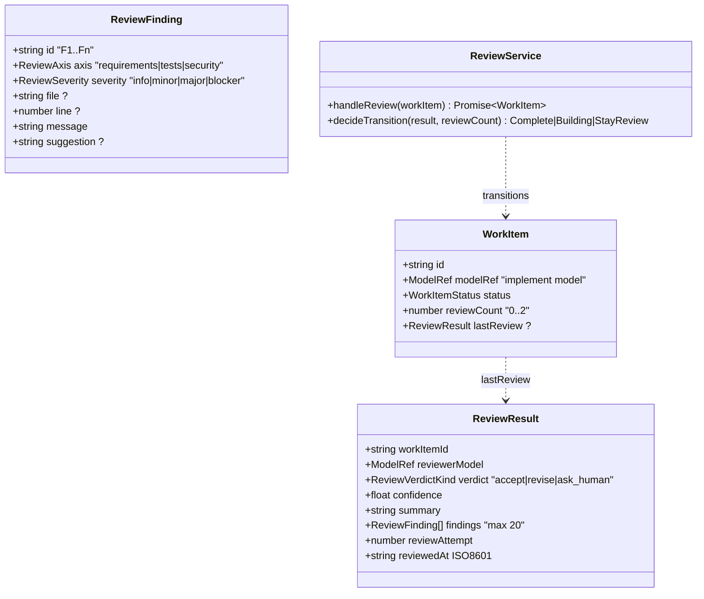
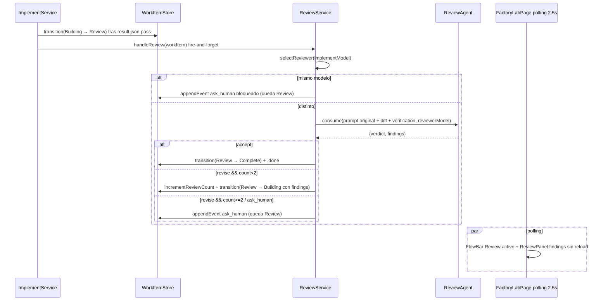
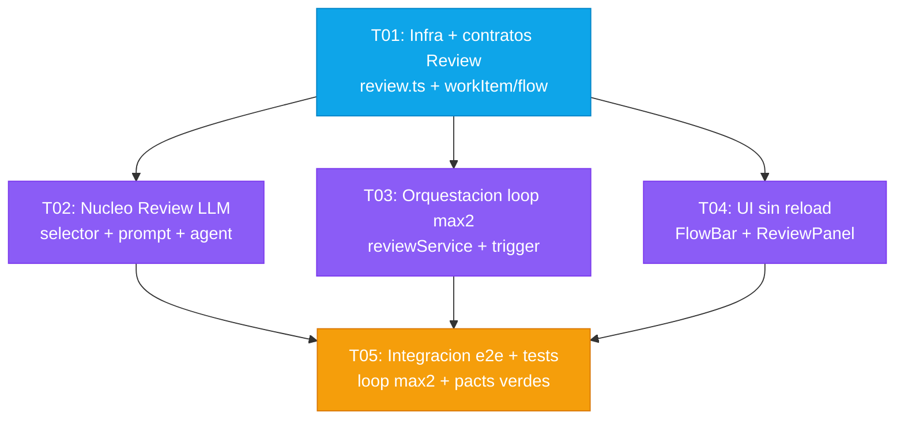

# System Design — Ola 4: Review Automático (Gao)

> **Autor:** Gao (Architect) — 2026-09-02
> **PRD base:** Al terminar `Building` con `result.json pass`, disparar **Review automático con OTRO modelo distinto al de Implement** (si iguales → bloquear y `ask_human`). Revisa 3 ejes — `requirements`, `tests`, `security` — contra prompt original. Deja `findings + veredicto accept/revise/ask_human`. Transiciones: `revise → Building` con findings (max 2 revisiones, después `ask_human`); `accept → Complete` con `.done`; `ask_human → queda en Review` esperando humano. Todo visible en `FlowBar + timeline + ForemanLog` sin reload (polling 2.5s ya existe).
> **Stack existente (no cambiar):** Factory daemon `17680` (`headless-runtime/factory/factoryServer.ts`), `OpencodeServerManager` efímero (`headless-runtime/opencodeServerManager.ts`), Foreman LLM (`headless-runtime/foreman/`), Implement real (`headless-runtime/implement/`), FactoryLab `React 19 + Zustand 5 + Tailwind 4` con polling 2.5s (`useWorkItemsPolling.ts`).
> **Base Ola 3:** `Building → Complete|Triage` directo con bypass de `Review`. Ola 4 **reactiva `Review`** como paso obligatorio post-`pass`: `Building(pass) → Review → Complete|Building|Review-quieto`. `Building(fail) → Triage` NO pasa por Review (sin cambios).

---

## Part A: System Design

### 1. Implementation Approach

#### 1.1 Retos técnicos y decisiones

| Reto | Por qué es difícil | Decisión de diseño |
|------|-------------------|-------------------|
| **Disparar Review solo cuando Building termina en `pass`** | `ImplementService.handleBuilding` hoy hace `transitionWithVerification(Building → Complete)` directo en camino real + mock pact. Si se engancha Review en el lugar equivocado, los pact jobs `job-abc123/job-f10*` (mock pass) entrarían en loop LLM real y romperían `p:verify`. Además hay doble store (`jobs` Map + `workItemStore`) que puede duplicar el trigger. | **Trigger post-`pass` dentro de `ImplementService`, ANTES de `Complete`.** Camino real `job-mtk*` con `verification.overall===pass`: en vez de `transition(Complete)`, hace `transition(Building → Review)` + `reviewService.handleReview(workItem)` fire-and-forget (no bloquea respuesta). Camino `fail` sigue a `Triage` sin Review. Camino pact (`isPactJob`) mantiene `Building → Complete` mock directo, **nunca dispara Review** (guard explícito `if isPactJob return`). Lock `reviewLocks` + `buildingLocks` evitan doble disparo. |
| **Revisor debe ser OTRO modelo distinto al de Implement; si iguales bloquear + `ask_human`** | `modelRef` es opcional y viene de UI (`FactoryLabPage` → `POST /factory/jobs {modelRef}`). El LLM de Implement usa `selectedModel` con fallbacks (`muse-spark → anthropic → openai`). Comparar strings crudos falla por case/variant (`Muse-Spark` vs `muse-spark`, `variant: default`). Si no hay bloqueo determinístico, el mismo modelo se auto-aprueba. | **Nuevo `ReviewModelSelector` puro + determinístico, sin LLM.** Normaliza `providerID/modelID` (trim + lowercase, ignora `variant==="default"`). Tabla de pares fija (ver §1.2). `isSameModel(implement, reviewer)`: si el revisor resuelto == implement normalizado → **NO llama al LLM**, escribe `ReviewResult {verdict: ask_human, findings: [1 finding axis=security severity=info "mismo modelo bloqueado"], confidence: 1.0}` + `appendEvent` + `ForemanLog warn`, queda en `Review`. La comparación ocurre también en UI (deshabilita botón "mismo modelo" con hint) pero la **fuente de verdad es el selector en daemon**. |
| **Revisión en 3 ejes contra prompt original con salida parseable** | El revisor necesita contexto acotado (prompt + diff + `result.json`), no todo el repo. El LLM tiende a devolver prosa + JSON con fences, lo que rompía a Foreman en Ola 3 (`"The user wants me to act as..."`). Sin `json_schema` estricto + parse robusto, el veredicto no es accionable. | **Nuevo `ReviewPrompt` + `ReviewAgent` solo-lectura.** `buildReviewPrompt(input)` compone: rol revisor + prompt original (slice 0-4000) + `createdFiles` + `git diff --stat + diff` acotado (max ~12KB) + `verification.steps` + reglas 3 ejes. `json_schema` estricto `{verdict, summary, confidence, findings[]}` (ver §3). `ReviewAgent.consume` usa `OpencodeServerManager.getClient()` con `tools: {read, glob, grep}` — **SIN `write/edit/bash`** (revisor no toca disco; `bash` prohibido para evitar `pnpm` lateral). Timeout `REVIEW_LLM_TIMEOUT_MS 20000` + 1 retry solo ante timeout/abort (igual patrón Foreman). Parse: `strip fences → primer { último } → zod`; si falla → `ask_human` con finding `axis=requirements severity=major "respuesta no parseable"`. |
| **Loop max 2 revisiones con contador en `WorkItem`** | Sin contador persistido, `revise → Building → Review → revise...` loopea infinito y quema créditos. El contador debe sobrevivir a restart (disco) y ser visible en UI. `timeline` ya existe pero no hay campo dedicado. | **Contador `reviewCount: 0..2` en `WorkItem` (nuevo campo opcional con default 0) + `lastReview?: ReviewResult`.** `ReviewService.decideTransition`: `accept → Complete`; `revise && reviewCount<2 → incrementReviewCount + Building` (findings viajan en `timeline.meta.review` para que `ImplementAgent` los reciba en el rebuild); `revise && reviewCount>=2 → stay Review + ask_human` (sin transición, `appendEvent` con `maxRevisionsReached: true`); `ask_human → stay Review`. Persistencia: `job.json` incluye `reviewCount/lastReview` (vía `writeWorkItemJsonAtomic` existente) + `review.json` (último) + `review-attempt-N.json` (historial, max 3) en `{dir}/`. |
| **Transiciones `Building→Review→Complete/Triage/Building` sin romper máquina de estados** | Hoy `ALLOWED_TRANSITIONS` es `Building: [Complete, Triage, Cancelled, Review]`, `Review: [Complete, Cancelled]`. Falta `Review → Building` (revise) y `Review → Triage` (humano deriva). Si se añade sin cuidado, pact restores con `Review` viejo podrían transicionar a estados inválidos. | **Extender solo `Review`: `Review: [Complete, Building, Triage, Cancelled]`.** `Building` ya tiene `Review`, no se toca. `Review → Building` solo la invoca `ReviewService` (actor `reviewer`, nunca UI directa salvo `POST /jobs/:id/review/retry` humano que re-encola a `Building` si `reviewCount<2`). `Review → Complete` solo con `verdict accept` (actor `reviewer`, crea `.done`). `Review → Triage/Cancelled` solo humano (botón en `ReviewPanel`). `assertTransition` existente lo enforcea; tests pact no usan `Review`, no se rompen. |
| **Todo visible sin reload (FlowBar + timeline + ForemanLog, polling 2.5s ya existe)** | `FlowBar` hoy atenúa `Review` como `"bypass Ola3"` y no tiene badges de veredicto. `GET /factory/jobs` no expone `review/reviewCount`. `ForemanLog` no tiene nivel para review. Si se cambia el polling interval se rompe el contrato vivo. | **No tocar intervalo 2.5s; solo enriquecer payload + UI.** `factoryServer.getAllJobsForList/getSingleJobResponse` añaden `reviewCount, lastReview {verdict, summary, findingsCount, reviewerModel, reviewedAt}, reviewAttempt`. `WorkItemStore.toJSON` igual. `FlowBar`: `Review` pasa a estado `active` pulsante (violeta) cuando `status===Review`, con badge `accept verde / revise ámbar / ask_human rojo` + `N/2 revisiones`. Nuevo `ReviewPanel` (findings por eje + summary + reviewer vs implement + botón humano `Reintentar → Building` / `Derivar a Triage`). `ForemanLog`: `review` usa `level decision` para accept, `warn` para revise/ask_human (sin nuevo level, reusa esquema). `timeline` muestra `runner: Building→Review`, `reviewer: verdict`, `reviewer: Review→Building (revise 1/2)`. |

#### 1.2 Framework y librerías — usar stack existente, cero dependencias nuevas

| Capa | Elección | Justificación |
|------|----------|---------------|
| **Build / UI** | `Vite 7.3 + React 19 + Zustand 5 + Tailwind 4 + radix-ui` (existente) | Polling 2.5s + `FlowBar` + `FactoryLabPage` ya vivos; solo se extienden. |
| **Validación** | `zod 4.3.6` (existente) | `ReviewFindingSchema`, `ReviewResultSchema`, `ReviewLLMResponseSchema`. |
| **LLM** | `@opencode-ai/sdk v2` vía `OpencodeServerManager` singleton (existente) | Revisor reusa cliente efímero; session `Review {id}` con `tools` solo-lectura. |
| **Puertos/HTTP** | `node:http` minimal + `probarBind` + Factory `17680-17690` (existente) | Sin cambios; Review no abre puertos. |
| **Persistencia** | `node:fs` `tmp→rename` en `{worktree}/.agents/factory/{id}/review.json + review-attempt-N.json + job.json` (patrón `resultWriter.ts`/`workItemDisk.ts`) | Atómico, bounded (diff acotado 12KB, findings max 20). |
| **Testing** | `vitest 3.2 + tsx --test` (existente) | Nuevos `tests/review*.test.ts` con mock SDK. |

**Dependencias a NO introducir:** `express`, segundo SDK LLM, cola externa (redis/bull), `dockerode`, `isVague` heurísticas.

#### 1.3 Tabla de pares implement → reviewer + fallback (fuente de verdad: `ReviewModelSelector`)

Normalización: `providerID.trim().toLowerCase()`, `modelID.trim().toLowerCase()`, `variant` se ignora si es `undefined/"default"`. Comparación exacta sobre par normalizado.

| Implement (`modelRef`) | Reviewer primario | Fallback si primario no disponible (auth/404/timeout) |
|---|---|---|
| `opencode-go / muse-spark-1.2-contributor` (default) | `opencode-go / big-pickle` | `anthropic / claude-sonnet-4-20250514` |
| `opencode-go / big-pickle` | `opencode-go / muse-spark-1.2-contributor` | `openai / gpt-4o` |
| `anthropic / *` (cualquier `modelID`) | `openai / gpt-4o` | `opencode-go / big-pickle` |
| `openai / *` | `anthropic / claude-sonnet-4-20250514` | `opencode-go / muse-spark-1.2-contributor` |
| ausente / desconocido | `opencode-go / big-pickle` (si implement efectivo fue `muse-spark`) sino `muse-spark` | `anthropic / claude-sonnet-4-20250514` |

Reglas:
- Si `isSameModel(implement, reviewerPrimario)` → **bloqueo inmediato `ask_human`** sin gastar llamada LLM (caso UI mandó mismo modelo en ambos campos o `modelRef` único).
- Si llamada con primario falla con `isAuthPaymentError`/`model not found` → 1 intento con fallback; si también falla → `ask_human` (`"revisor no disponible"`), queda en `Review` (retryable humano).
- Si falla con timeout/abort → 1 retry mismo modelo (patrón Foreman `withTimeoutRetry`); si persiste → `ask_human` retryable.
- `variant` nunca decide diferencia: `muse-spark variant=default` vs `muse-spark variant=high` → **mismo modelo → bloquear**.

#### 1.4 Patrón de arquitectura

```
POST /factory/jobs ──► WorkItemStore.create(Intake) ──► Foreman decideWithLLM ──► Building
                                                                                    │
                                              ImplementService.handleBuilding (Ola 3, modificado)
                                                runner setup → ImplementAgent (tools escritura)
                                                → VerificationService (pnpm test/build)
                                                → ResultWriter (result.json)
                                                ├─ fail ──► Triage (SIN Review, sin cambios)
                                                └─ pass ──► transition(Building→Review) ──┐
                                                                                           ▼
                                                              ReviewService.handleReview (NUEVO, Ola 4)
                                                                1. acquireReviewLock — 2. ReviewModelSelector
                                                                   (mismo? → ask_human quieto)
                                                                3. ReviewAgent.consume (solo-lectura, json_schema)
                                                                4. ReviewDisk.write (review.json atómico)
                                                                5. decideTransition:
                                                                   accept → Complete (+.done)
                                                                   revise + count<2 → Building (+findings)
                                                                   revise + count>=2 → stay Review/ask_human
                                                                   ask_human → stay Review
                                                                6. ForemanLog + timeline + releaseReviewLock
                                                                                           │
                                                              GET /factory/jobs (enriquecido) ──► polling 2.5s
                                                                FlowBar Review activo + ReviewPanel findings
```

**Patrón:** **Gate post-`pass` + Reviewer read-only con modelo disjunto + Loop acotado con contador persistido + Observabilidad por polling enriquecido**. El revisor nunca escribe código; solo el `ImplementAgent` escribe (en rebuilds con findings como contexto extra).

---

### 2. File List

Rutas relativas a repo root. `*` = crear, `~` = modificar.

```
# ── Contratos compartidos (T01) ──
* shared/types/review.ts                    # ReviewAxis/Severity/VerdictKind, ReviewFinding/Result/Input schemas zod, REVIEW_* constantes (timeout 20s, MAX_FINDINGS 20, MAX_REVISIONS 2, DIFF_MAX 12KB), REVIEW_PAIRS tabla, isSameModel norm, validateReviewResult
~ shared/types/workItem.ts                  # WorkItemSchema += reviewCount (0..2 default 0) + lastReview? ; ALLOWED_TRANSITIONS Review += [Building, Triage] ; helper canReview / isReviewStatus
~ shared/types/flow.ts                      # FLOW_STEPS Review description "Revisión auto" + helper isReviewStatus / verdictBadgeOf (accept/revise/ask_human) — sin cambiar orden lineal

# ── Review LLM núcleo (T02) ──
* headless-runtime/review/reviewModelSelector.ts  # REVIEW_PAIRS, normalizeModelRef, isSameModel, selectReviewer(implement) {reviewer, isBlocked, reason} + fallbackFor(model)
* headless-runtime/review/reviewPrompt.ts         # reviewJsonSchema strict, buildReviewPrompt(input {prompt, createdFiles, diffStat+diff, verification}) acotado, parseReviewResponse robusto (fences + primer{ último}), mapToReviewResult
* headless-runtime/review/reviewAgent.ts          # ReviewAgent.consume(input, reviewerModel): session.create Review {id} + session.prompt {model: reviewer, tools:{read,glob,grep}, json_schema} 20s + retry timeout; NUNCA write/edit/bash
~ headless-runtime/foreman/foremanLog.ts          # helpers reviewAccepted/reviewRevised/reviewAskHuman (level decision/warn) — reusa ForemanLogSchema sin nuevo level
~ headless-runtime/opencodeServerManager.ts       # sin cambio funcional; documentar reuso read-only por ReviewAgent (getClient compartido, sin segundo server)

# ── Orquestación + loop max 2 (T03) ──
* headless-runtime/review/reviewService.ts        # ReviewService.handleReview: reviewLocks, selector→block, agent→disk→decideTransition(accept/revise/ask_human + reviewCount), transitionWithReview, incrementReviewCount, .done solo accept, ForemanLog+timeline
* headless-runtime/review/reviewDisk.ts           # writeReview/readReview/writeAttempt (tmp→rename, review.json + review-attempt-N.json max 3, bounded 64KB)
~ headless-runtime/implement/implementService.ts  # handleBuilding: pass real → transition Building→Review + fire-and-forget reviewService.handleReview ; fail → Triage igual ; pact path SIN Review (early return Complete mock)
~ headless-runtime/implement/implementPrompt.ts   # buildImplementPrompt += sección opcional "Findings de revisión previa (intento N/2)" cuando timeline.meta.review existe (rebuild con contexto)
~ headless-runtime/workItem/workItemStore.ts      # reviewLocks Set + acquire/releaseReviewLock + getReviewCount/incrementReviewCount + transitionWithReview(id,to,result,msg) + toJSON += reviewCount/lastReview
~ headless-runtime/workItem/workItemDisk.ts       # persistir reviewCount/lastReview en job.json (writeWorkItemJsonAtomic ya genérico; asegurar restore los lee con default 0)
~ headless-runtime/factory/factoryServer.ts       # GET /factory/jobs + GET /factory/jobs/:id += reviewCount/lastReview/reviewPreview ; POST /factory/jobs/:id/review/retry (humano: Review→Building si count<2) + POST .../review/triage (humano: Review→Triage) ; POST /factory/jobs propaga modelRef como implementModel

# ── Observabilidad UI sin reload (T04) ──
~ src/features/factoryLab/components/FlowBar.tsx         # Review deja de ser "bypass Ola3": active violeta pulsante en Review + badge verdict (accept/revise/ask_human) + "N/2 revisiones" ; Complete sigue pass/fail
* src/features/factoryLab/components/ReviewPanel.tsx     # NUEVO: summary + reviewer vs implement + findings agrupados por eje (requirements/tests/security) con severity chips + botones humanos (Reintentar→Building / Derivar a Triage) — solo visible en Review o con lastReview
~ src/features/factoryLab/components/WorkItemList.tsx    # muestra reviewCount + verdict chip + link review.json
~ src/features/factoryLab/components/ForemanLogPanel.tsx # resalta [Review] warn/decision sin cambiar polling
~ src/features/factoryLab/components/VerificationPanel.tsx # añade pestaña/link "Review" con review.json tail cuando existe
~ src/features/factoryLab/FactoryLabPage.tsx             # integra ReviewPanel bajo FlowBar cuando status===Review o lastReview existe ; selector modelo avisa "revisor será X (distinto)" y bloquea enviar si iguales
~ src/features/factoryLab/hooks/useWorkItemsPolling.ts   # SIN cambio de intervalo (2.5s); tipar WorkItem con reviewCount/lastReview (solo tipos, mismo fetch)
~ src/stores/workItemStore.ts                            # WorkItem extendido con reviewCount/lastReview (tipos importados de shared/types)

# ── Tests + docs (T05) ──
* tests/reviewModelSelector.test.ts   # pares, same-model block (case/variant), fallback desconocido
* tests/reviewPrompt.test.ts          # json_schema keys, build acotado 12KB diff, parse robusto fences/prosa+JSON, zod fail → ask_human
* tests/reviewService.test.ts         # accept→Complete+.done ; revise→Building count++ ; revise con count=2→stay ask_human ; ask_human→stay ; locks anti-doble ; pact nunca Review
* tests/reviewLoopMax2.test.ts        # e2e loop: Building pass→Review revise(1)→Building pass→Review revise(2)→Building pass→Review ask_human quieto
* tests/reviewPanel.test.tsx          # FlowBar Review activo + badge verdict (si harness UI existe; sino test de helpers flow.ts)
~ docs/system_design.md               # este documento (Ola 4)
~ docs/class-diagram.mermaid          # diagrama §3
~ docs/sequence-diagram.mermaid       # diagrama §4
```

**Total nuevos:** ~7 (`review.ts`, `reviewModelSelector.ts`, `reviewPrompt.ts`, `reviewAgent.ts`, `reviewService.ts`, `reviewDisk.ts`, `ReviewPanel.tsx`) + 5 tests. **Modificados:** ~13 existentes (core: `implementService`, `workItem*`, `factoryServer`, `FlowBar`).

---

### 3. Data Structures and Interfaces

Diagrama completo en `docs/class-diagram.mermaid`. Resumen aquí:



#### Interfaces clave (TypeScript conceptual, sin código)

```ts
// shared/types/review.ts
type ReviewAxis = "requirements" | "tests" | "security";
type ReviewSeverity = "info" | "minor" | "major" | "blocker";
type ReviewVerdictKind = "accept" | "revise" | "ask_human";

interface ReviewFinding {
  id: string;               // "F1", "F2", ...
  axis: ReviewAxis;         // un finding = un eje (si cruza, duplicar con distinto axis)
  severity: ReviewSeverity; // blocker/major ⇒ suele implicar revise; info/minor ⇒ puede ser accept con notas
  file?: string;            // rel path bajo worktree, opcional
  line?: number;            // 1-based, opcional
  message: string;          // qué está mal / qué falta (1-2 frases, español)
  suggestion?: string;      // cómo corregirlo (concreto, archivo/línea)
}
interface ReviewerModelRef { providerID: string; modelID: string; variant?: string }
interface ReviewResult {
  workItemId: string;
  reviewerModel: ReviewerModelRef;   // el que realmente revisó (primario o fallback efectivo)
  implementModel?: ReviewerModelRef; // el que implementó (para auditoría "distintos")
  verdict: ReviewVerdictKind;
  confidence: number;       // 0..1
  summary: string;          // 1-3 frases, español
  findings: ReviewFinding[];// max 20, puede ser [] solo si accept
  reviewAttempt: number;    // 1..3 (reviewCount+1 al momento de revisar)
  reviewedAt: string;       // ISO8601
  durationMs: number;
}
interface ReviewInput {
  id: string;
  prompt: string;                       // prompt ORIGINAL usuario (no el de implement)
  worktreePath: string;
  implementModel?: ReviewerModelRef;
  createdFiles: string[];               // de result.json
  verification: VerificationReport;     // de result.json (steps + overall pass)
  diffStat: string;  // git diff --stat acotado
  diff: string;      // git diff acotado 12KB
}

// headless-runtime/review/reviewModelSelector.ts
interface ReviewerSelection {
  reviewer: ReviewerModelRef;
  isBlocked: boolean;      // true si mismo modelo → no llamar LLM
  blockReason?: string;    // "mismo modelo implement==reviewer (opencode-go/muse-spark...)"
  isFallback: boolean;     // true si reviewer es fallback (no primario)
}
function normalizeModelRef(m?: ReviewerModelRef): string; // "provider/model" lower trim, ignora variant default
function isSameModel(a?: ReviewerModelRef, b?: ReviewerModelRef): boolean;
function selectReviewer(implement?: ReviewerModelRef): ReviewerSelection; // tabla §1.3, nunca retorna igual al implement
function fallbackFor(primary: ReviewerModelRef): ReviewerModelRef;

// headless-runtime/review/reviewService.ts
interface ReviewService {
  handleReview(workItem: WorkItem): Promise<WorkItem | null>;
  // 1. acquireReviewLock — si false return null (anti-doble)
  // 2. selector = selectReviewer(workItem.modelRef) → si isBlocked → ask_human quieto (sin LLM)
  // 3. result = await reviewAgent.consume(input, selector.reviewer) (con 1 fallback si auth/model-not-found)
  // 4. reviewDisk.writeReview(dir, result) + writeAttempt
  // 5. decideTransition(result, getReviewCount(id)):
  //      accept → transitionWithReview(Complete) + ensure .done
  //      revise && count<2 → incrementReviewCount + transitionWithReview(Building, meta {review: result})
  //      revise && count>=2 → appendEvent ask_human maxRevisions (stay Review)
  //      ask_human → appendEvent (stay Review)
  // 6. foremanLog + releaseReviewLock
  decideTransition(result: ReviewResult, reviewCount: number): "Complete" | "Building" | "StayReview";
}

// json_schema del revisor (reviewPrompt.ts) — strict, sin additionalProperties
{
  type: "object",
  properties: {
    verdict: { type: "string", enum: ["accept", "revise", "ask_human"] },
    summary: { type: "string", description: "1-3 frases en español" },
    confidence: { type: "number", minimum: 0, maximum: 1 },
    findings: { type: "array", maxItems: 20, items: {
      type: "object",
      properties: {
        id: { type: "string" },
        axis: { type: "string", enum: ["requirements", "tests", "security"] },
        severity: { type: "string", enum: ["info", "minor", "major", "blocker"] },
        file: { type: "string" }, line: { type: "number" },
        message: { type: "string" }, suggestion: { type: "string" }
      }, required: ["id", "axis", "severity", "message"], additionalProperties: false
    }}
  },
  required: ["verdict", "summary", "confidence", "findings"], additionalProperties: false
}
```

**Ejes de revisión (instrucción al LLM, resumida):**
- `requirements`: ¿el diff hace lo que pide el prompt original y nada más? (scope extra / faltante → finding; `blocker` si no cumple lo pedido).
- `tests`: ¿hay test que cubra el cambio y `verification` es creíble? (sin test para feature / test que no aserta nada → `major`; test ausente pero cambio trivial → `minor`).
- `security`: secretos hardcodeados, `rm -rf`/curl|sh, path traversal fuera de worktree, `eval`/deserialización insegura (`blocker` si hay secreto o RCE; `major` si patrón riesgoso).

**Regla veredicto (al LLM):** `accept` solo si 0 findings `blocker/major`, o solo `info/minor` (≤3); `revise` si ≥1 `major` o `blocker` corregible en ≤3 archivos; `ask_human` si ambiguo/contradictorio/riesgoso para auto-fix (ej: requiere credencial, decisión producto, o prompt original vago).

**Persistencia en disco:**
```
{worktree}/.agents/factory/{id}/
  job.json               # += reviewCount, lastReview (resumen)
  result.json            # Ola 3, sin cambios (pass)
  review.json            # ReviewResult último (tmp→rename + zod)
  review-attempt-1.json  # historial (hasta 3)
  logs.ndjson            # += reviewer: verdict + transiciones
  .done                  # SOLO si Review accept → Complete (Building pass ya NO crea .done)
```

> Cambio importante vs Ola 3: `ImplementService` en camino real **ya no crea `.done` al pasar verificación**; solo escribe `result.json pass` y transiciona a `Review`. El `.done` lo crea `ReviewService` al `accept`. Así `Complete` siempre implica "pasó implement + pasó review".

---

### 4. Program Call Flow

Diagrama completo en `docs/sequence-diagram.mermaid`. Resumen:



**Variantes:**
- `Building fail → Triage`: no toca Review (igual que Ola 3).
- `Pact job` (`job-abc123`, `job-f10*`, `playground-*`): `Building → Complete` mock directo, **nunca Review** (pacts verdes sin LLM).
- `Revisor sin SDK / timeout persistente / fallback caído`: `ask_human` quieto con finding `requirements/major "revisor no disponible"`, retryable humano vía `POST /:id/review/retry`.
- `Humano en Review`: `POST /:id/review/retry → Building` (si `count<2`, reinyecta findings) o `POST /:id/review/triage → Triage` o `POST /:id/review/accept → Complete` (override con motivo, deja `.done`).

---

### 5. Anything UNCLEAR

| # | Incerto / Asunción | Decisión tomada | Necesita confirmación PO |
|---|-------------------|-----------------|--------------------------|
| 1 | **¿`Building pass` debe esperar a Review para mostrar `pass`?** PRD: `accept → Complete con .done`. | **Sí.** `Complete/.done` solo tras `accept`. Entre `Building pass` y veredicto, UI muestra `Review activo` (no `Complete`). `result.json pass` ≠ `Complete`. | Confirmar que PO acepta que `pass` de verificación ya no es `Complete` (cambia semántica Ola 3). |
| 2 | **¿Review revisa también jobs que hoy van a `Triage`?** | **No.** Solo `pass` va a Review. `fail` sigue a `Triage` sin revisor (el fallo ya es veredicto). | Si PO quiere review de fails, añadir en Ola 4.1. |
| 3 | **¿El rebuild con findings puede tocar >3 archivos?** | **No.** `IMPLEMENT_MAX_FILES_MINIMAL=3` sigue vigente; findings que pidan refactor grande → el LLM debe acotarse o el exceso va a `Triage` por regla existente. El prompt de rebuild dice "corrige solo findings `blocker/major` en ≤3 archivos". | Confirmar límite 3 también para revisiones. |
| 4 | **¿Qué dif se le pasa al revisor?** | `git diff HEAD --stat` + `git diff HEAD -- <createdFiles>` acotado a 12KB (head). Si el diff excede, se envía stat + primeros 12KB + nota `truncado`. No se envía repo completo. | Ajustar 12KB si PO quiere más contexto. |
| 5 | **¿Timeout del revisor?** | `REVIEW_LLM_TIMEOUT_MS 20000` + 1 retry timeout/abort; `SESSION_CREATE 8000` (igual Foreman). Total peor caso ~48s en `Review` (UI muestra spinner). | Confirmar si 20s es suficiente para `big-pickle`. |
| 6 | **¿`ask_human` necesita notificación fuera de UI?** | Ola 4: solo UI (badge rojo + ForemanLog `warn` + timeline). Sin Slack/mail. `GET /factory/jobs` permite filtrar `status=Review` para dashboard humano. | Si PO quiere webhook, Ola 5. |
| 7 | **`variant` en comparación de modelos** | Se ignora si `default/undefined`. `muse-spark/default` vs `muse-spark/high` = mismo → bloquear. | Confirmar que `variant` nunca distingue revisor. |

---

## Part B: Task Decomposition

### 6. Required Packages

```txt
# Ya en package.json (no instalar nada nuevo):
- zod@^4.3.6                 : ReviewFinding/Result schemas + WorkItem extension
- @opencode-ai/sdk@1.18.18   : ReviewAgent (session.create + session.prompt json_schema, tools read/glob/grep)
- react@^19.2.4 + zustand@^5 : FactoryLab + ReviewPanel + FlowBar
- tailwindcss@^4.2.1         : badges verdict + severity chips
- node:fs + node:path + node:child_process : reviewDisk tmp→rename + git diff acotado
- vitest@^3.2 + tsx@^4.21.0  : tests/review*.test.ts

# A instalar: NINGUNA dependencia nueva.
```

### 7. Task List (ordenada por dependencia)

> **Hard limits respetados:** 5 tareas, cada una ≥3 archivos, T01 = infraestructura + contratos + config, agrupadas por módulo/layer, dependencias en estrella (T02/T03/T04 solo dependen de T01; T05 integra).

| ID | Nombre | Archivos (crear `*` / modificar `~`) | Dependencias | Prioridad | Descripción para Engineer |
|----|--------|--------------------------------------|--------------|-----------|---------------------------|
| **T01** | **Proyecto infraestructura + contratos Review** | `* shared/types/review.ts` (axis/severity/verdict, Finding/Result/Input schemas, `REVIEW_LLM_TIMEOUT_MS 20000`, `REVIEW_MAX_FINDINGS 20`, `REVIEW_MAX_REVISIONS 2`, `REVIEW_DIFF_MAX_BYTES 12KB`, `REVIEW_PAIRS`, `normalize/isSameModel/validate`)<br>`~ shared/types/workItem.ts` (`reviewCount` 0..2 default 0 + `lastReview?`, `ALLOWED_TRANSITIONS.Review=[Complete,Building,Triage,Cancelled]`, helpers)`<br>`~ shared/types/flow.ts` (Review label "Revisión auto" + `verdictBadgeOf` + `isReviewStatus`)<br>`~ package.json` (verificar scripts `typecheck/test/build`, sin nuevas deps)<br>`~ tsconfig.json` + `~ tsconfig.headless.json` (paths `shared/`/`headless-runtime/` OK) | — | **P0** | Solo tipos + constantes + máquina de estados. Sin lógica LLM. Validar `pnpm typecheck` en verde. `reviewCount` opcional con default 0 para que restores viejos no rompan zod. |
| **T02** | **Núcleo Review LLM (selector + prompt + agente read-only)** | `* headless-runtime/review/reviewModelSelector.ts` (tabla pares §1.3, `selectReviewer` nunca igual, `fallbackFor`, bloqueo determinístico)<br>`* headless-runtime/review/reviewPrompt.ts` (`reviewJsonSchema` strict, `buildReviewPrompt` con prompt original 4000 + diff 12KB + verification, `parseReviewResponse` fences→`{}`→zod, fail→`ask_human`)<br>`* headless-runtime/review/reviewAgent.ts` (`consume` con `OpencodeServerManager.getClient()`, `session.create Review {id}`, `session.prompt {model: reviewer, tools:{read,glob,grep}, json_schema}` 20s + retry timeout, SIN write/edit/bash)<br>`~ headless-runtime/foreman/foremanLog.ts` (helpers `reviewAccepted/Revised/AskHuman`, levels decision/warn)<br>`~ headless-runtime/opencodeServerManager.ts` (solo comentario reuso read-only + export `getClient` ya existente) | **T01** | **P0** | LLM puro testeable con mock SDK. Probar: distinto siempre, mismo→`isBlocked`, parse prosa+JSON, timeout→retry→`ask_human`. No tocar `ImplementService` aún. |
| **T03** | **Orquestación + loop max 2 + transiciones** | `* headless-runtime/review/reviewService.ts` (`handleReview` + `reviewLocks` + `decideTransition` accept/revise/ask_human + `incrementReviewCount` + `.done` solo accept + `ForemanLog`/`timeline`)<br>`* headless-runtime/review/reviewDisk.ts` (`writeReview/readReview/writeAttempt` tmp→rename, `review.json` + `review-attempt-N.json`)<br>`~ headless-runtime/implement/implementService.ts` (`pass` real → `Building→Review` + `handleReview` fire-and-forget; `fail`→`Triage` igual; pact early-return SIN Review; NO crear `.done` en pass)<br>`~ headless-runtime/implement/implementPrompt.ts` (sección `Findings revisión previa N/2` cuando `meta.review` existe)<br>`~ headless-runtime/workItem/workItemStore.ts` (`reviewLocks`, `getReviewCount/incrementReviewCount`, `transitionWithReview`, `toJSON` += review)<br>`~ headless-runtime/workItem/workItemDisk.ts` (persist/restore `reviewCount/lastReview`)<br>`~ headless-runtime/factory/factoryServer.ts` (`GET` enriquecidos + `POST /:id/review/retry|triage|accept` humanos con guards `count<2`/`assertTransition`) | **T01** | **P0** | Corazón del loop. Tests: `accept→Complete+.done`, `revise→Building count++`, `revise count=2→stay`, `ask_human→stay`, anti-doble lock, pact nunca Review. Paralelizable con T02 (contratos T01 fijan interfaz `ReviewAgent.consume`). |
| **T04** | **Observabilidad UI sin reload (FlowBar + ReviewPanel + timeline)** | `* src/features/factoryLab/components/ReviewPanel.tsx` (summary + reviewer-vs-implement + findings por eje con severity chips + botones `Reintentar→Building` / `Derivar a Triage` / `Aceptar override`)<br>`~ src/features/factoryLab/components/FlowBar.tsx` (quitar `bypass Ola3`; `Review` active violeta pulsante + badge verdict + `N/2`)<br>`~ src/features/factoryLab/components/WorkItemList.tsx` (chip verdict + `reviewCount` + link `review.json`)<br>`~ src/features/factoryLab/components/ForemanLogPanel.tsx` (resaltar `[Review]`)<br>`~ src/features/factoryLab/components/VerificationPanel.tsx` (pestaña `Review` con tail `review.json`)<br>`~ src/features/factoryLab/FactoryLabPage.tsx` (monta `ReviewPanel` en `Review`/con `lastReview`; hint `revisor será X (distinto)` + bloqueo envío si iguales)<br>`~ src/stores/workItemStore.ts` + `~ src/features/factoryLab/hooks/useWorkItemsPolling.ts` (tipos `reviewCount/lastReview`, mismo intervalo 2.5s) | **T01** | **P1** | Solo UI + tipos. Mockear `lastReview` en Storybook/tests. `Review` debe verse activo <2.5s tras `Building→Review` sin `window.reload`. Paralelizable con T02/T03. |
| **T05** | **Integración e2e + guards pact + docs** | `* tests/reviewModelSelector.test.ts` (pares, case/variant, desconocido→default)<br>`* tests/reviewPrompt.test.ts` (schema keys, acotado 12KB, fences/prosa+JSON, zod-fail→`ask_human`)<br>`* tests/reviewService.test.ts` (transiciones + `.done` + locks + mismo-modelo + fallback caído)<br>`* tests/reviewLoopMax2.test.ts` (loop 2 revisiones → `ask_human` quieto; rebuild recibe findings)<br>`* tests/reviewPanel.test.tsx` (badges verdict + `N/2`; o helpers `flow.ts` si no hay harness)<br>`~ docs/system_design.md` + `~ docs/sequence-diagram.mermaid` + `~ docs/class-diagram.mermaid` (este diseño) | **T02, T03, T04** | **P1** | Cierre. Validar e2e real: `POST /factory/jobs` → `Building pass` → `Review` visible ≤2.5s → `accept→Complete+.done` / `revise→Building (1/2)` / `2×revise→ask_human quieto`. Pacts F01-F14 siguen verdes (pact nunca Review). |

### 8. Shared Knowledge

```
- Gate Review: solo Building con verification pass va a Review. fail → Triage directo (sin revisor). Pact jobs (job-abc123/job-f10*/playground-*) nunca van a Review (mock Complete directo). Fuente: implementService.isPactJob existente.
- Modelo disjunto obligatorio: ReviewModelSelector.normalize (lower+trim, ignora variant default) + REVIEW_PAIRS (§1.3). Mismo modelo → bloqueo determinístico ask_human SIN gastar LLM. Fallback: 1 intento primario → si auth/model-not-found, 1 intento fallback; si timeout/abort, 1 retry mismo modelo; si persiste → ask_human retryable.
- Revisor read-only: ReviewAgent tools={read,glob,grep}. PROHIBIDO write/edit/bash en review (aunque el SDK los ofrezca). Session title `Review {id}`, directory=worktree resuelto. Timeout 20s + 1 retry (patrón Foreman withTimeoutRetry).
- Prompt revisor: prompt ORIGINAL usuario (0-4000) + createdFiles + git diff stat+diff acotado 12KB + verification.steps. json_schema strict {verdict,summary,confidence,findings[max20]}. Parse robusto fences→primer{último}→zod; fail → ask_human (no revise fantasma).
- Loop max 2: WorkItem.reviewCount 0..2 (default 0, en job.json) + lastReview. accept→Complete(+.done); revise&&count<2→Building(meta.review=findings, count++); revise&&count>=2→stay+ask_human; ask_human→stay. .done SOLO lo crea ReviewService en accept (ImplementService ya NO crea .done en pass).
- Transiciones Ola 4: Building→[Review(pass)|Triage(fail)|Cancelled]; Review→[Complete(accept)|Building(revise<2)|Triage(humano)|Cancelled(humano)]; ask_human = SIN transición (appendEvent). assertTransition lo enforcea.
- Observabilidad sin reload: polling 2.5s intacto; GETs enriquecidos con reviewCount/lastReview/reviewPreview. FlowBar Review activo violeta + badge verdict + N/2. ReviewPanel findings por eje. ForemanLog: accept=decision, revise/ask_human=warn, mensaje `[Review] {id} → {verdict} ...`. timeline: runner Building→Review, reviewer verdict, reviewer Review→Building/Complete.
- Persistencia: review.json (último) + review-attempt-N.json (max 3) tmp→rename + zod; job.json con reviewCount/lastReview; logs.ndjson con eventos reviewer. Bounded: diff 12KB, findings 20, review.json 64KB.
- Rebuild con findings: implementPrompt añade sección "Findings revisión previa N/2 (corrige solo blocker/major en ≤3 archivos)" desde timeline.meta.review. MAX_FILES_MINIMAL=3 sigue vigente también en revisiones.
- Humanos en Review: POST /:id/review/retry (→Building si count<2), /triage (→Triage), /accept (→Complete override con motivo). Todos loguean actor user + exigen assertTransition.
```

### 9. Task Dependency Graph



---

> **Riesgos y mitigaciones**
> - **Riesgo:** Revisor se auto-aprueba porque `modelRef` es opcional y el fallback elige el mismo. **Mitig:** `selectReviewer` nunca retorna igual al implement normalizado (incluye rama `desconocido`); doble guard en `ReviewService` pre-LLM + assert en `factoryServer` al crear job (si UI manda `implement==reviewer` explícito, se reescribe a par y se loguea `warn`).
> - **Riesgo:** Loop infinito `revise→Building→revise...` quema créditos. **Mitig:** `reviewCount` persistido en `job.json` + `reviewLocks` + `decideTransition` con techo 2; el tercer `revise` se convierte en `ask_human` quieto. Tests `reviewLoopMax2` lo fijan.
> - **Riesgo:** Revisor devuelve prosa sin JSON (como Foreman Ola 3) y bloquea el pipeline. **Mitig:** `json_schema` + instrucción `SOLO JSON` + parse robusto + fallback `ask_human` (nunca `accept` fantasma). `confidence` baja (<0.6) con `accept` → se degrada a `ask_human` en `ReviewService`.
> - **Riesgo:** `Building pass` ya no es `Complete` y el usuario cree que regresó. **Mitig:** `FlowBar` muestra `Review` activo inmediatamente (≤2.5s) + `ForemanLog "→ Review (pass, dispara revisión)"`; `result.json pass` documentado como "implement ok, pendiente review". Pacts no se afectan (usan mock sin Review).
> - **Riesgo:** Diff gigante (reorder) excede contexto del revisor y alucina findings. **Mitig:** acotado 12KB + `stat` completo + `createdFiles`; si truncado se añade nota explícita y el prompt ordena "si falta contexto, `ask_human`, no inventes". `grep/read` read-only permiten al revisor ampliar puntualmente.
> - **Riesgo:** `.done` huérfano (Ola 3 lo creaba en `pass`, Ola 4 solo en `accept`). Jobs migrados con `.done` pero sin `review.json` podrían mostrar `Complete` sin review. **Mitig:** restore: si `Complete` sin `lastReview` y `createdAt` < Ola 4, se marca `meta.legacyBypassReview: true` en timeline (visible en UI como "Complete pre-Review"); jobs nuevos siempre pasan por Review.
> - **Riesgo:** Doble trigger `Building→Review` (doble `handleBuilding` por retry + `jobs` Map legacy). **Mitig:** `buildingLocks` existente + `reviewLocks` nuevo + guard `if status!==Building return` + `if status===Review && lastReview fresh return` antes de `handleReview`.
