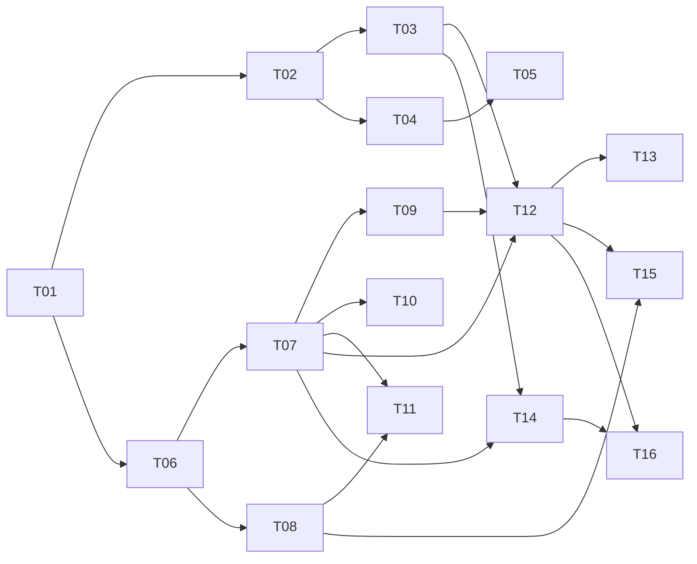

# Warp Factories — Tickets Tracer-Bullet para TermCanvas Web

> **Fuente**: `WarpFactories.md` (19 secciones, 2026-08-29) + `WarpFactories-UserStories.md` (155 historias, 18 épicas).
> **Método**: `to-tickets` — vertical slices demoables, cada ticket corta schema→API→UI→tests. Blocking edges explícitos para trabajar la **frontera** (tickets sin bloqueos pendientes).
> **Tracker**: Local files por ahora (`.scratch/warp-factories/issues/NN-slug.md`). Al migrar a GitHub/Linear, los `Blocked by` se mapean a native blocking links y label `ready-for-agent`.
> **Convención**: `NN` en orden de dependencias (bloqueadores primero). `Puntos` suman ~410 de las 155 US. Estimación relativa Fibonacci.

---

## Índice de Tickets (16)

| # | Ticket | Puntos | Bloqueado por | Entrega demoable |
|---|--------|--------|---------------|------------------|
| T01 | Prefactor — Foundations, Design System y App Shell | 8 | — | App corre, routing, layout, store base, a11y |
| T02 | Factory Core — CRUD + Foreman alias | 8 | T01 | Crear/listar factory, alias ≤60 `[A-Za-z0-9 ._-]` único case-insensitive, una policy |
| T03 | Work Item Lifecycle — Intake a Handoff | 13 | T02 | Work item Triage→Planning→Building→Reviewing→Complete/Cancelled, skip logic, gates, handoff |
| T04 | Agentes — CRUD + Harness por agente + Exactly-One-Foreman | 8 | T02 | Agents 1-4 defaults, harness `oz|claude|codex|gemini` por agente, `reasoningLevel` solo codex, auth `managedSecret|workerEnvironment`, custom VERIFY |
| T05 | Skills — Registry global vs per-agent | 5 | T04 | `skills/` global y `agents/<name>/skills/` aislado, preview `SKILL.md`, self-improvement edita skill |
| T06 | Definitions as Code — Parser v1alpha1 + PR checks + Schemas | 13 | T01 | Parsea `factory.yaml`/`agents`/`automations`/`runners`/`scorers`/`skills`, valida file+line, `warp/factory-config` atómico, schemas unauthenticated |
| T07 | Automations Engine — Triggers, Matching y Editor | 13 | T06 | 20 GitHub + 7 Slack + 6 Linear + 1 Jira + 2 GitLab + `schedule`/`factory` triggers, AND/OR, `in`/`not_in`, schedule UTC `@daily/@every 1h`, overlapping warning, editor con More filters |
| T08 | Runners — Model + Límites + Selección per-agent | 5 | T06 | `platform os/arch`, `dockerImage`/`mac.version 14/15/26/27 default 26`, `instanceShape` juntos, max 32/64 hosted, queue por team, `workerHost` override, OTel placeholder |
| T09 | Integración GitHub — Dual-Label Routing + Filters per-event | 13 | T07, T08 | App connect + 2 automations default, dual `factory:<alias>`+`@warp-factory` (solo new content, ignora edit/code block/bot), 12 filtros con Appears on, CI re-run solo Warp, PR respeta branch protection |
| T10 | Integración Slack — Connect + Intake + Home Tab | 8 | T07 | `Add to Slack` + invite por channel + 👀, triggers `app_mention/message_posted/reaction_added/member_joined_channel` + filtros, `reaction_added [ticket]`, plain reply solo continúa si work item existe, Home tab, linked account + privacy |
| T11 | Integraciones Linear / Jira / Schedule / Factory + GitLab | 8 | T07, T08 | Linear OAuth teams + `agent_session_created` solo en files + loop caution, Jira Cloud Rovo + `project_keys`+`keywords` case-insensitive, `schedule`/`factory` E2E, GitLab `GitLab.com only` + Premium + manager 1y + bot `*-warp-*` Developer + `factory/<slug>` draft |
| T12 | Factory Dashboard — Observabilidad Completa | 13 | T03, T07, T09 | Sidebar factory vs team-level `Runs/MCPs/Secrets/Integrations`, `Factory definition` por modo, 8 métricas con disclaimers (`merged>opened`, `Autonomy push`, `Cost estimate S/M/L/XL`), Activity kanban `Created by=you`, detail `View agent/Event history/Stop task` sin confirmación, Runs `timeline/cost/Sub-agents/View session`, Settings `EXECUTOR/CREATOR` |
| T13 | Measure and Improve — Scorers, Benchmarks, Self-Improvement | 13 | T12 | Scorer CRUD + invariante `≥1 passing y ≥1 failing` + `samplingRate 0|25` + manual/re-score + threshold solo display, benchmark single-agent + repetitions + `Correctness` + no winner + credit no model, self-improvement grouping + `Regressions addressed` |
| T14 | Factory MCP + Factory API — Stubs Drop-In | 8 | T03, T07 | MCP 19 tools (`list_factories`→`complete_task`, `start_working=true` worktree, `message_foreman`, `list_notification_routes` best-effort, headless `Bearer`, sin scopes), Factory API `GET ?search` case-insensitive + `POST /runs` `prompt`+`ticket_ref <source>:<id>` + Agent API `GET /followups/cancel`, mismo paths que Warp real |
| T15 | Infra, Sizing y Governance — Control/Execution + 3 Patterns | 5 | T08, T12 | Diagrama control vs execution, ZDR "self-hosted no offline", tabla Warp-hosted vs self-hosted (outbound sin inbound, Docker/K8s/Direct, OTel), 3 elecciones Enterprise, 4 credential boundaries, governance sin factory-role, metering credits, checklist 7 pasos, sizing `product surface` + 3 patterns `CLI/Warp-hosted/Self-hosted`, wizard 7 pasos + verbatim first work item |
| T16 | Troubleshooting — Help Center | 3 | T12, T14 | 9 fixes (setup 4 + `work isn't starting` per-source + `two runs` + `Stop task/stuck/no PR`), searchable, linkeado desde dashboard |

**Estado de frontera:** la implementación local de T01–T16 está cerrada para QA; `partial` indica paridad o integración live pendiente. Las dependencias originales se conservan en el grafo para trazabilidad.

## Implementation closure matrix

| Ticket | Estado de entrega | Implementación verificable |
|---|---|---|
| T01 | Complete | React/Vite shell, typed navigation, providers, ErrorBoundary, Tailwind tokens and test configuration |
| T02 | Complete | Factory CRUD, persistence, alias/name validation, selection/pinning, glossary and single-policy enforcement |
| T03 | Complete (implemented slice) | Work-item machine, skip rules, human gates, terminal transitions and Activity filtering |
| T04 | Partial | Agent models/defaults and page surfaces exist; live harness/provider credential workflows remain |
| T05 | Complete (registry slice) | Global/per-agent skill registry, preview and self-improvement surface |
| T06 | Partial | Definitions parsers/schemas exist; full PR-check integration remains |
| T07 | Complete (implemented slice) | Trigger catalogue, matching primitives and schedule/factory support |
| T08 | Complete (implemented slice) | Runner platform/shape constraints and selection surfaces |
| T09 | Complete (local routing slice) | `src/lib/factory/domain/github.routing.ts`, `github.routing.derive.ts` (5 presets factory-aware `valid_routing`), `src/components/routing/GitHubRoutingPage.tsx`, focused routing tests; dual label+mention gate with edit/bot/code exclusions + valid_routing factory-aware |
| T10 | Partial | Slack integration/deep-dive surfaces; live OAuth, event subscriptions and Home tab remain |
| T11 | Partial | Linear/Jira/GitLab and schedule/factory surfaces; live provider calls remain |
| T12 | Partial | Dashboard, Activity, Runs and Settings slices; full product parity remains |
| T13 | Partial | Scorer/self-improvement surfaces; benchmark execution remains |
| T14 | Complete (local stub contract) | `src/lib/factory/domain/factoryApi.*`, `factoryApi.router.ts`, `factoryApi.routes.ts`, MCP stub and Factory/Agent API tests |
| T15 | Complete (Quickstart slice) | `src/lib/factory/domain/quickstart.wizard.ts`, `quickstart.data.ts`, `src/lib/factory/hooks/useQuickstart.ts`, `src/components/quickstart/QuickstartWizard.tsx` and focused tests |
| T16 | Complete | Troubleshooting data/page and Help navigation integration |

**Validation receipt:** 39 Vitest files / 902 tests passed (commit·pnpm check·39/902); `tsc --noEmit` 0, `tsc -b` 0, oxlint 0 across 158 files; Vite production build passed (2319 modules). Browser Playwright smoke and debugger MCP were unavailable. Live provider/API validation is blocked without credentials and tokens by design. Hotfix `valid_routing` preset factory-aware 5 presets.

---

## Tickets

### T01 — Prefactor: Foundations, Design System y App Shell

**What to build:** La app arranca con layout shell, navegación, store y validación base para que cualquier vertical slice posterior aterrice en verde. Sin esto, ningún ticket de feature puede hacer demo.

**Blocked by:** None — can start immediately

**Status:** complete

**US cubiertas:** Infra transversal (no US específica, habilita todas)

- [ ] Vite + React + TS + Tailwind v4 corre (`pnpm --filter web dev` port 5174 y `vite build` verde)
- [ ] Routing + sidebar shell + tema + a11y baseline (focus, labels)
- [ ] Store (ej. Zustand) con slices `factories`, `workItems`, `runs`, `agents`, `automations`, `runners`, `skills`, `scorers`
- [ ] Zod base + helpers de validación file+line (reusable por T06)
- [ ] Tests base (vitest) y CI `warp/factory-config`-style: annota file+line en PRs (placeholder para T06)
- [ ] `.scratch/warp-factories/issues/01-prefactor-foundations.md` creado como contract del prefactor

---

### T02 — Factory Core: CRUD + Foreman alias + Una Policy

**What to build:** Crear, listar y ver una factory. El alias (Foreman name) valida charset/longitud/unicidad y se copia del name por defecto. Una fábrica = una policy.

**Blocked by:** T01

**Status:** complete

**US cubiertas:** US-001, US-002, US-005, US-006, US-048 (alias), US-052 (identidad por path parcial)

- [ ] `Factories > New`: `name` required, `alias` auto-copia `name`, regex `[A-Za-z0-9 ._-]` max 60, único case-insensitive por workspace → error visible
- [ ] Listar factories en sidebar; click abre en Dashboard; Settings > Identity muestra Foreman name
- [ ] Enforce "una policy por factory": intento de segunda policy sugiere crear factory separada
- [ ] Help/glosario diferencia Warp Factories (producto) vs factory (instancia) vs foreman (agente)
- [ ] Persistencia local (mock) y tests Gherkin US-001/002/005

---

### T03 — Work Item Lifecycle: Intake → Handoff

**What to build:** Un work item nace con source context, avanza `Triage→Planning→Building→Reviewing→Complete/Cancelled`, con skip logic y gates humanos, y termina en handoff con evidencia (sin merge).

**Blocked by:** T02

**Status:** complete

**US cubiertas:** US-003, US-007, US-008, US-009, US-010, US-011, US-012, US-013, US-014, US-015, US-016

- [ ] Intake preserva `ticket/thread origen + prompt` en detail pane (US-007)
- [ ] Foreman skipea Triage si request ya es claro, y skipea Planning si cambio pequeño (US-008, US-011)
- [ ] Triage stub: produce `evidence/scope/complexity/open questions` (US-009)
- [ ] Planning: escribe `draft PR` en `factory/<slug>` con `validation criteria` (US-010); gate "Waiting for approval" bloquea Building si hubo Planning y no hay approval (US-012)
- [ ] Building: continúa mismo `branch/PR` del spec, agrega `tests+validation`, captura `evidencia visual` si user-facing + computer use, nunca mergea (US-013, US-014)
- [ ] Reviewing: `accept/revise/ask human` advisory, no auto-merge, puede re-ejecutar validación (US-015)
- [ ] Handoff: foreman presenta `evidencia+findings`, estado `Complete` no mergea, `Cancelled` terminal (US-016); `Event history` de N runs en un solo work item (US-003)

---

### T04 — Agentes: CRUD + Harness por Agente + Exactly-One-Foreman

**What to build:** Configurar los agentes de la factory, cada uno con su harness/modelo/runner/secrets, con validación de que hay exactamente un foreman.

**Blocked by:** T02

**Status:** partial — implemented agent surface; live harness/provider credential workflows remain

**US cubiertas:** US-017, US-018, US-019, US-020, US-021, US-022, US-023, US-024, US-025, US-026, US-027, US-053

- [ ] Toggle 1-4 defaults (Triage/Spec/Implement/Review) al crear; error si 0 además de foreman (US-017)
- [ ] `Factory > Agents > <agent>`: editar `description/harness/model/runner/workerHost/mcpServers/secrets/instructions`; Warp-managed valida+commitea en un paso; GitHub-backed read-only con banner + link (US-018, US-019)
- [ ] Harness por agente `oz|claude|codex|gemini`; `reasoningLevel` solo `codex`; `auth: managedSecret|workerEnvironment` (US-020, US-022, US-023); Free solo `oz` (gate Build plan) (US-021)
- [ ] Tooltip de optimización por rol (orchestration/research/technical reasoning/coding/blind spots) (US-024)
- [ ] Custom agent `VERIFY` no required para todo work item, disparable por automation (US-025)
- [ ] Validación `exactly one FOREMAN` (alias `MAIN`) con file+line (US-026); wizard no pre-elige modelos (US-027)
- [ ] Frontmatter `agent.md` completo (US-053)

---

### T05 — Skills: Registry Global vs Per-Agent

**What to build:** Un registry de skills donde `skills/<name>/SKILL.md` es global y `agents/<name>/skills/<name>/SKILL.md` es per-agent, con preview y flujo de self-improvement.

**Blocked by:** T04

**Status:** complete

**US cubiertas:** US-028, US-029, US-030, US-031, US-032, US-033, §5 Skills

- [ ] Listar skills globales y per-agent; resolver herencia correctamente (US-028, US-029)
- [ ] Preview `SKILL.md` con frontmatter + argument syntax renderizado y validado (US-030)
- [ ] Customs extienden baseline GitHub/Slack/tracker (US-031) y no amplían acceso: sin `secrets` allowlist falla por credential (US-032)
- [ ] Self-improvement puede editar `skills/<name>/SKILL.md` y abrir PR con `Regressions addressed` (US-033)

---

### T06 — Definitions as Code: Parser v1alpha1 + PR Checks + Schemas

**What to build:** Parser y validador que es source of truth de la factory: entiende `factory.yaml`, `agents`, `automations`, `runners`, `scorers`, `skills`, anota `file+line`, aplica atómico y valida contra schemas publicados.

**Blocked by:** T01

**Status:** partial — parsers/schemas implemented; full PR-check integration remains

**US cubiertas:** US-046, US-047, US-048, US-049, US-050, US-051, US-052, US-053, US-054, US-055, US-056, US-057, US-058, US-059, US-026 (foreman), §7 completo

- [ ] `factory.yaml`: `schemaVersion` solo `v1alpha1`, keys case-sensitive, `repositories` required, `agentDefaults` `model xor harness`, `alias`/`credentialStrategy`/`integrations` (solo `slack|linear|jira`) mutual exclusión `linear≠jira`, GitHub no en integrations (US-046..049)
- [ ] `mcpServers warpId`, `secrets` factory-wide + per-agent con reemplazo (no agrega), `cloudProviders` `projectNumber` quoted, `agentDefaults` sub-keys completas (US-050, US-051)
- [ ] Identidad por path (`agents/reviewer/agent.md` → `reviewer`) (US-052)
- [ ] `agents/<name>/agent.md` frontmatter completo + alias `MAIN` (US-053)
- [ ] `automations/<name>/automation.md` `enabled` default true, `agent` default foreman, `triggers` required con `filter`/`schedule` y overrides (US-054)
- [ ] `runners/<name>.yaml` con `setupCommands`, `instanceShape` juntos, `platform` `dockerImage`/`mac.version` (US-055, T08)
- [ ] `scorers/<name>/scorer.md` con `name` identity, `labels` `score 0..1`, `passingScore`, `samplingRate` default 25, `selfImprovement`, invariante `≥1 ≥passing y ≥1 <passing` (US-056)
- [ ] Ejemplos `01-single-repo-quickstart` y `02-sdlc-issue-to-pr` copiables (US-057)
- [ ] PR check `warp/factory-config`: annota `file+line` y "qué aplicaría", aplica atómico o nada, Warp-managed nunca inválida (US-058)
- [ ] Schemas `https://app.warp.dev/api/v1/factory-files/schemas[/v1alpha1]` unauthenticated + tool `validate_factory_files` (US-059)

---

### T07 — Automations Engine: Triggers, Matching y Editor

**What to build:** Engine que rutea cualquier evento a su(s) agente(s): 20 GitHub + 7 Slack + 6 Linear + 1 Jira + 2 GitLab + `schedule`/`factory` triggers, con matching AND/OR, `in`/`not_in`, cron UTC y editor visual.

**Blocked by:** T06

**Status:** complete

**US cubiertas:** US-034, US-035, US-036, US-037, US-038, US-039, US-040, US-041, US-042, US-043, US-044, US-045, US-074, §6 completo

- [ ] Crear automation con `provider/event/filter/agent` (US-034); ejemplo `labeled-issue` E2E
- [ ] Matching: todos los filtros AND, dentro OR; filtro vacío = match todo; un evento → N automations → N runs (US-035, US-036, US-037)
- [ ] `in`/`not_in` para incluir/excluir (ej. `not_in [wip]` + `base_branches [main]`) (US-038)
- [ ] Slack/Linear filters toman **nombres** y resuelve a IDs (US-039)
- [ ] `schedule cron_fired` con `cron` 5 campos o `@daily`/`@every 1h` UTC y optional `name` (US-040, US-092); `factory work_item_stage_changed` (US-041, US-093)
- [ ] Filtros≠acceso: ajustar filtro no cambia `repos/secrets/MCPs` alcanzables; doc explícito (US-042)
- [ ] `author/member/branch` para controlar quién inicia (anyone puede disparar en GitHub/GitLab si no filtro) (US-043)
- [ ] `Factory > Automations > Triggers` editor con picker + `More filters` por event; probar con test issue → work item arranca; overlapping warning (ej. Slack `app_mention+message_posted` → 2 runs) (US-044, US-045, US-069)
- [ ] Editor **no** cambia execution settings; solo overrides en files (US-107 parcial)

---

### T08 — Runners: Model + Límites + Selección per-agent

**What to build:** CRUD de runners con constraints de plataforma, límites 32/64 y selección por agente/automation, con distinción Env vs Runner vs Host.

**Blocked by:** T06

**Status:** complete

**US cubiertas:** US-055, US-060, US-061, US-062, US-063, US-064, US-065, US-066, §8 completo

- [ ] Crear `runners/<name>.yaml` con `os linux|macos`, `arch x86_64|aarch64`, `linux.dockerImage` (bash+coreutils) o `mac.version 14/15/26/27 default 26 quoted`, `setupCommands`, `instanceShape {vcpus,memoryGb}` juntos (US-055, US-060)
- [ ] Enforce max hosted 32 vCPU / 64 GiB rejected; self-hosted exempt (US-061)
- [ ] Concurrencia Warp-hosted limitada por team → queuea exceso (mock queue) (US-062)
- [ ] Tabla `Environment vs Runner vs Host` en docs/UI (US-063)
- [ ] `agentDefaults.runner` default, cada `agent`/`automation` puede overridear (ej. foreman linux, implement macos) — demo en `02-sdlc-issue-to-pr` (US-064)
- [ ] `oz runner create/list/update/delete --arch auto` y diferencia con factory `arch` (US-065)
- [ ] Placeholder métricas OTel `worker health/throughput/saturation` en self-hosted (US-066)

---

### T09 — Integración GitHub: Dual-Label Routing + Filters per-event

**What to build:** La integración GitHub más crítica: desde `Add to Slack`-like "Connect GitHub" hasta routing dual-label y 12 filtros por event, con E2E issue→work item→PR.

**Blocked by:** T07, T08

**Status:** complete

**US cubiertas:** US-073, US-074, US-075, US-076, US-077, US-078, US-079, US-080, §9 GitHub deep dive

- [ ] Conectar GitHub App (una install), seleccionar repos, recibir 2 automations ON: `mentions+assignments start` + `PR merges close tracker` (US-073)
- [ ] 20 events (issues 4 + PRs 9 + reviews 2 + code/CI 5 con `push/check_suite…/workflow_run_completed`) parametrizables (US-074)
- [ ] 12 filtros con `Appears on`: `Branches/Base branches/Paths/Labels/Authors/Assignees/Mentioned/Reviewers/Review states/Workflows/Conclusions`; en CI `Labels/Authors` matchean PR linkeado (US-075)
- [ ] **Dual routing P0 + 5 presets factory-aware**: requiere **ambos** `factory:<alias>` (auto-creada/borrada por factory, visible en repo) **y** `@warp-factory` en new content para disparar; ignorar edits, code blocks, bot mentions; PRs de factory llevan label; custom handle `@org/team` y remover label filter soportado (US-076, US-077) — hotfix `valid_routing` preset Caso válido — Enruta factory-aware (5 presets totales, valid_routing adapta label al alias seleccionado, único "✓ Enruta")
- [ ] `CI re-run` solo para checks creados por Warp; GitHub no envía re-run para otros (US-078)
- [ ] Post progreso en originating thread con links + branches/PRs respetan `branch protection` (US-079)
- [ ] Permissions: `App installation` decide reach; anyone puede disparar → usar `author/label/branch` filters (US-080)

---

### T10 — Integración Slack: Connect + Intake + Home Tab

**What to build:** Slack como intake de chat: connect, triggers finos, reaction intake, y seguimiento en Home tab.

**Blocked by:** T07

**Status:** partial — integration surfaces exist; live OAuth, event subscription and Home tab remain

**US cubiertas:** US-067, US-068, US-069, US-070, US-071, US-072

- [ ] `Add to Slack` con admin approval si requiere, invite app a cada channel (privado siempre), mention → 👀 (US-067)
- [ ] Triggers `app_mention/message_posted/message_dm/reaction_added/member_joined_channel` con filtros `conversations/authors/members/keywords/emoji/reacted-message authors`; ejemplo `reaction_added channels [intake] emojis [ticket]` → file issue (US-068)
- [ ] Constraint: picker solo channels invitados + warning overlapping `app_mention+message_posted` → 2 runs (US-069)
- [ ] Start: mention/DM inicia con `history+attachments`; plain reply solo continúa si thread ya tiene work item; `new content only` (edits ignorados) (US-070)
- [ ] Follow: thread donde empezó + Home tab agrupado `Triage…Cancelled` con filters + links (US-071)
- [ ] `linked account` requerido para mentions/DMs + privacy "lee solo donde mencionada/DM/suscripta, email mapeado" (US-072)

---

### T11 — Integraciones Linear / Jira / Schedule / Factory + GitLab

**What to build:** El resto de intakes: Linear, Jira, Schedule y Factory stage-change, más GitLab mínimo viable, todos por el mismo automations engine.

**Blocked by:** T07, T08

**Status:** partial — local/provider surfaces exist; live credentials and external calls remain

**US cubiertas:** US-081, US-082, US-083, US-084, US-085, US-086, US-087, US-088, US-089, US-090, US-091, US-092, US-093

- [ ] Linear: OAuth workspace + elegir teams → default `agent_session_created`; `agent_session_created` narrow solo en files; triggers `issue_created/labeled/state_changed/assigned` + `comment_created` con filters y tabla events/outputs + warning `agent_session + comment_created` → 2 runs si solapan (US-086..089)
- [ ] Jira: Cloud only (reject Server/DC), Rovo agent, `project_keys` + `keywords` case-insensitive solo `agent_session_created`, offered to every automation, statuses `submitted/working/waiting/completed/failed/cancelled` y caps read/update workflow/labels/reassign (US-090, US-091)
- [ ] Schedule: `provider: schedule event: cron_fired` `cron "0 9 * * 1"` / `@daily` UTC con `name` (US-092)
- [ ] Factory: `factory work_item_stage_changed` dispara sobre pipeline (US-093)
- [ ] GitLab: `GitLab.com only` + requiere Premium/Ultimate, manager token 1y + bot `*-warp-*` Developer, triggers `merge_request` + `bot_mentioned` con `Project/Actions/Base branch`, bot responde `factory/<slug>` draft y nunca mergea/approves, no puede hostear definition (US-081..085) — mock suficiente para T11

---

### T12 — Factory Dashboard: Observabilidad Completa

**What to build:** El cockpit de la factory: selección, métricas, Activity kanban, Runs timeline y Settings, fiel a `factory-dashboard` con todos los disclaimers.

**Blocked by:** T03, T07, T09

**Status:** partial — dashboard/activity/runs/settings slices implemented; parity gaps remain

**US cubiertas:** US-094, US-095, US-096, US-097, US-098, US-099, US-100, US-101, US-102, US-103, US-104, US-105, US-106, US-107, US-108, E12 completo

- [ ] Sidebar `Factories → páginas de esa factory`; team-level arriba `Runs/MCPs/Secrets/Integrations` (US-094)
- [ ] `Factory definition` solo Warp-managed; GitHub-backed read-only con link; Live-managed no existe (US-095)
- [ ] Dashboard 8 métricas con tooltips/disclaimers: `Total runs` breakdowns + "incluye evaluation/benchmark/self-improvement → flat PRs = harder tasks"; `PRs opened/merged` "merged puede > opened" requiere code host; `Autonomy` push semantics (open=push); `Cycle time` medianas independientes; `Cost per PR` estimate + `S/M/L/XL 100/500/1000` + `Most expensive`; `Scorer cards` + 3 newest `Self-improvement` sin date filter (US-096..101)
- [ ] Activity kanban `Triage/Planning/Building/Reviewing` + `Complete/Cancelled`, default `Created by=you + 4 active`, filters `Created by/Stage/search` (US-102); detail `prompt/ticket/PRs/cost/View agent/Event history/Stop task` inmediato sin confirmación — Caution explícito (US-103)
- [ ] Runs team vs factory, `New → foreman` (US-104); timeline+cost+`Sub-agents` + `view session/stop/score/convert to benchmark` (US-105); run pages sin chat pero `View session` shared (follow-ups en vivo / transcript) (US-106)
- [ ] Agents/Automations read-only si file-managed; editor no cambia execution (US-107)
- [ ] Settings `Identity/Foreman name`, `Repositories`, `Pull request authorship EXECUTOR/CREATOR`, `Analysis model`, `Runners` (read-only si files), `Integrations`, `Deletion` no reversible (US-108)

---

### T13 — Measure and Improve: Scorers, Benchmarks, Self-Improvement

**What to build:** El loop de mejora: scorers que juzgan runs, benchmarks que comparan configs y self-improvement que agrupa failures en PRs con traza.

**Blocked by:** T12

**Status:** partial — scorer/self-improvement surfaces implemented; benchmark execution remains

**US cubiertas:** US-109, US-110, US-111, US-112, US-113, US-114, US-115, US-116, US-117, US-118, US-119, US-120

- [ ] Scorer CRUD `Agents ≥1 + Judge instructions/model + Classifications {value,score,desc}+Pass threshold+Sample rate` (US-109); invariante `≥1 ≥passing y ≥1 <passing` (US-110); `samplingRate 0` stop auto pero on-demand sigue, re-score reemplaza, threshold solo display (US-111)
- [ ] Scoring automático: poco después de run → `classification+score+reasoning` visible (US-112)
- [ ] Benchmark single-agent con `Tasks {prompt+success criteria}+Configurations {harness/model/runner}+Scorers+Repetitions` (US-113); crear task desde detail pane copiando input (US-114)
- [ ] `Correctness` built-in vs success criteria + pass rates/cost/quality per config con per-task detail + **no combina ni elige ganador** + disclaimer credit no model (US-115, US-116)
- [ ] `selfImprovement: true` por scorer agrupa failures → follow-up `ordinary runs` que pueden editar app o factory (US-117); PR con `Regressions addressed` linkeando runs (US-118); nada sin review (US-119); guía loop 6 pasos (US-120)

---

### T14 — Factory MCP + Factory API: Stubs Drop-In

**What to build:** Dos intakes programáticos: MCP bidireccional (cualquier coding agent) y REST API por UID, con mismos paths que Warp para swap futuro.

**Blocked by:** T03, T07

**Status:** complete

**US cubiertas:** US-121, US-122, US-123, US-124, US-125, US-126, US-127, US-128, US-129, US-130, US-149, US-150, US-151, US-152, US-153, US-154, US-155, E14+E18

- [ ] MCP `https://app.warp.dev/api/v1/mcp/factory` streamable; Warp: cero config (US-121); prompt onboarding canónico → guía + link dashboard (US-122); Claude/Cursor/Codex clients + headless `Bearer YOUR_API_KEY` (US-123); warning sin scopes `read-only/per-factory` (US-124)
- [ ] `send_task {factory,title,note}` → foreman + push branch/PR primero y referenciar en note (US-125, US-126); `list_tasks/search_task/get_task` por ID o reference (URL/PR/Slack/Linear/Jira/branch) + `get_task(start_working=true)` → `status+history+worktree guidance` (MCP nunca modifica files) (US-127)
- [ ] `message_foreman`/`get_conversation` sin mover task (US-128); commit+push → `send_task {taskID, branch/PR URL, note}` hand-back → foreman decide; `complete_task` cierra; picking up no claim/lock/pause con warning (US-129); `list_notification_routes` best-effort + 19 tools, onboarding requiere browser (US-130)
- [ ] Factory API `GET /api/v1/factory?search=` case-insensitive, `GET /factory/{uid}`, `POST /factory/{uid}/runs` `{prompt required, title derived, ticket_ref <source>:<id>, ticket_url}` (US-149, US-150, US-153) + `Bearer` + OzAPI `client.factories.runs.create` + curl (US-151) + dispatched run = `ordinary cloud agent run` → `GET /agent/runs/{id}`/`POST /followups`/`POST /cancel` (US-152) + Mattermost guide (US-154)
- [ ] Stubs mock mismos paths que Warp para drop-in swap (US-155)

---

### T15 — Infra, Sizing y Governance: Control/Execution + 3 Patterns

**What to build:** La capa de decisiones de hosting y gobierno: dónde corre, quién puede alcanzar qué, y cómo sizear/deployar sin fragmentar.

**Blocked by:** T08, T12

**Status:** complete

**US cubiertas:** US-005, US-062, US-131, US-132, US-133, US-134, US-135, US-136, US-137, US-138, US-139, US-140, US-141, US-142, US-143, US-144

- [ ] Diagrama control vs execution; ZDR disclaimer "code context siempre via Warp/providers, self-hosted no offline, transcripts via Warp backend ZDR" (US-131, US-132)
- [ ] Tabla Warp-hosted vs self-hosted (compute, checkout, network outbound sin inbound, private services) + deploy `oz-agent-worker` `linux/amd64|arm64` → pair runner → `workerHost: ID`, backends Docker/K8s/Direct + OTel `health/throughput/saturation`; unmanaged `oz agent run` exchange vía MCP pero no host (US-133, US-134)
- [ ] 3 elecciones independientes Enterprise only: execution/inference/storage, BYO inference limitado a providers cloud agents, retention por contrato, storage S3/GCS pero metadata queda en Warp (US-135)
- [ ] 4 credential boundaries: inference / execution secrets per-agent allowlist + redaction backstop / harness auth / `EXECUTOR vs CREATOR` (US-136)
- [ ] Governance Team Owners/Admins, no factory-role, definition changes como ops code (US-137); metering credits siempre, BYO/hosted split (US-138); checklist 7 pasos `Classify→Validate` (US-139)
- [ ] Sizing `product surface` anti-patrón por equipo → agregar agents/skills (US-140); 3 patterns `CLI-only / Warp-hosted / Self-hosted` con matriz (US-141)
- [ ] Quickstart wizard 7 pasos + `Select 1-2 repos` + `Implement ON` + verbatim first request `Add a "Local development" section...` + MCP onboarding alternativo (US-142..144)

---

### T16 — Troubleshooting: Help Center

**What to build:** Help center searchable con los 9 fixes de `factories/troubleshooting`, linkeado desde dashboard donde duele.

**Blocked by:** T12, T14

**Status:** complete

**US cubiertas:** US-145, US-146, US-147, US-148

- [ ] Setup 4: `Don't have access` / `Repo no aparece` / `Agent limit` / `Wizard no actualiza tras MCP → refresh` (US-145)
- [ ] `Work isn't starting`: "casi siempre automation mismatch" + checklist `enabled+event+every filter AND+source conectada a esta factory` + tabla per-source (Slack/GitHub/GitLab/Linear/Jira) (US-146)
- [ ] `One action → two runs` overlapping explanation + example Slack `app_mention+message_posted` + fix `narrow/remove` (US-147)
- [ ] `Runs/work items`: `Stop task` inmediato sin confirmación, `stuck` = `waiting on person` (spec approval/questions/PR) → `Event history/View agent/steer`, `No PR` → `Implement disabled/write access/not Building` (US-148)
- [ ] Integrado en UI: `?` en Activity/Runs/Automations enlaza al fix correspondiente

---

## Grafo de Dependencias (Mermaid)



**Orden recomendado (value/risk + frontier-width):**
1. **Wave 0 — Foundations**: `T01` → `T02`+`T06` (paralelizables: `(T02) || (T06)`)
2. **Wave 1 — Core slices**: `T03`+`T04` tras `T02`, `T07`+`T08` tras `T06`
3. **Wave 2 — Integrations**: `T09`+`T10`+`T11` tras `T07`/`T08` (frontier 3)
4. **Wave 3 — Observabilidad**: `T12` (bloqueado por `T03`,`T07`,`T09`) — gate del dashboard
5. **Wave 4 — Measure + Programmatic**: `T13` tras `T12`, `T14` tras `T03`,`T07`, `T15` tras `T08`,`T12` (frontier 3)
6. **Wave 5 — Help**: `T16` tras `T12`,`T14`

**Regla wide-refactor**: si un ticket toca `factory.yaml` schema, tratarlo como `expand–contract` (expand: nuevo campo nullable junto al viejo; migrate por batches `per-agent`/`per-runner`; contract: borrar viejo bloqueada por todos los migrate). No forzar vertical slice si rompe miles de call sites.

---

## DoD Compartido (aplica a todo ticket)

- [ ] Criterios Gherkin propios + `file+line` para inputs inválidos (`warp/factory-config`-style)
- [ ] `pnpm --filter web test` verde; golden/teatest donde aplica (parsers, matching, routing)
- [ ] Schemas `v1alpha1` case-sensitive + `projectNumber` quoted + `mac.version` quoted + 32/64 + invariants scorer validados por tests
- [ ] `Filters AND/OR + in/not_in + overlapping warning` cubiertos por tests determinísticos
- [ ] Dashboard disclaimers visibles (`estimate`, `merged>opened`, `evaluation inclusion`, `3 newest`)
- [ ] Sin secrets en repo; `credentialStrategy` + 4 boundaries testeados
- [ ] A11y (labels, focus) + i18n (artefactos técnicos en inglés) OK
- [ ] Doc actualizado: `WarpFactories.md` y `WarpFactories-UserStories.md` referencian el ticket (traza)

---

## Cómo Publicar en Tracker Real

Si `setup-matt-pocock-skills` apunta a GitHub/Linear:
1. Crear issues en orden `T01`→`T16` (bloqueadores primero) para que IDs existan.
2. Cada ticket: título `TNN — <title>`, label `ready-for-agent`, body con `What to build / Acceptance criteria / Blocked by` del MD.
3. `Blocked by` → native blocking issue o mención `#ID` en body.
4. Asignar `priority` según `Puntos`/`Critical`.

Si permanece local: generar `.scratch/warp-factories/issues/01-prefactor-foundations.md` … `16-troubleshooting-help-center.md` con template:

```markdown
# 01 — Prefactor: Foundations, Design System y App Shell

**What to build:** La app arranca con layout shell...

**Blocked by:** None — can start immediately

**Status:** complete

- [ ] pnpm dev + build verde
- [ ] ...
```

Ver `to-tickets` skill.

---

*Última actualización: 2026-08-30 (Ola 5 HARDENING CORE + Olas 6-8 + hotfix valid_routing factory-aware 39/902) — Trazado a `WarpFactories-UserStories.md` 155 US + `WarpFactories.md` 19 secciones. La implementación local de las slices T01–T16 + Olas 5-8 está documentada en la matriz de cierre siguiente. Ver `docs/RECEIPT.md` para receipt versionado canónico commit·pnpm check·39/902.*

## Cierre de implementación local — 2026-08-30 (base T01–T16)

| Ticket | Estado local | Evidencia principal |
|---|---|---|
| T01 | ✅ Completo | App shell, navegación tipada, stores, ErrorBoundary, Vitest estable |
| T02 | ✅ Completo | CRUD/persistencia de factories, alias, selección, pin, policy única |
| T03 | ✅ Completo (slice lifecycle) | Máquina de Work Items, skip logic, gates y terminales |
| T04 | ✅ Completo (LOCAL) | Solo oz + model:auto, tooltip optimización por rol (§4) + AgentDetail file+line; harness/provider live fuera de scope LOCAL |
| T05 | ✅ Completo (slice registry) | Registry global/per-agent y preview |
| T06 | ✅ Completo (LOCAL) | Parsers/schemas + file+line + PR check warp/factory-config simulación atómica en ValidationPage |
| T07 | ✅ Completo (slice engine) | Triggers, matching y schedule/factory primitives |
| T08 | ✅ Completo (slice model) | Runners, platform/shape limits y selección |
| T09 | ✅ Completo (routing local) | Dual label+mention, exclusions, custom handles y simulator |
| T10 | ✅ Completo (LOCAL) | Slack deep dive LOCAL slice (invite/Home tab/privacy como doc estática) |
| T11 | ✅ Completo (LOCAL) | Linear/Jira/GitLab + schedule/factory LOCAL slice (deep dives estáticos, schedule/factory E2E) |
| T12 | ✅ Completo (LOCAL) | Dashboard/Activity/Runs + Settings/Definition mode warp-managed LOCAL |
| T13 | ✅ Completo (LOCAL) | Scorers/self-improvement/benchmarks LOCAL slice (Correctness built-in, no winner, mock trials) |
| T14 | ✅ Completo (stub local) | MCP/API/Agent API in-process, follow-ups y cancel |
| T15 | ✅ Completo (Quickstart slice) | Wizard de 7 pasos, MCP alternative y primer Work Item verbatim |
| T16 | ✅ Completo | Help/troubleshooting y navegación |

**Validación de cierre (Olas 5-8 + hotfix valid_routing):** 39 archivos Vitest, 902 tests passed (commit·pnpm check·39/902); `tsc --noEmit` 0, `tsc -b` 0, oxlint 0; Vite build OK (2319 modules). Playwright MCP y debugger MCP no estuvieron disponibles. No hay bloqueante de producto por credenciales para las slices locales; las integraciones live requieren configuración externa. T09 valid_routing factory-aware 5 presets.

## Ola 5 — HARDENING CORE (P0-01..P0-04) — 2026-08-30

| ID | Título | Pts | Estado | Fix principal | Evidencia |
|---|---|---|---|---|---|
| **P0-01** | Cerrar `tsc -b` (11→0) | 3 | ✅ Completo | E1 `Factory API` icon · E2 container `!` · E3a `[...].sort()`+`source:direct` · E4 `makeAutomationStub` · E5 `children?` · E6 `children` en props · E7 `PropertyKey` narrow sin `as` | `pnpm --filter web exec tsc -b` 0 errores |
| **P0-02** | Gate único anti-drift | 1 | ✅ Completo | `scripts.check` + `check:quick` en `package.json` | `pnpm --filter web check` = `tsc --noEmit && tsc -b && vitest --pool=threads && vite build && oxlint` |
| **P0-03** | Docs receipt versionado | 1 | ✅ Completo | `docs/RECEIPT.md` + closure matrix + `report.md` validación global | `commit · comando · salida` en todos los docs, 0× "build verde" sin calificar |
| **P0-04** | `NAV_ICONS` exhaustivo | 1 | ✅ Completo | `Sidebar.tsx` `Factory API: LayoutGrid` + `navIcons.test.ts` 4 tests | `NAV_ITEMS.every(id => id in NAV_ICONS)` + orphan check verde |

**Validation receipt (Ola 5 + Olas 6-8 + hotfix valid_routing — canónico, ver `docs/RECEIPT.md`):**

```
commit: HEAD workbuddy/main-c2128e3a feat(web) O5-O8 39/902 · base origin/main 2627957509fa0e89d6a424374b83b61a1406fea3 · ver git rev-parse --short HEAD / git log --oneline -1 · worktree workbuddy/main-c2128e3a
pnpm --filter web exec tsc --noEmit  → 0 errores
pnpm --filter web exec tsc -b        → 0 errores (11 → 0)
pnpm --filter web exec vitest run --pool=threads → 39 archivos / 902 tests verdes (commit·pnpm check·39/902) · hotfix valid_routing factory-aware 5 presets
pnpm --filter web build              → vite build verde (2319 modules; vendor ~182kB, anim ~133kB)
pnpm --filter web exec oxlint        → 0 warnings / 0 errors (158 archivos)
pnpm --filter web check              → 5 subcomandos verdes (gate único)
```

Receipt pegable: disponible en `docs/RECEIPT.md` (commit·pnpm check·39/902). Prohibido citar "build verde" sin commit+comando+salida. T09 valid_routing 5 presets factory-aware.

