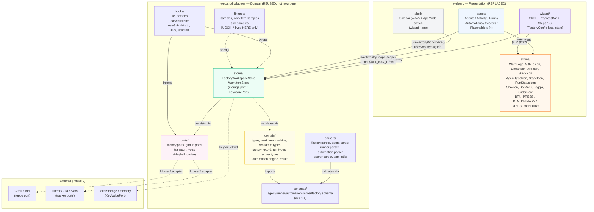
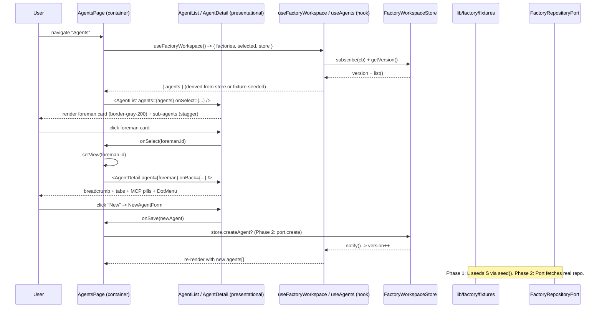
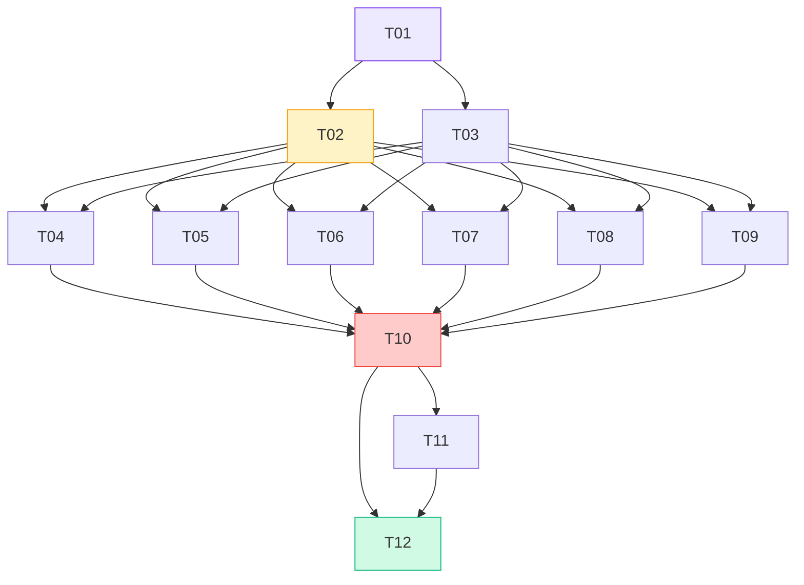

# ARCHITECTURE — Software Factories Total Visual Replica

> **Project:** `web/` frontend replacement — 1:1 replica of `figma/Factories frontend/src/App.tsx` (1774 LOC) + wiring to `web/src/lib/factory`
> **Stack:** Vite 8 + React 19 + Tailwind CSS v4 (`@tailwindcss/vite`) + TypeScript 6 + Vitest 4 + oxlint
> **Status:** Phase 1 = visual parity (pure UI, store-seeded data). Phase 2 = functional wiring (ports/DI).
> **Language:** Technical artifact in English. Orchestrator reply in Rioplatense (see §0).

---

## 1. Vision & Constraints

### 1.1 Vision

Replace the entire `web/` frontend with a **pixel-perfect, behavior-identical replica** of the Figma reference, then wire it to the real domain layer (`web/src/lib/factory`) without leaking any mock data into UI components. The Figma file is the single source of visual truth; `WarpFactories.md` + `web/src/lib/factory/**` are the domain truth.

```
Figma App.tsx (1774 LOC God Component)  ──decompose──►  SOLID + Atomic + Container-Presentational
current web/ (30+ nav items, dashboard heavy) ──trim──► 13 nav items exact
inline MOCK_* inside UI                    ──extract──►  lib/factory/fixtures + ports + stores
```

### 1.2 Hard Constraints (non-negotiable)

| ID | Constraint | Enforcement |
|----|-----------|-------------|
| C1 | **13 nav items exact** — 4 team + 9 factory, no Benchmarks/Infra/Validation/Deep Dives/etc. | `nav.ts` length assertion + CI `NAV_ITEMS.length === 13` + `typecheck` fails on removed `NavItemId` |
| C2 | **Zero MOCK in components** — `grep -r "MOCK_" web/src/components` == 0, also `web/src/App.tsx` == 0 | lint step in `check`, fixtures live only in `lib/factory/fixtures` |
| C3 | **God Component decomposition** — no file >300 LOC (except `lib` domain), `App.tsx` is a router only | oxlint + manual review, folder-per-page |
| C4 | **Tailwind v4 invariant** — `@import 'tailwindcss'` via `@tailwindcss/vite`, no `tailwind.config.*`, no PostCSS config | `vite.config.ts` already correct; `index.css` is verbatim copy |
| C5 | **Inter + tokens exact** — `Inter` 400/500/600/700, `BTN_PRESS/PRIMARY/SECONDARY`, `STAGE_META`, `JUDGE_MODELS`, oklch shadows, 4 keyframes | visual diff at 1440px, token grep |
| C6 | **Build green** — `pnpm --filter web check` = `tsc --noEmit && tsc -b && vitest run --pool=threads && vite build && oxlint` == 0 | CI gate |
| C7 | **No inventing UI** — no button/page/icon that does not exist in Figma App.tsx | spot-check kill-list (§6) |

### 1.3 Goals Mapping (PRD §1)

* **G1 Pixel-perfect** → `index.css` 1:1, Figma class strings copied verbatim, oklch shadows not replaced with `shadow-lg`.
* **G2 Zero static data in UI** → every list/detail reads from `lib/factory` (store/port/adapter), even if Phase 1 is fixture-seeded.
* **G3 Minimal nav surface** → `NAV-01` / `NAV-02` satisfied.

---

## 2. Stack & Decisions

### 2.1 Chosen Stack

| Layer | Choice | Version | Why |
|-------|--------|---------|-----|
| Bundler | **Vite** | 8 | Native ESM, sub-second HMR required for pixel iteration; `@tailwindcss/vite` is Vite-only |
| UI | **React** | 19 | Figma ref is React 19; `use()` / `useSyncExternalStore` available; concurrent rendering for drawer/modal |
| Styling | **Tailwind CSS v4** + `@tailwindcss/vite` | 4.1.8 | PRD hard constraint. v4 removes config file — single `index.css` source of truth. No PostCSS drift |
| Language | **TypeScript** | 6.0 (strict) | `tsc -b` project references, `assertNever` exhaustiveness, `noUncheckedIndexedAccess` |
| Tests | **Vitest** | 4.1 + `jsdom` 29 + `@testing-library/react` 16 | Vite-native (no double compile), `pool: threads`, ESM-first, same `vite.config.ts`. Jest would need Babel/ts-jest + `jest.config` — extra drift, slower |
| Lint | **oxlint** | 1.79 | 50-100× faster than ESLint, already in `web/`, zero-config, catches `any` leakage |
| Icons | **Inline SVG components** (no `lucide-react` for replica) | — | Figma uses hand-crafted 11-16px SVGs with exact `strokeWidth` 1.4/1.5. `lucide-react` strokes differ visually. Keep Figma SVGs verbatim as single-source components |
| Fonts | **Google Fonts Inter** via `@import url(...)` | 400/500/600/700 | Figma `index.css` line 1 — do not use `@fontsource/inter` (different loading) |
| State | **React Context + `useSyncExternalStore` + `FactoryWorkspaceStore` observer** | — | See §2.2 |
| Animations | **CSS keyframes** (`anim-*` classes) | — | No `framer-motion` / `motion` in replica; Figma uses pure CSS `cubic-bezier(0.2,0,0,1)` with `both` fill |
| Validation | **zod 4.5** (already in repo) | — | Schemas already exist (`schemas/*.schema.ts`), keep single validation lib |

### 2.2 Decision: Zustand vs Context vs Jotai vs Redux

**Decision: keep Context + `FactoryWorkspaceStore` (observer `Map + Set<listener> + version`) — do NOT adopt Zustand in Phase 1.**

| Alternative | Verdict | Rationale |
|-------------|---------|-----------|
| **Zustand** | Rejected for Phase 1 | Adds ~1.2 kB + new mental model, but `FactoryWorkspaceStore` already implements the same pattern (subscriptions + version counter) and is consumed via `useSyncExternalStore` — Zustand would duplicate it. `FactoryWorkspaceStore` also handles `KeyValuePort` DI, V1→V2 migration, quota handling — Zustand does not. Migration to Zustand later would still need that logic. |
| **Jotai / Recoil** | Rejected | Atom granularity not needed — pages are coarse (`agents`, `workItems`, `runs`, `automations`, `scorers`). Adds dependency for no gain. |
| **Redux Toolkit** | Rejected | Over-engineering for fixture-seeded Phase 1; boilerplate violates "simplicity" principle. |
| **Context + `useSyncExternalStore`** | **Chosen** | Zero extra deps, aligns with existing `FactoryWorkspaceStore` / `WorkItemStore` already in `lib/factory`. `store.subscribe(cb)` + `store.getVersion()` maps 1:1 to `useSyncExternalStore`. DI via `FactoryWorkspaceContext` (port injection) satisfies DIP without a store library. Phase 2 can introduce a tiny `WizardStore` the same way if wizard grows — still no Zustand. |
| **Future escape hatch** | If wizard becomes cross-step async (port fetching repos), a **local Zustand slice** scoped to `wizard/` is acceptable — but only there, not globally. |

**Consequence:** `WizardConfig` stays as `useState<FactoryConfig>` in `WizardShell` (Phase 1). If persistence is needed, wrap it in a `WizardContext` that delegates to `FactoryWorkspaceStore.create()` on Finish — same observer, no new lib.

### 2.3 Decision: Vitest over Jest

* Vitest reuses `vite.config.ts` (no second transform pipeline). Jest + `ts-jest` would need `jest.config.ts` + `babel` + `identity-obj-proxy` + manual `moduleNameMapper` for `@/` — high maintenance.
* `pool: threads` (PRD `check` command) gives ~3× speedup on 80+ domain tests.
* Native ESM + `jsdom` matches Vite build; no CJS interop bugs with `yaml`/`zod`.
* Existing 80+ tests already Vitest — switching would churn every test file.

### 2.4 Decision: Keep `yaml` + `zod` (not `valibot`/`arktype`)

Domain already has `schemas/*.schema.ts` and `parsers/*.ts` using `zod`. Replacing would invalidate every parser test. `yaml` is needed for `factory.md` frontmatter.

### 2.5 Architecture Pattern

* **Screaming Architecture** — folder names scream domain (`wizard/`, `agents/`, `activity/`, `scorers/`), not technical layers.
* **Hexagonal (Ports & Adapters)** — UI → `ports` → `adapters`; `FactoryWorkspaceStore` takes `KeyValuePort` (localStorage vs memory), future `GitHubRepoPort` etc.
* **Atomic Design + Container-Presentational** — `atoms/` (icons, buttons, toggle, slider) → `molecules/` (cards, rows) → `organisms/` (lists, drawers, modals) → `templates/` (shell) → `pages/` (containers). Containers own store/port; presentational are pure `props → JSX`, no imports from `lib/factory`.
* **SOLID enforcement:**
  * SRP — one component per file, ≤300 LOC, single reason to change.
  * OCP — `navItemsByScope(scope)` + `STAGE_META` map; adding a stage = add entry, not edit switch.
  * LSP — `KeyValuePort` implementations interchangeable (`memory` / `localStorage` / `remote`).
  * ISP — ports are narrow (`FactoryRepositoryPort`, `WorkItemPort`, `GitHubRepoPort`) not a god interface.
  * DIP — UI imports `ports`/`hooks`, never `localStorage` or `fetch` directly.

---

## 3. High-Level Diagram

### 3.1 System Context



### 3.2 Dependency Rule (must not be violated)

```
atoms  ──►  no deps (pure SVG + Tailwind)
molecules / organisms  ──►  atoms only
pages (presentational)  ──►  organisms + molecules + atoms
pages (containers)  ──►  presentational + hooks + lib/factory (stores/ports)
shell / wizard (containers)  ──►  presentational + hooks + lib/factory
lib/factory  ──►  never imports from components/ or App.tsx
```

Any arrow pointing upward is an architecture violation.

### 3.3 Data Flow Example — Agents Page



---

## 4. Proposed File Structure

All paths relative to `web/src/`. **`web/src/components/*` is REPLACED** (delete old tree, create new one). **`web/src/lib/factory` is REUSED** (no rewrite, only additive fixtures/ports if missing).

### 4.1 New Tree (Phase 1 target)

```
web/src/
├── index.css                          # REPLACED — verbatim Figma index.css (Inter, tailwind import, 4 keyframes, scrollbar, slider)
├── nav.ts                             # REWRITTEN — 13 items exact (see §6)
├── App.tsx                            # REWRITTEN — router only, lazy + Suspense + ErrorBoundary + assertNever
│
├── lib/
│   └── factory/                       # REUSED — keep as-is, additive only
│       ├── index.ts
│       ├── domain/                    # types, factory.record, workItem.*, run.*, scorer.*, etc.
│       ├── schemas/                   # zod schemas
│       ├── parsers/                   # yaml/frontmatter parsers
│       ├── store/                     # factoryWorkspace.store, workItem.store, storage.port
│       ├── ports/                     # factory.ports, github.ports, transport.types
│       ├── hooks/                     # useFactories, useWorkItems, useGitHubAuth
│       ├── fixtures/                  # ★ MOCK_* now lives ONLY here (see §7)
│       │   ├── figma.fixtures.ts      # NEW — exports MOCK_REPOS/AGENTS/WORK_ITEMS/RUNS/AUTOMATIONS/SCORERS (copied from Figma, behind port)
│       │   ├── samples.ts             # existing
│       │   └── workItem.samples.ts    # existing
│       └── adapters/                  # existing (if any), Phase 2 adds github.adapter.ts
│
├── components/                        # ★ DELETED & RECREATED — old tree removed, new atomic tree
│   ├── atoms/                         # single-source, no duplication (NFR Duplication)
│   │   ├── icons/
│   │   │   ├── WarpLogo.tsx           # NEW — 16px stroke white on bg-gray-900 rounded-md
│   │   │   ├── GithubIcon.tsx         # NEW — size prop, className, currentColor
│   │   │   ├── LinearIcon.tsx
│   │   │   ├── JiraIcon.tsx
│   │   │   ├── SlackIcon.tsx
│   │   │   ├── AgentTypeIcon.tsx      # NEW — type: foreman|triage|spec|implement|review|custom, size sm|md|lg, bg map
│   │   │   ├── StageIcon.tsx          # NEW — stage: triage|planning|building|reviewing, size
│   │   │   ├── RunStatusIcon.tsx      # NEW — status: running|done|benchmark|failed
│   │   │   ├── Chevron.tsx            # NEW — open:boolean, size, rotate -90deg with 200ms cubic-bezier
│   │   │   └── DotMenu.tsx            # NEW — group-hover:opacity-100, 3 dots, stopPropagation
│   │   ├── buttons/
│   │   │   ├── BtnPrimary.tsx         # NEW — BTN_PRIMARY token, optional icon
│   │   │   ├── BtnSecondary.tsx       # NEW — BTN_SECONDARY token
│   │   │   └── BackBtn.tsx            # NEW — chevron + Back
│   │   ├── Toggle.tsx                 # NEW — role="switch", aria-checked, bg-violet-600 / bg-gray-200, thumb translate-x-5
│   │   ├── SliderRow.tsx              # NEW — label, subtitle, min/max/step, linear-gradient track, number input w-14
│   │   └── index.ts                   # barrel
│   │
│   ├── molecules/
│   │   ├── McpPill.tsx                # NEW — { name, color } → dot + name, bg-gray-100 rounded-full
│   │   ├── SecretBadge.tsx            # NEW — lock icon + name
│   │   ├── FilterChip.tsx             # NEW — icon + bold + sep + val + close X, shadow 0 1px 2px
│   │   ├── TriggerRow.tsx             # NEW — Scheduled weekly row (selects + Next run + close X)
│   │   └── ClassificationRow.tsx      # NEW — pass/fail pill + name + desc + delete on hover
│   │
│   ├── organisms/
│   │   ├── McpModal.tsx               # NEW — overlay oklch(0 0 0 /0.35) anim-fade-in, card w-[780px] max-h-[560px] rounded-2xl anim-scale-in
│   │   ├── ClassificationModal.tsx    # NEW — w-[480px] rounded-2xl, Name*, Outcome toggle green/red, Description
│   │   ├── AgentPickerModal.tsx       # NEW — w-[420px] rounded-2xl, checkbox border-2 + AgentTypeIcon
│   │   ├── TriggerDropdown.tsx        # NEW — two-panel rounded-xl border shadow 0 8px 24px, hover submenu
│   │   ├── ActivityDrawer.tsx         # NEW — w-[340px] border-l anim-slide-right shadow -4px 0 16px, hash nav, origin card
│   │   └── FactoryPill.tsx            # NEW — bg-gray-50, violet-600 circle initial, split-view
│   │
│   ├── shell/
│   │   ├── Sidebar.tsx                # REWRITTEN — w-52 bg-white border-r border-gray-100 h-full overflow-y-auto, 4 team + 9 factory, active token
│   │   ├── ErrorBoundary.tsx          # REUSED or rewritten if needed (class component, fallback UI)
│   │   └── PageShell.tsx              # NEW — sticky header wrapper (breadcrumb + actions) shared layout
│   │
│   ├── wizard/
│   │   ├── WizardShell.tsx            # NEW — min-h-full bg-white, Exit, ProgressBar (5 segments h-1.5 rounded-full)
│   │   ├── ProgressBar.tsx            # NEW — step/total, active bg-violet-600 inactive bg-gray-200 duration-300
│   │   ├── steps/
│   │   │   ├── StepConnectHost.tsx    # NEW — single GitHub card hover:border-gray-300 hover:bg-gray-50 BTN_PRESS shadow
│   │   │   ├── StepSelectRepo.tsx     # NEW — MOCK_REPOS 5 rows, selected bg-gray-900 white text + violet Selected, divide-y
│   │   │   ├── StepPersonality.tsx    # NEW — Factory name* + Foreman name + Description + avatar dashed w-12 h-12
│   │   │   ├── StepConfigureAgents.tsx# NEW — AGENTS_SETUP 5 rows + AgentTypeIcon + Toggle (Foreman Required)
│   │   │   ├── StepTrackers.tsx       # NEW — Linear + Jira cards w-10 h-10 + Connect toggle
│   │   │   └── StepStartup.tsx        # NEW — WarpLogo centered, grid-cols-4 PIPELINE, stagger 120/180/240/300, Open factory CTA
│   │   ├── WizardContext.tsx          # NEW — FactoryConfig state + persist helpers (optional, Phase 2)
│   │   └── wizard.types.ts            # NEW — FactoryConfig, WizardStep, AppMode (re-export or domain type)
│   │
│   ├── pages/
│   │   ├── agents/
│   │   │   ├── AgentsPage.container.tsx  # container — reads store, handles view state (list|new|string), passes to presentational
│   │   │   ├── AgentList.tsx             # presentational — foreman distinct + sub-agents stagger + New dashed CTA
│   │   │   ├── AgentCard.tsx             # presentational — icon + name + desc + DotMenu, active:scale-[0.98]
│   │   │   ├── AgentDetail.tsx           # presentational — breadcrumb, Managed in GitHub banner, tabs Settings|Automations
│   │   │   └── NewAgentForm.tsx          # container+presentational — Enter Agent Name text-2xl, resources, Save disabled
│   │   ├── activity/
│   │   │   ├── ActivityPage.container.tsx
│   │   │   ├── ActivityFilters.tsx       # presentational — chips + Showing N + Clear
│   │   │   ├── ActivityGroupedList.tsx   # presentational — 4 stage headers + collapsible + StageIcon rows
│   │   │   └── index.ts
│   │   ├── runs/
│   │   │   ├── RunsPage.container.tsx
│   │   │   ├── RunsList.tsx              # presentational — divide-y, RunStatusIcon + hash mono + tag pills + agent circle
│   │   │   └── index.ts
│   │   ├── automations/
│   │   │   ├── AutomationsPage.container.tsx
│   │   │   ├── AutomationsList.tsx       # header grid-cols-[180px_1fr_180px_120px] + rows same grid
│   │   │   ├── NewAutomationForm.tsx     # container — Triggers card + Agents select + prompt, Add trigger → dropdown
│   │   │   └── index.ts
│   │   ├── scorers/
│   │   │   ├── ScorersPage.container.tsx
│   │   │   ├── ScorersList.tsx           # group flex border-b hover:bg-gray-50 anim-fade-in-up, trash on group-hover
│   │   │   ├── NewScorerForm.tsx         # container — title text-[28px], Description, agents chips, Judge instr, model, classifications, sliders, toggle
│   │   │   └── index.ts
│   │   └── placeholders/
│   │       ├── PlaceholderPage.tsx       # NEW — w-12 h-12 bg-gray-100 rounded-2xl + label + Coming soon anim-fade-in (used by 4 routes)
│   │       └── index.ts
│   │
│   └── index.ts                       # optional barrel (not required)
│
├── hooks/                             # NEW — app-level hooks (if needed, e.g. useWizardPersist)
│   └── useWizardPersist.ts
│
└── App.tsx (root router)              # see §6
```

**File count:** ~58 new files (all ≤300 LOC). `App.tsx` target ≤120 LOC (router only). Old `App.tsx` was 1774 LOC → ~15× decomposition.

### 4.2 Files to DELETE (kill list, PRD §6)

All deleted in one atomic commit (DEL-01). No "keep for later".

```
DELETED — Team nav & quickstart
web/src/components/quickstart/**              # QuickstartWizard, QuickstartFullscreen, steps/*
web/src/nav.ts — ids: Quickstart, Help
web/src/components/factories/FactoryGlossary.tsx
web/src/components/help/**                   # HelpLinks, HelpNavProvider, HelpSection, TroubleshootingPage

DELETED — 17 factory nav items + their pages
web/src/components/runners/**                # RunnersPage, RunnerCard, RunnerDetail
web/src/components/skills/**                 # SkillsPage, SkillCard, SkillDetail
web/src/components/benchmarks/**             # BenchmarksPage
web/src/components/mcp/McpStubPage.tsx       # (McpsPage kept? Figma has MCPs and apps as team placeholder → keep but trim to placeholder)
web/src/components/factory-api/**            # FactoryApiPage
web/src/components/infra/**                  # InfraPage
web/src/components/validation/**             # ValidationPage
web/src/components/integrations-deep/**      # IntegrationsDeepDivesPage + GitLabPage, SlackPage, LinearPage, JiraPage, SchedulePage, FactoryPage
web/src/components/routing/**                # GitHubRoutingPage
web/src/components/dashboard/DashboardPage.tsx  # replaced by placeholders/PlaceholderPage (generic) — richer dashboard deleted per PRD OQ4
web/src/components/dashboard/MetricCard.tsx
web/src/components/dashboard/DashboardEmptyState.tsx
web/src/lib/factory/domain/dashboard.derive.ts — KEEP (domain is not deleted, only UI)
web/src/lib/factory/domain/benchmark.*       # keep domain, delete UI only

DELETED — Routing / flags
web/src/App.tsx — cases for: Quickstart, Runners, Skills, Benchmarks, MCP tools, Factory API, Infra, Validation,
                Integrations Deep Dives, GitHub routing, GitLab/Slack/Linear/Jira/Schedule/Factory Deep Dive, Help
web/src/lib/factory/config/featureFlags.ts — isQuickstartFullscreenEnabled / shouldFullscreen (wizard is now AppMode)
web/src/App.tsx — getInitialNav hash handling for Troubleshooting anchors (#setup, #two-runs…), HelpNavProvider wrapper,
                /quickstart alias, /factory/:uid/dashboard special-case
```

**Kept but trimmed:**

```
KEPT — trimmed to 13 items
web/src/nav.ts                               # rewritten: 4 team + 9 factory
web/src/components/Sidebar.tsx               # rewritten: simple w-52, no Framer Motion, no Avanzado accordion
web/src/components/mcp/McpsPage.tsx          # trimmed to placeholder-like (MCPs and apps is team item, Phase 1 inert)
web/src/components/secrets/SecretsPage.tsx   # kept as-is (MCPs and apps / Secrets / Integrations are in the 13)
web/src/components/integrations/IntegrationsPage.tsx # kept
web/src/components/factory-definition/FactoryDefinitionPage.tsx # placeholder wrapper
web/src/components/factory-definition/SettingsPage.tsx          # placeholder wrapper
web/src/components/self-improvement/SelfImprovementPage.tsx     # placeholder wrapper — existing page may be richer than "Coming soon", replace with PlaceholderPage
web/src/components/agents/*                  # REWRITTEN (use Figma layout, keep domain imports)
web/src/components/activity/*                # REWRITTEN
web/src/components/automations/*             # REWRITTEN
web/src/components/runs/*                    # REWRITTEN
web/src/components/scorers/*                 # REWRITTEN
```

### 4.3 `web/src/lib/factory` — Reuse Contract

* **DO NOT rewrite.** Domain, parsers, schemas, stores, ports remain the source of truth for wiring.
* **Additive only:** `fixtures/figma.fixtures.ts` to host copied `MOCK_*` (behind an export that looks like a port). Optional `ports/figma.ports.ts` if a uniform port shape is desired.
* Any missing type (`Repo`, `FactoryConfig`) is derived from `FactoryRecord` / `AgentDefinition` — do not duplicate shapes. Map Figma `Repo` → `RepositoryRef`, Figma `Agent` → `AgentDefinition` (or a view-model in `hooks/` that projects domain → Figma prop shape).

---

## 5. Page Designs — Container vs Presentational

> Rule: containers import from `lib/factory` and manage state; presentational receive `props` only, never import `lib/factory`, never call hooks that touch storage. No prop drilling >2 levels — use composition or context for wizards.

### 5.1 Global Atoms (single-source, NFR Duplication)

| Atom | Props | Notes |
|------|-------|-------|
| `WarpLogo` | `—` | `w-7 h-7 bg-gray-900 rounded-md` + SVG `M3 12l3.5-8 2.5 6 2-3 2.5 5` stroke white 1.5 |
| `GithubIcon` | `{ size?: number, className?: string }` | `fill="currentColor"` GitHub path, `size` controls `width/height` |
| `LinearIcon` | `{ size?: number }` | circle `#5E6AD2` + stroke white |
| `JiraIcon` | `{ size?: number }` | 2-path blue + linearGradient `j2` |
| `SlackIcon` | `{ size?: number }` | `rect rx 5 #4A154B` + path white 1.3 |
| `AgentTypeIcon` | `{ type: string, size?: "sm"|"md"|"lg" }` | `dim: 48/28/36`, map `foreman→#ede9fe`, `triage→#f3f4f6`, `spec→#fff7ed`, `implement→#eff6ff`, `review→#fdf2f8`, `custom→#f0fdf4` |
| `StageIcon` | `{ stage: string, size?: number }` | 4 branches, `flexShrink:0`, dash array for triage |
| `RunStatusIcon` | `{ status: string }` | `done→green check`, `benchmark→star #f59e0b`, `failed→triangle #ef4444`, default `running→indigo dash` |
| `Chevron` | `{ open: boolean, size?: number }` | `rotate(0deg)` vs `-90deg`, `transition: transform 200ms cubic-bezier(0.2,0,0,1)` |
| `DotMenu` | `{ onClick?: (e)=>void }` | `opacity-0 group-hover:opacity-100`, `e.stopPropagation()` |
| `Toggle` | `{ checked: boolean, onChange: ()=>void }` | `role="switch" aria-checked`, `bg-violet-600` vs `bg-gray-200`, thumb `translate-x-5` + `boxShadow: 0 1px 4px oklch(0 0 0 / 0.18)` |
| `BtnPrimary` / `BtnSecondary` | `{ children, onClick, disabled?, className? }` | `BTN_PRIMARY` / `BTN_SECONDARY` + `BTN_PRESS`, `disabled:opacity-40 disabled:cursor-not-allowed` |
| `BackBtn` | `{ onClick }` | chevron + Back, `text-gray-500 hover:text-gray-800` |
| `SliderRow` | `{ label, required?, subtitle, value, min, max, step, suffix?, onChange }` | `linear-gradient(to right, #111827 {pct}%, #e5e7eb {pct}%)`, `w-14` number input + suffix |

All icons export from `atoms/icons/` and re-exported via `atoms/index.ts`. No SVG copied inline elsewhere.

### 5.2 Shell — `shell/Sidebar.tsx`

| Aspect | Design |
|--------|--------|
| **Pattern** | Presentational + container fusion (reads `useFactoryWorkspace` for factory name/initial only) |
| **Props** | `{ factoryName: string, activePage: NavPage, onNav: (p:NavPage)=>void }` — `factoryName` comes from `App` container, not fetched inside Sidebar |
| **State** | None internal except hover; no `showAdvanced`, no `AnimatePresence` — deleted per kill-list |
| **Layout** | `w-52 flex-shrink-0 bg-white border-r border-gray-100 flex flex-col h-full overflow-y-auto` |
| **Header** | `WarpLogo` + 2 icon buttons (search + split-view) `p-1.5 rounded-md text-gray-400 hover:text-gray-600 hover:bg-gray-100` |
| **Team block** | 4 items `text-xs text-gray-500 hover:text-gray-800` `px-2.5 py-1.5 rounded-md hover:bg-gray-50` — inert in Phase 1 (no `onClick` or `onNav` no-op) per PRD OQ2 |
| **Factories section** | Pill `bg-gray-50 hover:bg-gray-100 rounded-lg px-2 py-1.5` + `w-5 h-5 rounded-full bg-violet-600` initial + `factoryName` truncate 14 chars + chevron `border-l border-gray-200 ml-2 pl-3` wrapper; 9 factory items, active `text-gray-900 font-semibold bg-white shadow-sm border border-gray-100` |
| **Footer** | `bg-gray-300` avatar `U` + `youruser@example.com` + chevron |
| **Stores** | `useFactoryWorkspace()` only for `factories.length` check (empty hint) — minimal |
| **Tests** | `navIcons.test.ts`-style exhaustive check: 13 items render, active style, team items inert |

### 5.3 Wizard — `wizard/` (AppMode = "wizard" | "app")

| Aspect | Design |
|--------|--------|
| **Container** | `WizardShell.tsx` + `wizard.types.ts` + optional `WizardContext.tsx` |
| **State** | `const [step, setStep] = useState<WizardStep>(1)` , `const [config, setConfig] = useState<FactoryConfig>({...})` — local, not persisted in Phase 1. `App.tsx` owns `mode: AppMode` and `config`; wizard steps are presentational callbacks |
| **Props per step** | `StepConnectHost({ onNext })`, `StepSelectRepo({ repos, selectedId, onSelect, onNext, onBack })`, `StepPersonality({ config, onChange, onNext, onBack })`, `StepConfigureAgents({ config, onChange, onNext, onBack })`, `StepTrackers({ config, onChange, onNext, onBack })`, `StepStartup({ factoryName, pipeline, onOpenFactory })` |
| **Shared** | `Shell({ step, total:5, onExit })` + `ProgressBar({ step, total:5 })` — `h-1.5 rounded-full flex-1 transition-[background-color] duration-300` active `bg-violet-600` |
| **Buttons** | `BackBtn` + `NextBtn({ disabled, label })` — tokens `BTN_PRIMARY/SECONDARY + BTN_PRESS` |
| **Store interaction** | Phase 1: none (local `FactoryConfig`). Phase 2: `Finish` → `store.create({ name: config.factoryName, alias: config.foremanName, agentToggles: config.agents, integrations: trackersToIntegrations(config.trackers), repositories: config.selectedRepo ? [{owner, name}] : [] })` then `setMode("app")` |
| **Persistence** | Phase 2: `WizardContext` with `useEffect(() => localStorage.setItem("wizard:config", JSON.stringify(config)), [config])` + `KeyValuePort` for testability. Phase 1: no persistence needed |
| **Validation** | Step 2 `Next` disabled when `!selectedRepo`; Step 3 `Next` disabled when `!factoryName.trim()`; Step 4 Foreman `Required` not toggleable |

### 5.4 Agents — `pages/agents/`

| Component | Type | Props | State & Stores | Interactions |
|-----------|------|-------|---------------|--------------|
| `AgentsPage.container` | Container | `{ factoryName }` | `view: "list"|"new"|string (agentId)` + `agents: Agent[]` from `useFactoryWorkspace` or `fixtures/figma.fixtures.DEFAULT_AGENTS` projected to `AgentDefinition` | Switches `view`; `onAgentsChange` mutates local copy (Phase 1) or calls `store` (Phase 2) |
| `AgentList` | Presentational | `{ factoryName, agents, onSelect, onNew }` | — | `foreman` card `border-gray-200 rounded-xl shadow 0 1px 3px` `anim-fade-in-up delay-0` + `subAgents` `border-gray-100` `delay-60…240` + `New agent` dashed CTA |
| `AgentCard` | Presentational | `{ agent, variant: "foreman"|"sub", onSelect, onDotMenu }` | — | `AgentTypeIcon` + `DotMenu` (stopPropagation), `active:scale-[0.98]` |
| `AgentDetail` | Presentational (+ local tab) | `{ agent, onBack }` | `tab: "settings"|"automations"` | breadcrumb `← Agents / {name}`, `Managed in GitHub` banner `Open in GitHub`, tabs `border-b-2` active `border-gray-900`, sections Description + Agent resources (MCPs/Secrets/Harness/Model/Runner/Host) + prompt `font-mono` |
| `NewAgentForm` | Presentational + local form | `{ onBack, onSave, agents }` | `name, description, harness, model, runner, prompt, showMcp` | `Enter Agent Name text-2xl` placeholder gray-200, selects with chevron absolute, `Add MCP` → `McpModal`, Save `disabled={!name.trim()}` |
| `McpModal` | Organism (portal) | `{ onClose }` | `jsonConfig: string` | overlay `oklch(0 0 0 /0.35) anim-fade-in`, card `w-[780px] max-h-[560px] rounded-2xl anim-scale-in` shadow `0 8px 32px …`, left search + `Custom MCP` + empty state, right JSON gutter + textarea |

**Data source:** Phase 1 `DEFAULT_AGENTS` from `fixtures/figma.fixtures.ts` (copy of `MOCK_AGENTS` 5) projected: `{ id, name, description, type, mcps:[{name,color}], secrets, harness, model, runner, host, prompt }`. Phase 2 `AgentDefinition` via `agent.parser` + `FactoryWorkspaceStore.getSelected()`.

### 5.5 Activity — `pages/activity/`

| Component | Type | Props | State & Interactions |
|-----------|------|-------|----------------------|
| `ActivityPage.container` | Container | `{ factoryName }` | `collapsed: Record<string,boolean>` (planning, building collapsed default false), `selectedItem: WorkItem\|null` (toggles on row click: same id → null). Groups `workItems` by stage (`triage|planning|building|reviewing`) |
| `ActivityFilters` | Presentational | `{ count, onClear }` | Chips `Stage is Triage…` + `Created by youruser` (`bg-white border border-gray-200 rounded-lg shadow 0 1px 2px`), `+` dashed, `Showing N results` + `Clear` right |
| `ActivityGroupedList` | Presentational | `{ grouped, collapsed, onToggleStage, selectedId, onSelect }` | Headers `button w-full` `Chevron` + `StageIcon` + label + count `font-normal text-gray-400` with `STAGE_META` bg/text, rows `StageIcon + title + hash mono uppercase + avatar U + time`, selected row `bg-gray-100/80 ring-1 ring-inset ring-gray-900/8` |
| `ActivityDrawer` | Organism | `{ item, onClose }` | `w-[340px] border-l anim-slide-right shadow -4px 0 16px`, header hash + nav arrows + stop + View agent + history + close X, body title + stage + origin card (`Slack/Github/Linear` icon + Started …), footer `Task details` with chevron |

**Data:** `MOCK_WORK_ITEMS` (7) from `fixtures/figma.fixtures.ts` → domain `WorkItem` mapped to Figma prop shape (`hash: id.slice(0,6).toUpperCase()` if needed). Phase 2 `WorkItemStore` filtered by `factoryName`.

### 5.6 Runs — `pages/runs/`

| Component | Type | Props | Notes |
|-----------|------|-------|-------|
| `RunsPage.container` | Container | `{ factoryName }` | No local state (Phase 1), future `filter` state |
| `RunsList` | Presentational | `{ runs }` | Sticky header + 3 icon buttons + `New`; list `divide-y divide-gray-50`, row `RunStatusIcon + title + hash mono uppercase + tag pills (PR Creat/Slack with inline icons) + agentInitial circle bg-gray-900 + time` |

**Data:** `MOCK_RUNS` (12) → `Run` / `WorkItemEvent` projection. Tags mapping uses `tag.includes("Slack")` + `GithubIcon size 10`.

### 5.7 Automations — `pages/automations/`

| Component | Type | Props | State & Interactions |
|-----------|------|-------|----------------------|
| `AutomationsPage.container` | Container | `{ factoryName, agents }` | `view: "list"|"new"` + `automations: Automation[]` (fixture-seeded) |
| `AutomationsList` | Presentational | `{ factoryName, automations, onNew, onDotMenu }` | Header `grid grid-cols-[180px_1fr_180px_120px] text-xs font-semibold uppercase tracking-wide border-b`, rows same grid `hover:bg-gray-50 rounded-lg anim-fade-in-up` |
| `NewAutomationForm` | Container+Presentational | `{ factoryName, agents, onBack, onSave }` | `trigger: TriggerConfig\|null`, `showTriggerPicker: boolean`, `selectedAgent` (default foreman), `prompt`, `triggerDay/Time/Freq`. `Triggers` card `border rounded-xl shadow 0 1px 3px`, selected row `Weekly on Monday at 09:00 AM EDT Next run …` with selects + close X, `Add trigger` → `TriggerDropdown`; Agents select with `AgentTypeIcon sm` prefix; prompt textarea |
| `TriggerDropdown` | Organism | `{ onSelect: (t:TriggerConfig)=>void }` | `hoveredScheduled` local, left panel `Scheduled (hover→submenu) + GitHub/Linear/Slack/Jira` (disabled `Not connected`), right submenu `Hourly/Daily/Weekly/Custom(cron)` via `onMouseEnter/Leave` |

### 5.8 Scorers — `pages/scorers/`

| Component | Type | Props | State & Interactions |
|-----------|------|-------|----------------------|
| `ScorersPage.container` | Container | `{ factoryName, agents }` | `view: "list"|"new"` + `scorers: Scorer[]` (5) |
| `ScorersList` | Presentational | `{ factoryName, scorers, agents, onNew, onDelete }` | Rows `group flex border-b hover:bg-gray-50 anim-fade-in-up`, name + `N classifications • Agent …` + delete trash `group-hover:opacity-100` w/ `stopPropagation` |
| `NewScorerForm` | Container+Presentational | `{ factoryName, agents, onBack, onSave }` | `scorerName, description, selectedAgentIds, judgeInstructions, judgeModel, classifications[], passThreshold, sampleRate, selfImprovement, showClassModal, showAgentPicker`. Save `disabled={!canSave}` where `canSave = name.trim() && agentIds.length>0 && judgeInstructions.trim() && classifications.length>0` |
| `ClassificationModal` | Organism | `{ onClose, onAdd }` | `name, outcome: pass|fail, description`. `w-[480px] rounded-2xl`, Outcome toggle `bg-green-50 border-green-300` vs `bg-red-50 border-red-300`, Add `disabled={!name.trim()}` |
| `AgentPickerModal` | Organism | `{ agents, selected, onClose, onDone }` | `checked: string[]` + `toggle(id)`, `w-[420px]`, checkbox `border-2 bg-violet-600` + `AgentTypeIcon sm`, `Done` commits |
| `SliderRow` | Atom | `{ label, required?, subtitle, value, min, max, step, suffix?, onChange }` | `linear-gradient` background, `w-14` number input + suffix, thumb `18px bg-gray-900 rounded-full shadow` (see §10) |

### 5.9 Placeholders — `pages/placeholders/`

| Component | Props | Render |
|-----------|-------|--------|
| `PlaceholderPage` | `{ label: string }` e.g. `"Dashboard"` | `flex-1 flex flex-col items-center justify-center anim-fade-in` → `w-12 h-12 bg-gray-100 rounded-2xl` rect icon + `label` `text-sm font-medium text-gray-600` + `Coming soon text-xs text-gray-400` |

Used by 4 routes: `Dashboard`, `Self-improvement`, `Factory definition`, `Settings`. No store interaction in Phase 1.

---

## 6. Nav & Router Design

### 6.1 `nav.ts` — Trimmed to 13

```ts
// web/src/nav.ts — Phase 1 replica, 13 items exact

export const TEAM_NAV_IDS = [
  "Team Runs",
  "MCPs and apps",
  "Secrets",
  "Integrations",
] as const;

export const FACTORY_NAV_IDS = [
  "Dashboard",
  "Activity",
  "Agents",
  "Automations",
  "Runs",
  "Scorers",
  "Self-improvement",
  "Factory definition",
  "Settings",
] as const;

export type NavItemId = (typeof TEAM_NAV_IDS)[number] | (typeof FACTORY_NAV_IDS)[number];
export type NavScope = "team" | "factory";

export interface NavItem {
  readonly id: NavItemId;
  readonly label: string;       // may differ from id ("Team Runs" → "Runs")
  readonly scope: NavScope;
  readonly trace: string;       // keep for audit, or drop if PRD allows minimal
}

const TEAM_ITEMS: readonly NavItem[] = [
  { id: "Team Runs",     label: "Runs",          scope: "team",    trace: "§10" },
  { id: "MCPs and apps", label: "MCPs and apps", scope: "team",    trace: "§10" },
  { id: "Secrets",       label: "Secrets",       scope: "team",    trace: "§10" },
  { id: "Integrations",  label: "Integrations",  scope: "team",    trace: "§10" },
];

const FACTORY_ITEMS: readonly NavItem[] = [
  { id: "Dashboard",          label: "Dashboard",          scope: "factory", trace: "§10" },
  { id: "Activity",           label: "Activity",           scope: "factory", trace: "§10" },
  { id: "Agents",             label: "Agents",             scope: "factory", trace: "§10" },
  { id: "Automations",        label: "Automations",        scope: "factory", trace: "§10" },
  { id: "Runs",               label: "Runs",               scope: "factory", trace: "§10" },
  { id: "Scorers",            label: "Scorers",            scope: "factory", trace: "§10" },
  { id: "Self-improvement",   label: "Self-improvement",   scope: "factory", trace: "§10" },
  { id: "Factory definition", label: "Factory definition", scope: "factory", trace: "§10" },
  { id: "Settings",           label: "Settings",           scope: "factory", trace: "§10" },
];

export const NAV_ITEMS: readonly NavItem[] = [...TEAM_ITEMS, ...FACTORY_ITEMS];

// PRD OQ1: keep Dashboard as default (less churn than Figma's "agents"),
// document divergence in ARCHITECTURE.md (this file).
export const DEFAULT_NAV_ITEM: NavItemId = "Dashboard";

export function navItemsByScope(scope: NavScope): readonly NavItem[] {
  return NAV_ITEMS.filter((item) => item.scope === scope);
}
export function getNavItem(id: NavItemId): NavItem | undefined {
  return NAV_ITEMS.find((item) => item.id === id);
}
export function isNavItemId(value: string): value is NavItemId {
  return NAV_ITEMS.some((item) => item.id === value);
}
export function assertNever(value: never): never {
  throw new Error(`Unhandled nav item: ${JSON.stringify(value)}`);
}

// CI assertion (optional, not exported): ensures length invariant
// if (NAV_ITEMS.length !== 13) throw new Error("NAV_ITEMS must be 13");
```

**Invariants:**

* `NAV_ITEMS.length === 13` — add a CI check (`vitest` nav test) that fails otherwise (mitigates R1).
* Order is team(4) then factory(9) — `navItemsByScope` preserves catalogue order.
* `badge`, `deepDiveTab`, `icon` removed — no per-item badge in Figma replica. If `Self-improvement` needs a badge later, add via ADR, not ad-hoc.

### 6.2 `App.tsx` — Router Only (target ≤120 LOC)

```tsx
// web/src/App.tsx — Phase 1 replica router
import { lazy, Suspense, useState, useCallback } from "react";
import { Sidebar } from "./components/shell/Sidebar";
import { ErrorBoundary } from "./components/shell/ErrorBoundary";
import { DEFAULT_NAV_ITEM, assertNever } from "./nav";
import type { NavItemId } from "./nav";

// Lazy pages — Sidebar is NOT lazy (always visible, no suspense flash)
const AgentsPage      = lazy(() => import("./components/pages/agents/AgentsPage.container").then(m => ({ default: m.AgentsPage })));
const ActivityPage    = lazy(() => import("./components/pages/activity/ActivityPage.container").then(m => ({ default: m.ActivityPage })));
const RunsPage        = lazy(() => import("./components/pages/runs/RunsPage.container").then(m => ({ default: m.RunsPage })));
const AutomationsPage = lazy(() => import("./components/pages/automations/AutomationsPage.container").then(m => ({ default: m.AutomationsPage })));
const ScorersPage     = lazy(() => import("./components/pages/scorers/ScorersPage.container").then(m => ({ default: m.ScorersPage })));
const PlaceholderPage = lazy(() => import("./components/pages/placeholders/PlaceholderPage").then(m => ({ default: m.PlaceholderPage })));

// Wizard + shell mode
import { useState as useWizardMode } from "react";
// AppMode = "wizard" | "app" — wizard shows until "Open factory", then switches to MainApp
type AppMode = "wizard" | "app";

export default function App() {
  const [mode, setMode] = useState<AppMode>("wizard");
  const [activeItem, setActiveItem] = useState<NavItemId>(DEFAULT_NAV_ITEM);
  // wizard config lives here (Phase 1 local state) or in WizardContext (Phase 2)
  const handleNavigate = useCallback((item: NavItemId) => setActiveItem(item), []);

  function renderContent() {
    // Handles exactly 13 ids — any other value fails tsc via assertNever
    switch (activeItem) {
      case "Team Runs":
      case "MCPs and apps":
      case "Secrets":
      case "Integrations":
        // Phase 1 inert per PRD OQ2: render nothing or placeholder without inventing UI
        return <PlaceholderPage label={activeItem} />; // or: return null (no-op) — pick one, doc it
      case "Dashboard":
      case "Self-improvement":
      case "Factory definition":
      case "Settings":
        return <PlaceholderPage label={activeItem} />;
      case "Agents":      return <AgentsPage />;
      case "Activity":    return <ActivityPage />;
      case "Runs":        return <RunsPage />;
      case "Automations": return <AutomationsPage />;
      case "Scorers":     return <ScorersPage />;
      default:
        return assertNever(activeItem);
    }
  }

  // Wizard branch (when mode==="wizard") — renders WizardShell + steps 1-6
  // Step 6 "Open factory" calls setMode("app") with factoryName from step 3
  if (mode === "wizard") {
    return (
      <ErrorBoundary>
        <Suspense fallback={<div className="flex h-screen items-center justify-center p-6 text-sm text-zinc-500">Loading…</div>}>
          {/* WizardRoot lazy — handles step state + config, calls onComplete(factoryName) => setMode("app") */}
        </Suspense>
      </ErrorBoundary>
    );
  }

  return (
    <div className="flex h-screen overflow-hidden bg-white text-zinc-900 antialiased">
      <Sidebar activeItem={activeItem} onNavigate={handleNavigate} />
      <main className="flex min-h-0 min-w-0 flex-1 overflow-hidden bg-white">
        <ErrorBoundary>
          <Suspense fallback={<div className="flex flex-1 items-center justify-center p-6 text-sm text-zinc-500">Loading…</div>}>
            {renderContent()}
          </Suspense>
        </ErrorBoundary>
      </main>
    </div>
  );
}
```

**Design rules:**

* Every lazy import wrapped in `Suspense` + `ErrorBoundary` (ERR-01). Sidebar never lazy.
* `switch` is exhaustive — `default: assertNever(activeItem)` makes `tsc` fail if a `NavItemId` is missing.
* No `window.location.hash` handling, no `/quickstart` alias, no `HelpNavProvider`, no `isQuickstartFullscreenEnabled` (all deleted).
* Wizard vs app is `AppMode` state in `App.tsx` — not a feature flag. Wizard is lazy-loaded to keep Phase 1 bundle small (PERF-01).
* `PlaceholderPage` is lazy too — 4 routes share one component, one chunk.

### 6.3 Code Splitting Chunks (matches `vite.config.ts` manualChunks)

* `vendor` — `react`, `react-dom`
* `parse` — `yaml`, `zod` (only loaded when a container imports `lib/factory`)
* No `anim` chunk needed (no `motion`/`framer-motion` in replica)
* Each lazy page → separate chunk via `vite build` default

---

## 7. Wiring Strategy — Phase 2 (Ports, DI, Seeding, Wizard Persistence)

Phase 1 renders from fixtures; Phase 2 swaps fixtures for real ports tick-by-tick. No big-bang migration.

### 7.1 Port Topology (existing + additive)

```
lib/factory/ports/
├── factory.ports.ts       # FactoryRepositoryPort = { list, getByUid, getSelected, create, update, setPolicy, remove } — MaybePromise<ParseResult<>>
├── github.ports.ts        # GitHubRepoPort = { listRepos(owner), getRepo(owner,name) } — existing
├── transport.types.ts     # MaybePromise<T> = T | Promise<T>, FetchTransport
└── (Phase 2 additive)
    ├── workItem.ports.ts  # WorkItemPort = { list(factoryName), getById, create, transition }
    ├── scorer.ports.ts    # ScorerPort = { list, getBySlug, create, remove }
    └── automation.ports.ts# AutomationPort = { list, create, remove }

lib/factory/adapters/
├── memory.adapter.ts      # createMemoryPort (KeyValuePort)
├── localStorage.adapter.ts# createLocalStoragePort
└── (Phase 2)
    ├── github.adapter.ts  # fetchTransport → GitHubRepoPort
    └── fixture.adapter.ts # wraps figma.fixtures.* to satisfy ports (Phase 1 bridge)
```

**DI rule:** Stores take `port: KeyValuePort | FactoryRepositoryPort | GitHubRepoPort` in constructor. Tests inject `createMemoryPort()` seeded with fixtures. App injects `createLocalStoragePort()` (or remote adapter) via `FactoryWorkspaceContext.Provider` in `main.tsx` or `App.tsx`.

```ts
// main.tsx — Phase 2 wiring example
import { createLocalStoragePort } from "./lib/factory/store/storage.port";
import { FactoryWorkspaceStore } from "./lib/factory/store/factoryWorkspace.store";
import { FactoryWorkspaceContext } from "./lib/factory/hooks/useFactories";

const port = createLocalStoragePort(); // or fixture adapter in Phase 1
const store = new FactoryWorkspaceStore(port, /* seed from fixtures if empty */);

<App>
  <FactoryWorkspaceContext.Provider value={store}>
    <AppRouter />
  </FactoryWorkspaceContext.Provider>
</App>
```

### 7.2 Fixture Seeding (Phase 1 bridge, zero MOCK in UI)

1. Copy `MOCK_*` values verbatim from Figma into `lib/factory/fixtures/figma.fixtures.ts` (do not import from Figma file — copy once, commit, then Figma file is reference only).

```ts
// lib/factory/fixtures/figma.fixtures.ts — Phase 1 seed, behind a port
export const MOCK_REPOS: Repo[] = [ /* 5 entries copied verbatim */ ];
export const DEFAULT_AGENTS: AgentViewModel[] = [ /* 5 */ ];
export const MOCK_WORK_ITEMS: WorkItemViewModel[] = [ /* 7 */ ];
export const MOCK_RUNS: RunViewModel[] = [ /* 12, truncated to spec */ ];
export const MOCK_AUTOMATIONS: AutomationViewModel[] = [ /* 2 */ ];
export const MOCK_SCORERS: ScorerViewModel[] = [ /* 5 */ ];
export const JUDGE_MODELS = ["kimi k2.7 code", "claude-sonnet-5", ...] as const;
export const STAGE_META = { triage: { label:"Triage", bg:"bg-white", … }, … } as const;
export const AGENTS_SETUP = [ /* 5 */ ] as const;
```

2. Components never import `figma.fixtures.ts`. Containers import a **hook** that reads from the store/adapter:

```ts
// hooks/useAgents.ts (Phase 1 adapter)
import { DEFAULT_AGENTS } from "../fixtures/figma.fixtures";
export function useAgents(factoryName: string) {
  // Phase 1: return fixture directly (no store yet)
  // Phase 2: return useWorkItems / useFactoryWorkspace derived
  return DEFAULT_AGENTS;
}
```

Alternatively, seed the real store once:

```ts
// store/factoryWorkspace.store.ts — seed helper (Phase 1 only)
import { MOCK_AGENTS } from "../fixtures/figma.fixtures";
store.seedIfEmpty(MOCK_AGENTS.map(toAgentDefinition));
```

Either way, `grep -R "MOCK_" web/src/components` stays 0.

3. One-time copy discipline: `figma.fixtures.ts` has a header comment `// Source: figma/.../App.tsx — copied on YYYY-MM-DD, do not edit manually; update via PRD`.

### 7.3 Wizard Persistence

| Phase | Strategy |
|-------|----------|
| **Phase 1** | Local `useState<FactoryConfig>` in `WizardRoot`; no persistence. `Finish` sets `mode="app"` with `factoryName`. |
| **Phase 2** | `WizardContext` + `KeyValuePort` key `wizard:config` — `useEffect` sync on every `config` change; on mount, hydrate from port. `Step 6 → Finish` calls `store.create({ name, alias, repositories:[selectedRepo], agentToggles: config.agents, integrations: trackersToIntegrations })` (real factory). `Open factory` navigates to `Dashboard` with `factoryName`. If creation fails, show `ParseResult` issues inline (optimistic + error boundary). |

Mapping helpers (pure, in `wizard/wizard.types.ts` or `domain/`):

```ts
function trackersToIntegrations(t: { linear:boolean, jira:boolean }): IntegrationType[] {
  return [...t.linear ? ["linear" as const] : [], ...t.jira ? ["jira" as const] : []];
}
const TYPE_MAP: Record<string, AgentType> = { foreman:"FOREMAN", triage:"TRIAGE", spec:"SPEC", code:"IMPLEMENT", review:"REVIEW" };
```

### 7.4 Store Mutation Discipline (Phase 2)

* All `Save` / `New` / `Delete` go through `store.create/update/remove` which returns `ParseResult<T>`.
* Containers handle `result.ok` → update local view + `notify()` (store already notifies) vs `!ok` → render `result.issues` as inline errors (not throw unless unexpected).
* Optimistic: update UI immediately, roll back if port returns error (compare to `workItem.machine` pattern).
* Empty/loading/error driven by `store.getVersion()` + `store.list().length === 0` + `ParseResult` not by static branches.

---

## 8. Task Breakdown — T01–T12 (F0–F8 PRD ≈ mapping)

> Rule: ≤5 tasks would force merging unrelated pages into one PR (hard to review). PRD asks ~T01–T15 — this plan uses **12 tasks** (T01 is infra, T02 is nav+router, T03–T10 are pages/wizard/shell, T11 is polish, T12 is wiring prep). Each task ≥3 files, T01 contains all configs + entry.

| ID | Name | F-Range | Files Touched (`web/src/...`) | Depends | Est. |
|----|------|---------|-------------------------------|---------|------|
| **T01** | **Project infrastructure** | F0 | `package.json` (no new deps, verify `@tailwindcss/vite` present), `vite.config.ts` (confirm no tailwind config, manualChunks), `tsconfig.json` / `tsconfig.app.json` (strict, path `@/*`), `index.html`, `main.tsx` (import `index.css`), `index.css` (verbatim Figma 98 lines), `components/shell/ErrorBoundary.tsx`, `lib/factory/fixtures/figma.fixtures.ts` (seed copy of all `MOCK_*` + constants) | — | **S** (1–2d) |
| **T02** | **Navigation cut + App router** | F1 | `nav.ts` (rewrite 13 items), `App.tsx` (router ≤120 LOC, lazy+Suspense+ErrorBoundary+assertNever), `components/shell/Sidebar.tsx` (rewrite w-52, 4+9 items, active token), `components/pages/placeholders/PlaceholderPage.tsx` + `index.ts` | T01 | **M** (2–3d) |
| **T03** | **Design atoms — icons, buttons, toggle, slider** | F2 | `components/atoms/icons/WarpLogo.tsx`, `GithubIcon.tsx`, `LinearIcon.tsx`, `JiraIcon.tsx`, `SlackIcon.tsx`, `AgentTypeIcon.tsx`, `StageIcon.tsx`, `RunStatusIcon.tsx`, `Chevron.tsx`, `DotMenu.tsx`, `components/atoms/Toggle.tsx`, `components/atoms/SliderRow.tsx`, `components/atoms/buttons/BtnPrimary.tsx`, `BtnSecondary.tsx`, `BackBtn.tsx`, `components/atoms/index.ts`, `components/molecules/McpPill.tsx`, `SecretBadge.tsx`, `FilterChip.tsx` | T01 | **M** (2–3d) |
| **T04** | **Wizard (5 steps + startup)** | F3 | `components/wizard/WizardShell.tsx`, `ProgressBar.tsx`, `wizard.types.ts`, `WizardContext.tsx` (optional), `components/wizard/steps/StepConnectHost.tsx`, `StepSelectRepo.tsx`, `StepPersonality.tsx`, `StepConfigureAgents.tsx`, `StepTrackers.tsx`, `StepStartup.tsx`, `hooks/useWizardPersist.ts` (stub) | T02, T03 | **L** (3–5d) |
| **T05** | **Agents page — list/detail/new + McpModal** | F4 | `components/pages/agents/AgentsPage.container.tsx`, `AgentList.tsx`, `AgentCard.tsx`, `AgentDetail.tsx`, `NewAgentForm.tsx`, `components/organisms/McpModal.tsx`, `hooks/useAgents.ts` (fixture adapter) | T02, T03 | **L** (3–5d) |
| **T06** | **Activity page — filters + grouped list + drawer** | F5 | `components/pages/activity/ActivityPage.container.tsx`, `ActivityFilters.tsx`, `ActivityGroupedList.tsx`, `components/organisms/ActivityDrawer.tsx`, `hooks/useWorkItems.ts` (fixture adapter, groupBy stage) | T02, T03 | **M** (2–3d) |
| **T07** | **Runs page** | F6 | `components/pages/runs/RunsPage.container.tsx`, `RunsList.tsx`, `hooks/useRuns.ts` (fixture adapter) | T02, T03 | **S** (1–2d) |
| **T08** | **Automations page — list + new + TriggerDropdown** | F7 | `components/pages/automations/AutomationsPage.container.tsx`, `AutomationsList.tsx`, `NewAutomationForm.tsx`, `components/organisms/TriggerDropdown.tsx`, `components/molecules/TriggerRow.tsx`, `hooks/useAutomations.ts` | T02, T03 | **M** (2–3d) |
| **T09** | **Scorers page — list + new + ClassificationModal + AgentPickerModal + sliders** | F8 | `components/pages/scorers/ScorersPage.container.tsx`, `ScorersList.tsx`, `NewScorerForm.tsx`, `components/organisms/ClassificationModal.tsx`, `AgentPickerModal.tsx`, `components/molecules/ClassificationRow.tsx` + reuse `SliderRow` | T02, T03 | **L** (3–5d) |
| **T10** | **Shell polish + deletion pass** | F1/F9 | Delete pass: remove `components/quickstart/**`, `skills/**`, `runners/**`, `benchmarks/**`, `mcp/McpStubPage.tsx`, `factory-api/**`, `help/**`, `infra/**`, `validation/**`, `integrations-deep/**`, `routing/**`, `dashboard/*` (old), `lib/factory/config/featureFlags` quickstart flag, `HelpNavProvider` refs. Verify `grep -R "MOCK_" web/src/components` = 0 and `grep -R "Benchmarks\|Infra\|Validation\|MCP tools\|Factory API\|Quickstart\|Troubleshooting\|GitHub routing\|Deep Dive" web/src` = 0 (except fixtures). Update `Sidebar` team items to inert. | T02–T09 | **S** (1d) |
| **T11** | **Tokens, a11y, perf, anim exactness** | P1/P2 | `index.css` audit (keyframes `both`, delays, scrollbar, cursor rule), `components/atoms/Toggle.tsx` (`role="switch"` + `aria-checked`), icon buttons `aria-label`, `range` thumb style, `Stagger delays` `delay-0/60/120/180/240` consistency, `ErrorBoundary` around every lazy, `App.tsx` lazy not for Sidebar | T03–T10 | **S** (1–2d) |
| **T12** | **Phase 2 wiring prep — ports DI + fixture seeding** | Phase 2 | `lib/factory/adapters/fixture.adapter.ts` (wraps `figma.fixtures` as ports), `lib/factory/hooks/useAgents.ts` → `store`-backed, `hooks/useWorkItems.ts` → `WorkItemStore`, `hooks/useRuns.ts`, `hooks/useAutomations.ts`, `hooks/useScorers.ts`, `components/wizard/WizardContext.tsx` persistence to `KeyValuePort`, `FactoryWorkspaceStore` seed helper, `App.tsx` `FactoryWorkspaceContext.Provider` injection in `main.tsx` | T01–T10 | **M** (2–3d, not gating Phase 1 ship) |

**Dependency graph:**



**Parallelization:** After T01, T02 and T03 can run in parallel by different engineers. After T02+T03, T04–T09 are fully parallelizable (5 independent page teams). T10 is a sync point (deletion + grep gates). T11/T12 are polish.

**Estimation total:** ~18–28 dev-days for Phase 1 (T01–T11), +2–3d for T12 (Phase 2 prep, non-blocking ship).

---

## 9. Risks & Mitigations

| # | Risk | Impact | Likelihood | Mitigation |
|---|------|--------|------------|------------|
| **R1** | Scope creep — re-adding deleted nav items (`Benchmarks`, `Infra`, `Validation`, deep dives) because "we still need them" | Violates C1/G3, nav drifts back to 30 | High (team muscle memory) | CI: `NAV_ITEMS.length === 13` test fails PR. `oxlint` rule or `grep` in `check` scans for forbidden strings. ADR required to re-add → must update Figma first. |
| **R2** | Mock leakage — copy-pasting `MOCK_*` into components for "speed" | Violates C2/G2, Phase 2 blocked | High | `grep -R "MOCK_" web/src/components\|web/src/App.tsx` in `check` script + CI gate. Fixtures live only in `lib/factory/fixtures/figma.fixtures.ts`. Code review checklist item. |
| **R3** | God Component regression — cramming 1774 LOC back into `App.tsx` | Unmaintainable, violates C3/SOLID | Medium | Enforce `max-lines: 300` (oxlint or `tsc` plugin) except `lib/`. Folder-per-page structure; `App.tsx` review gate: "is this a router only?". |
| **R4** | Pixel drift — approximating radii/shadows/colors (e.g. `shadow-lg` vs `0 8px 32px oklch(0 0 0 / 0.16)`) | Fails G1/AC-G1 | High | Token-for-token copy from Figma `className` strings. Visual diff: screenshot Figma vs `web/` at 1440×900 in Playwright. `BTN_PRESS/PRIMARY/SECONDARY` and `STAGE_META` are constants, not re-typed. |
| **R5** | Animation jank — wrong `cubic-bezier` or missing `both` fill | Visual regression, fails AC-G8 | Medium | `index.css` is verbatim copy. No `framer-motion` wrapper. Stagger `delay-*` applied via class, not inline `animationDelay` except where Figma does (pipeline). |
| **R6** | Prop drilling through wizard config (5 steps share `FactoryConfig`) | Fragile, violates Container-Presentational isolation | Medium | `WizardContext` (or lifting `config` to `WizardRoot` and passing `value + onChange` as props — max 2 levels per PRD). Do not drill through `Shell`. |
| **R7** | Tailwind v4 mis-setup (adding `tailwind.config.js` or forgetting `@tailwindcss/vite`) | Build breaks, `index.css` tokens lost | Low | `vite.config.ts` already correct — do not add config file. Verify `@import 'tailwindcss'` is first line of `index.css`. |
| **R8** | Icon duplication — re-drawing SVGs per page with slight differences | Bundle bloat, visual inconsistency, violates NFR Duplication | High | Single-source `atoms/icons/*` — import, never inline. PR review rejects inline `<svg>` outside `atoms/icons/`. |
| **R9** | Type drift — Figma `Agent`/`Run`/`WorkItem` shapes diverge from domain `AgentDefinition`/`WorkItem` | Wiring mismatch in Phase 2 | Medium | Define view-models (`AgentViewModel`) in `hooks/` that project domain → Figma props. Do not change domain types to match Figma — adapt at boundary. |
| **R10** | Build red — `any` leakage, `tsc -b` strict, `oxlint` errors from loose Figma types | Blocks G7 | Medium | Extract typed interfaces from Figma header; `JUDGE_MODELS` as `as const`; `STAGE_META` as `Record<Stage, Meta>`. No `any` without `// TODO #ticket`. |
| **R11** | Sidebar UX mismatch — keeping old `Framer Motion` accordion (`Avanzado`, `showAdvanced`) | Extra chrome, violates AC-G3 | Medium | New `Sidebar` is Figma-simple: no `motion`, no accordion, no `Waypoints` icons. 30 lines vs old 574. |
| **R12** | Wizard step 6 confusion — 4-col pipeline `PIPELINE` has 5 stages in code but spec says 4 (Triage/Planning/Building/Reviewing vs Triage/Spec/Code/Review) | Visual mismatch | Low | Map Figma `PIPELINE` exactly (4 cards) — do not add "Planning" vs "Spec" naming churn. Keep Figma labels `Triage/Spec/Code/Review` or normalize to domain — document choice. |

---

## 10. Shared Knowledge (Tokens, Animations, Icons — Exact Values)

> **Copy verbatim.** Any deviation fails AC-G5/G1. Source: `figma/.../src/index.css` + `figma/.../src/App.tsx` constants.

### 10.1 `index.css` — Global (98 lines, verbatim)

```css
@import url('https://fonts.googleapis.com/css2?family=Inter:wght@400;500;600;700&display=swap');
@import 'tailwindcss';

html, body, #root { height: 100%; font-family: 'Inter', sans-serif; }
* { box-sizing: border-box; }
button:not(:disabled), [role="switch"], select { cursor: pointer; }
::-webkit-scrollbar { width: 4px; }
::-webkit-scrollbar-track { background: transparent; }
::-webkit-scrollbar-thumb { background: #d1d5db; border-radius: 2px; }

@keyframes fade-in-up   { from { opacity:0; transform:translateY(6px);} to{opacity:1; transform:translateY(0);} }
@keyframes fade-in       { from { opacity:0;} to{opacity:1;} }
@keyframes slide-in-right{ from { opacity:0; transform:translateX(12px);} to{opacity:1; transform:translateX(0);} }
@keyframes scale-in      { from { opacity:0; transform:scale(0.96);} to{opacity:1; transform:scale(1);} }

.anim-fade-in-up   { animation: fade-in-up    200ms cubic-bezier(0.2,0,0,1) both; }
.anim-fade-in      { animation: fade-in        150ms cubic-bezier(0.2,0,0,1) both; }
.anim-slide-right  { animation: slide-in-right 220ms cubic-bezier(0.2,0,0,1) both; }
.anim-scale-in     { animation: scale-in       180ms cubic-bezier(0.2,0,0,1) both; }

.delay-0   { animation-delay:   0ms; }
.delay-60  { animation-delay:  60ms; }
.delay-120 { animation-delay: 120ms; }
.delay-180 { animation-delay: 180ms; }
.delay-240 { animation-delay: 240ms; }

input[type="range"] { -webkit-appearance:none; appearance:none; height:6px; border-radius:9999px; outline:none; cursor:pointer; }
input[type="range"]::-webkit-slider-thumb {
  -webkit-appearance:none; width:18px; height:18px; border-radius:50%;
  background:#111827; box-shadow:0 1px 4px oklch(0 0 0 / 0.18); cursor:grab;
  transition: box-shadow 150ms ease, transform 150ms ease;
}
input[type="range"]::-webkit-slider-thumb:active { cursor:grabbing; transform:scale(1.1); box-shadow:0 2px 8px oklch(0 0 0 / 0.22); }
input[type="range"]::-moz-range-thumb {
  width:18px; height:18px; border:none; border-radius:50%;
  background:#111827; box-shadow:0 1px 4px oklch(0 0 0 / 0.18); cursor:grab;
}
```

### 10.2 Button Tokens (from Figma App.tsx lines 142–144)

```ts
const BTN_PRESS   = "transition-[transform,background-color,border-color,color,box-shadow] duration-150 active:scale-[0.96]";
const BTN_PRIMARY = `px-4 py-1.5 bg-gray-900 text-white text-sm font-semibold rounded-md hover:bg-gray-700 ${BTN_PRESS}`;
const BTN_SECONDARY=`px-4 py-1.5 border border-gray-200 text-gray-500 text-sm rounded-md hover:border-gray-300 hover:bg-gray-50 ${BTN_PRESS}`;
// Variants: Step 2 repo row active:scale-[0.99], agents card active:scale-[0.98] — keep per-Figma, do not normalize to 0.96 everywhere
```

### 10.3 `STAGE_META` & `JUDGE_MODELS`

```ts
const STAGE_META: Record<string, { label: string; bg: string; headerBg: string; text: string }> = {
  triage:    { label:"Triage",    bg:"bg-white",       headerBg:"bg-white",       text:"text-gray-700"   },
  planning:  { label:"Planning",  bg:"bg-orange-50/60", headerBg:"bg-orange-50/80", text:"text-orange-600" },
  building:  { label:"Building",  bg:"bg-blue-50/60",   headerBg:"bg-blue-50/80",   text:"text-blue-600"   },
  reviewing: { label:"Reviewing", bg:"bg-pink-50/60",   headerBg:"bg-pink-50/80",   text:"text-pink-600"   },
};
const JUDGE_MODELS = ["kimi k2.7 code","claude-sonnet-5","claude-opus-5","grok 4.5 (high)","auto (genius)","gpt-5"] as const;
const AGENTS_SETUP = [
  { id:"foreman", label:"Foreman", desc:"This is the orchestration agent you interact with directly.", required:true },
  { id:"triage",  label:"Triage",  desc:"Accepts work from issue tracking tools like Jira and Linear.", required:false },
  { id:"spec",    label:"Spec",    desc:"Iterates with your team to produce specs.", required:false },
  { id:"code",    label:"Code",    desc:"Implements issues from you or your triage agent.", required:false },
  { id:"review",  label:"Review",  desc:"Inspects PRs and identifies potential issues.", required:false },
] as const;
```

### 10.4 Shadows & Radii (oklch exact, do not replace with Tailwind presets)

| Token | Value | Usage |
|-------|-------|-------|
| Card shadow | `0 1px 3px oklch(0 0 0 / 0.05)` | foreman card, triggers card |
| Modal shadow | `0 8px 32px oklch(0 0 0 / 0.16), 0 1px 4px oklch(0 0 0 / 0.08), inset 0 0 0 1px oklch(0 0 0 / 0.06)` | McpModal, ClassificationModal, AgentPickerModal |
| Dropdown shadow | `0 8px 24px oklch(0 0 0 / 0.12), 0 1px 4px oklch(0 0 0 / 0.06)` | TriggerDropdown |
| Drawer shadow | `-4px 0 16px oklch(0 0 0 / 0.05)` | ActivityDrawer |
| Thumb shadow | `0 1px 4px oklch(0 0 0 / 0.18)` | Toggle thumb, range thumb |
| Radius set | `rounded-md` (6px) buttons, `rounded-lg` inputs, `rounded-xl` cards, `rounded-2xl` modals/placeholders, `rounded-full` pills/circles | Keep Figma exact |

### 10.5 Icon Single-Source Contract

* **Only `web/src/components/atoms/icons/*` may contain `<svg>`**. Every other file imports from there.
* `AgentTypeIcon` is the single dispatcher for agent visuals — do not copy its `configs` map into pages.
* `StageIcon` / `RunStatusIcon` / `Chevron` / `DotMenu` are likewise single-source.
* Size contract: `sm=28px container/14px svg`, `md=36/18`, `lg=48/22`. `StageIcon`/`RunStatusIcon` use `size` prop for SVG `width/height`, container handles `flexShrink:0`.

### 10.6 Other Invariants

* **Inter** via `@import url('https://fonts.googleapis.com/css2?family=Inter:wght@400;500;600;700&display=swap')` — must be first import in `index.css` before `tailwindcss`.
* **`cursor: pointer`** rule: `button:not(:disabled), [role="switch"], select { cursor: pointer; }` — not `cursor-pointer` class per element.
* **Scrollbar** `w-4px thumb #d1d5db` — global, not per-component.
* **`boxShadow` outlines** `oklch(0 0 0 / 0.08)` on avatars/cards — use `style={{ boxShadow }}` when Figma does, not `border`.

---

## 11. Global Validation Checklist — AC-G1..G8 Replica

Copy this checklist into the PR description and check each item before requesting review. All 8 must be green to ship Phase 1.

- [ ] **AC-G1 Pixel-perfect** — At 1440×900, Figma reference and `web/` side-by-side are indistinguishable for: wizard steps 1–6, sidebar (all states), Agents (list/detail/new/modal), Activity (filters + grouped list + open drawer), Runs, Automations (list + new + dropdown), Scorers (list + new + 2 modals + sliders), 4 placeholders. *How to verify:* Playwright screenshot diff (Figma `pnpm dev` vs `web` `pnpm dev`) with threshold 0.1%, manual spot-check of shadows/radii/spacing.

- [ ] **AC-G2 Navigation cut** — `web/src/nav.ts` exports **exactly 13** items listed in §2.3 (PRD §2.3) in that order (`NAV_ITEMS.length === 13` test passes). `pnpm --filter web typecheck` fails if any removed `NavItemId` is referenced. No deleted route is importable (`grep` for kill-list returns 0). *How to verify:* `vitest` nav test + `grep -R "Benchmarks\|Infra\|Validation\|MCP tools\|Factory API\|Quickstart\|Troubleshooting\|GitHub routing\|Deep Dive" web/src --exclude-dir=lib/factory` == 0.

- [ ] **AC-G3 No extra chrome** — No button, tab, page or icon exists in `web/` that does not exist in `figma/.../App.tsx`. Spot-check: `Benchmarks`, `Infra`, `Validation`, `MCP tools`, `Factory API`, `Quickstart`, `Troubleshooting`, `GitHub routing`, deep dives absent from UI and nav. Old `Sidebar` motion/Avanzado accordion removed. *How to verify:* `grep` kill-list + visual walkthrough of every sidebar item.

- [ ] **AC-G4 Zero MOCK in UI** — `grep -R "MOCK_" web/src/components` and `web/src/App.tsx` return 0. All data comes from `lib/factory` (store/ports/fixtures). `web/src/lib/factory/fixtures/figma.fixtures.ts` is the only place `MOCK_*` may remain (behind a hook/port). *How to verify:* CI step `! grep -rq "MOCK_" web/src/components web/src/App.tsx`.

- [ ] **AC-G5 Tokens exact** — `index.css` contains Inter import, `@import 'tailwindcss'`, `anim-fade-in-up 200ms cubic-bezier(0.2,0,0,1)`, `BTN_PRESS active:scale-[0.96]`, scrollbar 4px, cursor rule. No extra global CSS. `BTN_PRIMARY/SECONDARY` and `STAGE_META` copied verbatim. oklch shadows not replaced. *How to verify:* `diff` Figma `index.css` vs `web/src/index.css` (modulo path), `grep -c "anim-"`.

- [ ] **AC-G6 Architecture** — No file >300 LOC except `lib` domain. No God Component. Atomic/Container-Presentational split visible (`atoms/` → `pages/*/xxx.container.tsx` + `xxx.tsx`). Icons are single components, not inline copies. `oxlint` and `tsc -b` green. *How to verify:* `wc -l` per file + `oxlint` + architecture diagram matches actual imports.

- [ ] **AC-G7 Build green** — `pnpm --filter web check` (`tsc --noEmit && tsc -b && vitest run --pool=threads && vite build && oxlint`) exits 0. No `any` in new code without `// TODO #ticket`. *How to verify:* run `check` locally + CI.

- [ ] **AC-G8 Behavior parity** — Wizard progress 5/5, toggles (`role="switch"` + `aria-checked`), selects, modals (overlay `oklch(0 0 0 /0.35)` + `anim-scale-in` + close X), drawer `anim-slide-right` `w-[340px]`, `DotMenu` `group-hover:opacity-100`, `TriggerDropdown` hover submenu (`onMouseEnter/Leave`), `SliderRow` gradient track (`linear-gradient(to right, #111827 {pct}%, #e5e7eb {pct}%)`) — all match Figma interaction spec. *How to verify:* manual click-through of every Gherkin scenario in PRD §3 (US-W1..W6, US-S1..S2, US-A1..A5, US-AC1..AC3, US-R1, US-AU1..AU2, US-SC1..SC4, US-P1) + `vitest` interaction tests.

---

### Appendix — Open Questions Resolutions (PRD §9)

| # | Question | Resolution in this ARCHITECTURE |
|---|----------|----------------------------------|
| Q1 | Default landing: `Dashboard` vs `agents` | Keep `Dashboard` as `DEFAULT_NAV_ITEM` (less churn, PRD proposes this). Figma `MainApp` defaults to `agents` — documented divergence in §6.1; switch to `Agents` is a one-line change if product decides otherwise. |
| Q2 | Team nav click behavior in Phase 1 | Inert: render `PlaceholderPage` with same label (or `null` no-op) — no navigation outside shell, no toast. Pick one and keep it; do not invent a team page. |
| Q3 | Fixture seeding source | `lib/factory/fixtures/figma.fixtures.ts` is canonical (copy of Figma `MOCK_*` verbatim). If a value already exists in `lib/factory/fixtures/samples.ts`, keep both — `figma.fixtures` is the replica source, `samples` is domain samples. Do not merge. |
| Q4 | Dashboard richer content | Delete. Phase 1 is strict replica — `PlaceholderPage` generic `Coming soon`. Richer dashboard returns only if Figma adds it (ADR). Domain `dashboard.derive.ts` stays for Phase 2. |

---

*End of ARCHITECTURE.md — Phase 1 is visual-complete when §11 all boxes are checked.*
