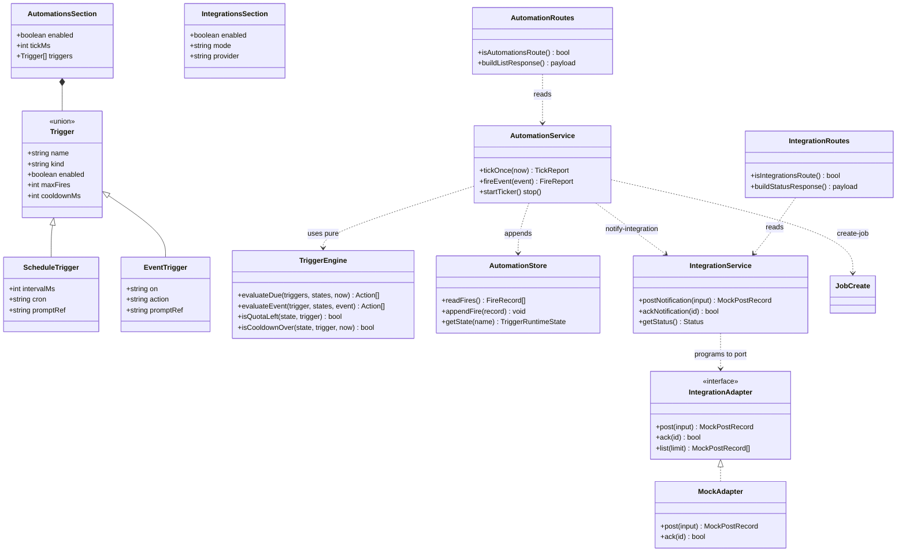
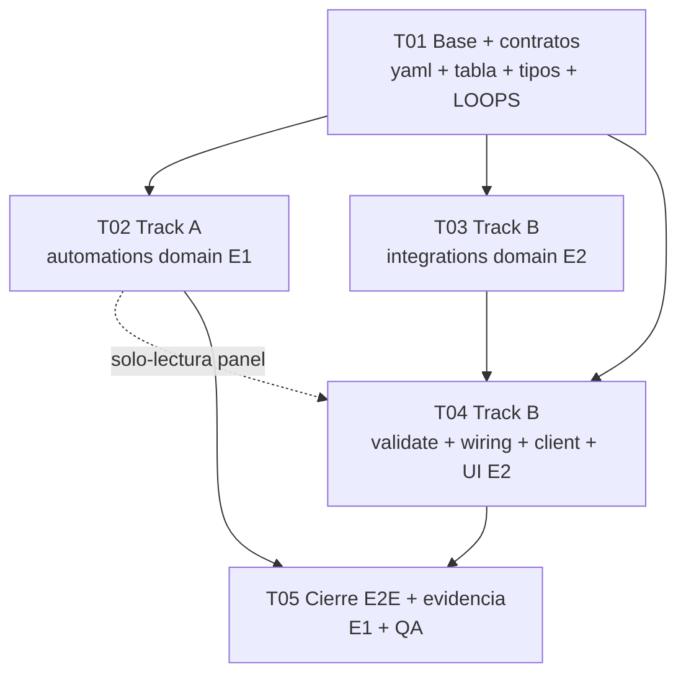

# DESIGN Incremental — Ola 14 Automations + Integrations (lift deferral, God-mínimo)

> **Estado:** diseño vigente desde 2026-09-05. Complementa `docs/MASTER-PLAN-FACTORY.md`, `docs/MASTER-PLAN-PARIDAD.md`, `docs/MASTER-PLAN-MODULARIDAD.md §6`, `docs/LOOPS.md`, `docs/E2E-HALLAZGOS.md`; no los reemplaza.
> **Origen:** `software-ola14-integrations/PRD-ola14-incremental.md` (Xu, leído entero) + lecturas obligatorias verificadas en código real.
> **Baselines medidos 2026-09-05:** `factoryServer.ts` = **3575 líneas totales** (`(Get-Content).Count`), **2803 líneas de código** (veredicto Tanda C, `docs/MASTER-PLAN-MODULARIDAD.md §6`); dispatch único = `matchRoute` en `headless-runtime/factory/routing/routeTable.ts` + `switch (routed.domain)` en `handleRequest` (`factoryServer.ts:2288-2335`); handlers delegan a dominios, server = cáscara (arranque, bind, tabla, delegación, CORS/SSE). Dominios existentes: `definition, health, intake, jobs, loaders, measure, notifications, review, routing, startup, triageSpec, verify` (+ `shared` = `headless-runtime/shared/roles.ts`, **no** `factory/shared/roles.ts`). No existen `automations/` ni `integrations/`.
> **Invariantes no-negociables:** JAMÁS tocar daemon 17680 / restart / taskkill / `pnpm dev|build`; `tsc` 0; pacts F01–F14 intactos; pollings 2.5s/5s/30s intactos; ESM cero `require()`; PowerShell siempre con `-Encoding utf8`; comandos con timeout explícito.
> **Decisiones default (fijadas acá):** `provider=linear` mock-local · `schedule = intervalMs XOR cron` (exactly-one) · `automations.json` central = `factory/.automations.json` con cap dura.

---

## 1. Implement方案 + stack (Implementation Approach)

### 1.1 Core technical challenges

1. **Triggers vivos sin riesgo (Reglas 7–8).** El peligro no es disparar un job: es dispararlo en loop. Todo automatismo necesita quota (`maxFires`), silencio (`cooldownMs`), apagado (`enabled`, `0 = off`) y evidencia (`triggerRef` + timeline + `automations.json`). El diseño separa **decisión pura** (`triggerEngine.ts`, sin I/O, testeable offline) de **efectos acotados** (`automationService.ts`, un tick = una pasada, sin re-programarse a sí mismo).
2. **Una integración probada sin secretos.** Nada de SDK externo, nada de red, nada de tokens. Patrón puerto-adaptador: `integrationService.ts` programa contra la interfaz `IntegrationAdapter`; `mockAdapter.ts` es la única implementación P0 (disco local + caps). El P1-`live` futuro implementa la misma interfaz sin tocar callers. El validador **rechaza** cualquier campo secreto en P0 (fail-closed).
3. **Cero regresión sobre el 65% que anda.** God-mínimo estricto: `factoryServer.ts` recibe **solo 4 líneas de delegación** (`case "dominio": await handler…; break;`), una por ruta nueva, vía `routeTable` + `matchRoute` existentes. Cero negocio en el server. Cero polling nuevo en renderer (las cards reusan 2.5s/5s/30s). Cero schemas rotos (todo aditivo, `superRefine` zod 4).

### 1.2 Framework / library selections

| Decisión | Justificación |
|---|---|
| TypeScript ESM puro, cero `require()` | Contrato C1 del repo; todo el daemon ya es ESM |
| `zod@4` + `superRefine` para los 4 schemas nuevos | Mismo stack que `definitionValidate.ts`, `scorer.ts`, `benchmark.ts`; `superRefine` expresa exactly-one (`intervalMs XOR cron`) y allowlists con issues accionables |
| Sin SDK externo (ni `@linear/sdk` ni `@slack/web-api`) | P0 es `mock-local`: SDK = superficie + secretos + red; prohibido por PRD P0-3 |
| `node:test` + `tsx` (suites existentes) | Precedente Olas 5–20: suites por invocación directa, `package.json` NO se toca |
| `factoryClient.ts` extendido (fail-safe, fetch inyectado) | Contrato FASE 1: un cliente, una red; cada op nueva = 1 timeout nombrado + fallback `ok:false`, nunca lanza |
| Reuso: `workItemStore` + `jobs/jobCreate` + `notify/notifications` + `agentLoader.parseFactoryYaml` | Un escritor por artefacto (C3): jobs los crea el dueño jobs, avisos los emite el dueño notify, yaml lo parsea el dueño loader. Automations/integrations **orquestan, no duplican** |

### 1.3 Architecture patterns

- **Puertos y adaptadores (integraciones):** `IntegrationAdapter { post, ack, list }` ← `mockAdapter` (P0). `live` futuro = otro adaptador, cero cambios en callers.
- **Reglas puras + servicio con efectos (automations):** `triggerEngine` (puro: `triggers × state × now × event? → actions[]`) + `automationService` (efectos: lee yaml, escribe `.automations.json`, crea jobs, notifica, postea al mock). El ticker es lifecycle delgado (`setInterval` único + `clearInterval`).
- **Tabla de rutas (C8):** 4 filas nuevas en `ROUTE_TABLE`; el server solo agrega 4 `case`. Sin tabla no hay ruta.
- **Definition que grita (Ola 20):** `definitionValidate.ts` + `definitionRoutes.ts` (intactas en forma) ganan reglas; badge existente las muestra en el tick 30s.

### 1.4 God-budget

| Métrica | Baseline | Delta permitido | Cómo se enforcea |
|---|---|---|---|
| `factoryServer.ts` total | 3575 | **+4 líneas** (4 `case` de delegación, 1 por ruta) + ningún import de negocio extra salvo 2 (`automationRoutes`, `integrationRoutes` — idealmente 0 si re-exportan por `jobs/`/`notifications/`; ver T04) | `git diff --stat` en reporte + test `route-table` extiende filas 36→40 |
| `factoryServer.ts` código | 2803 | +0 lógica (handlers viven en dominios) | QA: grep de negocio en los 4 handlers = vacío |
| `setInterval` nuevos en daemon | 0 | **+1** (`AUTOMATION_TICK`, `tickMs` fijo, con `clearInterval`) | `docs/LOOPS.md` fila A01 + meta-test |
| `setInterval` nuevos en renderer | 0 | **+0** (cards reusan N02–N04) | review de diff |

---

## 2. File List (lista cerrada, paths relativos exactos)

### 2.1 Nuevos — dominio automations (dueño: Track A)

```
headless-runtime/factory/automations/automationTypes.ts
headless-runtime/factory/automations/automationStore.ts
headless-runtime/factory/automations/triggerEngine.ts
headless-runtime/factory/automations/automationService.ts
headless-runtime/factory/automations/automationRoutes.ts
headless-runtime/factory/automations/index.ts
```

### 2.2 Nuevos — dominio integrations (dueño: Track B)

```
headless-runtime/factory/integrations/integrationTypes.ts
headless-runtime/factory/integrations/mockAdapter.ts
headless-runtime/factory/integrations/integrationService.ts
headless-runtime/factory/integrations/integrationRoutes.ts
headless-runtime/factory/integrations/index.ts
```

### 2.3 Nuevos — UI cards (excepción justificada #1: el PRD §3.2 exige 2 secciones visibles; son presentacionales, cero negocio, reusan `factoryClient` + pollings existentes)

```
src/features/factoryLab/components/AutomationsPanel.tsx
src/features/factoryLab/components/IntegrationsPanel.tsx
```

### 2.4 Nuevos — tests (excepción justificada #2: contrato del repo = cada dominio trae sus suites; `package.json` NO se toca, invocación directa como Olas 5–20)

```
tests/automations-trigger-engine.test.ts
tests/automations-service.test.ts
tests/automations-routes.test.ts
tests/integrations-mock.test.ts
tests/integrations-service-routes.test.ts
tests/definition-validate-automations.test.ts
```

### 2.5 Modificados (lista blanca, nadie más se toca)

```
factory/factory.yaml                                        (secciones automations: + integrations:, comentadas como el resto)
headless-runtime/factory/definitionValidate.ts              (+ reglas A/I; formas intactas)
headless-runtime/factory/routing/routeTable.ts              (+ 4 filas; MATCH intacto)
headless-runtime/factory/factoryServer.ts                   (+ 4 case de 1 línea; cuerpos en dominios)
headless-runtime/factory/agentLoader.ts                     (+ parseAutomationsSection/parseIntegrationsSection SOLO si el dueño validate lo pide; preferencia: parsers viven en automationTypes/integrationTypes y el loader re-exporta — C7)
src/lib/factoryClient.ts                                    (+ 4 ops + 4 timeouts nombrados; formas viejas intactas)
src/features/factoryLab/FactoryLabPage.tsx                  (+ montar las 2 cards; cero polling nuevo)
docs/LOOPS.md                                               (+ filas A01–A06, I01–I03)
tests/no-unbounded-loops.test.ts                            (+ BOUNDED/CONSTANTS de A/I; FOR_EXEMPT si aplica; sin aflojar nada existente)
scripts/factory.mjs                                         (SIN cambios — validate ya cubre nuevas reglas por el mismo comando)
```

**Nada más.** Cualquier archivo fuera de esta lista en el diff = FAIL de QA (scope-freeze por ola, regla 10 del plan Paridad).

---

## 3. Data Structures + Interfaces (zod 4 + superRefine)

> Todos los schemas viven en su dominio (`automationTypes.ts` / `integrationTypes.ts`), se IMPORTAN desde `definitionValidate.ts` y `agentLoader.ts` (C6/C7: vocabulario único, nada duplicado). ESM, cero `require()`, nunca lanzan hacia el server (safeParse + issues).

```typescript
// automationTypes.ts — fuente única de triggers (C6)
import { z } from "zod";

export const TRIGGER_EVENT_ALLOWLIST = ["job-complete", "ask_human", "proposal-ready"] as const;
export const TRIGGER_ACTION_ALLOWLIST = ["create-job", "notify-integration"] as const;
export const AUTOMATIONS_MAX_TRIGGERS = 20;          // cap dura (LOOPS A06)
export const AUTOMATION_TICK_DEFAULT_MS = 30000;     // el ÚNICO ticker nuevo
export const AUTOMATIONS_MAX_ENTRIES = 200;          // cap de factory/.automations.json (central, ring)
export const AUTOMATION_NAME_MAX = 64;
export const AUTOMATION_EVENT_ID_MAX = 128;

const baseTrigger = z.object({
  name: z.string().min(1).max(AUTOMATION_NAME_MAX),
  kind: z.enum(["schedule", "event"]),
  enabled: z.boolean().default(true),                // Regla 8: por-trigger off-switch
  maxFires: z.number().int().min(0).default(5),      // 0 = off (estilo samplingRate:0)
  cooldownMs: z.number().int().min(0).default(60000),// 0 = sin cooldown, siempre acotado por maxFires
});

export const ScheduleTriggerSchema = baseTrigger.extend({
  kind: z.literal("schedule"),
  intervalMs: z.number().int().min(1000).optional(), // mín 1s (anti-spam estructural)
  cron: z.string().min(1).max(64).optional(),        // cron-like 5 campos; se evalúa contra el tick, sin lib externa
  promptRef: z.string().min(1).max(256),             // path relativo a factory/ (anti-traversal como agentLoader)
}).superRefine((t, ctx) => {
  const hasI = t.intervalMs !== undefined, hasC = t.cron !== undefined;
  if (hasI === hasC) ctx.addIssue({ code: "custom", path: ["intervalMs"], message: "schedule triggers require exactly one of intervalMs | cron" });
  if (t.cron !== undefined && !/^(\S+\s+){4}\S+$/.test(t.cron.trim()))
    ctx.addIssue({ code: "custom", path: ["cron"], message: "cron must be 5-field cron-like (minute hour dom month dow)" });
  if (t.promptRef.includes("..") || t.promptRef.startsWith("/") || t.promptRef.includes("\\"))
    ctx.addIssue({ code: "custom", path: ["promptRef"], message: "promptRef must be a relative factory/ path (no traversal)" });
});

export const EventTriggerSchema = baseTrigger.extend({
  kind: z.literal("event"),
  on: z.enum(TRIGGER_EVENT_ALLOWLIST),               // allowlist cerrada (pact gate intacto: jamás crea job desde pact id)
  action: z.enum(TRIGGER_ACTION_ALLOWLIST),
  promptRef: z.string().min(1).max(256).optional(),  // requerido solo si action=create-job (ver refine)
}).superRefine((t, ctx) => {
  if (t.action === "create-job" && !t.promptRef)
    ctx.addIssue({ code: "custom", path: ["promptRef"], message: "promptRef required when action=create-job" });
});

export const TriggerSchema = z.discriminatedUnion("kind", [ScheduleTriggerSchema, EventTriggerSchema]);

export const AutomationsSectionSchema = z.object({
  enabled: z.boolean().default(true),                // KILL-SWITCH GLOBAL (Regla 8)
  tickMs: z.number().int().min(0).default(AUTOMATION_TICK_DEFAULT_MS), // 0 = ticker apagado
  triggers: z.array(TriggerSchema).max(AUTOMATIONS_MAX_TRIGGERS).default([]),
}).strict();                                         // strict: typos gritan en vez de degradar en silencio

// Estado en memoria + evidencia central (factory/.automations.json — DECISIÓN: central con cap)
export interface TriggerRuntimeState { fires: number; lastFireAt: string | null; lastEventId: string | null; nextTickAt: string | null; disabledReason: string | null; }
export interface AutomationFireRecord { seq: number; triggerName: string; kind: "schedule" | "event"; at: string; action: "create-job" | "notify-integration"; jobId: string | null; eventId: string | null; result: "created" | "notified" | "skipped-quota" | "skipped-cooldown" | "skipped-disabled" | "skipped-dedupe"; note?: string; }
export interface AutomationsFileShape { version: 1; entries: AutomationFireRecord[]; }  // ring: cap AUTOMATIONS_MAX_ENTRIES, evict oldest

// triggerRef — lo que cada job creado por trigger lleva en job.json (aditivo, restore tolerante)
export const TriggerRefSchema = z.object({
  triggerName: z.string(), firedAt: z.string(), eventId: z.string().nullable().default(null),
});
```

```typescript
// integrationTypes.ts — fuente única de integración P0 (C6)
import { z } from "zod";

export const INTEGRATION_MOCK_MAX = 100;             // cap de factory/.integrations-mock.json (paralelo a NOTIFICATIONS_MAX)
export const INTEGRATION_TITLE_MAX = 200;
export const INTEGRATION_BODY_MAX = 2000;

// P0: mock-local + provider linear ÚNICOS. `live` y `slack` se rechazan con error accionable (no warn).
export const IntegrationsSectionSchema = z.object({
  enabled: z.boolean().default(true),                // KILL-SWITCH (Regla 8)
  mode: z.literal("mock-local", { message: 'mode must be "mock-local" in P0 (live is P1-design-only)' }),
  provider: z.literal("linear", { message: 'provider must be "linear" in P0 (slack is P1)' }),
}).strict().superRefine((v, ctx) => {
  for (const k of Object.keys(v as object))
    if (/token|secret|apikey|api_key|webhook|bearer|password/i.test(k))
      ctx.addIssue({ code: "custom", path: [k], message: `secret field "${k}" forbidden in P0 mock-local (no credentials exist)` });
});

export const MockPostInputSchema = z.object({
  provider: z.literal("linear"),
  kind: z.enum(["issue", "notification"]).default("notification"),
  jobId: z.string().max(128).nullable().default(null),
  title: z.string().min(1).max(INTEGRATION_TITLE_MAX),
  body: z.string().max(INTEGRATION_BODY_MAX).default(""),
});
export interface MockPostRecord { id: string; provider: "linear"; kind: "issue" | "notification"; jobId: string | null; title: string; body: string; at: string; acked: boolean; ackAt: string | null; }
export interface IntegrationsMockFileShape { version: 1; posts: MockPostRecord[]; }  // ring cap INTEGRATION_MOCK_MAX

// Puerto (P1-live implementa la misma interfaz, cero cambios en callers)
export interface IntegrationAdapter {
  post(input: z.infer<typeof MockPostInputSchema>): MockPostRecord;
  ack(id: string): boolean;
  list(limit?: number): MockPostRecord[];
}
```

```typescript
// factory.yaml — superficie de config (SOLO este archivo configura; cero UI con secretos)
automations:
  enabled: true
  tickMs: 30000            # el ÚNICO ticker nuevo; 0 = off (Regla 8)
  triggers:
    - name: "nightly-trivial"
      kind: "schedule"
      enabled: true
      intervalMs: 86400000 # XOR cron: exactly-one (validator)
      promptRef: "factory/prompts/nightly.md"
      maxFires: 5
      cooldownMs: 3600000
    - name: "announce-ask-human"
      kind: "event"
      enabled: true
      on: "ask_human"      # allowlist: job-complete | ask_human | proposal-ready
      action: "notify-integration"
      maxFires: 20
      cooldownMs: 60000
integrations:
  enabled: true
  mode: "mock-local"       # P0 ONLY; live => error
  provider: "linear"       # P0 ONLY; slack => error (es P1)
```



> Diagrama extraído también a `docs/class-diagram.mermaid` (solo el bloque mermaid).

---

## 4. Program Call Flow

### 4.1 Tick schedule → quota/dedupe → create job → notify → mock post → ack → timeline

```mermaid
sequenceDiagram
    autonumber
    participant Ticker as AutomationTicker<br/>(1× setInterval tickMs=30s)
    participant Svc as AutomationService<br/>(tickOnce)
    participant Eng as TriggerEngine<br/>(pure, no I/O)
    participant Store as AutomationStore<br/>(factory/.automations.json, cap 200)
    participant Jobs as jobs/jobCreate<br/>(single writer jobs)
    participant Notif as notify/notifications<br/>(single writer .notifications.json)
    participant Integ as IntegrationService<br/>+ MockAdapter
    participant UI as Automations/IntegrationsPanel<br/>(reuse polls 2.5/5/30s)

    Ticker->>Svc: tickOnce(now)
    Svc->>Svc: automations.enabled? tickMs==0? → skip (Regla 8)
    Svc->>Eng: evaluateDue(triggers, states, now)
    Eng->>Eng: per trigger: enabled? quota (fires&lt;maxFires)? cooldown over? cron/interval due?
    Eng-->>Svc: actions[] (0..N, ≤1 per trigger per tick)
    loop each action
        Svc->>Store: appendFire({triggerName, at, result: pending…})
        alt action = create-job
            Svc->>Jobs: create({prompt from promptRef, triggerRef:{triggerName, firedAt}})
            Jobs-->>Svc: jobId (pact-id → refused by pact gate, recorded skipped-quota)
            Svc->>Notif: notify({kind: trigger-fired, workItemId: jobId})
        else action = notify-integration
            Svc->>Integ: postNotification({provider:linear, jobId?, title, body})
            Integ->>Integ: integrations.enabled? mode==mock-local? else refused+issue
            Integ-->>Svc: MockPostRecord{id}
            Svc->>Notif: notify({kind: integration-post, body: mock id})
        end
        Svc->>Store: appendFire({…result: created|notified, jobId}) + update state (fires++, lastFireAt)
    end
    Svc-->>Ticker: TickReport{fired, skipped[]}

    Note over UI: operator sees row → link jobId (2.5s jobs poll)

    rect rgb(240,248,240)
    Note over Integ,UI: ACK PATH (reuses notification ack; mock reconciles)
    UI->>Integ: POST /factory/integrations/test-post (manual) → MockPostRecord
    UI->>Notif: POST /factory/notifications/:id/ack (existing route, untouched)
    Notif-->>Integ: reconcile (ackNotification(mockId) best-effort, never throws)
    Integ->>Store: ackAt set + timeline event integration-acked
    end
```

### 4.2 Event path (job-complete / ask_human / proposal-ready)

```
event-bus/notify emit → AutomationService.fireEvent(event{id, kind, jobId})
  → dedupe: event.id ∈ seenIds (cap 500, FIFO) → skipped-dedupe
  → per trigger on==event.kind: enabled? quota? cooldown?
  → action create-job → jobs/jobCreate (+triggerRef.eventId) | notify-integration → Integ.post
  → Store.appendFire + timeline event (single writer resultStore/timeline path existente)
```

> Diagrama extraído también a `docs/sequence-diagram.mermaid` (solo el bloque mermaid).

### 4.3 Rutas nuevas (4 filas en ROUTE_TABLE, 4 `case` de 1 línea en el server)

| # | Método + path | Dominio tabla | Delegación server (1 línea) | Dueño del cuerpo |
|---|---|---|---|---|
| R1 | `GET /factory/automations` | `automations-list` (exact, len 2) | `case "automations-list": await handleAutomationsListRoute(res); break;` | `automations/automationRoutes.ts` |
| R2 | `POST /factory/automations/tick` | `automations-tick` (exact, len 3) | `case "automations-tick": await handleAutomationsTickRoute(res); break;` | `automations/automationRoutes.ts` (llama `tickOnce`, bounded single pass; la usan ticker-manual, tests y botón UI) |
| R3 | `GET /factory/integrations/status` | `integrations-status` (exact, len 3) | `case "integrations-status": await handleIntegrationsStatusRoute(res); break;` | `integrations/integrationRoutes.ts` |
| R4 | `POST /factory/integrations/test-post` | `integrations-test-post` (exact, len 3) | `case "integrations-test-post": await handleIntegrationsTestPostRoute(req, res); break;` | `integrations/integrationRoutes.ts` (solo mock; `integrations.enabled=false` → 409 honesto) |

Sin alias dual `/work-items` (son globales como `notifications-list`/`definition-status`, no job-scoped). Formas: `{ok, data, …}` espejo de `notifications-list`/`definition-status` (C5 aditivo).

---

## 5. Task List (ordenada por dependencia, 2 engineers SIN SOLAPE)

**Regla de hierro (heredada de MODULARIDAD §3): `factoryServer.ts` y `routeTable.ts` con UN escritor (T01 crea las 4 filas; T04 agrega los 4 `case`). Ningún archivo con dos escritores. Contratos entre tracks por escrito antes de codificar (firmas §3 + §4.3).**

| ID | Task | Track / Owner | Archivos (todos los que toca) | Depende | Prio | Done (criterios verificables) | Orden impl. |
|----|------|---------------|-------------------------------|---------|------|-------------------------------|-------------|
| T01 | **Base + contratos compartidos** (yaml + tabla + validate-skeleton + client-consts + LOOPS) | shared (E1+E2 pair, 1 PR) | `factory/factory.yaml`, `headless-runtime/factory/routing/routeTable.ts` (+4 filas R1–R4), `headless-runtime/factory/automations/automationTypes.ts` (schemas trigger), `headless-runtime/factory/integrations/integrationTypes.ts` (schemas integration), `docs/LOOPS.md` (filas A01–A06/I01–I03), `src/lib/factoryClient.ts` (4 timeout consts, sin ops aún) | — | P0 | `npx tsx --test tests/route-table.test.ts` verde con 40 filas; `factory validate` rojo-verde manual con yaml ejemplo (bad file:line); LOOPS cita las 9 cotas con constantes reales; tsc 0 | 1º |
| T02 | **Track A — dominio automations** (engine puro + store + service + routes + ticker) | Track A (E1) | `automations/{automationStore.ts, triggerEngine.ts, automationService.ts, automationRoutes.ts, index.ts}` (+ `automationTypes.ts` solo-lectura de T01), `tests/automations-trigger-engine.test.ts`, `tests/automations-service.test.ts`, `tests/automations-routes.test.ts` | T01 | P0 | schedule exactly-one + quotas + cooldown + dedupe + `0=off` en sus 3 niveles; `tickOnce` 1 pasada acotada; ticker único `tickMs` con `clearInterval`; `triggerRef` en job creado; pact-id → rechazo registrado; suites nuevas 100% + tsc 0; cero imports de integrations/ | 2º (paralelo con T03) |
| T03 | **Track B — dominio integrations** (tipos ya en T01 + mock + service + routes) | Track B (E2) | `integrations/{mockAdapter.ts, integrationService.ts, integrationRoutes.ts, index.ts}` (+ `integrationTypes.ts` solo-lectura de T01), `tests/integrations-mock.test.ts`, `tests/integrations-service-routes.test.ts` | T01 | P0 | `post→disco→ack→timeline` sin red/tokens (test assert `fetch` jamás llamado); caps 100 con evict; `enabled=false` → 409 honesto; `mode!=mock-local` / `provider!=linear` / campo secreto → error validator; suites 100% + tsc 0; cero imports de automations/ | 2º (paralelo con T02) |
| T04 | **Track B — validate + wiring + client + UI** (grita + delega + muestra) | Track B (E2) | `headless-runtime/factory/definitionValidate.ts`, `headless-runtime/factory/agentLoader.ts` (solo re-export C7, si hace falta), `headless-runtime/factory/factoryServer.ts` (4 `case`, nada más), `src/lib/factoryClient.ts` (4 ops), `src/features/factoryLab/components/AutomationsPanel.tsx`, `src/features/factoryLab/components/IntegrationsPanel.tsx`, `src/features/factoryLab/FactoryLabPage.tsx`, `tests/definition-validate-automations.test.ts`, `tests/no-unbounded-loops.test.ts` | T01, T03 (lee T02 solo-lectura para panel; NO escribe automations/) | P0 | validate: 8+ reglas con file:line + fallback visible (daemon sigue sirviendo); server diff = 4 líneas + 0 negocio (grep QA); client 4 ops fail-safe offline; panels con datos reales, 0 polling nuevo (assert 1 `setInterval` automation en todo daemon); tsc 0 | 3º |
| T05 | **Cierre E2E + evidencia** (quotas en vivo + kill-switch + reporte) | E1 (con QA) | `docs/LOOPS.md` (veredicto final), `software-ola14-integrations/REPORT-ola14.md` (nuevo, reporte de ola), `factory/.automations.json` + `factory/.integrations-mock.json` (evidencia viva, no código) | T02, T04 | P1 | Un tick vivo: schedule crea 1 job con `triggerRef` + timeline; evento `ask_human` → mock post → ack reconciliado; `automations.enabled=false` frena ticks (test + 1 tick vivo); `tsc` 0; pacts F01–F14 verdes; God 3575→3579 documentado | 4º |

**Orden de implementación:** T01 → (T02 ∥ T03) → T04 → T05. T02 y T03 NO se tocan entre sí (contrato T01 mediante). T04 es el único que edita `factoryServer.ts`/`definitionValidate.ts`/UI. T05 no edita código de dominios (solo evidencia + reporte).

### 5.1 Por qué no hay solape (matriz escritor-archivo)

| Archivo | T01 | T02 | T03 | T04 | T05 |
|---|---|---|---|---|---|
| `routeTable.ts` | **W** | — | — | — | — |
| `automationTypes/integrationTypes` | **W** | R | R | R | — |
| `automations/*` (5 resto) | — | **W** | — | — | — |
| `integrations/*` (4 resto) | — | — | **W** | — | — |
| `definitionValidate/agentLoader` | skeleton | — | — | **W** | — |
| `factoryServer.ts` | — | — | — | **W** | — |
| `factoryClient/Panels/Page` | consts | — | — | **W** | — |
| `factory.yaml/LOOPS` | **W** | — | — | — (solo lee) | veredicto |

---

## 6. Required Packages (dependencias)

**Cero nuevas.** Todo lo necesario ya está en el repo:

```
- zod@^4 (existente): schemas + superRefine (triggers exactly-one, allowlists, secret-forbidden)
- tsx (existente, dev): suites por invocación directa npx tsx --test
- node:test + node:assert/strict (stdlib): suites nuevas, offline total
- react + @mui/material + tailwind (existentes): las 2 cards (presentacionales)
```

Prohibido explícito en P0: `@linear/sdk`, `@slack/web-api`, cualquier lib `cron`, cualquier fetch a red externa, `.env`/tokens/fixtures con secretos. Si un engineer propone una dependencia, QA da FAIL salvo ADR firmado por el usuario.

---

## 7. Shared Knowledge (convenciones vinculantes)

```
- 1 ticker solo: AUTOMATION_TICK con tickMs default 30000 fijo; tickMs: 0 = off (Regla 8). Reuse pollings 2.5s jobs / 5s notifications / 30s health; CERO intervalos nuevos en renderer.
- 0 = off en todo: automations.enabled=false frena ticks; trigger.enabled=false salta ese trigger; maxFires:0 = nunca dispara; integrations.enabled=false => 409 honesto en outbound.
- Un escritor por artefacto (C3): jobs -> jobs/jobCreate; avisos -> notify/notifications; .automations.json -> automationStore; .integrations-mock.json -> mockAdapter; result rich -> resultStore. Nadie más escribe esos archivos.
- Evidence writers únicos: cada fire escribe 1 AutomationFireRecord + 1 evento timeline con triggerName; cada mock post escribe 1 MockPostRecord + 1 notificación espejo (dedupe por id).
- Errores con file:line: todo issue de validate trae {file, line?, rule, message, severity}; line = aproximada honesta (se cita así en UI); error bloquea badge en rojo, warn = ámbar; fallback visible, daemon nunca muere por definition rota.
- Pact gate intacto: ningún trigger crea job desde pact id (tests/no-unbounded-loops + gate isPactJob); Review jamás para pacts.
- ESM + cotas (C1): cero require(); cada loop/for/while/setInterval/setTimeout/retry nuevo exige fila en docs/LOOPS.md con constante real + entrada BOUNDED en no-unbounded-loops.test.ts o el test da rojo.
- PowerShell con -Encoding utf8 siempre (Get-Content -Encoding utf8); comandos con timeout explícito (p. ej. --test-timeout / AbortController / timeoutMs nombrados).
- factoryClient: cada op nueva con timeout nombrado exportado (FACTORY_AUTOMATIONS_TIMEOUT_MS=3000, FACTORY_AUTOMATIONS_TICK_TIMEOUT_MS=5000, FACTORY_INTEGRATIONS_TIMEOUT_MS=3000, FACTORY_INTEGRATION_POST_TIMEOUT_MS=3000), fetch inyectado, retorno ok:false ante red caída, nunca lanza.
- Config solo en factory.yaml (cero secretos en disco salvo mocks locales sin credenciales); UI read-only + hint "edit factory.yaml".
- Scope-freeze: lo P1 (slack, live-seam, run-history UI) NO se codea; si aparece, bitácora como carry-over.
```

---

## 8. Task Dependency Graph



Paralelismo real: T02 ∥ T03 tras T01. Camino crítico: T01 → T03 → T04 → T05.

---

## 9. Anything UNCLEAR (asunciones + las 3 open del PRD resueltas como propuesta)

1. **Triggers seed (PRD-Q1).** ASUNCIÓN FIJADA: P0 = `schedule` (intervalMs XOR cron, exactly-one) + 3 eventos (`job-complete`, `ask_human`, `proposal-ready`). `schedule` acepta ambas formas pero exige exactamente una (el PRD dudaba; el exactly-one cierra la ambigüedad y el test lo enforcea). `webhook-in`/`file-watch` quedan P2.
2. **Linear-first vs slack-first (PRD-Q2).** RECOMENDACIÓN: **linear-first**. Razón: issue-shape simple (`title/body/jobId` → issue/notificación) encaja directo con `triggerRef` + `ask_human` sin inventar semántica de canales/threads de Slack; el mock de issues es trivialmente auditable en disco; Slack llega en P1 con el mismo puerto `IntegrationAdapter`. Si el usuario ordena slack-first, el cambio es 1 literal (`provider`) + textos del mock: el diseño lo absorbe sin re-arquitectura.
3. **Fake credentials vs pure mock (PRD-Q3).** RESOLUCIÓN: **mock puro sin secrets** (cero campos token/secret/webhook; el validator los rechaza con `secret-forbidden`). Sin `.env`, sin fixtures con fake-tokens (un fake-token entrena el hábito contrario). El seam `live` llega solo como diseño en P1 (interfaz ya lista), nunca cableado.
4. **Ubicación de evidencia.** DECISIÓN: `factory/.automations.json` central con cap 200 (no per-job: evita N archivos + reconciliaciones; el `triggerRef` por-job en `job.json` da el link inverso). `.notifications.json` se REUSA (no se duplica) para avisos de trigger.
5. **Ack path.** DECISIÓN: el ack canónico es el existente `POST /factory/notifications/:id/ack` (cero rutas nuevas para ack); `mockAdapter.ack` reconcilia best-effort (nunca lanza, nunca bloquea). R4 (`test-post`) existe solo para probar el outbound sin disparar un job.
6. **`shared/roles.ts` citado en el pedido no existe en esa ruta** (vive en `headless-runtime/shared/roles.ts`): no se toca; los nuevos dominios no agregan roles (triggers ≠ roles de agente).
7. **Cron sin lib externa:** el matcher es 5-campos minuto-exacto evaluado en cada tick (suficiente con tick 30s; documentado como aproximado al minuto, no al segundo). Si se necesita precisión mayor, es P2 con lib justificada por ADR.

---

## Apéndice — checklist invariantes por task (QA lo exige en cada PR)

- [ ] `tsc` 0 (default; headless preexistentes ajenos documentados si aparecen)
- [ ] pacts F01–F14 verdes (gate por id intacto)
- [ ] `npx tsx --test tests/no-unbounded-loops.test.ts` verde (toda cota nueva registrada)
- [ ] `factoryServer.ts` diff = solo lo permitido (T04: 4 `case`; resto: 0 líneas)
- [ ] Pollings 2.5/5/30s intactos; `buildId` = commit hash visible
- [ ] PowerShell con `-Encoding utf8`; comandos con timeout explícito
- [ ] Daemon 17680 intacto (sin restart/taskkill/`pnpm dev|build` en ningún script/test)
