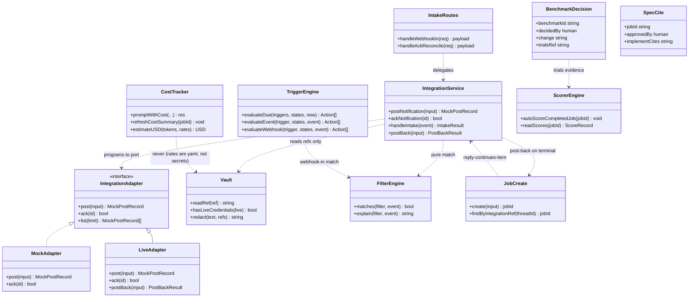
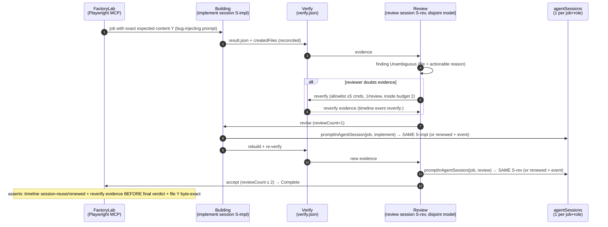
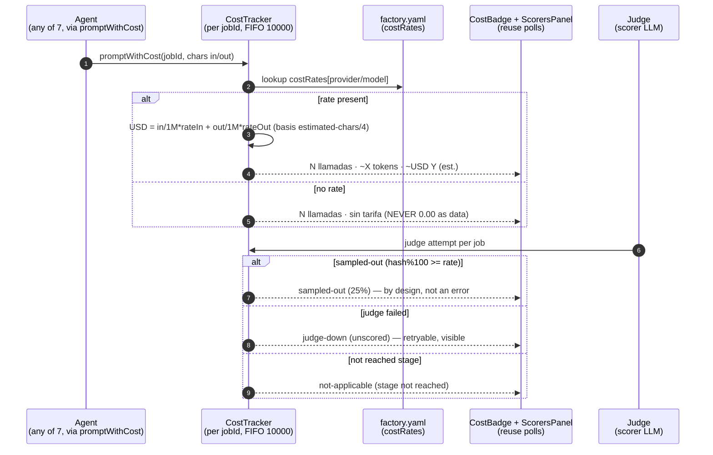
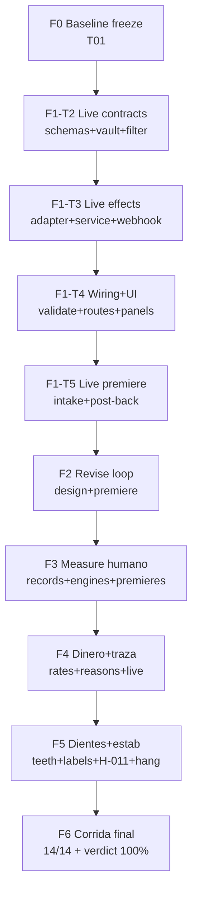

# PLAN-100 — Warp Parity 100% (autonomous execution plan)

- **Date (UTC):** 2026-09-05
- **Architect:** Gao (software-architect)
- **Repo:** `termcanvas`
- **Language:** neutral English (plan artifact). Chat summary in Rioplatense Spanish.
- **Status:** BINDING execution file. Executed autonomously phase by phase (F0 → F6) until 100% is reached.
- **Output path:** `software-paridad-100/PLAN-100-PARIDAD.md`

## Mandatory inputs read (all, entire)

1. `software-auditoria-paridad/AUDIT-paridad.md` — whole file: 20 dims, scores, formula **70.0 global / 50.6 live**, top-5 gaps, baselines (**God 3581 total / 2803 code, 40 route rows, 14 domains**).
2. `docs/MASTER-PLAN-FACTORY.md` — Waves 1–13 + rules 1–6 + E2E-perfect §5.
3. `docs/MASTER-PLAN-PARIDAD.md` — Waves 15–20 + rules 7–8 + E2E-perfect v2 §9.
4. `docs/MASTER-PLAN-E2E.md` §6 — run log through run 8 + 14 cases E2E-01..E2E-14 + rules E1–E6.
5. `docs/E2E-HALLAZGOS.md` — H-001..H-013 (states VERIFICADO / CERRADO / ABIERTO).
6. `docs/MASTER-PLAN-MODULARIDAD.md` §6 — F1–F4 + anti-God batches (single dispatch, God 3575) + contribution contract C1–C10.
7. `docs/LOOPS.md` — 50 + 9 rows (B/L/M/N/P/S/A/I), 0 SIN COTA.
8. `software-ola14-integrations/PRD-ola14-incremental.md` + `DESIGN-ola14-incremental.md` + `QA-ola14-report.md` (216/216) + `REPORT-ola14.md` — Ola 14 state: **mock-local linear, live tick `fired:0`, 2 mock posts, ack without HTTP route (honest 404)**.

## Starting point (frozen reference, see F0 for freeze procedure)

| Signal | Value |
|---|---|
| Global parity (code + live, P0-weighted) | **68–74%, point 70.0** |
| Live-only parity | **48–54%, point 50.6** |
| Code-only parity | **68–74%** |
| Gap to close (global) | **~30 points** (70.0 → 100) |
| Gap to close (live) | **~50 points** (50.6 → 100) |
| God server `factoryServer.ts` | **3581 total lines** (`(Get-Content -Encoding utf8 ...).Count`), 2803 code (Tanda C) |
| Route table | **40 declared rows**, R1–R4 automations/integrations (`routeTable.ts:72-75,121-124`), 285 lines |
| Factory domains | **14** (`automations, definition, health, intake, integrations, jobs, loaders, measure, notifications, review, routing, startup, triageSpec, verify`) |
| `factory.yaml` sections | **13** |
| `factoryClient` ops | **36 exported ops** + 32 named timeouts (incl. 4 Ola-14) |
| Daemon | `buildId=15fece3e == HEAD`, port 17680, `enabled:true, tickMs:30000, triggers:[]`, integrations `mock-local/linear count:2 lastAckedAt:null`, `.automations.json` absent (correct) |
| Formula | `parity = Σ(score_i × w_i) / Σ(w_i)`, `w_i = 2` iff dim ∈ {D14,D15,D18,D19,D20} else 1; total weight **25**; weighted_sum **1750**; live_sum **1265** |
| Score table used | D01 90, D02 85, D03 90, D04 55, D05 75, D06 70, D07 65, D08 95, D09 70, D10 75, D11 60, D12 55, D13 90, D14 80×2, D15 60×2, D16 50, D17 45, D18 55×2, D19 60×2, D20 85×2 |

## Target verdict

**100% = all 20 dims Replica with LIVE evidence (browser + daemon + disk), zero Partial/No, recomputed global point ≥ 95 and live point ≥ 95 (reported band 95–100, disclosed as 100%).** No magic single number without the formula re-run in F6.

---

## 0. HARD PLAN CONSTRAINTS (written here, binding on every phase)

### 0.1 Cohesion / coupling + God budget

- All new logic lives in domain folders under `headless-runtime/factory/*` (existing 14 domains; new submodules only inside them, preferably `integrations/`, `measure/`, `review/`, `jobs/`, `notify/`, `runner/`, `definition/`).
- `headless-runtime/factory/factoryServer.ts` gets **ONLY 1-line delegation per new route** via the existing `routeTable` + single `matchRoute` dispatch (`switch (routed.domain)`). Zero business logic in the server. Bodies live in domains.
- **Explicit God budget per phase** (measured with `(Get-Content -Encoding utf8 headless-runtime/factory/factoryServer.ts).Count`):

| Phase | Allowed server delta | Allowed new daemon `setInterval` | Allowed new renderer `setInterval` |
|---|---|---|---|
| F0 | +0 | +0 | +0 |
| F1 | +2 lines (2 `case`, webhook-in + post-back/ack-reconcile) | +0 (reuses AUTOMATION_TICK 30s) | +0 |
| F2 | +0 (no new routes; live-premiere + asserts only, unless 1 display route needed → then +1) | +0 | +0 |
| F3 | +2 lines (2 `case` max: benchmark-decide record + proposal-decide link, only if no existing route covers) | +0 | +0 |
| F4 | +0 (no new routes) | +0 | +0 |
| F5 | +0 (no new routes; `vite.config.ts` H-011 fix is renderer-tooling, not daemon) | +0 | +0 |
| F6 | +0 | +0 | +0 |

- Any diff outside the phase file list = QA **FAIL** (scope-freeze).

### 0.2 Contracts (never broken without explicit migration documented here)

- **ESM with zero `require()`** in all new code (QA greps `require\s*\(`).
- **zod 4 + `superRefine`** for every new schema (exactly-one, allowlists, secret-forbidden, display-only invariants).
- **Pacts F01–F14 intact** (`isPactJob` canonical gate untouched; no trigger/scorer creates a job from a pact id; Review never for pacts).
- **Pollings intact:** jobs/logs **2.5s**, notifications bell **5s**, daemon health **30s**. Zero new renderer intervals (cards reuse them; definition badge reuses the 30s tick).
- **`buildId` = commit hash** surfaced in `/factory/health` + UI on every phase.
- **PowerShell with `-Encoding utf8` only** for all reads (`Get-Content -Encoding utf8`).
- **Explicit timeout on every command** (HTTP 15s; `validate` ≤ 30s; suites ≤ 120s each; `tsc` ≤ 180s).
- **NEVER: daemon 17680 restart / `taskkill` / `pnpm dev` / `pnpm build`.** Only read-only `GET`s (15s) + `node scripts/factory.mjs validate` (≤30s) + offline suites. If the daemon is down: record BLOQUEADO-infra, do not touch it; the USER restarts it.

### 0.3 Rules in force

- **Rules 1–8** (Factory §0 + Paridad §0): no hardcodes, no fake simulations (mocks only in tests behind explicit gates, never in the real path), definitions as code, human decides (no auto-merge/auto-adopt), evidence on disk (if not on disk it did not happen), live contracts, **zero unbounded loops**, **every automatism has an off-switch**.
- **E1–E6** (E2E plan): Playwright MCP mandatory for every PASS (snapshot asserts + disk asserts, screenshot is attachment only); **one case at a time**; E2E touches no code; quota is scarce — **if a run estimates > 50 LLM calls, ask the user for confirmation BEFORE starting**; verdict per case PASS/FAIL/BLOQUEADO, no grays; full traceability (`buildId`, job ids, timestamps, screenshots).
- **C1–C10** (Modularidad contribution contract): ESM/bounds, pure fail-safe functions, one validated atomic writer per artifact, best-effort disk, additive-only, single vocabulary, nothing duplicated, routes in the table, pure testable builders, traceability + use-zero test before deleting.
- **`0 = off` in every automatism** (`enabled:false`, `tickMs:0`, `maxFires:0`, `samplingRate:0`, `costTracking:false`, `agentSessions:false`, `reviewerReverify:false`, `improveProposalCooldown:0`, `notificationsEnabled/osNotifications:false`, `integrations.enabled:false` → honest 409, `liveMode:false` → mock-local only).
- **Every new loop → one `docs/LOOPS.md` row + meta-test entry** in `tests/no-unbounded-loops.test.ts` (drift = red). No merge without it.

### 0.4 Autonomous execution protocol (every phase)

Each phase F0–F6 ships with: **preconditions** (checklist), **numbered copyable steps** with exact commands, verifiable **DONE criteria** (test counts, `tsc` 0, `validate`, disk/UI asserts), **FAIL → rollback criteria**, and a **report to append**. Two engineers work with **zero file overlap** (writer-file matrix per phase); **QA gives a PASS/FAIL verdict per phase**; a phase that is not DONE does not open the next one.

---

## PART A — SYSTEM DESIGN

### 1. Implementation Approach

#### 1.1 Core technical challenges (in audit §6 leverage order)

1. **Real external intake + post-back (D19 → Replica).** Mock-local can never exceed Partial by definition. The hard parts: (a) a `live` seam that holds **zero secrets in repo/yaml/logs** (vault/env refs only, redacted logs, validator rejects secret fields in `mock-local` and requires vault refs in `live`); (b) **AND/OR filter matching** (pure, offline-tested) so only wanted events become jobs; (c) **reply-continues-item** (inbound reply with thread/issue id → same `workItem`, no dup — the D01 invariant extended across the wire); (d) **post-back** to the thread/issue on Complete/`ask_human` with evidence links. Pattern: port-adapter — `IntegrationService` programs against `IntegrationAdapter`; `mockAdapter` (P0, current) and `liveAdapter` (F1, new) implement the same port; zero caller changes. Live traffic is **opt-in per trigger** (`liveMode:false` default = mock-local behavior exactly as today).
2. **A live revise→rebuild→reverify loop in the SAME session ≤ 2 (D07/D16/D17 → Replica).** Code exists (Olas 5/16/17); 0 natural revises in 9 runs under flaky H-005. The work is: (a) a **bug-injected job design that deterministically earns a revise** (verifiable file content X vs exact expected Y, no prompt tricks); (b) asserting **same-session rebuild** via `agentSessions` + `sesión renovada` event; (c) asserting **reviewer-requested `reverify` evidence BEFORE the final verdict** inside `REVIEW_MAX_COUNT=2`; (d) small hardening only where live proves a hole (display of `reverify` evidence, session-reuse assert helper). No new budgets, no threshold changes.
3. **Human-in-the-measure live (D04/D11/D12 → Replica).** Three premieres, all code-complete: (a) **spec-approval** — a non-trivial job produces a real brief + human approves + implement cites it (E2E case with `needsSpecApproval` assert chain); (b) **a benchmark that actually decides** a model/config change — human weighs cost/quality, no auto-winner, decision recorded as evidence (`benchmark-decision` event + disk record); (c) **an auto-proposal born from 2 genuine fails, Adopted/Discarded from the notification** (rodaje Wachtturm: needs genuine fails; F3 runs the rodaje with confirmation). Small additive record types only.
4. **Real money + clear sampling trace (D15/D10 → Replica).** (a) Fill `costRates` for the models actually used (user-confirmed numbers, `factory.yaml` only) and assert a live **`~USD Y (est.)` badge with basis** (`estimated-chars/4`, `ratesRef`); never `USD 0.00` as data. (b) Make **sampled-out (25%) vs judge-down (unscored)** distinguishable in UI without reading daemon logs: additive `scoreReason` (`scored | sampled-out | judge-down | not-applicable`) persisted in `scores.json`, surfaced in ScorersPanel + baseline. Display-only, disk-compatible (old entries read as `judge-down` only if log proves it, else `unscored-legacy` — honest label, never rewritten history: P1.7 display-only rule preserved).
5. **Verify teeth + daemon stability (D05/D06 + infra).** (a) **Re-green H-012/H-013 live with a late-write case** (fixes exist with suites 8/8 + 7/7; need live proof with healthy LLM + late-write timing); (b) clear stale `ubuntu:22.04` labels (`shared/types/runner.ts` literal vs yaml, logs/header/profile strings); (c) **H-011 workaround → real fix or documented standalone-only mode** (override restart/exit of `vite-plugin-electron` if the version supports it, else pin documented standalone daemon via `scripts/factory.mjs` + health `buildId` check as the supported lab mode); (d) own the **`agent-sessions-migration` offline hang** (Ola-16 owner + re-check with live daemon, fix or quarantine-with-evidence per H3 doctrine, never a fixed skip-list).

#### 1.2 Framework / library selections

| Decision | Justification |
|---|---|
| TypeScript ESM pure, zero `require()` | C1 contract; whole daemon already ESM; QA greps it |
| `zod@4` + `superRefine` for all new schemas | Same stack as `definitionValidate.ts`, `scorer.ts`, `benchmark.ts`, Ola-14 types; expresses exactly-one (`intervalMs XOR cron`), recursive AND/OR filters, secret-forbidden, display-only recompute guards |
| Zero new runtime dependencies (no `@linear/sdk`, no `@slack/web-api`, no cron lib) | Live seam is a thin HTTPS port with injected `fetch` (testable offline, zero network in suites); SDK = surface + secrets + coupling; cron evaluated against the existing 30s tick (minute-exact, documented) |
| `node:test` + `tsx` suites by direct invocation | Precedent Olas 5–20; `package.json` NOT touched |
| `factoryClient.ts` extended (fail-safe, injected fetch) | FASE-1 contract: one client, one network; each new op = 1 named timeout + `ok:false` fallback, never throws |
| Reuse: `workItemStore` + `jobs/jobCreate` + `notify/notifications` + `agentLoader.parseFactoryYaml` + `costTracker` + `sampler` + `improvementEngine` | C3 one-writer-per-artifact: F1–F5 orchestrate, never duplicate; result enrichment only via the single writer |
| Playwright MCP for all live PASS | E1: snapshot asserts + disk asserts; screenshot is attachment, never the only assert |

#### 1.3 Architecture patterns

- **Ports & adapters (F1):** `IntegrationAdapter { post, ack, list, postBack }` ← `mockAdapter` (existing) + `liveAdapter` (new, vault-gated). Future providers = new adapters, zero caller changes.
- **Pure rules + effect service (F1 filters, F3 decisions):** `filterEngine` (pure: `event × filter → bool`), `triggerEngine` (existing, extended with `webhook-in` kind evaluation), decision recorders (pure validators + single append).
- **Route table (C8):** every new HTTP seam = 1 row in `ROUTE_TABLE` + 1 one-line `case` in the server. No table row = no route.
- **Definition that shouts (Ola-20 reuse):** `definitionValidate.ts` gains F1/F3/F4 rules (live refs, rates shape, decision record shape); badge reuses the 30s tick.
- **Display-only recompute (P1.7 preserved in F4):** `passing` recomputed on read with current `passingScore`; new `scoreReason` is additive metadata, never rewrites stored `score`.

---

### 2. File List (exact relative paths, closed per phase)

> Legend: **[N]** new · **[M]** modify (whitelist only) · **[R]** read-only reference. Any file in the diff outside the phase list = QA FAIL.

#### F0 — Baseline freeze (no code)

```
[M] software-paridad-100/PLAN-100-PARIDAD.md              (this file: record frozen numbers)
[N] software-paridad-100/BASELINE-100.json                (frozen numbers machine-readable)
[N] software-paridad-100/REPORT-F0-baseline.md            (freeze report)
[R] headless-runtime/factory/factoryServer.ts
[R] headless-runtime/factory/routing/routeTable.ts
[R] factory/factory.yaml
```

#### F1 — Intake live + post-back (D19 → Replica)

```
[N] headless-runtime/factory/integrations/vault.ts               (env refs, redaction, zero secrets on disk)
[N] headless-runtime/factory/integrations/liveAdapter.ts         (live port impl, injected fetch, redacted logs)
[N] headless-runtime/factory/integrations/filterEngine.ts        (pure AND/OR/NOT matcher)
[N] headless-runtime/factory/integrations/intakeRoutes.ts        (webhook-in route bodies + post-back bodies)
[N] headless-runtime/factory/integrations/index-live.ts          (re-export; or extend index.ts — owner decides once, QA enforces single choice)
[N] tests/integrations-live-seam.test.ts
[N] tests/integrations-filter-engine.test.ts
[N] tests/integrations-webhook-intake.test.ts
[N] tests/integrations-postback.test.ts
[N] software-paridad-100/REPORT-F1-intake-live.md
[M] headless-runtime/factory/integrations/integrationTypes.ts    (live schemas: LiveSection, Filter, IntakeEvent, PostBack; mock-local untouched)
[M] headless-runtime/factory/integrations/integrationService.ts  (port selection mock|live, reconcile incl. ack+postback)
[M] headless-runtime/factory/integrations/integrationRoutes.ts   (wire new bodies; server still 1-line cases)
[M] headless-runtime/factory/automations/automationTypes.ts      (webhook-in trigger kind, additive; A-row constants)
[M] headless-runtime/factory/automations/triggerEngine.ts        (evaluate webhook-in via filterEngine, pure)
[M] headless-runtime/factory/definitionValidate.ts               (live rules: refs present, secrets forbidden in mock, filter shape, file:line)
[M] headless-runtime/factory/routing/routeTable.ts               (+2 rows: webhook-in, integrations ack-reconcile/post-back)
[M] headless-runtime/factory/factoryServer.ts                    (+2 one-line cases ONLY)
[M] headless-runtime/factory/jobs/jobCreate.ts                   (integrationRef + reply-continues-item lookup, additive, restore-tolerant)
[M] src/lib/factoryClient.ts                                     (+2 ops +2 named timeouts, fail-safe)
[M] src/features/factoryLab/components/IntegrationsPanel.tsx     (live badge + filter state + post-back state, 0 new polling)
[M] factory/factory.yaml                                         (live section commented: liveMode:false default, filter example, NO secrets)
[M] docs/LOOPS.md                                                (+ rows L-IN-01..02: webhook dedupe cap, post-back retry cap)
[M] tests/no-unbounded-loops.test.ts                             (+ bounds for the 2 new mechanisms)
```

#### F2 — Live revise→rebuild→reverify loop (D07/D16/D17 → Replica)

```
[N] tests/e2e-f2-revise-loop.asserts.ts                          (disk-assert helpers reused by the live run; offline unit part)
[N] software-paridad-100/REPORT-F2-revise-loop.md
[M] headless-runtime/review/reviewService.ts                     (ONLY if live proves a hole; default: untouched — premiere-only phase)
[M] src/features/factoryLab/components/WorkItemList.tsx          (ONLY if reverify evidence display hole proven live; default: untouched)
[R] headless-runtime/sessions/agentSessions.ts
[R] headless-runtime/review/reverifyAllowlist.ts
[R] docs/MASTER-PLAN-E2E.md                                      (cases E2E-02/06/07 executed, not rewritten)
```

F2 is intentionally code-minimal: it premieres existing code live. Any code change beyond the two [M]-with-guard files must be proposed as carry-over, not smuggled in.

#### F3 — Human-in-the-measure live (D04/D11/D12 → Replica)

```
[N] headless-runtime/factory/measure/decisionRecord.ts           (pure: benchmark-decision + spec-approval-cite record validators)
[N] tests/measure-decision-record.test.ts
[N] tests/e2e-f3-measure.asserts.ts                              (offline part of live asserts)
[N] software-paridad-100/REPORT-F3-measure-humano.md
[M] headless-runtime/measure/benchmarkEngine.ts                  (record decision link, additive; NO auto-winner, NO threshold change)
[M] headless-runtime/measure/improvementEngine.ts                (adopt/discard-from-notification link, additive; NEVER auto-adopt)
[M] headless-runtime/factory/definitionValidate.ts               (decision record rules, file:line)
[M] headless-runtime/factory/routing/routeTable.ts               (+2 rows ONLY if no existing route covers: benchmark-decide-record, proposal-decide-link)
[M] headless-runtime/factory/factoryServer.ts                    (+2 one-line cases ONLY if rows added, else +0)
[M] src/lib/factoryClient.ts                                     (+2 ops ONLY if routes added)
[M] src/features/factoryLab/components/BenchmarksPanel.tsx      (decision record UI, 0 new polling)
[M] src/features/factoryLab/components/SelfImprovementPanel.tsx (adopt/discard-from-notification affordance, 0 new polling)
[M] factory/factory.yaml                                         (comments only)
[M] docs/LOOPS.md                                                (+ rows M-DEC-01..02 if new retry/ring appears, else +0 with note)
[M] tests/no-unbounded-loops.test.ts                             (mirror of LOOPS delta)
```

#### F4 — Real money + clear trace (D15/D10 → Replica)

```
[N] tests/cost-rates-live.test.ts                                (rates shape, USD math, basis string, no-USD-without-rate)
[N] tests/score-reason-display.test.ts                           (sampled-out vs judge-down vs not-applicable, display-only)
[N] software-paridad-100/REPORT-F4-dinero-traza.md
[M] factory/factory.yaml                                         (costRates filled with user-confirmed numbers ONLY)
[M] headless-runtime/cost/costTracker.ts                         (rates lookup + USD estimate + basis/ratesRef, additive)
[M] headless-runtime/measure/scorerEngine.ts                     (persist scoreReason additive; read path recompute intact P1.7)
[M] shared/types/scorer.ts                                       (ScoreReason additive enum, zod)
[M] src/features/factoryLab/components/CostBadge.tsx             (~USD Y (est.) + basis, never 0.00 as data)
[M] src/features/factoryLab/components/ScorersPanel.tsx         (reason strings: sampled-out (25%) / judge-down / not-applicable)
[M] headless-runtime/factory/definitionValidate.ts               (costRates shape rules, file:line)
[R] headless-runtime/factory/factoryServer.ts                    (untouched)
```

#### F5 — Verify teeth + stability (D05/D06 + infra)

```
[N] tests/e2e-f5-teeth.asserts.ts                                (offline part: late-write reconcile matrix)
[N] software-paridad-100/REPORT-F5-dientes-estabilidad.md
[M] headless-runtime/implement/verification.ts                    (ONLY if live proves a hole beyond H-012/H-013 fixes; default: untouched)
[M] shared/types/runner.ts                                       (remove stale ubuntu literal, align with yaml loader)
[M] headless-runtime/runner/runnerExecutor.ts                    (stale ubuntu log/header/profile strings → loader truth; behavior unchanged)
[M] src/features/factoryLab/components/VerificationPanel.tsx    (stale label strings only; no behavior change)
[M] vite.config.ts                                               (H-011: restart/exit override ONLY if version supports it; else untouched + standalone-mode doc)
[M] docs/MASTER-PLAN-E2E.md                                      (infra-case note ONLY if standalone-mode documented: daemon via factory.mjs)
[M] tests/agent-sessions-migration.test.ts                       (own the hang: fix with live daemon or quarantine-with-evidence; never fixed skip-list)
[M] docs/E2E-HALLAZGOS.md                                        (H-012/H-013 re-green entries, H-011 verdict entry — orquestador appends)
```

#### F6 — Final E2E run 14/14 + 100% verdict (no code)

```
[N] software-paridad-100/REPORT-F6-corrida-final.md              (verdict table + recomputed formula + evidence index)
[N] software-paridad-100/EVIDENCE-INDEX.md                       (job ids, buildId, timestamps, screenshots, disk paths per case)
[N] software-paridad-100/PARITY-100-formula.md                   (recomputed Σ(score×w)/Σw with per-dim evidence links)
[R] docs/E2E-HALLAZGOS.md                                        (new entries only for material FAILs)
```

---

### 3. Data Structures and Interfaces

All schemas: zod 4, `superRefine`, ESM, `safeParse` + issues (never throw toward the server). Additive only; restore-tolerant.

#### 3.1 F1 — live intake schemas (`integrations/integrationTypes.ts`, additive)

```typescript
// Filter: recursive AND/OR/NOT over intake event fields (pure, offline-tested)
export const IntakeFieldAllowlist = ["event", "project", "label", "author", "titleContains", "bodyContains"] as const;
export const FilterLeafSchema = z.object({
  field: z.enum(IntakeFieldAllowlist),
  equals: z.string().max(256).optional(),
  contains: z.string().max(256).optional(),
}).superRefine((v, ctx) => {
  if ((v.equals === undefined) === (v.contains === undefined))
    ctx.addIssue({ code: "custom", path: ["equals"], message: "leaf requires exactly one of equals | contains" });
});
export type IntakeFilter = z.infer<typeof FilterNodeSchema>;
export const FilterNodeSchema: z.ZodType<unknown> = z.union([
  FilterLeafSchema,
  z.object({ op: z.literal("and"), all: z.array(z.lazy(() => FilterNodeSchema)).min(1).max(10) }).strict(),
  z.object({ op: z.literal("or"), any: z.array(z.lazy(() => FilterNodeSchema)).min(1).max(10) }).strict(),
  z.object({ op: z.literal("not"), node: z.lazy(() => FilterNodeSchema) }).strict(),
]);

// Live section: vault refs only, never secrets (P1-design becomes F1-real, still opt-in)
export const LiveSectionSchema = z.object({
  liveMode: z.boolean().default(false),                       // 0 = off: mock-local behavior exactly as today
  provider: z.enum(["linear", "slack"]).default("linear"),    // exactly one live provider (F1 scope)
  vaultRef: z.string().min(1).max(128).default(""),           // env name, e.g. LINEAR_API_KEY — never the key
  webhookSecretRef: z.string().max(128).default(""),          // env name for signature — never the secret
  filter: FilterNodeSchema.optional(),                        // AND/OR intake filter; absent = accept-all (logged)
  allowPostBack: z.boolean().default(true),
}).strict().superRefine((v, ctx) => {
  if (v.liveMode && !v.vaultRef)
    ctx.addIssue({ code: "custom", path: ["vaultRef"], message: "liveMode:true requires vaultRef (env name, never the secret)" });
  if (!v.liveMode) return;
  for (const k of Object.keys(v as object))
    if (/token|secret|apikey|api_key|webhook|bearer|password/i.test(k) && k !== "webhookSecretRef")
      ctx.addIssue({ code: "custom", path: [k], message: `secret value forbidden in yaml (use *Ref): "${k}"` });
});

// Inbound intake event (webhook-in body; signature verified against env secret, redacted logs)
export const IntakeEventSchema = z.object({
  provider: z.enum(["linear", "slack"]),
  threadId: z.string().min(1).max(256),                       // issue id / thread ts — identity for reply-continues-item
  replyTo: z.string().max(256).nullable().default(null),      // set on replies: MUST resolve to same workItem
  author: z.string().max(256).default(""),
  title: z.string().min(1).max(200),
  body: z.string().max(2000).default(""),
  labels: z.array(z.string().max(64)).max(20).default([]),
  eventId: z.string().min(1).max(128),                        // dedupe key (cap 500 FIFO, LOOPS L-IN-01)
});

// integrationRef — what each job created from intake carries in job.json (additive, restore-tolerant)
export const IntegrationRefSchema = z.object({
  provider: z.enum(["linear", "slack"]),
  threadId: z.string(),
  eventId: z.string(),
  liveMode: z.boolean().default(false),
});

// Post-back record (thread/issue update on Complete / ask_human; retry cap LOOPS L-IN-02)
export const PostBackSchema = z.object({
  jobId: z.string().max(128),
  threadId: z.string().min(1).max(256),
  kind: z.enum(["complete", "ask_human", "proposal-ready", "benchmark-done"]),
  title: z.string().min(1).max(200),
  body: z.string().max(2000).default(""),
});
export const WEBHOOK_DEDUPE_MAX = 500;                        // LOOPS L-IN-01
export const POSTBACK_MAX_ATTEMPTS = 3;                       // LOOPS L-IN-02 (1 try + 2 retries, then honest failed event)
export const INTEGRATION_REF_MAX = 1;                         // 1 integrationRef per job (replies continue it, never duplicate)
```

```typescript
// filterEngine.ts — pure port (zero I/O, zero network)
export interface FilterEngine {
  matches(filter: IntakeFilter | undefined, ev: z.infer<typeof IntakeEventSchema>): boolean;
  explain(filter: IntakeFilter | undefined, ev: z.infer<typeof IntakeEventSchema>): string; // 1-line auditable reason
}
// vault.ts — pure-ish (reads env only, never logs values)
export interface Vault {
  readRef(ref: string): string | null;          // process.env[ref] ?? null; empty ref → null
  hasLiveCredentials(live: z.infer<typeof LiveSectionSchema>): boolean;
  redact(text: string, refs: string[]): string;  // replaces every env value occurrence with "***"
}
// liveAdapter.ts — implements the SAME IntegrationAdapter port (+ postBack)
export interface LiveAdapter extends IntegrationAdapter {
  postBack(input: z.infer<typeof PostBackSchema>): { ok: boolean; remoteId: string | null; note: string };
}
```

#### 3.2 F3 — decision records (`measure/decisionRecord.ts`, additive)

```typescript
export const BenchmarkDecisionSchema = z.object({
  benchmarkId: z.string().min(1).max(128),
  decidedAt: z.string(),                                       // ISO 8601 UTC
  decidedBy: z.literal("human"),                              // never auto: Warp rule, enforced by schema
  change: z.string().min(1).max(500),                         // e.g. "review model big-pickle -> gpt-4o for review role"
  costWeight: z.string().max(200).default(""),
  qualityWeight: z.string().max(200).default(""),
  trialsRef: z.string().min(1).max(256),                      // pointer to benchmark run on disk
  note: z.string().max(1000).default(""),
}).strict();
export const SpecCiteSchema = z.object({
  jobId: z.string().min(1).max(128),
  specApprovedAt: z.string(),
  approvedBy: z.literal("human"),
  implementCites: z.string().min(1).max(500),                 // evidence string the implement wrote citing the brief
}).strict();
```

#### 3.3 F4 — money + trace (additive)

```typescript
// costRates entry (factory.yaml costRates: { "provider/model": { inputUSDper1M, outputUSDper1M } })
export const CostRateSchema = z.object({
  inputUSDper1M: z.number().min(0),
  outputUSDper1M: z.number().min(0),
}).strict();
// scoreReason — additive metadata, display-only (P1.7: never rewrites stored score/passing history)
export const ScoreReasonSchema = z.enum(["scored", "sampled-out", "judge-down", "not-applicable", "unscored-legacy"]).default("unscored-legacy");
```

#### 3.4 Class diagram



---

### 4. Program Call Flow

#### 4.1 F1 — webhook intake → filter → reply-continues-item → post-back

```mermaid
sequenceDiagram
    autonumber
    participant Ext as Provider<br/>(linear/slack, live)
    participant Hook as IntakeRoutes<br/>(POST webhook-in)
    participant Vault as Vault<br/>(env refs only)
    participant Filt as FilterEngine<br/>(pure AND/OR)
    participant Svc as IntegrationService<br/>(port select)
    participant Live as LiveAdapter<br/>(injected fetch)
    participant Jobs as jobs/jobCreate<br/>(single writer)
    participant Notif as notify/notifications<br/>(single writer)
    participant UI as IntegrationsPanel<br/>(reuse polls)

    Ext->>Hook: POST webhook-in {threadId, replyTo?, title, body, labels, eventId}
    Hook->>Hook: signature verify vs env secret (fail-closed 401, redacted log)
    Hook->>Svc: handleIntake(event)
    Svc->>Svc: dedupe eventId (cap 500 FIFO → skipped-dedupe)
    Svc->>Vault: hasLiveCredentials? (liveMode? vaultRef set?)
    alt liveMode=false
        Svc-->>Hook: 409 honest (live intake off; mock-local intact)
    else liveMode=true
        Svc->>Filt: matches(filter, event) + explain()
        alt no match
            Svc->>Svc: record skipped-filter + explain string
        else match
            alt replyTo/threadId resolves to existing job
                Svc->>Jobs: continueItem(jobId, message) (NO dup, D01 invariant)
            else new
                Svc->>Jobs: create({prompt, integrationRef:{threadId, eventId}})
            end
            Jobs-->>Svc: jobId
            Svc->>Notif: notify({kind: intake-live, workItemId: jobId})
        end
    end
    Note over Jobs,Live: POST-BACK (terminal states only, retry cap 3)
    Jobs->>Svc: on Complete/ask_human (existing hook point, additive call)
    Svc->>Live: postBack({jobId, threadId, kind, title, body})
    Live->>Live: vaultRef → header (never logged; redact() on all logs)
    Live-->>Svc: {ok, remoteId|null, note}
    Svc->>Notif: notify({kind: postback-done|postback-failed})
```

#### 4.2 F2 — live revise→rebuild→reverify loop (same session, ≤ 2)



#### 4.3 F3 — human-in-the-measure (spec-approval + benchmark-decides + proposal adopted/discarded)

```mermaid
sequenceDiagram
    autonumber
    participant H as Human<br/>(approver)
    participant Spec as SpecAgent<br/>(brief + criteria)
    participant B as Building<br/>(cites brief)
    participant Bench as BenchmarkEngine<br/>(trials × scorers)
    participant Impr as ImprovementEngine<br/>(auto-propose)
    participant N as Notifications<br/>(bell + toast)

    H->>Spec: non-trivial job → brief needsSpecApproval
    Spec->>N: notify spec-approval (question text mirrored)
    H->>Spec: POST spec/approve (human)
    Spec->>B: implement cites brief (SpecCite record)
    Bench->>Bench: benchmark run (cap 50, per-trial scorers, costed)
    Bench->>N: notify benchmark-done (NO winner)
    H->>Bench: human weighs cost/quality → BenchmarkDecision (decidedBy=human)
    Impr->>N: notify proposal-ready (auto, from 2 genuine fails + cooldown)
    H->>Impr: Adopt / Discard from the notification (2 clicks, never auto)
    Impr->>Impr: adopt → metric link stored; discard → reason stored
```

#### 4.4 F4 — money + trace



#### 4.5 F5 — teeth re-green (late-write reconcile live)

```mermaid
sequenceDiagram
    autonumber
    participant B as Building<br/>(fallback empty-folder → fail H-012)
    participant Sess as Async session<br/>(late write +2s)
    participant V as verify-retry<br/>(resolveVerifyRetryCreatedFiles)
    participant R as Review<br/>(accept)
    B->>V: fail honest (changed 0, kept [] → Triage path exists)
    Sess->>Sess: late file write lands on disk
    V->>V: reconcile BEFORE persist (prev + discovered requested paths; kept in result+verify+transition + note reconciledLateFiles)
    V->>R: pass WITH reconciled createdFiles (H-013 closed live)
    R->>R: accept → Complete WITH tracked delivery
```

---

### 5. Anything UNCLEAR (assumptions + decisions)

1. **Live provider order (F1).** ASSUMPTION: exactly one live provider in F1 (linear-first recommended: issue-shape maps directly onto `triggerRef` + `ask_human` without inventing Slack channel/thread semantics; same port absorbs slack-first with 1 literal + mock texts if the user orders otherwise). Slack-live = carry-over, not smuggled in.
2. **Secrets home.** DECISION: environment variables only (`vaultRef` = env NAME in yaml). No `.env` file committed, no fake-token fixtures (a fake token trains the wrong habit). Validator: `mock-local` + any secret-looking key = error; `liveMode:true` + empty `vaultRef` = error. All daemon logs through `redact()`.
3. **Webhook reachability.** ASSUMPTION: provider → local delivery is the operator's setup (tunnel/port-forward) and is OUT of scope; F1 proves the daemon seam with signed local POSTs + one real provider round-trip where reachable. If unreachable, F1 DONE = signed-local + redaction audit + filter + post-back against a local receiver, recorded honestly (no theater).
4. **Natural revise determinism (F2).** ASSUMPTION: a bug-injected job (exact-content file demand) earns a revise with a healthy model server; if H-005 is hard-down, F2 records BLOQUEADO-infra after exactly 1 retry and does not burn quota (E5).
5. **Benchmark cost (F3).** The rodaje + benchmark-decides run costs 10–25 calls; combined with F2 it can exceed 50 → **confirmation asked BEFORE starting** (E4). No silent quota burn.
6. **`costRates` numbers (F4).** Only user-confirmed tariffs enter `factory.yaml`. Without them, F4 DONE = trace-half only (reason strings live) + rates-schema validated with documented placeholder NOT committed as data.
7. **H-011 fix shape (F5).** If `vite-plugin-electron` supports restart/exit overrides, fix in `vite.config.ts`; else document standalone-only lab mode (`scripts/factory.mjs` + `buildId` check) as the supported mode and close H-011 as WORKAROUND-DOCUMENTED (honest, not theater).
8. **Dim-label reconstruction uncertainty** (audit §2) persists: ±2 global points bounded. F6 reports the band, not a magic number.

---

## PART B — TASK DECOMPOSITION

### 6. Required Packages

```
- zod@^4 (existing): all new schemas + superRefine
- tsx (existing, dev): suites by direct invocation, package.json NOT touched
- node:test + node:assert/strict (stdlib): all new suites, offline (zero network asserts)
- react + @mui/material + tailwind (existing): panel/badge display changes only (presentational)
```

Explicitly forbidden in F1–F5: `@linear/sdk`, `@slack/web-api`, any `cron` lib, any external fetch in suites, `.env`/token fixtures. A proposed dependency = QA FAIL without a user-signed ADR.

### 7. Phases F0–F6 (ordered, autonomous)

Writer convention: **E1** = daemon/workItem/implement/server-blocks · **E2** = runner/tools/UI/loaders. One file = one writer per phase (matrix each phase). QA = independent verdict per phase.

---

#### F0 — Baseline freeze (measure and freeze)

**Goal:** frozen, machine-readable starting point. Zero code change.

**Preconditions:** (1) repo clean (`git status --short` shows only intended files); (2) HEAD hash noted; (3) daemon state unknown is fine (read-only probes only).

**Steps (copyable, timeouts explicit):**

```powershell
# 1) HEAD + God + table + domains (utf8, instant)
git rev-parse --short HEAD
(Get-Content -Encoding utf8 headless-runtime/factory/factoryServer.ts).Count
(Get-Content -Encoding utf8 headless-runtime/factory/routing/routeTable.ts).Count
Get-ChildItem -LiteralPath "headless-runtime/factory" -Directory | Select-Object -ExpandProperty Name
# 2) yaml sections (eyeball 13) + client ops count
Select-String -Path "src/lib/factoryClient.ts" -Pattern "^export async function" | Measure-Object | Select-Object -ExpandProperty Count
# 3) live probes, 15s each, GET only — NEVER restart/taskkill/pnpm dev|build
Invoke-RestMethod -Uri http://127.0.0.1:17680/factory/health -TimeoutSec 15 | ConvertTo-Json -Depth 4
Invoke-RestMethod -Uri http://127.0.0.1:17680/factory/definition/status -TimeoutSec 15 | ConvertTo-Json -Depth 4
Invoke-RestMethod -Uri http://127.0.0.1:17680/factory/automations -TimeoutSec 15 | ConvertTo-Json -Depth 4
Invoke-RestMethod -Uri http://127.0.0.1:17680/factory/integrations/status -TimeoutSec 15 | ConvertTo-Json -Depth 4
# 4) validate ≤30s + tsc ≤180s
node scripts/factory.mjs validate
npx tsc --noEmit -p tsconfig.json
```

**DONE:** `software-paridad-100/BASELINE-100.json` written with {head, godTotal, routeRows, domains[], yamlSections, clientOps, health, definition, automations, integrations, validateExit, tscErrors}; `REPORT-F0-baseline.md` appended; God == 3581 (±0; any drift investigated before F1).

**FAIL → rollback:** nothing to roll back (no code). If daemon down → record `daemon: unreachable (BLOQUEADO-infra for live parts)` and continue F0 offline; F1+ live steps stay gated on a user-restarted daemon.

**Tasks (2):** F0-T1 measure+record (E1) · F0-T2 cross-check+report (QA). **QA verdict:** PASS/FAIL on numbers matching §Starting point.

---

#### F1 — Intake live + post-back (D19 60 → Replica)

**Goal:** one live provider proven: signed webhook-in → AND/OR filter → create-or-continue (reply-continues-item, no dup) → post-back on terminal states. Mock-local behavior unchanged when `liveMode:false` (default).

**Preconditions:** F0 PASS · `factory validate` exit 0 · user confirms live provider (linear default) + provides env names (NOT values) · quota note: F1 live ≈ 5–10 calls.

**Tasks (4, E1+E2 no overlap):**

| ID | Name | Files | Deps | Prio |
|---|---|---|---|---|
| F1-T1 | Live contracts (schemas + vault + filter pure) | `integrationTypes.ts[M]` (+live sec/filter/intake/postback), `vault.ts[N]`, `filterEngine.ts[N]`, `index-live.ts[N]`, `factory.yaml[M]` (comments, `liveMode:false`), 2 test files[N] | F0 | P0 |
| F1-T2 | Live effects (adapter + service + webhook kind) | `liveAdapter.ts[N]`, `integrationService.ts[M]`, `automationTypes.ts[M]` (webhook-in), `triggerEngine.ts[M]`, `jobCreate.ts[M]` (integrationRef+continue), 2 test files[N] | F1-T1 | P0 |
| F1-T3 | Wiring + validate + client + UI | `definitionValidate.ts[M]`, `routeTable.ts[M]` (+2 rows), `factoryServer.ts[M]` (+2 cases), `intakeRoutes.ts[N]`, `integrationRoutes.ts[M]`, `factoryClient.ts[M]`, `IntegrationsPanel.tsx[M]`, `LOOPS.md[M]`, `no-unbounded-loops.test.ts[M]` | F1-T1,F1-T2 | P0 |
| F1-T4 | Live premiere + evidence | `REPORT-F1-intake-live.md[N]`, disk evidence (mock/live posts, job.json integrationRef) | F1-T3 | P0 |

**Writer matrix:**

| File | F1-T1 | F1-T2 | F1-T3 | F1-T4 |
|---|---|---|---|---|
| `integrationTypes/vault/filter/index-live` | **W** | R | R | — |
| `liveAdapter/service/triggerEngine/jobCreate/automationTypes` | — | **W** | — | — |
| `validate/routeTable/server/routes/client/panel/yaml-comments/LOOPS/meta` | — | — | **W** | — |
| reports + evidence | — | — | — | **W** |

**Steps:**

```powershell
# F1-T1 offline (≤120s each)
npx tsx --test tests/integrations-live-seam.test.ts
npx tsx --test tests/integrations-filter-engine.test.ts
# F1-T2 offline
npx tsx --test tests/integrations-webhook-intake.test.ts
npx tsx --test tests/integrations-postback.test.ts
# F1-T3 static + contracts
npx tsc --noEmit -p tsconfig.json
node scripts/factory.mjs validate
npx tsx --test tests/route-table.test.ts
npx tsx --test tests/no-unbounded-loops.test.ts
npx tsx --test tests/no-direct-fetch.test.ts
# F1-T4 live (daemon user-started; buildId == HEAD; 15s each; signed local POSTs first)
Invoke-RestMethod -Uri http://127.0.0.1:17680/factory/health -TimeoutSec 15 | ConvertTo-Json -Depth 4
# webhook-in signed POST → filter match → job created with integrationRef (assert job.json)
# reply POST same threadId → SAME job continued (assert no second jobId, timeline continue event)
# filter-reject POST → skipped-filter with explain string (assert disk record)
# Complete the job → post-back observed (mock when liveMode:false; live remoteId when liveMode:true)
```

**DONE (all verifiable):** suites 4 new files 100% + `tsc` 0 + `validate` exit 0 with 1 red-rule demo (bad `vaultRef` empty + secret key → file:line error) + route-table rows 40→42 green + meta-test green + God 3581→3583 (+2 cases) + live: webhook→job with `integrationRef` on disk + reply→same-job (no dup, timeline proof) + filter-reject with `explain` + post-back record (`postback-done` incl. remoteId or honest `postback-failed` after 3 attempts) + UI live badge + redaction audit (grep of daemon log for secret values = 0 hits) + `liveMode:false` re-check proves mock-local unchanged.

**FAIL → rollback:** any red → `git revert` the phase commits (single revert per task, domain-local), re-run `validate` + route-table suite to confirm 40 rows + God 3581. Live unreachable → BLOQUEADO-infra (1 retry next session), offline DONE stands, no code churn.

**New LOOPS rows:** `L-IN-01` webhook dedupe (`WEBHOOK_DEDUPE_MAX=500` FIFO) · `L-IN-02` post-back attempts (`POSTBACK_MAX_ATTEMPTS=3`, then honest failed event). Kill-switches: `integrations.enabled:false`→409, `live.liveMode:false`→mock-local exact, per-trigger `enabled:false`/`maxFires:0`, `allowPostBack:false`.

**QA verdict:** PASS/FAIL with suite table + God diff + redaction grep + live evidence links.

---

#### F2 — Live revise→rebuild→reverify loop (D07 65 + D16 50 + D17 45 → Replica)

**Goal:** one natural `revise` with healthy model server: rebuild in the SAME session (timeline proof), reviewer-requested `reverify` evidence before the final verdict, all within `REVIEW_MAX_COUNT=2`. Closes three dims at once.

**Preconditions:** F1 PASS · model server healthy (1 cheap probe job or recent healthy review; if H-005 hard-down → BLOQUEADO after 1 retry, stop) · E2E-02/06/07 slots reserved, one case at a time (E2).

**Tasks (3):**

| ID | Name | Files | Deps | Prio |
|---|---|---|---|---|
| F2-T1 | Loop-case design + offline asserts | `tests/e2e-f2-revise-loop.asserts.ts[N]` (disk-assert helpers: session-reuse, reverify-before-verdict, reviewCount≤2, byte-exact file) | F1 | P0 |
| F2-T2 | Live premiere (Playwright MCP, E2E-02 + observ. 06/07) | no code files (live run only) | F2-T1 | P0 |
| F2-T3 | Hardening ONLY if live proves a hole + report | `reviewService.ts[M\|guard]` / `WorkItemList.tsx[M\|guard]` (default untouched), `REPORT-F2-revise-loop.md[N]` | F2-T2 | P1 |

**Steps:**

```powershell
# F2-T1 offline
npx tsx --test tests/e2e-f2-revise-loop.asserts.ts
npx tsc --noEmit -p tsconfig.json
node scripts/factory.mjs validate
# F2-T2 live via Playwright MCP (E2E-02 bug-injected job; quota est. 6-12 — no confirmation needed alone)
# 1) create job demanding exact file content Y (e.g. data file with exact lines) in a clean test worktree
# 2) wait_for revise OR accept (8 min cap; no long fixed sleeps)
# 3) if revise: assert finding has file+actionable reason; wait_for second verdict (8 min)
# 4) asserts: timeline session-reuse OR "sesión renovada" event; reverify: event BEFORE final verdict when reviewer doubted;
#    reviewCount ≤ 2; file Y byte-exact on disk; createdFiles == real paths (H-001/H-013 no-regression)
# 5) screenshot per verdict + disk read (job.json/review.json/verify.json/timeline)
```

**DONE:** E2E-02 PASS with revise→rebuild→accept + E2E-06 PASS (same-session proof) + E2E-07 verdict recorded (PASS if reverify fired with evidence, DIFERIDO-honest if the reviewer never doubted — absence is not FAIL) + H-005 note (healthy/flaky/down with refs) + zero new loops (LOOPS untouched or +0-note).

**FAIL → rollback:** code default untouched → nothing to revert. If hardening was applied and regresses → revert that single commit, re-run `tests/no-unbounded-loops.test.ts` + review suites. Quota guard: stop at 2 consecutive infra `ask_human`, mark BLOQUEADO-infra.

**QA verdict:** PASS/FAIL/DIFERIDO-honest per case (02/06/07) with job ids + timeline quotes.

---

#### F3 — Human-in-the-measure live (D04 55 + D11 60 + D12 55 → Replica)

**Goal:** spec-approval premiered live (brief → approve → implement cites it) + one benchmark that actually decides a model/config change (human weighs cost/quality, no auto-winner, decision recorded) + one auto-proposal born from 2 genuine fails, Adopted/Discarded from the notification.

**Preconditions:** F2 verdict recorded · rodaje needs 10–25 calls → **combined F3 estimate > 50 with F2 carry? No — F3 alone ≈ 15–35; ask confirmation anyway per E4 before the rodaje part** · 1 scorer with `selfImprovement:true` (existing calibration).

**Tasks (4):**

| ID | Name | Files | Deps | Prio |
|---|---|---|---|---|
| F3-T1 | Decision records (pure + tests) | `decisionRecord.ts[N]`, `measure-decision-record.test.ts[N]` | F2 | P0 |
| F3-T2 | Engine links (additive, never auto) | `benchmarkEngine.ts[M]`, `improvementEngine.ts[M]`, `e2e-f3-measure.asserts.ts[N]` | F3-T1 | P0 |
| F3-T3 | Wiring + validate + client + UI | `definitionValidate.ts[M]`, `routeTable.ts[M]` (+2 rows ONLY if uncovered), `factoryServer.ts[M]` (+cases mirror), `factoryClient.ts[M]` (mirror), `BenchmarksPanel.tsx[M]`, `SelfImprovementPanel.tsx[M]`, `factory.yaml[M]` comments, `LOOPS.md[M]` + meta[M] (delta or +0-note) | F3-T2 | P0 |
| F3-T4 | Live premieres + rodaje + report | `REPORT-F3-measure-humano.md[N]` + evidence (spec.md, approval event, decision record, proposal adopt/discard) | F3-T3 | P0 |

**Writer matrix:** T1 records · T2 engines · T3 wiring/UI · T4 evidence. No shared writers.

**Steps:**

```powershell
# offline
npx tsx --test tests/measure-decision-record.test.ts
npx tsc --noEmit -p tsconfig.json
node scripts/factory.mjs validate
npx tsx --test tests/no-unbounded-loops.test.ts
# live A: spec-approval — non-trivial job → wait needsSpecApproval → assert brief visible → human approves → assert implement cites brief (SpecCite)
# live B: benchmark — run reference benchmark (confirmed quota) → notify benchmark-done → human records BenchmarkDecision (no auto-winner assert)
# live C: rodaje — 2+ genuine fails same scorer → auto-proposal ready + notification → human Adopts/Discards FROM the notification → metric link stored
```

**DONE:** spec chain on disk (`spec.md` + approval event + implement cite string) + `BenchmarkDecision{decidedBy:human, trialsRef}` on disk + proposal Adopted/Discarded from notification with reason + suites green + `tsc` 0 + God delta ∈ {+0,+2} as declared + no auto-adopt/auto-winner (negative asserts in suites).

**FAIL → rollback:** revert task commit(s), confirm benchmark cap 50 + cooldown semantics via suites, `validate` green. Rodaje without 2 genuine fails → DIFERIDO-honest (not FAIL), carried to F6 only as known-absence.

**QA verdict:** PASS/FAIL per premiere (A/B/C) + negative-assert check (no auto-apply anywhere in diff).

---

#### F4 — Real money + clear trace (D15 60 + D10 75 → Replica)

**Goal:** `costRates` filled (user-confirmed) + live `~USD Y (est.)` badge with basis + UI strings distinguishing `sampled-out (25%)` from `judge-down` without daemon logs.

**Preconditions:** F3 PASS (or recorded DIFERIDO-C) · user supplies tariff numbers (else trace-half only, rates-schema validated, no placeholder committed as data).

**Tasks (3):**

| ID | Name | Files | Deps | Prio |
|---|---|---|---|---|
| F4-T1 | Rates + math (offline) | `costTracker.ts[M]`, `CostRateSchema` (validate)[M], `cost-rates-live.test.ts[N]` | F3 | P0 |
| F4-T2 | Trace strings (display-only) | `scorer.ts[M]` (ScoreReason additive), `scorerEngine.ts[M]` (persist reason), `score-reason-display.test.ts[N]`, `CostBadge.tsx[M]`, `ScorersPanel.tsx[M]` | F4-T1 | P0 |
| F4-T3 | Live assert + report | `REPORT-F4-dinero-traza.md[N]` + screenshots (USD badge, reason strings) | F4-T2 | P0 |

**Steps:**

```powershell
npx tsx --test tests/cost-rates-live.test.ts
npx tsx --test tests/score-reason-display.test.ts
npx tsc --noEmit -p tsconfig.json
node scripts/factory.mjs validate
# live: any job with llmCalls>0 → badge shows "~USD Y (est.)" + basis when rates present, "sin tarifa" otherwise (NEVER 0.00)
# live: ScorersPanel shows sampled-out (25%) / judge-down / not-applicable distinctly; disk scores.json carries scoreReason
# live: E2E-08 + E2E-13 re-run (quota 0-8)
```

**DONE:** USD badge live with basis + `ratesRef` on disk + reason strings live + old scores read as `unscored-legacy` (history untouched, P1.7 intact — suite asserts raw disk bytes unchanged after threshold/reason rollout) + God +0.

**FAIL → rollback:** revert, confirm `sin tarifa` fallback + sampler 25% deterministic vectors (OUT 56 / IN 9 reference) still green.

**QA verdict:** PASS/FAIL with badge screenshots + disk quotes.

---

#### F5 — Verify teeth + stability (D05 75 + D06 70 + infra)

**Goal:** re-green H-012/H-013 live with a late-write case + clear stale `ubuntu:22.04` labels + H-011 workaround→fix-or-documented-mode + own the `agent-sessions-migration` hang.

**Preconditions:** F4 PASS · healthy LLM preferred (late-write needs the async session path) · test worktree clean of `demo-e2e*`.

**Tasks (4):**

| ID | Name | Files | Deps | Prio |
|---|---|---|---|---|
| F5-T1 | Teeth live premiere | `e2e-f5-teeth.asserts.ts[N]` + live E2E-05 run (late-write timing) | F4 | P0 |
| F5-T2 | Stale labels cleanup | `runner.ts[M]`, `runnerExecutor.ts[M]`, `VerificationPanel.tsx[M]` (strings only) | F4 | P1 |
| F5-T3 | H-011 fix-or-document + migration hang | `vite.config.ts[M\|guard]` OR E2E-plan infra note[M], `agent-sessions-migration.test.ts[M]`, `E2E-HALLAZGOS.md[M]` entries | F4 | P0 |
| F5-T4 | Report | `REPORT-F5-dientes-estabilidad.md[N]` | F5-T1..T3 | P0 |

**Steps:**

```powershell
# T1: E2E-05 strict (createdFiles == real paths exact equality; no literal folders; late-write → reconciledLateFiles note)
npx tsx --test tests/verify-retry-reconcile.test.ts
npx tsx --test tests/empty-folder-fallback.test.ts
npx tsx --test tests/implement-fallback-literal.test.ts
# T2: grep stale labels must be 0 in code paths (docs may quote historically)
Select-String -Path "shared/types/runner.ts","headless-runtime/runner/runnerExecutor.ts" -Pattern "ubuntu:22\.04"
npx tsc --noEmit -p tsconfig.json
# T3: migration suite with live daemon (owner re-check); H-011: 1 documented verdict (fixed-in-config OR standalone-only supported mode)
node scripts/factory.mjs validate
```

**DONE:** E2E-05 PASS with late-write reconcile live (H-013 re-greened) + empty-folder→fail observed or honestly absent (H-012 re-greened or DIFERIDO with reason) + stale-label grep 0 in code + H-011 closed (fixed or documented-supported) + migration suite green with daemon (or quarantined-with-evidence per H3 doctrine, owner-signed) + God +0.

**FAIL → rollback:** revert string/config edits; verification behavior defaults untouched (fixes already in code — premiere-only). No daemon action ever.

**QA verdict:** PASS/FAIL per tooth + infra verdict.

---

#### F6 — Final E2E run 14/14 + 100% verdict (no code)

**Goal:** full E2E-01..E2E-14 in order, one case at a time (E2), quota-checked, then recompute the audit formula with per-dim live evidence and issue the verdict.

**Preconditions:** F0–F5 reports exist · daemon user-started with `buildId == HEAD` · `validate` exit 0 · **quota estimate summed: if > 50 calls → user confirmation BEFORE starting** (standard run 13–42 + F6 extras ≈ 15–45 → confirm when rodaje leftovers included).

**Tasks (2):**

| ID | Name | Files | Deps | Prio |
|---|---|---|---|---|
| F6-T1 | Full run E2E-01..E2E-14 (Playwright MCP) | no code; evidence per case | F5 | P0 |
| F6-T2 | Formula re-run + verdict + index | `REPORT-F6-corrida-final.md[N]`, `EVIDENCE-INDEX.md[N]`, `PARITY-100-formula.md[N]` | F6-T1 | P0 |

**Steps (per case E2E-01..E2E-14, in order, each: snapshot asserts + disk asserts + ≥1 screenshot + verdict row):**

```powershell
# gate (once)
node scripts/factory.mjs validate
npx tsc --noEmit -p tsconfig.json
Invoke-RestMethod -Uri http://127.0.0.1:17680/factory/health -TimeoutSec 15 | ConvertTo-Json -Depth 4
# per case: Playwright MCP navigate → snapshot → type prompt → wait_for (text, capped) → snapshot asserts → screenshot → disk read
# close-out (E2E-14): suites + pacts
npx tsx --test tests/no-unbounded-loops.test.ts
# pacts F01-F14 green (existing runner; no dedicated new runner)
```

**DONE:** 14/14 verdict table (PASS, or FAIL with new H-entry, or BLOQUEADO-infra with 1-retry proof) + recomputed `parity = Σ(score×w)/Σw` with per-dim evidence links + God final count + `validate` + `tsc` + pacts all green → **verdict 100% (band 95–100, all Replica) or honest shortfall list with owning follow-ups (no theater).**

**FAIL → rollback:** F6 writes no code → nothing to revert. Material FAIL → new `E2E-HALLAZGOS.md` entry (orquestador appends) + shortfall section in the report; plan re-enters at the owning phase.

**QA verdict:** final PASS/FAIL for the 100% claim.

---

### 8. Consolidated Task List (ordered by dependency)

| ID | Task | Phase | Deps | Prio |
|---|---|---|---|---|
| T01 | Baseline freeze (measure + record) | F0 | — | P0 |
| T02 | Live contracts (schemas + vault + filter) | F1 | T01 | P0 |
| T03 | Live effects (adapter + service + webhook kind) | F1 | T02 | P0 |
| T04 | Live wiring + validate + client + UI | F1 | T02,T03 | P0 |
| T05 | Intake-live premiere + evidence | F1 | T04 | P0 |
| T06 | Revise-loop case design + offline asserts | F2 | T05 | P0 |
| T07 | Revise-loop live premiere (E2E-02/06/07) | F2 | T06 | P0 |
| T08 | Decision records (pure + tests) | F3 | T07 | P0 |
| T09 | Engine links + live premieres A/B/C | F3 | T08 | P0 |
| T10 | Wiring/UI for decisions + report | F3 | T09 | P0 |
| T11 | Rates + math + trace strings | F4 | T10 | P0 |
| T12 | Money/trace live assert + report | F4 | T11 | P0 |
| T13 | Teeth premiere + stale labels | F5 | T12 | P0 |
| T14 | H-011 + migration hang + report | F5 | T13 | P0 |
| T15 | Final E2E 14/14 + formula + verdict | F6 | T14 | P0 |

Total: **7 phases, 15 tasks**. Per-phase task count ≤ 4 (cohesion rule respected: grouped by module/layer, never one-file-per-task; config + entry + deps stay together in the wiring task of each phase).

### 9. Shared Knowledge (binding on every engineer)

```
- All API responses use {ok, data, ...} (mirror of notifications-list / definition-status shapes, additive).
- Auth/secrets: NONE in repo/yaml/logs. Live credentials = env names (*Ref) only; values redacted in every log (Vault.redact); grep-able audit per phase.
- All dates stored as ISO 8601 UTC (firedAt, decidedAt, ackAt, lastFireAt).
- One writer per artifact (C3): jobs -> jobs/jobCreate; notices -> notify/notifications; .automations.json -> automationStore;
  .integrations-mock.json -> mockAdapter; live remote state -> liveAdapter; rich result -> resultStore; decisions -> decisionRecord append.
- One client (factoryClient, injected fetch, named timeouts, ok:false offline, never throws).
- One view projection path (jobView); cards reuse polls 2.5s/5s/30s; definition badge reuses the 30s tick.
- Display-only rules (P1.7): passing recomputed on read; scoreReason additive; disk history never rewritten.
- 0 = off everywhere (see §0.3). Every automatism ships its kill-switch + LOOPS row + meta-test entry.
- Human decides: accept/adopt/discard/decide are human-only (schema-enforced where possible: decidedBy/approvedBy: "human").
- Evidence on disk or it did not happen (job.json integrationRef/triggerRef, timeline events, decision records, scores.json reason, post-back records).
- PowerShell reads with -Encoding utf8; every command declares its timeout; daemon never touched beyond GETs 15s + validate 30s.
```

### 10. Task Dependency Graph



Critical path: F0 → F1 → F2 → F3 → F4 → F5 → F6 (strictly sequential; inside F1, T1→(T2∥T1-continued)→T3→T4; inside F5, T1∥T2 then T3→T4).

### 11. Test list (new + re-run, per phase)

| Phase | New suites (must be 100%) | Re-run guards |
|---|---|---|
| F0 | — | `validate`, `tsc`, 4 GETs |
| F1 | `integrations-live-seam`, `integrations-filter-engine`, `integrations-webhook-intake`, `integrations-postback` | `route-table` (42 rows), `no-unbounded-loops`, `no-direct-fetch`, `definition-validate`, `automations-service` (14/14), `integrations-mock` (11/11), `tsc` 0, `validate` |
| F2 | `e2e-f2-revise-loop.asserts` | review suites, `agent-sessions` (non-hanging subset), E2E-02/06/07 live |
| F3 | `measure-decision-record`, `e2e-f3-measure.asserts` | benchmark/improvement suites, `no-unbounded-loops`, E2E-09-derived rodaje |
| F4 | `cost-rates-live`, `score-reason-display` | sampler vectors, scorer suites, E2E-08/13 live |
| F5 | `e2e-f5-teeth.asserts` | `verify-retry-reconcile` 7/7, `empty-folder-fallback` 8/8, `implement-fallback-literal` 8/8, E2E-05/12 live |
| F6 | — | ALL of the above green + pacts F01–F14 + `tsc` 0 + `validate` + 14/14 live table |

### 12. Expected evidence per phase (what DONE looks like on disk)

- F0: `BASELINE-100.json` + `REPORT-F0-baseline.md` (numbers == §Starting point).
- F1: job(s) with `integrationRef{provider,threadId,eventId,liveMode}` + reply-continue timeline event (no second jobId) + `skipped-filter` + explain + post-back record (`postback-done` w/ remoteId or honest `postback-failed` after 3) + redaction grep 0 hits + UI live badge screenshot.
- F2: `review.json` (Unambiguous finding + `reverify` evidence when doubted) + timeline session-reuse/`sesión renovada` + `reviewCount≤2` + byte-exact file + `accept` → Complete.
- F3: `spec.md` + approval event + implement cite + `BenchmarkDecision{human,trialsRef}` + proposal Adopt/Discard event from notification.
- F4: `costSummary{llmCalls>0, estimatedUSD, basis, ratesRef}` + `~USD Y (est.)` screenshot + `scores.json` with `scoreReason` + reason strings screenshot.
- F5: E2E-05 PASS (exact-equality `createdFiles`, `reconciledLateFiles` note when late-write) + stale-grep 0 + H-011 verdict + migration suite green/quarantined-with-evidence.
- F6: verdict table 14/14 + recomputed formula + evidence index (job ids, `buildId`, timestamps, screenshots, disk paths).

### 13. E2E quota table (confirmation gate E4)

| Block | Est. calls | Cumulative | Confirm? |
|---|---|---|---|
| F1 live | 5–10 | 5–10 | no |
| F2 (E2E-02/06/07) | 6–12 | 11–22 | no |
| F3 live A (spec) | 5–10 | 16–32 | no |
| F3 live B+C (benchmark + rodaje) | 10–25 | 26–57 | **YES before starting B+C** |
| F4 live (08/13) | 0–8 | 26–65 | covered by prior confirm |
| F5 live (05/12) | 3–8 | 29–73 | covered (or fresh confirm if prior expired) |
| F6 full run (01–14) | 15–45 | — | **YES if estimate > 50** |

---

## Appendix — report template (append per phase under `software-paridad-100/`)

```markdown
# <F-n> Report — <title>
- Date (UTC): · Engineers: E1/E2 · QA: · buildId: · HEAD:
- Preconditions: (checklist with results)
- Steps executed: (numbered, commands + outputs)
- DONE criteria results: (suites x/y, tsc, validate, God before→after, disk/UI asserts)
- Live evidence: (job ids, timestamps, disk paths, screenshots)
- FAILs/rollbacks: (or "none")
- New LOOPS rows + meta-test: (or "+0-note")
- Quota spent: (calls)
- Carry-over: (scope-freeze items for other phases, never done silently here)
- QA verdict: PASS / FAIL (+ file:line items if FAIL)
```

(End of plan — execute F0 → F6 autonomously until the F6 verdict reads 100%.)
