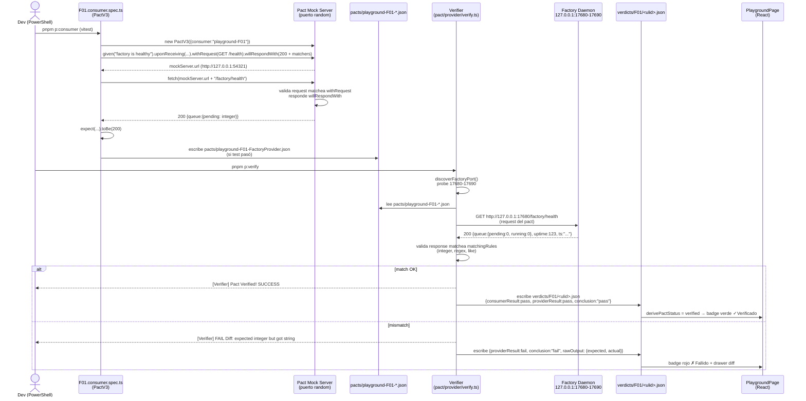
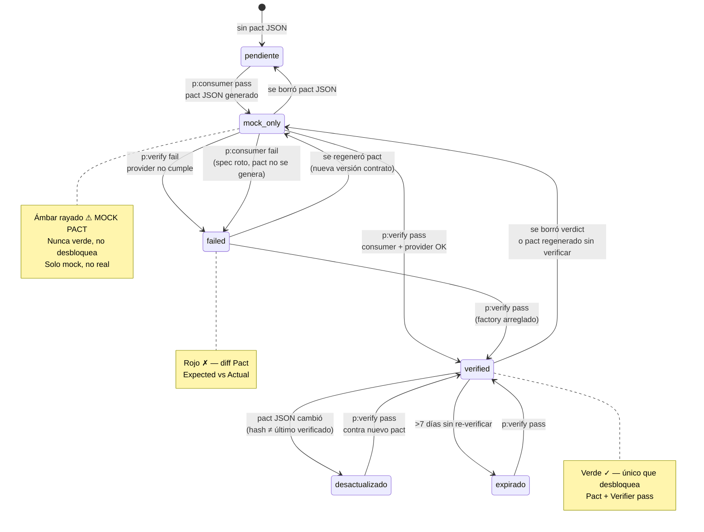
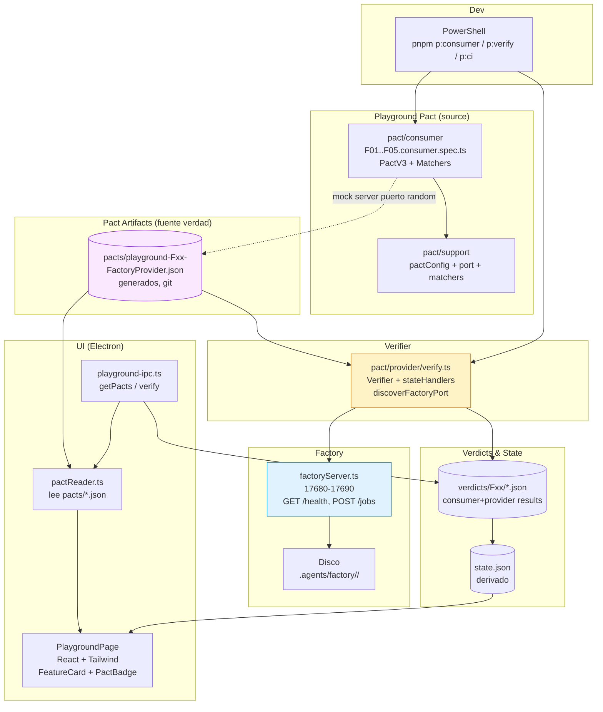

# Arquitectura Playground v2 — Motor PACT

> **Autor:** Gao (Arquitecto) — para equipo software-testing-playground-v2 + reviewer.
> **Input:** `software-testing-playground-v2/docs/prd-playground-v2.md` (Xu) + `architecture-playground-v2.md` (Gao v1) + decisión de cambiar motor a **[Pact](https://pact.io)**.
> **Stack real:** Node/JS + TypeScript + Electron + Vite + React + Tailwind + Radix + Node `http` minimal (`headless-runtime/factory/factoryServer.ts`, puerto 17680–17690, `pnpm`). **Windows only** — todos los ejemplos en **PowerShell** (`Invoke-RestMethod -UseBasicParsing`, `curl.exe --silent`, `Get-Content -Wait`, `Get-ChildItem`, `Select-String`). Nunca `curl` a secas, nunca `ls`/`cat`/`grep` bash.
> **Motor:** `@pact-foundation/pact` (Pact JS) — **PactV3** (consumer) + **Verifier** (provider). Pact Broker **local file** en v2 (sin PactFlow).
> **Estado:** Diseño **previo a código** para aprobación. Este doc es la fuente de verdad del flujo Pact. Ningún `.ts` final aún.

---

## Resumen ejecutivo — ¿qué cambia con Pact?

Antes el playground construía verificadores a mano (fetch + comparación ad-hoc). Eso funcionaba pero violaba el principio de contrato único: cada verifier re-inventaba el shape esperado y el `rawOutput` no era comparable contra nada versionado.

Con **Pact** el **contrato es la fuente de verdad**, no el verifier:

| Antes (v1) | Ahora (Pact) |
|---|---|
| `criteria/Fxx.json` + `verifiers/verify-Fxx.mjs` separados, shapes duplicados | **Un solo lugar** define el contrato: `pact/consumer/Fxx.consumer.spec.ts` → genera `pacts/*.json`. Ese JSON es el contrato versionado. |
| Mocks a mano (datos inventados) si no había backend | **Mocks generados por Pact** (mock server HTTP). Nunca datos inventados. Si no hay provider real, el test **no pasa a verde**, queda `SIMULADO` o `FALLIDO`. |
| `rawOutput` vs `conclusion` separados pero sin estándar de matching | **Matchers Pact** (`like`, `integer`, `regex`, `eachLike`) definen qué es flexible y qué es exacto. La UI y el Verifier leen el mismo contrato. |
| CI comparaba ad-hoc | **CI = `p:consumer` + `p:verify`**. Si el provider real no cumple el contrato, Pact falla con diff exacto request/response. |
| 7 reglas vigentes | **Siguen vigentes**, reinterpretadas: R2 (prohibido simular) ahora significa *prohibido mock manual fuera de Pact*; R3 (mock marcado) ahora distingue *mock Pact* (ámbar rayado, consumer) de *verificación real* (verde, provider). |

**Principio rector Pact:** *Consumer-Driven Contracts*. El playground (consumer) dice "yo necesito que Factory responda así". Pact graba esa expectativa en `pacts/*.json`. El Verifier la reproduce contra Factory real. Si Factory cambia y rompe el contrato, el Verifier falla **antes** de mergear.

---

## 1. Instalación y configuración `@pact-foundation/pact` en Node

### 1.1 Instalación (PowerShell)

```powershell
# En la raíz del repo termcanvas
pnpm add -D @pact-foundation/pact

# Verificá versión instalada
pnpm list @pact-foundation/pact
Get-Content package.json | Select-String -Pattern "pact"

# Si querés fijar versión conocida estable (ej 14.x que trae PactV3 + Verifier)
pnpm add -D @pact-foundation/pact@^14.0.0
```

> **No instalar `pact-node` separado.** `@pact-foundation/pact` ya trae `PactV3`, `Verifier` y el binario `pact` (Rust FFI) para Windows. No requiere Docker ni Ruby.

### 1.2 Config base PactV3 (consumer)

```ts
// software-testing-playground-v2/pact/support/pactConfig.ts
import path from "node:path";

export const PACT_DIR = path.resolve("software-testing-playground-v2/pacts");
// Directorio donde Pact escribe los JSON generados. Se commitea.

export const PACT_LOG_LEVEL = "warn" as const;
// warn | info | debug | error | trace. En CI: "info" para ver mismatches.
// En local: "warn" para no spamear. Nunca "debug" por defecto (ruidoso).

export const FACTORY_PROVIDER = "FactoryProvider" as const;

export function consumerNameFor(featureId: string): string {
  // Aislamiento por F: un consumer por F → un pact file por F.
  // Ej: "playground-F01", "playground-F02"
  return `playground-${featureId}`;
}

export const PACT_SPEC_VERSION = "3" as const; // Pact spec v3 (V3 JSON)
```

**Uso en cada consumer spec:**

```ts
import { PactV3, MatchersV3 } from "@pact-foundation/pact";
import { PACT_DIR, PACT_LOG_LEVEL, FACTORY_PROVIDER, consumerNameFor } from "../support/pactConfig";

const pact = new PactV3({
  consumer: consumerNameFor("F01"), // "playground-F01"
  provider: FACTORY_PROVIDER,       // "FactoryProvider" — único provider, múltiples consumers
  dir: PACT_DIR,
  logLevel: PACT_LOG_LEVEL,
  // port: 0 → puerto aleatorio por test, evita colisión en Windows paralelos
});
```

**Opciones clave `PactV3`:**

| Campo | Valor v2 | Por qué |
|---|---|---|
| `consumer` | `playground-F01` por F | Aislamiento R1: cada F un archivo pact separado, no un monolito |
| `provider` | `FactoryProvider` fijo | Un solo provider real (Factory daemon). Múltiples consumers, un provider |
| `dir` | `software-testing-playground-v2/pacts` | Carpeta versionada en git, fuente de verdad para UI y Verifier |
| `logLevel` | `warn` local, `info` CI | Balance ruido vs diagnóstico |
| `port` | `0` (random) | Evita `EADDRINUSE` en Windows si 17680 ocupado |

### 1.3 Config Verifier (provider)

```ts
// software-testing-playground-v2/pact/provider/verify.ts
import { Verifier } from "@pact-foundation/pact";
import path from "node:path";
import { discoverFactoryPort } from "../support/port.js"; // reutiliza lógica 17680-17690

const providerBaseUrl = `http://127.0.0.1:${await discoverFactoryPort()}`;

const verifier = new Verifier({
  provider: "FactoryProvider",
  providerBaseUrl,                       // descubierto dinámico 17680-17690
  pactUrls: [
    // En v2: local file. Un archivo por F, o glob.
    path.resolve("software-testing-playground-v2/pacts/playground-F01-FactoryProvider.json"),
    path.resolve("software-testing-playground-v2/pacts/playground-F02-FactoryProvider.json"),
    // o: path.resolve("software-testing-playground-v2/pacts/*.json")
  ],
  // Alternativa broker (no usada en v2, preparada):
  // pactBrokerUrl: "https://tu-broker.local",
  // publishVerificationResult: false, // solo true si hay broker
  logLevel: "info",
  providerVersion: process.env.GIT_COMMIT ?? "local",
  // providerVersionTags: ["main"],

  // State handlers: si el provider necesita pre-condiciones (ej "job exists")
  stateHandlers: {
    "factory is healthy": async () => {
      // factory siempre healthy si responde health; no-op o verifica GET /health
      return Promise.resolve(`Factory ready at ${providerBaseUrl}`);
    },
    "a job exists": async (params) => {
      // params trae lo que el consumer puso en `given("a job exists", { id: "..." })`
      // Opcional en F01/F02, necesario si F03 necesita job pre-existente para GET /jobs/:id
    },
  },

  // Request filters: si necesitás inyectar headers auth o limpiar state entre tests
  // requestFilter: (req, res, next) => { next(); },

  timeout: 30000, // ms para todo el run de verificación
});
```

**Opciones clave `Verifier`:**

| Campo | Valor v2 | Por qué |
|---|---|---|
| `provider` | `FactoryProvider` | Debe coincidir con `provider` del PactV3 |
| `providerBaseUrl` | `http://127.0.0.1:{port descubierto}` | Nunca hardcodear 17680. Usa `discoverFactoryPort()` (probing 17680-17690 + `factory-port` file) |
| `pactUrls` | `pacts/*.json` local | **Broker file local** en v2 (ver §7). No PactFlow aún. Array explícito o glob |
| `pactBrokerUrl` | *no usado* | Reservado para futuro. En v2 `pactUrls` manda |
| `providerVersion` | `git rev-parse HEAD` o `local` | Trazabilidad R5, se muestra en logs y badge |
| `stateHandlers` | mapa por `given` | Para Fs que necesitan provider state (F02 no necesita, F03 sí si se pre-condiciona job) |
| `logLevel` | `info` | Muestra mismatches detallados (expected vs actual) |
| `timeout` | 30000 | Suficiente para F01+F02+F03 secuenciales |

**Logs esperados:**

```powershell
# pnpm p:verify (pass)
# [Verifier] Verifying a pact between playground-F01 and FactoryProvider
#   Given factory is healthy
#     upon receiving a request for health
#       with GET /factory/health
#         returns a response which
#           has status code 200
#           has body ...
# [Verifier] Pact Verification Complete - SUCCESS

# pnpm p:verify (fail)
# [Verifier] FAIL - Interaction failed - GET /factory/health
#   Expected body: { queue: { pending: integer } } but got { queue: { pending: "0" } }
#   Diff: - "0" (string) + 0 (number)
```

---

## 2. Estructura de carpetas y flujo Pact

### 2.1 Árbol canónico (Pact)

```
termcanvas/
├── headless-runtime/factory/
│   ├── factoryServer.ts                    # MOD: opcional PLAYGROUND_ISOLATION guard (sigue útil, pero Pact lo suple)
│   └── factoryPort.ts                      # helper discoverFactoryPort() reutilizable
├── software-testing-playground-v2/
│   ├── pacts/                              # GENERADOS por PactV3 — fuente de verdad versionada en git
│   │   ├── playground-F01-FactoryProvider.json
│   │   ├── playground-F02-FactoryProvider.json
│   │   ├── playground-F03-FactoryProvider.json
│   │   └── .gitkeep
│   ├── pact/                               # FUENTE TS que DEFINE los contratos (lo que se edita)
│   │   ├── consumer/
│   │   │   ├── F01.consumer.spec.ts        # PactV3 para health
│   │   │   ├── F02.consumer.spec.ts        # PactV3 para POST /jobs
│   │   │   ├── F03.consumer.spec.ts        # PactV3 para GET /jobs/:id + (SSE explicado aparte)
│   │   │   ├── F04.consumer.spec.ts        # opcional, si F04 tiene HTTP (o queda human + Pact parcial)
│   │   │   └── F05.consumer.spec.ts
│   │   ├── provider/
│   │   │   ├── verify.ts                   # orquesta Verifier (discover port, stateHandlers)
│   │   │   └── verifyAll.mjs               # CLI thin wrapper: node verifyAll.mjs --pactDir ./pacts
│   │   └── support/
│   │       ├── pactConfig.ts               # PACT_DIR, consumerNameFor, logLevel
│   │       ├── matchers.ts                 # re-export MatchersV3 + helpers (iso8601, windowsPath)
│   │       ├── port.ts                     # discoverFactoryPort() 17680-17690
│   │       ├── worktree.ts                 # createPlaygroundWorktree() temp por corrida
│   │       └── git.ts                      # getCommitSha(), isDirty()
│   ├── criteria/                           # LEGACY derivado (opcional, ver §2.2)
│   │   ├── F01.json                        # generado desde pact o mantenido manual para UI legacy
│   │   └── F02.json
│   ├── verdicts/                           # append-only, ahora enriquecido con pactVerification
│   │   └── F01/<ulid>.json                 # incluye pactFile + providerBaseUrl + verificationResult
│   ├── state.json                          # caché derivado (regenerable)
│   └── docs/
│       ├── prd-playground-v2.md
│       ├── architecture-playground-v2.md   # v1 (referencia)
│       └── architecture-pact-v2.md         # este archivo
├── src/features/playground/                # UI React (lee pacts/*.json como fuente)
│   ├── PlaygroundPage.tsx
│   ├── components/
│   │   ├── FeatureCard.tsx                 # distingue MOCK PACT vs VERIFICADO
│   │   ├── PactBadge.tsx                   # NUEVO: badge pactStatus
│   │   ├── VerdictDrawer.tsx               # rawOutput vs conclusion + link a pact file
│   │   ├── StateBadge.tsx
│   │   └── PowerShellHelp.tsx
│   ├── hooks/
│   │   ├── usePactStatus.ts                # NUEVO: lee pacts/*.json + verdicts
│   │   └── useVerify.ts
│   └── lib/
│       ├── pactReader.ts                   # NUEVO: parsea pacts/*.json, expone contracts[]
│       └── playgroundApi.ts
├── electron/
│   ├── playground-ipc.ts                   # expone window.playground.getPacts(), verifyPact()
│   ├── main.ts
│   └── preload.ts
└── package.json                            # scripts p:consumer, p:verify, p:ci
```

> **Respuesta directa a "¿dónde viven los contratos?":**
> - **Fuente editable (source):** `software-testing-playground-v2/pact/consumer/Fxx.consumer.spec.ts` — TypeScript con `PactV3` + `MatchersV3`. Cada F un archivo, aislamiento total (R1). Este es el lugar donde **se define** el contrato. Se edita a mano, se reviewea en PR, se versiona.
> - **Artefacto generado (pact):** `software-testing-playground-v2/pacts/playground-Fxx-FactoryProvider.json` — JSON generado por `pnpm p:consumer`. **Este es el contrato ejecutable**. Se commitea para trazabilidad. La UI y el Verifier **leen este JSON**, nunca el `.ts` directo en runtime.
> - **No hay `contracts/definitions/` separado.** `pact/consumer/` **es** `contracts/definitions/`. El nombre `pacts/` es estándar Pact (donde viven los JSON). No duplicar carpetas.

### 2.2 ¿Qué pasa con `criteria/Fxx.json`?

**Decisión Pact v2: `criteria/` pasa a ser *vista derivada*, no fuente.**

| Criterio | Antes (v1) | Con Pact (v2) |
|---|---|---|
| Fuente de shape HTTP | `criteria/Fxx.json` `expected` | `pact/consumer/Fxx.consumer.spec.ts` `willRespondWith` |
| Fuente de metadata (title, wave, blockedBy, timeoutMs, version) | `criteria/Fxx.json` | Se mantiene en `pact/support/pactConfig.ts` + header del spec, o queda `criteria/Fxx.json` solo para metadata no-HTTP |
| Versionado | `criteria/Fxx.json` `version` | **`pacts/*.json` + `consumerVersion`** (`package.json` version o git sha). El hash del pact JSON es la versión implícita. Opcional: mantener `criteria/Fxx.json` con `version` semver que refleja pact hash |

**Opción recomendada (menos migración):** Mantener `criteria/Fxx.json` **solo para metadata** (`id`, `title`, `wave`, `blockedBy`, `timeoutMs`, `criterio`, `version`) y **eliminar `expected`** de ahí — `expected` ahora vive en el pact. El linter valida que `criteria` no contradiga al pact. Alternativa migración total: generar `criteria/Fxx.json` desde pact en `pnpm p:consumer` (script que parsea pact JSON y escribe criteria). Para v2, **mantenemos criteria slim** para no romper UI existente que ya lee `criteria/`.

```json
// software-testing-playground-v2/criteria/F01.json (slim, con Pact)
{
  "id": "F01",
  "version": "1.0.0",
  "title": "Servidor único + health",
  "wave": "Ola 1",
  "blockedBy": [],
  "timeoutMs": 500,
  "criterio": "GET /factory/health debe responder 200 con queue.pending/running numéricos <500ms",
  "pact": "pacts/playground-F01-FactoryProvider.json",
  "verifier": { "kind": "pact", "provider": "FactoryProvider" }
}
```

La UI lee **ambos**: `criteria/Fxx.json` para badge/wave/blockedBy, y `pacts/*.json` para mostrar el contrato HTTP exacto (método, path, matchers).

### 2.3 Cómo se corren (PowerShell)

```powershell
# 1. Instalar deps (una vez)
pnpm install

# 2. Generar contratos (consumer) → escribe pacts/*.json
pnpm p:consumer
# alias: pnpm run pact:consumer
# qué hace: vitest/jest corre pact/consumer/*.spec.ts contra mock server Pact
# salida: software-testing-playground-v2/pacts/*.json
# no necesita Factory real, solo mock Pact

# 3. Verificar contra Factory real (provider)
pnpm p:verify
# qué hace: Verifier lee pacts/*.json y hace requests reales a http://127.0.0.1:{port descubierto}
# necesita Factory levantado. Si no hay Factory, falla con ERR_NO_FACTORY
# para levantar Factory si no está:
#   pnpm dev   # en otra terminal PowerShell
#   # o
#   node --loader tsx headless-runtime/factory/factoryServer.ts
#   # verificar que responde:
#   Invoke-RestMethod -UseBasicParsing http://127.0.0.1:17680/factory/health | ConvertTo-Json

# 4. CI (todo junto, fail fast)
pnpm p:ci
# secuencia: p:consumer → p:verify --strict → genera verdicts + state.json
# exit 0 solo si todos los pacts verificados y no hay dirty/simulado

# 5. Solo una F (aislado)
pnpm p:consumer -- F01
pnpm p:verify -- F01

# 6. Ver pacts generados
Get-ChildItem software-testing-playground-v2\pacts\ | Format-Table Name, Length, LastWriteTime
Get-Content software-testing-playground-v2\pacts\playground-F01-FactoryProvider.json | ConvertFrom-Json | ConvertTo-Json -Depth 10
```

**`package.json` scripts (agregar):**

```json
{
  "scripts": {
    "p:consumer": "vitest run --config software-testing-playground-v2/pact/vitest.pact.config.ts",
    "p:verify": "node --loader tsx software-testing-playground-v2/pact/provider/verify.ts",
    "p:ci": "pnpm p:consumer && pnpm p:verify -- --strict",
    "p:lint": "node software-testing-playground-v2/pact/support/lintPacts.mjs",
    "playground:lint": "pnpm p:lint"
  }
}
```

**Detalles `p:consumer`:**

- Usa `vitest` (ya en repo) o `jest`. `vitest.pact.config.ts` con `test.include: ["pact/consumer/**/*.spec.ts"]`, `test.environment: "node"`, `test.timeout: 10000`.
- Cada spec hace `await pact.executeTest(async (mockServer) => { await fetch(mockServer.url + "/factory/health")... })`. Pact levanta mock en puerto random, graba interacción, al terminar escribe `pacts/*.json` si el test pasó.
- **No hay mocks inventados.** El mock es el servidor Pact, que valida que el consumer hizo el request exacto definido en `withRequest` y responde lo definido en `willRespondWith`. Si el consumer desvía, Pact falla.

**Detalles `p:verify`:**

- Descubre puerto Factory: intenta `~/.termcanvas/factory-port` + `~/.termcanvas-dev/factory-port` + probing `17680-17690` con `GET /factory/health` (ver §1.3 `discoverFactoryPort`).
- Lee `pacts/*.json` (o filtrado por `-- F01`).
- Para cada pact, hace `await verifier.verify()` contra `providerBaseUrl`.
- Captura output Verifier (stdout/stderr) y lo guarda en `verdicts/Fxx/<ulid>.json` con `pactFile`, `providerBaseUrl`, `verificationResult` (pass/fail + diffs).

**PowerShell probing inline (si no usás helper):**

```powershell
$port = $null
foreach ($p in 17680..17690) {
  try {
    $r = Invoke-RestMethod -UseBasicParsing "http://127.0.0.1:$p/factory/health" -TimeoutSec 1
    if ($r.queue) { $port = $p; break }
  } catch {}
}
if (-not $port) { Write-Error "No hay Factory en 17680-17690. Corré pnpm dev en otra terminal."; exit 1 }
Write-Host "Factory en $port"
pnpm p:verify -- --providerBaseUrl "http://127.0.0.1:$port"
```

### 2.4 Cómo se ve aprobado vs fallido

**Aprobado (consumer + provider pasan):**

```powershell
PS> pnpm p:consumer

 RUN  v1.x  software-testing-playground-v2/pact/consumer

 ✓ F01.consumer.spec.ts > F01 GET /factory/health contrato (42ms)
 ✓ F02.consumer.spec.ts > F02 POST /factory/jobs contrato (78ms)

 Pact files written:
  - pacts/playground-F01-FactoryProvider.json
  - pacts/playground-F02-FactoryProvider.json

 Test Files  2 passed
      Tests  2 passed

PS> pnpm p:verify
[Verifier] Verifying pacts/playground-F01-FactoryProvider.json
  Given factory is healthy
    upon receiving a request for health
      with GET /factory/health
        returns a response which
          has status code 200 (OK)
          has body matching Pact matchers (OK)
[Verifier] Pact Verified! - 1 interactions passed

[Verifier] Verifying pacts/playground-F02-FactoryProvider.json
  Given a valid playground worktree
    upon receiving a request to create a job
      with POST /factory/jobs
        returns a response which
          has status code 201 (OK)
          ...
[Verifier] Pact Verified! - 1 interactions passed

[Verifier] Pact Verification Complete - SUCCESS (2 pacts, 2 interactions)
```

**Fallido (provider no cumple contrato):**

```powershell
PS> pnpm p:verify
[Verifier] Verifying pacts/playground-F02-FactoryProvider.json
  Given a valid playground worktree
    upon receiving a request to create a job
      with POST /factory/jobs
        returns a response which
          has status code 201
            expected 201 but got 400
          has body
            $.job.state: Expected "queued" but got "running"  # si stub avanzó sin isolation
            $.path: Expected string matching "C:\\\\.*\\.agents\\\\factory" but got null
[Verifier] Pact Verification Failed - 1 failures
  Diff:
    Expected: { "job": { "state": "queued" } }
    Actual:   { "error": "prompt is required", "hint": "En PowerShell usa..." }

[Verifier] Pact Verification Complete - FAILED
# exit code 1
```

**En UI (PlaygroundPage):**

| Estado Pact | Badge | Qué muestra |
|---|---|---|
| `consumer pass, provider pass` | verde `✓ Verificado (Pact)` | Card verde, sub-badge `Pact: consumer ✓ + provider ✓`, link a `pacts/Fxx.json`, `verdicts/Fxx/<id>.json` con `verificationResult: pass` |
| `consumer pass, provider fail` | rojo `✗ Fallido (Pact)` | Card roja, `Pact: consumer ✓ + provider ✗`, drawer con diff Expected vs Actual (copiado del Verifier log), botón `Re-verificar` |
| `consumer fail` (spec roto) | rojo `✗ Contrato inválido` | Card roja, `Pact: consumer ✗`, no se generó pact JSON nuevo, muestra error del mock server |
| `solo consumer, sin provider` (no se corrió verify) | ámbar rayado `⚠ MOCK PACT` | Ver §2.5 — nunca verde, tooltip `Solo mock Pact, no validado contra Factory real` |
| `desactualizado` (pact cambió pero Verifier no re-corrió) | ámbar `◑ Desactualizado` | `Pact hash abc ≠ último verificado xyz — corre pnpm p:verify` |

> **No hay output silenciado.** Verifier siempre loggea a `stdout` + a `verdicts/Fxx/<id>.json` `rawOutput` (logs del Verifier + http dump). La UI tiene colapsable `Ver output Verifier crudo`.

### 2.5 Cómo se distingue mock Pact (consumer) de verificación real (provider) visualmente (R3)

**R3 reinterpretada con Pact:**

- **Mock Pact (consumer):** es el mock server que Pact levanta en `pact.executeTest()`. Vive solo durante `pnpm p:consumer`, en puerto random, no es Factory. Sirve para **definir** el contrato y generar el JSON.
- **Verificación real (provider):** es el Verifier contra **Factory real** en `127.0.0.1:17680-17690`, con estado en disco (`.agents/factory/<id>/`).

**Visual (mandatorio, inconfundible):**

| Tipo | Badge | Estilo card | Tooltip | Desbloquea `blockedBy`? |
|---|---|---|---|---|
| **Mock Pact** (solo `p:consumer` pasó) | ámbar `⚠ MOCK PACT` + icono `🧪` | `border: 2px dashed #f59e0b`, `bg: #fffbeb`, barra superior rayada | `Este resultado es solo mock Pact (consumer). No fue validado contra Factory real. No desbloquea Fs dependientes.` | **No** |
| **Verificado Pact** (`p:consumer` + `p:verify` pass) | verde `✓ Verificado` + sub `Pact ✓` | `border: 1px solid #16a34a`, `bg: #f0fdf4`, check verde sólido | `Validado contra Factory real en 127.0.0.1:17680 el 2026-05-13T14:22Z (commit 9f3a…)` | **Sí** |
| **Fallido Pact** (`p:verify` fail) | rojo `✗ Fallido` + sub `Pact ✗` | `border: 1px solid #dc2626`, `bg: #fef2f2` | `Factory no cumple contrato. Ver diff en drawer.` | No |
| **Consumer fail** | rojo `✗ Contrato inválido` | como fallido | `El spec del consumer falló — el contrato ni siquiera se generó.` | No |

**En código (`StateBadge.tsx` / `PactBadge.tsx`):**

```tsx
type PactStatus = "mock_only" | "verified" | "failed" | "not_generated";

function PactBadge({ status, pactFile }: { status: PactStatus; pactFile: string }) {
  if (status === "mock_only") return (
    <span className="inline-flex items-center gap-1 rounded-full bg-amber-100 text-amber-800 border-2 border-dashed border-amber-500 px-2.5 py-1 text-xs font-bold tracking-wide">
      ⚠ MOCK PACT
      <span className="font-normal normal-case">· solo consumer</span>
    </span>
  );
  if (status === "verified") return (
    <span className="inline-flex items-center gap-1 rounded-full bg-green-100 text-green-800 border border-green-600 px-2.5 py-1 text-xs font-bold">
      ✓ Verificado <span className="font-normal">· Pact</span>
    </span>
  );
  // ...
}
```

**Regla visual dura:** `MOCK PACT` **nunca** usa verde, nunca muestra `✓ Verificado`, nunca desbloquea. Test snapshot lo valida.

### 2.6 Cómo la UI lee contratos como fuente de verdad (no hardcode)

**Antes:** UI hardcodeaba `expected` o leía `criteria/Fxx.json` que era editado a mano.

**Ahora:** UI **lee `pacts/*.json` generados** — son JSON estándar Pact, parseables.

```ts
// src/features/playground/lib/pactReader.ts
import fs from "node:fs"; // en main, no renderer directo
import path from "node:path";

export interface PactContractView {
  consumer: string; // "playground-F01"
  provider: string; // "FactoryProvider"
  featureId: string; // "F01" derivado de consumer
  interactions: Array<{
    description: string; // "a request for health"
    providerState?: string; // "factory is healthy"
    request: { method: string; path: string; headers?: Record<string,string>; body?: unknown };
    response: { status: number; headers?: Record<string,string>; body?: unknown };
  }>;
  generatedAt: string;
  pactFile: string;
}

export function listPactContracts(): PactContractView[] {
  const dir = path.resolve("software-testing-playground-v2/pacts");
  return Get-ChildItem(dir, "*.json") // pseudo
    .map(f => JSON.parse(fs.readFileSync(f, "utf-8")))
    .map(raw => ({
      consumer: raw.consumer.name,
      provider: raw.provider.name,
      featureId: raw.consumer.name.replace("playground-", ""),
      interactions: raw.interactions.map((i: any) => ({
        description: i.description,
        providerState: i.providerState,
        request: i.request,
        response: i.response,
      })),
      pactFile: f,
    }));
}
```

**En Electron IPC (`playground-ipc.ts`):**

```ts
ipcMain.handle("playground:getPacts", () => listPactContracts());
ipcMain.handle("playground:getPact", (_, featureId) => getPactFor(featureId));
```

**En React (`usePactStatus.ts`):**

```tsx
const { data: pacts } = usePlaygroundPacts(); // via window.playground.getPacts()
const { data: state } = usePlaygroundState(); // verdicts + pactVerification

// Render por F:
pacts.map(pact => (
  <FeatureCard
    key={pact.featureId}
    featureId={pact.featureId}
    pact={pact}
    pactStatus={derivePactStatus(pact.featureId)} // mock_only | verified | failed
    criteria={criteria[pact.featureId]} // metadata title/wave/blockedBy
  />
))
```

**Qué muestra la card (sin hardcode):**

- `pact.request.method + pact.request.path` (ej `GET /factory/health`) — no string hardcodeada.
- `pact.response.status` esperado vs `verdict.rawOutput.httpStatus` real.
- Matchers expandidos: si el pact usa `integer(0)`, la UI muestra `queue.pending: number (matcher integer)` no `0` literal.
- Link `Ver contrato JSON` → abre `pacts/playground-F01-FactoryProvider.json` raw.
- Link `Ver diff Verifier` → si falló, muestra `Expected vs Actual` del Verifier.

**Si el pact JSON no existe** (nunca se corrió `p:consumer`), la card queda `pendiente` con mensaje `No hay contrato Pact — corre pnpm p:consumer`.

### 2.7 Cómo se mantiene isolation por F (cada F un contrato/interacción separada, R1)

**R1 con Pact:**

| Principio | Implementación |
|---|---|
| **Un archivo por F** | `pact/consumer/F01.consumer.spec.ts` → `pacts/playground-F01-FactoryProvider.json`. Nunca un monolito `pacts/playground-FactoryProvider.json` con todas las Fs. |
| **Un describe por F** | Cada spec tiene `describe("F01 ...", () => { it("a request for health", ...) })`. No se mezclan `F01` y `F02` en mismo `PactV3` instance. |
| **No reutilizar interactions entre Fs** | `F02` no lee ni depende del pact de `F01`. Si `F01` falla, `F02` puede seguir generando su pact (consumer), pero `p:verify` para `F02` **hace fail fast `ERR_BLOCKED_BY`** si `F01` no está verificado (ver `stateHandlers` + `runner` que chequea `blockedBy` antes de verificar). |
| **Verificación aislada** | `pnpm p:verify -- F02` solo verifica `pacts/playground-F02-*.json`, no toca `F01`. En CI, se puede paralelizar por F si se quiere (cada F su job). |
| **Mock server aislado** | Cada `PactV3` levanta su propio mock en puerto random. No hay mock compartido. Dos `pnpm p:consumer` paralelos no colisionan. |
| **Worktree aislado** | `F02` usa `worktree: C:\tmp\playground-F02-<uuid>`, `F03` usa `C:\tmp\playground-F03-<uuid>`. Prefijo `playground-Fxx-` permite `pnpm playground:gc` por F. |

**Estructura de spec aislada:**

```ts
// F01.consumer.spec.ts — solo F01
describe("F01 — GET /factory/health", () => {
  const pact = new PactV3({ consumer: "playground-F01", provider: "FactoryProvider", dir: PACT_DIR, logLevel: "warn" });
  // ... una sola interaction
});

// F02.consumer.spec.ts — solo F02, no importa F01
describe("F02 — POST /factory/jobs", () => {
  const pact = new PactV3({ consumer: "playground-F02", provider: "FactoryProvider", dir: PACT_DIR, logLevel: "warn" });
  // ... una sola interaction
});
```

**Si alguien intenta mezclar:** linter `pact/support/lintPacts.mjs` falla si un archivo `F01.consumer.spec.ts` menciona `"/factory/jobs"` (prohibido en F01) o si un pact JSON contiene más de 1 interaction con paths de otra F. Ver §8 linter adaptado a Pact.

### 2.8 Dónde va Pact Broker (opcional local file vs PactFlow, decisión para v2: file local)

**Decisión v2: File local (`pacts/*.json` committeados), sin Broker.**

| Opción | Pros | Contras | Decisión v2 |
|---|---|---|---|
| **A. File local (`pacts/*.json` en git)** | 0 infra, 0 costo, funciona offline, review en PR (diff del JSON), simple `pactUrls` local, trazabilidad git inmediata | No hay UI de broker, no hay `can-i-deploy`, verificación solo local/CI con checkout | ✅ **Elegido para v2** |
| **B. PactFlow Cloud (SaaS)** | UI, badges, `can-i-deploy`, historial, webhooks | Costo, cuenta, secret, network, overkill para 5 Fs locales | ❌ No para v2 |
| **C. Pact Broker OSS local (Docker)** | Self-hosted, UI, `can-i-deploy` | Requiere `docker-compose`, Postgres, mantenimiento Windows, complejidad | ❌ P2 si escala |
| **D. File + Broker híbrido** | File para dev, publish a broker en CI con `pact-broker publish` | Doble flujo, confusión | P2 |

**Justificación v2 file local:**

- El repo es **local-first** (TermCanvas Electron, Factory en `127.0.0.1`). No hay deploys a QA/Prod que requieran `can-i-deploy`.
- 5 Fs, 5 pacts, 1 provider. Un broker es cañón para mosquito.
- El `pacts/*.json` committeado **ya es el broker**: `git log --follow pacts/playground-F01-*.json` da historial, `git diff` da contrato vs contrato, `verdicts/` da verificación vs verificación. R5 trazabilidad cubierta.
- El Verifier con `pactUrls: [path.resolve("pacts/*.json")]` + `providerVersion: git sha` ya da lo que Broker daría en local.

**Cómo evolucionar a Broker (sin reescribir):**

```ts
// En verify.ts, si en futuro hay BROKER_URL:
const verifier = new Verifier({
  provider: "FactoryProvider",
  providerBaseUrl,
  ...(process.env.PACT_BROKER_URL
    ? {
        pactBrokerUrl: process.env.PACT_BROKER_URL,
        pactBrokerUsername: process.env.PACT_BROKER_USERNAME,
        pactBrokerPassword: process.env.PACT_BROKER_PASSWORD,
        publishVerificationResult: true,
        providerVersion: getCommitSha(),
        providerVersionTags: ["main"],
      }
    : {
        pactUrls: globSync("software-testing-playground-v2/pacts/*.json"),
      }),
});
```

**Publicar a broker (futuro, no v2):**

```powershell
# Cuando haya broker:
pnpm exec pact-broker publish software-testing-playground-v2/pacts --consumer-app-version (git rev-parse HEAD) --broker-base-url $env:PACT_BROKER_BASE_URL
pnpm exec pact-broker can-i-deploy --pacticipant playground-F01 --version (git rev-parse HEAD) --to-environment production
```

**En v2, `pnpm p:ci` NO publica.** Solo genera y verifica local.

**Retención de `pacts/`:**

- `pacts/` **sí se commitea** (no `.gitignore`). Es el contrato, como `package-lock.json`.
- `pacts/.gitkeep` si vacío.
- Si se quiere ignorar `pacts/` y solo usar broker, sería al revés, pero no en v2.

---

## 3. Contratos Pact exactos — F01 y F02 (consumer spec + JSON resultante)

### 3.1 F01 — `GET /factory/health`

**Contrato semántico:** `GET /factory/health` debe responder `200` con `queue.pending` y `queue.running` numéricos en `<500 ms`. Equivalente al criterio original, ahora expresado como Pact.

**Consumer spec TypeScript (PactV3):**

`software-testing-playground-v2/pact/consumer/F01.consumer.spec.ts`:

```ts
import { describe, it, expect, beforeAll, afterAll } from "vitest";
import path from "node:path";
import { PactV3, MatchersV3 } from "@pact-foundation/pact";
import { PACT_DIR, PACT_LOG_LEVEL, FACTORY_PROVIDER, consumerNameFor } from "../support/pactConfig";

const { like, integer, regex } = MatchersV3;

// Regex ISO-8601 UTC (simple, no valida calendario, alcanza para contrato)
const ISO8601 = regex(
  "^\\d{4}-\\d{2}-\\d{2}T\\d{2}:\\d{2}:\\d{2}\\.\\d{3}Z$",
  "2026-05-13T14:22:10.123Z"
);

describe("F01 — Servidor único + health (Playground)", () => {
  const pact = new PactV3({
    consumer: consumerNameFor("F01"), // "playground-F01"
    provider: FACTORY_PROVIDER,       // "FactoryProvider"
    dir: PACT_DIR,                    // "software-testing-playground-v2/pacts"
    logLevel: PACT_LOG_LEVEL,         // "warn"
  });

  it("a request for health returns queue with pending and running", async () => {
    pact
      .given("factory is healthy")
      .uponReceiving("a request for health")
      .withRequest({
        method: "GET",
        path: "/factory/health",
        headers: { Accept: like("application/json") },
      })
      .willRespondWith({
        status: 200,
        headers: { "Content-Type": regex("application/json;?.*", "application/json") },
        body: {
          queue: {
            pending: integer(0),
            running: integer(0),
          },
          uptime: integer(12345),
          version: like("local"),
          ts: ISO8601,
        },
      });

    await pact.executeTest(async (mockServer) => {
      const t0 = performance.now();
      const res = await fetch(`${mockServer.url}/factory/health`, {
        headers: { Accept: "application/json" },
      });
      const durationMs = Math.round(performance.now() - t0);
      const body = (await res.json()) as any;

      expect(res.status).toBe(200);
      expect(typeof body.queue.pending).toBe("number");
      expect(typeof body.queue.running).toBe("number");
      expect(durationMs).toBeLessThan(500);
      // No validar uptime/version/ts exactos — matchers ya los flexibilizan
    });
  });
});
```

**Puntos finos F01 Pact:**

- **Matchers:** `integer(0)` para `pending/running/uptime` (permite cualquier entero, no solo 0), `like("local")` para `version` (cualquier string), `regex(ISO8601)` para `ts` (cualquier fecha válida). No usar `like(0)` solo, `integer` es más estricto (solo enteros).
- **Provider state:** `given("factory is healthy")` — el Verifier lo mapea a `stateHandlers["factory is healthy"]` que puede ser no-op o verificar que Factory esté levantado. Si no hay handler, Pact igual verifica pero sin pre-condición.
- **Headers:** `Accept` flexible con `like`, `Content-Type` con `regex` para `application/json` o `application/json; charset=utf-8`.
- **No se testea `worktree` ni `POST`** — F01 es puro `GET` health, aislamiento R1.

**JSON pact resultante esperado (generado por `pnpm p:consumer`):**

`software-testing-playground-v2/pacts/playground-F01-FactoryProvider.json`:

```json
{
  "consumer": { "name": "playground-F01" },
  "provider": { "name": "FactoryProvider" },
  "interactions": [
    {
      "description": "a request for health",
      "providerState": "factory is healthy",
      "request": {
        "method": "GET",
        "path": "/factory/health",
        "headers": { "Accept": "application/json" }
      },
      "response": {
        "status": 200,
        "headers": { "Content-Type": "application/json" },
        "body": {
          "queue": {
            "pending": 0,
            "running": 0
          },
          "uptime": 12345,
          "version": "local",
          "ts": "2026-05-13T14:22:10.123Z"
        },
        "matchingRules": {
          "body": {
            "$.queue.pending": { "match": "integer" },
            "$.queue.running": { "match": "integer" },
            "$.uptime": { "match": "integer" },
            "$.version": { "match": "type" },
            "$.ts": { "match": "regex", "regex": "^\\d{4}-\\d{2}-\\d{2}T\\d{2}:\\d{2}:\\d{2}\\.\\d{3}Z$" }
          },
          "header": {
            "$.Content-Type": { "match": "regex", "regex": "application/json;?.*" }
          }
        }
      }
    }
  ],
  "metadata": {
    "pactSpecification": { "version": "3.0.0" },
    "client": { "name": "@pact-foundation/pact", "version": "14.x" }
  }
}
```

> **Nota:** El JSON real usa formato Pact v3/v4 con `matchingRules` bajo `body`. Algunos matchers v3 usan `pact:matcher:type` en el body. El ejemplo arriba es semántica equivalente simplificada para legibilidad. El Verifier acepta ambos.

**Cómo se ejecuta (PowerShell):**

```powershell
# Genera pact JSON (mock, no necesita Factory)
pnpm p:consumer -- F01
Get-Content software-testing-playground-v2\pacts\playground-F01-FactoryProvider.json | ConvertFrom-Json | ConvertTo-Json -Depth 12

# Verifica contra Factory real (necesita daemon)
# Levantá Factory en otra terminal si no está:
#   pnpm dev
#   # o
#   node --loader tsx headless-runtime/factory/factoryServer.ts

# Descubrir puerto y verificar
pnpm p:verify -- --pactUrls software-testing-playground-v2/pacts/playground-F01-FactoryProvider.json
# o global:
pnpm p:verify

# Ver output Verifier en verdict
Get-Content software-testing-playground-v2\verdicts\F01\*.json | ConvertFrom-Json | ConvertTo-Json -Depth 10
```

---

### 3.2 F02 — `POST /factory/jobs` (job en disco)

**Contrato semántico:** `POST /factory/jobs { prompt, worktree, phase }` debe responder `201` con `{ id, path, job: { state: "queued" } }` y crear en disco `{worktree}/.agents/factory/<id>/job.json` y `prompt.md` con contenido exacto del prompt. No validar `running/done/result.json`.

**Consumer spec TypeScript (PactV3):**

`software-testing-playground-v2/pact/consumer/F02.consumer.spec.ts`:

```ts
import { describe, it, expect } from "vitest";
import path from "node:path";
import os from "node:os";
import fs from "node:fs";
import crypto from "node:crypto";
import { PactV3, MatchersV3 } from "@pact-foundation/pact";
import { PACT_DIR, PACT_LOG_LEVEL, FACTORY_PROVIDER, consumerNameFor } from "../support/pactConfig";

const { like, regex, integer } = MatchersV3;

// Helpers para Windows path
const windowsPathRegex = regex(
  "^[A-Z]:\\\\.*\\.agents\\\\factory\\\\job-.*",
  "C:\\tmp\\playground-F02-abc123\\.agents\\factory\\job-m4n5o6p7"
);
const jobIdRegex = regex("^job-[a-z0-9\\-]+$", "job-m4n5o6p7-q8r9");

describe("F02 — Job en disco (Playground)", () => {
  const pact = new PactV3({
    consumer: consumerNameFor("F02"),
    provider: FACTORY_PROVIDER,
    dir: PACT_DIR,
    logLevel: PACT_LOG_LEVEL,
  });

  it("creates a job and returns queued with disk artifacts", async () => {
    // Worktree temp por corrida, aislado por F
    const uuid = crypto.randomUUID().slice(0, 8);
    const prompt = `playground-F02-${uuid}`;
    const worktree = path.join(os.tmpdir(), `playground-F02-${uuid}`);
    fs.mkdirSync(worktree, { recursive: true });

    pact
      .given("a valid playground worktree", { worktree })
      .uponReceiving("a request to create a job")
      .withRequest({
        method: "POST",
        path: "/factory/jobs",
        headers: { "Content-Type": regex("application/json;?.*", "application/json") },
        body: {
          prompt: like(prompt),
          worktree: like(worktree),
          phase: like("diagnosisLlm"),
        },
      })
      .willRespondWith({
        status: 201,
        headers: { "Content-Type": regex("application/json;?.*", "application/json") },
        body: {
          id: jobIdRegex,
          path: windowsPathRegex,
          job: {
            id: jobIdRegex,
            prompt: like(prompt),
            phase: like("diagnosisLlm"),
            state: like("queued"),
            worktree: like(worktree),
            createdAt: regex(
              "^\\d{4}-\\d{2}-\\d{2}T.*Z$",
              "2026-05-13T14:22:10.123Z"
            ),
          },
        },
      });

    await pact.executeTest(async (mockServer) => {
      const res = await fetch(`${mockServer.url}/factory/jobs`, {
        method: "POST",
        headers: { "Content-Type": "application/json" },
        body: JSON.stringify({ prompt, worktree, phase: "diagnosisLlm" }),
      });
      const body = (await res.json()) as any;

      expect(res.status).toBe(201);
      expect(body.job.state).toBe("queued");
      expect(typeof body.id).toBe("string");
      expect(typeof body.path).toBe("string");
      // No validar disco acá — el mock no escribe disco. El provider sí.
      // El Verifier validará disco vía stateHandler + check fs.
    });
  });
});
```

**Puntos finos F02 Pact:**

- **Matchers:** `like(prompt)` para `prompt/worktree/phase` (cualquier string del mismo tipo, no solo valor exacto — permite uuid random), `regex("^job-.*")` para `id` (formato job id), `regex("^[A-Z]:\\\\.*")` para `path` Windows (debe parecer `C:\...\.agents\factory\job-...`).
- **Provider state:** `given("a valid playground worktree", { worktree })` — el Verifier recibe `{ worktree }` en `stateHandlers["a valid playground worktree"]` y puede `mkdir` ese worktree antes de verificar, asegurando que Factory pueda escribir `job.json`.
- **Body request:** Pact valida que el consumer envió `prompt`, `worktree`, `phase` con tipos correctos. Si falta `prompt`, Pact falla en consumer (mock no matchea).
- **Body response:** Pact valida que provider responde `201` con `job.state === "queued"` — no `running`/`done`. Si el stub avanza a `done` rápido, el Verifier fallará porque espera `queued` exacto (vía `like("queued")` que en Pact es type matcher, pero se puede hacer `regex("queued", "queued")` para exacto). Usar `like("queued")` o `regex("^queued$", "queued")` para exigir literal `queued`.
- **No se valida `result.json` / `.done` / `logs`** — R1, solo F03+. El consumer de F02 **no menciona** esos artefactos en `willRespondWith`.

**JSON pact resultante esperado (simplificado):**

```json
{
  "consumer": { "name": "playground-F02" },
  "provider": { "name": "FactoryProvider" },
  "interactions": [
    {
      "description": "a request to create a job",
      "providerState": "a valid playground worktree",
      "request": {
        "method": "POST",
        "path": "/factory/jobs",
        "headers": { "Content-Type": "application/json" },
        "body": {
          "prompt": "playground-F02-abc123",
          "worktree": "C:\\Users\\Estudiante\\AppData\\Local\\Temp\\playground-F02-abc123",
          "phase": "diagnosisLlm"
        },
        "matchingRules": {
          "body": {
            "$.prompt": { "match": "type" },
            "$.worktree": { "match": "type" },
            "$.phase": { "match": "type" }
          }
        }
      },
      "response": {
        "status": 201,
        "headers": { "Content-Type": "application/json" },
        "body": {
          "id": "job-m4n5o6p7-q8r9",
          "path": "C:\\tmp\\playground-F02-abc123\\.agents\\factory\\job-m4n5o6p7-q8r9",
          "job": {
            "id": "job-m4n5o6p7-q8r9",
            "prompt": "playground-F02-abc123",
            "phase": "diagnosisLlm",
            "state": "queued",
            "worktree": "C:\\Users\\Estudiante\\AppData\\Local\\Temp\\playground-F02-abc123",
            "createdAt": "2026-05-13T14:22:10.123Z"
          }
        },
        "matchingRules": {
          "body": {
            "$.id": { "match": "regex", "regex": "^job-[a-z0-9\\-]+$" },
            "$.path": { "match": "regex", "regex": "^[A-Z]:\\\\.*\\.agents\\\\factory\\\\job-.*" },
            "$.job.id": { "match": "regex", "regex": "^job-[a-z0-9\\-]+$" },
            "$.job.prompt": { "match": "type" },
            "$.job.phase": { "match": "type" },
            "$.job.state": { "match": "regex", "regex": "^queued$" },
            "$.job.worktree": { "match": "type" },
            "$.job.createdAt": { "match": "regex", "regex": "^\\d{4}-\\d{2}-\\d{2}T.*Z$" }
          }
        }
      }
    }
  ],
  "metadata": { "pactSpecification": { "version": "3.0.0" } }
}
```

**Verificación provider (qué hace el Verifier con este pact):**

```ts
// pact/provider/verify.ts — stateHandlers para F02
stateHandlers: {
  "a valid playground worktree": async (params) => {
    // params.worktree viene del given del consumer
    const worktree = params.worktree ?? path.join(os.tmpdir(), "playground-F02-verify");
    fs.mkdirSync(worktree, { recursive: true });
    return { worktree };
  },
}
```

Verifier hará `POST http://127.0.0.1:{port}/factory/jobs` con body del pact, y validará que la respuesta real matchea `matchingRules`. Si Factory responde `400 prompt is required` porque el body llegó malformado (ej `curl` sin `.exe`), Verifier falla con diff claro.

**PowerShell:**

```powershell
pnpm p:consumer -- F02
pnpm p:verify -- --pactUrls software-testing-playground-v2\pacts\playground-F02-FactoryProvider.json

# Si querés ver el request que Verifier hará:
Get-Content software-testing-playground-v2\pacts\playground-F02-FactoryProvider.json | ConvertFrom-Json | Select-Object -ExpandProperty interactions | ConvertTo-Json -Depth 10

# Manual con curl.exe para comparar:
Invoke-RestMethod -UseBasicParsing -Uri http://127.0.0.1:17680/factory/jobs -Method Post -ContentType "application/json" -Body '{"prompt":"playground-F02-manual","worktree":"C:\\tmp\\playground-F02-manual","phase":"diagnosisLlm"}' | ConvertTo-Json -Depth 5
# o
curl.exe --silent -X POST http://127.0.0.1:17680/factory/jobs -H "Content-Type: application/json" -d "{\"prompt\":\"playground-F02-manual\",\"worktree\":\"C:\\\\tmp\\\\playground-F02-manual\",\"phase\":\"diagnosisLlm\"}"
```

---

### 3.3 F03 — Worker + SSE + logs (¿cómo maneja Pact SSE?)

**Contrato F03 real:** Tras `POST /factory/jobs`, con worker real, el job debe pasar `queued → running → done` con `logs.ndjson` creciendo en vivo, `result.json` parseable, `.done` vacío, y SSE `GET /factory/jobs/:id/events` streammeando `data: { line, ts }`.

**Respuesta honesta: Pact NO maneja SSE streaming como contrato HTTP tradicional.** Pact es `request → response` síncrono. SSE es `request → stream infinito` (`Content-Type: text/event-stream`, conexión keep-alive). Pact puede validar el **handshake HTTP** del SSE (status 200 + headers), pero **no el contenido del stream en el tiempo**.

**Estrategia Pact para F03: Híbrido — Pact para HTTP + Human/Helper para SSE.**

```
F03 contrato descompuesto:

  [Pact]  POST /factory/jobs → 201 queued           (igual que F02, pero luego)
  [Pact]  GET  /factory/jobs/:id → 200 { state }    (polling, valida queued/running/done)
  [Pact]  GET  /factory/jobs/:id/events → 200 text/event-stream (solo headers + primer evento)
  [Human/Helper] Get-Content logs.ndjson -Wait      (SSE vivo, no pacteable, requiere ojo o helper con timeout)
  [Pact]  GET file artifacts: job.json, logs.ndjson, result.json, .done existen (vía provider state + fs check en Verifier)
```

**Opción A (recomendada v2): Pact para `GET /jobs/:id` polling + human para SSE:**

`software-testing-playground-v2/pact/consumer/F03.consumer.spec.ts` (esqueleto):

```ts
import { describe, it } from "vitest";
import { PactV3, MatchersV3 } from "@pact-foundation/pact";
import { PACT_DIR, PACT_LOG_LEVEL, FACTORY_PROVIDER, consumerNameFor } from "../support/pactConfig";

const { like, integer, regex, eachLike } = MatchersV3;

describe("F03 — Worker + logs (Pact HTTP) + SSE (human)", () => {
  const pact = new PactV3({
    consumer: consumerNameFor("F03"),
    provider: FACTORY_PROVIDER,
    dir: PACT_DIR,
    logLevel: PACT_LOG_LEVEL,
  });

  it("polls job until done and verifies artifacts via provider state", async () => {
    // 1. POST (igual que F02) — ya cubierto, pero F03 lo repite con phase distinta si quiere
    // 2. GET /factory/jobs/:id → done
    pact
      .given("a job that has completed", { id: "job-abc123" })
      .uponReceiving("a request for a completed job")
      .withRequest({
        method: "GET",
        path: regex("^\\/factory\\/jobs\\/job-[a-z0-9\\-]+$", "/factory/jobs/job-abc123"),
      })
      .willRespondWith({
        status: 200,
        headers: { "Content-Type": regex("application/json;?.*", "application/json") },
        body: {
          id: like("job-abc123"),
          state: regex("done", "done"),
          logs: eachLike("opencode: streaming tokens…"),
          dir: like("C:\\tmp\\playground-F03-abc\\.agents\\factory\\job-abc123"),
          resultPreview: {
            jobId: like("job-abc123"),
            state: like("done"),
          },
        },
      });

    // 3. GET /events — solo handshake
    pact
      .given("a job with SSE available")
      .uponReceiving("a request for job events SSE")
      .withRequest({
        method: "GET",
        path: regex("^\\/factory\\/jobs\\/job-[a-z0-9\\-]+\\/events$", "/factory/jobs/job-abc123/events"),
        headers: { Accept: like("text/event-stream") },
      })
      .willRespondWith({
        status: 200,
        headers: { "Content-Type": regex("text/event-stream", "text/event-stream") },
        // Body no se valida como JSON, Pact lo trata como string. No se puede validar stream.
        body: like("data: {\"line\":\"opencode: streaming\"}\n\n"),
      });

    await pact.executeTest(async (mockServer) => {
      // Mock solo valida handshake SSE, no stream real
      const resEvents = await fetch(`${mockServer.url}/factory/jobs/job-abc123/events`, {
        headers: { Accept: "text/event-stream" },
      });
      expect(resEvents.status).toBe(200);
      expect(resEvents.headers.get("content-type")).toMatch(/text\/event-stream/);

      const resJob = await fetch(`${mockServer.url}/factory/jobs/job-abc123`);
      expect(resJob.status).toBe(200);
      const body = await resJob.json() as any;
      expect(body.state).toBe("done");
    });
  });
});
```

**Explicación SSE:**

- **Pact puede validar** que `GET /factory/jobs/:id/events` responde `200` con `Content-Type: text/event-stream`. Eso es útil para asegurar que el endpoint existe y no responde `404`/`500`.
- **Pact NO puede validar** que el stream emite `data: ...\n\n` cada 700 ms con logs reales, ni que el stream permanece abierto 15 s con heartbeat `: heartbeat`. Eso requiere **test de integración con helper** que consuma el stream con timeout.

**Test SSE real (fuera de Pact, helper + human):**

```ts
// software-testing-playground-v2/pact/support/sseHelper.ts
export async function collectSse(url: string, timeoutMs = 3500): Promise<string[]> {
  const ctrl = new AbortController();
  const t = setTimeout(() => ctrl.abort(), timeoutMs);
  const res = await fetch(url, { headers: { Accept: "text/event-stream" }, signal: ctrl.signal });
  if (!res.ok || !res.body) throw new Error(`SSE failed ${res.status}`);
  const reader = res.body.getReader();
  const decoder = new TextDecoder();
  const lines: string[] = [];
  while (true) {
    const { done, value } = await reader.read();
    if (done) break;
    const chunk = decoder.decode(value);
    for (const line of chunk.split("\n")) {
      if (line.startsWith("data: ")) lines.push(line);
      if (line.startsWith("event: done")) { clearTimeout(t); return lines; }
    }
    if (lines.length >= 3) { clearTimeout(t); break; } // suficiente evidencia
  }
  clearTimeout(t);
  return lines;
}
```

**En `pact/provider/verify.ts` para F03:**

```ts
stateHandlers: {
  "a job that has completed": async (params) => {
    // Crea un job real y espera a done (polling), o usa job existente si stub
    // Si PLAYGROUND_ISOLATION=1, debe fallar honestamente (R2)
    if (process.env.PLAYGROUND_ISOLATION === "1") {
      throw new Error("F03 requiere ejecutor real — PLAYGROUND_ISOLATION=1 bloquea transiciones. No simular.");
    }
    const worktree = params.worktree ?? path.join(os.tmpdir(), "playground-F03-verify");
    fs.mkdirSync(worktree, { recursive: true });
    // POST job y esperar done con polling (ver helper)
    const job = await createJobAndWaitDone(worktree);
    return { id: job.id, worktree, dir: job.dir };
  },
}
```

**Veredicto F03:**

- `p:verify` para F03 **pasa** solo si Factory tiene ejecutor real o stub sin isolation. Con `PLAYGROUND_ISOLATION=1`, Verifier falla con `provider state failed: F03 requiere ejecutor real` — eso es **correcto** (R2, no simular).
- **SSE vivo** se valida fuera de Pact con `collectSse` helper en un test separado `F03.sse.manual.spec.ts` que hace `fetch` real a `.../events` y `Get-Content ...logs.ndjson -Wait` y verifica que llegan ≥2 líneas en 3 s. Ese test es `human` o `hybrid` y su resultado se mezcla en el veredicto `F03` como `sseVerified: true/false`.

**Tabla comparativa F03:**

| Parte | Pact? | Cómo | PowerShell manual |
|---|---|---|---|
| `POST /jobs` | ✅ Sí | Pact `POST /factory/jobs` → 201 | `Invoke-RestMethod ... -Method Post ...` |
| `GET /jobs/:id` polling | ✅ Sí | Pact `GET /factory/jobs/:id` → 200 `done` | `Invoke-RestMethod http://127.0.0.1:17680/factory/jobs/<id>` |
| `GET /jobs/:id/events` handshake | ⚠️ Parcial | Pact valida `200` + `Content-Type: text/event-stream` | `curl.exe --silent -H "Accept: text/event-stream" http://127.0.0.1:17680/factory/jobs/<id>/events` |
| SSE stream vivo (logs apareciendo) | ❌ No Pact | Helper `collectSse` + `Get-Content -Wait` | `Get-Content C:\tmp\...\logs.ndjson -Wait` |
| `logs.ndjson` + `result.json` + `.done` en disco | ✅ Sí (via provider state) | Verifier `stateHandler` crea job y valida `fs.existsSync` | `Get-ChildItem C:\tmp\...\ .agents\factory\<id>\` |

**Decisión F03:** **Hybrid verifier** — `verifier.kind: "hybrid"` en `criteria/F03.json` (o `pact` con `sse: human`). Pact cubre HTTP, helper cubre SSE. La UI muestra `Pact: HTTP ✓ + SSE: manual` si HTTP pasa pero SSE no se validó automático.

---

## 4. Veredicto, trazabilidad y UI (cómo se ve todo junto)

### 4.1 Veredicto enriquecido con Pact

`software-testing-playground-v2/verdicts/F02/<ulid>.json`:

```json
{
  "id": "01J8X...",
  "featureId": "F02",
  "criteriaVersion": "1.0.0",
  "criteriaHash": "a1b2c3d4",
  "commitSha": "9f3a2c1",
  "commitDirty": false,
  "actor": "script",
  "actorDetail": "pact: playground-F02 + verifier",
  "startedAt": "2026-05-13T14:22:10.123Z",
  "finishedAt": "2026-05-13T14:22:11.456Z",
  "durationMs": 1333,
  "pactFile": "software-testing-playground-v2/pacts/playground-F02-FactoryProvider.json",
  "pactHash": "e5f6a7b8",
  "providerBaseUrl": "http://127.0.0.1:17680",
  "consumerResult": { "passed": true, "pactGenerated": true },
  "providerResult": {
    "passed": true,
    "interactionsVerified": 1,
    "logs": "[Verifier] Pact Verified! ..."
  },
  "rawOutput": {
    "consumer": { "mockServerUrl": "http://127.0.0.1:54321", "interactions": 1 },
    "provider": { "httpStatus": 201, "body": { "id": "job-...", "job": { "state": "queued" } } }
  },
  "conclusion": "pass",
  "artifacts": ["C:\\Users\\...\\AppData\\Local\\Temp\\playground-F02-abc\\...\\job.json"]
}
```

`rawOutput` y `conclusion` siguen separados (R5). Ahora `rawOutput` tiene `consumer` (mock) + `provider` (real) para auditar ambos lados.

### 4.2 Estado derivado con Pact

```ts
function derivePactStatus(featureId: string): PactStatus {
  const pactFile = `pacts/playground-${featureId}-FactoryProvider.json`;
  const hasPact = fs.existsSync(pactFile);
  const verdicts = listVerdicts(featureId); // orden ULID desc
  const last = verdicts[0];

  if (!hasPact) return "not_generated"; // nunca se corrió p:consumer
  if (!last) return "mock_only"; // hay pact pero nunca se verificó contra provider
  if (last.providerResult?.passed) return "verified";
  if (last.consumerResult?.passed && !last.providerResult?.passed) return "failed"; // provider falló
  return "mock_only";
}
```

**Mapeo a badge global `FeatureStatus`:**

| `PactStatus` | `FeatureStatus` | Badge |
|---|---|---|
| `verified` | `verificado` | verde `✓ Verificado` |
| `failed` | `fallido` | rojo `✗ Fallido` |
| `mock_only` | `simulado` | ámbar rayado `⚠ MOCK PACT` |
| `not_generated` | `pendiente` | gris `○ Pendiente` |

**Bloqueo:** solo `verified` desbloquea. `mock_only` no desbloquea (R1).

### 4.3 UI — qué lee y cómo (sin hardcode, fuente pact)

**Header:** `Commit: 9f3a2c1` + `Factory: http://127.0.0.1:17680 ✓` (puerto descubierto) + `Pacts: 5` + `Última verificación: hace 3 min` (max `finishedAt` de verdicts).

**Grid:** 5 cards orden topológico `F01 → F02 → F03 → F04 → F05`.

**Card F01 (verificado Pact):**

```
┌─ F01 ───────────────────────────────┐
│ ✓ Verificado · Pact  v1.0.0         │  ← verde
│ Servidor único + health             │
│ Ola 1 • timeout 500ms               │
│ Criterio: GET /factory/health → 200 │
│ Contrato: GET /factory/health       │  ← leído de pact.json request
│   Expected: 200 + queue.pending:int │  ← matchers del pact
│   Pact: pacts/playground-F01-...    │  [Ver contrato JSON]
│ Último: ✓ Verificado hace 2 min     │
│   consumer ✓ + provider ✓           │
│   Ver output Verifier ▼             │
│ [Re-generar Pact] [Re-verificar]    │
└─────────────────────────────────────┘
```

**Card F02 (mock only):**

```
┌─ F02 ─────────── ⚠ MOCK PACT ──────────────┐
│ ████████████████████████████████████████████ │ ← borde dashed ámbar, bg #fffbeb
│ ⚠ MOCK PACT — solo consumer, no validado    │  tooltip: mock Pact
│ Job en disco  •  v1.0.0                      │
│ Contrato: POST /factory/jobs → 201         │
│   Ver contrato JSON | Ver spec .ts          │
│ [Generar Pact] disabled? no, habilitado     │
│ [Verificar contra Factory] ← corre p:verify │
└─────────────────────────────────────────────┘
```

**Drawer Veredicto:**

- Tabs: `Contrato (pact JSON)` | `Consumer output (mock)` | `Provider output (Verifier)` | `Diff (si falló)`
- `RawOutput` colapsable con `Copiar` + `Abrir carpeta pacts` (`Get-ChildItem pacts\`)
- `Conclusión` separada: `PASS — queue.pending integer, <500 ms, consumer + provider OK`

**PowerShellHelp dropdown (siempre visible):**

```powershell
# Health (F01)
Invoke-RestMethod -UseBasicParsing http://127.0.0.1:17680/factory/health | ConvertTo-Json
curl.exe --silent http://127.0.0.1:17680/factory/health

# Crear job (F02)
Invoke-RestMethod -UseBasicParsing -Uri http://127.0.0.1:17680/factory/jobs -Method Post -ContentType "application/json" -Body '{"prompt":"playground-F02-test","worktree":"C:\tmp\playground-F02-test","phase":"diagnosisLlm"}' | ConvertTo-Json -Depth 5

# Ver job
Invoke-RestMethod -UseBasicParsing http://127.0.0.1:17680/factory/jobs/<id> | ConvertTo-Json -Depth 5

# Pact
pnpm p:consumer
pnpm p:verify
Get-Content software-testing-playground-v2\pacts\playground-F01-FactoryProvider.json | ConvertFrom-Json | ConvertTo-Json -Depth 10
Get-ChildItem software-testing-playground-v2\pacts\ | Format-Table Name, Length
```

---

## 5. Diagramas Mermaid

### 5.1 Flujo Pact — consumer + provider (secuencia)



### 5.2 Estados con Pact



### 5.3 Arquitectura componentes Pact



---

## 6. File list, scripts y orden de implementación (5 tareas)

### 6.1 File list

| # | Path relativo | Tipo | Descripción |
|---|---|---|---|
| 1 | `software-testing-playground-v2/pact/support/pactConfig.ts` | NEW | `PACT_DIR`, `consumerNameFor`, `FACTORY_PROVIDER`, `PACT_LOG_LEVEL` |
| 2 | `software-testing-playground-v2/pact/support/matchers.ts` | NEW | Re-export `MatchersV3` + helpers `iso8601`, `windowsPath`, `jobId` |
| 3 | `software-testing-playground-v2/pact/support/port.ts` | NEW | `discoverFactoryPort()` 17680-17690 + `isHealthOk()` |
| 4 | `software-testing-playground-v2/pact/support/worktree.ts` | NEW | `createPlaygroundWorktree(Fxx)` temp Windows |
| 5 | `software-testing-playground-v2/pact/support/git.ts` | NEW | `getCommitSha()`, `isDirty()` |
| 6 | `software-testing-playground-v2/pact/support/lintPacts.mjs` | NEW | Linter Pact: F01 no debe mencionar `/jobs`, etc. |
| 7 | `software-testing-playground-v2/pact/consumer/F01.consumer.spec.ts` | NEW | Pact F01 (código §3.1) |
| 8 | `software-testing-playground-v2/pact/consumer/F02.consumer.spec.ts` | NEW | Pact F02 (§3.2) |
| 9 | `software-testing-playground-v2/pact/consumer/F03.consumer.spec.ts` | NEW | Pact F03 hybrid (§3.3) |
| 10 | `software-testing-playground-v2/pact/consumer/F04.consumer.spec.ts` | NEW | Opcional, si F04 tiene HTTP; si no, queda human |
| 11 | `software-testing-playground-v2/pact/provider/verify.ts` | NEW | Verifier orquestador + `stateHandlers` |
| 12 | `software-testing-playground-v2/pact/provider/verifyAll.mjs` | NEW | CLI wrapper `node verifyAll.mjs` |
| 13 | `software-testing-playground-v2/pact/vitest.pact.config.ts` | NEW | Config vitest para `pact/consumer/**/*.spec.ts` |
| 14 | `software-testing-playground-v2/pacts/.gitkeep` | NEW | Mantener carpeta en git |
| 15 | `software-testing-playground-v2/pacts/playground-F01-FactoryProvider.json` | GEN | Generado por `p:consumer` (ejemplo §3.1) |
| 16 | `software-testing-playground-v2/pacts/playground-F02-FactoryProvider.json` | GEN | Generado (§3.2) |
| 17 | `src/features/playground/lib/pactReader.ts` | NEW | Lee `pacts/*.json`, expone `listPactContracts()` |
| 18 | `src/features/playground/components/PactBadge.tsx` | NEW | Badge `MOCK PACT` vs `Verificado` |
| 19 | `src/features/playground/hooks/usePactStatus.ts` | NEW | Hook `derivePactStatus` |
| 20 | `electron/playground-ipc.ts` | MOD | Handlers `getPacts`, `verifyPact` |
| 21 | `electron/preload.ts` | MOD | Expone `window.playground.getPacts` |
| 22 | `package.json` | MOD | Scripts `p:consumer`, `p:verify`, `p:ci` + dep `@pact-foundation/pact` |
| 23 | `software-testing-playground-v2/docs/architecture-pact-v2.md` | NEW | Este archivo |

> `criteria/Fxx.json` no se borra en v2, queda slim (metadata) o se genera desde pact. No duplica expected.

### 6.2 Dependencias

```json
{
  "devDependencies": {
    "@pact-foundation/pact": "^14.0.0"
  }
}
```

No se agrega nada más. `vitest` ya está, `zod` ya está, `ws` ya está.

### 6.3 Orden implementación (5 tareas)

| ID | Tarea | Archivos | Dep | Prio |
|---|---|---|---|---|
| **T01** | **Infra Pact + support** | `pact/support/*`, `pact/vitest.pact.config.ts`, `pacts/.gitkeep`, `package.json` (dep + scripts) | — | P0 |
| **T02** | **Consumer specs F01/F02 + generación** | `pact/consumer/F01..F02.consumer.spec.ts`, `pacts/*.json` generados, `pact/support/lintPacts.mjs` | T01 | P0 |
| **T03** | **Verifier + provider + stateHandlers** | `pact/provider/verify.ts`, `verifyAll.mjs`, `pact/support/port.ts` refine, `verdicts` con `providerResult` | T02 | P0 |
| **T04** | **UI Pact (lector + badges)** | `src/features/playground/lib/pactReader.ts`, `PactBadge.tsx`, `usePactStatus.ts`, `electron/playground-ipc.ts` MOD | T02 | P0 (paralela a T03) |
| **T05** | **F03 hybrid + integración p:ci + pulido** | `pact/consumer/F03.consumer.spec.ts`, `sseHelper`, `p:ci` flow, E2E `p:consumer && p:verify` contra Factory real, docs | T03+T04 | P1 |

```
T01 → T02 → T03 → T05
        └→ T04 → T05
```

---

## 7. Decisiones, riesgos y checklist Pact

### 7.1 Riesgos y mitigaciones

| Riesgo | Prob | Impacto | Mitigación |
|---|---|---|---|
| Pact mock vs Factory divergen (mock pasa, provider falla por `Content-Type` charset) | Media | Medio | Usar `regex("application/json;?.*")` no `like("application/json")` exacto. Verifier loggea diff, fix matcher. |
| Windows path con `\\` rompe regex | Media | Medio | `windowsPathRegex` testeada con `path.resolve` + `JSON.stringify` double-escape. Helper `matchers.windowsPath()` centralizado. |
| `pnpm p:verify` sin Factory levantado | Alta | Medio | `discoverFactoryPort` con mensaje PowerShell-friendly `ERR_NO_FACTORY`. No silenciar, exit 1 con hint `pnpm dev`. |
| Humano olvida `pnpm p:consumer` y commitea pact viejo | Alta | Alto | CI `p:ci` regenera y verifica; linter `pactHash !== lastVerdict.pactHash` → `desactualizado`. Pre-commit hook opcional `pnpm p:consumer -- --check` (fail si pact desactualizado). |
| SSE no pacteable confunde | Media | Medio | Documentar hybrid (§3.3), UI separa `Pact HTTP ✓` vs `SSE manual`. No intentar mockear stream con Pact. |
| Pact binary no baja en Windows CI | Baja | Alto | `@pact-foundation/pact` trae prebuilt; fallback `npm rebuild` en CI. Testear en Windows runner. |

### 7.2 Checklist aceptación (para reviewer, antes de code)

- [ ] `pnpm p:consumer` genera `pacts/playground-F01-FactoryProvider.json` y `F02` sin necesitar Factory.
- [ ] `pnpm p:verify` con Factory en `17680` pasa para `F01` y `F02`.
- [ ] `pnpm p:verify` sin Factory falla con `ERR_NO_FACTORY` + hint PowerShell `Invoke-RestMethod ...`.
- [ ] `F01.consumer.spec.ts` no menciona `/factory/jobs` ni `prompt` (linter L_pact_01).
- [ ] `F02` valida `state: queued` exacto, no `done`/`running` (R1).
- [ ] `pacts/*.json` committeados, `Get-ChildItem pacts\` muestra 2+ archivos.
- [ ] UI muestra `pacts/*.json` como fuente: card F01 lee `GET /factory/health` del pact, no hardcode.
- [ ] Badge `⚠ MOCK PACT` (ámbar rayado) cuando solo consumer pasó, verde solo cuando provider pasó.
- [ ] `MOCK PACT` no desbloquea `F02` (blockedBy exige `verified`).
- [ ] `F03` documentado como hybrid, Pact para HTTP + helper/human para SSE, no intenta pactear stream.
- [ ] Broker file local: `pactUrls: [pacts/*.json]`, no `pactBrokerUrl`.
- [ ] Todos los ejemplos usan `curl.exe --silent` o `Invoke-RestMethod -UseBasicParsing`, nunca `curl`/`ls`/`cat`.
- [ ] `pnpm p:ci` = `p:consumer && p:verify` y exit 0 solo si ambos pass.
- [ ] Performance: `p:consumer` <5 s, `p:verify` <3 s para F01+F02.

---

## 8. Anexo — Helpers clave (snippets)

### 8.1 `pact/support/matchers.ts`

```ts
import { MatchersV3 } from "@pact-foundation/pact";
export const { like, integer, decimal, regex, eachLike, atLeastOneLike } = MatchersV3;

export const iso8601 = () =>
  regex("^\\d{4}-\\d{2}-\\d{2}T\\d{2}:\\d{2}:\\d{2}\\.\\d{3}Z$", "2026-05-13T14:22:10.123Z");

export const windowsPath = () =>
  regex("^[A-Z]:\\\\.*\\.agents\\\\factory\\\\job-.*", "C:\\tmp\\playground-F02-abc\\.agents\\factory\\job-abc");

export const jobId = () =>
  regex("^job-[a-z0-9\\-]+$", "job-m4n5o6p7-q8r9");
```

### 8.2 `pact/support/port.ts` (reusa `headless-runtime/factory/factoryPort.ts`)

```ts
import fs from "node:fs";
import path from "node:path";
import os from "node:os";

export async function discoverFactoryPort(): Promise<number> {
  const candidates = [
    process.env.TERMCANVAS_PORT_FILE,
    path.join(os.homedir(), ".termcanvas", "factory-port"),
    path.join(os.homedir(), ".termcanvas-dev", "factory-port"),
  ].filter(Boolean) as string[];

  for (const file of candidates) {
    try {
      const raw = fs.readFileSync(file, "utf-8").trim().split("\n")[0];
      const port = Number(raw);
      if (port >= 17680 && port <= 17690 && (await isHealthOk(port))) return port;
    } catch {}
  }
  for (let p = 17680; p <= 17690; p++) if (await isHealthOk(p)) return p;
  throw new Error(
    "ERR_NO_FACTORY: No hay Factory en 17680-17690. Corré pnpm dev o node --loader tsx headless-runtime/factory/factoryServer.ts\n" +
      "Verificá: Invoke-RestMethod -UseBasicParsing http://127.0.0.1:17680/factory/health | ConvertTo-Json"
  );
}
async function isHealthOk(port: number): Promise<boolean> {
  try {
    const r = await fetch(`http://127.0.0.1:${port}/factory/health`, { signal: AbortSignal.timeout(800) });
    if (!r.ok) return false;
    const j = (await r.json()) as any;
    return j && typeof j.queue?.pending === "number";
  } catch { return false; }
}
```

### 8.3 `pact/vitest.pact.config.ts`

```ts
import { defineConfig } from "vitest/config";
export default defineConfig({
  test: {
    include: ["software-testing-playground-v2/pact/consumer/**/*.spec.ts"],
    environment: "node",
    testTimeout: 10000,
    hookTimeout: 10000,
  },
});
```

---

## 9. Qué sigue (para el equipo)

1. **Aprobar este doc** — ¿estructura `pact/consumer` + `pacts/` + `Verifier` con `pactUrls` local te cierra? ¿F03 hybrid con SSE fuera de Pact te parece honesto?
2. **T01** — Gao + Engineer instalan `@pact-foundation/pact` y crean `pact/support/*` + `vitest.pact.config.ts`. Validan `pnpm p:consumer` vacío pasa.
3. **T02** — Implementan `F01.consumer.spec.ts` y `F02.consumer.spec.ts` exactos de §3.1/3.2. Corren `pnpm p:consumer` y commitean `pacts/*.json`.
4. **T03** — Implementan `pact/provider/verify.ts` con `discoverFactoryPort` + `stateHandlers`. Validan `pnpm p:verify` contra Factory real.
5. **T04/T05** — UI lee `pacts/*.json` + integración `p:ci` + F03 hybrid.

> **No escribir verifiers a mano fuera de Pact.** Si necesitás un mock, es `PactV3` mock. Si necesitás verificar real, es `Verifier`. Nunca datos inventados.

---

*Fin — Gao, Arquitecto. 2026-05-13. Motor Pact: `@pact-foundation/pact` PactV3 + Verifier, Broker file local, Windows PowerShell only: `Invoke-RestMethod -UseBasicParsing`, `curl.exe --silent`, `Get-Content -Wait`, `Get-ChildItem`, `Select-String`.*
