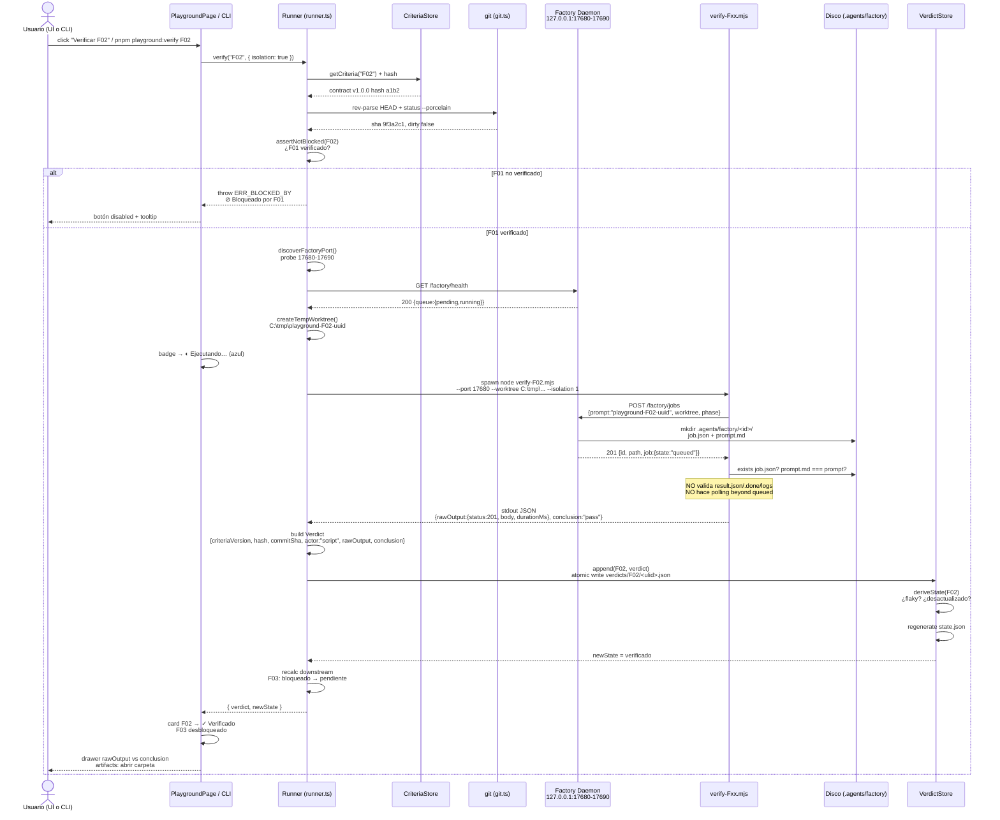
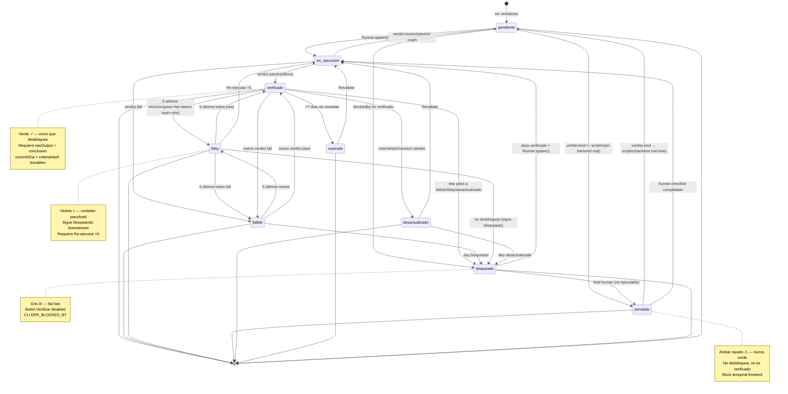

# Arquitectura Playground de Validación v2 — software-testing-playground-v2

> **Autor:** Gao (Arquitecto) — para Kou (Engineer).
> **Input:** `software-testing-playground-v2/docs/prd-playground-v2.md` (Xu, Product Manager).
> **Stack:** TypeScript + Electron + Vite + React + Tailwind + Radix + Node `http` minimal (`headless-runtime/factory/factoryServer.ts`, puerto 17680–17690, `pnpm`). Windows only, PowerShell `Invoke-RestMethod -UseBasicParsing` / `curl.exe --silent`.
> **Estado:** Diseño previo a código — ningún `.ts` final aún, solo contratos y plan.

---

## Resumen ejecutivo

El Playground v2 es un **sistema de validación aislado** que responde, por cada `F`, si su contrato versionado se cumple contra el sistema real, con evidencia reproducible. No reemplaza a Factory, no inventa resultados, no mezcla estados. Tres fuentes de verdad:

| Dato | Fuente | Mutable |
|---|---|---|
| Contrato `F` | `software-testing-playground-v2/criteria/Fxx.json` | Sí, versionado semver + `criteriaHash` |
| Veredicto | `software-testing-playground-v2/verdicts/Fxx/<ulid>.json` | Append-only, nunca editado |
| Estado derivado `state.json` | Derivado de los dos anteriores + `blockedBy` | Caché regenerable, se puede borrar |

Principio rector: **aislamiento por contrato + trazabilidad completa + automatización honesta**. Si no hay ejecutor real, el verificador falla — nunca simula `done`.

---

## 1. Estructura de carpetas completa (árbol) + justificación

### 1.1 Árbol canónico

```
termcanvas/                                 # root monorepo
├── headless-runtime/factory/
│   └── factoryServer.ts                    # MODIFICAR: flag PLAYGROUND_ISOLATION=1
│   └── factoryPort.ts                      # NUEVO: helper descubrimiento puerto (extraído)
├── scripts/
│   ├── start-factory.mjs                   # existente
│   ├── verify-F01.mjs                      # legacy, queda como referencia (no se borra)
│   └── playground-lint.mjs                 # REEMPLAZADO por v2 (wrapper a pnpm playground:lint)
├── software-testing-playground-v2/         # ← playground v2: datos + core desacoplado
│   ├── criteria/                           # 1 JSON por F, versionado en git
│   │   ├── F01.json
│   │   ├── F02.json
│   │   ├── F03.json
│   │   ├── F04.json
│   │   └── F05.json
│   ├── verdicts/                           # append-only, gitignored salvo que se quiera auditar
│   │   ├── F01/<ulid>.json
│   │   ├── F02/<ulid>.json
│   │   ├── F03/<ulid>.json
│   │   ├── F04/<ulid>.json
│   │   └── F05/<ulid>.json
│   ├── state.json                          # caché derivado (regenerable). No es fuente.
│   ├── package.json                        # opcional workspace: scripts playground:* si se quiere aislar deps
│   ├── src/                                # core lógica desacoplada (importable por CLI y por Electron vía alias)
│   │   ├── types.ts                        # FeatureContract, Verdict, PlaygroundState, errores tipados
│   │   ├── criteriaStore.ts                # lectura, validación schema, hash, lint, desactualizado
│   │   ├── verdictStore.ts                 # append, listado, derivación estado, flaky detection, GC
│   │   ├── runner.ts                       # orquesta verificación: blockedBy → spawn verifier → verdict
│   │   ├── isolation.ts                    # helpers: puerto, worktree temp, git sha, factory-port file
│   │   ├── linter.ts                       # reglas anti-contaminación (usado por CLI y por criteriaStore)
│   │   └── utils/
│   │       ├── hash.ts                     # sha256(canonicalJson)
│   │       ├── port.ts                     # discoverFactoryPort() 17680-17690
│   │       └── git.ts                      # getCommitSha(), isDirty()
│   ├── verifiers/                          # 1 verifier por F, contrato Verifier
│   │   ├── verify-F01.mjs                  # migrado de scripts/verify-F01.mjs → lee criteria/F01.json
│   │   ├── verify-F02.mjs
│   │   ├── verify-F03.mjs
│   │   ├── verify-F04.human.md             # guía humana cuando kind=human (checklist + evidencia)
│   │   └── verify-F05.human.md
│   ├── cli/
│   │   ├── playground.mjs                  # entry CLI: pnpm playground:verify|lint|report|watch|gc
│   │   ├── commands/
│   │   │   ├── verify.ts
│   │   │   ├── lint.ts
│   │   │   ├── report.ts
│   │   │   ├── watch.ts
│   │   │   └── gc.ts
│   │   └── lib/
│   │       └── output.ts                   # formateo --json vs humano, exit codes
│   └── docs/
│       ├── prd-playground-v2.md            # existente
│       └── architecture-playground-v2.md   # este archivo
├── src/
│   └── features/playground/                # UI dentro de Electron (React)
│       ├── PlaygroundPage.tsx              # ruta /playground
│       ├── components/
│       │   ├── FeatureCard.tsx             # 1 card por F, badge grande, botones verificar/historial
│       │   ├── VerdictDrawer.tsx           # rawOutput vs conclusion separados, copiar, abrir carpeta
│       │   ├── PowerShellHelp.tsx          # dropdown snippets Invoke-RestMethod / curl.exe
│       │   ├── StateBadge.tsx              # mapping estado → color/icono/tooltip (R3 inconfundible)
│       │   └── FilterBar.tsx               # filtros por estado, búsqueda
│       ├── hooks/
│       │   ├── usePlaygroundState.ts       # lee state.json vía IPC o fetch, polling/SSE
│       │   └── useVerify.ts                # dispara POST /playground/verify/:id vía IPC
│       └── lib/
│           └── playgroundApi.ts            # cliente IPC (window.playground.*)
├── electron/
│   ├── playground-ipc.ts                   # NUEVO: handlers IPC para playground (criteria/verdicts/verify)
│   ├── main.ts                             # MODIFICAR: registrar playground-ipc, ensureFactoryServer()
│   └── preload.ts                          # MODIFICAR: exponer window.playground
└── docs/
    ├── system_design.md                    # (generado) mirror resumido si se requiere
    ├── sequence-diagram.mermaid
    └── class-diagram.mermaid
```

> **Ruta relativa file list** (ver §6) usa exactamente estos paths. `software-testing-playground-v2/src/` es el core desacoplado; `src/features/playground/` es solo UI. Así el CLI puede correr sin Electron (`node software-testing-playground-v2/cli/playground.mjs`).

### 1.2 Justificación por bloque

| Bloque | Por qué existe / por qué ahí |
|---|---|
| `software-testing-playground-v2/criteria/` | Un archivo por `F` facilita `git blame`, `diff` y bump semver por feature. Monolito `playgroundCriteria.json` queda congelado y migrado una vez. |
| `verdicts/Fxx/<ulid>.json` | Append-only por carpeta evita lock de archivo único y facilita `Get-ChildItem` por F. ULID ordenable cronológicamente sin reloj central. |
| `state.json` | Caché derivado para UI y CLI rápido. Nunca fuente: `rm state.json && pnpm playground:lint` lo regenera. Evita recalcular flaky/bloqueado en cada render. |
| `software-testing-playground-v2/src/` | Core desacoplado, sin dependencia de Electron ni React. Puede ser importado por CLI (`node`) y por `electron/playground-ipc.ts`. Así cumplimos decisión "runner desacoplado". |
| `verifiers/` | 1 entry por F, contrato `Verifier`. `F01-F03` son `.mjs` script; `F04-F05` son `.human.md` hasta tener backend real (kind human). El runner los invoca uniformemente. |
| `cli/` | Un solo entry `playground.mjs` con subcomandos. Toda la orquestación (port discovery, blockedBy, hash) vive aquí, no en cada verifier. |
| `src/features/playground/` | UI aislada en ruta `/playground`, fuera de Factory. Usa Tailwind+Radix (consistencia TermCanvas), no MUI. Consume `state.json` vía IPC, no vía HTTP nuevo. |
| `electron/playground-ipc.ts` | Puente IPC seguro: el renderer nunca toca disco directo (`fs` no expuesto). El main lee `criteria/` y `verdicts/` y hace `spawn` de verifiers. |
| `headless-runtime/factory/factoryServer.ts` mod | Solo agregar `PLAYGROUND_ISOLATION` guard y extraer `port.ts` helper. Minimal diff para no reescribir daemon. |
| `docs/*.mermaid` | Diagramas versionados junto a arquitectura para revisión sin abrir MD. |

**Decisión de monorepo vs paquete aislado:** No se crea `package.json` separado con `pnpm-workspace` extra aunque podría. Se usan `scripts` en root `package.json` (`playground:verify`, etc.) que delegan a `node software-testing-playground-v2/cli/playground.mjs`. Si en futuro se quiere publicar playground como paquete, basta con agregar `software-testing-playground-v2/package.json` con `name: "@termcanvas/playground"`.

---

## 2. Cómo se define una F (FeatureContract)

### 2.1 JSON Schema exacto (validado por linter y por `zod` en runtime)

```json
{
  "$schema": "http://json-schema.org/draft-07/schema#",
  "title": "FeatureContract",
  "type": "object",
  "required": ["id", "version", "title", "wave", "blockedBy", "timeoutMs", "criterio", "inputs", "expected", "verifier"],
  "additionalProperties": false,
  "properties": {
    "id": { "type": "string", "pattern": "^F\\d{2}$", "description": "F01, F02..." },
    "version": { "type": "string", "pattern": "^\\d+\\.\\d+\\.\\d+$", "description": "semver, bump solo si cambia criterio/expected/verifier" },
    "title": { "type": "string", "minLength": 3 },
    "wave": { "type": "string" },
    "blockedBy": { "type": "array", "items": { "type": "string", "pattern": "^F\\d{2}$" }, "uniqueItems": true },
    "timeoutMs": { "type": "integer", "minimum": 100, "maximum": 30000 },
    "criterio": { "type": "string", "minLength": 10, "description": "frase imperativa única" },
    "inputs": {
      "type": "array",
      "items": {
        "type": "object",
        "required": ["label", "value"],
        "additionalProperties": false,
        "properties": {
          "label": { "type": "string" },
          "value": { "type": "string" }
        }
      }
    },
    "expected": {
      "type": "object",
      "additionalProperties": false,
      "properties": {
        "httpStatus": { "type": "integer", "minimum": 100, "maximum": 599 },
        "jsonShape": { "type": "object", "description": "shape mínimo, ej { queue: { pending: 'number', running: 'number' } } — valores son tipos, no literales" },
        "fileArtifacts": { "type": "array", "items": { "type": "string" }, "description": "ej ['job.json','prompt.md'] — solo nombres, no paths absolutos" },
        "sse": { "type": "boolean" },
        "latencyMs": { "type": "integer", "minimum": 1 },
        "customChecks": { "type": "array", "items": { "type": "string" }, "description": "checks semánticos opcionales, ej 'prompt.md === prompt enviado'" }
      }
    },
    "verifier": {
      "type": "object",
      "required": ["kind", "entry"],
      "additionalProperties": false,
      "properties": {
        "kind": { "enum": ["script", "human", "hybrid"] },
        "entry": { "type": "string", "description": "relativo a repo root, ej software-testing-playground-v2/verifiers/verify-F01.mjs" },
        "humanChecklist": { "type": "array", "items": { "type": "string" } }
      }
    },
    "reportPath": { "type": "string" }
  }
}
```

**Notas del schema:**

- `jsonShape` usa **tipos como strings** para validación mínima (ver §3.5 comparación), no snapshot completo. Ej: `{ "queue": { "pending": "number", "running": "number" } }`.
- `fileArtifacts` enumera nombres de archivos esperados en `.agents/factory/<id>/`. El verifier valida existencia y contenido.
- `latencyMs` es redundante con `timeoutMs` pero explícito para perf. `timeoutMs` es hard deadline del runner; `latencyMs` es expectativa documentada (pueden coincidir).

### 2.2 Ejemplo real F01 (Servidor único + health)

`software-testing-playground-v2/criteria/F01.json`:

```json
{
  "id": "F01",
  "version": "1.0.0",
  "title": "Servidor único + health",
  "wave": "Ola 1 — Servidor único + health (backend)",
  "blockedBy": [],
  "timeoutMs": 500,
  "criterio": "GET /factory/health debe responder HTTP 200 con JSON { queue: { pending: number, running: number } } en <500 ms. Si no hay daemon, debe reportar no disponible sin crashear.",
  "inputs": [
    { "label": "Request", "value": "GET http://127.0.0.1:{port}/factory/health" },
    { "label": "Qué se le pasa", "value": "Nada (solo health check)" },
    { "label": "Qué devuelve", "value": "{ queue: { pending: number, running: number }, uptime: number, version: string, ts: string }" }
  ],
  "expected": {
    "httpStatus": 200,
    "jsonShape": { "queue": { "pending": "number", "running": "number" } },
    "latencyMs": 500
  },
  "verifier": {
    "kind": "script",
    "entry": "software-testing-playground-v2/verifiers/verify-F01.mjs"
  },
  "reportPath": "docs/wiki Warp/reporte-F01-health.md"
}
```

**Puntos finos F01:**

- No crea jobs, no toca disco `.agents/`. Es el único F sin side effects.
- Verifier hace `GET /factory/health` con `performance.now()`, valida `httpStatus`, `jsonShape`, `latencyMs < timeoutMs`, retry 3 con backoff 500/1000 ms (heredado de `scripts/verify-F01.mjs`).
- Descubre puerto 17680–17690 (ver §3.4).

### 2.3 Ejemplo real F02 (Job en disco)

`software-testing-playground-v2/criteria/F02.json`:

```json
{
  "id": "F02",
  "version": "1.0.0",
  "title": "Job en disco",
  "wave": "Ola 2 — Job en disco (backend)",
  "blockedBy": ["F01"],
  "timeoutMs": 2000,
  "criterio": "Tras POST /factory/jobs con prompt y worktree, debe responder 201 con { id, path, job: { state: 'queued' } } y existir en disco {worktree}/.agents/factory/<id>/job.json y prompt.md con contenido exacto del prompt enviado. No debe validar running/done/result.json/logs.",
  "inputs": [
    { "label": "Request", "value": "POST http://127.0.0.1:{port}/factory/jobs { prompt, worktree, phase }" },
    { "label": "Qué se le pasa", "value": "prompt: 'playground-F02-<uuid>', worktree: temp dir, phase: 'diagnosisLlm'" },
    { "label": "Qué devuelve", "value": "{ id: string, path: string, job: { id, prompt, phase, state: 'queued', worktree } }" },
    { "label": "Efecto en disco", "value": "{worktree}/.agents/factory/<id>/job.json + prompt.md" }
  ],
  "expected": {
    "httpStatus": 201,
    "jsonShape": { "id": "string", "path": "string", "job": { "state": "queued" } },
    "fileArtifacts": ["job.json", "prompt.md"],
    "customChecks": ["prompt.md === prompt enviado", "job.json.state === 'queued'"],
    "latencyMs": 2000
  },
  "verifier": {
    "kind": "script",
    "entry": "software-testing-playground-v2/verifiers/verify-F02.mjs"
  },
  "reportPath": "docs/wiki Warp/reporte-F02-job-en-disco.md"
}
```

**Puntos finos F02 (anti-contaminación):**

- Crea **su propio job efímero** con `prompt: "playground-F02-<uuid>"` (uuid v4 corto) para no colisionar con F03.
- **Solo valida `queued` en `t=0`**. No hace polling a `GET /factory/jobs/:id`, no espera `running`, no lee `result.json`/`.done`/`logs.ndjson`. Si el stub avanza a `done` después, al verifier no le importa — ya pasò.
- Corre con `PLAYGROUND_ISOLATION=1` para que el job quede `queued` >10 s (ver §3.3). Sin aislamiento, igual pasa porque valida solo `queued` inmediato, pero con aislamiento elimina flakiness si el stub tarda distinto.
- El worktree es temp: `C:\Users\<user>\AppData\Local\Temp\playground-F02-<uuid>` (via `os.tmpdir()` + `fs.mkdtempSync`). GC posterior borra si pasa.
- Linter prohíbe que `F02.expected.fileArtifacts` contenga `result.json`, `.done`, `logs.ndjson` (ver §8).

### 2.4 Versionado semver + hash

**Dos identificadores por F:**

| Campo | Origen | Cuándo cambia | Uso |
|---|---|---|---|
| `version` | humano, semver `MAJOR.MINOR.PATCH` en `criteria/Fxx.json` | Manual, solo si cambia `criterio`, `expected` o `verifier` | Badge UI (`v1.2.0`), `criteriaVersion` en veredicto, docs |
| `criteriaHash` | `sha256(canonicalJson(contract))` calculado por `criteriaStore.ts` | Automático en cada lectura | Detección drift, `desactualizado` preciso aunque humano olvide bump |

**Canonical JSON:**

```ts
// software-testing-playground-v2/src/utils/hash.ts
import { createHash } from "node:crypto";
export function canonicalJson(obj: unknown): string {
  // sort keys recursivamente, sin espacios, UTF-8
  return JSON.stringify(sortKeys(obj));
}
export function criteriaHash(contract: FeatureContract): string {
  return createHash("sha256").update(canonicalJson(contract)).digest("hex").slice(0, 16); // 16 hex = 64 bits, suficiente
}
```

**Criterios de bump (qué obliga a subir versión):**

| Cambio | ¿Bump? | Nuevo semver |
|---|---|---|
| `criterio` (frase) | **Sí** | `MINOR` si añade precisión, `MAJOR` si cambia comportamiento esperado |
| `expected` (shape, status, artifacts) | **Sí** | `MINOR` si añade campo no breaking, `MAJOR` si rompe veredictos viejos |
| `verifier.kind` o `entry` | **Sí** | `PATCH` si es fix de verifier sin cambiar criterio, `MINOR` si cambia cómo se valida |
| `blockedBy` | **Sí** | `MAJOR` (cambia grafo de dependencias) |
| `timeoutMs` | **Sí** | `PATCH` (cambia tolerancia perf) |
| `title`, `wave`, `reportPath`, `inputs` | **No** | — |
| Comentarios / formato JSON | **No** | — |

**Regla anti-drift:** aunque el humano olvide bumpear, `criteriaHash` en veredicto detecta que el contrato actual difiere del verificado. `state.json` marca `desactualizado` si `criteriaHash !== lastVerdict.criteriaHash`, incluso si `version` igual. El linter advierte `WARN: criteriaHash cambió pero version no — ¿olvidaste bump?`.

**Ejemplo historial:**

```
F01 v1.0.0 hash a1b2… → veredicto #1 pass (a1b2)
F01 edit: timeoutMs 500→600 pero version sigue 1.0.0 → hash c3d4… → state = desactualizado (hash mismatch) → linter WARN bump
F01 bump a 1.0.1 → veredicto #2 pass (c3d4) → state = verificado
```

---

## 3. Cómo se valida (Runner, Verifier lifecycle, aislamiento, puerto, comparación)

### 3.1 Roles (separación nítida)

| Rol | Dueño | Responsabilidad |
|---|---|---|
| **CriteriaStore** | `software-testing-playground-v2/src/criteriaStore.ts` | Cargar `criteria/*.json`, validar schema, calcular `criteriaHash`, exponer `getCriteria()`, `listCriteria()`, detectar `desactualizado` |
| **VerdictStore** | `src/verdictStore.ts` | Append, listar, derivar estado `F` (incl. `bloqueado` y `flaky`), regenerar `state.json` |
| **Runner** | `src/runner.ts` | Orquestar: validar `blockedBy` → descubrir puerto → `spawn` verifier → capturar `rawOutput` → comparar vs `expected` → construir `Verdict` → append |
| **Verifier** | `verifiers/verify-Fxx.mjs` | Hacer trabajo real contra Factory (fetch, fs), retornar `{ rawOutput, conclusion, reason }` sin decidir estado global |
| **Isolation Guard** | `headless-runtime/factory/factoryServer.ts` | Flag `PLAYGROUND_ISOLATION=1` que desactiva `setTimeout` stub |

**Invariante:** el Runner nunca toca Factory directamente salvo para health/port discovery. Todo criterio específico vive en el Verifier de esa F. Así cada F prueba **solo** su contrato (R1).

### 3.2 Verifier lifecycle (contrato)

**Interface (ver §7 para TS exacto):**

```
VerifierEntry (.mjs):
  export default async function verify(opts: VerifierOpts): Promise<VerifierResult>
  // o CLI: node verify-Fxx.mjs --port 17680 --worktree C:\tmp\... --json
  // stdout JSON: { rawOutput: unknown, conclusion: "pass"|"fail"|"inconclusive", reason?: string, artifacts?: string[] }
```

**Opts que el Runner inyecta:**

```ts
interface VerifierOpts {
  featureId: string;        // "F02"
  criteria: FeatureContract;
  factoryPort: number;      // descubierto 17680-17690
  worktree: string;         // temp dir creado por Runner (o pasado por --worktree)
  isolation: boolean;       // true si PLAYGROUND_ISOLATION=1 activo
  timeoutMs: number;        // del contrato
}
```

**Lifecycle (Runner → Verifier):**

```
1. Runner: assert blockedBy verificado → si no, throw ERR_BLOCKED_BY (fail fast, no spawn)
2. Runner: discoverPort() → si no hay Factory en 17680-17690 → throw ERR_NO_FACTORY + mensaje PowerShell-friendly
3. Runner: create temp worktree (si F necesita disco) → C:\tmp\playground-Fxx-<uuid>
4. Runner: spawn verifier:
     node --experimental-vm-modules verifiers/verify-Fxx.mjs \
       --port <port> --worktree <worktree> --isolation <0|1> --json
   con env: PLAYGROUND_ISOLATION=1 (si F02) + timeout del contrato
   con stdio piped, kill si excede timeoutMs + 2000ms gracia
5. Verifier: hace fetch/fs, mide performance.now(), valida expected mínimo
   → retorna { rawOutput: <body crudo + meta>, conclusion: "pass"|"fail", reason }
   → rawOutput DEBE ser el body crudo sin transformar (R5c) + meta { durationMs, httpStatus }
6. Runner: recibe JSON de stdout, valida que tiene rawOutput + conclusion
   → si verifier crasheó o no emitió JSON → conclusion="fail", reason="verifier_crash", rawOutput=stderr
7. Runner: getCommitSha() + isDirty() → build Verdict {...}
8. Runner: verdictStore.append(Fxx, verdict) → regenera state.json → retorna verdict
9. Runner: si F tenía temp worktree y verdict pass → opcional GC inmediato del worktree (o deja para gc command)
```

**Timeout handling:**

- Cada verifier tiene `timeoutMs` del contrato (F01 500, F02 2000, F03 3000...).
- Runner hace `setTimeout(kill, timeoutMs + 2000)` — 2 s gracia para que verifier reporte `fail` con reason `timeout`.
- Si el verifier excede, Runner mata proceso (`child.kill("SIGTERM")` → `SIGKILL` 500 ms después en Windows `taskkill`) y emite `conclusion: "fail", reason: "timeout ${timeoutMs}ms exceeded"`.

**Reintentos:**

- Solo `F01` tiene retry 3 con backoff 500/1000 ms (health puede estar arrancando). `F02+` NO reintentan: si falla, es `fail` y el usuario re-ejecuta manualmente o con `Re-ejecutar ×5` si flaky.
- El Runner no reintenta por su cuenta — el flaky detection corre a posteriori sobre 5 veredictos.

### 3.3 Aislamiento `PLAYGROUND_ISOLATION=1`

**Problema raíz:** `factoryServer.ts` tenía:

```ts
setTimeout(() => { j.state = "running"; ... }, 700);
setTimeout(() => { j.state = "done"; ... }, 2200);
```

Eso hacía que `F02` (que solo debe validar `queued`) viera `done` si tardaba 3 s, y `F03` pasaba aunque no hubiera ejecutor real.

**Solución (cambio mínimo en `factoryServer.ts`):**

```ts
// headless-runtime/factory/factoryServer.ts
const ISOLATION = process.env.PLAYGROUND_ISOLATION === "1";

function scheduleTransitions(job: FactoryJob, id: string) {
  if (ISOLATION) {
    console.log(`[Factory] isolation ON — job ${id} queda queued (no auto-transición)`);
    return; // ← no setTimeout, queda queued para siempre
  }
  // stub original solo si no hay aislamiento
  setTimeout(() => { ... queued→running }, 700);
  setTimeout(() => { ... running→done }, 2200);
}
```

**Cómo lo usa el Runner:**

- `F01` y `F02` → `isolation=true` (spawn con `env.PLAYGROUND_ISOLATION="1"`).
- `F03` → `isolation=false` por defecto, pero si no hay ejecutor real inyectado, el verifier de F03 debe fallar honestamente (R2). Hasta que exista `@opencode-ai/sdk` ejecutor real, `F03` queda `simulado` en criteria (kind human) o `fail` si se fuerza script.
- Verifier de F02 puede también setear `process.env.PLAYGROUND_ISOLATION` antes de `ensureFactoryServer()` si levanta daemon embebido.

**Alternativa considerada (inyección de executor):** pasar `executor: RealExecutor | StubExecutor` al `factoryServer`. Se deja como extensión P2 cuando haya SDK real; no bloquea v2.

### 3.4 Descubrimiento de puerto 17680–17690

**No hardcodear 17680.** TermCanvas puede tener otra instancia en 17681.

**Algoritmo `discoverFactoryPort()` (`software-testing-playground-v2/src/utils/port.ts`):**

```ts
import fs from "node:fs";
import path from "node:path";
import os from "node:os";

function getPortFileCandidates(): string[] {
  // 1. factory-port de TermCanvas (dato real)
  // 2. fallback probing directo
  const candidates: string[] = [];
  for (const inst of ["prod", "dev"] as const) {
    const dir = path.join(os.homedir(), inst === "dev" ? ".termcanvas-dev" : ".termcanvas");
    candidates.push(path.join(dir, "factory-port"));
  }
  if (process.env.TERMCANVAS_PORT_FILE) candidates.unshift(process.env.TERMCANVAS_PORT_FILE);
  return candidates;
}

export async function discoverFactoryPort(): Promise<number> {
  // a) intentar leer factory-port file
  for (const file of getPortFileCandidates()) {
    try {
      const raw = fs.readFileSync(file, "utf-8").trim().split("\n")[0].trim();
      const port = Number(raw);
      if (port >= 17680 && port <= 17690) {
        // verificar que responde health
        if (await isHealthOk(port)) return port;
      }
    } catch {}
  }
  // b) probing secuencial 17680-17690 con GET /factory/health
  for (let p = 17680; p <= 17690; p++) {
    if (await isHealthOk(p)) return p;
  }
  throw new PlaygroundError("ERR_NO_FACTORY",
    "No hay Factory en 17680-17690. Corré `pnpm dev` o `node scripts/start-factory.mjs` en otra terminal PowerShell.\n" +
    "Verificá: Invoke-RestMethod -UseBasicParsing http://127.0.0.1:17680/factory/health | ConvertTo-Json\n" +
    "o: curl.exe --silent http://127.0.0.1:17680/factory/health"
  );
}

async function isHealthOk(port: number): Promise<boolean> {
  try {
    const ctrl = new AbortController();
    const t = setTimeout(() => ctrl.abort(), 800);
    const res = await fetch(`http://127.0.0.1:${port}/factory/health`, { signal: ctrl.signal });
    clearTimeout(t);
    if (!res.ok) return false;
    const j = await res.json() as any;
    return j && typeof j.queue === "object" && typeof j.queue.pending === "number";
  } catch { return false; }
}
```

**Uso en verifier:**

```powershell
# PowerShell — resolver puerto antes de fetch
$port = 17680
foreach ($p in 17680..17690) {
  try { $r = Invoke-RestMethod -UseBasicParsing "http://127.0.0.1:$p/factory/health" -TimeoutSec 1; if ($r.queue) { $port = $p; break } } catch {}
}
Invoke-RestMethod -UseBasicParsing "http://127.0.0.1:$port/factory/health" | ConvertTo-Json
```

**Mensaje de error PowerShell-friendly (si no hay daemon):**

```
[Runner] ERR_NO_FACTORY — No hay Factory en 17680-17690.
  Solución PowerShell:
    pnpm dev                          # levanta TermCanvas + Factory
    # o
    node scripts/start-factory.mjs    # solo Factory standalone
  Verificá:
    Invoke-RestMethod -UseBasicParsing http://127.0.0.1:17680/factory/health | ConvertTo-Json
    curl.exe --silent http://127.0.0.1:17680/factory/health
```

### 3.5 Comparación `expected` vs `rawOutput`

**No snapshot exacto — shape mínimo.** El verifier compara:

1. `httpStatus` si definido → `res.status === expected.httpStatus`.
2. `jsonShape` → validación recursiva de tipos (no valores):

```ts
function matchesShape(actual: unknown, shape: Record<string, unknown>): boolean {
  if (shape === "number") return typeof actual === "number";
  if (shape === "string") return typeof actual === "string";
  if (shape === "boolean") return typeof actual === "boolean";
  if (typeof shape === "object" && shape !== null) {
    if (typeof actual !== "object" || actual === null) return false;
    for (const [k, v] of Object.entries(shape)) {
      if (!(k in (actual as any))) return false;
      if (!matchesShape((actual as any)[k], v as any)) return false;
    }
    return true;
  }
  return actual === shape; // literal
}
```

3. `fileArtifacts` → `fs.existsSync(path.join(worktree, ".agents", "factory", id, artifact))` + checks de contenido si `customChecks`.
4. `latencyMs` / `timeoutMs` → `durationMs < timeoutMs`.
5. `sse` → si true, verifica que `GET /factory/jobs/:id/events` responde `text/event-stream`.

**Resultado:**

- Si todas pasan → `conclusion: "pass"`.
- Si alguna falla → `conclusion: "fail", reason: "expected httpStatus 201 got 400: prompt is required"` (mensaje específico, no genérico).
- Si no se pudo decidir (ej daemon caído a mitad) → `conclusion: "inconclusive", reason: "fetch aborted"`.

**Separación R5:** el verifier retorna BOTH:

```json
{
  "rawOutput": { "status": 201, "body": { "id": "job-...", "path": "...", "job": {...} }, "durationMs": 42 },
  "conclusion": "pass",
  "reason": null,
  "artifacts": ["C:\\tmp\\playground-F02-abc\\.agents\\factory\\job-...\\job.json"]
}
```

`rawOutput` es el body crudo tal cual vino del `fetch`/`fs.readFileSync`, nunca editado. `conclusion` es derivado.

### 3.6 Bloqueo por dependencias `blockedBy`

**Runner fail fast:**

```ts
async function assertNotBlocked(featureId: string): Promise<void> {
  const contract = criteriaStore.get(featureId);
  for (const dep of contract.blockedBy) {
    const depState = verdictStore.deriveState(dep); // lee veredictos + criteria hash
    if (depState.status !== "verificado") {
      throw new PlaygroundError("ERR_BLOCKED_BY",
        `F${featureId} bloqueado por ${dep} (estado: ${depState.status}). Verificá ${dep} primero.\n` +
        `  pnpm playground:verify ${dep}`
      );
    }
  }
}
```

**UI:** botón `Verificar F03` disabled con tooltip `⊘ Bloqueado por F02 — verificá F02 primero` si `F02` no está `verificado`. El CLI falla con exit 2 y mensaje `ERR_BLOCKED_BY`.

**Invariante R1:** `flaky`, `simulado`, `desactualizado`, `fallido`, `pendiente` NO desbloquean. Solo `verificado` puro desbloquea.

**Detección de ciclos:** el linter valida que el grafo `blockedBy` es DAG (ver §8). Si hay ciclo `F02→F03→F02`, `pnpm playground:lint` falla.

---

## 4. Cómo se persiste el historial (Verdict, append-only, estado, flaky, GC)

### 4.1 Verdict JSON Schema exacto

`software-testing-playground-v2/verdicts/Fxx/<ulid>.json`:

```json
{
  "$schema": "http://json-schema.org/draft-07/schema#",
  "title": "Verdict",
  "type": "object",
  "required": ["id", "featureId", "criteriaVersion", "criteriaHash", "commitSha", "commitDirty", "actor", "startedAt", "finishedAt", "durationMs", "rawOutput", "conclusion"],
  "additionalProperties": false,
  "properties": {
    "id": { "type": "string", "description": "ULID, ordenable cronológico" },
    "featureId": { "type": "string", "pattern": "^F\\d{2}$" },
    "criteriaVersion": { "type": "string", "pattern": "^\\d+\\.\\d+\\.\\d+$" },
    "criteriaHash": { "type": "string", "minLength": 8 },
    "commitSha": { "type": "string", "description": "git rev-parse HEAD, o 'dirty-<sha>' o 'no-git'" },
    "commitDirty": { "type": "boolean" },
    "actor": { "enum": ["script", "humano", "ci"] },
    "actorDetail": { "type": "string", "description": "ej 'verify-F02.mjs@1.2.0' o 'Xu — PowerShell'" },
    "startedAt": { "type": "string", "format": "date-time" },
    "finishedAt": { "type": "string", "format": "date-time" },
    "durationMs": { "type": "integer", "minimum": 0 },
    "rawOutput": { "description": "JSON/text crudo del sistema, nunca editado, puede ser object o string" },
    "conclusion": { "enum": ["pass", "fail", "inconclusive"] },
    "reason": { "type": "string" },
    "artifacts": { "type": "array", "items": { "type": "string" } },
    "flakyRun": {
      "type": "object",
      "required": ["attempt", "total"],
      "properties": {
        "attempt": { "type": "integer", "minimum": 1 },
        "total": { "type": "integer", "minimum": 1 }
      }
    }
  }
}
```

**Ejemplo real `verdicts/F02/01J...json` (pass):**

```json
{
  "id": "01J8X1Y2Z3W4E5R6T7Y8U9I0O",
  "featureId": "F02",
  "criteriaVersion": "1.0.0",
  "criteriaHash": "a1b2c3d4e5f6a7b8",
  "commitSha": "9f3a2c1d4e5f6a7b8c9d0e1f2a3b4c5d6e7f8a9b",
  "commitDirty": false,
  "actor": "script",
  "actorDetail": "software-testing-playground-v2/verifiers/verify-F02.mjs",
  "startedAt": "2026-05-13T14:22:10.123Z",
  "finishedAt": "2026-05-13T14:22:11.456Z",
  "durationMs": 1333,
  "rawOutput": {
    "httpStatus": 201,
    "body": {
      "id": "job-m4n5o6p7-q8r9",
      "path": "C:\\Users\\Estudiante\\AppData\\Local\\Temp\\playground-F02-abc123\\.agents\\factory\\job-m4n5o6p7-q8r9",
      "job": { "id": "job-m4n5o6p7-q8r9", "prompt": "playground-F02-abc123", "phase": "diagnosisLlm", "state": "queued" }
    },
    "durationMs": 42,
    "artifactsChecked": ["job.json exists", "prompt.md === prompt"]
  },
  "conclusion": "pass",
  "artifacts": [
    "C:\\Users\\Estudiante\\AppData\\Local\\Temp\\playground-F02-abc123\\.agents\\factory\\job-m4n5o6p7-q8r9\\job.json",
    "C:\\Users\\Estudiante\\AppData\\Local\\Temp\\playground-F02-abc123\\.agents\\factory\\job-m4n5o6p7-q8r9\\prompt.md"
  ]
}
```

**Ejemplo fail:**

```json
{
  "id": "01J8X1Y2Z3W4E5R6T7Y8U9I1P",
  "featureId": "F02",
  "criteriaVersion": "1.0.0",
  "criteriaHash": "a1b2c3d4e5f6a7b8",
  "commitSha": "dirty-9f3a2c1",
  "commitDirty": true,
  "actor": "humano",
  "actorDetail": "Xu — PowerShell Invoke-RestMethod",
  "startedAt": "2026-05-13T14:25:00.000Z",
  "finishedAt": "2026-05-13T14:25:00.800Z",
  "durationMs": 800,
  "rawOutput": {
    "httpStatus": 400,
    "body": { "error": "prompt is required", "hint": "En PowerShell usa Invoke-RestMethod ..." },
    "durationMs": 12
  },
  "conclusion": "fail",
  "reason": "HTTP 400 prompt is required — body malformado (¿usaste curl sin .exe?)",
  "artifacts": []
}
```

**Campos clave:**

- `rawOutput` vs `conclusion` **separados y ambos obligatorios** (R5). La UI los muestra en paneles distintos.
- `commitSha` se obtiene via `git rev-parse HEAD` (spawn `git`); si `git status --porcelain` no vacío → `commitDirty=true` y `commitSha = "dirty-" + sha` (o `"dirty-unknown"` si no hay git).
- `actor` distingue `script` (runner automático), `humano` (checklist manual), `ci` (runner CI con `--ci`).
- `flakyRun` solo presente cuando el veredicto es parte de un `Re-ejecutar ×5`.

### 4.2 Append-only + `state.json` derivado

**Append-only:**

- Cada ejecución escribe **un archivo nuevo** `verdicts/Fxx/<ulid>.json`. Nunca se sobrescribe ni se edita.
- `ulid` generado con `ulid()` (o `Date.now().toString(36) + random`), ordenable. No se usa `uuid` puro porque no es sortable.
- Escritura atómica: `fs.writeFileSync(tmp, json); fs.renameSync(tmp, final)` para no dejar JSON truncado si el proceso muere.

**`state.json` (caché regenerable):**

```json
{
  "generatedAt": "2026-05-13T14:30:00.000Z",
  "commitSha": "9f3a2c1",
  "factoryPort": 17680,
  "features": {
    "F01": { "status": "verificado", "criteriaVersion": "1.0.0", "criteriaHash": "a1b2...", "lastVerdictId": "01J...", "lastVerdictAt": "2026-05-13T14:22:10Z", "counts": { "pass": 5, "fail": 0 } },
    "F02": { "status": "flaky", "criteriaVersion": "1.0.0", "criteriaHash": "c3d4...", "lastVerdictId": "01J...", "lastVerdictAt": "...", "counts": { "pass": 2, "fail": 3 }, "flaky": { "pass": 2, "total": 5 } },
    "F03": { "status": "bloqueado", "blockedBy": ["F02"], "criteriaVersion": "1.0.0", "criteriaHash": "...", "lastVerdictId": null },
    "F04": { "status": "simulado", "criteriaVersion": "1.0.0", "criteriaHash": "...", "lastVerdictId": null },
    "F05": { "status": "pendiente", "criteriaVersion": "1.0.0", "criteriaHash": "...", "lastVerdictId": null }
  }
}
```

**Derivación (`verdictStore.deriveState(featureId)`):**

```ts
function deriveState(featureId: string): FeatureState {
  const contract = criteriaStore.get(featureId);
  const verdicts = verdictStore.list(featureId); // ordenados por id ULID desc (más reciente primero)
  const last = verdicts[0] ?? null;

  // 1. Simulado: verifier.kind === "human" o "hybrid" sin backend real
  if (contract.verifier.kind !== "script") {
    // Si no hay veredictos script, es simulado. Si hay veredictos humanos pass, también queda simulado
    // hasta que kind pase a "script" y haya un pass script.
    if (!last || last.actor === "humano") return { status: "simulado", ... };
  }

  // 2. Bloqueado: algún blockedBy no está verificado
  for (const dep of contract.blockedBy) {
    const depState = deriveState(dep); // recursivo, memoizado, detecta ciclos
    if (depState.status !== "verificado") return { status: "bloqueado", blockedBy: [dep, ...] };
  }

  // 3. Pendiente: sin veredictos
  if (!last) return { status: "pendiente" };

  // 4. Desactualizado: hash o version no coincide con último veredicto pass
  const currentHash = criteriaStore.hash(featureId);
  if (last.criteriaHash !== currentHash || last.criteriaVersion !== contract.version) {
    // Si el último es pass pero contra versión vieja → desactualizado
    if (last.conclusion === "pass") return { status: "desactualizado", lastVerdictId: last.id, currentVersion: contract.version, lastVersion: last.criteriaVersion };
    // Si el último es fail contra versión vieja, sigue fallido pero con flag desactualizado? No — fallido manda
  }

  // 5. Flaky: ventana 5 últimos con mismo criteriaHash+commitSha mixtos
  const window = verdicts.filter(v => v.criteriaHash === currentHash && v.commitSha === last.commitSha).slice(0, 5);
  if (window.length >= 2) {
    const hasPass = window.some(v => v.conclusion === "pass");
    const hasFail = window.some(v => v.conclusion === "fail");
    if (hasPass && hasFail) {
      const passCount = window.filter(v => v.conclusion === "pass").length;
      return { status: "flaky", flaky: { pass: passCount, total: window.length }, lastVerdictId: last.id };
    }
  }

  // 6. Verificado / Fallido / En ejecución (en_ejecucion se maneja via lock file, no veredicto)
  if (last.conclusion === "pass") return { status: "verificado", lastVerdictId: last.id };
  if (last.conclusion === "fail") return { status: "fallido", lastVerdictId: last.id };
  return { status: "pendiente" }; // inconclusive → pendiente
}
```

**Regeneración:** `pnpm playground:lint` y cada `verify` regeneran `state.json` automáticamente. `state.json` nunca se commitea como fuente — está en `.gitignore` o se commitea como snapshot pero siempre regenerable (`rm state.json && pnpm playground:verify F01` lo recrea).

### 4.3 Detección flaky (R7)

- Ventana `N=5` últimos veredictos con **mismo** `criteriaHash + commitSha`. No mezclar commits distintos ni criterios distintos.
- Si hay al menos 1 `pass` y 1 `fail` → `flaky`.
- UI: badge violeta `≈ Flaky (2/5)` + lista colapsable de 5 veredictos con `timestamp, conclusion, durationMs`.
- Acción: botón `Re-ejecutar ×5` que corre `runner.verify(Fxx, { repeat: 5 })` secuencialmente, con `flakyRun: { attempt: i, total: 5 }` en cada veredicto, y actualiza contador al terminar cada uno (stream).
- **Bloqueo:** `flaky` nunca desbloquea dependientes. `blockedBy` exige `verificado` puro.
- **GC flaky:** no se borran veredictos flaky automáticamente; son evidencia. Solo `pnpm playground:gc --prune-flaky` manual podría archivarlos.

### 4.4 Desactualizado y expirado

| Estado | Trigger | Badge |
|---|---|---|
| `desactualizado` | `criteriaHash` actual ≠ `lastVerdict.criteriaHash` o `version` distinta, y `last.conclusion === "pass"` | ámbar `◑ Desactualizado — criterio 1.1.0, último veredicto 1.0.0` + botón `Revalidar` |
| `expirado` | `verificado` con `now - last.finishedAt > 7 días` o `commitSha` actual ≠ `last.commitSha` y `commitDirty` | gris-ámbar `◷ Expirado — hace 8 días` + tooltip `Revalidá contra commit actual` |

**Configurable:** `state.json.meta.expiryDays = 7` (default). `pnpm playground:report` marca expirados como warning, `--ci` los trata como fail si `expiryDays` excedido.

### 4.5 GC y retención

**Jobs efímeros en disco (`{worktree}/.agents/factory/playground-Fxx-*`):**

- Cada verifier usa `prompt: "playground-Fxx-<uuid>"` prefix.
- GC: `pnpm playground:gc [--older-than 7d] [--dry-run]` → escanea `C:\tmp\playground-*` y `.agents/factory/playground-*`, borra `job.json/prompt.md/logs` si `createdAt < now - 7d`.
- Implementación: `verdictStore.gcJobs({ olderThanMs: 7*24*3600*1000, prefix: "playground-" })`.
- En Windows, `Remove-Item -Recurse -Force` con retry si `EBUSY` (similar a `removeFolderSafely` en `electron/main.ts`).

**Veredictos:**

- Retención: últimos 20 por F en UI, todos en disco. `pnpm playground:gc --verdicts --keep 50` archiva a `verdicts/Fxx/archive/<year-month>.zip` si hay >50 y son >30 días.
- Nunca se borra automáticamente el último veredicto de cada F — siempre queda al menos 1.

**State.json:**

- Se regenera siempre; si se borra, no se pierde nada.

---

## 5. Diagramas Mermaid

### 5.1 (a) Arquitectura de componentes

```mermaid
graph TD
    subgraph "TermCanvas (Electron)"
        UI[PlaygroundPage<br/>React + Tailwind + Radix<br/>src/features/playground]
        IPC[playground-ipc.ts<br/>IPC handlers<br/>electron/playground-ipc.ts]
        Preload[preload.ts<br/>window.playground]
    end

    subgraph "Playground v2 Core (desacoplado)"
        CriteriaStore[CriteriaStore<br/>criteria/*.json<br/>schema + hash]
        VerdictStore[VerdictStore<br/>verdicts/Fxx/*.json<br/>append + deriveState]
        Runner[Runner<br/>orquesta verify<br/>blockedBy + port + spawn]
        Linter[Linter<br/>schema + DAG + anti-contam]
        PortUtil[port.ts<br/>17680-17690 discovery]
        GitUtil[git.ts<br/>sha + dirty]
        HashUtil[hash.ts<br/>sha256 canonical]
    end

    subgraph "Verifiers (por F)"
        V01[verify-F01.mjs<br/>GET /health]
        V02[verify-F02.mjs<br/>POST /jobs + fs]
        V03[verify-F03.mjs<br/>SSE + logs]
        V04[verify-F04.human.md<br/>checklist humano]
        V05[verify-F05.human.md]
    end

    subgraph "Factory Daemon (Node http minimal)"
        Factory[factoryServer.ts<br/>17680-17690<br/>GET /health, POST /jobs<br/>PLAYGROUND_ISOLATION guard]
        Disk[Disco<br/>{worktree}/.agents/factory/<id>/<br/>job.json, prompt.md,<br/>logs.ndjson, result.json, .done]
    end

    subgraph "Disco Playground"
        CriteriaFiles[(criteria/F01..F05.json)]
        VerdictFiles[(verdicts/Fxx/*.json)]
        StateCache[(state.json<br/>caché derivado)]
    end

    subgraph "CLI (Node sin Electron)"
        CLI[cli/playground.mjs<br/>pnpm playground:verify|lint|report|watch|gc]
    end

    UI --> Preload --> IPC
    IPC --> CriteriaStore
    IPC --> VerdictStore
    IPC --> Runner
    CLI --> CriteriaStore
    CLI --> VerdictStore
    CLI --> Runner
    Runner --> PortUtil --> Factory
    Runner --> GitUtil
    Runner --> CriteriaStore
    Runner --> VerdictStore
    Runner -. spawn .-> V01
    Runner -. spawn .-> V02
    Runner -. spawn .-> V03
    Runner -. guía humana .-> V04
    Runner -. guía humana .-> V05
    V01 --> Factory
    V02 --> Factory
    V02 --> Disk
    V03 --> Factory
    V03 --> Disk
    CriteriaStore --> CriteriaFiles
    VerdictStore --> VerdictFiles
    VerdictStore --> StateCache
    CriteriaStore --> HashUtil
    CriteriaStore --> Linter
    Factory --> Disk
    IPC --> StateCache
    CLI --> StateCache

    style Factory fill:#e0f2fe,stroke:#0284c7
    style Runner fill:#fef3c7,stroke:#d97706
    style VerdictStore fill:#dcfce7,stroke:#16a34a
    style CriteriaStore fill:#fae8ff,stroke:#9333ea
```

### 5.2 (b) Flujo de verificación — secuencia



### 5.3 (c) Máquina de estados de F



---

## 6. File list, dependencias, orden de implementación, decisiones & tradeoffs

### 6.1 File list con paths relativos (completo, listo para `git add`)

| # | Path relativo | Tipo | Descripción |
|---|---|---|---|
| 1 | `headless-runtime/factory/factoryServer.ts` | MOD | Agregar `PLAYGROUND_ISOLATION` guard + export `isIsolationEnabled()` |
| 2 | `headless-runtime/factory/factoryPort.ts` | NEW | Helper `discoverFactoryPort()` extraído (reuso Factory y Playground) |
| 3 | `software-testing-playground-v2/criteria/F01.json` | NEW | Contrato F01 migrado de `playgroundCriteria.json` |
| 4 | `software-testing-playground-v2/criteria/F02.json` | NEW | Contrato F02 |
| 5 | `software-testing-playground-v2/criteria/F03.json` | NEW | Contrato F03 (SSE) — kind script, pero documenta que exige ejecutor real |
| 6 | `software-testing-playground-v2/criteria/F04.json` | NEW | Contrato F04 — kind human (simulado hasta backend) |
| 7 | `software-testing-playground-v2/criteria/F05.json` | NEW | Contrato F05 — kind human |
| 8 | `software-testing-playground-v2/src/types.ts` | NEW | Interfaces TS: FeatureContract, Verdict, FeatureState, PlaygroundError |
| 9 | `software-testing-playground-v2/src/utils/hash.ts` | NEW | `canonicalJson`, `criteriaHash` (sha256) |
| 10 | `software-testing-playground-v2/src/utils/port.ts` | NEW | `discoverFactoryPort()`, `isHealthOk()` (probing 17680-17690) |
| 11 | `software-testing-playground-v2/src/utils/git.ts` | NEW | `getCommitSha()`, `isDirty()`, `getCommitInfo()` (spawn git) |
| 12 | `software-testing-playground-v2/src/criteriaStore.ts` | NEW | Carga, validación zod/json-schema, hash, `list()`, `get()`, `lint()` |
| 13 | `software-testing-playground-v2/src/verdictStore.ts` | NEW | Append atomic, `list()`, `deriveState()`, `flakyCheck()`, `regenerateStateJson()`, `gc()` |
| 14 | `software-testing-playground-v2/src/linter.ts` | NEW | Reglas anti-contaminación (schema, DAG, F02 no done, timeouts) |
| 15 | `software-testing-playground-v2/src/runner.ts` | NEW | `verify()`, `verifyMany()`, `assertNotBlocked()`, timeout, spawn, VERDICT build |
| 16 | `software-testing-playground-v2/src/isolation.ts` | NEW | Re-export helpers isolation + worktree temp (`createPlaygroundWorktree()`) |
| 17 | `software-testing-playground-v2/verifiers/verify-F01.mjs` | NEW | Migrado de `scripts/verify-F01.mjs`, adaptado a nuevo contract + port discovery |
| 18 | `software-testing-playground-v2/verifiers/verify-F02.mjs` | NEW | POST queued + fs check, respeta PLAYGROUND_ISOLATION |
| 19 | `software-testing-playground-v2/verifiers/verify-F03.mjs` | NEW | POST + SSE + logs + result.json + .done (falla si isolation ON) |
| 20 | `software-testing-playground-v2/verifiers/verify-F04.human.md` | NEW | Checklist humano F04 (issue → panel → logs → README) |
| 21 | `software-testing-playground-v2/verifiers/verify-F05.human.md` | NEW | Checklist humano F05 (2 jobs + gate) |
| 22 | `software-testing-playground-v2/cli/playground.mjs` | NEW | Entry CLI, parse args, dispatch commands |
| 23 | `software-testing-playground-v2/cli/commands/verify.ts` | NEW | `pnpm playground:verify [Fxx] [--isolation] [--json] [--ci] [--repeat 5]` |
| 24 | `software-testing-playground-v2/cli/commands/lint.ts` | NEW | `pnpm playground:lint [--strict]` |
| 25 | `software-testing-playground-v2/cli/commands/report.ts` | NEW | `pnpm playground:report --md` → `docs/playground-report.md` |
| 26 | `software-testing-playground-v2/cli/commands/watch.ts` | NEW | `pnpm playground:watch` (fs.watch criteria + factoryServer) |
| 27 | `software-testing-playground-v2/cli/commands/gc.ts` | NEW | `pnpm playground:gc [--older-than 7d]` |
| 28 | `software-testing-playground-v2/cli/lib/output.ts` | NEW | Formateo humano vs JSON, exit codes, colores PowerShell-safe |
| 29 | `software-testing-playground-v2/state.json` | GEN | Caché derivado (generado, no editado a mano) |
| 30 | `software-testing-playground-v2/verdicts/.gitkeep` | NEW | Mantener carpeta en git |
| 31 | `src/features/playground/PlaygroundPage.tsx` | NEW | Página /playground, grid topológico, header commit/port |
| 32 | `src/features/playground/components/FeatureCard.tsx` | NEW | Card por F con badge, criterios, botones |
| 33 | `src/features/playground/components/VerdictDrawer.tsx` | NEW | Drawer detalle: rawOutput vs conclusion, artifacts |
| 34 | `src/features/playground/components/StateBadge.tsx` | NEW | Mapping estado → color/icono/tooltip (R3) |
| 35 | `src/features/playground/components/FilterBar.tsx` | NEW | Filtros estado + búsqueda |
| 36 | `src/features/playground/components/PowerShellHelp.tsx` | NEW | Dropdown snippets copiables Invoke-RestMethod / curl.exe |
| 37 | `src/features/playground/hooks/usePlaygroundState.ts` | NEW | Hook lectura state.json vía IPC, polling 2s o SSE |
| 38 | `src/features/playground/hooks/useVerify.ts` | NEW | Hook dispara verify vía IPC, maneja en_ejecucion |
| 39 | `src/features/playground/lib/playgroundApi.ts` | NEW | Cliente IPC tipado `window.playground.*` |
| 40 | `electron/playground-ipc.ts` | NEW | Handlers IPC: getCriteria, listVerdicts, verify, lint |
| 41 | `electron/main.ts` | MOD | Registrar `registerPlaygroundIpc()` |
| 42 | `electron/preload.ts` | MOD | Exponer `window.playground` |
| 43 | `package.json` | MOD | Agregar scripts `playground:*` |
| 44 | `.gitignore` | MOD | Agregar `software-testing-playground-v2/verdicts/**/archive/` y `state.json` opcional |
| 45 | `software-testing-playground-v2/docs/architecture-playground-v2.md` | NEW | Este archivo |

> **Total:** ~45 paths, agrupados en 5 tareas (ver §6.3). Ninguna tarea es 1 archivo.

### 6.2 Dependencias npm

**No se agrega framework nuevo.** Se usa lo que ya hay + 2 libs mínimas:

```json
{
  "dependencies": {
    // ya existentes en root: react, tailwind, radix-ui, zustand, zod, ws
  },
  "devDependencies": {
    "zod": "^3.23.0",
    "ulid": "^2.3.0"
  }
}
```

| Paquete | Uso | ¿Nuevo? | Justificación |
|---|---|---|---|
| `zod@^3.23.0` | Validación `FeatureContract` y `Verdict` en runtime (además de JSON Schema) | Ya en `package.json` (4.3.6) — no nuevo | Ya está, se reutiliza. Alternativa `ajv` más pesada, innecesaria. |
| `ulid@^2.3.0` | IDs ordenables para veredictos | **Sí** | ULID > UUID para orden cronológico sin depender de reloj. Si se quiere 0 deps, usar `Date.now().toString(36)+randomBytes`. |
| `chokidar@^3` | `watch` en Windows (fs.watch es flaky) | No (ya transitive via Vite) | Si no se quiere, usar `fs.watch` nativo con polling fallback Windows. |
| `execa` / `cross-spawn` | Spawn verifiers robusto Windows | No — usar `node:child_process` nativo | Evitar dep extra. |

**No se agrega:** `express`, `fastify` (Factory sigue `node:http` minimal), `MUI` (Tailwind+Radix ya alcanza), `inquirer` (CLI usa `node:readline` si necesita input humano).

### 6.3 Orden de implementación (5 tareas máx, dependencias mínimas)

| ID | Tarea | Archivos (del file list) | Dependencias | Prioridad |
|---|---|---|---|---|
| **T01** | **Proyecto infraestrutura + tipos** | `types.ts`, `utils/hash.ts`, `utils/port.ts`, `utils/git.ts`, `isolation.ts`, `headless-runtime/factory/factoryServer.ts` (MOD), `package.json` (MOD, scripts), `.gitignore` (MOD), `state.json` placeholder | — | P0 |
| **T02** | **Criterios + Verdict Store + Linter** | `criteria/F01..F05.json`, `criteriaStore.ts`, `verdictStore.ts`, `linter.ts`, `verdicts/.gitkeep` | T01 | P0 |
| **T03** | **Runner + Verifiers + CLI** | `runner.ts`, `verifiers/verify-F01..F03.mjs`, `verifiers/*.human.md`, `cli/playground.mjs`, `cli/commands/*.ts`, `cli/lib/output.ts` | T02 | P0 |
| **T04** | **UI Playground (Electron)** | `src/features/playground/**/*`, `electron/playground-ipc.ts`, `electron/main.ts` MOD, `electron/preload.ts` MOD | T02 (lee state) — puede ir en paralelo a T03 | P0 |
| **T05** | **Integración, watch, report, GC, pulido** | `cli/commands/watch.ts`, `report.ts`, `gc.ts`, E2E `pnpm playground:verify F01/F02` contra Factory real, docs `PowerShellHelp` snippets | T03 + T04 | P1 |

**Grafo de dependencias:**

```
T01 ──→ T02 ──→ T03 ──┐
              └──────→ T04 ──→ T05
```

- T03 y T04 son paralelizables (ambos dependen solo de T02, no entre sí). Runner/CLI no necesita UI y UI no necesita Runner para mostrar estado mockeado.
- T01 debe ser primera: tipos + hash + port + git son base para todo.
- T05 cierra: watch/report/gc + pruebas punta a punta.

**Estimación (para Kou):**

- T01: 1 día (tipos + factory flag + scripts)
- T02: 1–2 días (criteria split + verdict store + linter — parte más crítica)
- T03: 2 días (runner + 3 verifiers + CLI — donde se juega R1/R2)
- T04: 2 días (UI cards + badges + drawer — sin lógica nueva, solo consume state)
- T05: 1 día (integración + flaky e2e + docs)

### 6.4 Decisiones y tradeoffs (las 4 preguntas abiertas del PRD + 2 extra)

#### Decisión 1: ¿Dónde vive el Runner? (factoryServer vs CLI desacoplado)

| Opción | Pros | Contras | Decisión |
|---|---|---|---|
| **A. Endpoints `/playground/*` en `factoryServer.ts`** | SSE remoto, UI sin IPC, browser puede abrir `http://127.0.0.1:17680/playground` | Acopla playground a daemon minimal; cada cambio de playground toca Factory; test sin daemon imposible; CORS | ❌ Rechazado para v2 |
| **B. CLI desacoplado + IPC Electron** | Desacoplado, testeable sin daemon, `pnpm playground:verify` funciona sin Electron, factoryServer no crece, reutiliza `child_process` | UI web pura no puede correr sin Electron (pero no es requisito) | ✅ **Elegido** |
| **C. Híbrido: CLI desacoplado + wrapper HTTP opcional** | B da base, si futuro se quiere HTTP se agrega `playgroundHttp.ts` fino que delega a Runner | Complejidad extra hoy | P2 futuro |

**Justificación:** El PRD dice *"Si no se quiere exponer HTTP nuevo, el runner puede ser solo CLI + disco — decisión de Gao"*. Elegimos B porque el daemon Factory debe seguir minimal y el playground debe poder validarse en CI sin levantar Electron. El IPC `electron/playground-ipc.ts` es solo un bridge que llama al mismo `runner.verify()` que el CLI usa — 0 duplicación.

#### Decisión 2: UI Electron vs web

| Opción | Pros | Contras | Decisión |
|---|---|---|---|
| **A. Panel dentro de Electron (`/playground`)** | Acceso disco directo vía IPC seguro, no CORS, aprovecha Vite/React/Tailwind ya configurados, no nuevo puerto | Requiere Electron para ver UI (pero `pnpm playground:report --md` cubre headless) | ✅ **Elegido** |
| **B. Web `http://127.0.0.1:17680/playground`** | Abre en browser sin Electron | Requiere servir estáticos desde factoryServer, CORS, duplicar auth, no acceso disco directo | ❌ Rechazado |
| **C. Ambas** | Máxima flexibilidad | Doble mantenimiento | P2 si se pide |

**Stack UI:** Tailwind + Radix (consistente con TermCanvas), no MUI. MUI solo si aporta, y no aporta — Radix da a11y + Tailwind da estilo.

#### Decisión 3: Worktree fijo vs temp

| Opción | Pros | Contras | Decisión |
|---|---|---|---|
| **A. Fijo `C:\tmp\repo-prueba`** | Simple, path predecible para docs, `Get-ChildItem` fácil | Colisiones entre Fs paralelas, estado residual entre corridas, no limpia | Solo para demos humanas documentadas |
| **B. Temp por corrida `os.tmpdir()/playground-Fxx-<uuid>`** | Aislado, paralelo seguro, GC fácil por prefix, no contamina repo real | Path impredecible (pero se retorna en rawOutput/artifacts) | ✅ **Elegido para verifiers automáticos** |
| **C. Worktree git real (`.worktrees/playground-*`)** | Más realista (git) | Lento, requiere git repo, MAX_PATH Windows | No para F01/F02 |

**Política:** Verifier de `F02`/`F03` si recibe `--worktree` lo usa; si no, crea temp y lo retorna en `artifacts`. `pnpm playground:gc` limpia `C:\tmp\playground-*` >7d y `.agents/factory/playground-*`.

#### Decisión 4: Dirty commit policy

| Opción | Pros | Contras | Decisión |
|---|---|---|---|
| **A. Bloquear `verificado` si dirty** | Máxima reproducibilidad | Dev local no puede verificar sin commitear cada cambio pequeño, fricción | ❌ |
| **B. Permitir `verificado (dirty)` con badge** | Dev no bloqueado, trazabilidad mantiene dirty flag, CI exige clean | Puede confundir si se ignora badge | ✅ **Elegido** |
| **C. Solo warning** | — | No bloquea CI | — |

**Implementación:** `commitDirty=true` → badge `⚠ dirty` + tooltip `veredicto no reproducible — commiteá antes de pushear`. CLI `pnpm playground:verify F02 --ci` falla con `ERR_DIRTY` si dirty. `pnpm playground:report` lista dirty como warning.

#### Decisión 5: Runner en factoryServer vs CLI — dirty commit (extra)

Ya cubierta en Decisión 1. Complemento: `factory-port` se lee desde `getTermCanvasDataDir()` en Electron main, pero `discoverFactoryPort()` también hace probing si el archivo no existe (dos instancias). No se asume singleton.

#### Decisión 6: ¿Cuándo expira un `verificado`? (extra)

| Opción | Decisión |
|---|---|
| Solo por cambio criterio/commit | No alcanza — código puede degradarse sin cambiar criterio (ej latencia) |
| TTL 7 días | ✅ **Elegido** `expirado` si `now - lastVerdictAt > 7d`. Configurable. CI trata expirado como warning salvo `--strict` donde es fail. |

---

## 7. Contratos TypeScript (interfaces) + ejemplos de verifiers

### 7.1 Interfaces centrales (`software-testing-playground-v2/src/types.ts`)

```ts
// FeatureContract — 1 por archivo criteria/Fxx.json
export interface FeatureContract {
  id: `F${string}`; // "F01"
  version: `${number}.${number}.${number}`; // semver
  title: string;
  wave: string;
  blockedBy: `F${string}`[];
  timeoutMs: number; // 100..30000
  criterio: string; // imperativo único
  inputs: Array<{ label: string; value: string }>;
  expected: {
    httpStatus?: number;
    jsonShape?: Record<string, unknown>; // shape mínimo, valores = tipos
    fileArtifacts?: string[]; // ej ["job.json","prompt.md"]
    sse?: boolean;
    latencyMs?: number;
    customChecks?: string[];
  };
  verifier: {
    kind: "script" | "human" | "hybrid";
    entry: string; // "software-testing-playground-v2/verifiers/verify-F01.mjs"
    humanChecklist?: string[];
  };
  reportPath?: string;
}

// Verdict — 1 por ejecución, append-only
export interface Verdict {
  id: string; // ULID
  featureId: `F${string}`;
  criteriaVersion: string;
  criteriaHash: string; // sha256 16 hex
  commitSha: string; // "9f3a..." o "dirty-9f3a..." o "no-git"
  commitDirty: boolean;
  actor: "script" | "humano" | "ci";
  actorDetail?: string; // "verify-F02.mjs" o "Xu — PowerShell"
  startedAt: string; // ISO
  finishedAt: string;
  durationMs: number;
  rawOutput: unknown; // crudo, nunca editado
  conclusion: "pass" | "fail" | "inconclusive";
  reason?: string;
  artifacts?: string[]; // paths disco
  flakyRun?: { attempt: number; total: number };
}

// Estado derivado de F (badge principal)
export type FeatureStatus =
  | "pendiente"
  | "bloqueado"
  | "en_ejecucion"
  | "verificado"
  | "fallido"
  | "flaky"
  | "simulado"
  | "desactualizado"
  | "expirado";

export interface FeatureState {
  featureId: `F${string}`;
  status: FeatureStatus;
  criteriaVersion: string;
  criteriaHash: string;
  lastVerdictId: string | null;
  lastVerdictAt: string | null;
  blockedBy?: `F${string}`[]; // si bloqueado
  flaky?: { pass: number; total: number }; // si flaky
  desactualizado?: { currentVersion: string; lastVersion: string; currentHash: string; lastHash: string };
  dirty?: boolean;
}

// state.json
export interface PlaygroundState {
  generatedAt: string;
  commitSha: string;
  factoryPort: number | null;
  features: Record<`F${string}`, FeatureState>;
}

// Verifier contrato
export interface VerifierOpts {
  featureId: `F${string}`;
  criteria: FeatureContract;
  factoryPort: number;
  worktree: string; // temp dir
  isolation: boolean;
  timeoutMs: number;
}

export interface VerifierResult {
  rawOutput: unknown; // crudo
  conclusion: "pass" | "fail" | "inconclusive";
  reason?: string;
  artifacts?: string[];
}

// Errores tipados
export class PlaygroundError extends Error {
  constructor(
    public code: "ERR_BLOCKED_BY" | "ERR_NO_FACTORY" | "ERR_TIMEOUT" | "ERR_SCHEMA" | "ERR_DIRTY" | "ERR_CRITERIA_CHANGED" | "ERR_VERIFIER_CRASH",
    message: string,
    public details?: unknown,
  ) { super(message); this.name = "PlaygroundError"; }
}
```

**Zod schemas (runtime) — `criteriaStore.ts` usa `zod` para validar al cargar:**

```ts
import { z } from "zod";
export const FeatureContractSchema = z.object({
  id: z.string().regex(/^F\d{2}$/),
  version: z.string().regex(/^\d+\.\d+\.\d+$/),
  title: z.string().min(3),
  wave: z.string(),
  blockedBy: z.array(z.string().regex(/^F\d{2}$/)),
  timeoutMs: z.number().int().min(100).max(30000),
  criterio: z.string().min(10),
  inputs: z.array(z.object({ label: z.string(), value: z.string() })),
  expected: z.object({
    httpStatus: z.number().int().min(100).max(599).optional(),
    jsonShape: z.record(z.unknown()).optional(),
    fileArtifacts: z.array(z.string()).optional(),
    sse: z.boolean().optional(),
    latencyMs: z.number().int().min(1).optional(),
    customChecks: z.array(z.string()).optional(),
  }),
  verifier: z.object({
    kind: z.enum(["script", "human", "hybrid"]),
    entry: z.string(),
    humanChecklist: z.array(z.string()).optional(),
  }),
  reportPath: z.string().optional(),
});
```

### 7.2 Ejemplo verifier F01 (PowerShell-friendly, Node-only)

`software-testing-playground-v2/verifiers/verify-F01.mjs` — **pseudo+código real** (fetch + performance.now + hash/port discovery):

```js
#!/usr/bin/env node
// verify-F01.mjs — F01: GET /factory/health
// Uso: node verify-F01.mjs --port 17680 --json
// Sin deps, solo fetch nativo + fs. PowerShell: Invoke-RestMethod -UseBasicParsing http://127.0.0.1:17680/factory/health

import fs from "node:fs";
import path from "node:path";
import { fileURLToPath } from "node:url";

const args = parseArgs(process.argv.slice(2)); // --port, --json, --worktree (ignorado en F01)
const port = args.port ?? await discoverPort(); // 17680-17690 probing si no hay --port

async function discoverPort() {
  for (let p = 17680; p <= 17690; p++) {
    try {
      const r = await fetch(`http://127.0.0.1:${p}/factory/health`, { signal: AbortSignal.timeout(800) });
      if (r.ok) return p;
    } catch {}
  }
  throw new Error("ERR_NO_FACTORY: No hay Factory en 17680-17690. Corré pnpm dev o node scripts/start-factory.mjs");
}

const criteria = JSON.parse(fs.readFileSync(path.resolve("software-testing-playground-v2/criteria/F01.json"), "utf-8"));
const timeoutMs = criteria.timeoutMs ?? 500;

const t0 = performance.now();
let rawOutput, conclusion = "fail", reason;

try {
  const res = await fetch(`http://127.0.0.1:${port}/factory/health`, { signal: AbortSignal.timeout(timeoutMs + 2000) });
  const t1 = performance.now();
  const durationMs = Math.round(t1 - t0);
  const text = await res.text();
  let body; try { body = JSON.parse(text); } catch { body = text; }
  rawOutput = { httpStatus: res.status, body, durationMs, port };

  const hasQueue = body && typeof body.queue === "object" && typeof body.queue.pending === "number" && typeof body.queue.running === "number";
  if (res.status === 200 && hasQueue && durationMs < timeoutMs) {
    conclusion = "pass";
  } else if (durationMs >= timeoutMs) {
    reason = `Timeout ${durationMs}ms >= ${timeoutMs}ms`;
  } else if (res.status !== 200) {
    reason = `HTTP ${res.status}: ${text.slice(0, 300)}`;
  } else {
    reason = "JSON no tiene queue.pending/running numéricos";
  }
} catch (e) {
  const durationMs = Math.round(performance.now() - t0);
  rawOutput = { error: e.message, durationMs, port };
  reason = e.message.includes("ECONNREFUSED") || e.message.includes("fetch failed")
    ? `No hay Factory en ${port} — ${e.message}. Tip PowerShell: curl.exe --silent http://127.0.0.1:${port}/factory/health`
    : e.message;
}

const result = { rawOutput, conclusion, reason, artifacts: [] };
if (args.json) console.log(JSON.stringify(result, null, 2));
else console.log(conclusion === "pass" ? "✅ PASS" : `❌ FAIL: ${reason}`, JSON.stringify(rawOutput, null, 2));
process.exit(conclusion === "pass" ? 0 : 1);
```

### 7.3 Ejemplo verifier F02 (con fs + prompt exacto)

`software-testing-playground-v2/verifiers/verify-F02.mjs`:

```js
#!/usr/bin/env node
// verify-F02.mjs — F02: POST /factory/jobs → queued + job.json + prompt.md
// PowerShell: Invoke-RestMethod -UseBasicParsing -Uri http://127.0.0.1:17680/factory/jobs -Method Post -ContentType "application/json" -Body '{"prompt":"playground-F02-xxx","worktree":"C:\\tmp\\...","phase":"diagnosisLlm"}'

import fs from "node:fs";
import path from "node:path";
import os from "node:os";
import crypto from "node:crypto";

const args = parseArgs(process.argv.slice(2));
const port = args.port ?? await discoverPort();
const worktree = args.worktree ?? fs.mkdtempSync(path.join(os.tmpdir(), "playground-F02-"));
fs.mkdirSync(worktree, { recursive: true });
// ensure .git not required — factory acepta cualquier worktree path

const criteria = JSON.parse(fs.readFileSync("software-testing-playground-v2/criteria/F02.json", "utf-8"));
const timeoutMs = criteria.timeoutMs ?? 2000;
const uuid = crypto.randomUUID().slice(0, 8);
const prompt = `playground-F02-${uuid}`;

const t0 = performance.now();
let rawOutput, conclusion = "fail", reason, artifacts = [];

try {
  // 1. POST job
  const res = await fetch(`http://127.0.0.1:${port}/factory/jobs`, {
    method: "POST",
    headers: { "Content-Type": "application/json" },
    body: JSON.stringify({ prompt, worktree, phase: "diagnosisLlm" }),
    signal: AbortSignal.timeout(timeoutMs),
  });
  const t1 = performance.now();
  const durationMs = Math.round(t1 - t0);
  const text = await res.text();
  let body; try { body = JSON.parse(text); } catch { body = text; }
  rawOutput = { httpStatus: res.status, body, durationMs, prompt, worktree, port };

  if (res.status !== 201) {
    reason = `HTTP ${res.status}: ${text.slice(0, 300)} — ¿usaste curl sin .exe? En PowerShell usá curl.exe o Invoke-RestMethod -UseBasicParsing`;
  } else if (body.job?.state !== "queued") {
    reason = `job.state !== queued: ${body.job?.state}`;
  } else {
    // 2. validar disco
    const jobId = body.id;
    const jobDir = path.join(path.resolve(worktree), ".agents", "factory", jobId);
    const jobJsonPath = path.join(jobDir, "job.json");
    const promptPath = path.join(jobDir, "prompt.md");
    artifacts = [jobJsonPath, promptPath];

    const jobExists = fs.existsSync(jobJsonPath);
    const promptExists = fs.existsSync(promptPath);
    if (!jobExists) reason = `Falta ${jobJsonPath} — Get-ChildItem ${jobDir}`;
    else if (!promptExists) reason = `Falta ${promptPath}`;
    else {
      const promptOnDisk = fs.readFileSync(promptPath, "utf-8");
      if (promptOnDisk !== prompt) reason = `prompt.md !== prompt enviado. Esperado ${prompt}, leído ${promptOnDisk.slice(0,100)}`;
      else {
        const jobJson = JSON.parse(fs.readFileSync(jobJsonPath, "utf-8"));
        if (jobJson.state !== "queued") reason = `job.json state !== queued: ${jobJson.state}`;
        else if (jobJson.prompt !== prompt) reason = `job.json.prompt !== prompt`;
        else conclusion = "pass";
      }
    }
    // NO validar result.json / .done / logs — R1
  }
  if (conclusion === "pass" && rawOutput.durationMs >= timeoutMs) {
    conclusion = "fail";
    reason = `Timeout ${rawOutput.durationMs}ms >= ${timeoutMs}ms`;
  }
} catch (e) {
  rawOutput = { error: e.message, prompt, worktree, port };
  reason = e.message;
}

const result = { rawOutput, conclusion, reason, artifacts };
console.log(JSON.stringify(result, null, 2));
process.exit(conclusion === "pass" ? 0 : 1);
```

### 7.4 Ejemplo verifier F03 (SSE + logs + result.json)

`software-testing-playground-v2/verifiers/verify-F03.mjs` — **debe fallar si isolation ON** (R2):

```js
#!/usr/bin/env node
// verify-F03.mjs — F03: Worker + logs vivos (SSE) + result.json + .done
// Requiere ejecutor real. Si PLAYGROUND_ISOLATION=1, debe fallar explícitamente con reason.
// PowerShell tail: Get-Content C:\tmp\...\logs.ndjson -Wait  (no tail -f)

import fs from "node:fs";
import path from "node:path";

const args = parseArgs(process.argv.slice(2));
const port = args.port ?? await discoverPort();
const worktree = args.worktree ?? fs.mkdtempSync(path.join(os.tmpdir(), "playground-F03-"));

if (process.env.PLAYGROUND_ISOLATION === "1") {
  // R2: no simular. Falla honesta.
  console.log(JSON.stringify({
    rawOutput: { error: "PLAYGROUND_ISOLATION=1 activo — F03 exige ejecutor real, no stub. Desactivá aislamiento o configurá opencode SDK." },
    conclusion: "fail",
    reason: "F03 requiere ejecutor real (PLAYGROUND_ISOLATION=1 bloquea transiciones). Marcá F03 como simulado hasta tener backend.",
  }, null, 2));
  process.exit(1);
}

// 1. POST job
const prompt = `playground-F03-${crypto.randomUUID().slice(0,8)}`;
const res = await fetch(`http://127.0.0.1:${port}/factory/jobs`, {
  method: "POST", headers: { "Content-Type": "application/json" },
  body: JSON.stringify({ prompt, worktree, phase: "diagnosisLlm" }),
});
const { id } = await res.json();

// 2. SSE: GET /factory/jobs/:id/events con timeout
const sseLines = await collectSse(`http://127.0.0.1:${port}/factory/jobs/${id}/events`, 3500);

// 3. Poll GET /factory/jobs/:id hasta done (max 5s) + validar disco
let rawOutput, conclusion = "fail", reason;
for (let i = 0; i < 10; i++) {
  await sleep(500);
  const j = await fetch(`http://127.0.0.1:${port}/factory/jobs/${id}`).then(r => r.json());
  if (j.state === "done") {
    const dir = path.join(worktree, ".agents", "factory", id);
    const logsOk = fs.existsSync(path.join(dir, "logs.ndjson")) && fs.statSync(path.join(dir, "logs.ndjson")).size > 0;
    const resultOk = fs.existsSync(path.join(dir, "result.json"));
    const doneOk = fs.existsSync(path.join(dir, ".done"));
    rawOutput = { job: j, sseLines, logsOk, resultOk, doneOk, dir };
    if (logsOk && resultOk && doneOk && sseLines.length > 0) conclusion = "pass";
    else reason = `F03 incompleto: logs ${logsOk}, result ${resultOk}, .done ${doneOk}, sse ${sseLines.length}`;
    break;
  }
}
if (conclusion !== "pass" && !rawOutput) {
  rawOutput = { id, sseLines, error: "timeout esperando done" };
  reason = "Job no llegó a done en 5s — ¿hay ejecutor real?";
}
console.log(JSON.stringify({ rawOutput, conclusion, reason, artifacts: [path.join(worktree, ".agents", "factory", id)] }, null, 2));
process.exit(conclusion === "pass" ? 0 : 1);
```

### 7.5 Verifier humano F04/F05 (`.human.md`)

`verifiers/verify-F04.human.md`:

```markdown
# Verificación humana F04 — Panel Factory + Implementar sin terminal

> `verifier.kind: "human"` — El Runner no hace spawn, la UI muestra este checklist.

## Checklist (todos obligatorios para `pass`)

- [ ] En `C:\tmp\repo-prueba` creaste issue local (ej `.agents/issues/1.md`)
- [ ] En TermCanvas → Factory (panel central) ves el issue → botón Implementar
- [ ] NO se abrió ninguna terminal (PTY) — job en Queued → Running visible en Factory
- [ ] Click Ver logs → drawer SSE con logs.ndjson en vivo (grep tool|error)
- [ ] Al terminar, job en Done, `result.json` preview visible, `README.md` modificado en disco

## Evidencia requerida (campo obligatorio en UI)

- URL/captura de `result.json` preview + `README` diff
- Path `Get-ChildItem C:\tmp\repo-prueba\.agents\factory\<id>\`

## Cómo emitir veredicto

La UI pide tildar checklist + pegar evidencia. Al confirmar, Runner crea `verdicts/F04/<ulid>.json` con `actor: "humano"`, `rawOutput: { checklist, evidencia }`, `conclusion: "pass"` si todo tildado.
```

El Runner para `kind: "human"` no hace `spawn`; el `playground-ipc.ts` expone `submitHumanVerdict(featureId, { checklist, evidencia, conclusion })` que valida que checklist completo y evidencia no vacío antes de append.

---

## 8. Linter rules y guardas anti-contaminación

`pnpm playground:lint` = `node software-testing-playground-v2/src/linter.ts` (invocado por `cli/commands/lint.ts` y por `criteriaStore.lint()`). Falla con exit 1 si hay error, warn si solo warning.

### 8.1 Reglas (orden de ejecución)

| # | Regla | Severidad | Mensaje | Auto-fix |
|---|---|---|---|---|
| **L01** | Schema válido (zod) | ERROR | `Fxx.json inválido: .timeoutMs debe ser integer 100..30000` | No |
| **L02** | `id` coincide con filename (`F02.json` → `id: "F02"`) | ERROR | `Filename F02.json pero id es F03` | No |
| **L03** | `blockedBy` no referencia `F` inexistente | ERROR | `F04 blockedBy F99 no existe en criteria/` | No |
| **L04** | `blockedBy` acíclico (DAG) | ERROR | `Ciclo detectado: F02 → F03 → F02` | No |
| **L05** | `F01`/`F02` no mencionan `result.json`, `.done`, `logs` en `expected.fileArtifacts` ni `customChecks` ni `criterio` | ERROR | `F02 no debe validar result.json/.done/logs (solo F03+) — mové ese check a F03` | No |
| **L06** | `F01` no tiene `fileArtifacts` (no toca disco) | WARN | `F01 no debería tener fileArtifacts` | No |
| **L07** | `timeoutMs` razonable por ola (F01 ≤600, F02 ≤2500, F03 ≤4000, F04/F05 ≤2500) | WARN | `F01 timeoutMs 5000 excesivo para health <500ms` | No |
| **L08** | `version` semver presente y `criterio` no vacío | ERROR | `Fxx version falta o criterio vacío` | No |
| **L09** | `criteriaHash` cambió pero `version` no (drift) | WARN | `F02 hash c3d4… ≠ último veredicto a1b2… pero version sigue 1.0.0 — ¿olvidaste bump?` | Sugerir bump |
| **L10** | `blockedBy` incluye al menos `Fxx-1` si `xx>01` y no es explícitamente independiente | WARN | `F03 blockedBy [] pero expected hereda de F02 — ¿debería bloquear por F02?` | No |
| **L11** | `verifier.entry` existe en disco y `kind` coincide (`script` → `.mjs`, `human` → `.md`) | ERROR | `verifier entry software-testing-playground-v2/verifiers/verify-F99.mjs no existe` | No |
| **L12** | `verifier.kind !== "script"` → debe tener `humanChecklist` no vacío | WARN | `F04 kind human pero sin humanChecklist — agregá pasos` | No |
| **L13** | No hay `console.log` con `result.json` hardcodeado en `verifiers/verify-F0[12].mjs` (grep anti-simulación) | ERROR | `verify-F02.mjs menciona result.json — prohibido en F02` | No |
| **L14** | Ejemplos en `criteria/*.json` inputs no contienen `curl ` sin `.exe` ni `ls`/`cat`/`grep` bash | WARN | `inputs[1].value usa 'curl ' sin .exe — usá curl.exe o Invoke-RestMethod` | No |

**Implementación de L05/L13 (prohibición result.json en F tempranas):**

```ts
// linter.ts
const FORBIDDEN_F01_F02 = ["result.json", ".done", "logs.ndjson", "logs", "sse"];
function lintForbiddenArtifacts(contract: FeatureContract) {
  if (["F01", "F02"].includes(contract.id)) {
    const haystack = JSON.stringify([contract.expected.fileArtifacts, contract.expected.customChecks, contract.criterio, contract.expected.sse]).toLowerCase();
    for (const token of FORBIDDEN_F01_F02) {
      if (haystack.includes(token.toLowerCase())) {
        errors.push(`L05: ${contract.id} menciona '${token}' — solo F03+ puede.`);
      }
    }
  }
}
function lintVerifierSource(contract: FeatureContract) {
  if (["F01", "F02"].includes(contract.id) && contract.verifier.kind === "script") {
    const src = fs.readFileSync(contract.verifier.entry, "utf-8");
    for (const token of ["result.json", ".done"]) {
      if (src.includes(token)) errors.push(`L13: ${contract.verifier.entry} menciona '${token}' — prohibido en ${contract.id}`);
    }
    if (src.includes("setTimeout") && src.includes("done")) {
      errors.push(`L13: ${contract.verifier.entry} parece simular done con setTimeout`);
    }
  }
}
```

### 8.2 Guardas runtime (además del linter estático)

| Guarda | Dónde | Qué hace |
|---|---|---|
| **Isolation guard** | `factoryServer.ts` | Si `PLAYGROUND_ISOLATION=1`, no schedulea `queued→running→done`. Verifier F02 queda `queued` y no puede falsamente ver `done`. |
| **Verifier strict scope** | `runner.ts` | Cada verifier valida **solo** su `expected`. El runner no comparte `jobId` entre Fs. Cada F crea job con `prompt` único `playground-Fxx-<uuid>` y valida solo ese job. |
| **FileArtifacts scope** | `verifiers/*.mjs` | Verifier solo lee `path.join(worktree, ".agents", "factory", <su jobId>)`, no escanea `Get-ChildItem` de otra F. |
| **BlockedBy fail fast** | `runner.ts` | Si `blockedBy` no verificado, no se hace fetch a Factory — se falla fast sin side effects. |
| **RawOutput inmutable** | `runner.ts` | `rawOutput` se guarda tal cual vino del verifier, sin transformar ni filtrar. Si verifier intenta poner `conclusion` adentro de `rawOutput`, el runner lo separa. |
| **Simulado inconfundible** | `StateBadge.tsx` + `verdictStore` | `simulado` usa `border: 2px dashed #f59e0b`, `bg: #fffbeb`, `badge: ⚠ SIMULADO`, tooltip `no validado contra sistema real`. Nunca verde. Test visual snapshot lo verifica. |

---

## 9. Manejo de errores, seguridad, performance

### 9.1 Manejo de errores (taxonomía)

**Errores tipados `PlaygroundError` con `code` estable para CLI y UI:**

| Código | Cuándo | Exit CLI | UI |
|---|---|---|---|
| `ERR_NO_FACTORY` | `discoverFactoryPort()` falló 17680-17690 | 1 + mensaje PowerShell | Banner rojo `Factory no disponible — corré pnpm dev` |
| `ERR_BLOCKED_BY` | `blockedBy` no verificado | 2 + lista deps | Botón disabled + tooltip |
| `ERR_TIMEOUT` | Verifier excedió `timeoutMs+2000` o Factory no respondió | 1 | Badge `✗ Fallido — timeout` + durationMs |
| `ERR_SCHEMA` | `criteria/Fxx.json` inválido | 1 (lint) | Banner `Criterio inválido` |
| `ERR_DIRTY` | `--ci` y `commitDirty=true` | 3 | Badge `⚠ dirty` + warning (no bloquea dev) |
| `ERR_CRITERIA_CHANGED` | `criteriaHash` mismatch y se pide `--strict` | 1 | `◑ Desactualizado` |
| `ERR_VERIFIER_CRASH` | Verifier no emitió JSON o crasheó | 1 + stderr | `✗ Fallido — verifier_crash` + rawOutput stderr |

**Formato CLI:**

```powershell
# --json: máquina
pnpm playground:verify F02 --json
# → { "featureId":"F02", "conclusion":"fail", "code":"ERR_BLOCKED_BY", "blockedBy":["F01"], "rawOutput":..., "criteriaVersion":"1.0.0" }

# humano:
pnpm playground:verify F02
# → ❌ FAIL F02 — bloqueado por F01 (estado: fallido). Verificá F01 primero:
#     pnpm playground:verify F01
```

**Reintentos y backoff:**

- F01: 3 intentos backoff 500/1000 ms (health puede estar arrancando).
- F02+: 0 reintentos automáticos. Si falla por red, el usuario o `Re-ejecutar ×5` reintenta. Evita esconder flaky bajo retry.

**Logs:** Runner loggea a `stderr` con prefijo `[playground:F02]` y a `verdicts/Fxx/<ulid>.json` rawOutput. Nunca a `console.log` sin prefijo que contamine stdout JSON cuando `--json`.

### 9.2 Seguridad

| Riesgo | Mitigación |
|---|---|
| **Path traversal en worktree** | `path.resolve(worktree)` + validar que está dentro de `os.tmpdir()` o repo permitido. Rechazar `..` en `prompt`. `fs.mkdirSync` con `recursive` pero sin seguir symlinks. |
| **Body too large** | `factoryServer.ts` ya limita a 2 MB. Playground verifiers también validan `Buffer.byteLength(body) < 2MB` antes de POST. |
| **Comando injection via prompt** | Prompt es `playground-Fxx-<uuid>` hardcodeado, no user input. Si en futuro se acepta prompt libre, sanitizar con `JSON.stringify` y no interpolar en shell. |
| **Exposición de tokens** | Veredictos no guardan env vars ni tokens MCP. `actorDetail` no incluye secrets. `rawOutput` filtra campos `token`, `secret` con redact. |
| **IPC seguro** | `preload.ts` expone solo `window.playground` con `contextBridge`, `contextIsolation:true`, `sandbox:true`. Renderer no tiene `fs` ni `child_process`. Toda escritura disco pasa por `electron/playground-ipc.ts` main. |
| **Dirty commit no bloquea pero advierte** | Ver §6.4 Decisión 4. CI exige clean via `ERR_DIRTY` exit 3. |
| **.gitignore verdicts** | `verdicts/` puede commitearse para auditoría, pero no es obligatorio. Si se commitea, no contiene secrets. `state.json` se puede gitignorear (regenerable). |

### 9.3 Performance budgets (mandatorios)

| Operación | Budget | Medición | Qué pasa si excede |
|---|---|---|---|
| `F01` health | `<500 ms` (`timeoutMs 500`) | `performance.now()` en verifier | `fail` con reason `Timeout 523ms > 500ms` |
| `F02` POST + fs | `<2000 ms` (`timeoutMs 2000`) | `performance.now()` roundtrip + `fs.existsSync` | `fail` |
| `F03` POST + SSE + done | `<5000 ms` (poll 500ms×10) | `durationMs` en rawOutput | `fail` con `timeout esperando done` |
| `discoverFactoryPort()` | `<6 s` (11 puertos × 800 ms timeout) | secuencial, abort early si encuentra | `ERR_NO_FACTORY` |
| `deriveState()` (5 Fs × 20 verdicts) | `<50 ms` | memoizado, `state.json` cache | — |
| UI render PlaygroundPage (5 cards) | `<100 ms` | React, sin fetch extra (lee state.json) | — |
| `pnpm playground:lint` (5 criterios) | `<1 s` | zod + fs | — |
| `verdictStore.append` | `<10 ms` | atomic rename | — |

**Performance guard en verifier:**

```ts
const t0 = performance.now();
// ... fetch ...
const durationMs = Math.round(performance.now() - t0);
if (durationMs >= timeoutMs) conclusion = "fail";
```

**CI budget:** `pnpm playground:verify F01 F02 --ci` (F02 con isolation) debe terminar en **<5 s** total incluyendo port discovery y temp worktree. Si tarda más, es regresión.

**Windows específico:**

- `Get-ChildItem` y `Get-Content -Wait` son equivalentes a `ls`/`tail -f` pero no se usan en verifiers automáticos (usamos `fs` Node). Solo en docs/snippets PowerShell para el humano.
- `Select-String` para grep, no `grep`.
- `curl.exe --silent` nunca `curl` (alias PowerShell rompe JSON).
- `Invoke-RestMethod -UseBasicParsing` siempre con `-UseBasicParsing` (IE engine off).

---

## 10. Contratos restantes (IPC, CLI, Factory)

### 10.1 IPC `window.playground` (preload → renderer)

```ts
// electron/preload.ts — window.playground
interface PlaygroundApi {
  getCriteria(): Promise<FeatureContract[]>;
  getCriteriaById(id: string): Promise<FeatureContract>;
  getState(): Promise<PlaygroundState>;
  listVerdicts(featureId: string): Promise<Verdict[]>; // últimos 20
  verify(featureId: string, opts?: { isolation?: boolean }): Promise<Verdict>;
  verifyMany(featureIds: string[]): Promise<Verdict[]>;
  lint(): Promise<{ ok: boolean; errors: string[]; warnings: string[] }>;
  submitHumanVerdict(featureId: string, payload: { checklist: string[]; evidencia: string; conclusion: "pass"|"fail" }): Promise<Verdict>;
  onStateChanged(cb: (state: PlaygroundState) => void): () => void; // SSE/polling
}
```

### 10.2 CLI `pnpm playground:*`

```
# package.json scripts
"playground:verify": "node software-testing-playground-v2/cli/playground.mjs verify",
"playground:lint":   "node software-testing-playground-v2/cli/playground.mjs lint",
"playground:report": "node software-testing-playground-v2/cli/playground.mjs report",
"playground:watch":  "node software-testing-playground-v2/cli/playground.mjs watch",
"playground:gc":     "node software-testing-playground-v2/cli/playground.mjs gc"

# Ejemplos PowerShell
pnpm playground:lint
pnpm playground:verify F01 --json
pnpm playground:verify F02 --isolation --json
pnpm playground:verify F01 F02 F03 --ci  # falla si flaky/simulado/desactualizado/dirty
pnpm playground:verify F03 --repeat 5 --json  # flaky detection
pnpm playground:report --md  # → docs/playground-report.md
pnpm playground:watch        # re-ejecuta al cambiar criteria/*.json
pnpm playground:gc --older-than 7d --dry-run
```

**Exit codes:**

- `0` pass (todos `verificado` o lint ok)
- `1` fail (algún `fallido`/`inconclusive` o Factory no disponible)
- `2` blocked (`ERR_BLOCKED_BY`)
- `3` dirty (`ERR_DIRTY` con `--ci`)

### 10.3 Factory HTTP (existente + isolation)

```
GET  /factory/health          → 200 {queue:{pending,running}, uptime, version, ts}  (F01)
POST /factory/jobs {prompt, worktree, phase} → 201 {id, path, job:{state:"queued"}} (F02)
GET  /factory/jobs/:id        → 200 {id, state, logs, dir, resultPreview}           (F03)
GET  /factory/jobs/:id/events → SSE text/event-stream {line, ts} + event: done      (F03)
GET  /factory/jobs/:id/logs   → 200 {logs: string[]}                                (F03)
POST /factory/jobs/:id/cancel → 200 {ok, state:"error"}                            (P2)
```

**Nuevo env:**

- `PLAYGROUND_ISOLATION=1` → desactiva `setTimeout` 700/2200 ms. Job queda `queued` hasta que test lo limpie o timeout GC.

---

## 11. Open questions resueltas (para dueño de Factory)

| # | Pregunta PRD | Respuesta de esta arquitectura |
|---|---|---|
| 1 | ¿Runner en factoryServer o CLI? | **CLI desacoplado** (§6.4 Decisión 1). Factory solo flag isolation. |
| 2 | ¿Worktree fijo o temp? | **Temp por corrida** (§6.4 Decisión 3). Fijo solo para demos. |
| 3 | ¿Dirty bloquea verificado? | **No, pero badge + CI exige clean** (§6.4 Decisión 4). |
| 4 | ¿Ejecutor real F03+? | Hasta que haya `opencode` SDK, **F03 kind script pero falla si isolation ON**; F04/F05 kind human (simulado). Cuando haya SDK, solo cambia `criteria/F03.json` verifier sin tocar UI. |
| 5 | ¿factory-port? | **Ambos:** lee `~/.termcanvas/factory-port` + probing 17680-17690. Ver §3.4. |
| 6 | ¿MUI o Tailwind? | **Tailwind+Radix** (consistencia TermCanvas). No MUI. |
| 7 | ¿Cuándo expira? | **7 días** (§6.4 Decisión 6). Configurable. |
| 8 | ¿Playground en Electron o web? | **Electron `/playground`** (§6.4 Decisión 2). Web opcional P2. |

---

## 12. Checklist de aceptación global (para Kou, antes de merge)

- [ ] `pnpm playground:lint` valida schema, DAG, y que `F01/F02` no exijan `result.json`. Falla si hay ciclo o `F02` menciona `.done`.
- [ ] `pnpm playground:verify F02 --isolation` pasa con `PLAYGROUND_ISOLATION=1` (job queda `queued` >10 s) y valida `job.json`+`prompt.md`. No hace polling a `done`.
- [ ] `pnpm playground:verify F03 --isolation` falla con `reason` explícito (exige ejecutor real). `F03` con isolation OFF y stub sí llega a `done` (pero es stub — documentado como no real hasta SDK).
- [ ] Ningún verifier de `Fxx` lee artefactos de `Fyy` con `yy > xx` (linter L13 + runner scope).
- [ ] `simulado` nunca se ve verde ni desbloquea (snapshot test `StateBadge` + `deriveState`).
- [ ] Cada `verdicts/Fxx/*.json` tiene `rawOutput` y `conclusion` separados (validado por `Verdict` zod).
- [ ] Cambiar `criteria/F01.json` bump `1.0.0→1.1.0` hace `F01=desactualizado` y `F02=bloqueado` hasta revalidar.
- [ ] `flaky` se detecta con 5 veredictos mixtos mismo hash+sha y sigue bloqueando.
- [ ] Todos los ejemplos/docs usan `curl.exe` o `Invoke-RestMethod -UseBasicParsing`, nunca `curl` a secas ni `ls`/`cat`.
- [ ] `pnpm playground:verify F01 --json` emite `{ featureId, conclusion, rawOutput, criteriaVersion }` y exit 0 solo si pass; `--ci` falla si dirty/simulado/flaky/desactualizado.
- [ ] UI: cada `FeatureCard` muestra badge grande, `criteriaVersion`, `timeoutMs`, `criterio` 1 línea, botón `Verificar` disabled si bloqueado, `Ver output crudo` colapsable + `Copiar`, `PowerShellHelp` dropdown.
- [ ] Performance: `F01` <500 ms, `F02` <2000 ms, `deriveState` <50 ms.

---

## 13. Riesgos y mitigaciones

| Riesgo | Probabilidad | Impacto | Mitigación |
|---|---|---|---|
| Stub worker cambia timing (700→500 ms) y rompe F02 | Media | Alto | F02 no depende de timing (solo `queued` inmediato) + isolation ON elimina dependencia |
| Dos instancias TermCanvas en puertos distintos | Media | Medio | `discoverFactoryPort` prueba archivo + probing; documentar `TERMCANVAS_PORT_FILE` |
| Windows `EBUSY` al borrar worktree temp | Alta | Bajo | `removeFolderSafely` con retry 5×300 ms (ya en Electron) |
| Humano olvida bumpear version pero cambia criterio | Alta | Alto | `criteriaHash` + linter WARN drift (L09) |
| Veredicto JSON corrupto (corte de luz) | Baja | Medio | Escritura atómica `tmp→rename` + `lint` detecta JSON inválido y lo ignora |
| `git` no instalado | Baja | Medio | `getCommitSha()` fallback `commitSha: "no-git"`, no bloquea verify |

---

## 14. Próximos pasos (para Kou)

1. **T01** ya: crear `types.ts`, `utils/*`, modificar `factoryServer.ts` con `PLAYGROUND_ISOLATION` + `factoryPort.ts` helper. Agregar scripts `playground:*` a `package.json`.
2. **T02**: partir `playgroundCriteria.json` en `criteria/F0*.json` (5 archivos `v1.0.0`), implementar `criteriaStore` + `verdictStore` + `linter` con reglas L01–L14. `pnpm playground:lint` debe pasar.
3. **T03**: implementar `runner.ts` + `verify-F01..F03.mjs` (copiar lógica de `scripts/verify-F01.mjs` como base) + `cli/playground.mjs`. Probar `pnpm playground:verify F01/F02` contra Factory real.
4. **T04**: UI `PlaygroundPage` + `FeatureCard` + `StateBadge` + `VerdictDrawer` + `playground-ipc.ts`. Mockear `state.json` si Runner aún no listo.
5. **T05**: `watch`/`report`/`gc` + E2E `F01→F02→F03` + flaky `×5` + dirty badge.

> **No escribir código final aún** — esta arquitectura es el contrato. Kou implementa siguiendo file list y schemas exactos de acá. Cualquier desvío (ej agregar Express, usar MUI, hardcodear 17680) debe volver a Gao para revisión.

---

*Fin — Gao, Arquitecto. 2026-05-13. Stack: TypeScript + Electron + Vite + React + Tailwind + Radix + Node http minimal (17680–17690). Windows PowerShell only: `Invoke-RestMethod -UseBasicParsing`, `curl.exe --silent`, `Get-Content -Wait`, `Get-ChildItem`, `Select-String`.*
