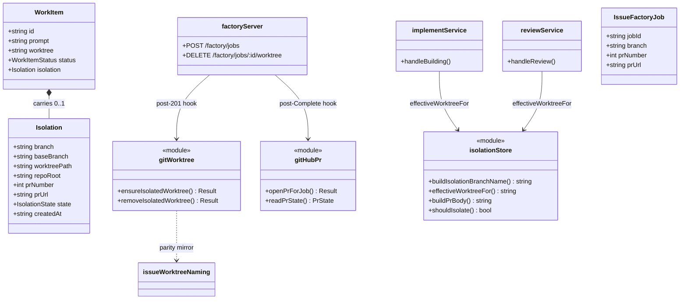
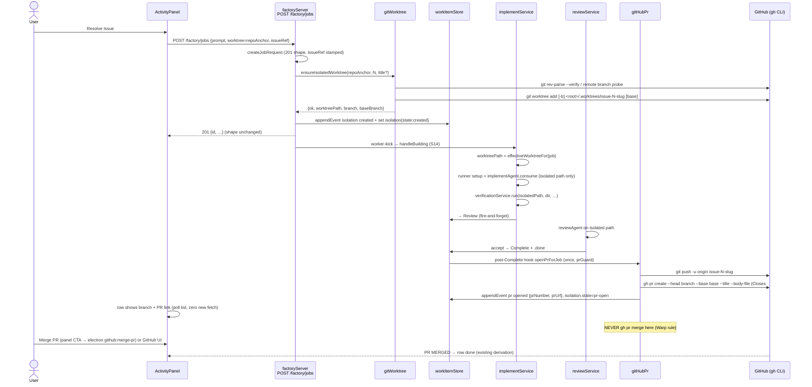
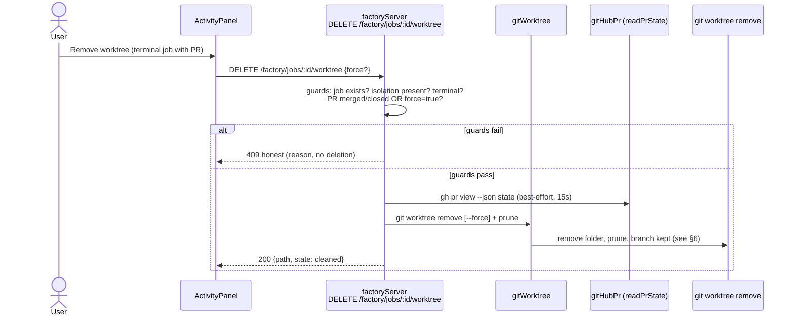
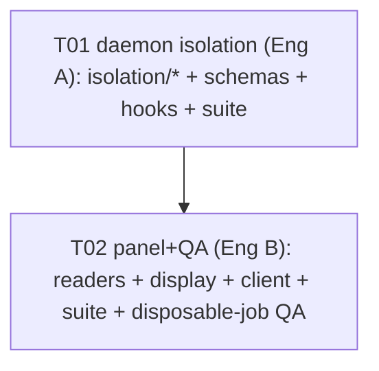

# Factory Jobs Isolation (Warp-style) — System Design

Status: PROPOSAL. Read first: `software-warppanel/PLAN-activity-final.md`
(decisions in force), `software-warppanel/DESIGN-warppanel.md` (adapter seam),
`docs/LOOPS.md` (bound inventory, Rule 7), `src/canvas/issueWorktreeNaming.ts`
(branch convention, owner for canvas terminals).

Goal: creating a factory job from a GitHub issue runs **isolated** —
`git worktree add` + branch `issue-N[-slug]` — implement works **only** there,
completion opens a **PR (never merges)** for human handoff (Warp rule);
manual merge (panel Merge CTA or GitHub UI) closes the loop. Optional
worktree cleanup after merge/close. No auto-merge anywhere.

## 1. Scope

### In scope

1. On `POST /factory/jobs` **with a valid `issueRef`** (`{provider:"github",
   issueNumber>0, repo, url}`): daemon creates (or attaches) an isolated
   worktree + branch, records it on the job, and all later
   implement/verify/review work for that job runs inside the isolated path.
2. Branch naming reuses the canvas convention
   (`src/canvas/issueWorktreeNaming.ts` — `issue-<N>-<slug>`, slug ≤40 chars).
   Daemon carries a byte-parity mirror (no cross-import renderer↔daemon).
3. On first `Complete` of an isolated job: daemon pushes the branch and opens
   a PR whose body contains `Closes #N`. Exactly once per job (idempotent).
   Failure is honest (timeline event, job stays `Complete`, panel shows
   branch + manual command). **No `gh pr merge` in the daemon. Ever.**
4. Panel shows per-issue isolation state: `branch`, PR number/URL (link),
   stage; honest-empty when absent.
5. Optional cleanup: **one** new daemon route
   `DELETE /factory/jobs/:id/worktree` (God +1, the only new route).
   Explicit human action only. Never automatic.
6. `docs/LOOPS.md` rows for every new git/gh op (Rule 7), with constants +
   meta-test coverage.

### Out of scope (decisions, not gaps)

- Auto-merge, auto-close of issues, label writes from the daemon beyond the
  PR body (`Closes #N` drives close-on-merge on GitHub side).
- Canvas terminal flows (`resolveIssueWorktree` CASE C/A/B, review/fix/conflict
  terminals) — untouched, read-only reference.
- Factory jobs **without** `issueRef` — byte-identical legacy in-place path
  (pacts F01–F14 intact).
- New polling, new intervals, new daemon timers — zero.
- Daemon restart / `pnpm dev` / `pnpm build` by implementers — forbidden
  (QA probes the user-raised daemon/renderer only).

### Evidence read (code as of 2026-09-06)

| Fact | Source |
|---|---|
| Create requires `worktree`, stamps `issueRef` additive restore-tolerant (memory key + `issueRef` timeline meta) | `headless-runtime/factory/jobs/jobCreate.ts` (~L194 worktree-required, ~L328 stamp, ~L769 issueRef section) |
| Renderer mirror of the ref + prompt builder (`Closes #N` already in prompt scope text) | `src/features/warpPanel/adapters/factoryIssueJobs.ts` (meta key, sanitize, `buildFactoryResolvePrompt`) |
| Implement works in-place today: `worktreePath = resolve(input.worktreePath)` + `mkdirSync` + opencode tools | `headless-runtime/implement/implementAgent.ts` (~L83) |
| Same-dir assumption confirmed: implement + verify + review all resolve `path.resolve(workItem.worktree)` | `implementService.ts:33` (`worktreePath`), `:459` (`verificationService.run(worktreePath, dir, …)`); `reviewService.ts:120` (`resolve(current.worktree)`); `verification.ts:557 run(worktreePath, dir, …)` |
| Canvas isolation today: `handleResolveIssue` → `resolveIssueWorktree` CASE C(created)/A(resumed)/B(reused) → `window.termcanvas.project.createWorktree` → main `project:create-worktree` (`<mainRoot>/.worktrees/<branch>`, attach-if-branch-exists, remote-tracking) | `src/canvas/XyFlowCanvas.tsx:896-1064`, `src/canvas/resolveIssueWorktree.ts`, `electron/main.ts:961-1032` (+`restore-worktree`, `remove-worktree` dirty-guard + `branch -D`) |
| Branch convention owner | `src/canvas/issueWorktreeNaming.ts` (`buildIssueBranchName`) |
| Daemon node has **no** gh bridge: only `worktree-control.ts` (`execFileSync git worktree add/remove`, no push/PR) via headless `api-server` `/worktree/*` | `headless-runtime/worktree-control.ts`, `worktree-helpers.ts`, `api-server.ts:342-350` |
| All gh lives in Electron main (`github:*`, `gh` with 10–30 s timeouts, `GH_TOKEN` forwarding, `merge-pr` = `gh pr merge --squash`) | `electron/main.ts` (~L3390 env, ~L4372 issue list 15 s, ~L4521 issue create 30 s, ~L4925 `github:merge-pr`) |
| Timeouts in force | `IMPLEMENT_LLM_TIMEOUT_MS=25000`, `IMPLEMENT_SETUP_TIMEOUT_MS=15000`, `IMPLEMENT_VERIFY_TIMEOUT_MS=120000`, `IMPLEMENT_MAX_FILES_MINIMAL=3`, `IMPLEMENT_MAX_CREATED_FILES=50` (`shared/types/implement.ts`); pre-verify rescan 4×500 ms (`LOOPS.md` P05) |
| Panel resolve today sends `worktree = issue.worktreePath` (canvas cwd) → job works in-place in the repo worktree | `src/features/warpPanel/components/activityActions.ts:961-1012` (`POST /factory/jobs` with `issueRef`) via `src/lib/factoryClient.ts:createFactoryJob` |
| Prior decisions reused | `PLAN-activity-final.md` §§1–3,7–8 (adapter seam, zero new intervals, handler-refs-by-reference, honest-empty, Figma fidelity) |

## 2. Implementation approach

### Hard problems

1. **Pure create vs side-effectful isolation.** `jobCreate.ts` is a pure
   sync validator (whitelist imports, never throws, no `exec`). Git worktree
   creation is a side effect with timeouts/failure modes. It must NOT move
   into `jobCreate`. Resolution: `jobCreate` stays the validator + stamper;
   the shell (`factoryServer.ts` `POST /factory/jobs`, after the 201 shape is
   built, before the S14 worker-kick) calls the new isolation module once,
   best-effort, and appends the outcome as timeline events. Pacts without
   `issueRef` never touch the new code path.
2. **No `workItem.worktree` mutation.** Overwriting the requested path would
   break the 201 shape and legacy readers. Resolution: keep
   `workItem.worktree` as requested (repo anchor, pact-stable); add an
   **optional** `isolation` object (schema §4) and a single pure resolver
   `effectiveWorktreeFor(job) = isolation.worktreePath ?? resolve(worktree)`.
   `implementService`, `verificationService` callers, and `reviewService`
   switch to the resolver (3 one-line call-site changes, no logic forks).
3. **Daemon has no gh.** PR creation is new daemon capability. Resolution: new
   `gitHubPr` helper that shells `git` + `gh` exactly like Electron main does
   (same timeouts, same `GH_TOKEN` forwarding, `maxBuffer 10 MB`), called
   once on first `Complete` of an isolated job, guarded by a timeline meta
   (`prOpened`). No new route. Merge stays exclusively in Electron main
   (`github:merge-pr`, panel Merge CTA).
4. **One worktree per job, no leaks.** Resolution: creation is idempotent per
   job (job-id-keyed; branch attach when it already exists); cleanup is
   explicit-only via the single new DELETE route with terminal-state +
   merged/closed guards (§6 table). No background pruner, no auto-remove.

### Framework / pattern choices

- ESM only, zero `require()`. `node:child_process execFile` (promisified) —
  same primitive as Electron main (no new dependency).
- zod v4 for the `isolation` schema (`superRefine`, no legacy `.refine`),
  all fields optional at the `WorkItem` level (restore-tolerant: old jobs
  read `undefined`).
- Single-writer rule (C3): `workItemStore` remains the only store writer;
  the isolation module never writes `job.json` directly (events via
  `appendEvent`, state via existing transitions).
- Fail-safe pureness (C2): every new function never throws (honest
  `{ok:true|false}` unions, errors sliced ≤200 chars).
- God +minimum: exactly **1 new route** (`DELETE /factory/jobs/:id/worktree`).
  Creation and PR-open ride existing flows (post-201 hook, post-Complete
  hook). No other route, no new interval, no new timer except bounded
  `setTimeout`-free exec timeouts (AbortController/exec `timeout` option).

## 3. Closed file list

Anything outside = FAIL. `~` = modify. Counts: T01 = 4 new + 4 modified,
T02 = 2 new + 4 modified. Zero new packages. All writes UTF-8 (`-Encoding utf8`
in PowerShell).

### T01 — daemon isolation (Eng A)

New (4):

1. `headless-runtime/factory/isolation/gitWorktree.ts` — branch mirror +
   `ensureIsolatedWorktree({repoAnchor, issueNumber, title?, baseBranch?})` +
   `removeIsolatedWorktree({repoAnchor, worktreePath, force?})` (execFile `git`,
   timeouts §8, never throws).
2. `headless-runtime/factory/isolation/gitHubPr.ts` — `openPrForJob(...)`
   (`git push -u origin <branch>` + `gh pr create --head/--base/--title/--body-file`
   with `Closes #N`), `readPrState(...)` (`gh pr view --json state`, cleanup
   guard), never throws, no merge primitive exported.
3. `headless-runtime/factory/isolation/isolationStore.ts` — pure helpers:
   `buildIsolationBranchName` parity, `effectiveWorktreeFor(job)`,
   `buildPrBody(issueNumber, title?)`, `shouldIsolate(body)` (`issueRef`
   valid + non-pact job), `prGuard` (once-per-job via timeline meta scan).
   Zero `child_process` here (testable offline).
4. `tests/factory-isolation.test.ts` — offline unit suite (≥18 tests, §9).

Modified (4):

5. `~ shared/types/workItem.ts` — additive optional `IsolationSchema` +
   `WorkItemSchema.extend({ isolation: …optional() })` (zod4, §4).
6. `~ headless-runtime/factory/factoryServer.ts` — post-201 hook (call
   `ensureIsolatedWorktree` best-effort when `shouldIsolate`, append events)
   + post-`Complete` hook (call `openPrForJob` once, best-effort) + the ONE new
   route `DELETE /factory/jobs/:id/worktree` (thin delegation to the isolation
   module; 400/404/409/500 honest shapes).
7. `~ headless-runtime/implement/implementService.ts` — 1-line call-site:
   `worktreePath = effectiveWorktreeFor(workItem)` (was
   `path.resolve(workItem.worktree)`).
8. `~ headless-runtime/review/reviewService.ts` — 1-line call-site: same
   resolver for the reviewer `worktreePath`.

`verificationService` needs NO change (it receives `worktreePath` from
`implementService`). `jobCreate.ts` needs NO change (validator/stamper
untouched — isolation keys off the already-stamped `issueRef`).

### T02 — panel surface + QA (Eng B)

New (2):

9. `tests/warp-isolation-panel.test.ts` — offline panel suite (≥12 tests, §9).
10. `software-warppanel/QA-isolation-report.md` — QA evidence for the one
    disposable job (§10). Report file, not code.

Modified (4):

11. `~ src/features/warpPanel/adapters/factoryIssueJobs.ts` — pure readers:
    `readFactoryJobIsolation(job)` (branch/worktreePath/baseBranch/prUrl…),
    `readFactoryJobPrLink(job)` (URL-or-null, never synthesized).
12. `~ src/features/warpPanel/types.ts` — `IssueFactoryJob` gains 3 OPTIONAL
    fields only: `branch?: string`, `prNumber?: number`, `prUrl?: string`.
    No other change.
13. `~ src/features/warpPanel/components/ActivityPanel.tsx` — row/detail shows
    branch + PR link (anchor, `openIssueInGitHub`-style opener) + honest-empty
    when absent. Layout/tokens/timings/a11y unchanged.
14. `~ src/lib/factoryClient.ts` — additive `deleteFactoryJobWorktree(id)`
    (`DELETE /factory/jobs/:id/worktree`, `{force?}` body, honest fallback,
    never throws). No other client change.

Explicitly NOT touched: `src/canvas/*` (incl. `issueWorktreeNaming.ts`,
`XyFlowCanvas.tsx`, `resolveIssueWorktree.ts`), `electron/*` (gh/merge stay
as-is), `headless-runtime/factory/jobs/jobCreate.ts`,
`headless-runtime/factory/jobs/jobService.ts`, `package.json`, configs,
`docs/LOOPS.md` shape beyond appending rows (rows appended by Eng A inside
T01's file budget — the doc is read-mostly; the append is a 6-line block, no
restructure).

## 4. Data structures and interfaces

### 4.1 `isolation` schema (additive, restore-tolerant)

```ts
// shared/types/workItem.ts — additive (zod4, superRefine, all-optional at parent)
export const IsolationStateEnum = z.enum([
  "created",    // worktree ready, implement may run
  "ready",      // implement done, awaiting review/Complete
  "pr-open",    // gh pr create succeeded
  "pr-merged",  // observed merged (via panel merge / gh view)
  "cleaned",    // worktree removed via DELETE route
]);
export const IsolationSchema = z.object({
  branch: z.string().min(1).max(128),
  baseBranch: z.string().min(1).max(128),
  worktreePath: z.string().min(1),
  repoRoot: z.string().min(1),
  prNumber: z.number().int().positive().optional(),
  prUrl: z.string().url().optional(),
  state: IsolationStateEnum,
  createdAt: z.string().min(1), // ISO8601 UTC
}).superRefine((d, ctx) => {
  if (d.prUrl !== undefined && d.prNumber === undefined) {
    ctx.addIssue({ code: "custom", message: "prNumber required when prUrl present", path: ["prNumber"] });
  }
});
// WorkItemSchema.extend({ isolation: IsolationSchema.optional() })
// Old jobs: undefined (never invented). job.json carries it because timeline
// + store snapshot persist it (same durability as issueRef).
```

Timeline meta keys (durable path, same pattern as `issueRef`): `isolation`
(creation outcome) and `pr` (`{prNumber, prUrl} | {error}`). Memory fast path:
`workItem.isolation` object. Pacts F01–F14 never carry either key.

`job.json` delta example (isolated job, after PR open):

```json
{
  "id": "job-mtk7x2ab",
  "prompt": "# Resolve issue #412 — …",
  "worktree": "C:\\repo\\termcanvas",
  "status": "Complete",
  "isolation": {
    "branch": "issue-412-fix-kanban-count",
    "baseBranch": "main",
    "worktreePath": "C:\\repo\\termcanvas\\.worktrees\\issue-412-fix-kanban-count",
    "repoRoot": "C:\\repo\\termcanvas",
    "prNumber": 418,
    "prUrl": "https://github.com/owner/repo/pull/418",
    "state": "pr-open",
    "createdAt": "2026-09-07T12:00:00.000Z"
  }
}
```

`worktree` stays the repo anchor (pact-stable); `isolation.worktreePath` is
the jail implement actually ran in.



### 4.2 Branch parity contract

`buildIsolationBranchName({issueNumber, title?})` MUST equal
`buildIssueBranchName({issueNumber, title})` for every input (same
lower/slug/collapse/trim/40-char algorithm; empty slug → `issue-<N>`).
Parity is enforced by a test that imports the canvas function and compares
100+ generated + edge titles (unicode, 200-char, all-symbols, trailing
dashes). The two files cite each other; neither imports the other (renderer
vs daemon boundary).

## 5. Program call flow

### 5.1 Create → isolate → implement → PR (happy path)



### 5.2 Cleanup (explicit only)



### 5.3 Failure / rollback paths

- `ensureIsolatedWorktree` fails (not a repo, `git` missing, branch locked):
  job is still created (201 stands); timeline `isolation:{error}` appended;
  `isolation` stays absent → `effectiveWorktreeFor` falls back to the
  requested anchor (legacy in-place behavior, loudly logged). The panel shows
  no branch (honest-empty). Retry = create a new job (no silent re-run).
- Implement crashes mid-flight: standard Building→Triage path; isolated
  worktree is left intact for forensics (never auto-removed on failure).
- `git push` / `gh pr create` fails (no `gh`, no auth, offline): job stays
  `Complete`; timeline `pr:{error}` (first 200 chars) + notify hint with the
  exact manual command (`git push -u origin <branch>` + `gh pr create …`).
  `openPrForJob` never retries by itself; re-entry happens only if the job
  re-enters `Complete` (transition guard) or a human re-fires via re-review.
- DELETE guards refuse (non-terminal, PR still open, dirty without force):
  409 with the reason; nothing deleted. `force=true` overrides dirtiness but
  never overrides non-terminality.

## 6. Ownership table — who creates / deletes what, when (bounds)

| # | Artifact | Created by / when | Deleted by / when | Bound |
|---|---|---|---|---|
| 1 | Branch `issue-N[-slug]` | `ensureIsolatedWorktree`, post-201, only when `shouldIsolate` (valid `issueRef`, non-pact) | **Never by the daemon** (branch survives worktree removal so the PR stays reviewable; `remove-worktree` precedent: branch deleted only on explicit recreate flows) | 1 branch per job (attach-if-exists, never duplicate) |
| 2 | Worktree `<root>/.worktrees/<branch>` | Same hook as #1 (`git worktree add`, attach existing branch when present, track remote when remote-only) | `DELETE /factory/jobs/:id/worktree` only (explicit human call; guards §5.2) | **1 worktree per job** (job-id-keyed; second create for the same job id attaches, never adds) |
| 3 | Job files (`.agents/factory/<id>/`, `job.json`, logs, `result.json`) | Existing store paths (unchanged) | Existing lifecycle (unchanged; cleanup route never touches them) | Unchanged |
| 4 | PR (push + `gh pr create`, body `Closes #N`) | `openPrForJob`, once per job on first `Complete` (`prGuard` timeline scan) | Never by the daemon (close/merge is human: panel Merge CTA → `github:merge-pr`, or GitHub UI) | ≤1 PR per job (guard); 0 retries internally |
| 5 | Merge | Human only (panel/electron `gh pr merge --squash` or GitHub UI) | n/a | Daemon exports no merge primitive (grep-enforced) |

Quotas (all fail-closed, honest errors, never silent): worktrees per job = 1;
PRs opened per job ≤ 1; `gh`/git attempts per hook = 1 (no internal retry);
concurrent `ensure` per job id = 1 (in-flight set, cleared in `finally`).

## 7. Anything unclear (assumptions made)

1. **Repo anchor.** The panel sends the issue's canvas `worktreePath` as
   `worktree` today. Design treats it as a *repo anchor* (any path inside the
   repo); the daemon resolves the main root (`resolveMainRepoRoot`) and always
   creates under `<root>/.worktrees/`. If the anchor is not inside a git repo,
   isolation fails honest (fallback in-place, §5.3). Assumption: issues always
   resolve from a canvas project with a git remote (non-git projects get the
   fallback, never a 500).
2. **Base branch.** Default = current `HEAD` branch of the anchor at creation
   time (`git rev-parse --abbrev-ref HEAD`, fallback `main`). No new config;
   recorded as `baseBranch` so the PR `--base` is stable even if the repo
   moves later.
3. **Title for the slug.** The daemon has only the prompt (`# Resolve issue
   #N — <title>` first line). Slug parses the first `# Resolve issue #N — …`
   line when present, else falls back to `issue-N`. Parity test covers both.
4. **Pact exclusion.** `shouldIsolate` returns false for pact-shaped jobs
   (same predicate family as `isPactJob`/`isPactReviewJob`: `job-abc123`,
   `job-f*`, `playground-*`, prompt `playground-`). Pacts stay byte-identical
   and offline (no git/gh touched under `node:test` pact runs).
5. **PR dedupe across restarts.** `prGuard` scans the persisted timeline for a
   `pr` meta with `prNumber` (durable path) before opening; memory
   `isolation.state` is the fast path. A job restored from disk with
   `state:pr-open` never re-opens.
6. **No Electron dependency in the daemon.** The daemon shells `git`/`gh`
   directly (same flags/env as Electron main) instead of IPC-ing to Electron.
   Rationale: factory daemon runs headless (CI/dev-container) where Electron
   may not exist.

## 8. Shared knowledge (constraints for implementers)

- ESM only (`import`, zero `require()`); zod v4 (`z.object` + `superRefine`,
  no `.refine`); neutral English user strings; UTF-8 everywhere
  (PowerShell writes MUST pass `-Encoding utf8`).
- Pacts F01–F14: non-`issueRef` creates, 201 shape, `queued` compat, cancel
  window, and mock-verify paths stay byte-identical. New code is unreachable
  without a valid `issueRef` (gate at the top, tested).
- God +minimum: this design adds exactly 1 route. Any second route = FAIL.
- Timeouts (all explicit, all enforced, all in `docs/LOOPS.md` rows G01–G04):
  `GIT_WORKTREE_ADD_TIMEOUT_MS=30000`, `GIT_PUSH_TIMEOUT_MS=30000`,
  `GH_PR_CREATE_TIMEOUT_MS=30000`, `GH_PR_VIEW_TIMEOUT_MS=15000`,
  `GIT_PROBE_TIMEOUT_MS=10000`; `maxBuffer 10 MB`; exec uses `timeout` option
  (no hand-rolled timers, no retry inside the helper — 1 attempt each).
- `gh` env: forward `GH_TOKEN`/`GITHUB_TOKEN` exactly like
  `electron/main.ts:3390-3399` (copy the 6-line block, cite it).
- `GH_TOKEN` setup (operational — no secret is ever hardcoded or logged):
  the daemon reads the token from its own process env (`ghEnv()` in
  `headless-runtime/factory/isolation/gitHubPr.ts:53-62`, same mirror as
  Electron main; in-process `ensureFactoryServer` shares Electron's env,
  a standalone daemon uses whatever shell launched it). Exact setup:
  1. `gh auth login` once in the shell that starts the app/daemon
     (or set a user-level `GH_TOKEN` / `GITHUB_TOKEN` with `repo` scope;
     SSO-enable it for the target org);
  2. verify in THAT shell with `gh auth status` before starting;
  3. symptom of a missing token: the job still reaches `Complete` but the
     timeline carries `pr open failed: …` (push/auth) and no PR opens —
     check the job timeline, not the panel. Retrying happens
     automatically on the next Review→Complete (the `pr` error meta does
     NOT latch `prGuard`; only a recorded `prNumber` does).
- Never `taskkill`, never restart/kill the daemon, never run repo `pnpm dev`
  / `pnpm build` / `npx tsc` as a *build step* (read-only `tsc --noEmit` for
  verification is allowed with `--pretty false` + 180 s timeout; it does not
  emit or restart anything).
- Every command carries an explicit timeout. Every `rg` expectation below is
  a DONE gate.
- Warp rule (non-negotiable): the daemon MUST NOT contain the strings
  `pr merge`, `merge-pr`, or `--merge` outside comments that forbid them.
  Grep-enforced (§9 D5).

## 9. Tests (DONE gates D1–D6)

```powershell
# D1 — types clean (timeout 180s)
npx tsc --noEmit --pretty false
# expect: EXIT 0, zero errors from isolation/panel files
```

```powershell
# D2 — suites green (timeout 180s)
npx tsx --test tests/factory-isolation.test.ts
# expect: >=18 pass, 0 fail
npx tsx --test tests/warp-isolation-panel.test.ts
# expect: >=12 pass, 0 fail
npx tsx --test tests/warp-live-activity.test.ts
# expect: unchanged green (sibling suite, no regressions)
```

```powershell
# D3 — pacts intact (timeout 300s)
npx tsx --test tests/*pact*.test.ts
# expect: F01-F14 green, zero git/gh spawns (assert via env guard PANEL_OFFLINE=1 path)
```

```powershell
# D4 — LOOPS rows present (timeout 60s)
rg -n "GIT_WORKTREE_ADD_TIMEOUT_MS|GIT_PUSH_TIMEOUT_MS|GH_PR_CREATE_TIMEOUT_MS|GH_PR_VIEW_TIMEOUT_MS" headless-runtime/factory/isolation/ docs/LOOPS.md
# expect: constants defined once in code, cited with identical numbers in LOOPS.md G01-G04
```

```powershell
# D5 — never auto-merge (timeout 60s)
rg -n "pr merge|merge-pr|--merge" headless-runtime/factory/isolation/
# expect: 0 hits in code (comment forbidding it allowed in gitHubPr.ts header only)
rg -n "setInterval" headless-runtime/factory/isolation/ src/features/warpPanel/components/ActivityPanel.tsx src/features/warpPanel/adapters/factoryIssueJobs.ts
# expect: 0 hits
```

```powershell
# D6 — closed file list (timeout 60s)
git status --porcelain
# expect: only §3 files + QA report; no package.json, no configs, no electron/*, no src/canvas/*
```

Unit coverage (offline, `node:test`, injected fakes, zero network/daemon):

- `factory-isolation.test.ts` (Eng A, ≥18): branch parity incl. unicode/long/
  symbols (4), `shouldIsolate` gate incl. pact exclusion + junk `issueRef` (4),
  `effectiveWorktreeFor` fallback/prefer-isolated (3), PR body `Closes #N` (2),
  `prGuard` once-per-job incl. restart-from-disk (2), DELETE guards matrix
  incl. dirty/force/non-terminal (3+).
- `warp-isolation-panel.test.ts` (Eng B, ≥12): `readFactoryJobIsolation`
  incl. malformed/absent (4), `readFactoryJobPrLink` never-synthesized (3),
  `IssueFactoryJob` branch/pr display mapping (3), `deleteFactoryJobWorktree`
  fallback shape (2+).

## 10. QA — one real disposable job (human-raised infra only)

Preconditions (probe, never start): daemon `GET /factory/health` 200
(`-TimeoutSec 15`); renderer `http://localhost:5173/` 200; `gh auth status`
passes in the test repo; test repo has `origin` + clean `git status`.

Disposable setup (throwaway issue + throwaway branch namespace):

```powershell
# Q0 — create a disposable issue (timeout 30s, -Encoding utf8)
gh issue create --title "[disposable] isolation probe" --body "Warp isolation QA probe - will be closed."  # note number N
git rev-parse --abbrev-ref HEAD  # note base branch B
```

Run (all timeouts explicit):

| # | Action | Pass bar |
|---|---|---|
| Q1 | Panel → Resolve issue #N (repo anchor = test repo) | Daemon log shows `isolation created branch=issue-N-*`; `<root>/.worktrees/issue-N-*` exists; job `GET /factory/jobs/:id` carries `isolation.state=created` |
| Q2 | Let pipeline run (Building→Review→Complete) | Changed files land ONLY under the isolated worktree (`git -C <root> status` on main stays clean); `result.json`/`verify.json` written; panel row shows branch |
| Q3 | On Complete | `gh pr view` finds exactly 1 PR head=`issue-N-*` base=`B`, body contains `Closes #N`; panel row shows PR link; **no merge happened** (`gh pr view --json state` = OPEN) |
| Q4 | Manual merge (panel Merge PR CTA or `gh pr merge --squash`) | PR MERGED; issue auto-closes via `Closes #N`; panel row → done |
| Q5 | Optional cleanup `DELETE /factory/jobs/:id/worktree` | Worktree folder gone, `git worktree list` clean, branch retained, job `isolation.state=cleaned`; evidence appended to `software-warppanel/QA-isolation-report.md` with screenshots/log excerpts |
| Q6 | Close disposable issue if still open; prune remote branch only after merge | `gh issue close N` only if auto-close did not fire; never delete the base branch |

FAIL → rollback (any Q red, any main-repo dirt, any auto-merge observed,
any file outside §3):

```powershell
git checkout -- shared/types/workItem.ts headless-runtime/factory/factoryServer.ts headless-runtime/implement/implementService.ts headless-runtime/review/reviewService.ts src/features/warpPanel/adapters/factoryIssueJobs.ts src/features/warpPanel/types.ts src/features/warpPanel/components/ActivityPanel.tsx src/lib/factoryClient.ts
Remove-Item -LiteralPath "headless-runtime/factory/isolation","tests/factory-isolation.test.ts","tests/warp-isolation-panel.test.ts" -Force
gh pr close <probe-pr> --delete-branch
git worktree remove --force "<root>/.worktrees/<probe-branch>"
git worktree prune
npx tsc --noEmit --pretty false
# expect: EXIT 0 (pre-batch state restored)
```

## 11. Task list + writer matrix (2 engineers, zero overlap)

Only 2 tasks (density rule: each ≥3 files; layers, not files). T01 is the
shared prerequisite (repo infra exists — zero new packages — so T01 = daemon
isolation core + contract). T02 consumes ONLY the frozen §4 contract, so Eng B
builds in parallel and integrates on T01 landing.

| Task | Name | Files (write ownership — each file ONE writer) | Depends | Priority | Owner |
|---|---|---|---|---|---|
| T01 | Daemon isolation core | `isolation/gitWorktree.ts` (new), `isolation/gitHubPr.ts` (new), `isolation/isolationStore.ts` (new), `tests/factory-isolation.test.ts` (new), `~ shared/types/workItem.ts`, `~ factoryServer.ts`, `~ implementService.ts`, `~ reviewService.ts` (+6-line LOOPS.md append inside T01 budget) | — | P0 | Eng A |
| T02 | Panel surface + QA | `tests/warp-isolation-panel.test.ts` (new), `QA-isolation-report.md` (new), `~ factoryIssueJobs.ts`, `~ warpPanel/types.ts`, `~ ActivityPanel.tsx`, `~ lib/factoryClient.ts` | T01 (contract §4) | P0 | Eng B |

Writer-file matrix (X = writes; R = reads-only reference):

| File | Eng A (T01) | Eng B (T02) |
|---|---|---|
| `isolation/*.ts` (3 new) | X | R |
| `tests/factory-isolation.test.ts` | X | — |
| `~ shared/types/workItem.ts` | X | R |
| `~ factoryServer.ts` | X | — |
| `~ implementService.ts`, `~ reviewService.ts` | X | — |
| `~ factoryIssueJobs.ts` | R | X |
| `~ warpPanel/types.ts`, `~ ActivityPanel.tsx` | — | X |
| `~ lib/factoryClient.ts` | — | X |
| `tests/warp-isolation-panel.test.ts`, `QA-isolation-report.md` | — | X |
| `src/canvas/*`, `electron/*`, `jobCreate.ts`, `jobService.ts`, `package.json`, configs | R (frozen) | R (frozen) |

Overlap cells: none. Shared read-only refs: `issueWorktreeNaming.ts`
(parity source), `resolveIssueWorktree.ts` + `main.ts:961-1032` (worktree
semantics), `worktree-control.ts`/`worktree-helpers.ts` (flag shapes),
`main.ts:3390` (gh env), `factoryIssueJobs.ts`↔`jobCreate.ts` (`issueRef`
key/shape), `PLAN-activity-final.md` §§1–3 (seam/zero-interval rules).
Neither task modifies them.



### T01 — Daemon isolation core (Eng A, P0, 8 files)

1. `isolation/isolationStore.ts`: branch parity + `effectiveWorktreeFor` +
   `buildPrBody` + `shouldIsolate` + `prGuard`. Pure, never throws.
2. `isolation/gitWorktree.ts`: ensure/remove via `execFile git` (timeouts §8,
   `maxBuffer 10 MB`, in-flight set per job id). Never throws.
3. `isolation/gitHubPr.ts`: push + `gh pr create` + `readPrState`. No merge
   primitive. Never throws. Copies the 6-line `GH_TOKEN` block from
   `electron/main.ts` with a cite comment.
4. `~ shared/types/workItem.ts`: `IsolationSchema` + optional extend (§4.1).
5. `~ factoryServer.ts`: post-201 ensure hook + post-Complete PR hook +
   single DELETE route (thin delegation, honest codes).
6. `~ implementService.ts` + `~ reviewService.ts`: 1-line resolver swap each.
7. `tests/factory-isolation.test.ts`: §9 Eng A suite.
8. Append `docs/LOOPS.md` rows G01–G04 (constants + kill-switches, +0
   intervals). Done when: D1–D6 green for T01 files; §4 signatures frozen.

### T02 — Panel surface + QA (Eng B, P0, needs T01 contract, 6 files)

1. `~ factoryIssueJobs.ts`: `readFactoryJobIsolation` + `readFactoryJobPrLink`
   (pure, never throws, never synthesizes URLs).
2. `~ warpPanel/types.ts`: 3 optional fields on `IssueFactoryJob` (§3.12).
3. `~ ActivityPanel.tsx`: branch + PR-link display, honest-empty, no
   layout/token/timing/a11y change.
4. `~ lib/factoryClient.ts`: `deleteFactoryJobWorktree` additive client.
5. `tests/warp-isolation-panel.test.ts`: §9 Eng B suite.
6. `QA-isolation-report.md` + §10 run: the one disposable job end-to-end.
   Done when: D1–D6 green; Q1–Q6 evidence in the report.

## 12. LOOPS.md rows to append (Rule 7, Eng A)

| # | Where | Mechanism | Exact bound | Rule / kill-switch |
|---|---|---|---|---|
| G01 | `isolation/gitWorktree.ts` (`ensureIsolatedWorktree`) | `git worktree add` (+ rev-parse probes) per isolated create | `GIT_WORKTREE_ADD_TIMEOUT_MS = 30000` (1 attempt, `timeout` option, `maxBuffer 10 MB`); probes `GIT_PROBE_TIMEOUT_MS = 10000` | valid `issueRef` required (absent/junk = legacy path, no spawn); pact jobs excluded (`shouldIsolate=false`) |
| G02 | `isolation/gitHubPr.ts` (`openPrForJob` push) | `git push -u origin <branch>` once per job | `GIT_PUSH_TIMEOUT_MS = 30000` (1 attempt, then honest `pr:{error}`, no retry) | `prGuard` (timeline `pr` meta present = skip); never on non-`Complete` |
| G03 | `isolation/gitHubPr.ts` (`openPrForJob` create) | `gh pr create --head/--base/--title/--body-file` once per job | `GH_PR_CREATE_TIMEOUT_MS = 30000` (1 attempt, then honest `pr:{error}`, no retry) | same guard as G02; `gh` absent/offline = honest fallback + manual command hint |
| G04 | `isolation/gitHubPr.ts` (`readPrState`, DELETE guard) | `gh pr view --json state` per cleanup call | `GH_PR_VIEW_TIMEOUT_MS = 15000` (1 attempt; failure = guard refuses unless `force=true` + terminal) | DELETE guards (non-terminal → 409 always; open-PR + !force → 409) |

No new `setInterval`/`setTimeout`/loop: all execs are single-shot with the
`timeout` option; per-job concurrency is an in-flight `Set` cleared in
`finally` (structural dedupe, same family as LOOPS.md B05).
