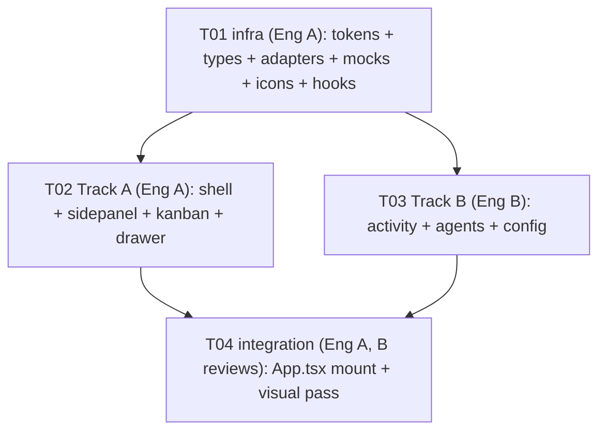

# WarpPanel — System Design (Figma Make side-panel replica, mock-first)

Target: `src/features/warpPanel/` in TermCanvas. Faithful replica of
`figma/Crear panel lateral interactivo/` running side-by-side with the canvas,
mock data first, real wiring later. React 19.2.4 + Tailwind v4 on both sides.
Zero new dependencies.

Source of truth read for this design (all files inspected):

- `figma/.../src/App.tsx` (43 lines), `src/index.css`, `src/data/issues.ts`,
  `src/data/kanban.ts`, `package.json`, `src/main.tsx`
- Components: `SidePanel.tsx` (~380 lines), `KanbanBoard.tsx` (1128),
  `ActivityPanel.tsx` (1641), `AgentsPanel.tsx` (~560), `AgentConfig.tsx`
  (~750), `IssueDrawer.tsx` (~560), `IssuesPanel.tsx` (594), `icons.tsx` (~230)
- Host: `src/App.tsx` (FactoryLab toggle pattern, line ~470),
  `src/main.tsx`, `src/index.css` (`:root` theme tokens),
  `src/features/factoryLab/` (feature pattern: `FactoryLabPage.tsx` +
  `components/` + `hooks/useWorkItemsPolling.ts`), `tsconfig.json` (`@/*` alias)

---

## 1. Stack and decisions

### 1.1 What is copied verbatim

| Artifact | Decision |
|---|---|
| All component JSX, inline styles, hover handlers, timings (`120ms`, `220ms`, `ANIM_MS=220`, `DETAIL_MS=220`, `DETAIL_EASE=cubic-bezier(0.32, 0.72, 0, 1)`), cursors, drag-and-drop handlers | Copy verbatim, only import paths change |
| `pulse-dot` / `spin-icon` keyframes + `prefers-reduced-motion` block | Copy verbatim into `tokens.css` |
| Scrollbar styling (thin, hidden-by-default) | Copy verbatim, **scoped under `.warppanel`** so it never leaks to the canvas/xterm |
| Focus-visible outline (`2px solid var(--border-focus)`) | Copy verbatim, scoped under `.warppanel` |
| `icons.tsx` (15 SVG exports) | Copy verbatim, renamed to `warpIcons.tsx` (avoids collision with `lucide-react` idiom and host icon sets) |
| Mock datasets (`KANBAN_ISSUES`, `KANBAN_COLUMNS`, `ISSUES`, `COLUMNS`, `PHASE_LABELS`, `AWAITING_LABELS`, `AGENT_CONFIGS`, `MOCK_REPOS`, `FOREMAN`, `SUB_AGENTS`) | Copy verbatim into `adapters/mock*.ts` |
| Filter input in KanbanBoard (uncontrolled, decorative in Figma) | Keep as-is (decorative); real filtering is a wiring-phase item (O-4) |

### 1.2 What is adapted (and why)

| Figma | TermCanvas adaptation | Reason |
|---|---|---|
| `:root` tokens `--bg: #0d0d0d`, `--bg-elevated`, `--bg-panel`, `--bg-hover`, `--border`, `--text-*`, `--accent`, `--status-*`, `--phase-*`, `--await-*`, `--font-sans/mono` | Copied with **identical values** but renamed to `--wp-*` and declared under the `.warppanel` selector in `tokens.css`; component code does a mechanical `var(--bg)` → `var(--wp-bg)` substitution | Host `:root` already defines `--bg: #1a1918`, `--border: #333231`, etc. with different values. Unscoped copy would silently re-theme the whole app (canvas, terminals). Namespacing keeps pixel fidelity with zero host leakage |
| Google Fonts `@import` (Inter + JetBrains Mono) in Figma `index.css` | Moved into `tokens.css` (must stay the first statements of that file) with `display=swap`; fallback stacks appended (`system-ui, sans-serif` / `ui-monospace, monospace`) | Host uses Geist; the replica needs Figma's type scale to match screenshots. No global font change |
| Relative imports (`../data/kanban`, `./icons`, `./KanbanBoard` type import) | Rewritten to feature-local paths (`../types`, `./warpIcons`) and the `@/` alias per `tsconfig.json` (`@/*` → `src/*`) | Repo convention; also breaks the Figma-only coupling `ActivityPanel → KanbanBoard` for the `ViewMode` type (moved to shared `types.ts`) |
| `src/imports/*.png` (6 images) + `src/imports/pasted_text/*.md` | **NOT copied** | Verified by grep: zero references from any `.tsx` file. Dead weight |
| `IssuesPanel.tsx` (594 lines) | **NOT ported** | Verified: not imported by Figma `App.tsx` or any other file. It is a dead alternate implementation of the issues view (uses the `data/issues.ts` model with an inline detail pane). Its *types* (`Issue`, `IssueStatus`, `InProgressPhase`, `AwaitingAction`) ARE needed — `ActivityPanel` imports them — so they move to shared `types.ts` |
| `context` / `diagnostic` nav sections | Keep the Figma behavior exactly: nav buttons exist, content area shows the mono placeholder (`{activeSection}`) | Replica-first; real panels are out of scope |
| Data access: Figma components import mock data directly (`KANBAN_ISSUES`, `ISSUES`, `AGENT_CONFIGS`) | Components receive **data + callbacks via props only**. All data flows through `hooks/use*.ts` → `adapters/*`. Components never import adapters or fetch | Wiring phase replaces one file per adapter without touching JSX |
| Figma `App.tsx` root (`size-full flex`, `NavSection` state) | Becomes `WarpPanelShell.tsx` inside the feature (same state logic, same fallback placeholder) | Host `src/App.tsx` stays the composition root; the shell is a pure component the host mounts |
| Canvas/panel toggle | Follow the existing `factoryLabActive` precedent: conditional branch in `src/App.tsx` (`{warpPanelActive ? <WarpPanelShell/> : <Canvas…/>}`), visibility state colocated in the feature hook (`useWarpPanel`) or a 20-line zustand store next to it | Same pattern the team already maintains; no new mechanism invented |

### 1.3 Framework / pattern choices

- **No new packages.** Figma uses only `react`/`react-dom`; host already has React 19.2.4, Tailwind v4, zustand. Required-packages list is intentionally empty.
- **Inline styles stay inline.** Figma components use inline style objects + CSS vars, not Tailwind classes. Converting to Tailwind would introduce visual drift with zero benefit. Keep verbatim.
- **Single-file ports for large components.** `KanbanBoard`, `ActivityPanel`, `AgentConfig`, `IssueDrawer` keep their internal subcomponents (`IssueCard`, `ColumnsView`, `CollapsibleView`, `PhaseTimeline`, `SettingsTab`, …) in the same file, exactly as in Figma. Splitting them across files adds import churn without improving modifiability at this fidelity-first stage.
- **State placement:** local `useState` stays local (hover, collapse, drawer mount, drag ids, selected agent, config form drafts). Only server-shaped state (issue list + status mutations, activity list, agent list + configs) moves up into the three data hooks.

---

## 2. Closed file list (relative to repo root)

Anything outside this list is FAIL. `~` = modify existing file.

### T01 — feature infrastructure (shared prerequisite)

1. `src/features/warpPanel/tokens.css` — scoped `.warppanel` tokens (`--wp-*`), font imports, keyframes, reduced-motion, scoped scrollbar/focus
2. `src/features/warpPanel/types.ts` — all domain types (kanban + issues/activity + agents + `NavSection` + `ViewMode`); single source of truth
3. `src/features/warpPanel/adapters/types.ts` — `IssuesAdapter`, `ActivityAdapter`, `AgentsAdapter` interfaces (§3)
4. `src/features/warpPanel/adapters/mockIssues.ts` — `MockIssuesAdapter` + verbatim `KANBAN_ISSUES`, `KANBAN_COLUMNS`
5. `src/features/warpPanel/adapters/mockActivity.ts` — `MockActivityAdapter` + verbatim `ISSUES`, `COLUMNS`, `PHASE_LABELS`, `AWAITING_LABELS`
6. `src/features/warpPanel/adapters/mockAgents.ts` — `MockAgentsAdapter` + verbatim `FOREMAN`, `SUB_AGENTS`, `AGENT_CONFIGS`
7. `src/features/warpPanel/components/warpIcons.tsx` — verbatim icon set (15 exports)
8. `src/features/warpPanel/hooks/useIssues.ts` — kanban state + mutations over `IssuesAdapter`
9. `src/features/warpPanel/hooks/useActivity.ts` — activity state over `ActivityAdapter`
10. `src/features/warpPanel/hooks/useAgents.ts` — agent selection + config drafts over `AgentsAdapter`

### T02 — Track A (shell + issues flow)

11. `src/features/warpPanel/WarpPanelShell.tsx` — port of Figma `App.tsx`: `SidePanel` + main switch + placeholder fallback; owns `activeSection` state; root `className="warppanel"`
12. `src/features/warpPanel/components/WarpSidePanel.tsx` — port of `SidePanel.tsx` (props `activeSection`, `onSectionChange`; internal: expanded/repo/picker state)
13. `src/features/warpPanel/components/KanbanBoard.tsx` — port (props: `issues`, `onStatusChange`, `onOpenIssue`; internal: viewMode/drag/filter/drawer-id state)
14. `src/features/warpPanel/components/IssueDrawer.tsx` — port (props: `issue`, `onClose`, `onStatusChange`)

### T03 — Track B (activity + agents flow)

15. `src/features/warpPanel/components/ActivityPanel.tsx` — port (props: `issues`, `onSelectIssue`; internal: selected/mounted/visible ids, viewMode, detail animation state)
16. `src/features/warpPanel/components/AgentsPanel.tsx` — port (props: `agents`, `foreman`, `onSelectAgent`, `selectedAgent` passthrough to config)
17. `src/features/warpPanel/components/AgentConfig.tsx` — port (props: `agent`, `config`, `onBack`, `onSaveConfig`)

### T04 — host integration + verification

18. `~ src/App.tsx` — conditional mount of `WarpPanelShell` (factoryLab-style branch) + `tokens.css` import; ~10 lines, no other changes

**Totals: 17 new files + 1 modified file. No new packages.**

---

## 3. Adapter contracts (TypeScript)

`adapters/types.ts` — the only seam the wiring phase will touch.
Components are forbidden from importing `adapters/*`; only `hooks/use*.ts` may.

```ts
import type {
  KanbanIssue, KanbanStatus, Issue, Agent, AgentConfigData,
} from "../types";

/** Kanban board (Track A). Backs KanbanBoard + IssueDrawer. */
export interface IssuesAdapter {
  /** Full board snapshot (mock: verbatim KANBAN_ISSUES). */
  listIssues(): KanbanIssue[];
  getIssue(id: number): KanbanIssue | undefined;
  /** Local status mutation (mock: in-memory; real: gh/issue-store + refetch). */
  setIssueStatus(id: number, status: KanbanStatus): KanbanIssue[];
}

/** Activity timeline (Track B). Backs ActivityPanel. */
export interface ActivityAdapter {
  /** Workflow-state snapshot (mock: verbatim ISSUES from issues.ts model). */
  listActivityIssues(): Issue[];
  getActivityIssue(id: number): Issue | undefined;
}

/** Agents + per-agent configuration (Track B). Backs AgentsPanel + AgentConfig. */
export interface AgentsAdapter {
  listSubAgents(): Agent[];
  getForeman(): Agent;
  getConfig(agentId: string): AgentConfigData | undefined;
  /** Local draft save (mock: in-memory; real: persist + daemon call). */
  saveConfig(agentId: string, patch: Partial<AgentConfigData>): AgentConfigData;
}
```

Mock implementations (`mockIssues.ts`, `mockActivity.ts`, `mockAgents.ts`):

- Export a singleton (`export const mockIssuesAdapter: IssuesAdapter = …`)
  holding a module-level mutable copy of the verbatim dataset, seeded from the
  copied Figma constants. Mutations (`setIssueStatus`, `saveConfig`) update the
  module copy and return the new snapshot — hooks mirror it into `useState`.
- No `fetch`, no `window.termcanvas`, no IPC, no timers in mocks.
- Hook shape (example): `useIssues(adapter = mockIssuesAdapter)` returns
  `{ issues, openIssueId, openIssue(id), closeIssue(), changeStatus(id, s) }`.
  Default parameter keeps components prop-pure while letting tests inject fakes.

Draw-state (draggingId, overCol, viewMode, drawer mount/visible flags, repo
picker, expanded sidebar, selected agent, config tab/dirty flag) is **not** in
adapters — it stays in component `useState`, exactly as in Figma.

---

## 4. Task split — 2 engineers, zero overlap

### Writer-file matrix (each file has exactly one writer)

| File | Writer |
|---|---|
| `tokens.css`, `types.ts`, `adapters/types.ts`, `adapters/mock*.ts` (×3), `components/warpIcons.tsx`, `hooks/use*.ts` (×3) | Engineer A (T01) |
| `WarpPanelShell.tsx`, `components/WarpSidePanel.tsx`, `components/KanbanBoard.tsx`, `components/IssueDrawer.tsx` | Engineer A (T02) |
| `components/ActivityPanel.tsx`, `components/AgentsPanel.tsx`, `components/AgentConfig.tsx` | Engineer B (T03) |
| `~ src/App.tsx` mount + cross-track visual verification | Engineer A (T04), B reviews |

- Overlap cells: none. B never touches A files and vice versa.
- Shared read-only reference: Figma sources (both read, neither modifies).
- Cross-track compile dependency is one-directional and satisfied by T01:
  T02 and T03 both consume `types.ts` + `warpIcons.tsx` + their hooks, which
  T01 delivers. T02 ↔ T03 share **no** imports (`ActivityPanel`'s Figma import
  of `ViewMode` from `KanbanBoard` is rerouted to `types.ts` — decided in §1.2).

### Order



T02 and T03 run in parallel after T01. T04 starts when both merge.

### Tasks

- **T01 — Feature infrastructure (Eng A, P0).** Deliver §2 files 1–10.
  Done when: `tsc --noEmit` passes; mock adapters return the verbatim Figma
  datasets (row counts: 12 kanban issues, 10 activity issues, 1 foreman +
  4 sub-agents, 15 icon exports); hooks expose the §3 shapes with a fake-adapter
  injection test or story.
- **T02 — Track A: shell + issues flow (Eng A, P0, needs T01).** Files 11–14.
  Done when: shell switches issues/activity/agents/placeholder; sidebar
  expand/collapse + repo picker behave per Figma; kanban columns +
  collapsible views render; drag card across columns updates status via
  `useIssues`; drawer opens/closes (backdrop, Escape, 220ms ease), status
  dropdown mutates; all QA rules in §5 hold.
- **T03 — Track B: activity + agents flow (Eng B, P0, needs T01).**
  Files 15–17. Done when: activity columns/collapsible + slide-in detail
  (mount/exit states) match Figma; phase timeline + awaiting CTAs render;
  agents tree (foreman + 4 sub-agents + new-agent card + dashed connectors)
  renders; selecting an agent swaps to `AgentConfig` and back; settings /
  automations tabs + save bar mutate via `useAgents` only; §5 holds.
- **T04 — Host integration + visual verification (Eng A, B reviews, P1,
  needs T02+T03).** `~ src/App.tsx` mount + §6 screenshot pass.
  Done when: panel mounts beside canvas without leaking tokens/styles
  (canvas pixels unchanged with panel closed); all §6 screenshots approved
  against Figma side-by-side; reduced-motion verified.

---

## 5. Mandatory React rules (QA checklist)

- [ ] **Components never fetch.** No `fetch`, IPC, or `window.termcanvas` in `components/`. Data enters via props; data lives in `hooks/` + `adapters/`.
- [ ] **Pure components + props.** Same props → same render, except explicitly local UI state (hover, collapse, mount animations, drag ids, form drafts).
- [ ] **Colocated state.** `useState` lives in the component that uses it. Lift only cross-component state (issue list, active section, selected agent) into the owning hook/shell — never into module singletons except the mock adapter seed.
- [ ] **Composition over prop-drilling.** Shell composes panels; panels compose rows/cards. No prop passed through more than one intermediate component — restructure instead.
- [ ] **Custom data hooks.** All adapter access goes through `useIssues` / `useActivity` / `useAgents` with default mock injection (`adapter = mockXAdapter` param).
- [ ] **`memo` only with measurement.** No `React.memo`/`useMemo`/`useCallback` unless a profiler screenshot or render-count log justifies it (kanban drag path is the only pre-approved candidate).
- [ ] **A11y preserved 1:1.** Every `aria-label`, `aria-expanded`, `aria-selected`, `aria-current`, `role` (navigation/listbox/option), `title`, keyboard path (Escape closes drawer/detail; Enter toggles repo switch; chevron buttons focusable) and `:focus-visible` ring from Figma survives the port. No `outline: none` without a replacement.
- [ ] **Reduced motion.** `prefers-reduced-motion` disables pulse/spin and zeroes transitions (via `tokens.css`); drawer/detail exit paths still unmount correctly with animations off.
- [ ] **No host leakage.** Every Figma token reference rewritten to `--wp-*`; no global selectors outside `.warppanel`; `tokens.css` imported once (by the shell path, not `main.tsx`).
- [ ] **No dead code ported.** `IssuesPanel.tsx`, `src/imports/*` stay behind. No new `eslint`/`tsc` warnings; `tsc --noEmit` clean.
- [ ] **Inline-style fidelity.** No Hover-via-CSS-class rewrites, no color rounding, no timing changes. Diffs against Figma sources limited to import paths, token prefix, and props-vs-direct-data.

---

## 6. Visual verification plan (Figma running alongside)

Run the Figma app (`figma/Crear panel lateral interactivo`, `pnpm dev`) next
to TermCanvas with the panel open. Compare at 100% zoom, dark room, same
viewport width. Capture one screenshot per checkpoint per side; approve only on
pixel-level match of spacing, color, type, hovers, and cursors.

| # | Checkpoint | States to capture |
|---|---|---|
| V1 | SidePanel expanded | Full nav, repo header, `connected` footer |
| V2 | SidePanel collapsed (52px) + repo picker open | Picker list, active-repo highlight, chevron rotation |
| V3 | Kanban columns view | 5 columns, counts, descriptions, card badges (P0/P1/P2, PR link, label pill), hover card (`#1c1c1c` + `#333` border) |
| V4 | Kanban collapsible view + drag | Collapsed `done` section, compact rows, drag ghost (dashed border, 0.35 opacity), `Move here` drop placeholder |
| V5 | IssueDrawer | Backdrop dim, slide-in, metadata sidebar (assignees/labels/status dropdown open), Development section with PR link, Escape + backdrop-click close |
| V6 | ActivityPanel | Columns + collapsible, slide-in detail, phase timeline (implementing/reviewing/fixing colors), awaiting CTA buttons, meta rows |
| V7 | AgentsPanel + AgentConfig | Foreman card, dashed tree connectors, 4 sub-agent cards, status dots, config settings tab (selects, MCPs, secrets), automations tab, dirty save bar, back navigation |
| V8 | Motion + a11y | Hover transitions, pulse-dot/spin (if visible), keyboard-only walk (Tab order, focus rings, Escape paths), `prefers-reduced-motion: reduce` re-check of V5/V6 |

---

## 7. Open items (wiring phase — explicitly NOT resolved now)

- **O-1 — Real issue source.** Which backend feeds `IssuesAdapter`: `gh issue list`, existing `issueStore`, or canvas worktree state? Decides `listIssues`/`setIssueStatus` async shape.
- **O-2 — Real activity source.** Which events feed `ActivityAdapter` (linked PRs, labels, comments) and their refresh trigger (poll like `useWorkItemsPolling` 2.5s, webhook, or manual refresh button)?
- **O-3 — Real agent source.** Do `AgentsAdapter` agents map to Factory foreman/sub-agents (`software-ola14`/`factory` daemon), vendor skills, or a new registry? Where do `AGENT_CONFIGS` (models, harnesses, MCPs, secrets, automations) persist, and what executes `saveConfig`?
- **O-4 — Kanban filter input.** Currently decorative (uncontrolled). Define filter semantics (keyword scope: title/body/labels?) when wiring.
- **O-5 — Panel toggle UX.** Where the canvas↔panel switch lives (toolbar button? shortcut? route?) and whether panel state persists across sessions. T04 mounts it; the affordance is product input.
- **O-6 — `context` / `diagnostic` sections.** Placeholder per Figma today; scope their real panels separately.
- **O-7 — Adapter async migration.** Mocks are synchronous by design (§3). Wiring phase promotes hooks to async (loading/error states) — components keep prop-pure shape, only hooks + adapters change.
