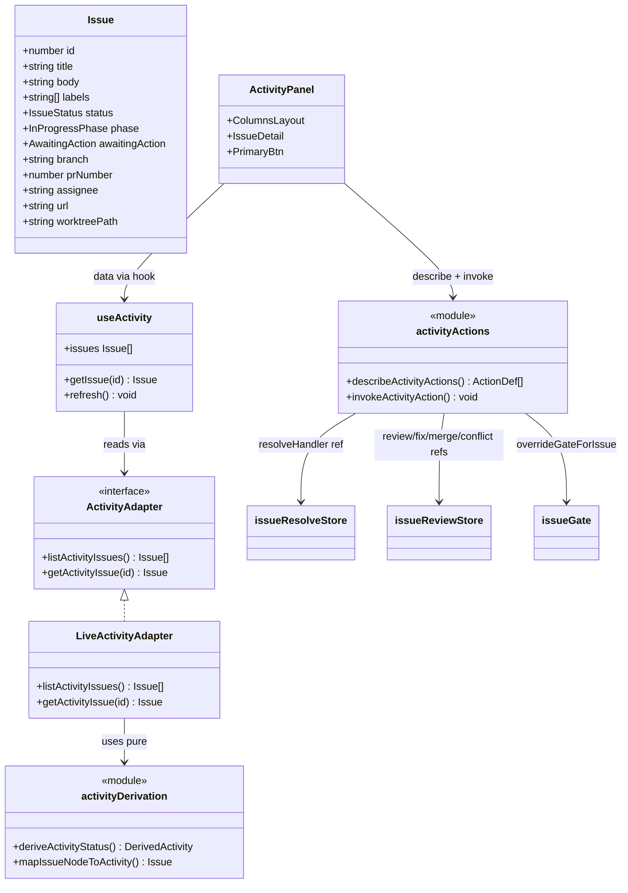
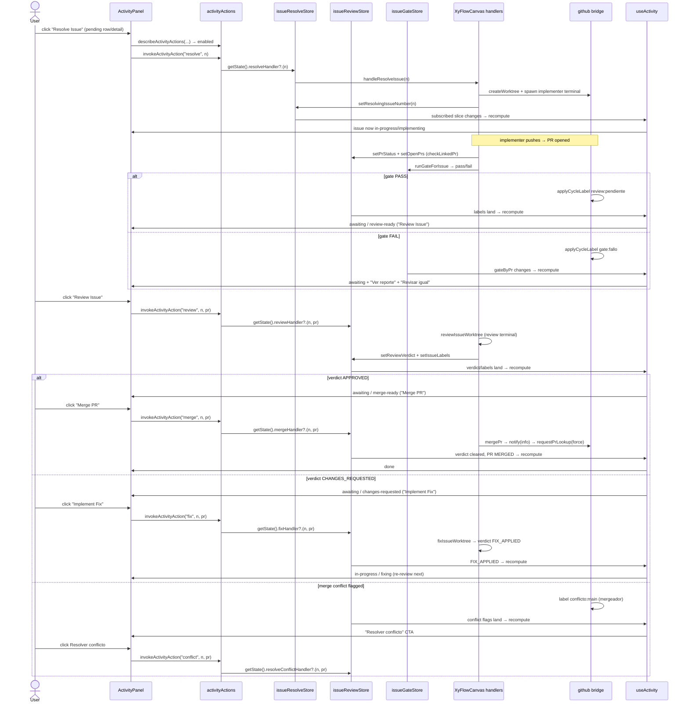
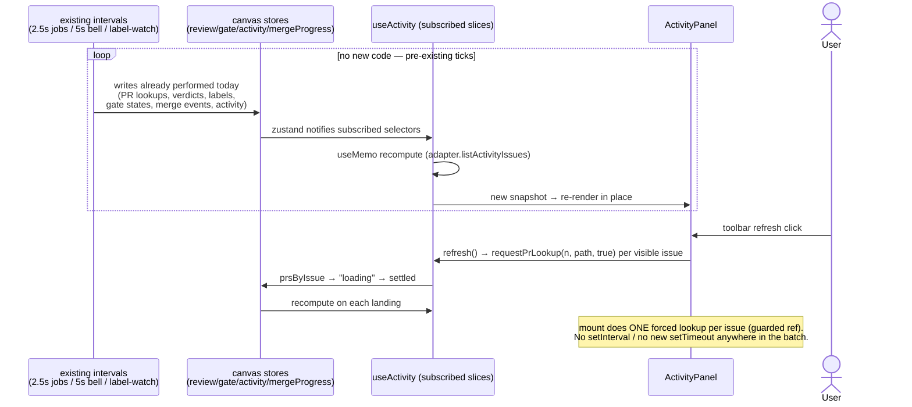
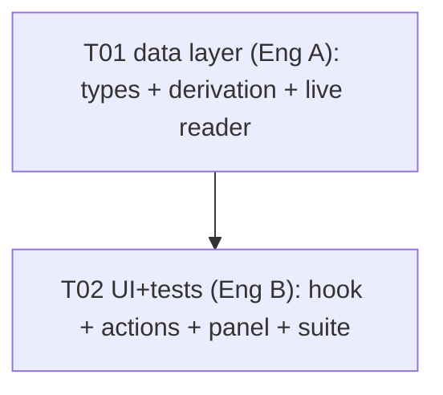

# Activity (warpPanel) — FINAL Plan (single batch, no carry-overs)

Status: DEFINITIVE. Executed whole in one batch. Nothing progressive, nothing deferred.
Scope: wire the Activity section of the warpPanel to the FULL existing Warp issue flow
(resolve / review / fix / merge / resolve-conflict + quality gate + gate override +
merge progress + notifications) with real-time updates and zero new intervals.

Decisions in force (read first):
`software-warppanel/DESIGN-warppanel.md` (adapter seam, components never fetch,
mock for tests only) + `software-warppanel/QA-warppanel-report.md` Rounds 1–5
(liveIssues precedent: canvas stores are the only source, drawer calls handlers
via stores, honest-empty when the canvas is empty).

Global prohibitions for this batch (FAIL if violated):
- NEVER touch the daemon (port 17680), restart/kill anything, or run repo
  `pnpm dev` / `pnpm build` / `taskkill`. All live checks run against the
  user-raised renderer (`http://localhost:5173/`, probe with `-TimeoutSec 15`).
- NEVER add a dependency to `package.json`. Required-packages list is empty.
- Every command below carries an explicit timeout. Every file write is UTF-8
  (PowerShell writes MUST pass `-Encoding utf8`).

---

## 1. Exact scope (what Activity sees and what it operates)

### 1.1 What Activity SHOWS (read model)

Activity renders the issues that are ON the canvas (`useIssueStore`) through the
Warp workflow lens — the same derivation family as `liveIssues.ts`, projected
onto the Figma `Issue` shape (`pending | in-progress | awaiting | done` +
`phase` + `awaitingAction`):

| Activity status | Meaning (first match wins, §3 table A1–A9) |
|---|---|
| `pending` | Fresh canvas issue. No PR, no verdict, no active operation. |
| `in-progress / implementing` | Resolve or review terminal running for the issue (no verdict yet). |
| `in-progress / reviewing` | Review terminal running with a verdict cycle started, or quality gate running on the primary PR. |
| `in-progress / fixing` | Fix terminal running, or `FIX_APPLIED` verdict settled (fix landed, awaiting re-review). |
| `awaiting / review-ready` | Implementation done, PR OPEN with `review:pendiente` settled (or brand-new PR without a cycle label). User must press Review. |
| `awaiting / changes-requested` | Effective label `review:comentado`. User must press Implement Fix. |
| `awaiting / merge-ready` | Effective label `review:aprobado` on an OPEN PR. User may press Merge. |
| `done` | Linked PR is MERGED (or bulk-merge reported it merged), or the issue state is CLOSED. NEVER invented otherwise. |

Per-issue enrichment (all honest, never fabricated):
- `branch`: primary open PR `headRefName` when known, else `issue-{n}` while a
  resolve is active for the issue, else absent.
- `prNumber`: primary open PR number when known, else absent.
- `assignee`: `opencode-agent` while resolving/fixing is active;
  `reviewer-agent` while reviewing is active or the issue awaits
  review/merge; else absent.
- `phaseStarted`: timestamp of the latest local activity entry for
  (repo, issue) formatted `YYYY-MM-DD HH:mm`; fallback = node `updatedAt`.
- `labels`: node label names. `createdAt/updatedAt`: node values.
- `url` / `worktreePath` (new optional fields, §3): node values when present.
- Order inside each column: descending by issue number (newest first),
  same precedent as `liveIssues.ts:405`.

### 1.2 What Activity OPERATES (write model — zero duplication)

Every CTA in Activity invokes the EXACT handler refs the canvas card uses,
via the stores (same pattern as `IssueDrawer.tsx`, QA Round 5 S3):

| Activity CTA (Figma English label kept) | Invokes | Gate |
|---|---|---|
| `Resolve Issue` (pending) | `useIssueResolveStore.getState().resolveHandler?.(n)` | Disabled while ANY op is active globally. Busy label `Resolve Issue…` on `resolvingIssueNumber === n`. |
| `View Agent` (in-progress) | No-op navigation placeholder (Figma fidelity). No handler, no fetch. | Never disabled. |
| `Review Issue` (awaiting review-ready) | `useIssueReviewStore.getState().reviewHandler?.(n, pr?)` | Disabled when reviewing/fixing/merging/conflict-resolving active, no PR, gate-fail, or gate running. Titles mirror the canvas card. |
| `Implement Fix` (awaiting changes-requested) | `...fixHandler?.(n, pr?)` | Same busy exclusion + effective-label gate (`review:comentado` only). |
| `Merge PR` (awaiting merge-ready) | `...mergeHandler?.(n, pr?)` | Only when effective `review:aprobado` + PR OPEN. Busy label `Merge PR…`. |
| `Resolver conflicto` badge-row (when `conflicto:main`) | `...resolveConflictHandler?.(n, pr?)` | Only when the per-PR conflict flag is set. |
| `Ver reporte` (when `gate:fallo`) | On-demand `window.termcanvas.fs.readFile(reportPath)` (same bridge as `IssueNode.tsx:124-136`). | Read-only view, never blocks. |
| `Revisar igual` (when `gate:fallo`) | `overrideGateForIssue({repoPath, issueNumber, prNumber})` from `src/canvas/issueGate.ts`, then `reviewHandler?.(n, pr)`. | Manual escape, same as canvas. |
| `GitHub` (detail footer) | `openIssueInGitHub(issue.url)` (shared helper from `KanbanBoard.tsx:48-51`). No-op without URL. | Never disabled. |
| Toolbar refresh (existing `IconRefresh` button) | `refresh()`: force PR re-lookup for every visible issue (`requestPrLookup(n, path, true)`) + local tick. No fetch, no IPC in the panel. | Spinner bound to `isFetchingIssues` + local tick. |

Merge progress: the detail pane shows a COMPACT inline block (max 6 log lines +
per-PR dots) derived from the existing `mergeProgress` slice when it references
the issue's PRs. No new subscription, no new component, no import of the canvas
panel — text-only reuse of the same store event stream
(`applyMergeProgressEvent`, `XyFlowCanvas.tsx:1557-1562`).

### 1.3 Real-time behavior (ZERO new intervals)

- Instant path (no polling at all): `useActivity` subscribes to the canvas
  store slices (§3). Every write the canvas flow already performs (resolve /
  review / fix / merge / conflict busy flags, PR lookups, verdicts, labels,
  conflicts, gate states, merge-progress events, activity log, issue sync)
  re-renders Activity synchronously.
- Freshness path (existing intervals only): the stores Activity reads are
  already kept fresh by intervals this batch does NOT touch —
  factory jobs `2.5s` (`useWorkItemsPolling.ts:11`), factory notifications `5s`
  (`notificationsUi.ts:51`), and the label-watch polls in the terminal runtime
  (`terminalRuntimeStore.ts:2258-2263` → `runGateForIssue`). Activity adds
  ZERO `setInterval` (grep-enforced) and ZERO new `setTimeout` (the pre-existing
  `DETAIL_MS` exit timer stays untouched).
- Mount path: one forced PR lookup per visible issue on first mount
  (guarded ref, same as `IssueNode.tsx:189-197` and `IssueDrawer.tsx:435-442`).
- Manual path: toolbar refresh forces re-lookup (force=true) for visible issues.

### 1.4 Explicit non-goals (decisions, not gaps — see §8)

Activity does NOT show factory jobs/states (they stay in FactoryLab), does NOT
create toasts (the global `NotificationsBell` 5s poll + handler `notify()` calls
already cover that), does NOT change issue status via dropdown (session
overrides stay Kanban-only), and does NOT fetch anything from GitHub
(the canvas `fetchIssues` hydration stays the single writer).

---

## 2. Closed file list (outside = FAIL)

New files (4):

1. `src/features/warpPanel/adapters/activityDerivation.ts` — pure derivation:
   `deriveActivityStatus` (table A1–A9) + `mapIssueNodeToActivity` +
   `branchForIssue` / `assigneeForIssue` / `phaseStartedForIssue`. Zero zustand,
   zero IPC, never throws. Imports pure helpers only (`effectiveReviewLabel`,
   `canonicalReviewLabel` from `src/canvas/reviewVerdict.ts`;
   `normalizeLabels`, `isValidIssueNumber` from `./liveIssues`).
2. `src/features/warpPanel/adapters/liveActivity.ts` — `LiveActivityAdapter
   implements ActivityAdapter`. Thin reader over `getState()` snapshots
   (same `defaultDeps` shape as `liveIssues.ts:113-192` + activity map for
   `phaseStarted`). No fetch, no writes. Type-only import of the review
   snapshot types from `./liveIssues` (no logic copy beyond the documented
   snapshot builder, §7).
3. `src/features/warpPanel/components/activityActions.ts` — CTA state machine:
   pure `describeActivityActions(...)` (labels incl. busy `…` variants,
   enabled flags, disabled titles mirroring the canvas card) + the SINGLE
   `invokeActivityAction(kind, issueNumber, prNumber?, deps?)` that touches
   handler refs / `overrideGateForIssue` / `fs.readFile`. Only place allowed
   to reference handler names as calls (S3 grep target).
4. `tests/warp-live-activity.test.ts` — offline unit suite (≥20 tests):
   derivation table, mapping honesty, guard matrix, invoke wiring with fake
   handlers. `node:test`, injected fakes, zero network, zero daemon.

Modified files (3):

5. `src/features/warpPanel/adapters/types.ts` — `ActivityAdapter` keeps its two
   sync methods (seam stable); doc block extended to the live source
   (canvas stores, sync read, never throws, never fetches).
6. `src/features/warpPanel/types.ts` — `Issue` gains two OPTIONAL fields only:
   `url?: string` (GitHub button, `KanbanIssue.url` precedent, Round 3 S4) and
   `worktreePath?: string` (per-issue repo path for forced re-lookup,
   `KanbanIssue.worktreePath` precedent). No other change.
7. `src/features/warpPanel/hooks/useActivity.ts` — defaults to
   `liveActivityAdapter`; subscribes to §3 slices; `useMemo` snapshot;
   `refresh()` = force re-lookup per visible issue + local tick (same
   `overrideTick` pattern as `useIssues.ts:66,101-106`).
8. `src/features/warpPanel/components/ActivityPanel.tsx` — wire existing
   buttons to `describe` + `invoke` (rows + detail footer + gate rows +
   compact merge-progress block + GitHub button). Layout, tokens, timings,
   animation, a11y attributes unchanged (Figma fidelity).

Totals: 4 new + 4 modified = **8 files**. Anything else touched = FAIL
(no `package.json`, no configs, no canvas files, no factoryLab files,
no `KanbanBoard.tsx`, no `WarpPanelShell.tsx`, no `mockActivity.ts`
— the mock stays byte-identical for test injection only).

---

## 3. Contracts

### 3.1 `ActivityAdapter` (live extension — seam stable)

```ts
// adapters/types.ts — methods UNCHANGED, doc extended:
/** Activity timeline (Track B). Backs ActivityPanel. */
export interface ActivityAdapter {
  /**
   * LIVE: synchronous read over canvas stores
   * (useIssueStore + useIssueReviewStore + useIssueResolveStore +
   *  useIssueGateStore + useIssueActivityStore + useProjectStore).
   * The canvas hydrates useIssueStore via fetchIssues; this adapter NEVER
   * fetches, NEVER writes, NEVER throws (malformed nodes are dropped,
   * unknown fields stay honest-empty).
   */
  listActivityIssues(): Issue[];
  getActivityIssue(id: number): Issue | undefined;
}
```

```ts
// adapters/activityDerivation.ts — pure, exported for tests:
export interface DerivedActivity {
  status: IssueStatus;
  phase?: InProgressPhase;
  awaitingAction?: AwaitingAction;
}
export function deriveActivityStatus(
  issueNumber: number,
  review: LiveReviewSnapshot,      // type-only import from ./liveIssues
  resolvingIssueNumber: number | null,
  issueState?: string | null,
): DerivedActivity;
export function mapIssueNodeToActivity(
  node: IssueNodeData,
  derived: DerivedActivity,
  review?: LiveReviewSnapshot,
  projectName?: string,
  activityEntries?: IssueActivityEntry[],
): Issue; // Issue with new optional url/worktreePath
```

Derivation table (first match wins — implements §1.1):

| # | Condition | status / phase / awaitingAction |
|---|---|---|
| A1 | PR state MERGED, or PR in `mergedPrNumbers`, or node state CLOSED | `done` |
| A2 | `fixingIssueNumber === n`, or effective `review:fix-aplicado` | `in-progress / fixing` |
| A3 | `reviewingIssueNumber === n`, or gate `running` on primary PR | `in-progress / reviewing` |
| A4 | `resolvingIssueNumber === n`, or `reviewingIssueNumber === n` with no verdict yet | `in-progress / implementing` |
| A5 | effective `review:aprobado` and PR OPEN | `awaiting / merge-ready` |
| A6 | effective `review:comentado` | `awaiting / changes-requested` |
| A7 | effective `review:pendiente`, or PR OPEN with no cycle label and no verdict | `awaiting / review-ready` |
| A8 | `mergingIssueNumber === n` or `resolvingConflictIssueNumber === n` | `in-progress` (phase kept from A2–A4 derivation; busy CTA labels win) |
| A9 | else (fresh OPEN issue, no PR, no verdict, no active op) | `pending` |

Notes: `effective` = `effectiveReviewLabel(labelsByPr[n][pr] ?? labelsByIssue[n] ?? [], verdictByPr[n][pr] ?? verdictByIssue[n])`
(labels win over in-memory verdict — `reviewVerdict.ts:82-95`). `conflicto:main`
and `gate:fallo` do NOT change the row; they add badges + CTAs (drawer parity).
Legacy nodes without state fall through (never inferred closed).



### 3.2 `useActivity` subscriptions (no loops — `useIssues.ts:33-90` pattern)

```ts
// useActivity.ts — every selector returns a primitive or a STABLE store ref.
// Fresh arrays/objects are derived INSIDE useMemo/render, never in selectors
// (IssueNode.tsx:82-99 pattern — a selector returning `map[n] ?? []` would
// re-render forever).
const issueVersion = useIssueStore((s) => s.issueVersion);                       // number
const prsByIssue = useIssueReviewStore((s) => s.prsByIssue);                     // stable map
const openPrsByIssue = useIssueReviewStore((s) => s.openPrsByIssue);             // stable map
const verdictByIssue = useIssueReviewStore((s) => s.verdictByIssue);             // stable map
const verdictByPr = useIssueReviewStore((s) => s.verdictByPr);                   // stable map
const labelsByPr = useIssueReviewStore((s) => s.labelsByPr);                     // stable map
const labelsByIssue = useIssueReviewStore((s) => s.labelsByIssue);               // stable map
const conflictByPr = useIssueReviewStore((s) => s.conflictByPr);                 // stable map
const conflictByIssue = useIssueReviewStore((s) => s.conflictByIssue);           // stable map
const reviewingIssueNumber = useIssueReviewStore((s) => s.reviewingIssueNumber); // primitive
const fixingIssueNumber = useIssueReviewStore((s) => s.fixingIssueNumber);       // primitive
const mergingIssueNumber = useIssueReviewStore((s) => s.mergingIssueNumber);     // primitive
const resolvingConflictIssueNumber = useIssueReviewStore((s) => s.resolvingConflictIssueNumber); // primitive
const mergeProgress = useIssueReviewStore((s) => s.mergeProgress);               // stable ref|null
const resolvingIssueNumber = useIssueResolveStore((s) => s.resolvingIssueNumber);// primitive
const gateByPr = useIssueGateStore((s) => s.gateByPr);                           // stable map
const activityByRepo = useIssueActivityStore((s) => s.activityByRepo);           // stable map
const projectNamesKey = useProjectStore((s) => s.projects.map((p) => `${p.id}:${p.name}`).join("|")); // primitive
const isFetchingIssues = useIssueSyncStore((s) => s.isFetchingIssues);           // primitive (spinner)
const [refreshTick, setRefreshTick] = useState(0);                               // local only
const issues = useMemo(() => adapter.listActivityIssues(),
  [adapter, issueVersion, prsByIssue, openPrsByIssue, verdictByIssue, verdictByPr,
   labelsByPr, labelsByIssue, conflictByPr, conflictByIssue, reviewingIssueNumber,
   fixingIssueNumber, mergingIssueNumber, resolvingConflictIssueNumber,
   mergeProgress, resolvingIssueNumber, gateByPr, activityByRepo,
   projectNamesKey, isFetchingIssues, refreshTick]);
const refresh = useCallback(() => {
  const st = useIssueReviewStore.getState();
  for (const i of issues) st.requestPrLookup(i.id, i.worktreePath || undefined, true);
  setRefreshTick((t) => t + 1);
}, [issues]);
```

Rules: rendering NEVER writes a store (except handler-ref invocation on click
and the `refreshTick` local). `activityActions.invokeActivityAction` is the
ONLY code path from the panel into handler refs. Components import NOTHING
from `adapters/*` (only the hook does — DESIGN §5). Allowed bridges in
`ActivityPanel.tsx`/`activityActions.ts` (and nothing else):
`window.termcanvas.github.openUrl` (via `openIssueInGitHub`) and
`window.termcanvas.fs.readFile` (gate report, on demand). Zero `fetch`,
zero other IPC.

### 3.3 `activityActions` contract

```ts
export type ActivityActionKind =
  | "resolve" | "review" | "fix" | "merge" | "conflict"
  | "override-gate" | "view-report" | "github" | "session";
export interface ActivityActionDef {
  kind: ActivityActionKind;
  label: string;      // Figma English, busy variants append "…" (canvas precedent)
  enabled: boolean;
  title?: string;     // disabled/busy reason — canvas Spanish strings reused verbatim
}
export function describeActivityActions(args: {
  issueNumber: number; prNumber: number | null; prState: string;
  effective: string | null; conflicted: boolean;
  gateStatus: "idle" | "running" | "pass" | "fail";
  busy: { resolving: boolean; reviewing: boolean; fixing: boolean;
          merging: boolean; resolvingConflict: boolean; anyActive: boolean };
}): ActivityActionDef[];
export async function invokeActivityAction(
  kind: ActivityActionKind,
  issueNumber: number, prNumber?: number,
  deps?: { stores?: unknown; fsRead?: unknown },  // injected fakes in tests
): Promise<void>;
```

Busy exclusion mirrors the canvas exactly: resolve refuses while
`resolvingIssueNumber !== null`; review/fix refuse while resolving/reviewing/
fixing active; merge refuses while another merge runs; conflict refuses while
any of the four is active (`XyFlowCanvas.tsx:1059-1061,1155-1157,1271-1277,1389`).

---

## 4. Flows (Mermaid)

### 4.1 Resolve an issue end-to-end from Activity (full Warp loop)



### 4.2 Real-time updates via EXISTING polls (zero new intervals)



---

## 5. Task list + writer matrix (2 engineers, ONE batch, zero overlap)

Only 2 tasks (density rule: each task ≥3 related files; layers, not files).
T01 is this batch's shared prerequisite (repo infra already exists — zero new
packages — so T01 = contracts + pure derivation + live reader). T02 consumes
ONLY the frozen §3 contract, so Eng B builds in parallel and integrates on
T01 landing (same pattern as DESIGN §4 T02↔T03).

| Task | Name | Files (write ownership — each file ONE writer) | Depends | Priority | Owner |
|---|---|---|---|---|---|
| T01 | Activity live data layer | `adapters/types.ts` (mod, doc), `adapters/activityDerivation.ts` (new), `adapters/liveActivity.ts` (new) | — | P0 | Eng A |
| T02 | Activity reactivity + CTAs + tests | `hooks/useActivity.ts` (mod), `components/activityActions.ts` (new), `components/ActivityPanel.tsx` (mod), `tests/warp-live-activity.test.ts` (new) | T01 | P0 | Eng B |

Writer-file matrix (X = writes; R = reads-only reference):

| File | Eng A (T01) | Eng B (T02) |
|---|---|---|
| `adapters/types.ts` | X | R |
| `adapters/activityDerivation.ts` | X | R |
| `adapters/liveActivity.ts` | X | R |
| `hooks/useActivity.ts` | — | X |
| `components/activityActions.ts` | — | X |
| `components/ActivityPanel.tsx` | — | X |
| `tests/warp-live-activity.test.ts` | — | X |
| `canvas/*`, `stores/*`, `factoryLab/*`, `KanbanBoard.tsx`, `WarpPanelShell.tsx`, `mockActivity.ts` | R (frozen) | R (frozen) |

Overlap cells: none. Shared read-only refs: `liveIssues.ts` (snapshot shape,
`normalizeLabels`, `isValidIssueNumber`), `reviewVerdict.ts`
(`effectiveReviewLabel`, label constants), `issueGate.ts`
(`overrideGateForIssue`), `KanbanBoard.tsx` (`openIssueInGitHub`,
`repoSlugFromUrl`, `issueHeaderLabel`), `XyFlowCanvas.tsx` handler semantics,
`IssueNode.tsx`/`IssueDrawer.tsx` guard strings. Neither task modifies them.



### T01 — Activity live data layer (Eng A, P0, 3 files)

1. `adapters/types.ts`: extend the `ActivityAdapter` doc block to the live
   source (§3.1). No signature change.
2. `adapters/activityDerivation.ts`: implement table A1–A9 + mapping helpers
   (§3.1). Pure, never throws, descending sort by id, malformed nodes dropped.
3. `adapters/liveActivity.ts`: `LiveActivityAdapter` + `defaultDeps` over
   `getState()` (issue nodes, review snapshot incl. gate slice +
   `mergedPrNumbers`, resolving number, project names, activity map for
   `phaseStarted`). Export singleton `liveActivityAdapter`.
   Done when: `tsc` clean; derivation importable by T02 with the §3 signatures
   byte-exact.

### T02 — Reactivity + CTAs + tests (Eng B, P0, needs T01, 4 files)

1. `hooks/useActivity.ts`: default adapter `liveActivityAdapter` (mock stays
   available SOLELY as the injected test double); §3.2 subscriptions +
   `useMemo` + `refresh()` (force re-lookup + tick). No interval, no fetch.
2. `components/activityActions.ts`: `describe` + `invoke` (§3.3). Zero handler
   DEFINITIONS (calls by reference only — S3 grep).
3. `components/ActivityPanel.tsx`: wire rows + `IssueDetail` footer + gate rows
   + compact merge-progress block + GitHub button through `describe`/`invoke`.
   No layout/token/timing/a11y change. `refresh` button keeps its place and
   calls the new `refresh()`.
4. `tests/warp-live-activity.test.ts`: ≥20 offline tests — A1–A9 rows (9),
   mapping honesty incl. branch/assignee/phaseStarted/url/worktreePath + drop
   of malformed nodes (6), guard matrix incl. busy exclusion + gate-fail +
   conflict (5+), invoke wiring with injected fake handlers (2+).
   Done when: suite green + §6 greps green + screenshots A1–A3 captured.

---

## 6. DONE criteria (verifiable) + FAIL → rollback

All commands carry explicit timeouts. From the repo root, PowerShell:

```powershell
# D1 — types clean (timeout 180s)
npx tsc --noEmit --pretty false
# expect: EXIT 0, zero errors from warpPanel files
```

```powershell
# D2 — new suite green (timeout 120s) + no regressions in the sibling suite
npx tsx --test tests/warp-live-activity.test.ts
# expect: ≥20 pass, 0 fail
npx tsx --test tests/warp-live-issues.test.ts
# expect: 35 pass, 0 fail (unchanged)
```

```powershell
# D3 — zero new network/IPC in the panel surface (timeout 60s)
rg -n "fetch\(|XMLHttpRequest|axios|Octokit|/repos/|api\.github|graphql" src/features/warpPanel/components/ src/features/warpPanel/hooks/ src/features/warpPanel/adapters/
# expect: 0 hits (comment-only hits allowed if they name the canvas hydrator)
rg -n "window\.termcanvas" src/features/warpPanel/components/ActivityPanel.tsx src/features/warpPanel/components/activityActions.ts
# expect: ONLY github.openUrl (via openIssueInGitHub) + fs.readFile (gate report)
```

```powershell
# D4 — zero duplicated handlers (timeout 60s)
rg -n "(const|function|let|var)\s+(resolveHandler|reviewHandler|fixHandler|mergeHandler|resolveConflictHandler|prLookupHandler)" src/features/warpPanel/components/ActivityPanel.tsx src/features/warpPanel/components/activityActions.ts src/features/warpPanel/hooks/useActivity.ts src/features/warpPanel/adapters/liveActivity.ts src/features/warpPanel/adapters/activityDerivation.ts
# expect: 0 definitions (calls by reference + requestPrLookup only)
```

```powershell
# D5 — zero new intervals; timers unchanged (timeout 60s)
rg -n "setInterval" src/features/warpPanel/
# expect: 0 hits
rg -n "setTimeout" src/features/warpPanel/components/ActivityPanel.tsx
# expect: ONLY the pre-existing closeTimer lines (414,435-460 region)
```

```powershell
# D6 — components stay adapter-free (timeout 60s)
rg -n "from.*adapters|import.*adapters" src/features/warpPanel/components/
# expect: 0 import statements (comment-only allowed)
```

Live screenshots (user renderer up, probe first —
`Invoke-WebRequest http://localhost:5173/ -TimeoutSec 15` must return 200;
NEVER start it yourself):

| # | Shot | Pass bar |
|---|---|---|
| A1 | `software-warppanel/A1-activity-live.png` — Activity columns live | Column counts equal the canvas issue set per §1.1; pills (`AGENT WORKING`, `YOUR TURN`, phase/awaiting pills) match derivation; 0 console errors. Honest-empty (4×0) PASSES iff the canvas holds 0 issues (R3–R5 precedent — DOM `cardCount=0` + canvas `0 projects` in evidence). |
| A2 | `software-warppanel/A2-activity-detail-cta.png` — open detail of one live issue | Status pill, phase timeline / awaiting context, branch-PR-agent meta, footer CTA correct for its row (enabled/disabled + title per §3.3). N/A-empty when A1 is empty (no click fabricated). |
| A3 | `software-warppanel/A3-activity-narrow-700px.png` — 700px wide | No overlap, no page-level horizontal break (V8 precedent). |

FAIL → rollback (any D-check red, any invented datum, any file outside §2,
any new interval/fetch/dependency, any console error attributable to Warp):

```powershell
git checkout -- src/features/warpPanel/adapters/types.ts src/features/warpPanel/types.ts src/features/warpPanel/hooks/useActivity.ts src/features/warpPanel/components/ActivityPanel.tsx
Remove-Item -LiteralPath "src/features/warpPanel/adapters/activityDerivation.ts","src/features/warpPanel/adapters/liveActivity.ts","src/features/warpPanel/components/activityActions.ts","tests/warp-live-activity.test.ts" -Force
npx tsc --noEmit --pretty false
# expect: EXIT 0 (pre-batch state restored; mock-backed panel intact)
```

---

## 7. Reuse vs new (no duplication)

REUSED as-is (import, never copy):

- Handler refs: `resolveHandler` (`issueResolveStore`), `review/fix/merge/
  resolveConflict/prLookup` (`issueReviewStore`) — called via `getState()`,
  registered/unregistered solely by `XyFlowCanvas.tsx:1051,1566-1577`.
- Busy flags: `resolvingIssueNumber`, `reviewing/fixing/merging/
  resolvingConflictIssueNumber`, `mergingApprovedPrs` — read, never set
  (setters stay canvas-owned).
- Verdict/label engine: `effectiveReviewLabel`, `canonicalReviewLabel`,
  all six `REVIEW_LABEL_*` constants (`reviewVerdict.ts`).
- Gate: `runGateForIssue` (never called by the panel — the watcher owns it),
  `overrideGateForIssue` (called by `invoke("override-gate")`), `gateByPr`
  slice read, report via `fs.readFile` on demand.
- Activity log: `recordActivity` stays canvas-owned (handlers call it,
  `XyFlowCanvas.tsx:992-994,1091-1093,1212-1214,1418-1420`); the panel only
  READS `activityByRepo` for `phaseStarted`.
- Merge progress: `mergeProgress` slice + `applyMergeProgressEvent` stream
  read-only; compact text render in the panel (no canvas import).
- GitHub open: `openIssueInGitHub`, `repoSlugFromUrl`, `issueHeaderLabel`
  (`KanbanBoard.tsx:48-119`).
- Pure Siv: `normalizeLabels`, `isValidIssueNumber` (`liveIssues.ts`);
  review-snapshot TYPES (`LiveReviewSnapshot`, type-only import).
- Notifications: global `NotificationsBell` (5s) + handler `notify()` toasts —
  zero panel code.
- Mock adapter (`mockActivity.ts`): byte-identical; survives ONLY as the
  injected test double (`useActivity(adapter)` param default flips to live).

NEW in this batch (why it cannot be reused):

- `activityDerivation.ts`: the `IssueStatus/phase/awaitingAction` projection
  does not exist anywhere (Kanban derives `KanbanStatus`; Activity needs the
  Figma workflow projection A1–A9).
- `liveActivity.ts`: the store→`Issue[]` reader does not exist (mock is static).
- `activityActions.ts`: the CTA guard matrix for the Figma button set does not
  exist (canvas guards live inline in `IssueNode.tsx` JSX; the panel needs them
  as a testable unit without importing canvas JSX).
- `useActivity.ts` reactivity + `ActivityPanel.tsx` wiring: the current hook is
  `useState`-over-mock (`useActivity.ts:19-21`) and the current buttons are
  dead (no `onClick` anywhere in `PrimaryBtn`/`ActionBtn`).
- `Issue.url` / `Issue.worktreePath` optionals: genuinely absent fields with
  `KanbanIssue` precedent.
- `tests/warp-live-activity.test.ts`: no coverage exists for any of the above.

Accepted micro-duplication (documented, not drift): the review-snapshot
BUILDER (~40 lines reading `getState()` into `LiveReviewSnapshot`) is
re-implemented in `liveActivity.ts` with a pointer comment to
`liveIssues.ts:128-185`, because no builder is exported and refactoring
`liveIssues.ts` is outside the closed list (§2). Types are imported, never
re-declared.

---

## 8. Open items: ZERO (explicit decisions, no carry-overs)

- D1 — Factory jobs in Activity? NO. `factoryClient` job/spec/triage/verify
  surfaces stay in FactoryLab. Activity covers the canvas issue Warp flow
  only. Rationale: two sources of truth side-by-side would desync; the issue
  flow already reflects factory work through PRs/labels/activity.
- D2 — New polling? NO. Zero `setInterval`, zero new `setTimeout` (§1.3, D5
  grep). Freshness comes from existing store writes + existing global ticks.
- D3 — `branch` without a PR? `issue-{n}` while resolving is active, else
  absent (never guessed from worktree folder names).
- D4 — `assignee` values? Deterministic role strings (`opencode-agent` /
  `reviewer-agent`, mock precedent) from live busy/awaiting state — a role
  label, not a person lookup (no author fetch exists for agents).
- D5 — `phaseStarted`? Latest local activity entry, else node `updatedAt`
  (never `Date.now()` at render — that would lie and break memo stability).
- D6 — Merge progress UI? Compact inline text block (≤6 lines), read-only,
  only when `mergeProgress` references the issue's PRs. No canvas import, no
  new slice, no progress-bar chrome.
- D7 — Status dropdown / drag in Activity? NO (unchanged Figma behavior —
  Activity never had them; session overrides stay Kanban-only via
  `LiveIssuesAdapter.statusOverrides`).
- D8 — Handler failure semantics? Best-effort + honest disabled state:
  failed IPC surfaces through the existing handler `notify()` toasts; the
  panel never invents error banners and never retries (single invoke per
  click; global busy flags already debounce double-clicks).
- D9 — Empty canvas? Honest-empty panel (columns render 0s + `No issues`),
  PASS per R3–R5 precedent — never seeded, never screenshotted around.
- D10 — Mock removal? NO. `mockActivity.ts` stays byte-identical as the
  offline test double; production default flips to live (same flip
  `useIssues.ts:29` already made).
