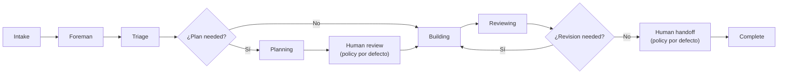
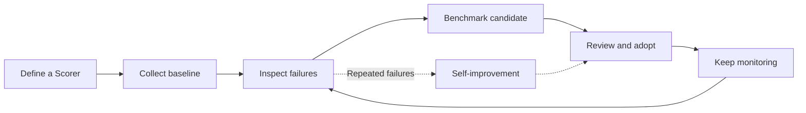
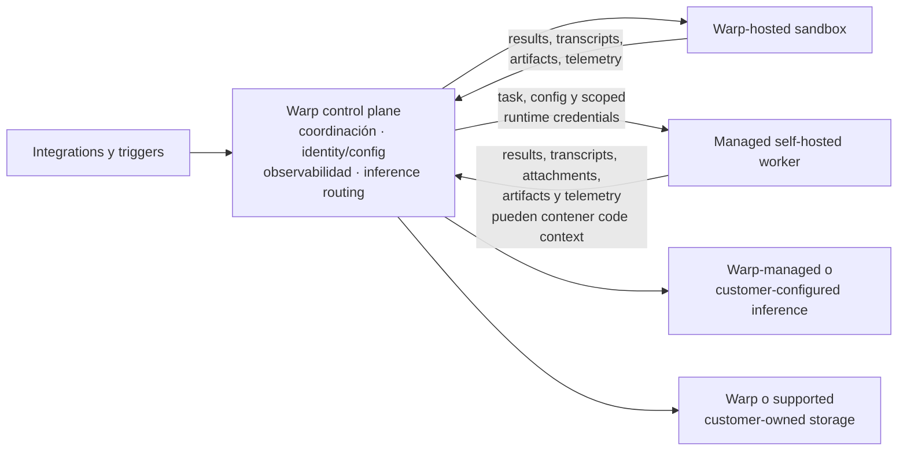

# Warp Factories — Documento Maestro

> Fuente única de verdad para replicar el ecosistema Warp Factories en TermCanvas Web.
> Basado en la documentación oficial de `https://docs.warp.dev/factories/` (Early Access, agosto 2026 — launch 2026-08-18, última actualización docs 2026-08-28).
> Early Access: por team, requiere credits; qualifying orgs $10k. Warp coordina desde `build.warp.dev`. 700k+ devs en Warp.
> Este documento describe **exclusivamente Warp Factories y su funcionamiento**. No incluye implementación actual ni flujos propios.

---

## Índice

1. [Visión General y Propuesta de Valor](#1-visión-general-y-propuesta-de-valor)
2. [Conceptos y Entidades Core](#2-conceptos-y-entidades-core)
3. [El Ciclo de Vida del Work Item (SDLC)](#3-el-ciclo-de-vida-del-work-item-sdlc)
4. [Agentes de Fábrica](#4-agentes-de-fábrica)
5. [Skills](#5-skills)
6. [Automations (Triggers y Filtros)](#6-automations-triggers-y-filtros)
7. [Definitions as Code (Factory as Code)](#7-definitions-as-code-factory-as-code)
8. [Runners e Infraestructura de Ejecución](#8-runners-e-infraestructura-de-ejecución)
9. [Integraciones](#9-integraciones)
10. [Factory Dashboard y Observabilidad](#10-factory-dashboard-y-observabilidad)
11. [Measure and Improve (Scorers, Benchmarks, Self-Improvement)](#11-measure-and-improve-scorers-benchmarks-self-improvement)
12. [Factory MCP (Model Context Protocol)](#12-factory-mcp-model-context-protocol)
13. [Infraestructura y Seguridad](#13-infraestructura-y-seguridad)
14. [Sizing y Deployment](#14-sizing-y-deployment)
15. [Glosario](#15-glosario)
16. [Referencias y Ejemplos Oficiales](#16-referencias-y-ejemplos-oficiales)
17. [Checklist de Replicación (para TermCanvas Web)](#17-checklist-de-replicación-para-termcanvas-web)
18. [Troubleshooting](#18-troubleshooting)
19. [Factory API — Referencia Detallada](#19-factory-api--referencia-detallada)

---

## 1. Visión General y Propuesta de Valor

### Qué es

**Warp Factories** es un producto de Warp (Early Access, launch 2026-08-18) que corre **software factories en la nube**: fleets coordinadas de agentes especializados que toman requests (bug reports, feature specs, escalaciones de soporte) y las convierten en un **stream de pull requests mergeables**, en lugar de un backlog que crece. Anunciado en `warp.dev/blog/open-infrastructure-for-building-a-software-factory` (2026-08-27) como *open infrastructure for building a software factory* con foco en AI sovereignty y Zero Data Retention.

Una **factory** es **una instancia desplegada** de ese patrón: conecta repositorios y herramientas de ingeniería a un equipo de agentes, infra de ejecución y un workflow medible. Cada factory aplica **una sola policy** a todas sus work sources. Para grupos de repos que necesitan policies distintas, se despliegan **factories separadas**.

### Problema que resuelve

Sin factory, cada dev usa su propia IA local (Copilot, Cursor, Claude Code, scripts sueltos): no hay visibilidad de costo/token por PR, no hay estandarización de tools/MCPs, la IA depende del entorno frágil de la laptop y no hay medición.

Con factory, el trabajo se mueve a **sandboxes en la nube**, con workflow trazable, medición y mejora continua.

### Qué entrega el producto

- **Agentes especialistas coordinados**: foreman + triage/spec/implement/review (+ custom). El foreman enruta y skipea stages que no aplican.
- **Definitions as Code**: archivos versionados en Git (`factory.yaml`, `agents/`, `automations/`, `runners/`, `scorers/`, `skills/`) con history, review y rollback.
- **Integraciones + Factory MCP**: Slack, GitHub, GitLab, Linear, Jira, API directa, schedules y MCP bidireccional.
- **Model y harness por agente**: cada agente puede usar un modelo y harness distinto (Warp Agent, Claude Code, Codex, Gemini).
- **Measurement & self-improvement**: dashboard (work items, runs, costos, benchmarks), Scorers (juez LLM) y Self-improvement (failures recurrentes → PRs de mejora).
- **Control de infraestructura**: Warp-hosted o self-hosted execution, BYO inference, secrets scoping, customer-owned storage (S3/GCS) en Enterprise.

### Relación con otros productos Warp

| Producto | Relación |
|---|---|
| **Warp** (terminal interactiva) | Desarrollo local con agentes y code review. La factory corre independiente en la nube. |
| **Warp Agent** (harness) | Harness built-in de Warp (`oz`). Los agentes de factory pueden correr sobre él u otro harness soportado. |
| **Warp Agent CLI** | Corre Warp Agent en cualquier terminal e intercambia trabajo con una factory vía Factory MCP. |
| **Automation Platform** | Plataforma que provee cloud runs, runners, integrations, secrets, orquestación multi-agente y APIs. **Una factory ensambla esos primitivos en un workflow único.** |

La factory no reemplaza la plataforma; la ensambla. Un **cloud agent standalone** sigue siendo correcto para una tarea puntual o una automation de un solo trigger. La **factory** es para procesos standing, multi-stage, que se quieren enrutar, medir y mejorar en un solo lugar. Ver `platform/*` para los primitivos: `platform/overview`, `platform/runners`, `platform/orchestration`, `platform/secrets`, `platform/mcp`.

### Costo y acceso

- Early Access por team, requiere acceptance. Equipo necesita Warp team con credits.
- Usage-based **per agent run**; qualifying orgs **$10k** Early Access. Hosted compute, Warp-provided inference y platform services consumen **credits**; self-hosted mueve compute a tu infra y BYO inference a tu provider, pero platform services siempre consumen credits. Ver `support-and-community/plans-and-billing/platform-credits`.

---

## 2. Conceptos y Entidades Core

### Factory

Instancia individual de software factory, desplegada sobre infra de Warp Factories, conectada a repos y tools. Distinta de "Warp Factories" (producto) y de "foreman" (agente coordinador). Se **sizea por product surface, no por workflow**: agrupar repos que shippean juntos en una factory.

Ejemplos correctos de sizing:

- 1 factory para la app principal
- 1 factory para el marketing site
- 1 factory para data pipelines

Anti-patrón: partir los mismos repos en múltiples factories por equipo (frontend vs platform). Para especializar, **agregar agents y skills**. Ver `platform/software-factory/#sizing-a-factory`.

### Foreman

Agente coordinador dentro de una factory. **Es el único con el que habla el humano** (desde Slack, Linear, etc.). Despacha a los demás agentes y reporta de vuelta. **Cada factory tiene exactamente uno.**

- Tiene un **Foreman name** (`alias` en `factory.yaml`, campo `alias`, máx 60 chars: letras, números, espacios, `.` `_` `-`, único case-insensitive por workspace). Es el handle para `@-mencionar` en Slack/Linear. Setup por defecto lo copia del `name` de la factory, pero son dos cosas distintas. Visible en `Settings → Identity → Foreman name`.
- Enruta work entre agentes, pasa contexto, y **continúa conversaciones existentes** en lugar de crear nuevas (no se pierde contexto en revisions/follow-ups). Replies en mismo thread/issue/PR continúan el mismo work item, no duplican.
- Presenta el PR final con evidencia y marca el work item como `Complete` (handoff a humano, **no implica merge**).

### Work Item (también llamado Task en Factory MCP)

Una request individual que la factory actúa: issue, ticket, tarea disparada, PR, Factory MCP task. **Mantiene su identidad de intake a handoff**, por más agentes que contribuyan. Cada run de agente dentro de un work item es un **cloud agent run** ordinario, inspeccionable.

Estados visibles en el dashboard (Activity): `Triage` → `Planning` → `Building` → `Reviewing` → terminales `Complete` / `Cancelled`. Cada stage-run es inspeccionable.

### Run

Una ejecución individual de un agente. Un work item puede spannear varios runs a medida que distintos agentes lo toman. Inspeccionable con timeline, costo, tab de sub-agents si es orchestrator. `View session` abre shared agent session (steer en vivo si sandbox activo, luego transcript). Run pages **no incluyen chat input**.

### Agent

Ver §4. Cada agente tiene instrucciones (prompt durable), harness+modelo, runner, secrets, MCPs, y skills.

### Skill

Procedimiento reusable versionado (`SKILL.md`). Factory-wide o per-agent. Ver §5.

### Automation

Recurso que inicia runs desde un trigger y los enruta a un agente, con filtros. Ver §6.

### Runner

Definición de compute (OS, arch, image, shape) donde corre un agente. Ver §8. Distinto de **Environment** (workspace: repos, setupCommands, image) y **Host** (dónde ejecuta: `warp` vs self-hosted). Ver §8 y §13.

### Scorer / Benchmark / Self-Improvement

Ver §11.

```
                    ┌─────────────────────┐
  Slack/Linear  ──▶ │      Foreman        │ ──▶ Triage, Spec, Implement, Review
  GitHub/Jira       │  (único que habla   │     (+ custom agents)
  Factory MCP       │   con el humano)    │
                    └─────────────────────┘
                              │
                    Work Item (identity preservada)
                              │
                    Runs (cloud agent runs trazables)
```

---

## 3. El Ciclo de Vida del Work Item (SDLC)

### Flujo por defecto



**Intake**: entra por integración conectada, automation, run directo o Factory MCP. Conserva su source context. Repeated deliveries no duplican: reply continúa mismo work item.

**Triage**: investiga el request, reproduce el problema solo si la investigación no alcanza, reporta evidence, scope, complexity y open questions. El foreman **skipea este stage** cuando el request ya explica el problema y qué debe cambiar.

**Planning**: el spec agent define product behavior, technical constraints y validation criteria. Escribe product + technical specs en un **draft PR**. El foreman skipea este stage para cambios pequeños y bien entendidos.

**Building**: el implement agent **continúa el branch y draft PR del spec** (no empieza de cero). Hace el cambio de código, agrega tests, corre validación del repo y, si hay `computer use`, captura **evidencia visual** de cambios user-facing. Si review encuentra problemas, implement revisa. **Nunca mergea.**

**Reviewing**: review agent chequea requirements, conventions, tests, security y evidencia. Re-ejecuta o extiende validación si la evidencia es fina. Recomienda `accept`, `revise` o `ask human`. **Veredicto advisory** — no aprueba ni mergea el PR.

**Human Handoff**: la factory presenta el resultado, su evidencia y findings. Una persona decide qué pasa después.

**Complete / Cancelled**: terminal states. `Complete` = handoff a humano, no merge/deploy. Cancelled si alguien lo cancela.

> **Loop general Warp**: `triage → spec → implement → review → verify → ship → monitor` con checkpoints humanos en spec, code y product. Los default agents cubren triage→review; custom agents cubren el resto (`VERIFY` existe como `agentType` pero no es default).

### Dónde el humano mantiene control (por defecto)

| Decisión | Comportamiento default | Qué lo enforcea |
|---|---|---|
| **Spec approval** | Foreman pide aclaración y aprobación de cada spec antes de Building (si pasó por Planning) | Workflow policy en instrucciones del foreman (editable) |
| **Answering questions** | Cuando requirements son ambiguos o un review finding es ambiguo, el foreman pregunta en vez de adivinar | Idem |
| **Merging** | La factory abre el PR y hace handoff. **Si/cuándo mergea** es decisión del equipo | Branch protection + repo permissions (no instructions) |

> **Importante**: qué puede alcanzar un agente (repos, secrets, MCPs) viene de su **configuración** y de los permisos del provider conectado, **nunca** de sus instructions. Cambiar lo que se le dice que haga no cambia lo que puede alcanzar.

### Cómo la factory se mejora a sí misma

Ver §11. Cualquiera (humano o agente) puede proponer cambios a instructions, skills, modelos u otros definition files. En GitHub-backed, pasan por PR review y `warp/factory-config` checks antes de llegar a `main`.

---

## 4. Agentes de Fábrica

### Defaults

Toda factory tiene un foreman y de 1 a 4 agents default adicionales (a elección). Son punto de partida — se pueden agregar custom agents.

| Agent | Qué hace | Qué produce |
|---|---|---|
| **Foreman** | Coordina, enruta, habla con el requester, presenta handoff | Decisions, questions, status, handoff final |
| **Triage** | Investiga codebase + issues relacionados primero; reproduce solo si hace falta | Evidence, issue context, complexity, open questions |
| **Spec** | Define requirements vía foreman, escribe product+technical specs con validation criteria | Specs en draft PR |
| **Implement** | Continúa branch del spec, code+tests+validation+evidencia visual | Code, tests, validation results, visual evidence |
| **Review** | Check independiente: unmet requirements, conventions, tests, security, evidencia | Findings + recommendation (accept/revise/ask human) |

**Habilidades built-in por defecto:**

- **GitHub skill**: todos los default agents (leer issues, abrir PRs, seguir repo conventions).
- **Slack skill**: solo foreman (responder en threads/DMs).
- **Issue tracker skill**: si se elige Linear o Jira en setup, agrega ese skill (+ instructions) a los agents que lo usan. Sin tracker, solo GitHub+Slack baseline.

Definir procedimientos custom con **factory skills** (§5) para extender el baseline sin editar prompts default directamente.

### Configuración por agente

Desde el dashboard: `Factory → Agents → <agent>` se edita:

- `description`, `harness`, `model`, `runner`, `workerHost`, `mcpServers`, `secrets`, `instructions` (Markdown body de `agent.md`).

**Dónde vive la definición según el modo:**

- **Warp-managed (default)**: todo editable desde el dashboard, incluye harness/auth/credential strategy. Warp hostea el repo de definición.
- **GitHub-backed**: `factory.yaml` + `agents/<name>/agent.md` en repo propio. Dashboard read-only y linkea a los archivos.
- **Live-managed**: manejada vía API, sin definition files (ver §10 Dashboard — Factory definition tab no existe).

Setup no elige modelos; cada agente debe configurarse.

### Model y Harness por agente

Cada agente puede correr sobre **modelo y harness distintos**.

**Harnesses soportados**: `Warp Agent` (`oz`), `Claude Code` (`claude` / `claude-code`), `Codex`, `Gemini`.

- En Free plan, todos corren sobre Warp Agent harness. A partir de Build plan, se habilitan third-party harnesses.
- `reasoningLevel` solo para `codex` (ej. `high`). `auth` solo para third-party. Para `oz` no lleva `auth` ni `reasoningLevel`.
- Un foreman en Claude Code/Codex igual puede despachar a otros agents; los child runs se trackean igual.

**Qué optimizar por agente:**

| Agent | Optimizar para |
|---|---|
| Foreman | Orchestration, instruction following, long-running conversations |
| Triage | Research, evidence gathering, trabajo con tools conectados |
| Spec | Síntesis de requirements, technical reasoning, escritura precisa |
| Implement | Coding strength, con harness que matchee repos/toolchain |
| Review | **Modelo/harness distinto al implement** para no compartir blind spots |

#### Configurar third-party harness (dashboard, Warp-managed)

1. `Factory → Agents → <agent> → Harness` → elegir `Claude Code` o `Codex`.
2. `Auth` → elegir secret team-owned existente o `New auth secret`.
   - Claude Code: Anthropic API key, Anthropic Bedrock API key, o Bedrock access key.
   - Codex: OpenAI API key.
3. Elegir `Model` del catálogo de ese harness.
4. `Save`.

En GitHub-backed, se setea vía `agentDefaults.harness` o per-agent `harness` override en los definition files (ver §7). Ejemplo canónico: `03-multi-harness` en `warp-factory-examples`.

```yaml
# agentDefaults o per-agent harness con auth
harness:
  type: codex
  model: gpt-5
  reasoningLevel: high
  auth:
    source: managedSecret
    secretName: CODEX_API_KEY
# alternativa self-hosted:
# auth: { source: workerEnvironment }  # requiere workerHost self-hosted
```

### Custom Agents y Automations

- Agregar custom agents para jobs no cubiertos: docs, security analysis, migrations, release checks. No tienen que ser required step para cada work item; pueden ser opcionales o disparados por automation específica. `agentType: VERIFY` existe para estos casos.
- Automations inician un agente elegido por `schedule` o evento. Son una vía más de intake; el foreman igual coordina lo que inician.

### Decision points y permissions (resumen)

| Decisión | Default | Enforced by |
|---|---|---|
| Spec approval | Foreman pide clarify + approve | Foreman instructions (policy) |
| Merging | Agents nunca mergean | Repo permissions / branch protection |
| Runtime access | Solo repos, secrets, MCPs configurados | Platform config + provider permissions |

---

## 5. Skills

> Skills dan a los agents procedimientos repetibles, versionados, compartibles.

### Scoping: factory-wide vs per-agent

Un skill es un directorio que contiene un `SKILL.md`. Es parte de la **factory definition**, no de los settings del agente. Dónde se ubica decide el scoping:

```
skills/
  repository-conventions/
    SKILL.md              # disponible para TODOS los agents
agents/
  foreman/
    skills/
      incident-triage/
        SKILL.md          # solo para foreman
```

- `skills/<name>/SKILL.md` → todos los agents.
- `agents/<name>/skills/<name>/SKILL.md` → solo ese agente.

Ambas formas usan el mismo formato `SKILL.md` que en cualquier parte de Warp (ver `agents/capabilities/skills`). Usa frontmatter + argument syntax estándar.

### Built-ins

Ver §4 (GitHub baseline para todos, Slack para foreman, tracker skill si se eligió Linear/Jira). Los customs **extienden** el baseline, no lo reemplazan.

### Cuándo agregar un custom skill

- Enforcear test/lint/validation command específico antes de considerar un cambio completo.
- Seguir un runbook para categoría repetida de incidentes/requests (triage).
- Aplicar checklist de security/compliance durante review más allá de code quality general.
- Enseñarle su job a un custom agent (no tienen built-ins).

> Un skill cambia **qué sabe hacer** el agente, no **qué puede alcanzar**. Para scoping de acceso, configurar `secrets` y `MCP servers`.

### Dónde se editan

- **Warp-managed**: `Factory definition` tab en el dashboard. Guardar valida y commitea el cambio en un paso.
- **GitHub**: editar archivos en el repo de definición y abrir PR. Aplican los mismos `pull request checks` que para el resto de la definición.

Ejemplo con factory-wide + per-agent: `02-sdlc-issue-to-pr` en `warp-factory-examples`.

### Skills y Self-improvement

Cuando Self-improvement está ON para un Scorer y flaggea un failure recurrente, puede **editar la skill responsable** en un follow-up run (igual que puede editar app code). Llega como PR para review humano, sea vía dashboard o Git host.

---

## 6. Automations (Triggers y Filtros)

> Una **automation** es un factory resource que inicia runs desde un trigger y los enruta a un agente, con filtros que deciden qué eventos inician un run. Cada default automation creada al conectar un provider y cada custom que agregues es el mismo resource.

Ver schema completo en `automations/<name>/automation.md` (§7).

### Cómo funciona el matching

Un evento inicia una automation solo cuando matchea provider + event type + filtros:

- **Todos los filtros deben matchear** (AND). Un trigger con `team` + `label` matchea solo eventos con ambos.
- **Dentro de un filtro, cualquier valor matchea** (OR). `labels: [bug, regression]` matchea issue con cualquiera de los dos.
- **Filtro vacío = match todo**. Trigger sin filtros inicia por cada evento de su tipo.
- Un evento puede matchear **más de una automation** → cada match inicia su propio run. Si hay duplicados, angostar o remover un trigger solapado. Caso común: Slack `app_mention` + `message_posted` en mismo channel → 2 runs.

### Filtros no controlan acceso

Filtros deciden **cuándo** empieza trabajo, no **qué** puede alcanzar un agent en runtime. El acceso viene de lo autorizado en cada provider: GitHub App installation, GitLab bot membership, Slack app authorization, Linear OAuth scope, Jira app installation. Ajustar un filtro no achica ese acceso; removerlo no lo amplía. Son, sí, el control principal de **quién inicia runs**: en GitHub/GitLab, el event author no necesita ser Warp team member → usar filtros `author`, `member`, `branch` para decidir. En Slack, además, mentions/DMs requieren Slack account linkeada a member del factory's Warp team.

### Qué puede filtrar cada source

| Source | Filtros |
|---|---|
| **Slack** | Conversations, authors/members, keywords, emoji, reacted-message authors |
| **GitHub** | Repository, branches, base branches, paths, labels, authors, assignees, mentioned users/teams, reviewers, review states, workflows, conclusions |
| **GitLab** | Project, actions, base branch |
| **Linear** | Teams, labels, project, workflow state, assignee, mentioned user, y para comment events: specific issue |
| **Jira** | Jira projects, assignment keywords |

Cada integration guide detalla qué filtros aparecen en qué event types. Ver §9 para tablas por evento.

### Editar filtros en el dashboard

`Factory → Automations → Create/Edit → Triggers → abrir trigger → setear filtros → More filters para opciones por event → Save`. Probar con un matching test event (ej. abrir test issue) y verificar que un work item arranque.

Los **default automations** creadas al conectar un provider son puntos de partida, no reglas fijas — revisarlas. El editor **no cambia execution settings**; solo vía execution overrides en definition files.

### Filtros en Definitions as Code

En `automation.md`, cada entry en `triggers` toma un optional `filter` cuyas keys espejan los filtros del editor:

```yaml
# automations/labeled-issue/automation.md
---
enabled: true
agent: foreman
triggers:
  - provider: github
    event: issue_labeled
    filter:
      repos: [acme/payments-service]
      labels: [factory-ready]
---
Review the labeled issue and decide the next required stage.
```

Reglas idénticas: every key AND, omitted key = match all, cada key toma lista (match any) o objeto `in`/`not_in` para incluir/excluir:

```yaml
# 04-code-review-only: solo PRs contra main, excluir wip
triggers:
  - provider: github
    event: pull_request_opened
    filter:
      repos: [acme/api-service]
      base_branches: [main]
      labels:
        not_in: [wip]
```

Schedule trigger:

```yaml
triggers:
  - provider: schedule
    event: cron_fired
    schedule:
      name: weekly-dependency-audit
      cron: "0 9 * * 1"   # 5-field cron o @daily/@every 1h, siempre UTC
```

Factory trigger:

```yaml
triggers:
  - provider: factory
    event: work_item_stage_changed
```

Ver más combinaciones (branches, paths, workflow conclusions, emoji reactions) en `06-common-automations`. Slack/Linear filters toman **nombres** (channels, users, teams) y Warp los resuelve a IDs.

---

## 7. Definitions as Code (Factory as Code)

> Toda factory se define por archivos: `factory.yaml` + dirs de agents, automations, runners, scorers, skills, versionados en Git. Son la source of truth — cuando cambian, Warp actualiza la factory. Página de referencia exhaustiva: todas las keys son case-sensitive y en YAML/Markdown.

### Dónde vive la definición

| Modo | Dónde | Edición |
|---|---|---|
| **Warp-managed (default)** | Repo hosteado por Warp | En `Factory definition` tab del dashboard; cada save valida, commitea y aplica en un paso. Nunca queda en estado inválido. Se puede linkear un GitHub repo después para migrar a GitHub-backed. |
| **GitHub** | Repo propio | Única vía de cambio: PR contra `main` (o production branch configurada). Dashboard read-only y linkea a los archivos. Aplica atomically al mergear. |
| **Live-managed** | Sin archivos (API) | Manejada vía Factory API. `Factory definition` tab no existe. |

Todos los modos usan los mismos schemas. Los work items, runs y metrics nunca se escriben a los archivos — viven en la web app.

### Estructura de directorios

Cada resource toma su nombre del path: `agents/reviewer/agent.md` → agent `reviewer`.

```
factory.yaml
agents/
  foreman/
    agent.md
    skills/
      incident-triage/
        SKILL.md
  reviewer/
    agent.md
automations/
  labeled-issue/
    automation.md
runners/
  linux-build.yaml
scorers/
  tests-run/
    scorer.md
skills/
  repository-conventions/
    SKILL.md
```

Solo `factory.yaml` + al menos un agent son required. Ejemplo mínimo: `01-single-repo-quickstart`. Más completo: `02-sdlc-issue-to-pr`.

### `factory.yaml`

Root document. Nombra la factory, scopea repos y setea defaults de ejecución.

```yaml
schemaVersion: v1alpha1
name: payments-factory
repositories:
  - owner: acme
    name: payments-service
agentDefaults:
  model: auto
```

#### Keys

| Key | Required | Descripción |
|---|---|---|
| `schemaVersion` | sí | Solo `v1alpha1`. |
| `name` | sí | Nombre de la factory. |
| `description` | no | Qué hace la factory. |
| `alias` | no | Handle para @-mencionar al foreman en Slack/Linear. Máx 60 chars: `[A-Za-z0-9 ._-]`, único case-insensitive por workspace. En dashboard figura como **Foreman name**. |
| `credentialStrategy` | no | De quién son las creds con que corren los runs: `EXECUTOR` (principal que ejecuta el run, default) o `CREATOR` (usuario que creó el run). Agents pueden override por role. |
| `repositories` | sí | Lista de `{owner, name}`. En GitLab-backed, son los projects del group conectado. |
| `secrets` | no | Nombres de managed secrets otorgados a todos los agents (además de los per-agent). |
| `mcpServers` | no | MCP servers para todos los agents, keyed por nombre que ve el agente, cada entry referencia un Warp-managed MCP por `warpId`: `mcpServers: { sentry: { warpId: SENTRY_MCP_ID } }` |
| `cloudProviders` | no | Federation para agent runs. `gcp: { projectNumber, workloadIdentityFederationPoolId, workloadIdentityFederationProviderId, serviceAccountEmail? }`, `aws: { roleArn }`. `projectNumber` debe ir **quoted como string**. |
| `integrations` | no | Providers conectados. `type` es `slack`, `linear` o `jira`. A lo sumo un issue tracker (`linear` y `jira` mutuamente excluyentes; omitir tracker es válido). GitHub no se declara acá; viene de `repositories` + GitHub App. |
| `agentDefaults` | sí | Defaults de ejecución que heredan todos los agents. Declarar exactamente uno de `model` o `harness`; resto opcional. Un agent que setea una key la overridea. |

#### `agentDefaults` sub-keys

```yaml
agentDefaults:
  model: auto
  runner: linux-build
  environmentId: PAYMENTS_ENVIRONMENT_ID
```

| Key | Descripción |
|---|---|
| `model` | `model_id` de `model choice for agents`. Shorthand para `harness: { type: oz, model: auto }`. Mutuamente excluyente con `harness`. |
| `harness` | `{ type, model, reasoningLevel?, auth? }`. `type` en `oz`, `claude` (alias `claude-code`), `codex`, `gemini`. Para third-party, `auth: { source: managedSecret, secretName: CODEX_API_KEY }` o `source: workerEnvironment` (requiere self-hosted `workerHost`). `reasoningLevel` solo para `codex`. Para `oz` no lleva `auth` ni `reasoningLevel`. |
| `runner` | Nombre de runner definido en `runners/`. |
| `environmentId` | ID de environment existente. Normalmente se omite y Warp maneja el workspace de los repos. |
| `secrets` | Para agents que no declaran los suyos. Un agent con `secrets` **reemplaza** (no agrega) este listado; los factory-wide `secrets` siempre aplican. |
| `mcpServers` | Igual que el factory-wide pero como default. Mismo comportamiento de reemplazo. |
| `workerHost` | Dónde corren los runs: `warp` (hosted) o ID de self-hosted worker. |

### `agents/<name>/agent.md`

Un archivo por agente. **Frontmatter YAML** = cómo corre; **body Markdown** = prompt durable del role. El nombre viene del directorio.

```markdown
---
description: Reviews factory-produced pull requests
agentType: REVIEW
---

Review each pull request against the repository's standards. Request
changes when tests are missing; never approve your own edits.
```

Frontmatter acepta:

- `description` (opcional)
- `agentType` (opcional): `CUSTOM` (default), `FOREMAN` (alias `MAIN`), `TRIAGE`, `SPEC`, `IMPLEMENT`, `REVIEW`, `VERIFY`. Cada definición declara **exactamente un foreman** (entry point y default target de automations). `VERIFY` existe pero no es default.
- `credentialStrategy` (opcional, override del factory-level)
- `model` o `harness`, `runner`, `environmentId`, `secrets`, `mcpServers`, `workerHost` (mismas keys que `agentDefaults`; overridean el default)

### `automations/<name>/automation.md`

Un archivo por automation. Frontmatter = cuándo y cómo corren; body = prompt con el que arranca cada run. Nombre viene del directorio.

```markdown
---
agent: foreman
triggers:
  - provider: github
    event: issue_labeled
    filter:
      repos: [acme/payments-service]
      labels: [factory-ready]
---

Review the labeled issue and decide the next required stage. Preserve the
issue's acceptance criteria and return unresolved product questions to a human.
```

| Key | Descripción |
|---|---|
| `enabled` | `true` default. |
| `agent` | Nombre del agente que maneja los runs de esta automation. Default: foreman. |
| `triggers` | **Required.** Uno o más eventos. Cada trigger: `provider` + `event` + optional `filter` + para schedules `schedule`. |
| `triggers[].filter` | Narrowing por provider/event (ver §6). Soporta `in`/`not_in`. Slack/Linear filters toman **nombres** (channels, users, teams) y Warp los resuelve a IDs. |
| `triggers[].schedule` | En un trigger `schedule` / `cron_fired`: cron de 5 campos o descriptor como `@daily`, `@every 1h`, siempre UTC. Optional `name` para distinguir múltiples schedules en una automation. |
| Execution overrides | La automation puede declarar `model`/`harness`, `runner`, `environmentId`, `secrets`, `mcpServers`, `workerHost` para overridear los settings del target agent solo para los runs que inicia. |

**Providers y events:**

- `github`: `issue_created`, `issue_labeled`, `issue_assigned`, `issue_mentioned`, `pull_request_opened`, `pull_request_closed`, `pull_request_merged`, `pull_request_labeled`, `pull_request_assigned`, `pull_request_mentioned`, `pull_request_ready`, `pull_request_reopened`, `pull_request_synchronized`, `pull_request_review_requested`, `pull_request_review_submitted`, `push`, `check_suite_completed`, `check_run_rerequested`, `check_suite_rerequested`, `workflow_run_completed`
- `gitlab`: `merge_request`, `bot_mentioned`
- `linear`: `issue_created`, `issue_labeled`, `issue_assigned`, `issue_state_changed`, `comment_created`, `agent_session_created`
- `jira`: `issue_created`, `issue_labeled`, `status_changed`, `agent_session_created`
- `slack`: `app_mention`, `message_posted`, `message_dm`, `message_im`, `message_mpim`, `member_joined_channel`, `reaction_added`
- `schedule`: `cron_fired`
- `factory`: `work_item_stage_changed`

Slack/Linear/Jira triggers requieren integration conectada; GitHub via `repositories` + GitHub App; GitLab vía group conectado.

### `runners/<name>.yaml`

Opcional. Un archivo por runner. Nombre viene del filename. Agents y automations lo seleccionan por nombre.

```yaml
description: Linux runner for payments builds and tests
setupCommands:
  - corepack enable
instanceShape:
  vcpus: 4
  memoryGb: 8
platform:
  os: linux
  arch: x86_64
  linux:
    dockerImage: ubuntu:22.04
```

| Key | Descripción |
|---|---|
| `setupCommands` | Shell commands en orden durante sandbox prep. |
| `instanceShape` | `{ vcpus, memoryGb }`. Omitir → default del workspace. `vcpus` y `memoryGb` deben setearse juntos. Máximo hosted **32 vCPUs / 64 GiB** en Enterprise (más requiere contactar soporte). Warp rechaza shapes por encima. Self-hosted exempt. |
| `platform` | `os`: `linux` (default) o `macos`, `arch`: `x86_64` (default Linux) o `aarch64` (solo en macOS es `aarch64`). Linux runners requieren `linux.dockerImage` (cualquier image con `bash+coreutils`). macOS runners aceptan optional `mac.version` (`"14"`, `"15"`, `"26"` o `"27"`, default `"26"`, **quoted**). |

Varios runners por factory: un Linux grande para builds, un macOS para work platform-specific. Foreman puede mandar implement a macOS mientras el resto queda en Linux. Ver `02-sdlc-issue-to-pr` (3 runners) y `03-multi-harness` (x86_64 + aarch64).

La página `Settings → Runners` en el dashboard muestra OS/arch, setup, size y si es default. Según el source ownership, o bien los `runners/*.yaml` en el repo son source of truth (externally managed), o se editan en el dashboard (Warp-managed).

> **Runner vs Environment vs Host**: **Environment** = workspace (repos, setupCommands, secrets, image). **Runner** = compute (OS/arch, instance shape, docker image en Linux, mac version en macOS). **Host** = dónde ejecuta (`warp` vs `SELF_HOSTED_WORKER_ID` via `workerHost`). Factory colapsa Environment+Runner en `runners/*.yaml` + `agentDefaults.environmentId`, pero la plataforma los separa. Ver `platform/runners/#how-runners-fit-into-cloud-agent-runs`.

### `scorers/<name>/scorer.md`

Opcional. Un archivo por scorer (LLM judge que clasifica una muestra de finished runs contra un rubric). El dir es solo filesystem slug; la identity es el required `name` field. Frontmatter = contrato de clasificación; body Markdown post-`---` = rubric.

```markdown
---
name: tests-run
description: Checks whether implementation runs include test evidence.
agents:
  - reviewer
labels:
  - value: tests_run
    description: The transcript contains a test command and its result.
    score: 1
  - value: tests_skipped
    score: 0
passingScore: 1
samplingRate: 25
model: claude-4-5-haiku
---

Evaluate whether the agent ran the relevant tests before finishing. Return
exactly one declared label.
```

| Key | Required | Descripción |
|---|---|---|
| `name` | sí | Identity del scorer. Renombrarlo es content edit, no directory move. |
| `description` | no | Resumen corto. |
| `agents` | sí | Lista de uno o más nombres de agents cuyos runs evalúa. |
| `output` | no | Hoy solo `classification`. |
| `labels` | sí | Clasificaciones que el judge puede retornar, cada una con `value`, `score` 0..1, y optional `description`. Al menos una debe estar ≥ `passingScore` y al menos una por debajo. |
| `passingScore` | sí | Threshold 0..1. ≥ esto = pass. |
| `samplingRate` | no | % de eligible runs a scorear. Default 25. `0` = stop automatic scoring (manual scoring sigue disponible). |
| `model` | sí | Modelo judge. |
| `selfImprovement` | no | Si `true`, failing scores pueden alimentar el flow de self-improvement (PRs). Default `false`. |

Ver §11 para lifecycle. Re-scorear **reemplaza** el result previo. Cambiar `passingScore` solo cambia display histórico, no reescribe recorded results.

### Skills

No son key YAML; son directorios con `SKILL.md` (ver §5). `skills/` = global, `agents/<name>/skills/` = solo ese agente.

### Ejemplo de factory definition completa

```yaml
# factory.yaml
schemaVersion: v1alpha1
name: payments-factory
description: Processes approved work for the payments service
alias: payments
repositories:
  - owner: acme
    name: payments-service
agentDefaults:
  model: auto
  runner: linux-build
  environmentId: PAYMENTS_ENVIRONMENT_ID
```

```markdown
# agents/foreman/agent.md
---
description: Routes approved payments work through the factory
agentType: FOREMAN
secrets:
  - SENTRY_AUTH_TOKEN
mcpServers:
  sentry:
    warpId: SENTRY_MCP_SERVER_ID
---

Own each work item from intake through human handoff.
Confirm the request is ready before dispatching implementation. Require
repository validation and independent review before marking work complete.
```

```markdown
# automations/labeled-issue/automation.md
---
enabled: true
agent: foreman
triggers:
  - provider: github
    event: issue_labeled
    filter:
      repos: [acme/payments-service]
      labels: [factory-ready]
---

Review the labeled issue and decide the next required stage. Preserve the
issue's acceptance criteria and return unresolved product questions to a human.
```

```yaml
# runners/linux-build.yaml
description: Linux runner for payments builds and tests
setupCommands:
  - corepack enable
instanceShape:
  vcpus: 4
  memoryGb: 8
platform:
  os: linux
  arch: x86_64
  linux:
    dockerImage: ubuntu:22.04
```

Para self-hosted worker (Enterprise):

```yaml
# factory.yaml
agentDefaults:
  model: auto
  runner: linux-build
  workerHost: SELF_HOSTED_WORKER_ID
```

Requiere que el runner `platform` matchee el OS/arch del worker (`linux/amd64` o `linux/arm64`). Ver `07-self-hosted-worker`.

Más ejemplos en `warp-factory-examples`: `00-warp-default-agents` (prompts/descripciones/modelos default como archivos), `02-sdlc-issue-to-pr` (lifecycle completo con scorers+skills), `03-multi-harness`, `04-code-review-only`, `06-common-automations` (filtros catalog), `07-self-hosted-worker`.

### Pull request checks (GitHub-backed)

- Cada PR contra `main` recibe check `warp/factory-config`: annota fields inválidos y refs irresolubles con file+line, y resume qué aplicaría el cambio.
- Al mergear en `main`, Warp lo aplica como un todo. Una definición que falla validación **nunca aplica parcialmente**: la factory sigue en su última definición válida hasta que se arregla la branch.
- Warp-managed skipea todo esto: cada edit en la web app valida al guardar, no puede quedar inválida.

### Machine-readable schema

Warp publica JSON Schema generado del mismo parser que valida los archivos (**unauthenticated** — editores y agents validan sin login):

- `https://app.warp.dev/api/v1/factory-files/schemas` (versiones soportadas)
- `https://app.warp.dev/api/v1/factory-files/schemas/v1alpha1` (docs de `v1alpha1`)

Validación sin guardar vía Factory MCP: `validate_factory_files`.

---

## 8. Runners e Infraestructura de Ejecución

Ver también §13 para control/execution plane y decisiones de hosting.

Un **runner** define el **compute** sobre el que trabajan los agents: OS+arch, sandbox image, instance shape (vCPUs/memory). El workspace (repos, setupCommands, secrets) viene de la definition y Warp lo mantiene sincronizado.

Ubicación: `runners/*.yaml` (uno por runner). Se pueden definir varios y cada agent/automation puede nombrar su propio `runner` en vez del default (`agentDefaults.runner`). Así el foreman puede enviar implement a un macOS runner mientras el resto queda en Linux.

```yaml
# runners/linux-build.yaml
description: Linux runner for payments builds and tests
setupCommands:
  - corepack enable
instanceShape:
  vcpus: 4
  memoryGb: 8
platform:
  os: linux
  arch: x86_64
  linux:
    dockerImage: ubuntu:22.04
```

- `os`: `linux` (default) o `macos`
- `arch`: `x86_64` (default Linux) o `aarch64` (único en macOS es `aarch64`)
- Linux requiere `linux.dockerImage` (cualquier image con `bash+coreutils`); macOS acepta `mac.version` (`14`, `15`, `26`, `27`, default `26`, quoted).

**Sizing y límites:**

- El plan del team setea el default shape para hosted runners; **mismo máximo en todos los planes** y Warp rechaza hosted shapes por encima. Enterprise configurable **hasta 32 vCPUs / 64 GiB** (más requiere soporte). Managed self-hosted runners están exentos (compute lo provee el team).
- Concurrencia Warp-hosted **limitada por team → exceso queueado**.
- Métricas de capacidad vía **OpenTelemetry** en self-hosted (worker health, task throughput, capacity saturation).

**Environment vs Runner vs Host (modelo mental de `platform/runners`):**

| Concepto | Qué es | Dónde se configura |
|---|---|---|
| **Environment** | Workspace: repos, setupCommands, secrets, image | `factory.yaml` (`repositories`, `secrets`, `agentDefaults.environmentId`) + repo |
| **Runner** | Compute: OS/arch, instanceShape, dockerImage/mac.version | `runners/<name>.yaml` |
| **Host** | Dónde ejecuta: `warp` (hosted) o `SELF_HOSTED_WORKER_ID` | `agentDefaults.workerHost` / per-agent / per-automation |

Factory colapsa Environment+Runner en `runners/*.yaml`, pero la plataforma los trata separados. Un run es `Environment + Runner + Host`.

**Platform runners CLI (fuera de factory, para orquestación directa):**

```bash
oz runner create --name <name> --os linux|macos --arch auto|x86-64|aarch64 \
  --docker-image  --vcpus 4 --memory-gb 8 --setup-command "corepack enable"
oz runner list --sort-by name|last-updated
oz runner update <UID> --vcpus 8 --memory-gb 16
oz runner delete <UID> --force
oz agent run-cloud --runner <ID> --prompt "..."
```

Diferencia: `oz runner` (CLI, `--arch auto`) vs `runners/*.yaml` (factory, `arch: x86_64/aarch64`).

Examples con selección per-agent: `02-sdlc-issue-to-pr` (incluye macOS), `03-multi-harness`.

---

## 9. Integraciones

> Cada integración es una forma más de que el trabajo entre a la factory, además de direct runs y schedules.

### Connect your factory — mapa general

Elegir las sources que routean trabajo a la factory. Todas generan work items que el foreman coordina. Flujo: `Event from connected tool → Matching automation → Foreman agent → Work item → Results posted back to source`. Schedules → automation por timer; direct requests → foreman directo. **Reply en mismo thread/issue/PR continúa work item, no crea nuevo. Repeated event deliveries no duplican.**

| Provider | Best for | Continúa en | Qué filtra (ver §6) | Notas |
|---|---|---|---|---|
| **Slack** | Chat / support requests | Slack thread/DM | Conversations, authors/members, keywords, emoji, reacted-message authors | Mentions y DMs requieren Slack account linkeada a member del factory's Warp team |
| **GitHub** | Issues / PRs / reviews / CI | issue/PR/review thread | Repo, branches, base branches, paths, labels, authors, assignees, mentions, reviewers, review states, workflows, conclusions | No se declara en `integrations`; acceso viene de `repositories` + GitHub App |
| **GitLab** | Merge request + bot mentions | MR thread | Project, actions, base branch | Vía projects del group conectado al workspace. **GitLab.com only** (no self-managed). Requiere **Premium/Ultimate** para service accounts + group webhooks. |
| **Linear** | Planned issues | Linear issue + agent session | Teams, labels, project, workflow state, assignee, mentioned user (y specific issue para comment events) | Declarar `integrations: [{type: linear}]` |
| **Jira** | Work items assigned to Warp | Jira agent session | Jira projects, assignment keywords (case-insensitive) | Declarar `integrations: [{type: jira}]`. Mutuamente excluyente con Linear. **Jira Cloud only** (no Server/DC), requiere Rovo agent. |
| **Schedule** | Recurring work | work item | Cron | Trigger `schedule` / `cron_fired`. Ver `triggers[].schedule` (5-field cron o `@daily`/`@every 1h`, siempre UTC) |
| **Factory** | Stage changes | work item | — | Trigger `factory` / `work_item_stage_changed` — automatizar sobre el propio pipeline |
| **Factory API** | Custom scripts por UID | work item | — | Ver §19 — `GET /factory`, `POST /factory/{uid}/runs` |
| **Factory MCP** | Cualquier coding agent | work item | — | Ver §12 |
| **Direct runs** | One-off / manual | work item | — | `New` en Runs → prompt al foreman |

**Reglas de integración:**

- `integrations` en `factory.yaml` solo acepta `slack`, `linear`, `jira` (a lo sumo un tracker). GitHub no se lista. Setup wizard hoy ofrece Linear; Jira post-setup o en definition.
- Slack, Linear, Jira requieren que la integration esté conectada al workspace.
- GitHub triggers funcionan vía `repositories` + GitHub App; GitLab vía group conectado.

**Default automations al crear factory (wizard):** GitHub (mention/assignment start work + follow-up cuando PRs close/merge completando tracker linkeado), GitLab (bot mention en MR comment), Jira (assignment/mention Warp en proyectos seleccionados), Linear (new `agent_session_created` de teams seleccionados), Slack (mentions/messages). Son **starting points, no reglas fijas** — revisar filtros, agent y run settings. Ejemplo `06-common-automations` (CI failure triage, scheduled dependency audit `0 9 * * 1`, Slack reaction intake `ticket`).

### Slack — deep dive

**Fuente:** `factories/integrations/slack`

- **Prereqs:** permiso para instalar Slack apps, permiso para actualizar factory.
- **Connect:** al crear factory seleccionar Slack o después en `Settings` → Warp instala Slack app; si el workspace requiere admin approval → `Add to Slack`; **invitar la app a cada channel** (privado siempre); confirmar con mention → reacciona 👀.
- **Automations:** `provider: slack` events: `app_mention` (filtered by joined conversations, authors, keywords), `message_posted`, `message_dm`/`message_im`/`message_mpim`, `reaction_added` (filter by conversations, reactors, keywords, emoji, reacted-message authors), `member_joined_channel`. Ejemplo reaction intake:

```yaml
# slack-reaction-intake/automation.md
triggers:
  - provider: slack
    event: reaction_added
    filter:
      channels: [your-intake-channel]
      emojis: [ticket]
```

- **Constraints:**
  - Conversations picker solo muestra channels donde la app está invitada → invite + refresh.
  - **Un Slack message puede matchear >1 automation** (app_mention + message_posted mismo channel → 2 runs) → narrow/remove overlapping.
  - **Solo new content cuenta**; edits ignorados.
  - Plain reply en thread solo continúa si el thread ya tiene factory work item; para new work → mention.
- **Start/continue:** mention app en channel/thread o DM → pick up con thread history + supported attachments (unsupported no bloquea texto). Plain reply en thread para add info/attachments o pick up later.
- **Follow:** Slack thread donde empezó = seguimiento; app posts progress + final. **Home tab en Slack** agrupa work items by mismos stages Activity (Triage…Cancelled) con stage/date filters + links a thread/run/issue/PR.
- **Quién puede iniciar:** **Slack account must be linked to active member del factory's Warp team** para mentions/DMs; si no → prompt connect account. Automation runs como factory agent elegido, no como trigger user.
- **Privacy:** app lee solo donde es mencionada/DM o suscripta por automation; message content + attachments usados para run; Slack profile email usado para mapear a Warp account. Data per Warp Privacy Policy.

### GitHub — deep dive

**Fuente:** `factories/integrations/github`

- **Prereqs:** Warp GitHub App (una install sirve platform + factories) + factory con GitHub repos (app must have access ≥1). Organization puede restringir app → owner debe aprobar.
- **Connect:** `+` junto a Factories → `I want to use repos from GitHub` → Select repos. **Llega con 2 automations ON:** Mentions+assignments start work; PR merges close out work (any work items linked → mueve tracker's completed state; closing sin merging no hace nada). Confirmar con mention en test issue.
- **Custom automation:** defaults cubren mentions/assignments + PR completion. Para otro GitHub activity (failed CI, review request) agregar automation con GitHub trigger + filters. Ejemplo CI failure triage:

```yaml
triggers:
  - provider: github
    event: workflow_run_completed
    filter:
      repos: [acme/api-service]
      branches: [main]
      conclusions: [failure]
```

- **Supported triggers:**

| Trigger | Activity |
|---|---|
| Issues | Created, labeled, assigned, or agent mentioned |
| Pull requests | Opened, marked ready, reopened, updated with commits, assigned, labeled, mentioned, closed, merged |
| Reviews | Review requested or review submitted |
| Code and CI | Push, completed check suite/workflow run, re-run of Warp check (re-running check solo para checks que Warp itself creó; GitHub no envía re-run para otros providers) |

Events en definition: `issue_created`, `issue_labeled`, `issue_assigned`, `issue_mentioned`, `pull_request_opened/closed/merged/labeled/assigned/mentioned/ready/reopened/synchronized/review_requested/review_submitted`, `push`, `check_suite_completed`, `check_run_rerequested`, `check_suite_rerequested`, `workflow_run_completed`.

- **Filters por event:**

| Filter | Matches | Appears on |
|---|---|---|
| Branches | pushed branch / CI head branch | Push, CI triggers |
| Base branches | branch PR targets | PR triggers |
| Paths | files touched | Push, PR triggers |
| Labels | labels on issue/PR | Issue, PR, review submitted, CI |
| Authors | who opened | Issue, PR, CI |
| Assignees | who assigned to | Issue, PR |
| Mentioned users/teams | which user/team @mentioned | Mention, review submitted |
| Reviewers / Reviewer teams | who review requested from | Review requested |
| Review states | approved / requested changes / commented | Review submitted |
| Workflows | GitHub Actions workflow by name | Workflow run |
| Conclusions | success/failure/cancelled | Check suite, workflow run |

En `check_suite_completed` / `workflow_run_completed`, **Labels/Authors matchean PR linked to run**, no run itself.

- **Mencionar la factory (routing exacto — dual requirement):**

Para que un evento dispare una factory, **deben darse 2 cosas a la vez:**

1. **Label `factory:<foremanName>`** en el issue/PR (ej `payments` → `factory:payments`). Warp la crea automáticamente en cada repo conectado y la remueve al disconnect/delete.
2. **Mention o assign `@warp-factory`** en body o cualquier new comment.

`@warp-factory` es la cuenta que **toda factory escucha**; **el label decide cuál factory responde**. Mention sin label = no arranca.

Detalles finos:

- Solo **new content cuenta** (edits ignorados, mentions dentro de code blocks ignoradas, bot mentions ignoradas).
- Puede cambiar handle: editar mentions automation filters para responder a `@org/team` o remover label filter para que any mention en repos dispare.
- PRs que abre la factory llevan su label automáticamente.

- **Cómo responde:** posts progress comments en originating issue/PR/review thread con links a run + branches/PRs. Events sin comment surface (push, workflow_run) reportan en work item. New activity en issue/PR/review thread ya trabajando → continúa work item. Branches/PRs siguen repo's normal rules (branch protection, required reviews).

- **Permissions:** Runs se autentican con **GitHub App installation**, no con event author. **App installation decide qué pueden alcanzar los agents.** **Anyone who can create matching activity can start work** (no necesita ser Warp team member) → usar `author`/`label`/`branch` filters para controlar quién dispara.

- **Factory-definition PR checks:** si definition Managed as code en GitHub repo → Warp reviewea changes como CI: PR que toca definition files → `warp/factory-config` check (pass + summary o fail con fields to fix + file+line). Require en branch protection para frenar invalid merge. Checks solo validan config files, no crean work items; PR que no toca factory directory no recibe check.

### GitLab — deep dive

**Fuente:** `factories/integrations/gitlab`

- **Prereqs:** **GitLab.com only** (no self-managed; self-managed solo standalone cloud agents vía access token). **Top-level GitLab group you own** (one-to-one workspace ↔ group; requiere Owner role + Warp workspace admin). **GitLab plan con service accounts + group webhooks** = **Premium y Ultimate**. Sin group webhooks, credentials aún funcionan pero GitLab no dispara runs.
- **Service accounts:** One **manager account** per workspace (creado al conectar group, granted Owner, provisions factory accounts, mints run credentials, maintains group webhook; provisioning token válido **1 year**) + **One bot account per factory**, nombrado desde factory alias + `-warp-` + short unique ID (ej `acme-support-warp-01k2x3y4z5`), holds **Developer role** exactly on selected projects. Bot es factory identity; runs auth como bot; username es handle mention.
- **Connect:** `+` Factories → `I want to use repos from GitLab` → authorize → `Connect a GitLab group` pick top-level group you own → Warp crea manager + webhook → Select repos (projects anywhere bajo el group incluyendo subgroups) → Dashboard Automations: default **`gitlab-bot-mentions`** dispara cuando bot es mencionado. Para MR events, crear automation `Add trigger → GitLab → Merge request`.
- **Supported triggers:** `Merge request` (opened/updated/closed/reopened/merged/approved) + `Bot mentioned` (new comment menciona factory's bot username). **Filters:** `Project` (ambos), `Actions` (qué pasó al MR, ej open/updated/merged) y `Base branch` (MR) — solo esos. `bot_mentioned` solo acepta `repos` filter (Warp lo setea y rechaza `mentioned` si lo pones manual).
- **Mention:** Cada GitLab factory tiene su own bot → mencionarlo routea (no hay shared handle/label). Post comment mencionando bot username + instrucción en MR de selected project. Username visible en automation trigger dashboard. Solo new comments cuentan (edits ignorados, Warp own service accounts nunca disparan → no self-loop).
- **Cómo responde como bot:** replies en thread mencionado (links run + work item), pushes branches `factory/<slug>` y abre draft MRs (marks ready cuando termina), commits/comments atribuidos a bot profile, labels MRs/issues `factory:`+Foreman name, posts review feedback como summary note + inline discussions (replies + resolves cuando late revision addresses). **Never merges/approves MR.**
- **Permissions:** Runs auth como bot, no como persona que disparó. Bot project membership decide qué pueden alcanzar (short-lived token scoped a Developer's selected projects). Anyone who can create matching activity can start work.
- **Definitions as code:** `provider: gitlab event: merge_request filter: repos:[my-group/my-app] actions:[open]`; `bot_mentioned` solo `repos`. **GitLab isn't yet supported as definition-hosting repository**, así que declarar en Warp-managed o GitHub-hosted definition aunque automations corran vía GitLab.

### Linear — deep dive

**Fuente:** `factories/integrations/linear`

- **Prereqs:** factory, Linear workspace (account puede autorizar Warp app), **linked Warp account (agent sessions only)** — anyone que inicia Linear agent session debe linkear Linear user a Warp account sino auth prompt; code host access vía GitHub connection separada.
- **Connect:** al crear factory en `Connect your issue trackers` o después en Settings: 1) Authorize Warp for Linear workspace (OAuth once per workspace, ver `platform/integrations/linear/`), 2) Choose Linear teams que disparan esta factory. Luego Warp agrega **default automation routes new `agent_session_created` de esos teams** → assigning issue o taggear factory en comment alcanza para disparar. Issue/comment activity no dispara hasta agregar triggers.
- **Route agent sessions:** cuando alguien mentions/assigns/delegates Warp app en issue, Linear inicia agent session. Default automation routea new sessions de selected teams. Si session no matchea automation, Linear integration la maneja con default behavior. Replies en existing session continúan ese run, no nuevo work item. **Para narrow por creator/keyword, editar `agent_session_created` trigger en definition files; session routing no es editable desde automation editor.**
- **Configure Linear triggers:** Agent sessions cubren explicit requests. Para auto de issue/comment, agregar automation con Linear trigger: `Issue created/labeled/state changed/assigned` o `Comment created`. Every trigger filtra en teams+labels + More filters agrega project, workflow state, assignee, mentioned user, y para comment events **specific issue**. Events en definition: `issue_created`, `issue_labeled`, `issue_assigned`, `issue_state_changed`, `comment_created`, `agent_session_created`.

- **Supported events / outputs:**

| Linear event | Qué recibe el agent | Qué manda de vuelta la factory |
|---|---|---|
| Issue created/labeled/state changed/assigned | title, description, team, project, labels, workflow state, assignee | Work item progress, issue state/delegate changes, links to results |
| Comment created | new comment + su issue context | Ack, progress, responses |
| Agent session created | request que mentioned/assigned/delegated Warp app | Live progress en session + links a run + PR |
| Reply in agent session | new message + session history | Continued work misma session, no work item separado |

- **Follow-up en misma issue:** once issue linkeada a factory work item, later matching events en misma issue **continúan mismo work item**. **Caution:** one comment puede matchear 2 routes: comment que crea agent session también matchea `Comment created` → si ambos point to factory, single action dispara 2 runs → scopear para que un path own cada kind.

### Jira — deep dive

**Fuente:** `factories/integrations/jira`

- **Prereqs:** **Jira Cloud only** (no Server/DC), Jira site admin para instalar Warp app y conectar workspace, factory en connected workspace con perm edit definition, Warp agent debe estar disponible como **Rovo agent** en site.
- **Connect + automation:** 1) Install Warp app on Jira site + connect a Warp workspace (`platform/integrations/jira/#setup`) — una vez, cada factory en workspace puede usarlo (ese page's `warp-agent` label flow dispara standalone runs; factories skip label y usan automation). 2) Connect Jira a esta factory: Settings → connect Jira + select projects que la disparan. 3) Point automation a Jira: Automations → Add trigger Jira → `Agent session created` con **Projects** + optional **Keywords** scope, choose agent. Si elegís projects al crear factory, automation ya existe. Code: `integrations: [{type: jira}]` en `factory.yaml` + `automations/jira-assignment/automation.md` con `provider: jira event: agent_session_created filter: project_keys: [ENG] keywords: [investigate, fix]` — matchea si assignment text contiene investigate/fix. 4) Test assign/mention Warp + instrucción.
- **Filters:** **Solo event** `agent_session_created` (dispara cuando assign/mention Warp). `project_keys` (match work items en esos projects), `keywords` (assignment text contiene cualquiera, **case-insensitive**). Must match every field seteado; within field any value match; omit field → match everything. **Jira event offered to every automation en connected workspace → another team's broader filter puede disparar su propio run en mismo work item; filters don't control access.**
- **Qué pasa durante run:** Agent runs en cloud inicia con assignment text + work item; cuando factory declara Jira integration, agent puede leer work item details/comments/available workflow transitions. Jira muestra status: submitted, working, waiting for input, completed, failed, cancelled. Open run bajo matching automation para full run (cloud agent session sharing). Replies en misma session continúan mismo run. Cuando termina, result aparece en session; agent **no comenta en work item unless ask**. Agent puede update work item, post/edit comments, change workflow status, add/remove labels, reassign — state actions en automation instructions/assignment; Jira permissions + valid transitions apply.
- **Permissions:** Connected Jira user becomes run's creator no agent; connect Jira account a Warp para attribution; unconnected recibe prompt no run. Run ejecuta como agent seleccionado por automation, no como Jira user. Jira access no incluye code access.

---

## 10. Factory Dashboard y Observabilidad

> Web app para operar **una factory** (seleccionada en el sidebar). `Runs`, `MCPs and apps`, `Secrets`, `Integrations` son team-level (arriba de la lista de factories); el resto es scoped a la factory seleccionada.

"Factory dashboard" = toda la superficie. **Dashboard** (en negrita) = una página dentro del dashboard: la landing de metrics. Factory abre en **Dashboard**.

### Getting oriented

- Sidebar: selección de factory → páginas de esa factory.
- Una factory abre en **Dashboard**.
- **Factory definition** solo existe en Warp-managed (en GitHub-backed no aparece; edición vía PRs en tu repo, con link desde Settings). En **Live-managed** (API) no existe; la factory es manejada vía Factory API.
- Team-level pages **siempre visibles arriba**: `Runs` (todos), `MCPs and apps`, `Secrets`, `Integrations`.

### Dashboard page (métricas)

Resumen de la factory sobre un rango de fechas elegido:

| Métrica | Qué muestra | Notas |
|---|---|---|
| **Total runs** | Todos los agent runs, con breakdowns por agent type, status, source, model, etc. | Incluye evaluation, benchmark y Self-improvement runs → higher run count con flat PR count puede indicar tareas más duras, retries o measurement activity. Usar para **elegir qué runs investigar**, no para causalidad. |
| **PRs opened** | PRs creados por factory work, contados una vez, en el periodo en que se observaron primero. | |
| **PRs merged** | De los PRs opened en un periodo, cuántos mergearon luego. Opened y merged vienen de data sources distintos → merged puede ocasionalmente > opened para ese periodo. | Requiere code host conectado (GitHub App o GitLab webhook). Solo cubre activity posterior a conectar. |
| **Autonomy** | % de merged PRs que no necesitaron human code push antes de mergear. Opening el PR cuenta como push → un PR humano que luego revisó un factory run no cuenta como autonomous; comments/reviews/requested changes/merge no cuentan como push. | Requiere code host. |
| **PR cycle time** | Mediana de tiempo de merged PRs desde run kickoff → PR → first review → merge, con median independientes por stage (no suman al headline). | Requiere code host. |
| **Cost per PR** | Mediana de costo de PRs opened en el rango, spliteado equitativamente si un run produce >1 PR. Broken down por cost component o por PR size (S/M/L/XL en 100/500/1,000 changed lines). | **Estimate, no billing.** Cuenta recorded credits, puede undercount, y no matchea billing. Ver §11. |
| **Most expensive PRs** | PRs de mayor costo. | Requiere code host para detail enriquecido. |
| **Scorer cards** | Resultados de Scorers configurados. | |
| **Self-improvement PRs** | Los 3 newest Self-improvement PRs, sin importar el date range. | |

Cost per PR card expande a list de PRs más caros. Charts: opened vs merged PRs y breakdown de runs.

**Uso correcto**: usar Dashboard para **elegir qué runs investigar**, no para concluir causalidad de un cambio. Credit totals de benchmarks **no incluyen model usage**.

### Activity (work items)

**Activity** muestra work items agrupados por stage: `Triage`, `Planning`, `Building`, `Reviewing`, y terminales `Complete`, `Cancelled`.

- Por defecto solo muestra work items que **creaste vos** y solo los 4 active stages. Filtros: `Created by` (cambiar a teammate), `Stage` (agregar `Complete`/`Cancelled`), text search.
- Click en un work item → detail pane: prompt que lo inició, ticket/thread origen, PRs producidos, cost, `View agent` (abre session), `Event history` (runs detrás del work item), `Stop task` (cancela el current run — efectivo inmediato, **sin confirmación**, `Caution` explícito).

### Runs

- Team-level **Runs** page: todos los runs accesibles.
- Factory's **Runs** page: solo runs de esa factory's agents.
- `New` en la factory's Runs → enviar prompt al foreman agent.
- Abrir un run → timeline, cost, tab **Sub-agents** para orchestrator runs con child runs. Desde ahí: ver session completa, stop/score el run, convertirlo en benchmark task (copia input → agregar success criteria antes de launch).
- Run pages **no incluyen chat input**, pero se puede steer: `View session` abre shared agent session (seguir en real-time y mandar follow-ups mientras el sandbox está activo; luego transcript). Ver `platform/viewing-cloud-agent-runs/`.

### Agents y Automations (management)

- **Agents**: crear agents y editar instructions, model/harness, runner, host, secrets, MCP servers.
- **Automations**: definir triggers que inician runs: schedule (incl. custom cron) o GitHub/Linear/Slack/Jira event. El editor no cambia execution settings; solo vía execution overrides en definition files.
- Si la definition vive en repo externo, Agents/Automations/Scorers son **read-only** en el dashboard.

### Factory definition tab

Vista de los definition files (ver §7).

- **Warp-managed**: browse y edit. Guardar valida y commitea todos los cambios juntos.
- **Managed in GitHub**: tab no aparece; edit vía PRs, Settings linkea al repo.
- **Live-managed**: manejada vía API, sin definition files.

Cuando un agent propone cambio a una Warp-managed definition, su work item en Activity linkea a un review de la branch dentro del dashboard: comment, `Request changes` (feedback al agent), o `Approve & merge`.

### Score and benchmark

**Scorers**: crear y ver resultados.
**Self-improvement**: lista los PRs que el flow abre tras analizar runs que Scorers marcan como failing.
**Benchmarks**: compara harness/model/runner configs contra un fixed set de tasks.

Ver §11.

### Factory Settings

Config owned por la factory:

- **Identity**: name, avatar, **Foreman name** (`alias`).
- **Repositories**: repos en los que trabaja.
- **Pull request authorship**: si PRs son authored por el agent o por el run creator (`credentialStrategy` = `EXECUTOR` default vs `CREATOR`).
- **Analysis model**: modelo que Self-improvement usa para analizar failed runs.
- **Runners**: compute donde corren los runs. En file-managed, `runners/*.yaml` es source of truth (read-only en Settings).
- **Integrations**: integrations que la factory puede usar.
- **Deletion**: borra la factory (no reversible) — en GitLab/Slack además remueve bot/app.

---

## 11. Measure and Improve (Scorers, Benchmarks, Self-Improvement)

> Medir activity y costs, evaluar completed runs, comparar configs y convertir failures en follow-up work.

| Feature | Qué dice |
|---|---|
| **Dashboard metrics** | Cuánto trabajo produjo la factory y a qué costo. |
| **Scorers** | Si completed runs cumplen criteria definidos. |
| **Benchmarks** | Cómo distintas configs performan en las mismas tasks. |
| **Self-improvement** | Qué repeated failures se investigan y convierten en follow-up work. |

### Scorers (config)

Un **Scorer** usa un LLM judge para clasificar completed runs contra criteria que escribís — ej. "¿corrió los tests antes de abrir el PR?". Asigna un **label**, no un grade numérico → mantener cada Scorer enfocado en una sola pregunta cuyos failures sean accionables.

Se crean en `Factory → Scorers` (y resultados ahí). En definitions as code: `scorers/<name>/scorer.md` (ver §7 schema, ejemplo `tests-run`).

**Campos:**

- **Agent(s) to evaluate** (required, ≥1)
- **Judge instructions** (criteria — body Markdown del scorer.md)
- **Judge model** (required)
- **Classifications** (labels con `value`, `score` 0..1, `description?`) — requiere **≥1 label ≥ passingScore y ≥1 < passingScore**
- **Pass threshold** (`passingScore` 0..1) — ≥ esto = pass
- **Sample rate** (`samplingRate` % de eligible runs a evaluar; `0` = stop automatic scoring, pero manual scoring sigue; default 25)

Scoring es automático: poco después de que un sampled run completa, el judge lo evalúa y registra classification + score + reasoning. También se puede scorear cualquier run **on demand** (útil para probar nuevas instructions antes de subir sample rate). **Re-scorear reemplaza el result previo. Cambiar `Pass threshold` solo cambia cómo se muestran pass/fail históricos; no cambia recorded results.** Warp enfatiza: mantener scorer enfocado en una pregunta accionable.

### Benchmarks (compare configurations)

Un **benchmark** compara configuraciones de **un solo agente** en el mismo set fixed de tasks, para probar un cambio de model/harness/runner antes de adoptarlo.

Suite incluye:

- **Agent** (cuyo configs se comparan)
- **Tasks** (fixed prompts + success criteria) — se puede crear un task desde un completed run's detail pane (copia el input; agregar success criteria antes de launch)
- **Configurations** (harness/model/runner combos a testear)
- **Scorers** (aplicados a cada trial)
- **Repetitions** (# trials por task+config)

Cada benchmark también corre **Correctness** (built-in Scorer que marca pass/fail contra task's success criteria). Results muestran pass rates, cost, quality por config, con per-task detail. Warp **no combina signals en un solo score ni elige ganador**; el humano pondera y decide. Los **credit totals de benchmarks no incluyen model usage → costo real mayor**.

### Self-improvement

Encender **Self-improvement** por cada Scorer cuyos failures se quieren investigar automáticamente (toggle `selfImprovement: true` en scorer.md o en dashboard). Agrupa related failures y filea follow-up tasks como **ordinary agent runs**. Un follow-up run puede proponer cambios a **app code** y también a **la propia factory** (cuando se maneja como definitions as code: prompts, skills, configuración versionados → un follow-up run puede abrir PR contra el factory definition repo igual que contra app code). **Nada se adopta sin review.**

La page `Self-improvement` en el dashboard lista los PRs que estos follow-ups abren. Cada PR incluye sección **Regressions addressed** que linkea los failing runs + Scorer results que lo motivan (traceability).

### Improvement loop práctico

Cambiar **una cosa medible a la vez**:



1. **Define un Scorer.** Un agente, un failure mode observable. Escribir instructions + classifications, scorear algunos runs manualmente y comparar contra tu propio review.
2. **Collect baseline.** Dejar scoring automático correr hasta tener results representativos. Registrar settings, date range y costs relevantes.
3. **Inspect failures.** Leer judge's reasoning + underlying runs. Buscar causas (missing context, unclear instructions, missing tools). Encender Self-improvement cuando el mismo failure se repite.
4. **Benchmark candidate.** Comparar configs de ese agente en las mismas tasks, con suficientes repetitions para confiar en la diferencia.
5. **Review and adopt.** Si la evidencia lo soporta, hacer el cambio. Reviewear Self-improvement PRs con los mismos estándares que los humanos.
6. **Keep monitoring.** Dejar el Scorer activo y comparar new results contra baseline. Revisar o poner sample rate 0 cuando ya no matchee lo necesario.

Adopted changes se registran en definitions as code para que el team pueda revisar la factory config.

---

## 12. Factory MCP (Model Context Protocol)

> Hosted MCP server que conecta **cualquier coding agent** (Warp o cualquier tool con MCP) con tus factories, en ambas direcciones: el agente con el que ya trabajás puede **mandar trabajo a una factory** o **tomar trabajo de una factory** para continuarlo localmente y devolver el resultado. La factory mantiene **un solo record por task**.

**Nota de naming**: "Task" en esta página = work item del dashboard's Activity. Los tools se llaman `send_task`, `get_task`, etc., pero es la misma unidad de trabajo.

### Qué se puede hacer con Factory MCP

- **Send work in** — convertir cualquier cosa de tu sesión local en factory task: bug encontrado, review feedback, half-finished change.
- **Continue a task locally** — bajar el contexto de una task a tu checkout local, trabajar con tus tools y retornarlo a la misma task.
- **Stay in sync** — listar/buscar tasks, leer conversation de una task, messagear a su foreman.
- **Create a factory** — dejar que el coding agent te guíe por team, code host, repos, factory agents e integrations.

Es una de varias vías de intake (junto a Slack, GitHub, GitLab, Linear, Jira, schedules, API, direct runs).

### Conexión y auth

**En Warp**: nada que configurar; si tu account tiene acceso, Warp conecta sessions a Factory MCP y maneja auth.

**Con tu coding agent (setup prompt):**

Pegar este prompt en un coding agent que pueda correr commands y configurar MCP servers:

```
Set up a factory for me. Read https://docs.warp.dev/factories/factory-mcp.md, follow the setup instructions for your coding environment to connect to and authenticate with Factory MCP, then use Factory MCP to onboard me.
```

El agent se conecta a Factory MCP, abre browser sign-in (login o crear Warp account), y te guía por las mismas elecciones que el setup wizard (team, code host, repos, agents, integrations). Al terminar, linkea el new factory's dashboard.

**En otros MCP clients:**

Server: `https://app.warp.dev/api/v1/mcp/factory` (streamable HTTP). Apuntar cualquier MCP client que soporte remote servers a esa URL; al primer connect abre browser para sign-in + approve.

Claude Code:

```bash
claude mcp add --transport http --scope local warp-factory https://app.warp.dev/api/v1/mcp/factory
```

Clients con formato `mcpServers` JSON (Cursor):

```json
{
  "mcpServers": {
    "warp-factory": { "url": "https://app.warp.dev/api/v1/mcp/factory" }
  }
}
```

`warp-factory` es solo el nombre bajo el que tu client filea el server; no nombra una factory particular ni tiene relación con factory `name` o `Foreman name`. Una sola conexión alcanza a todas las factories a las que tenés acceso.

Para Codex y otros: seguir instrucciones de remote server del client (ej. `developers.openai.com/codex/mcp/#connect-codex-to-an-mcp-server`) con la misma URL.

**Auth headless** (CI, headless server): no pueden completar browser sign-in → usar agent API key como bearer:

```json
{
  "mcpServers": {
    "warp-factory": {
      "url": "https://app.warp.dev/api/v1/mcp/factory",
      "headers": { "Authorization": "Bearer YOUR_API_KEY" }
    }
  }
}
```

> ⚠️ Factory MCP no tiene read-only ni per-factory scopes: un client conectado actúa con los full permissions del account/agent con que autentica. Guardar API keys en el client's secret storage, nunca en un repo.

### Cómo funciona

Factory MCP expone un pequeño set de tools que tu agent llama por vos. No necesitás aprenderlos; el server publica su propia usage guidance + tool schemas y los agents eligen el workflow correcto solos. Prompts como estos bastan:

- "Send this bug to the factory, including my branch."
- "What's the status of the checkout-flow task?"
- "Pull down ENG-123 so we can finish it here."
- "Set up a factory for me."

### Mandar nuevo trabajo a una factory

El agent llama `send_task` con target factory, title y note. La note es con lo que el foreman arranca → debe tener goal, relevant context y constraints, y cualquier work ya hecho. El foreman toma el control y reporta progress en la task's conversation.

Si la new task buildea sobre local changes: pushear branch o abrir PR primero y referenciarlo en la note para que la factory vea ese trabajo.

### Tomar una task y trabajar localmente

1. **Encontrar la task**: agent la locates con `list_tasks` o `search_task`, o resuelve una reference con `get_task`: task/run URL, GitHub PR, Slack permalink, Linear/Jira issue, branch name.
2. **Bajar el contexto**: `get_task` con `start_working=true` retorna task's status, run history y **suggested Git commands para setear un isolated worktree** en un local clone. Factory MCP nunca modifica tus files; tu agent corre el setup.
3. **Coordinar mientras trabajás**: `message_foreman` manda progress/questions/blockers al foreman; `get_conversation` lee replies. Messaging mantiene la factory informada pero no mueve la task ni hace handoff.
4. **Commit y push**: validar el cambio, luego push la branch. La factory no puede ver uncommitted/unpushed work.
5. **Devolver el trabajo**: agent llama `send_task` con la task's ID, la pushed branch o PR URL, y una note de qué cambió, qué se validó y qué queda. El trabajo vuelve a la misma task; el foreman decide el next step.

> ⚠️ Picking up una task no la claimea, lockea ni pausa; la factory puede seguir corriendo su own work en esa task mientras tanto. Chequear active runs y decirle al foreman que la estás tomando para no duplicar changes.

Cuando no queda nada para que la factory haga, `complete_task` la cierra. Handing back work no completa una task por sí solo.

### Notificaciones

Al mandar o devolver trabajo: el agent llama `list_notification_routes` (destinos disponibles en esa factory, ej. Slack DM o Linear issue) y pasa tu elección a `send_task`. Delivery es best-effort.

### Tool reference

El MCP client fetchéa los input schemas completos del server; los tool results incluyen links que abren la task o run en el dashboard.

Onboarding tools (`list_teams` → `create_factory`) requieren browser sign-in.

| Tool | Qué hace |
|---|---|
| `list_factories` | Lista factories accesibles. |
| `get_factory_file_schema` | Retorna current schemas para factory config files. |
| `validate_factory_files` | Valida un complete factory file tree sin guardar/aplicar. |
| `list_teams` | Lista current memberships y first-time joinable team choices. |
| `create_team` | Crea first team del authenticated user con confirmed name. |
| `join_team` | Joinea un team de first-time discovery choices. |
| `get_team_funding_status` | Chequea first-team credit readiness y retorna browser checkout step si aplica. |
| `list_forge_repositories` | Lista repos disponibles vía team's connected GitHub/GitLab account. |
| `list_tracker_scopes` | Lista Linear teams o Jira projects scoping para routeo a new factory. |
| `start_connection` | Inicia o chequea setup para GitHub, GitLab, Slack, Linear o Jira. |
| `get_connection_status` | Chequea si el browser auth flow completó. |
| `create_factory` | Crea factory con repos, integrations y optional factory agents. |
| `list_tasks` | Lista tasks de una factory, con filtros (creator, stage, date). |
| `search_task` | Busca task titles across todas las factories accesibles. |
| `get_task` | Lee status, run history y outputs. Acepta task ID o reference (URL, issue, PR, branch). Con `start_working=true`, también retorna local setup guidance (worktree). |
| `message_foreman` | Manda mensaje al foreman de una task. |
| `get_conversation` | Lee la foreman conversation de una task. |
| `send_task` | Crea new task o hace hand-back a una existente. |
| `list_notification_routes` | Lista notification destinations disponibles en una factory. |
| `complete_task` | Marca task como complete. |

Results incluyen links que abren task/run en dashboard. Onboarding requiere browser; headless usa bearer.

---

## 13. Infraestructura y Seguridad

> Warp Factories corre sobre la infra que elije tu team. Decidís dónde corre el código, qué model providers sirven inference, dónde se persiste run data (transcripts, artifacts, attachments) y qué credenciales recibe cada agent. Warp coordina el trabajo igual sin importar esas elecciones.

### Control plane vs Execution plane

| Plano | Responsabilidades |
|---|---|
| **Control plane** | Warp: coordina runs, identity/config, observabilidad, integrations, storage, inference routing. |
| **Execution plane** | Warp-hosted sandbox **o** managed self-hosted worker: hace checkout, corre setup, invoca tools, buildea, ejecuta commands. |



Self-hosting mueve **solo** el execution plane: con managed self-hosted worker, checkouts, command execution y sandbox filesystem quedan en machines que controlás, pero **content que entra en prompts, results, transcripts, attachments, artifacts o telemetry sigue fluyendo por Warp y los providers que configures**. Code context en LLM prompts siempre fluye a Warp/providers bajo **Zero Data Retention (ZDR)** cuando el provider lo soporta — self-hosted no es fully offline. Ver `platform/deployment-patterns` y `platform/self-hosting/security-and-networking`. Session transcripts via Warp backend también bajo ZDR.

### Runners — deep dive

Ver §8 para schema. A elegir por factory, con overrides por agent/automation. Cada runner define `platform`, `instanceShape`, `setupCommands`.

Máximo shape hosted es el mismo en todos los planes (Warp rechaza por encima). Enterprise configurable hasta **32 vCPUs / 64 GiB**; más requiere contactar soporte. Managed self-hosted runners están exentos (compute lo provee el team).

Settings → Runners en dashboard muestra OS/arch, setup, size y si es default. Edición depende de dónde vive la definition (externally managed = `runners/*.yaml` en tu repo; Warp-managed = edición en dashboard).

Backends self-hosted: **Docker** (default, aislado), **Kubernetes** (Job por task, Helm chart provisto), **Direct** (sin container). Workers: `linux/amd64` y `linux/arm64`; el platform del worker determina workloads que puede correr. Backends proveen **OpenTelemetry** metrics: worker health, task throughput, capacity saturation.

### Elegir execution host

| Área | Warp-hosted | Managed self-hosted |
|---|---|---|
| **Compute** | Warp lo provisiona | Vos lo provisionás |
| **Checkout y commands** | Corren en Warp-managed compute | Corren en tu infra |
| **Control plane** | Vía Warp | Vía Warp |
| **Network** | Warp maneja sandbox connectivity | Worker se conecta **outbound a Warp; sin inbound firewall port** |
| **Private services** | Deben ser alcanzables desde hosted sandbox | Alcanzables vía network access del worker |
| **Operations** | Warp maneja capacity/lifecycle, concurrencia queue | Vos manejás capacity, isolation, updates, availability |

**Routeo a managed self-hosted worker (Enterprise):**

1. Deploy worker: revisar `platform/self-hosting` requirements, conectar worker que autentica a Warp con **agent API key** (funciona como token de provisioning). Workers: `linux/amd64` y `linux/arm64`; el platform del worker determina workloads que puede correr. Backends: Docker / Kubernetes (Helm) / Direct.
2. Pair con compatible runner: elegir runner cuyo `platform` matchee el worker.
3. Seleccionar worker en factory definition: setear `workerHost` (en `agentDefaults` o per-agent/automation) al worker's ID.

Ver `07-self-hosted-worker` para working definition con `workerHost` + runner platform-matched. **Unmanaged** self-hosted agents (`oz agent run` directo en CI/K8s/dev) y otros CLI agents **no pueden ser factory's execution host**, pero pueden exchange work con una factory vía Factory MCP. Pattern 1 CLI-only = bring-your-own-orchestrator. Concurrencia hosted limitada y queueada; self-hosted depende de tu capacidad.

### Elegir execution, inference y storage independientemente

Son tres elecciones independientes, cada una mueve un boundary y deja el resto con Warp.

| Team choice | Qué cambia | Qué queda con Warp |
|---|---|---|
| **Execution**: Warp-hosted / managed self-hosted | Dónde corren checkout, commands y sandbox filesystem | Coordinación, configuración, observabilidad, inference routing |
| **Inference**: Warp-managed / customer-supplied | Provider account, model routing, billing, provider-side retention | Run coordination e inference routing |
| **Storage**: Warp / customer-owned | Dónde persisten supported transcripts, artifacts y run attachments | Orchestration, write path y otro factory/control-plane state |

> Todas requieren Enterprise: managed self-hosted execution, customer-supplied inference, customer-owned storage.

Runs son `cloud agents` → customer-supplied inference limitado a providers que soportan cloud agents (ver `enterprise/enterprise-features/team-managed-keys-and-endpoints` y `bring-your-own-llm`). Cuando proveés el provider, la retention del provider sigue tu account/contrato; Warp no puede configurarla ni enforcearla. ZDR solo si el provider lo soporta.

Storage: Enterprise puede persistir supported data classes (transcripts, artifacts, run attachments) en un customer-owned **Amazon S3** o **Google Cloud Storage** bucket. Warp habilita el feature para tu team y escribe ahí; vos ownás bucket's access y lifecycle policies. Mucho factory state (config, run metadata, control-plane state) **permanece con Warp**.

### Credential boundaries

Cuatro tipos, cada uno con su boundary:

| Credencial | Para | Boundary |
|---|---|---|
| **Inference credentials** | Model provider requests | Solo en el inference boundary; nunca inyectadas en el sandbox |
| **Execution secrets** | APIs, package registries, tools que usa el agent | Delivered desde un explicit per-agent allowlist; agents que no actúan como specific user no reciben managed secrets por default. Declarados en `secrets` (factory-wide) y per-agent `secrets` (reemplazo). Warp redacta known secret values en output boundaries (**backstop, no sustituto** de narrow external permissions y rotación). |
| **Harness authentication** | Third-party harnesses (Claude Code, Codex) | Config separada de la allowlist de secrets. En dashboard: campo `Auth`; en definitions: `harness.auth: { source: managedSecret, secretName }` o `source: workerEnvironment`. Ver `platform/harnesses/authentication`. |
| **Repository identity** | Checkout y push | Runs actúan con la authorization del creating user (changes atribuidos a ellos) o como el agent itself para unattended work; set por `credentialStrategy` (`EXECUTOR` default vs `CREATOR`). Ver `credentialStrategy` en §7. |

> Scopear cada credential a los resources y actions que su agent necesita. Rotar narrow permissions en el provider externo. Redaction es backstop.

### Governance y metering

- Factories usan **existing team roles** (Team Owners/Admins controlan factory definitions, runners, secrets, provider config). Warp Factories **no agrega un factory-specific approval role** → quién reviewea specs y quién approves merges queda como workflow + repository policy decision. Tratar factory-definition changes como ops code: reviewear como cualquier change y mantener merge access con los shipping owners.
- Warp **metea** hosted compute, Warp-provided inference y platform services (credits). Managed self-hosted mueve compute costs a tu infra; customer-supplied inference billa model usage vía tu provider account. Platform services consumen credits independientemente de esas choices. Ver `support-and-community/plans-and-billing/platform-credits`.

### Deployment checklist

1. **Classify workload** — identificar repos, data, servicios internos y regulated systems que la factory puede alcanzar.
2. **Choose execution** — decidir dónde deben correr checkout/commands/sandbox filesystem.
3. **Configure factory y runners** — setear repos, setup commands y secrets en la definition; elegir OS/arch/image/compute de cada runner.
4. **Choose inference y storage** — seleccionar provider routing y dónde persiste supported run data.
5. **Scope credentials** — setear cada agent's secret allowlist, harness auth y repository identity.
6. **Set review gates** — decidir dónde los humanos reviewean specs y PRs, y enforcear en workflow y repo policy.
7. **Validate operations** — testear network egress, isolation, rotación, redaction, capacity, observabilidad y metering antes de escalar volumen.

---

## 14. Sizing y Deployment

### Sizing

Ver §2: sizing por **product surface** (repos que shippean juntos), no por workflow. Una policy por factory. Agregar agents/skills para especializar, no factories.

### Dónde crear/edit la factory

- **Warp-managed**: creación y edición en la Warp Factories web app (dashboard) en `platform.warp.dev` / `build.warp.dev` (control room).
- **GitHub-backed**: creación en web app eligiendo repo propio para la definition; edición solo vía PRs.

Ambos modos usan los mismos archivos. Se puede migrar Warp-managed → GitHub-backed linkeando repo.

### Deployment patterns (3 patrones)

**Fuente:** `platform/deployment-patterns`

| Pattern | Trigger | Orchestration | Execution | Visibility |
|---|---|---|---|---|
| **1 — CLI-only** | CLI / script / `oz agent run` | Bring your own (CI, K8s, dev) | Anywhere (local/CI/K8s) | Transcript local |
| **2 — Warp-hosted** | GitHub/Slack/Linear/Jira/MCP/API/schedule | Warp control plane | Warp-hosted sandbox | Dashboard + session |
| **3 — Self-hosted** | Igual que 2 | Warp control plane | **Managed** self-hosted worker (Docker/K8s/Direct) | Dashboard + session |

- Unmanaged (`oz agent run`) no puede ser factory execution host pero intercambia vía MCP.
- Fan-out sharding y same-task multi-model son recetas sobre estos patterns.

### Quickstart conceptual (resumen wizard 7 pasos)

**Fuente:** `factories/quickstart`

Prereqs: Early Access, Warp team con credits, repo access (owner debe aprobar app si org restringe).

1. Crear factory: `platform.warp.dev → + Factories → GitHub/GitLab org/group → Select repos (1–2, focused) → Factory name (+ alias/Foreman name) → Slack (optional) → toggle agents (Triage/Spec/Implement/Review, min 1, Implement ON para quickstart) → tracker Linear/Jira (optional)`.
2. Conectar providers (GitHub App, Slack app, Linear/Jira OAuth, GitLab group) — verificar con test mention/issue.
3. Definir/ajustar agents, skills, automations, runners, scorers (en dashboard o en definition repo).
4. Enviar primer work item — ejemplo verbatim de docs:

```
Add a "Local development" section to README.md that summarizes the setup steps from CONTRIBUTING.md. Keep the change to that one file, run the repo's lint check, and open a pull request.
```

Patrón: single file, expected change, verification command. O bien: label `factory-ready` en issue, o `send_task` vía MCP, o mention en Slack/Linear/Jira, o `POST /factory/{uid}/runs`.

5. Observar en Activity (stages), Runs (foreman + child runs), Slack thread replies con links. Ajustar filters, calibrar Scorers, iterar con benchmarks.

Factory MCP puede correr todo el setup con prompt:

```
Set up a factory for me. Read https://docs.warp.dev/factories/factory-mcp.md, follow the setup instructions for your coding environment to connect to and authenticate with Factory MCP, then use Factory MCP to onboard me.
```

Referencia paso a paso: `factories/quickstart`.

---

## 15. Glosario

| Término | Definición |
|---|---|
| **Factory** | Instancia individual desplegada de software factory (infra + repos + tools + agents). Distinta de "Warp Factories" (producto) y de "foreman" (agente). |
| **Foreman** | Agente coordinador dentro de una factory, único que habla con el humano. Despacha a los demás y reporta. Cada factory tiene exactamente uno. |
| **Foreman name** | Handle (`alias` en `factory.yaml`) para @-mencionar al foreman en Slack/Linear. Copiado por default del factory `name`. Máx 60 chars `[A-Za-z0-9 ._-]`, único case-insensitive por workspace. |
| **Work Item / Task** | Una request que la factory actúa (issue, ticket, triggered task). Mantiene identity de intake a handoff. "Task" es el nombre en Factory MCP. |
| **Run** | Una ejecución individual de un agente. Un work item puede spannear varios runs. Es un cloud agent run inspeccionable. |
| **Agent** | LLM + harness + instructions + runner + secrets/MCPs + skills que ejecuta una parte del SDLC. |
| **Skill** | Directorio con `SKILL.md` (procedimiento reusable versionado). Factory-wide (`skills/`) o per-agent (`agents/<name>/skills/`). |
| **Automation** | Resource que inicia runs desde un trigger hacia un agente, con filtros y optional schedule. |
| **Runner** | Definición de compute (platform, shape, image, setupCommands) donde corre un agent. |
| **Environment** | Workspace (repos, setupCommands, image, secrets) — distinto de Runner (compute) y Host (dónde ejecuta). |
| **Host / workerHost** | Dónde corren los runs: `warp` (hosted) o ID de managed self-hosted worker. |
| **Scorer** | LLM judge que clasifica una muestra de finished runs contra un rubric (labels + passingScore + samplingRate). Invariante: ≥1 label ≥ passing y ≥1 por debajo. |
| **Benchmark** | Comparación de configs de un solo agente sobre tasks fijas (pass rates, cost, quality). Incluye Correctness built-in. Credit totals no incluyen model usage. |
| **Self-improvement** | Loop que agrupa failures flagueados por Scorers y propone PRs de mejora (a app code o a la propia factory definition). Cada PR trae Regressions addressed. |
| **Factory MCP** | Hosted MCP server (`https://app.warp.dev/api/v1/mcp/factory`) para que cualquier coding agent mande/tome trabajo de factories. 19 tools, headless via bearer. |
| **Factory API** | REST API (`/api/v1/factory` + `/api/v1/factory/{uid}/runs`) para dispatch por UID con `prompt` required, `ticket_ref` `<source>:<id>`. Ver §19. |
| **Definitions as Code** | Archivos versionados en Git que definen la factory (source of truth). Cambios via dashboard (Warp-managed) o PR (`warp/factory-config` check) o API (Live-managed). |
| **Control plane / Execution plane** | Split: Warp coordina (control) y sandboxes/workers ejecutan (execution). Self-hosting mueve solo execution. |
| **Credential boundaries** | Separación: inference creds, execution secrets, harness auth, repo identity. Redaction es backstop. |
| **ZDR (Zero Data Retention)** | Code context en prompts/results/transcripts viaja a Warp/providers bajo ZDR cuando el provider lo soporta. Self-hosted no es offline. |

---

## 16. Referencias y Ejemplos Oficiales

### Docs Warp Factories (estructura)

- `factories/` — Overview (launch 2026-08-18, sizing, platform behind)
- `factories/quickstart` — Set up + primer work item (wizard 7 pasos)
- `factories/how-factories-work` — Execution model (stages, routing, human checkpoints, self-improvement loop)
- `factories/factory-agents` — Default agents, built-ins, model/harness por agent, third-party harness setup
- `factories/factory-skills` — Factory-wide vs per-agent, cuándo crear custom, self-improvement interaction
- `factories/automations` — Matching, filters don't control access, qué filtra cada source, filters in definitions as code
- `factories/factory-as-code` — Schema completo (factory.yaml, agents, automations, runners, scorers, skills), pull request checks, JSON Schema
- `factories/infrastructure-and-security` — Control vs execution plane, runners, hosted vs self-hosted, inference/storage, credential boundaries, governance, metering, checklist
- `factories/connect-your-factory` + `factories/integrations/{slack,github,gitlab,linear,jira}` + `factories/factory-api` + `factories/factory-mcp` — Intake paths
- `factories/factory-dashboard` — UI completa (Dashboard, Activity, Runs, Agents/Automations, Factory definition, Scorers/Benchmarks, Settings)
- `factories/measure-and-improve` — Metrics, Scorers, Benchmarks, Self-improvement, improvement loop práctico
- `factories/troubleshooting` — Solución de problemas (setup, work que no arranca, stuck runs)

### Docs Platform (detrás de factories)

- `platform/overview` — Automation Platform primitivos
- `platform/runners` — Runner vs Environment vs Host, `oz runner create/list/update/delete`
- `platform/deployment-patterns` — 3 patterns: CLI-only / Warp-hosted / Self-hosted
- `platform/self-hosting` — Requirements, Docker/K8s/Direct backends, Helm, OTel
- `platform/self-hosting/security-and-networking` — ZDR, outbound only
- `platform/harnesses` — Warp Agent / Claude Code / Codex / Gemini
- `platform/harnesses/authentication` — Managed secret vs workerEnvironment
- `platform/warp-hosting` — Límites 32 vCPU / 64 GiB, concurrencia queued
- `platform/viewing-cloud-agent-runs` — `View session` steering
- `platform/integrations/{linear,jira,slack,github}` — Workspace-level setup
- `enterprise/enterprise-features/team-managed-keys-and-endpoints` — BYO inference
- `guides/external-tools/build-a-mattermost-bot-for-warp-factories` — Ejemplo Factory API bot

### Repo de ejemplos canónicos

`https://github.com/warpdotdev/warp-factory-examples`

| Ejemplo | Qué muestra |
|---|---|
| `00-warp-default-agents` | Prompts/descripciones/modelos de los default agents como archivos |
| `01-single-repo-quickstart` | Tree mínimo working (factory.yaml + 1 agent + automation + runner) |
| `02-sdlc-issue-to-pr` | Full lifecycle con 3 runners (incl. macOS), 2 scorers, skills factory-wide + per-agent |
| `03-multi-harness` | Different harness per agent, managed-secret auth para Claude/Codex, runners x86_64 + aarch64 |
| `04-code-review-only` | Single-agent factory solo para review (base_branches + labels not_in) |
| `06-common-automations` | Catálogo de filtros (branches, paths, workflow conclusions, emoji reactions, CI triage, slack reaction `ticket`, weekly audit `0 9 * * 1`) |
| `07-self-hosted-worker` | `workerHost` + runner platform-matched |

### Schemas publicados

- `https://app.warp.dev/api/v1/factory-files/schemas` — versiones soportadas
- `https://app.warp.dev/api/v1/factory-files/schemas/v1alpha1` — docs de `v1alpha1`
- Factory MCP endpoint: `https://app.warp.dev/api/v1/mcp/factory` (streamable HTTP)
- Control room: `https://build.warp.dev`

Endpoints schemas son **unauthenticated**.

---

## 17. Checklist de Replicación (para TermCanvas Web)

> Qué llevar a TermCanvas Web en los próximos días, mapeado directo a Warp. Priorizado P0→P2.

**P0 — Crítico para fidelidad de réplica**

- [ ] **Docs como spec** — este documento es la base. Mantenerlo actualizado con cada cambio de la doc oficial de Warp (last updated 2026-08-28). Schemas unauthenticated para validación.
- [ ] **`web/` scaffold** — ya creado: Vite + React + TS + Tailwind v4, estructura `src/{components,lib,pages}`. Ver `web/README.md`. `pnpm --filter web dev` (port 5174). Build verificado: `pnpm --filter web exec vite build`.
- [ ] **Factory as Code parser** — zod schema para `factory.yaml` v1alpha1 (case-sensitive keys), validación de `factory.yaml` + `agents/<name>/agent.md` (exactly one FOREMAN) + `automations/<name>/automation.md` (AND/OR + `in`/`not_in`, cron UTC, `factory: work_item_stage_changed`) + `runners/*.yaml` (32/64 limit, `mac.version` quoted) + `scorers/*.md` (≥1 label ≥ passing y ≥1 debajo, default samplingRate 25, `output: classification` only). Usar JSON Schema publicado + `validate_factory_files` como referencia.
- [ ] **GitHub mention routing dual-requirement** — `factory:<alias>` label (auto-creada, auto-borrada) + `@warp-factory` mention, solo new content, ignora edits/code blocks/bots, dedup continue same work item, `warp/factory-config` check atómico. Ver §9 GitHub deep dive.
- [ ] **Factory API contract exacto** — `GET /factory?search=` (case-insensitive), `GET /factory/{uid}`, `POST /factory/{uid}/runs` con `prompt` required, `title` derivado, `ticket_ref` `<source>:<id>` + `ticket_url`; continuation vía Agent API (`GET /agent/runs/{runId}`, `POST /followups`, `POST /cancel`). OzSDK `client.factories.runs.create`. Ver §19.
- [ ] **Automations engine v1** — triggers mock (GitHub 20 events, Slack 7, Linear 6, Jira 1, GitLab 2, schedule, factory) con matching AND/OR y `not_in` + `schedule` UTC (`@daily/@every 1h`). Filters don't control access; access viene de provider. Per-event filter tables (Branches/Base branches/Paths/Labels/Authors/Assignees/Mentioned/Reviewers/Review states/Workflows/Conclusions). Single event → N automations → N runs. No requiere provider real para v1; simulador + filtro preview basta.

**P1 — Importante (Dashboard, Measure, Runners)**

- [ ] **Work Item lifecycle** — estados `Triage → Planning → Building → Reviewing → Complete/Cancelled`, con foreman routing y stage skipping, y human approval gate antes de Building si pasó por Planning. Activity detail pane con `View agent`, `Event history`, `Stop task` sin confirmación.
- [ ] **Factory Dashboard v1** — Activity (kanban por stage, default `Created by = you` + 4 active stages, Stage/CreatedBy/text search), Runs (team vs factory, timeline + cost + sub-agents tab, `New` → foreman, `View session` steering sin chat input), Dashboard (metrics: Total runs incluye evaluation/benchmark/self-improvement, PRs merged > opened posible, Autonomy = % sin human code push — open PR cuenta como push, Cycle time medianas independientes, Cost per PR mediana estimate split equitativo + S/M/L/XL 100/500/1000 lines, Most expensive PRs, Scorer cards, 3 newest Self-improvement PRs sin date filter; requiere code host), Factory definition viewer (Warp-managed edit+validate+commit atómico / GitHub read-only + link / Live-managed sin files, `Request changes` vs `Approve & merge`), Settings (Identity/alias, Repos, `credentialStrategy` EXECUTOR/CREATOR, Analysis model, Runners, Integrations, Deletion).
- [ ] **Scorers v1** — CRUD de scorers (agents, instructions, labels/scores, passingScore, samplingRate default 25, model, `selfImprovement` default false), judge stub, manual scoring, re-score reemplaza previo, threshold solo display, `samplingRate 0` = stop auto.
- [ ] **Benchmarks v1** — 1 agent, N tasks+configs+repetitions, Scorers + **Correctness built-in** (pass/fail vs success criteria), no ganador elegido por Warp, credit totals no incluyen model usage, create task from run detail pane.
- [ ] **Runners model** — CRUD de runners (platform os linux/macos, arch x86_64/aarch64, instanceShape vcpus/memoryGb juntos, `mac.version` 14/15/26/27 default 26 quoted, `dockerImage` required en Linux), selección por agent/automation, `workerHost` warp vs ID, Environment vs Runner vs Host distinción, max 32/64, concurrencia queued, per-agent override (ej Linux para triage, macOS para implement).
- [ ] **Skills registry v1** — listar `skills/` globales y `agents/<name>/skills/`, preview de `SKILL.md` (frontmatter + args), factory-wide vs per-agent scoping, self-improvement puede editar.
- [ ] **Factory MCP stub** — 19 tools (`list_factories`, `get_factory_file_schema`, `validate_factory_files`, `list_teams/create_team/join_team/get_team_funding_status`, `list_forge_repositories`, `list_tracker_scopes`, `start_connection/get_connection_status`, `create_factory`, `list_tasks/search_task/get_task` con `start_working=true` worktree guidance, `message_foreman/get_conversation`, `send_task` con `list_notification_routes`, `complete_task`) mock sobre mismo store de work items, headless bearer, sin scopes per-factory, no claim/lock (pickup no pausa factory), best-effort notifications. Preparado para conectar a `https://app.warp.dev/api/v1/mcp/factory` real.

**P2 — Pulido / Post-v1**

- [ ] **GitLab deep dive** — GitLab.com only, Premium/Ultimate, manager token 1 year, bot naming `acme-support-warp-01k2x3y4z5` Developer role, branch `factory/<slug>` draft, `bot_mentioned` solo `repos` filter, no definition-hosting yet.
- [ ] **Slack/Linear/Jira deep dives** — Slack invite + Home tab + linked account + privacy + reaction intake; Linear linked account + `agent_session_created` solo editable en files + loop caution; Jira Cloud+Rovo + keywords case-insensitive + offered to every automation.
- [ ] **Infra controls** — 3 deployment patterns (CLI-only / Warp-hosted / Self-hosted con Docker/K8s/Direct + OTel), 3 choices independientes (execution/inference/storage) Enterprise only, 4 credential boundaries (redaction backstop), ZDR, governance sin factory-specific role, metering credits, 7-step deployment checklist. Ver §13.
- [ ] **Troubleshooting page** — replicar §18 en TermCanvas help (setup, work no arranca per-source, stuck vs waiting on human, Stop task inmediato, two runs cause).
- [ ] **Validación schemas + examples** — linkear `warp-factory-examples` 00/01/02/03/04/06/07 como fixtures para parser.

**Fuera de v1 (postergar):** managed self-hosted workers reales, BYO inference/storage reales, metering real, self-improvement automático, harnesses third-party reales, fan-out sharding.

---

## 18. Troubleshooting

> Fuente: `factories/troubleshooting` (Last updated Aug 27, 2026). Agregar como help/FAQ en TermCanvas.

### Setting up

| Síntoma | Causa | Fix |
|---|---|---|
| Don't have access | Early Access por team | Request access; admin confirme team membership |
| Repo no aparece en picker | Code host connection no cubre repo | Confirmar org/group + app coverage; owner/GitLab group owner/Warp admin extienda |
| Setup stops at agent limit | Plan limits | Admin confirme capacity; contactar sales |
| Web app sigue mostrando setup wizard después de que agent creó factory vía MCP | Browser page abierta no se actualiza | Refresh; link que compartió el agent abre la misma factory |

### Work isn't starting

> **Casi siempre es automation mismatch, no conexión rota.** Confirmar: enabled + event type matchea, check **every filter AND** (single mismatch frena), confirm source conectado a *esta* factory (conectar al workspace no adjunta a todas).

| Source | Causas per-source |
|---|---|
| **Slack** | App isn't in channel, pending admin approval, account no linkeada a Warp team member |
| **GitHub** | App no cubre repo o repo no pertenece a factory, routing label `factory:<alias>` missing, event type no incluido, single filter mismatch (Authors, Labels, etc.) |
| **GitLab** | Mention es edit no new comment, username inexacto, project no seleccionado, automation disabled; si nada dispara y conectado → plan sin group webhooks (upgrade Premium/Ultimate) |
| **Linear** | Agent session requiere linked Warp account, teams/filters mismatch, `agent_session_created` routing solo editable en files |
| **Jira** | Warp app no conectada, no run porque `agent_session_created` disabled o sin agent available o filters project/keywords mismatch |

Un action que dispara dos runs → dos automations matchean mismo event (común `app_mention` + `message_posted` mismo channel) → angostar/remover overlapping (`how matching works`).

### Runs and work items

| Síntoma | Fix |
|---|---|
| Need to stop run | Activity → select work item → **Stop task** (inmediato, sin confirmación) |
| Work item looks stuck | **A menudo esperando a persona, no fallando**: default pausa para spec approval / clarifying questions / PR. Fix: Activity → event history ver último agent, `View agent` donde la pregunta es visible/respondible, steer si activo vía cloud agent session sharing |
| No pull request | Confirmar Implement agent enabled, code host write access, work item llegó a Building stage; branch protection aplica |

---

## 19. Factory API — Referencia Detallada

> Fuente: `factories/factory-api` (Enterprise Early Access) + `factories/connect-your-factory`. Para réplica: implementar REST con mismos paths/fields para swap futuro a Warp real.

### Endpoints

| Endpoint | Método | Descripción |
|---|---|---|
| `/api/v1/factory` | `GET` | List factories accesibles. `?search=payments` filtra por name o alias **case-insensitive**. |
| `/api/v1/factory/{uid}` | `GET` | Get una factory por UID. |
| `/api/v1/factory/{uid}/runs` | `POST` | Dispatch run al foreman agent. `{ prompt (required), title?, ticket_ref?, ticket_url? }`. Server resuelve foreman y deriva `title` si omitido. `ticket_ref` en form `<source>:<id>` (ej `linear:PAY-123`, `jira:PROJ-456`); `ticket_url` para linkear task; omit ambos = adhoc. |

### Auth

`Authorization: Bearer YOUR_API_KEY` (agent API key). SDK: `OzAPI` (`oz_agent_sdk`):

```python
from oz_agent_sdk import OzAPI
client = OzAPI(api_key="...")
client.factories.list(search="payments")
client.factories.get(uid)
run = client.factories.runs.create(uid, prompt="Fix checkout race", title="Checkout fix", ticket_ref="linear:PAY-123", ticket_url="https://linear.app/...")
```

REST:

```bash
curl -H "Authorization: Bearer $API_KEY" https://app.warp.dev/api/v1/factory?search=payments
curl -H "Authorization: Bearer $API_KEY" https://app.warp.dev/api/v1/factory/$UID
curl -X POST -H "Authorization: Bearer $API_KEY" -H "Content-Type: application/json" \
  -d '{"prompt":"Fix checkout race","ticket_ref":"linear:PAY-123"}' \
  https://app.warp.dev/api/v1/factory/$UID/runs
```

### Continue / monitor

**Dispatched run is ordinary cloud agent run** → retrieve, follow-ups, cancel vía **Agent API** mismos endpoints:

- `GET /agent/runs/{runId}`
- `POST /agent/runs/{runId}/followups`
- `POST /agent/runs/{runId}/cancel`
- `POST /agent/run` para standalone (sin factory)

### Cuándo usar Factory API vs Agent API

| Find / start factory work | Continue / monitor / cancel / standalone / orchestration |
|---|---|
| Factory API (`/factory`) | Agent API (`/agent/runs`) |

No depreca Agent API; cada factory run sigue siendo ordinary run. Guía bot Mattermost: `guides/external-tools/build-a-mattermost-bot-for-warp-factories`.

### Para TermCanvas

Implementar mismos paths como stub (`/api/v1/factory` mock) para que el switch a Warp real sea drop-in. Validar `prompt` required, `ticket_ref` regex `^[a-z]+:[A-Za-z0-9-_]+$`, y que `GET /factory?search` sea case-insensitive sobre `name`/`alias`.

---

*Última actualización: 2026-08-29 — Basado en docs.warp.dev/factories (Early Access, Last updated 2026-08-28) + platform/* + warp-factory-examples. 3 subagentes investigaron 15+ páginas (factory-as-code, automations, infrastructure-and-security, factory-mcp, factory-api, connect-your-factory, factory-dashboard, measure-and-improve, integrations/github-slack-linear-jira-gitlab, troubleshooting, quickstart, how-factories-work, factory-agents/skills).*

*Próximo paso sugerido: levantar `web` con `pnpm --filter web dev`, iterar la Factory Dashboard v1 tomando este doc como spec, y alinear cada feature a su sección correspondiente (§8 runners 32/64, §9 GitHub dual-label, §10 metrics cautions, §18 troubleshooting, §19 Factory API).*
