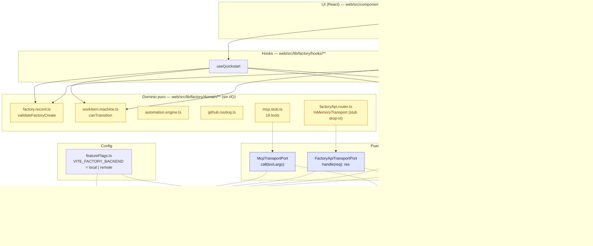

# ADR-001 — Puertos backend-ready (sin backend)

> **Estado:** Accepted · 2026-08-30  
> **Autores:** Gao (Architect), Kou (Engineer) · Equipo `software-termcanvas-waves`  
> **Scope:** `web/src/lib/factory/ports/**` + `web/src/lib/factory/config/featureFlags.ts`  
> **Relacionado:** `PLAN-OLAS-WARP-FACTORIES.md` §7 Ola 8 + §8 Preparación backend + §11 P7 + Apéndice B · PRD §3.4 C6 (DIP)

## Contexto

La réplica es **LOCAL-first, sin credenciales** (`factoryApi.router.ts` in-process + `mcp.stub.ts` 19 tools + `KeyValuePort` memory/localStorage). El dominio puro (`FactoryRecord`, `WorkItemMachine`, `AutomationEngine`) está desacoplado de React y de I/O, y los tests (895) corren en `jsdom` con `tsc -b 0`.

El riesgo estratégico es alto: Warp abrió Early Access 2026-08-18 ($10k qualifying). Si abre en Q4 2026, un backend propio queda **obsoleto** (alto arrepentimiento). Pero sin diseño de puertos, el día que haya credenciales el paso a backend sería un **rewrite** (dominio acoplado a `fetch`/`Request`).

**Objetivo de este ADR:** dejar el swap a backend como **cambio de `port`** — no de dominio — con **0 líneas de backend real**.

Constraints:

- **C1** Solo LOCAL por ahora (sin DB, sin auth server, sin deploy, sin secrets server).
- **C6** OCP/DIP estricto: dominio no conoce `localStorage`/`fetch`/`WebSocket`.
- **Stack congelado** (Vite 8.2, React 19.2, TS 6, zod, yaml, pnpm) — sin deps nuevas sin ADR.
- `tsc -b` es gate canónico; todo nuevo tipo debe compilar con `erasableSyntaxOnly`/`verbatimModuleSyntax`.

## Decisión

Introducir **4 puertos mínimos** (solo tipos, sin runtime nuevo) + un **feature flag** (`VITE_FACTORY_BACKEND`). El día con credenciales se implementa `Remote*` que satisface el mismo port y se inyecta donde hoy está el `LocalAdapter`.

### Los 4 puertos (solo tipos — ver Apéndice B del plan)

#### 1. `FactoryRepositoryPort` — `web/src/lib/factory/ports/factory.ports.ts`

```ts
type PortResult<T> = ParseResult<T>;
interface FactoryRepositoryPort {
  list(): readonly FactoryRecord[];
  getByUid(uid: string): FactoryRecord | undefined;
  getByName(name: string): FactoryRecord | undefined; // case-insensitive (US-002)
  create(input: CreateFactoryInput): PortResult<FactoryRecord>;
  update(uid: string, patch: Partial<CreateFactoryInput>): PortResult<FactoryRecord>;
  remove(uid: string): PortResult<void>;
  toSummaries(): readonly FactorySummary[];
  subscribe(cb: () => void): () => void;
  getVersion(): number;
}
```

Hoy: `FactoryWorkspaceStore` (Map+Set+version sobre `KeyValuePort`).  
Futuro: `RemoteFactoryRepo` (`fetch /api/v1/factory` con `Bearer`).

#### 2. `WorkItemRepositoryPort`

```ts
interface WorkItemRepositoryPort {
  list(): readonly WorkItem[];
  getById(id: string): WorkItem | undefined;
  create(input: CreateWorkItemInput): PortResult<WorkItem>;
  transition(id: string, to: WorkItemStage, actor: Actor, ctx?: TransitionContext): PortResult<WorkItem>;
  subscribe(cb: () => void): () => void;
  getVersion(): number;
}
```

Hoy: `WorkItemStore` + `WorkItemMachine` (gates humanas).  
Futuro: `RemoteWorkItemRepo`.

#### 3. `FactoryApiTransportPort` — `web/src/lib/factory/ports/transport.types.ts`

```ts
interface ApiRequest { readonly method: "GET"|"POST"; readonly path: string; readonly query?: Record<string,string>; readonly headers?: Record<string,string>; readonly body?: unknown; }
interface ApiResponse<T=unknown> { readonly status: number; readonly headers: Record<string,string>; readonly body: T; }
interface FactoryApiTransportPort {
  handle(req: ApiRequest): ApiResponse | Promise<ApiResponse>;
  routes(): readonly { id: string; method: string; path: string }[];
}
```

Hoy: `InMemoryTransport` = `createFactoryApiRuntime(...).router.dispatch` adaptado a `handle(req)`.  
Futuro: `FetchTransport` (`fetch("https://app.warp.dev"+req.path, { headers:{Authorization:"Bearer "+WARP_API_KEY} })`).

#### 4. `McpTransportPort`

```ts
interface McpTransportPort {
  call(tool: string, args: unknown): Promise<ParseResult<unknown>>;
  listTools(): readonly { name: string; description: string }[];
}
```

Hoy: `FactoryMcpStub` (19 tools, WorkItemStore real, sin scopes, warning no-claim/lock).  
Futuro: `McpFetchTransport` (`POST https://app.warp.dev/api/v1/mcp/factory` streamable).

`PortResult<T>` es alias de `ParseResult<T>` (`path/message/code` testeable) — errores como valores, cero `throw` en dominio.

### Feature flag — `web/src/lib/factory/config/featureFlags.ts`

```ts
type BackendMode = "local" | "remote";
const BACKEND_MODE: BackendMode = (import.meta.env.VITE_FACTORY_BACKEND as BackendMode) ?? "local";
function isBackendEnabled(): boolean { return BACKEND_MODE === "remote"; }
```

Solo const + función pura, sin I/O. No se usa en stores aún — solo doc y tests. Fail-closed a `local`. El swap futuro es:

```ts
const transport: FactoryApiTransportPort = isBackendEnabled() ? new FetchTransport(env) : createInMemoryTransport(runtime);
```

### Diagrama — Control vs Execution + ports



Lectura: hoy todo va por `AL` (LOCAL). El día con backend, `FF=remote` inyecta `AR` sin tocar `Domain` ni `UI`. `KeyValuePort` es el ejemplo a seguir (ya existe y este diseño lo extiende).

## Tabla B1–B8 → env vars / secrets scoping

| Bloqueante | Env var / secret | Port | Boundary |
|------------|------------------|------|----------|
| **B1** GitHub App | `GITHUB_APP_ID`, `GITHUB_APP_PRIVATE_KEY`, `GITHUB_INSTALLATION_ID` | `FactoryApiTransportPort` (repos) | **execution** (EXECUTOR) |
| **B2** Slack OAuth | `SLACK_BOT_TOKEN`, `SLACK_SIGNING_SECRET` | `McpTransportPort` | **execution** |
| **B3** Linear/Jira | `LINEAR_OAUTH_TOKEN`, `JIRA_ROVO_API_KEY`, `JIRA_PROJECT_KEYS` | `FactoryApiTransportPort` | **execution** |
| **B4** GitLab | `GITLAB_MANAGER_TOKEN`, `GITLAB_BOT_NAME`, `GITLAB_GROUP_ID` | `FactoryApiTransportPort` | **execution** |
| **B5** Factory MCP live | `WARP_API_KEY` (`Bearer`) | `McpTransportPort` | **harness auth** (oz) |
| **B6** Factory API live | `WARP_API_KEY` | `FactoryApiTransportPort` | **harness auth** |
| **B7** Harness credentials | `ANTHROPIC_API_KEY`, `CODEX_API_KEY`, `GEMINI_API_KEY` | `McpTransportPort` | **inference** (nunca en sandbox) |
| **B8** Self-hosted runner | `SELF_HOSTED_WORKER_ID`, `OTEL_ENDPOINT` | `WorkItemRepositoryPort` | **execution** (worker) |

Ver detalle y scoping completo en `docs/ENV-MAP.md` (4 credential boundaries: inference, execution, harness auth, repository identity · EXECUTOR vs CREATOR).

## Decisiones clave

### D1 — `handle(ApiRequest)→ApiResponse` vs `fetch`-like `Request→Response`

**Elegido: `handle(req: ApiRequest): ApiResponse`** (objeto tipado).

| Dimensión | `fetch`-like (`Request→Response` DOM) | `handle(ApiRequest)→ApiResponse` (elegido) |
|-----------|----------------------------------------|---------------------------------------------|
| **Ya existe** | No — habría que adaptar `FactoryApiRouter.dispatch(method, path, body)` a `Request` | ✅ Sí — es exactamente `router.dispatch` + `TICKET_REF_PATTERN` + `search` case-insensitive centralizados |
| **Dominio puro** | ❌ Arrastra `Request`/`Response` de DOM al dominio (necesita lib DOM + polyfill en tests) | ✅ Dominio no conoce DOM; `ApiRequest` es POJO testeable con `zod` |
| **Centralización** | Disperso: cada caller normaliza `ticket_ref` y `search` | ✅ Un solo sitio valida `TICKET_REF_PATTERN` (`/^[a-z]+:[A-Za-z0-9-_]+$/`) y `search` case-insensitive (filtro por `name` y `alias`) |
| **Snippets** | Requiere serializar `Request` para `toCurl`/`toOzApiSnippet` | ✅ `ApiRequest` ya es el modelo de snippet — `toCurl(req, apiKey)` sin serializar |
| **Swap futuro** | `FetchTransport` debe parsear `Request` DOM | `FetchTransport` mapea `ApiRequest → fetch()` internamente, sin exponer DOM al dominio |

El `FetchTransport` futuro hace el adaptador inverso (`ApiRequest → fetch`) en su interior; el dominio nunca ve `fetch`.

### D2 — ¿Por qué 4 puertos y no más?

Principio YAGNI + SRP. Cada puerto = una razón de cambio:

- Factories vs WorkItems son agregados distintos (no se mezclan en un `RepositoryPort` genérico — ISP).
- Factory API vs MCP son transports distintos (HTTP REST vs MCP streamable, 19 tools).

Agregar más (ej. `SecretsPort`, `RunnerPort`, `ScorerPort`) sería sobrediseño: hoy no hay comportamiento que lo exija, y cada puerto añade coste de mock + contrato. Si mañana se necesita (ej. `SecretsPort` para execution secrets allowlist), se añade sin tocar los 4 existentes (OCP). El ADR explica "por qué no más" — no "por qué no menos".

### D3 — ¿Por qué no IndexedDB aún?

`KeyValuePort` + `localStorage` alcanza. Evidencia:

- Factories + work items < 100 KB JSON (2 factories seed ~1.5 KB, 50 factories ~40 KB) muy por debajo de quota 5 MB.
- `localStorage` es sync (no async en dominio puro), sin versiones/transacciones/onblocked, testeable con `createMemoryPort`.
- `IndexedDB` aportaría async, versiones, transacciones y `fake-indexeddb` en tests — complejidad sin beneficio LOCAL.

Nota ADR: re-evaluar si > 500 factories o > 1 MB (ver `docs/ENV-MAP.md` y plan Ola 6).

### D4 — Feature flag sin uso runtime aún (intencional)

El flag vive solo en `config/featureFlags.ts` + doc. No se inyecta en stores porque no hay `Remote*` que elegir todavía. Esto evita flag muerto que confunda (board con dos ramas sin test). El día del spike backend, el flag elige adapter en la composición raíz (`main.tsx` o `hooks`).

## Consecuencias

- **Positivas:** swap a backend = implementar `FetchTransport`/`Remote*Repo` y cambiar `VITE_FACTORY_BACKEND=remote` — sin tocar `AutomationEngine`, `WorkItemMachine`, `FactoryRecord`, ni UI. Contrato testeable (`ports.contract.test.ts` verifica que el stub actual ya satisface los ports).
- **Negativas:** 4 interfaces más para mantener (pero solo tipos, sin bundle cost). Riesgo YAGNI mitigado por minimalismo.
- **Neutras:** `tsc -b` sigue en 0 (ports solo tipos, `verbatimModuleSyntax` + `erasableSyntaxOnly` ok).

## Alternativas consideradas

| Alternativa | Por qué se descartó |
|-------------|---------------------|
| `fetch: (req: Request) => Promise<Response>` como port | Arrastra DOM a dominio, duplica validación de `ticket_ref`/search, dificulta `toCurl` |
| Un solo `RepositoryPort<T>` genérico | Viola ISP/SRP: factories y work items tienen invariantes y gates distintas (alias unique vs human gate) |
| `IndexedDB` + `idb-keyval` | Async + versiones sin necesidad (<100 KB); re-evaluar a >500 factories |
| Inyectar flag ya en `FactoryWorkspaceStore` | Flag sin Remote confunde; se deja solo en config hasta trigger |

## Verificación

- `pnpm --filter web exec tsc -b` → 0 errores (ports solo tipos)
- `pnpm --filter web exec vitest run --pool=threads` → 895+ tests (incluye `ports.contract.test.ts`)
- `docs/BACKEND-TRIGGER.md` define cuándo se codea backend (fecha + señales)
- `docs/ENV-MAP.md` tabula B1–B8

## Referencias

- `PLAN-OLAS-WARP-FACTORIES.md` §8, §9, §11 P7, Apéndice B.3
- `WarpFactories.md` §19 Factory API, §12 Factory MCP (19 tools)
- `WarpFactories-Tickets.md` P2-01..P2-04
- `src/lib/factory/domain/factoryApi.types.ts` (`TICKET_REF_PATTERN`), `src/lib/factory/store/storage.port.ts` (`KeyValuePort`)
