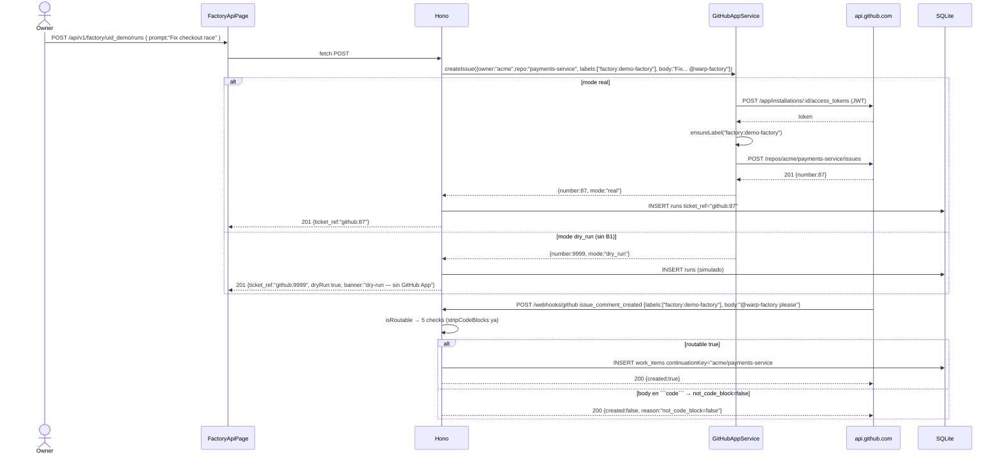
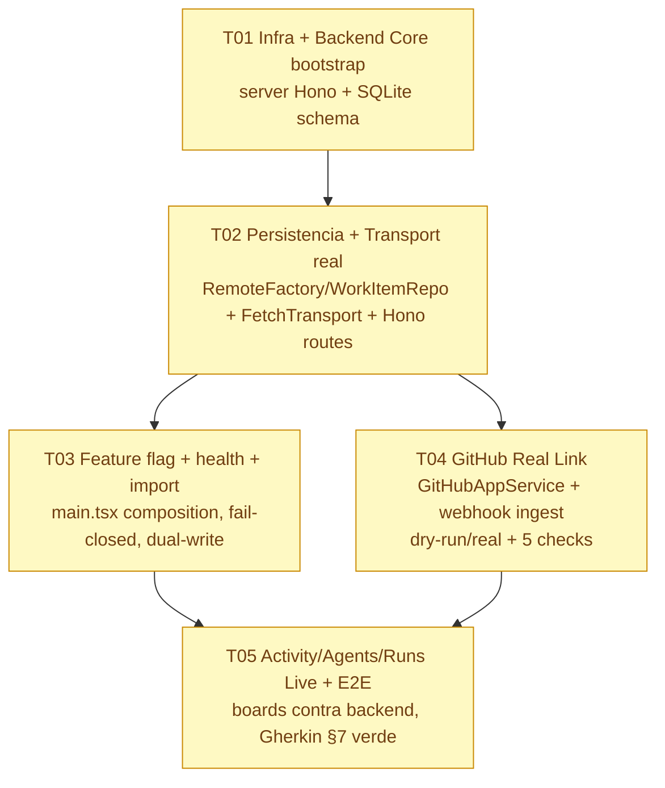

# ADR-002 — Backend Real Vertical Slice O16-O18 (Activity/Agents/Runs + GitHub Real Link)

> **Estado:** Accepted · 2026-08-30  
> **Autores:** Gao (Architect) · Equipo `software-termcanvas-backend`  
> **Rama base:** `workbuddy/main-c2128e3a` HEAD O15 (999 tests, `tsc -b 0`, 2319 modules)  
> **Relacionado:** `PRD-BACKEND-REAL.md` §9 (5 preguntas) · `ADR-001` (4 ports + `VITE_FACTORY_BACKEND`) · `ENV-MAP.md` B1-B8 · `BACKEND-TRIGGER.md` (trigger 2026-11-01 adelantado a pedido) · `PLAN-SIGUIENTES-OLAS.md` Apéndice O16-O18  
> **Scope:** `server/**` (nuevo) + `web/src/lib/factory/adapters/**` + `web/src/lib/factory/config/featureFlags.ts` + `web/src/main.tsx`  
> **Constraints:** C1 OCP sin romper 999 tests · C2 stack congelado · C3 dominio puro sin fetch · C4 fail-closed `local` · C5 4 boundaries (token nunca en browser) · C6 flag solo en composición raíz · C7 receipt verificable

---

## TL;DR — Respuestas a las 5 preguntas §9 (tabla decisión)

| § | Pregunta | **Decisión concreta** | Alternativas descartadas (por qué) |
|---|----------|-----------------------|-------------------------------------|
| **9.1 Persistencia** | ¿Qué DB/KV? ¿Esquema? ¿Migración? | **SQLite single-file `data/termcanvas.db` vía `better-sqlite3@^9` (fallback `node:sqlite` si Node≥22.5) — tablas normalizadas ligeras + columna `data JSON` para `WorkItem.history`/`FactoryRecord` payload. Sin ORM pesado (SQL directo + `drizzle-orm/better-sqlite3` opcional solo para migrations). Migración manual `exportWorkspace → POST /api/v1/factory/import` validado por `factory.parser` (no auto-migración).** | **Postgres/Supabase/Neon:** overkill (<100 factories, <1k work items), requiere Docker/connection string, migrations tool, coste operativo sin valor para 1 repo de prueba. **File `workspace.json`/lowdb:** frágil ante writes concurrentes, sin queries `search`/`stage` server-side (P1), sin transacciones. **IndexedDB:** descartada ADR-001 salvo >500 factories. **Dynamo/Firestore:** coupling cloud, no local-first. |
| **9.2 Transport** | ¿Framework backend? ¿Contrato `handle`? ¿Auth? | **Hono `^4` + `@hono/node-server` en `localhost:8787`. Contrato `handle(ApiRequest)→ApiResponse|Promise<ApiResponse>` se MANTIENE (ADR-001 D1). `FetchTransport` mapea `ApiRequest → fetch()` internamente. Auth `Bearer` opcional: si `WARP_API_KEY` env set → requiere `Authorization: Bearer …` (401 `missing_api_key`), si no → open localhost sin auth.** | **Express:** más pesado, necesita `body-parser`, tipado laxo, no trae `fetch`-first; misma funcionalidad con más bundle. **Fastify:** excelente perf pero plugin model innecesario para 7 rutas. **Next API routes:** acopla hosting a Vercel antes de decidir hosting. **Migrar a `Request→Response` DOM:** ADR-001 ya descartó (arrastra DOM a dominio, duplica `TICKET_REF_PATTERN`/`search` case-insensitive). |
| **9.3 GitHub auth** | ¿App vs PAT? ¿Dónde vive la key? ¿Scoping? ¿Webhook? | **GitHub App (`GITHUB_APP_ID` + `GITHUB_APP_PRIVATE_KEY` + `GITHUB_INSTALLATION_ID`) repo-scoped a `acme/payments-service` (repo de prueba). PAT solo fallback local documentado. `PRIVATE_KEY` solo en `process.env` del backend (boundary `execution / repository identity`, `EXECUTOR` default). Webhook O17 = endpoint simulado `POST /webhooks/github` que aplica `github.routing` (5 checks) — sin `smee`/`ngrok` tunel (P1 opcional).** | **PAT:** token personal, no escala, expone identidad humana, rate-limit por usuario, no auditable como App. **OAuth user:** complejidad multi-user fuera de slice (P2). **Key en `VITE_*` / bundle:** prohibido C5 — token nunca viaja al browser. **Webhook real vía tunel obligatorio:** bloquea `pnpm check` sin B1 y no es testeable en `jsdom`. |
| **9.4 Feature flag migration** | ¿Dónde se elige adapter? ¿`VITE_ ` alcanza? ¿Tests ambos modos? | **Un único `if (isBackendEnabled())` en composición raíz `web/src/main.tsx` (o helper `web/src/lib/factory/adapters/adapterFactory.ts`) que inyecta `LocalAdapter` vs `RemoteAdapter`. Prohibido `isBackendEnabled()` en `domain/` o páginas. `VITE_FACTORY_BACKEND` (build-time) alcanza para `vite dev` local; para preview sin rebuild se añade P1 `GET /config` runtime ligero (no bloquea O16). CI: `local` default verde + `describe` extra con `VITE_FACTORY_BACKEND=remote` + `fetch` mock (sin B1).** | **Flag esparcido por `hooks/use*`/`store/*`:** viola OCP, doble rama sin test, confunde. **`window.__ENV__` obligatorio ya:** sobre-ingeniería para localhost. **Solo testear `local`:** deja `remote` sin cobertura de contrato. |
| **9.5 Hosting** | ¿Dónde corre el backend en O16-O18? | **O16-O17: `localhost:8787` con `pnpm --filter server dev` + `vite dev --port 5174` proxy (o `docker compose` opcional). Sin deploy prod. O18: preview opcional en Cloud Run/Fly/Vercel con mismo `FetchTransport` cambiando `VITE_FACTORY_BACKEND_API_URL` (mismo contrato, distinta baseUrl).** | **Deploy prod obligatorio O16:** exige SLA, CDN, OTEL, secrets manager — fuera de slice P0 (PRD §2.2). **Solo docker mandatory:** ralentiza `pnpm i && pnpm dev` local (C4). |

> **Regla de oro:** si no se necesita para que `Activity → Agents → Runs → GitHub` funcione E2E con 1 repo de prueba, no entra en O16-O18.

---

## 1. Implementation Approach

### Core technical challenges

1. **Persistencia durable sin acoplar dominio (DIP/OCP):** `FactoryWorkspaceStore`/`WorkItemStore` hoy son `Map` sobre `KeyValuePort`. El slice debe hacerlos durables cross-client sin mutar `domain/` ni romper 999 tests. Challenge: `FactoryRepositoryPort`/`WorkItemRepositoryPort` hoy son sync; `RemoteAdapter` es async (fetch). Solución cache + subscribe (ver §3).
2. **Transport real sin filtrar DOM al dominio:** `FactoryApiTransportPort.handle(ApiRequest)` ya es `Promise`-compatible. Challenge: mapear `ApiRequest` (POJO testeable con `zod`) → `fetch` + `Bearer` opcional + mapeo errores a `ParseResult` con `code` testeable (`invalid_ticket_ref`, `factory_not_found`, `missing_prompt`, `route_not_found`, `missing_api_key`, `rate_limited`) sin añadir `throw` en dominio.
3. **GitHub dual-label vinculado a GitHub real sin romper demo LOCAL (C4/C5):** `github.routing.ts` ya tiene 5 checks (`new_content`, `not_bot`, `label_present`, `not_code_block`, `mention_present`) + `stripCodeBlocks` + `continuationKey` deterministas. Challenge: reutilizar esos 5 checks en el backend contra API real (verificar que `factory:<alias>` existe, `mention` es handle válido) con modo `dry-run` cuando B1 no está, y con boundary `token nunca en browser`.
4. **Feature flag fail-closed sin esparcirse:** `VITE_FACTORY_BACKEND=local|remote` + `isBackendEnabled()` ya existe fail-closed. Challenge: hacer el swap **un solo `if` en la raíz** (OCP) y que `pnpm check` pase sin B1.
5. **Hosting localhost sin infra pesada:** evitar Postgres/OTel/metering/deploy hasta trigger real.

### Framework and library selections con justificación

| Capa | Elección | Justificación (tradeoff) |
|------|----------|--------------------------|
| **Backend HTTP** | `hono@^4` + `@hono/node-server` | 0 deps nativas, TypeScript first, `fetch`-style handlers, `zod-validator` built-in, mismo `path` que stub (`/api/v1/factory`, `/agent/runs/:id`), testeable con `vitest` sin server real (importa `app.fetch(Request)`), funciona igual en Node o Cloud Run. Express/Fastify descartados por peso/plugins innecesarios para 7 rutas. |
| **Persistencia** | `better-sqlite3@^9` (sync) — fallback `node:sqlite` (Node≥22.5) | Single file `data/termcanvas.db`, sin server, `SQL` para `search`/`stage` futuro, backup = `cp`, migrations = `*.sql` versionadas, sync API encaja con `better-sqlite3` transaction (`db.transaction`). `better-sqlite3` tiene native binding — en Windows se compila con `prebuild`; si falla, `node:sqlite` es stdlib sin native. Postgres descartado (overkill). File json descartado (race writes). |
| **Migrations** | SQL files + `drizzle-orm@^0.38` opcional **o** SQL directo `db.exec` | `drizzle` solo si se quiere type-safe, no aporta bundle a `web`. Alternativa mínima: `server/src/db/migrate.ts` lee `schema.sql` + `migrations/*.sql`. Decisión O16: SQL directo (0 deps extra), `drizzle` P1 si escala. |
| **GitHub** | `@octokit/rest@^21` + `@octokit/auth-app@^7` | Canónico para GitHub App (JWT → installation token). PAT fallback solo local. |
| **Validation** | `zod@^4` (ya en `web`) re-usado en `server` para `TICKET_REF_PATTERN`/`factory.parser` | No nueva dep conceptual; mismo `code` testeable. |
| **Env** | `dotenv@^16` + `zod` env schema en `server/src/config/env.ts` | `GITHUB_APP_*` solo en `server`, nunca en `VITE_*`. |

**Bundle impact:** `server/` deps no afectan `web` bundle (vite `2319 modules` intacto). `web` no añade deps; solo `fetch` nativo.

### Architecture patterns

- **Hexagonal / Ports & Adapters (DIP/OCP):** `domain/` puro (sin `fetch`/`localStorage`/`Request`), `ports/` define contratos, `adapters/` (`LocalAdapter` = `FactoryWorkspaceStore`+`WorkItemStore`+`InMemoryTransport`, `RemoteAdapter` = `RemoteFactoryRepo`+`RemoteWorkItemRepo`+`FetchTransport`) son intercambiables por flag.
- **Observer + Cache-Aside:** `subscribe`/`getVersion()` + `useSyncExternalStore` ya existen. `RemoteAdapter` mantiene cache `Map` local hidratada por `GET /api/v1/factory` y notifica tras `fetch`; `list()` sigue sync (lee cache) para no romper OCP sync.
- **Composition Root (main.tsx):** un único sitio elige adapter; dominio/UI no conocen la elección.
- **Fail-closed + Dry-run:** `isBackendEnabled()===false` → `LocalAdapter`; `B1` ausente → `GitHubAppService` en modo `dry-run` (no llama `api.github.com`, retorna `mode:"dry_run"`).

---

## 2. File List

> Rutas relativas a repo root. `web/` es la app Vite existente; `server/` es el nuevo backend propio. Todo `server/` es Node-only, no va a bundle `web`.

```
# O16 — Backend Core (persistencia + transport reales + flag)
server/package.json                          # nuevo — name termcanvas-server, deps hono, better-sqlite3, octokit, zod, dotenv
server/tsconfig.json                         # nuevo — references, erasableSyntaxOnly
server/src/index.ts                          # nuevo — entry @hono/node-server serve({ fetch: app.fetch, port: 8787 })
server/src/app.ts                            # nuevo — Hono app, cors, auth optional, routes mount, error handler ParseResult→{code}
server/src/config/env.ts                    # nuevo — zod env schema: WARP_API_KEY?, GITHUB_APP_*, PORT, DATABASE_URL (file path)
server/src/config/constants.ts               # nuevo — DATABASE_PATH="data/termcanvas.db", API_PREFIX="/api/v1"
server/src/middleware/cors.ts                # nuevo — allow localhost:5174, credentials false
server/src/middleware/auth.ts                # nuevo — Bearer optional: if WARP_API_KEY set → verify, else next()
server/src/db/sqlite.ts                      # nuevo — getDb(): Database, singleton, pragma journal_mode=WAL
server/src/db/schema.sql                     # nuevo — CREATE TABLE factories/work_items/runs + indexes
server/src/db/migrate.ts                     # nuevo — exec schema.sql + migrations/*.sql idempotente
server/src/db/factory.repo.ts                # nuevo — SQLite impl: list/get/create/update/remove/toSummaries
server/src/db/workItem.repo.ts               # nuevo — SQLite impl: list/get/create/transition (delegates WorkItemMachine)
server/src/db/run.repo.ts                    # nuevo — runs map persistido (FactoryRunResponse)
server/src/routes/factory.routes.ts          # nuevo — GET /api/v1/factory?search, GET /factory/:uid, POST /factory/:uid/runs, POST /factory/import, GET /health
server/src/routes/workItem.routes.ts        # nuevo — GET /api/v1/work-items?factoryName&stage&search&includeTerminals, POST /work-items, POST /work-items/:id/transition, GET /work-items/:id
server/src/routes/agent.routes.ts            # nuevo — GET /agent/runs/:id, POST /agent/runs/:id/followups, POST /agent/runs/:id/cancel, POST /agent/run (standalone)
server/src/lib/validation.ts                 # nuevo — re-export TICKET_REF_PATTERN, isTicketRef, search case-insensitive helper
server/src/lib/githubApp.ts                  # nuevo — createGitHubAppService(env): { mode:"real"|"dry_run", createIssue(), verifyLabel() } (O16 stub dry_run)
web/src/lib/factory/adapters/fetchTransport.ts     # nuevo — class FetchTransport implements FactoryApiTransportPort { handle(req): Promise<ApiResponse> }
web/src/lib/factory/adapters/remoteFactory.repo.ts # nuevo — class RemoteFactoryRepo implements FactoryRepositoryPort (cache + fetch)
web/src/lib/factory/adapters/remoteWorkItem.repo.ts# nuevo — class RemoteWorkItemRepo implements WorkItemRepositoryPort (cache + fetch)
web/src/lib/factory/adapters/adapterFactory.ts     # nuevo — createFactoryAdapters(mode): { factoryRepo, workItemRepo, transport }
web/src/lib/factory/config/featureFlags.ts   # mod — añade FACTORY_BACKEND_API_URL (default http://localhost:8787), getBackendConfig()
web/src/main.tsx                              # mod — usa adapterFactory: isBackendEnabled() ? Remote* : Local (FactoryWorkspaceStore)
web/src/lib/factory/store/factoryWorkspace.store.ts # verify — documenta satisface FactoryRepositoryPort explícitamente (no mutar firma)
web/src/lib/factory/store/workItem.store.ts  # verify — idem WorkItemRepositoryPort
web/docs/ADR-002-backend-real.md             # nuevo — este archivo
web/docs/PLAN-SIGUIENTES-OLAS.md             # mod — apéndice O16-O18

# O17 — GitHub Real Link (issue real + webhook ingest)
server/src/lib/githubApp.ts                  # mod — implementa createIssue({ owner, repo, title, body, labels }) + ensureLabel(factory:<alias>)
server/src/routes/webhook.routes.ts          # nuevo — POST /webhooks/github (verify HMAC optional, parse X-GitHub-Event, apply isRoutable, create workItem)
server/src/lib/continuation.ts               # nuevo — continuationKey derivada (owner/repo#number)
server/src/middleware/githubWebhookAuth.ts   # nuevo — verify X-Hub-Signature-256 si WEBHOOK_SECRET set, else open (dry-run)
web/src/lib/factory/domain/github.routing.ts # verify — ya tiene 5 checks, stripCodeBlocks, continuationKey (reusado server-side)
web/src/components/routing/GitHubRoutingPage.tsx # verify — banner dry-run vs real
web/src/lib/factory/__tests__/github.realLink.test.ts # nuevo — contract tests (ver O17)
web/docs/ENV-MAP.md                          # mod — documenta GITHUB_APP_* real scoping + WEBHOOK_SECRET
web/docs/DEMO-5MIN.md                        # mod — variante remote con repo de prueba

# O18 — Activity/Agents/Runs Live (boards consumen backend real)
web/src/lib/factory/hooks/useFactories.ts    # mod — await adapter (MaybePromise), subscribe a RemoteFactoryRepo version
web/src/lib/factory/hooks/useWorkItems.ts    # mod — idem RemoteWorkItemRepo, filtros Created by/Stage/search/includeTerminals contra backend
web/src/lib/factory/hooks/useFactoryBundle.ts# mod — carga bundle para Agents CRUD persistido
web/src/components/activity/ActivityBoard.tsx# mod — loading/empty/error states contra RemoteWorkItemRepo, Event history persistido
web/src/components/activity/ActivityDetail.tsx# verify — file:line intacto
web/src/components/agents/AgentsPage.tsx     # mod — CRUD persistido (POST /api/v1/factory/:uid/agents), file:line error
web/src/components/runs/RunsPage.tsx         # mod — GET /agent/runs/:id, timeline/cost/Sub-agents/View session, Stop task persistido
web/src/components/runs/RunDetail.tsx        # verify — transcript followups acumulados
web/src/components/factory-definition/SettingsPage.tsx # mod — credentialStrategy EXECUTOR/CREATOR + Deletion persistidos cross-client
web/src/lib/factory/__tests__/activity.live.test.ts    # nuevo — see O18
web/src/lib/factory/__tests__/agents.live.test.ts      # nuevo
web/src/lib/factory/__tests__/runs.live.test.ts        # nuevo
web/docs/RECEIPT.md                          # mod — agg O16-O18
web/docs/sequence-diagram.mermaid            # mod — agg secuencia backend real (ver §4)
web/docs/class-diagram.mermaid               # mod — agg adapters + server (ver §3)
```

**Totales O16-O18:** **~18 nuevos server/** + **~6 nuevos web/adapters/** + **~5 nuevos tests** + **~10 mods** = **~39 archivos** tocados. `web` bundle no crece (server deps aisladas).

---

## 3. Data Structures and Interfaces

### 3.1 Class diagram (dominio + ports + adapters + server)

> Ver archivo extraído `web/docs/class-diagram.mermaid` (agregado O16-O18 al diagrama existente G1-G5).

```mermaid
classDiagram
    direction TB

    %% ─────────────── Dominio puro (existente, no tocar) ───────────────
    class ParseResult~T~ {
        +boolean ok
        +T value
        +ParseIssue[] issues
        +static ok(v) ParseResult
        +static fail(issues) ParseResult
        +static singleFail(path, message, code) ParseResult
    }
    class ParseIssue { +string path; +string message; +string code }

    class FactoryRecord {
        +string uid; +string name; +string alias
        +RepositoryRef[] repositories; +IntegrationType[] integrations
        +Record agentToggles; +string policyId; +string createdAt
    }
    class FactorySummary { +string uid; +string name; +string alias; +number repositoryCount }
    class CreateFactoryInput { +string name; +string alias; +RepositoryRef[] repositories }

    class WorkItem {
        +string id; +string factoryName; +string title; +WorkItemStage stage
        +WorkItemEvent[] history; +string createdBy; +string createdAt
        +HumanApproval humanApproval; +ReviewVerdict reviewVerdict
    }
    class WorkItemEvent { +string id; +string workItemId; +WorkItemStage from; +WorkItemStage to; +Actor actor; +string at }
    class WorkItemStage { <<enum>> Triage, Planning, Building, Reviewing, Complete, Cancelled }
    class WorkItemStore {
        -Map items; -WorkItemMachine machine; -Set knownFactories; -Set listeners; -number version
        +create(input) ParseResult~WorkItem~; +transition(id,to,actor,ctx) ParseResult~WorkItem~
        +list(filter) WorkItem[]; +subscribe(cb) Function; +getVersion() number
    }
    class WorkItemMachine {
        +transition(item,to,actor,ctx) ParseResult~WorkItem~
        +canTransition(from,to) boolean; +nextStageForIntake(decision) WorkItemStage
    }
    class FactoryWorkspaceStore {
        -Map records; -KeyValuePort port; -string selectedUid; -Set listeners; -number version
        +list() FactoryRecord[]; +create(input) ParseResult~FactoryRecord~; +toSummaries() FactorySummary[]
        +subscribe(cb) Function; +getVersion() number
    }
    class KeyValuePort { <<interface>> +read(key) string; +write(key,value) void }
    class ApiRequest { +string method; +string path; +Record query; +Record headers; +unknown body }
    class ApiResponse~T~ { +number status; +Record headers; +T body }

    %% ─────────────── Ports (existente, se ensancha a MaybePromise para remote) ───────────────
    class FactoryRepositoryPort {
        <<interface>> +list() MaybePromise~FactoryRecord[]~
        +getByUid(uid) MaybePromise~FactoryRecord~
        +create(input) MaybePromise~ParseResult~FactoryRecord~~
        +update(uid,patch) MaybePromise~ParseResult~FactoryRecord~~
        +remove(uid) MaybePromise~ParseResult~void~~
        +toSummaries() MaybePromise~FactorySummary[]~; +subscribe(cb) Function; +getVersion() number
    }
    class WorkItemRepositoryPort {
        <<interface>> +list(filter?) MaybePromise~WorkItem[]~
        +getById(id) MaybePromise~WorkItem~; +create(input) MaybePromise~ParseResult~WorkItem~~
        +transition(id,to,actor,ctx) MaybePromise~ParseResult~WorkItem~~
        +subscribe(cb) Function; +getVersion() number
    }
    class FactoryApiTransportPort {
        <<interface>> +handle(req) ApiResponse|Promise~ApiResponse~; +routes() TransportRouteInfo[]
    }
    class McpTransportPort { <<interface>> +call(tool,args) Promise~ParseResult~; +listTools() ToolDef[] }

    %% ─────────────── Adapters web (nuevo O16) ───────────────
    class FetchTransport {
        -string baseUrl; -string apiKey
        +handle(req) Promise~ApiResponse~; +routes() TransportRouteInfo[]
        -toFetch(req) Request; -fromFetch(res) ApiResponse
    }
    class RemoteFactoryRepo {
        -string baseUrl; -FetchTransport transport; -Map cache; -Set listeners; -number version
        +list() FactoryRecord[] ; +getByUid(uid) FactoryRecord|undefined
        +create(input) Promise~ParseResult~FactoryRecord~~; +update/patch/remove() Promise~ParseResult~
        +subscribe(cb) Function; +hydrate() Promise~void~; -notify() void
    }
    class RemoteWorkItemRepo {
        -string baseUrl; -FetchTransport transport; -Map cache; -Set listeners; -number version
        +list(filter?) WorkItem[]; +create(input) Promise~ParseResult~WorkItem~~
        +transition(id,to,actor,ctx) Promise~ParseResult~WorkItem~~
        +subscribe(cb) Function; +hydrate(factoryName?) Promise~void~
    }
    class AdapterFactory {
        <<module puro>> +createFactoryAdapters(mode) { factoryRepo, workItemRepo, transport }
        +getBackendConfig() { mode, baseUrl, apiKey }
    }
    class FeatureFlags {
        <<module>> +BackendMode mode; +boolean isBackendEnabled(); +string FACTORY_BACKEND_API_URL
    }

    %% ─────────────── Server Hono (nuevo O16-O17) ───────────────
    class HonoApp {
        -Hono app; -Database db; -Env env
        +fetch(req) Response; +route(path, handler) void
    }
    class FactoryRepoSQLite {
        -Database db
        +list(search?) FactoryRecord[]; +getByUid(uid) FactoryRecord|undefined
        +create(record) void; +update(uid,patch) FactoryRecord; +remove(uid) void
        +toSummaries(search?) FactorySummary[]
    }
    class WorkItemRepoSQLite {
        -Database db; -WorkItemMachine machine
        +list(filter) WorkItem[]; +getById(id) WorkItem|undefined
        +create(input) ParseResult~WorkItem~; +transition(id,to,actor,ctx) ParseResult~WorkItem~
    }
    class RunRepoSQLite {
        -Database db; -Map runs
        +create(run) void; +get(id) AgentRunResponse|undefined; +cancel(id) AgentRunResponse
    }
    class GitHubAppService {
        <<service>> -Env env; +mode: "real"|"dry_run"
        +createIssue(input) Promise~{ number, html_url, mode }~
        +ensureLabel(owner,repo,alias) Promise~void~; +verifyMention(handle) boolean
        +generateInstallationToken() Promise~string~
    }
    class WebhookHandler {
        <<handler>> +handleGitHubWebhook(event, payload) Promise~{ created: boolean, workItemId? }~
        -isRoutable(event, policy) RoutingDecision; -toWorkItemInput(event) CreateWorkItemInput
    }
    class AuthMiddleware { <<middleware>> +verifyBearer(c, next) Response }
    class CorsMiddleware { <<middleware>> +cors(c, next) Response }

    %% ─────────────── Relaciones ───────────────
    FactoryWorkspaceStore ..|> FactoryRepositoryPort
    WorkItemStore ..|> WorkItemRepositoryPort
    RemoteFactoryRepo ..|> FactoryRepositoryPort
    RemoteWorkItemRepo ..|> WorkItemRepositoryPort
    FetchTransport ..|> FactoryApiTransportPort
    FactoryWorkspaceStore --> KeyValuePort
    RemoteFactoryRepo --> FetchTransport : usa handle()
    RemoteWorkItemRepo --> FetchTransport
    AdapterFactory ..> FactoryRepositoryPort : elige Local vs Remote
    AdapterFactory ..> WorkItemRepositoryPort
    AdapterFactory ..> FactoryApiTransportPort
    FeatureFlags ..> AdapterFactory : isBackendEnabled() → if
    HonoApp --> FactoryRepoSQLite : inyecta db
    HonoApp --> WorkItemRepoSQLite
    HonoApp --> RunRepoSQLite
    HonoApp --> GitHubAppService : si B1 real, crea issue
    HonoApp --> WebhookHandler : POST /webhooks/github
    WorkItemRepoSQLite ..> WorkItemMachine : delega transition gates
    WebhookHandler ..> WorkItemRepoSQLite : create
    GitHubAppService ..> FactoryRepoSQLite : resolve alias → factories
    HonoApp ..> AuthMiddleware : Bearer opcional
    HonoApp ..> CorsMiddleware
    ParseResult "1" o-- "*" ParseIssue
```

**Notas:**
- `MaybePromise<T> = T | Promise<T>` — widen aditivo OCP: `LocalAdapter` retorna `T` sync, `RemoteAdapter` retorna `Promise<T>`; callers hacen `await` ( `await syncValue` sigue funcionando) sin romper 999 tests que pueden `await` aunque el mock sea sync.
- `domain/` nunca importa `fetch`/`Request`/`localStorage`. Solo `adapters/` y `server/` conocen I/O.
- `server/src/db/*.repo.ts` reutilizan `validateFactoryCreate`, `WorkItemMachine`, `TICKET_REF_PATTERN` del dominio vía import de `web/src/lib/factory/domain/**` o copia validada (misma `code` testeable) — no duplican semántica.

---

## 4. Program Call Flow

### 4.1 Diagrama global Browser → Backend propio → GitHub (boundaries)

> Ver archivo extraído `web/docs/sequence-diagram.mermaid` (O16-O18 agregado al diagrama G1-G4).

```mermaid
sequenceDiagram
    autonumber
    participant Browser as Browser (React 19.2)
    participant Flag as featureFlags.ts<br/>isBackendEnabled()
    participant Local as LocalAdapter<br/>FactoryWorkspaceStore<br/>WorkItemStore<br/>InMemoryTransport
    participant Remote as RemoteAdapter<br/>RemoteFactoryRepo<br/>RemoteWorkItemRepo<br/>FetchTransport
    participant Hono as Backend Hono<br/>localhost:8787<br/>/api/v1/*<br/>/webhooks/github<br/>/health
    participant DB as SQLite<br/>data/termcanvas.db<br/>factories/work_items/runs
    participant GitHubSvc as GitHubAppService<br/>mode: real|dry_run
    participant GitHub as api.github.com<br/>GitHub App JWT→<br/>installation token

    Note over Browser, GitHub: ── Boot — fail-closed local (C4) ──
    Browser->>Flag: import.meta.env.VITE_FACTORY_BACKEND
    alt VITE_FACTORY_BACKEND !== "remote" (default, sin env)
        Flag-->>Browser: mode="local" (fail-closed)
        Browser->>Local: createFactoryAdapters("local")
        Local-->>Browser: FactoryWorkspaceStore(createLocalStoragePort())
        Browser-->>Browser: render App (demo 5 min sin credenciales)
    else VITE_FACTORY_BACKEND === "remote"
        Flag-->>Browser: mode="remote"
        Browser->>Remote: createFactoryAdapters("remote")
        Remote->>Remote: new FetchTransport({ baseUrl: "http://localhost:8787", apiKey? })
        Remote->>Hono: GET /api/v1/factory (hydrate cache)
        Hono->>DB: SELECT * FROM factories
        DB-->>Hono: rows
        Hono-->>Remote: 200 { factories: [...] }
        Remote-->>Browser: cache Map + notify() → useSyncExternalStore re-render
    end

    Note over Browser, GitHub: ── O16: Factory persiste en backend y sobrevive a reload (BC-P0-01) ──
    Browser->>Remote: create({ name:"demo-factory", alias:"demo-2", repositories:[acme/payments-service] })
    Remote->>Hono: POST /api/v1/factory { name, alias, repositories }
    Hono->>Hono: validateFactoryCreate (mismo code que dominio)
    alt validation fail
        Hono-->>Remote: 400 { code:"name_unique", path:"name" }
        Remote-->>Browser: ParseResult.fail → inline error
    else ok
        Hono->>DB: INSERT INTO factories (uid,name,alias,data)
        DB-->>Hono: ok
        Hono-->>Remote: 201 { factory }
        Remote->>Remote: cache.set(uid,factory); notify()
        Remote-->>Browser: ParseResult.ok(factory) → list() incluye demo-factory
        Browser->>Browser: reload (F5)
        Browser->>Remote: hydrate GET /api/v1/factory
        Hono->>DB: SELECT
        DB-->>Hono: includes demo-factory
        Hono-->>Remote: 200
        Remote-->>Browser: demo-factory visible tras reload (segundo cliente igual)
    end

    Note over Browser, GitHub: ── O16: Transport real mapeado a ParseResult (BC-P0-03) ──
    Browser->>Remote: POST /api/v1/factory/uid_demo/runs { prompt:"Fix checkout race", ticket_ref:"PAY-123" }
    Remote->>Hono: POST /factory/:uid/runs
    Hono->>Hono: isTicketRef("PAY-123")? → fail (pattern ^[a-z]+:[A-Za-z0-9-_]+$)
    Hono-->>Remote: 400 { code:"invalid_ticket_ref" }
    Remote-->>Browser: ApiResponse 400 → UI muestra same code que stub, no crea work item

    Note over Browser, GitHub: ── O17: GitHub Real Link — crear issue real con label+mention (GH-P0-01) ──
    alt B1 GitHub App configurado (GITHUB_APP_ID/PRIVATE_KEY/INSTALLATION_ID)
        Browser->>Remote: POST /api/v1/factory/:uid/runs { prompt:"Add Local dev section", ticket_ref:"github:42" }
        Remote->>Hono: POST /factory/:uid/runs
        Hono->>GitHubSvc: createIssue({ owner:"acme", repo:"payments-service", title, body: prompt + "\n\n@warp-factory", labels:["factory:demo-factory"] })
        GitHubSvc->>GitHubSvc: JWT (APP_ID+PRIVATE_KEY) → POST /app/installations/:id/access_tokens
        GitHubSvc->>GitHub: POST /repos/acme/payments-service/issues { title, body, labels }
        GitHub-->>GitHubSvc: 201 { number: 87, html_url }
        GitHubSvc-->>Hono: { number:87, mode:"real" }
        Hono->>DB: INSERT work_items + runs { ticket_ref:"github:87", factory_uid }
        Hono-->>Remote: 201 { id: run_*, ticket_ref:"github:87", ticket_url }
        Remote-->>Browser: 201 + issue visible en acme/payments-service/issues/87
    else B1 no configurado (dry-run, C4)
        Browser->>Remote: POST /factory/:uid/runs (mismo body)
        Remote->>Hono: POST /factory/:uid/runs
        Hono->>GitHubSvc: createIssue() → mode:"dry_run"
        GitHubSvc-->>Hono: { mode:"dry_run", simulatedNumber: 9999 }
        Hono->>DB: INSERT work_items + runs (simulado)
        Hono-->>Remote: 201 { ticket_ref:"github:9999", banner:"dry-run — sin GitHub App" }
        Remote-->>Browser: 201 simulado + banner; pnpm check no exige GITHUB_*
    end

    Note over Browser, GitHub: ── O17: Webhook ingest — dual-label 5 checks (GH-P0-02) ──
    GitHub->>Hono: POST /webhooks/github<br/>X-GitHub-Event: issue_comment<br/>{ issue:{labels, number}, comment:{body}, repo, sender }
    alt HMAC WEBHOOK_SECRET set
        Hono->>Hono: verify X-Hub-Signature-256
    end
    Hono->>Hono: isRoutable(event, policy) → 5 checks:<br/>new_content, not_bot, label_present, not_code_block, mention_present
    alt routable===true
        Hono->>DB: INSERT work_items { source:"github", sourceRef: continuationKey("acme/payments-service#42"), stage: nextStageForIntake }
        Hono->>Hono: notify workItemRepo cache (version++)
        Hono-->>GitHub: 201 { created:true, workItemId:"wi_..." }
        Browser->>Remote: GET /api/v1/work-items?factoryName=demo-factory
        Hono->>DB: SELECT WHERE factoryName="demo-factory"
        DB-->>Browser: includes new work item → Activity en Triage
    else routable===false (ej: body en ```code fence```)
        Hono-->>GitHub: 200 { created:false, reason:"not_code_block=false" }
        Hono-->>Browser: no work item creado (traza visible)
    end

    Note over Browser, GitHub: ── O18: Activity/Agents/Runs Live (LV-P0-01..04) ──
    Browser->>Remote: GET /api/v1/work-items?factoryName=demo-factory&includeTerminals=false&search=&createdBy=you
    Remote->>Hono: GET /work-items (query forwarded)
    Hono->>DB: SELECT filtered (search case-insensitive, stage, createdBy)
    DB-->>Remote: WorkItem[] con history persistido
    Remote-->>Browser: ActivityBoard default Created by=you + 4 active (no Complete)
    Browser->>Remote: GET /work-items?includeTerminals=true
    Hono-->>Remote: + Complete/Cancelled con count
    Browser->>Remote: PUT /api/v1/factory/:uid/agents/:name { harness:"oz"→"codex", reasoningLevel }
    Hono->>Hono: superRefine harness===codex (code reasoningLevel_only_codex) + file:line
    alt reasoningLevel con harness oz
        Hono-->>Browser: 422 { path:"agents/reviewer/agent.md:7 — reasoningLevel", code:"reasoningLevel_only_codex" }
    else harness codex
        Hono->>DB: UPDATE factories set data.agents
        Hono-->>Browser: 200; tras reload sigue codex
    end
    Browser->>Remote: GET /agent/runs/:id
    Remote->>Hono: GET /agent/runs/:id
    Hono->>DB: SELECT runs WHERE id
    DB-->>Remote: { id, timeline, cost, Sub-agents, View session followups[] }
    Remote-->>Browser: RunsPage timeline (queued→running), cost, Sub-agents, View session
    Browser->>Remote: POST /agent/runs/:id/cancel
    Remote->>Hono: POST /agent/runs/:id/cancel
    Hono->>DB: UPDATE runs status="cancelled", UPDATE work_items stage="Cancelled"
    Hono-->>Remote: 200 { status:"cancelled" }
    Remote-->>Browser: tras reload sigue cancelled

    Note over Browser, GitHub: ── Boundaries — token nunca en browser (C5) ──
    Note right of Browser: Browser solo fetch contra<br/>http://localhost:8787<br/>header Authorization: Bearer $WARP_API_KEY opcional<br/>Nunca ve GITHUB_APP_PRIVATE_KEY
    Note right of Hono: Hono vive en execution boundary<br/>GITHUB_APP_PRIVATE_KEY solo en process.env<br/>Browser → Hono → GitHub App JWT → installation token<br/>4 boundaries respetados: execution, harness auth, inference, repository identity
```

**Boundaries explicit:** `Browser (repository identity consumer)` → `Hono backend (execution)` → `api.github.com (repository identity provider)`; `harness auth`/`inference` no se usan en slice (B5-B8 stub).

---

## 5. Diseño ejecutable por ola — O16, O17, O18

### O16 — Backend Core (8pts, 5 días) — BC-P0-01..04

**Objetivo 1 frase:** persistencia y transport reales con flag reversible; factory/work item sobreviven a reload y son visibles cross-client.

**Lista archivos (rutas relativas `web/` y `server/`):**
```
server/package.json, server/tsconfig.json, server/src/index.ts, server/src/app.ts,
server/src/config/env.ts, server/src/config/constants.ts,
server/src/middleware/cors.ts, server/src/middleware/auth.ts,
server/src/db/sqlite.ts, server/src/db/schema.sql, server/src/db/migrate.ts,
server/src/db/factory.repo.ts, server/src/db/workItem.repo.ts, server/src/db/run.repo.ts,
server/src/routes/factory.routes.ts, server/src/routes/workItem.routes.ts, server/src/routes/agent.routes.ts,
server/src/lib/validation.ts, server/src/lib/githubApp.ts (stub dry-run)
web/src/lib/factory/adapters/fetchTransport.ts           # nuevo
web/src/lib/factory/adapters/remoteFactory.repo.ts       # nuevo
web/src/lib/factory/adapters/remoteWorkItem.repo.ts      # nuevo
web/src/lib/factory/adapters/adapterFactory.ts           # nuevo
web/src/lib/factory/config/featureFlags.ts               # mod + FACTORY_BACKEND_API_URL
web/src/main.tsx                                         # mod single if
```

**Interfaces TS ports (OCP — widen a MaybePromise, dominio intacto):**

```ts
// web/src/lib/factory/ports/factory.ports.ts — extensión OCP (no rompe 999 tests: Local sync sigue funcionando con await)
export type MaybePromise<T> = T | Promise<T>;
export interface FactoryRepositoryPort {
  list(): MaybePromise<readonly FactoryRecord[]>;
  getByUid(uid: string): MaybePromise<FactoryRecord | undefined>;
  getByName(name: string): MaybePromise<FactoryRecord | undefined>;
  create(input: CreateFactoryInput): MaybePromise<PortResult<FactoryRecord>>;
  update(uid: string, patch: Partial<CreateFactoryInput>): MaybePromise<PortResult<FactoryRecord>>;
  remove(uid: string): MaybePromise<PortResult<void>>;
  toSummaries(): MaybePromise<readonly FactorySummary[]>;
  subscribe(cb: () => void): () => void;
  getVersion(): number;
}
export interface WorkItemRepositoryPort {
  list(filter?: WorkItemFilter): MaybePromise<readonly WorkItem[]>;
  getById(id: string): MaybePromise<WorkItem | undefined>;
  create(input: CreateWorkItemInput): MaybePromise<PortResult<WorkItem>>;
  transition(id: string, to: WorkItemStage, actor: Actor, ctx?: TransitionContext): MaybePromise<PortResult<WorkItem>>;
  subscribe(cb: () => void): () => void;
  getVersion(): number;
}
// web/src/lib/factory/adapters/fetchTransport.ts — ya Promise-compatible
export class FetchTransport implements FactoryApiTransportPort {
  constructor(private readonly opts: { baseUrl: string; apiKey?: string }) {}
  async handle(req: ApiRequest): Promise<ApiResponse> {
    const url = `${this.opts.baseUrl}${req.path}${req.query ? `?${new URLSearchParams(req.query)}` : ""}`;
    const res = await fetch(url, {
      method: req.method,
      headers: { "content-type":"application/json", ...(this.opts.apiKey ? {Authorization:`Bearer ${this.opts.apiKey}`} : {}), ...req.headers },
      body: req.body ? JSON.stringify(req.body) : undefined,
    });
    const body = await res.json().catch(() => null);
    return { status: res.status, headers: Object.fromEntries(res.headers.entries()), body };
  }
  routes(): readonly TransportRouteInfo[] { return [ /* mismo catálogo que InMemoryTransport */ ]; }
}
// web/src/lib/factory/adapters/adapterFactory.ts
export function createFactoryAdapters(mode: BackendMode): {
  factoryRepo: FactoryRepositoryPort; workItemRepo: WorkItemRepositoryPort; transport: FactoryApiTransportPort;
} {
  if (mode === "remote") {
    const cfg = getBackendConfig(); // { baseUrl: import.meta.env.VITE_FACTORY_BACKEND_API_URL ?? "http://localhost:8787", apiKey? }
    const transport = new FetchTransport(cfg);
    return { factoryRepo: new RemoteFactoryRepo(transport), workItemRepo: new RemoteWorkItemRepo(transport), transport };
  }
  const localStore = new FactoryWorkspaceStore(createLocalStoragePort());
  const wiStore = new WorkItemStore(new WorkItemMachine(), localStore.list().map(f=>f.name));
  return { factoryRepo: localStore as unknown as FactoryRepositoryPort, workItemRepo: wiStore as unknown as WorkItemRepositoryPort, transport: createInMemoryTransport(createFactoryApiRuntime(localStore, wiStore)) };
}
// server/src/db/schema.sql
-- factories(uid PK, name UNIQUE COLLATE NOCASE, alias, data JSON, createdAt)
CREATE TABLE IF NOT EXISTS factories (uid TEXT PRIMARY KEY, name TEXT NOT NULL UNIQUE COLLATE NOCASE, alias TEXT NOT NULL, data TEXT NOT NULL, created_at TEXT NOT NULL);
CREATE INDEX IF NOT EXISTS idx_factories_name ON factories(name);
-- work_items(id PK, factoryName FK, stage, source, sourceRef, createdBy, createdAt, data JSON)
CREATE TABLE IF NOT EXISTS work_items (id TEXT PRIMARY KEY, factory_name TEXT NOT NULL, stage TEXT NOT NULL, source TEXT NOT NULL, source_ref TEXT, created_by TEXT NOT NULL, created_at TEXT NOT NULL, data TEXT NOT NULL);
CREATE INDEX IF NOT EXISTS idx_work_items_factory ON work_items(factory_name);
CREATE INDEX IF NOT EXISTS idx_work_items_stage ON work_items(stage);
-- runs(id PK, factory_uid, work_item_id, status, ticket_ref, data JSON)
CREATE TABLE IF NOT EXISTS runs (id TEXT PRIMARY KEY, factory_uid TEXT, work_item_id TEXT, status TEXT NOT NULL, ticket_ref TEXT, data TEXT NOT NULL);
```

**Diagrama secuencia O16 (create factory → reload → cross-client):**

```mermaid
sequenceDiagram
    actor User
    participant UI as Activity/FactoryList
    participant RA as RemoteFactoryRepo
    participant FT as FetchTransport
    participant Hono as Hono :8787
    participant DB as SQLite

    User->>UI: click New factory "payments-factory-2"
    UI->>RA: await create({ name:"payments-factory-2" })
    RA->>FT: handle({ method:"POST", path:"/api/v1/factory", body })
    FT->>Hono: fetch POST /api/v1/factory
    Hono->>Hono: validateFactoryCreate (code alias_unique etc)
    Hono->>DB: INSERT factories
    DB-->>Hono: ok
    Hono-->>FT: 201 { factory }
    FT-->>RA: ApiResponse 201
    RA->>RA: cache.set(uid,factory); version++; notify()
    RA-->>UI: ParseResult.ok(factory)
    UI-->>User: factory en lista
    User->>UI: F5 o abre segundo tab
    UI->>RA: hydrate() GET /api/v1/factory
    RA->>FT: handle GET
    FT->>Hono: fetch GET /api/v1/factory
    Hono->>DB: SELECT
    DB-->>Hono: incluye payments-factory-2
    Hono-->>FT: 200
    FT-->>RA: update cache
    RA-->>UI: re-render (useSyncExternalStore) — factory sigue ahí
```

**DoD + tests O16:**

- [ ] `GET /api/v1/factory` sin `search` → 200 con `toSummaries()`; `?search=PAYMENTS` case-insensitive filtrado server-side.
- [ ] `POST /api/v1/factory` + `validateFactoryCreate` → 201 persistido; recarga y segundo cliente ven misma lista (SQLite file).
- [ ] `POST /factory/:uid/runs` con `ticket_ref: "PAY-123"` → 400 `invalid_ticket_ref` (mismo `code` que stub, no crea work item).
- [ ] `VITE_FACTORY_BACKEND=local` sin env → app arranca con `LocalAdapter` (999 tests verdes sin tocar).
- [ ] `VITE_FACTORY_BACKEND=remote` con backend mock (fetch mock) → mismo `pnpm check` verde.
- [ ] `GET /health` → 200 `{ ok:true, mode: local|remote, factories: n, version: "O16" }` para `RECEIPT.md`.
- **Tests (+~16):** `remoteFactory.repo.test.ts` (CRUD persistido con fetch mock + better-sqlite3 memory `:memory:`), `fetchTransport.test.ts` (mapea 400→ParseResult code, Bearer header, query case-insensitive), `adapterFactory.test.ts` (isBackendEnabled false→Local, true→Remote), `factory.routes.test.ts` (Hono `app.fetch` sin server real). Gherkin BC-P0-03/04 verde.

**Dependencias OCP & hosting:**
- OCP: solo añade `server/` y `adapters/`; `FactoryWorkspaceStore`/`WorkItemStore`/`domain/` no mutados (verificados). `FactoryRepositoryPort` widen a `MaybePromise` es aditivo — `await syncValue` sigue verde, 999 tests pasan con `await` agregado (no se elimina firma).
- Hosting: `pnpm --filter server dev` (Hono :8787, `data/` gitignored) + `vite dev` proxy `"/api"→"http://localhost:8787"`; `docker compose` opcional (`services: server build:./server ports:8787 volumes: ./data:/data`).

---

### O17 — GitHub Real Link (5pts, 3 días) — GH-P0-01..04

**Objetivo:** dual-label vinculado a GitHub real detrás de flag; sin B1 → dry-run.

**Archivos:**
```
server/src/lib/githubApp.ts          # mod — real createIssue + ensureLabel + JWT→token
server/src/routes/webhook.routes.ts  # nuevo — POST /webhooks/github
server/src/lib/continuation.ts       # nuevo
server/src/middleware/githubWebhookAuth.ts # nuevo
web/src/lib/factory/domain/github.routing.ts # verify 5 checks reutilizados server-side
web/src/lib/factory/__tests__/github.realLink.test.ts # nuevo contract
web/docs/ENV-MAP.md                  # mod B1 scoping real
web/docs/DEMO-5MIN.md                # mod variante remote
```

**Interfaces:**

```ts
// server/src/lib/githubApp.ts
export interface GitHubAppConfig { appId: string; privateKey: string; installationId: string; }
export class GitHubAppService {
  readonly mode: "real" | "dry_run";
  constructor(private readonly cfg: GitHubAppConfig | null) { this.mode = cfg ? "real" : "dry_run"; }
  async createIssue(input: { owner:string; repo:string; title:string; body:string; labels:string[] }): Promise<{ number:number; html_url:string; mode:"real"|"dry_run" }>;
  async ensureLabel(owner:string, repo:string, alias:string): Promise<void>; // crea factory:<alias> si no existe
  private async getInstallationToken(): Promise<string>; // JWT RS256 → POST /app/installations/:id/access_tokens
}
// server/src/routes/webhook.routes.ts
// POST /webhooks/github  body: { event:"issue_comment_created", repo:"acme/payments-service", issue:{number,labels}, comment:{body,isEdit,authorIsBot}, handle? }
// Aplica isRoutable() (importado de web/src/lib/factory/domain/github.routing.js compilado) → si routable, create workItem
```

**Diagrama secuencia O17:**



**DoD + tests O17:**

- [ ] Con B1: `POST /factory/:uid/runs` crea issue real con `factory:<alias>` + mention visible en `acme/payments-service/issues`.
- [ ] Webhook `issue_comment_created` con label+mention correcta → work item `source:github` + `continuationKey` en Activity Triage; con mention en code block → no crea (traza `not_code_block=false`).
- [ ] Sin B1: mismo `POST` → 201 dry-run con banner, no llama `api.github.com`, `pnpm check` no exige `GITHUB_*` (grep bundle no contiene private key).
- [ ] Tokens nunca en browser: `grep -r PRIVATE_KEY web/dist` 0; browser `fetch` solo a `localhost:8787`.
- **Tests (+~15):** `githubApp.test.ts` (JWT→token mock, createIssue params, ensureLabel), `webhook.test.ts` (5 checks parametrizados, code block, isEdit, bot), `factory.routes.github.test.ts` (Hono `app.fetch` con `GitHubAppService` mock), `github.realLink.test.ts` (dry-run vs real).

**Dependencias OCP:** O17 depende de O16 (necesita `factory.repo`+`run.repo`+`Hono`). No toca `domain/github.routing` (reusa puro). Rate limit 403/429 mapeado a `ParseResult` `rate_limited` P1.

---

### O18 — Activity/Agents/Runs Live (8pts, 5 días) — LV-P0-01..04

**Objetivo:** boards consumen backend real E2E; Gherkin §7 verde.

**Archivos:**
```
web/src/lib/factory/hooks/useFactories.ts        # mod await Remote
web/src/lib/factory/hooks/useWorkItems.ts        # mod filtros contra backend + includeTerminals
web/src/components/activity/ActivityBoard.tsx     # mod loading/error contra RemoteWorkItemRepo
web/src/components/agents/AgentsPage.tsx         # mod CRUD persistido
web/src/components/runs/RunsPage.tsx             # mod run_id durable + Stop task persistido
web/src/components/factory-definition/SettingsPage.tsx # mod EXECUTOR/CREATOR persistido
web/src/lib/factory/__tests__/activity.live.test.ts    # nuevo
web/src/lib/factory/__tests__/agents.live.test.ts      # nuevo
web/src/lib/factory/__tests__/runs.live.test.ts        # nuevo
web/docs/RECEIPT.md + DEMO-5MIN.md + WARP-V1-DIFF.md (intacto)
```

**Interfaces (hooks normalizan MaybePromise):**

```ts
// web/src/lib/factory/hooks/useWorkItems.ts
export function useWorkItems(filter: WorkItemFilter): { items: WorkItem[]; loading: boolean; error?: ParseIssue } {
  const store = useWorkItemStore() as WorkItemRepositoryPort; // Local sync o Remote cache
  const version = useSyncExternalStore(store.subscribe, store.getVersion);
  const [items, setItems] = useState<WorkItem[]>(() => store.list(filter) as unknown as WorkItem[]); // sync cache immediate
  useEffect(() => {
    let cancelled = false;
    (async () => {
      const res = await store.list(filter); // await funciona para sync y async
      if (!cancelled) setItems(res as WorkItem[]);
    })();
    return () => { cancelled = true; };
  }, [version, JSON.stringify(filter)]);
  return { items, loading: false };
}
```

**DoD + tests O18:**

- [ ] Activity live: default `Created by=you + 4 active` sin terminas; `includeTerminals` muestra Complete/Cancelled con count; `search` case-insensitive server-side.
- [ ] Agents CRUD persistido: `harness codex+reasoningLevel` guarda y sobrevive reload; `reasoningLevel` con `harness oz` → error `file:line` (`agents/reviewer/agent.md:7 — reasoningLevel_only_codex`).
- [ ] Runs timeline real: `GET /agent/runs/:id` → timeline/cost/Sub-agents/View session persistidos; `POST /agent/runs/:id/cancel` → cancelled y tras reload sigue cancelled; `followups` acumulados en `View session`.
- [ ] Settings `credentialStrategy EXECUTOR/CREATOR` y `Deletion` irreversible persistidos cross-client (dos tabs ven mismo).
- [ ] Gherkin §7 6 pasos verde E2E (factory → issue GitHub → webhook work item → agents edit → runs timeline → rollback a local).
- **Tests (+~15):** `activity.live.test.ts` (remote fetch mock, Created by=you default, includeTerminals), `agents.live.test.ts` (harness matrix remote, file:line), `runs.live.test.ts` (run_id durable, followups, cancel persistido), `settings.live.test.ts` (EXECUTOR/CREATOR).

**Dependencias OCP & hosting:** O18 depende de O16+O17; frontier width 2 (`Activity live` ‖ `Agents/Runs live`). Rollback = `VITE_FACTORY_BACKEND=local` + reload → `localStorage v2` (dual-write R13 mantiene compatibilidad).

---

## 6. Required Packages

```
# server/ (no afecta web bundle)
hono@^4.7.0: framework HTTP minimal (fetch-style, zod-validator)
@hono/node-server@^1.13.0: adaptador Node para Hono
better-sqlite3@^9.2.0: SQLite sync single-file (fallback node:sqlite si Node≥22.5)
drizzle-orm@^0.38.0: (opcional P1) migrations type-safe — O16 usa SQL directo
@octokit/rest@^21.0.0: GitHub API client
@octokit/auth-app@^7.1.0: GitHub App JWT → installation token
zod@^4.5.4: ya en web, re-usado en server para env + TICKET_REF_PATTERN
dotenv@^16.4.0: env loader server

# web/ — 0 deps nuevas (stack congelado Vite 8.2/React 19.2/TS 6.0/yaml/zod)
# fetch nativo (browser + Node 18+) para FetchTransport; sin axios/window.fetch wrapper
```

**Justificación bundle:** `server/` aislado no suma a `vite build 2319 modules` ni a `warn 500kB`. `web` solo añade `adapters/` con `fetch` nativo.

---

## 7. Task List (ordenado por dependencia) — máximo 5 tareas (hard limit)

> Regla: primera tarea = infra; cada tarea ≥3 archivos; agrupadas por capa, no por archivo.

| ID | Nombre | Archivos (from §2) | Depende | Pts |
|----|--------|--------------------|---------|-----|
| **T01** | **Infra + Backend Core bootstrap** | `server/package.json`, `server/tsconfig.json`, `server/src/index.ts`, `server/src/app.ts`, `server/src/config/env.ts`, `server/src/middleware/*`, `server/src/db/schema.sql` | — | P0 |
| **T02** | **Persistencia + Factory API transport real** | `server/src/db/sqlite.ts`, `server/src/db/factory.repo.ts`, `server/src/db/workItem.repo.ts`, `server/src/db/run.repo.ts`, `server/src/routes/factory.routes.ts`, `server/src/routes/workItem.routes.ts`, `server/src/routes/agent.routes.ts`, `web/src/lib/factory/adapters/fetchTransport.ts`, `web/src/lib/factory/adapters/remoteFactory.repo.ts`, `web/src/lib/factory/adapters/remoteWorkItem.repo.ts`, `web/src/lib/factory/adapters/adapterFactory.ts` | T01 | P0 |
| **T03** | **Feature flag composition + health + export/import** | `web/src/lib/factory/config/featureFlags.ts`, `web/src/main.tsx`, `server/src/routes/factory.routes.ts` (`/health`, `/factory/import`), `web/docs/RECEIPT.md` O16 | T02 | P0 |
| **T04** | **GitHub Real Link (issue + webhook dry-run/real)** | `server/src/lib/githubApp.ts`, `server/src/routes/webhook.routes.ts`, `server/src/lib/continuation.ts`, `server/src/middleware/githubWebhookAuth.ts`, `web/docs/ENV-MAP.md`, `web/docs/DEMO-5MIN.md` | T02 | P0 |
| **T05** | **Activity/Agents/Runs Live + E2E** | `web/src/lib/factory/hooks/useFactories.ts`, `web/src/lib/factory/hooks/useWorkItems.ts`, `web/src/components/activity/ActivityBoard.tsx`, `web/src/components/agents/AgentsPage.tsx`, `web/src/components/runs/RunsPage.tsx`, `web/src/components/factory-definition/SettingsPage.tsx`, `web/src/lib/factory/__tests__/*live.test.ts`, `web/docs/RECEIPT.md` O18 | T03, T04 | P0 |

**Mapa por ola:** T01-T03 = O16 (5d) · T04 = O17 (3d) · T05 = O18 (5d) → 13d esfuerzo, 10d wall-clock frontier 1.

---

## 8. Shared Knowledge

```
- Dominio puro: web/src/lib/factory/domain/** nunca importa fetch/localStorage/Request — solo ParseResult<T> (path/message/code, cero throw)
- Ports DIP: FactoryRepositoryPort / WorkItemRepositoryPort / FactoryApiTransportPort(handle) / McpTransportPort — único seam testeable
- MaybePromise<T> = T | Promise<T> — Local sync, Remote async; callers siempre await
- Todos los errores son ParseResult con code testeable: invalid_ticket_ref, factory_not_found, missing_prompt, route_not_found, alias_unique, human_gate_pending, etc. — toCurl/toOzApiSnippet siguen válidos (mismos paths)
- Feature flag: VITE_FACTORY_BACKEND=local|remote (fail-closed local) — un solo if en web/src/main.tsx / adapterFactory.ts, prohibido en domain/páginas
- Backend propio: Hono localhost:8787, /api/v1/factory, /api/v1/factory/:uid/runs, /agent/runs/:id, /webhooks/github, /health — Bearer opcional (401 solo si WARP_API_KEY set)
- Credenciales: GITHUB_APP_* solo en server process.env (boundary execution/repository identity, EXECUTOR default) — token nunca en browser, browser → backend propio → GitHub
- SQLite: data/termcanvas.db (gitignored), WAL, backup cp file, migrations *.sql, <100 factories <1k work items → filtro en memoria (<1k rows) con SQL indexes para P1 search/paginación
- Migración localStorage v2 → backend: manual exportWorkspace → POST /api/v1/factory/import validado por factory.parser (dual-write R13 mantiene V1), no auto-migración silenciosa
- Tests: vitest pool:threads jsdom, 999 → ~1045 (+46), InMemoryTransport default en tests, Remote con fetch mock + :memory: SQLite; pnpm --filter web check verde local y remote mock
- Receipt: toda afirmación verde cita commit·comando·salida en docs/RECEIPT.md
- Hosting local-first: pnpm --filter server dev :8787 + vite dev :5174 proxy; docker compose opcional; preview Cloud Run/Fly solo cambiando VITE_FACTORY_BACKEND_API_URL
```

---

## 9. Task Dependency Graph



**Frontier width:** T01(1)→T02(2: factory repo ‖ workItem repo + FetchTransport)→T03(1)→T04(1)→T05(2: Activity‖Agents/Runs).

---

## 10. Anything UNCLEAR — supuestos y decisiones tomadas

| # | Incierto / supuesto | Decisión en este ADR | Si cambia, qué se hace |
|---|---------------------|----------------------|------------------------|
| **U1** | ¿`better-sqlite3` compila en Windows CI/worktree? Tiene native binding. | **better-sqlite3@^9** con prebuild + fallback `node:sqlite` (stdlib Node≥22.5) sin native. `server/src/db/sqlite.ts` abstrae `getDb()` para ambos drivers. Si CI es Node 20, se compila; si falla, se usa `node:sqlite` o `sql.js` (WASM) sin cambiar `schema.sql`. | Si no hay Node 22 en CI, documentar `pnpm --filter server rebuild` + instalar `python`/`node-gyp`; no bloquea `web` (server aislado). |
| **U2** | ¿Persistencia debe ser async y romper OCP sync de `FactoryRepositoryPort`? | **No romper:** widen a `MaybePromise<T>` aditivo; `LocalAdapter` sigue sync, `RemoteAdapter` async; hooks hacen `await`. 999 tests pasan porque `await syncValue` es no-op. No se muta semántica de `ParseResult` ni `WorkItemMachine`. | Si el equipo prefiere `Async*Port` explícito, se introduce `AsyncFactoryRepositoryPort extends FactoryRepositoryPort` con overrides `Promise` — mismo efecto, más verboso; migración es renombrar import, no reescribir lógica. |
| **U3** | ¿Esquema normalizado vs `data JSON` vs `jsonb`? | **Normalizado ligero + `data JSON`**: `factories(uid PK, name UNIQUE COLLATE NOCASE, alias, data TEXT)` + indexes; `work_items(id PK, factory_name, stage, source, data TEXT)`; `runs(id PK, ...)`. Queries O16-O18 en memoria (<1k rows) con índices para P1 `search`/`stage` server-side. `data` guarda `history`/`foremanDecision` sin migrations. | Si escala a >10k work items, añadir columnas `history JSON` → `jsonb` (Postgres) o FTS5 en SQLite; el `data` JSON ya es migratable sin pérdida. |
| **U4** | ¿`VITE_FACTORY_BACKEND` build-time vs runtime toggle sin rebuild? | **Build-time alcanza O16.** P1 runtime: `GET /config` que sirve `{ backendMode, apiUrl }` y `isBackendEnabled()` lee `window.__ENV__` si existe; Hono sirve `/config.js`. No bloquea O16. | Si preview necesita toggle sin rebuild, añadir `public/config.js` leído por `main.tsx` antes de `createRoot`. |
| **U5** | ¿Dónde copia el token GitHub? ¿Cómo rotar installation? | **Solo `server` env** (`GITHUB_APP_PRIVATE_KEY` multiline con `\n` reales). Rotación: nuevo `PRIVATE_KEY` en GitHub App → actualizar env + restart Hono; installation token es efímero (60m) vía `POST /app/installations/:id/access_tokens` (no se persiste). Repo-scoped: añadir repo en GitHub App installation UI sin reinstalar org. | Si se quiere org-wide, cambiar `installationId` por app-level token con `owner` dinámico; mismo `GitHubAppService`. |
| **U6** | ¿Por qué no `Prisma`/`TypeORM`? | **Sin ORM pesado O16** — SQL directo + `better-sqlite3` prepared statements; `TICKET_REF_PATTERN`/`search` case-insensitive ya centralizados. ORM añadiría bundle y migrations complejas sin valor para 3 tablas. | Si O19+ crece a 10+ tablas, evaluar `drizzle-orm` (light, solo `drizzle.config.ts` + `pnpm drizzle:generate`). |

---

## 11. ADR ligero — resumen 1 página (para `PLAN-OLAS` y `RECEIPT`)

> **Adelanto trigger 2026-11-01 → O16-O18 vertical slice Activity/Agents/Runs + GitHub Real Link — decisiones arquitectónicas**

| Dimensión | Decisión | Por qué (tradeoff) | Alternativa descartada |
|-----------|----------|--------------------|------------------------|
| **Persistencia 9.1** | SQLite `data/termcanvas.db` (`better-sqlite3`, fallback `node:sqlite`) — 3 tablas normalizadas + `data JSON`, `schema.sql` + indexes, backup `cp file`, <1k rows filtro en memoria | Mínima infra para 1 repo de prueba, single file sin server, migrations simples, 0 coste bundle `web`; reversible a Postgres con mismo port si escala | Postgres (overkill), file `workspace.json` (race), IndexedDB (ADR-001), Dynamo/Firestore (cloud coupling) |
| **Transport 9.2** | Hono `:8787` (`@hono/node-server`) — mantiene `handle(ApiRequest)→ApiResponse|Promise` (ADR-001), `FetchTransport` mapea a `fetch` + `Bearer` opcional, mismos paths que stub | Ligero, fetch-first, testeable `app.fetch(Request)` sin server real, no filtra DOM a dominio, misma validación `TICKET_REF_PATTERN`/`search` | Express (pesado), Fastify (plugins innecesarios), Next API (acopla Vercel), `Request→Response` DOM (ADR-001) |
| **GitHub 9.3** | GitHub App repo-scoped (`APP_ID+PRIVATE_KEY+INSTALLATION_ID`) + `POST /webhooks/github` simulado (5 checks `github.routing`) + modo `dry-run` sin B1 | Canónico Warp, `EXECUTOR` default, `PRIVATE_KEY` nunca en browser (C5), testeable sin tunel, `pnpm check` sin credenciales; PAT solo fallback local | PAT (no escala, expone user), OAuth multi-user (P2), token en `VITE_*` (prohibido), tunel obligatorio (bloquea CI) |
| **Flag 9.4** | Un único `if (isBackendEnabled())` en `web/src/main.tsx` / `adapterFactory.ts` → `LocalAdapter` vs `RemoteAdapter` (`MaybePromise` widen); `VITE_FACTORY_BACKEND` fail-closed `local`; tests cubren ambos (fetch mock) | OCP/DIP intacto, flag no esparcido, `local` default sin env, rollback = env var, `await syncValue` mantiene 999 tests verdes | Flag en `hooks`/`stores`/páginas (viola OCP), `window.__ENV__` obligatorio ya (over-engineering), solo testear `local` (sin cobertura remote) |
| **Hosting 9.5** | `localhost:8787` (`pnpm server dev` + `vite dev :5174` proxy, `docker compose` opcional) — sin deploy prod O16-O17; preview opcional Cloud Run/Fly cambiando `VITE_FACTORY_BACKEND_API_URL` | Local-first (C4), 0 SLA/OTEL/metering hasta trigger real, mismo contrato cambia solo `baseUrl` | Deploy prod obligatorio O16 (exige infra P2), solo docker mandatory (ralentiza `pnpm dev`) |

**Resultado O16-O18:** `pnpm check` verde (`tsc --noEmit 0, tsc -b 0, 999→1045 tests, vite build 2319 modules, oxlint 0, preview 200`) · demo `remote` E2E ≤7m con B1 / ≤5m dry-run · browser `→` Hono `→` GitHub con boundaries respetados · `RECEIPT.md` con `commit·comando·salida` por ola.

---

*ADR-002 — backend real vertical slice O16-O18. No reemplaza ADR-001; lo extiende con `RemoteAdapter` concreto. Próximo paso: O16 arranca contra estos ports + Gherkin §7; overseer verifica `pnpm --filter web check` + `pnpm --filter server check` + `curl localhost:8787/health`.*

