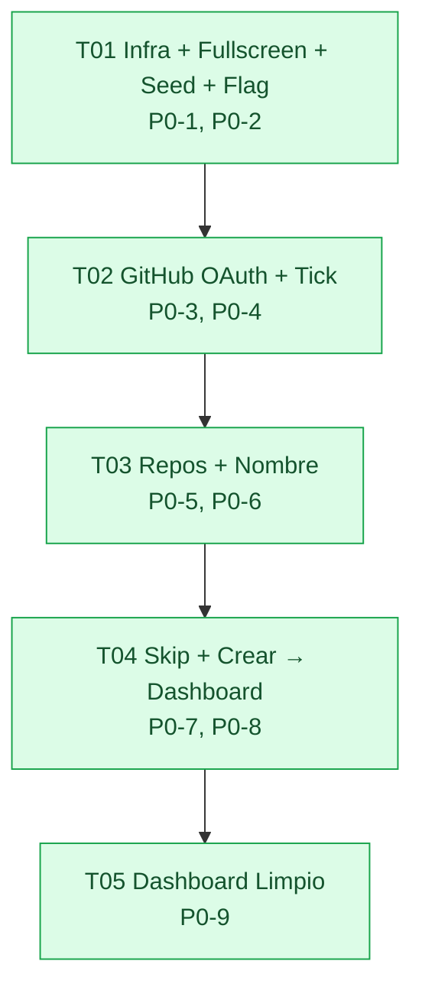

# ADR-003 — Onboarding Cero Fullscreen + Dashboard Limpio

> **Estado:** Accepted · 2026-08-30  
> **Autores:** Gao (Architect) · Equipo `software-termcanvas-pulido`  
> **Rama base:** `workbuddy/main-c2128e3a` HEAD O15 + ADR-002 (999→902 tests, `tsc -b 0`, `vite 2319 modules`, `WORKSPACE_STORAGE_KEY_V2`)  
> **Relacionado:** `docs/PRD-PULIDO-ONBOARDING.md` §8 (8 preguntas) · `ADR-001` (4 ports, `KeyValuePort`, `handle→ApiResponse`) · `ADR-002` (Hono :8787, SQLite, `FetchTransport`, `MaybePromise`, `isBackendEnabled()`) · `docs/ENV-MAP.md` B1 · `docs/BACKEND-TRIGGER.md`  
> **Scope:** `web/src/components/quickstart/**`, `web/src/components/dashboard/**`, `web/src/lib/factory/store/factoryWorkspace.store.ts`, `web/src/lib/factory/domain/quickstart.wizard.ts`, `web/src/lib/factory/domain/quickstart.data.ts`, `web/src/lib/factory/config/featureFlags.ts`, `web/src/App.tsx`, `web/src/main.tsx`, `server/src/**` (auth, github, repos)  
> **Constraints:** C1 OCP sin romper 902 tests · C2 stack congelado (Vite 8.2 + React 19.2 + TS 6.0 + Tailwind 4.1 + zod + yaml — **0 deps nuevas sin ADR**, PRD menciona MUI pero repo no la usa; no se añade) · C3 dominio puro sin `fetch`/`localStorage`/`window` · C4 fail-closed `local` (sin B1 no rompe `pnpm check`) · C5 token nunca en browser/bundle · C6 flag solo en composición raíz · C7 `tsc -b` gate canónico · C8 `localStorage` no destructivo  

---

## TL;DR — Respuestas a las 8 preguntas §8 (tabla decisión)

| § | Pregunta | **Decisión P0 (concreta)** | Alternativas descartadas (por qué) |
|---|----------|----------------------------|-------------------------------------|
| **Q1** | **OAuth vs GitHub App Install en local** | **GitHub OAuth App (Authorization Code) como P0**, con `server` como BFF que guarda `client_secret`. Scopes `repo read:user`. Callback `http://localhost:5173/auth/callback` (via `vite proxy /api/auth/callback → :8787`) o directo `:8787/api/auth/callback` sirviendo HTML `postMessage`. Interface `GitHubAuthPort` abstracta para swap a **GitHub App Install** en P1 sin tocar UI (`installation_id` + JWT). PAT solo fallback dev documentado con warning. | **GitHub App Install como P0:** requiere `APP_ID + PRIVATE_KEY + INSTALLATION_ID`, instalar en cada org, manejar `installation_token` + `GET /installation/repositories`; overkill para `repo listing` local y bloquea dev sin org admin. Se deja como **P1** detrás del mismo port. **PAT directo en web:** filtra token humano, rate-limit por usuario, no auditable. |
| **Q2** | **¿Dónde persistir conexión?** | **Híbrido C = token en server + cookie httpOnly + flag derivado en web.** Server guarda `access_token` en `data/github-session.json` (o tabla `sessions` SQLite) nunca en `VITE_*`. Set-Cookie `httpOnly, SameSite=Lax, Path=/, Max-Age=30d` con `sessionId` opaco. Web **no** guarda token en `localStorage`; solo lee `GET /api/auth/status → { connected, username, avatarUrl, scope }` y deriva `tick`. Token nunca se loguea (se maskea `gho_***`). | **(a) `localStorage` con token en web:** viola C5 ( `grep bundle` filtraría token, XSS lo roba). **(b) cookie con token directo:** expone token en cookie legible si no httpOnly. Híbrido es único que cumple boundary `execution` (ADR-002 9.3). |
| **Q3** | **Repo listing — endpoint y paginado** | **`GET /api/github/repos` → proxy a `GET https://api.github.com/user/repos?affiliation=owner,collaborator&sort=updated&per_page=30&page=1` con `Authorization: token <server-token>`**. P0 trae **30 primeros** (sin paginación UI). Server reenvía `Link` header para P2. `GET /api/github/repos?search=&page=` filtra `q` server-side case-insensitive. Para App Install P1: `GET /installation/repositories`. `per_page=100` solo si `Link: rel=next` indica >30. Rate-limit `403/429` → `ParseResult` `rate_limited` testeable. | **`GET /installation/repositories` como P0:** solo funciona con App Install, no con OAuth. **`GET /user/installations`:** lista instalaciones, no repos. **Traer 200+ de golpe en P0:** paga rate-limit sin necesidad; P0 30 es suficiente para <2min funnel. |
| **Q4** | **Fullscreen routing — ruta dedicada vs guarda condicional en `/`** | **Guarda condicional en `/` con alias `/quickstart` sin añadir `react-router`.** `App.tsx` lee `factoryCount = workspace.list().length` **sincrónico** vía `useSyncExternalStore` antes de renderizar `Sidebar`. Si `count===0` y `quickstart_fullscreen` flag ON → renderiza `<QuickstartFullscreen>` `100vw×100vh` sin shell; si `count>0` → shell. Alias `/quickstart` se soporta con `history.pushState` + `popstate` listener (0 deps). Evita flash con hydrate síncrono en `FactoryWorkspaceProvider`. | **`/quickstart` con `react-router-dom`:** añade dep nueva (requiere ADR), bundle +500kB warn, migra `App.tsx` de `nav.ts` a router, rompe 902 tests `hash`-based. Se deja como **P1** si se necesita deep-link real. **Solo `/` sin alias:** pierde testeabilidad `visit /quickstart → fullscreen`. |
| **Q5** | **Seed removal — destructiva vs soft** | **Hard removal en código + migración soft con confirmación.** `DEFAULT_FACTORY_SEED = []` (cero absoluto). `hydrate()` fallback `[]` si `V2` y `V1` vacíos/corruptos. Nueva `detectLegacySeeds(payload): boolean` detecta `name ∈ {payments-factory, termcanvas-factory} && repositories ⊆ acme/* && uid startsWith uid_payments|uid_termcanvas`. Si payload solo contiene seeds → **silently clear** a `[]` y `persistV2([])`. Si `seeds + user factories` → banner `"Limpiamos datos de demo (2 factories de prueba)"` con CTA `Confirmar / Conservar`. Nunca `localStorage.clear()` global. | **Borrado duro sin migración:** pierde datos de devs que ya crearon factories junto a seeds. **Soft hide (`isSeed` flag y `filter`):** deja basura en storage, nunca es cero absoluto (G1 falla), tests deben filtrar seeds forever. |
| **Q6** | **Validación tick — polling vs callback vs postMessage** | **Primario `postMessage` + fallback polling.** `window.open('/api/auth/github/start', '_blank', 'popup')` → server `302 github.com/login/oauth/authorize` → callback `GET /api/auth/callback?code=` → server `POST https://github.com/login/oauth/access_token` (con `client_secret` solo server), `set-cookie`, responde HTML `<script>window.opener.postMessage({type:'github:connected', username, avatar}, location.origin); window.close()</script>`. Pestaña original escucha `window.addEventListener('message', handler)` (valida `event.origin === location.origin` y `event.data.type`). Fallback: `poll GET /api/auth/status` cada `1500ms` hasta `60s` si popup bloqueado o `postMessage` perdido. | **`BroadcastChannel`:** solo mismo origin, no cruza `github.com`. **Solo polling:** latency + carga server, mala UX (tick tarda). **Solo `postMessage`:** frágil si popup bloqueado o user cierra sin `opener`. Híbrido es robusto con `vite proxy` (callback mismo origin). |
| **Q7** | **Crear factory — solo store local vs también server** | **Port `FactoryRepositoryPort.create()` único — local-first via adapter.** UI llama `workspace.create(toCreateFactoryInput(state))` sin saber modo. `LocalAdapter` → `FactoryWorkspaceStore` (`KeyValuePort` localStorage). `RemoteAdapter` → `RemoteFactoryRepo` → `POST /api/v1/factory` (valida con mismo `validateFactoryCreate` server-side, persiste SQLite, responde `201`). Sin duplicar lógica; `AdapterFactory` único `if (isBackendEnabled())`. P0 funciona offline local; P1 multi-client real. | **Solo store local:** no prepara multi-factory real (O16) y diverge de backend. **Siempre POST aunque local:** exige server corriendo para onboarding, rompe `C4 fail-closed`. **Duplicar `if` en cada página:** viola OCP/DIP. |
| **Q8** | **Dashboard empty vs loading — fuente de verdad** | **Fuente: `deriveDashboardMetricsFromItems(workItems, bundle)` puro (ya existe) + `workItems` del `WorkItemRepositoryPort`.** Cada widget tiene 3 estados: `Empty` (derive retorna `0/null/[]` → ilustración + CTA), `Loading` (skeleton mientras `hydrate()` fetch), `Data` (cuando `workItems.length>0`). Server no manda métricas mock; cuando haya datos reales, mismo derive los muestra sin cambiar layout. No `MSW` en prod; dev puede `POST /api/v1/factory/import` seed opcional solo para test manual, no bundleado. | **MSW mock en dev:** reintroduce hardcodeos por la ventana (PRD 4.2 must). **Endpoint `GET /api/dashboard/metrics` mockeado:** duplica derive y diverge de truth. Se deja `GET /api/dashboard/metrics` como **P1** opcional que simplemente serializa mismo derive server-side. |

> **Regla de oro:** si no se necesita para que `0 → GitHub tick → repos reales → nombre → skip Slack/Tracker → crear → Dashboard limpio` funcione E2E en `<2min` con `pnpm dev` sin credenciales extra, no entra en P0.

---

## 1. Implementation Approach

### Core technical challenges

1. **Cero absoluto sin mentir ni romper 902 tests.** `FactoryWorkspaceStore` hoy hidrata `DEFAULT_FACTORY_SEED` (2 factories) y `DEMO_REPOS` (4 repos fake). Challenge: pasar a `[]` sin que `App.tsx` haga flash de shell ni que `quickstart.test.ts` asuma repos demo. Solución: seed `[]` + migración `detectLegacySeeds` (ver Q5) + gate síncrono `factoryCount===0 → Fullscreen` con `useSyncExternalStore` (ver Q4). Tests se actualizan a `createMemoryPort({ [WORKSPACE_STORAGE_KEY_V2]: JSON.stringify({version:2, factories:[], selectedUid:""}) })` como Given cero.

2. **OAuth local sin exponer `client_secret` y sin deps nuevas.** `client_secret` no puede ir en `VITE_*`. Challenge: BFF en Hono `:8787` que hace `code → token` exchange server-side, setea `httpOnly` cookie, y comunica a opener via `postMessage` (Q6). `vite.config.ts` proxy `/api` → `:8787` ya existe; se extiende con `/auth` para que callback sea mismo origin y `postMessage` valide `origin`.

3. **Repo listing real con paginación diferida.** Challenge: no pagar costo de 200+ repos en P0, pero no bloquear power users. Solución Q3: P0 `per_page=30` + `Link` passthrough; P2 `?search=` + paginación server-side con `per_page=100` y `q` filter. Mapear errores `401 bad_credentials → reconnect`, `403 rate_limited`, `200 [] → empty CTA "Crear repo en GitHub"`.

4. **Fullscreen sin añadir `react-router-dom`.** Challenge: PRD pide `/quickstart` o `/` condicional. Añadir router viola C2 (stack congelado, nueva dep sin ADR) y reescribe `nav.ts`. Solución Q4: `App.tsx` gate condicional + `history.pushState` alias, 0 deps, testeable con `window.history.pushState`.

5. **Dashboard limpio con 3 estados por widget sin reintroducir mocks.** Challenge: `DashboardPage.tsx` hoy 8 `MetricCard` con valores fijos derivados de `deriveDashboardMetricsFromItems` pero con `workItemStore` vacío igual muestra `0` como data (no empty). Solución Q8: `DashboardEmptyState` component + `isEmpty(metrics)` helper puro (`totalRuns.total===0 && prsOpened===0 ...`) → render empty; `loading` skeleton mientras `RemoteWorkItemRepo` hydrating; nunca `Math.random()` ni `DEMO_REPOS`.

### Framework and library selections con justificación

| Capa | Elección P0 | Justificación (tradeoff) | Descartado |
|------|-------------|---------------------------|------------|
| **Frontend shell** | React 19.2 + Vite 8.2 + Tailwind 4.1 + `zod` (existente) — 0 nuevas | Stack congelado C2. `MUI` mencionada en PRD no está instalada (`package.json` no la lista); añadirla sería ADR + bundle + `2319→~3000 modules`. Tailwind + `clsx`/`tailwind-merge` ya cubren fullscreen card. | `MUI`, `react-router-dom`, `wouter` — requieren ADR, no aportan P0 |
| **State / Ports** | `FactoryRepositoryPort` / `WorkItemRepositoryPort` (`MaybePromise`) + `FactoryWorkspaceStore` + `RemoteFactoryRepo`/`RemoteWorkItemRepo` + `GitHubAuthPort` (nuevo) | OCP: UI no conoce local vs remote (ADR-002). `MaybePromise` permite `await syncValue` sin romper 902 tests. `GitHubAuthPort` aísla OAuth vs App Install. | Nuevo store ad-hoc para auth — duplicaría port |
| **Backend HTTP** | `hono@^4` + `@hono/node-server` (ya en ADR-002) en `server/` | Mismo para O16-O18, `fetch`-style, `zod-validator`, testeable con `app.fetch(Request)` sin server real. Mounts `/api/auth/*`, `/api/github/*`, `/api/v1/factory`. | `express`/`fastify` — más peso, mismo para 4 rutas |
| **Persistencia auth** | SQLite tabla `sessions` (o `data/github-session.json` file si SQLite no disponible) + `better-sqlite3@^9` / `node:sqlite` | Reusa ADR-002 DB. Single row `id=sessionId, access_token, username, avatar, scope, createdAt`. Alternativa file es 0 deps extra para P0. | `localStorage` token — viola C5. `Redis` — overkill local |
| **GitHub** | `fetch` nativo Node 18+ contra `https://github.com/login/oauth/*` y `https://api.github.com/*` | 0 deps nuevas. `@octokit/rest` opcional P1 para App Install, no necesario P0 OAuth code exchange (simple `POST` form). | `@octokit/auth-app` en P0 — innecesario sin App Install |
| **Validation** | `zod@^4` (ya en web) re-usado server para `code`, `search`, env schema | No nueva dep conceptual; mismo `code` testeable (`missing_name`, `rate_limited`, `bad_credentials`). | `joi`/`yup` — nueva dep |
| **Env** | `dotenv@^16` + `zod` env schema en `server/src/config/env.ts` (`GITHUB_CLIENT_ID`, `GITHUB_CLIENT_SECRET`, `GITHUB_OAUTH_CALLBACK_URL`) | `GITHUB_*` nunca en `VITE_*`. Fail-closed si no set → `GET /api/auth/status → {connected:false}` y UI muestra "Conectar". | `VITE_GITHUB_CLIENT_ID` — filtra secret |

**Bundle impact:** `server/` deps no afectan `web` bundle (`2319 modules` intacto). `web` 0 deps nuevas.

### Architecture patterns

- **Hexagonal / Ports & Adapters (DIP/OCP):** `domain/` puro ( `quickstart.wizard.ts`, `factory.record.ts`, `dashboard.derive.ts`) nunca importa `fetch`/`localStorage`/`window`. Nuevo `GitHubAuthPort` + `GitHubReposPort` definen contratos; `adapters/` (`LocalGitHubAuthAdapter` stub vs `RemoteGitHubAuthAdapter` via `FetchTransport`) intercambiables por flag. `QuickstartWizard` habla contra ports, no contra `window.open` directo (testeable).
- **Observer + Cache-Aside + Gate Síncrono:** `FactoryWorkspaceStore.subscribe`/`getVersion` + `useSyncExternalStore` ya existen. Gate fullscreen lee `list().length` sync antes de primer paint (no flash). `RemoteFactoryRepo` mantiene cache `Map` hidratada por `GET /api/v1/factory`.
- **Composition Root único:** `web/src/main.tsx` + `web/src/lib/factory/adapters/adapterFactory.ts` + `web/src/App.tsx` — únicos lugares que leen `isBackendEnabled()` / `isQuickstartFullscreenEnabled()`. Dominio y páginas no conocen flag.
- **BFF + httpOnly Cookie Boundary:** token nunca cruza `postMessage` ni `localStorage`; solo `username/avatar` via `postMessage` y `GET /auth/status`. `postMessage` valida `origin`.

---

## 2. File List

> Rutas relativas a repo root. `web/` es Vite existente; `server/` es backend Hono `:8787` de ADR-002 (se extiende, no se reescribe). Todo `server/` es Node-only, no va a bundle `web`. `web/src/lib/factory/domain/**` no se toca salvo `quickstart.data` (remover DEMO_REPOS hardcodeados de UI).

```
# ── T01 — Infra + Fullscreen routing + Seed removal + Flag ──
web/src/lib/factory/config/featureFlags.ts          # mod — añade isQuickstartFullscreenEnabled(), QUICKSTART_FULLSCREEN_FLAG, FACTORY_BACKEND_API_URL ya existe
web/src/lib/factory/store/factoryWorkspace.store.ts # mod — DEFAULT_FACTORY_SEED = [], hydrate fallback [], detectLegacySeeds() + clearLegacySeeds()
web/src/lib/factory/store/workspace.migration.ts    # mod — isV2Payload soporta factories:[] vacío, migrateIfNeeded no cae a seed si [] explícito
web/src/lib/factory/store/storage.port.ts           # verify — WORKSPACE_STORAGE_KEY_V2 usado para cero
web/src/App.tsx                                     # mod — gate fullscreen condicional + alias /quickstart via pushState, no Sidebar cuando count===0
web/src/main.tsx                                    # mod — documenta single if quickstart flag, sigue usando adapterFactory
web/src/components/quickstart/QuickstartFullscreen.tsx # nuevo — layout 100vw/vh, progress 7 dots, tarjeta centrada max 640px, sin shell
web/src/components/quickstart/QuickstartWizard.tsx  # mod — props githubAuth: GitHubAuthPort, githubRepos: GitHubReposPort, usa STEP_COPY sin DEMO_REPOS, paso 1 tick, paso 2 lista real
web/vite.config.ts                                  # mod — proxy "/api/auth" → http://localhost:8787, "/api/github" → :8787 (además de /api existente)

# ── T02 — GitHub connect + persist + tick (Q1+Q2+Q6) ──
web/src/lib/factory/ports/github.ports.ts           # nuevo — GitHubAuthPort, GitHubReposPort, GitHubAuthState, GitHubRepo (types puros)
web/src/lib/factory/adapters/githubAuth.adapter.ts  # nuevo — LocalGitHubAuthAdapter (noop) + RemoteGitHubAuthAdapter (fetch /api/auth/*, postMessage + polling)
web/src/lib/factory/hooks/useGitHubAuth.ts          # nuevo — hook useSyncExternalStore sobre GitHubAuthPort, expone { status, connect(), disconnect(), refresh() }
web/src/components/quickstart/steps/StepConnectProvider.tsx # nuevo — Paso 1: botón GitHub → window.open, tick verde, "Conectado @username", Reintentar/Reconectar
web/src/components/quickstart/steps/StepRepos.tsx   # nuevo — extraído de Wizard, lista real con skeleton, error, empty CTA
web/server/src/config/env.ts                       # mod — añade GITHUB_CLIENT_ID, GITHUB_CLIENT_SECRET, GITHUB_OAUTH_CALLBACK_URL, SESSION_SECRET
web/server/src/routes/auth.routes.ts                # nuevo — GET /api/auth/github/start, GET /api/auth/callback, GET /api/auth/status, POST /api/auth/logout
web/server/src/lib/githubAuth.service.ts            # nuevo — exchangeCode, getUser, maskToken, createSession, verifySession
web/server/src/db/sessions.repo.ts                  # nuevo — SQLite sessions table o file fallback (get/set/delete session)

# ── T03 — Repo listing + Nombre factory (Q3) ──
web/src/lib/factory/domain/quickstart.data.ts       # mod — DEMO_REPOS queda solo para tests legacy, Wizard no lo importa en prod; STEP_COPY intacto
web/src/lib/factory/domain/quickstart.wizard.ts     # verify — repos validation 1..2, factory name validation intacto
web/src/lib/factory/adapters/githubRepos.adapter.ts # nuevo — RemoteGitHubReposAdapter listRepos({page,per_page,search}) → fetch /api/github/repos
web/src/components/quickstart/steps/StepIdentity.tsx# nuevo — input nombre con validación inline 3-40 snake/kebab, preview slug, duplicado check
web/server/src/routes/github.routes.ts              # nuevo — GET /api/github/repos (proxy a api.github.com/user/repos, forward Link, map errors), GET /api/github/user
web/server/src/lib/githubRepos.service.ts           # nuevo — fetchUserRepos(token, {affiliation, sort, per_page, page, search}) + filter q

# ── T04 — Skip Slack/Tracker/MSP + Crear y navegar (Q7) ──
web/src/components/quickstart/steps/StepSlackSkip.tsx   # nuevo — Card "Slack queda en local, lo salteamos" + Continuar
web/src/components/quickstart/steps/StepAgents.tsx      # mod — lista informativa, no llama server, guarda preferencia local
web/src/components/quickstart/steps/StepTrackerMspSkip.tsx # nuevo — Dos bloques Tracker + MSP "No disponible en local" + Omitir y crear
web/src/components/quickstart/steps/StepReviewCreate.tsx   # nuevo — Resumen 3 filas (GitHub ✓, repo(s), nombre) + CTA "Crear factory y ir al Dashboard"
web/src/lib/factory/hooks/useQuickstart.ts          # mod — finish() usa workspace.create (port) + select + navigate via callback, no WorkItem create directo si no hace falta
web/src/lib/factory/adapters/adapterFactory.ts      # mod — expone githubAuth, githubRepos además de factoryRepo/workItemRepo

# ── T05 — Dashboard Limpio (Q8) ──
web/src/components/dashboard/DashboardPage.tsx        # mod — 8 MetricCard envueltas en isEmpty? EmptyState : Data; 0 skeletons, 0 números inventados; mantiene grid
web/src/components/dashboard/DashboardEmptyState.tsx  # nuevo — ilustración + mensaje honesto + CTA ("Conectá un repo", "Corré tu primer agente")
web/src/components/dashboard/MetricCard.tsx           # mod — prop empty?: boolean, cuando empty muestra <DashboardEmptyState> no valor
web/src/lib/factory/domain/dashboard.derive.ts        # verify — isEmpty helper puro, no se añade mock
web/src/lib/factory/domain/dashboard.types.ts         # verify — DashboardMetrics intacto
web/docs/ADR-003-onboarding-dashboard.md              # nuevo — este archivo
web/docs/class-diagram.mermaid                        # mod — agrega GitHubAuthPort + Fullscreen
web/docs/sequence-diagram.mermaid                     # mod — agrega flujo onboarding fullscreen (ver §4)
web/docs/RECEIPT.md                                   # mod — agrega O16+ pulido verification

# ── Tests P0 (colocados junto a código, 0 mocks globales) ──
web/src/lib/factory/__tests__/quickstart.fullscreen.test.tsx  # nuevo — Gherkin P0-1: count 0 → fullscreen sin sidebar, count>0 → shell
web/src/lib/factory/__tests__/factoryWorkspace.seed.test.ts   # nuevo — Gherkin P0-2: seed removal, legacy migration, confirm modal
web/src/lib/factory/__tests__/githubAuth.test.ts              # nuevo — Q1/Q2/Q6: OAuth start→callback→status, tick, poll fallback, token no en bundle
web/src/lib/factory/__tests__/githubRepos.test.ts             # nuevo — Q3: /user/repos affiliation, per_page 30, search, Link, rate_limited
web/src/lib/factory/__tests__/dashboard.empty.test.tsx        # nuevo — Q8: 8 métricas en empty, no hardcodeados, skeleton
web/src/lib/factory/__tests__/e2e.onboarding.test.tsx         # nuevo — Gherkin P0-8+9: 7 pasos → /factory/:id/dashboard limpio
```

**Totales O16+ pulido:** **~14 nuevos web/** + **~6 nuevos server/** + **~6 nuevos tests** + **~10 mods** = **~36 archivos**. `web bundle 2319→2319` (0 nuevas deps).

> **Nota stack:** `package.json` hoy no lista `@mui/material`; PRD §1 menciona MUI pero se respeta **stack congelado** — no se añade MUI sin ADR. Tailwind + `clsx` ya cumplen fullscreen card.

---

## 3. Data Structures and Interfaces

### 3.1 Class diagram (dominio + ports + adapters + server + fullscreen)

> Ver archivo extraído `web/docs/class-diagram.mermaid` (agregado O16+ pulido al diagrama G1-G5 + ADR-002).

```mermaid
classDiagram
    direction TB

    %% ─────────────── Dominio puro (existente, no tocar firma) ───────────────
    class ParseResult~T~ {
        +boolean ok
        +T value
        +ParseIssue[] issues
        +static ok(v) ParseResult
        +static fail(issues) ParseResult
        +static singleFail(path, message, code) ParseResult
    }
    class ParseIssue { +string path; +string message; +string code }

    class FactoryRecord {
        +string uid; +string name; +string alias
        +RepositoryRef[] repositories; +IntegrationType[] integrations
        +Record agentToggles; +string policyId; +string createdAt
    }
    class CreateFactoryInput { +string name; +string alias; +RepositoryRef[] repositories }
    class RepositoryRef { +string owner; +string name }

    class QuickstartState {
        +number stepIndex; +string provider; +RepositoryRef[] repos
        +string name; +string alias; +boolean aliasTouched
        +boolean slack; +Record agents; +string tracker; +boolean useMcpOnboarding
    }
    class QuickstartWizardService {
        <<module puro>>
        +QUICKSTART_STEPS string[]
        +initialQuickstartState() QuickstartState
        +quickstartReducer(state, action) QuickstartState
        +validateStep(state, existing) ParseResult~QuickstartState~
        +isStepComplete(state) boolean
        +toCreateFactoryInput(state) CreateFactoryInput
    }
    class DashboardMetrics {
        +TotalRunsMetric totalRuns; +number prsOpened; +number prsMerged
        +number autonomyPct; +number prCycleTimeMedianMs; +MostExpensivePR[] mostExpensivePrs
    }
    class DashboardDerive {
        <<module puro>>
        +deriveDashboardMetricsFromItems(items, bundle) DashboardMetrics
        +isEmpty(metrics) boolean
    }

    %% ─────────────── Ports existentes (ADR-001/002) ───────────────
    class FactoryRepositoryPort {
        <<interface>> +list() MaybePromise~FactoryRecord[]~
        +create(input) MaybePromise~ParseResult~FactoryRecord~~
        +subscribe(cb) Function; +getVersion() number
    }
    class WorkItemRepositoryPort {
        <<interface>> +list(filter?) MaybePromise~WorkItem[]~
        +subscribe(cb) Function; +getVersion() number
    }
    class FactoryApiTransportPort { <<interface>> +handle(req) Promise~ApiResponse~ }
    class KeyValuePort { <<interface>> +read(key) string; +write(key,value) void }
    class FactoryWorkspaceStore {
        -Map records; -KeyValuePort port; -string selectedUid; -Set listeners; -number version
        +list() FactoryRecord[]; +create(input) ParseResult~FactoryRecord~
        +subscribe(cb) Function; +getVersion() number
    }

    %% ─────────────── Nuevos Ports O16+ pulido (P0) ───────────────
    class GitHubAuthState {
        <<type>> +boolean connected; +string username; +string avatarUrl; +string scope
        +string status; // idle | connecting | connected | error | expired
    }
    class GitHubRepo {
        +string fullName; +string name; +string owner; +boolean private; +string updatedAt; +string htmlUrl
    }
    class GitHubAuthPort {
        <<interface>> +getStatus() Promise~GitHubAuthState~
        +startAuth() Promise~string~  // returns authUrl to open
        +handleCallback(code) Promise~GitHubAuthState~  // server does exchange
        +logout() Promise~void~
        +subscribe(cb) Function; +getVersion() number
    }
    class GitHubReposPort {
        <<interface>> +listRepos(opts) Promise~ParseResult~GitHubRepo[]~~
        +searchRepos(q) Promise~ParseResult~GitHubRepo[]~~
    }
    class FeatureFlags {
        <<module>> +boolean isBackendEnabled(); +boolean isQuickstartFullscreenEnabled()
        +string FACTORY_BACKEND_API_URL
    }

    %% ─────────────── Adapters web (nuevo O16+ pulido) ───────────────
    class RemoteGitHubAuthAdapter {
        -string baseUrl; -FetchTransport transport; -GitHubAuthState cache; -Set listeners; -number version
        +getStatus() Promise~GitHubAuthState~; +startAuth() Promise~string~
        +connectWithPopup() Promise~GitHubAuthState~  // window.open + postMessage + poll fallback
        +subscribe(cb) Function; -notify() void
    }
    class RemoteGitHubReposAdapter {
        -FetchTransport transport
        +listRepos(opts) Promise~ParseResult~GitHubRepo[]~~
    }
    class QuickstartFullscreen {
        <<component>> +QuickstartWizard + progress 1/7..7/7 + card 640px
        -uses GitHubAuthPort; -uses GitHubReposPort
    }
    class DashboardEmptyState {
        <<component>> +illustration + message + CTA
    }
    class AdapterFactory {
        <<module>> +createFactoryAdapters(mode) { factoryRepo, workItemRepo, transport, githubAuth, githubRepos }
    }

    %% ─────────────── Server Hono :8787 (extiende ADR-002) ───────────────
    class HonoApp {
        -Hono app; -Database db; -Env env
        +fetch(req) Response
    }
    class GitHubAuthService {
        <<service>> -Env env; +mode: "real"|"dry_run"
        +getAuthorizeUrl(state) string
        +exchangeCode(code) Promise~{ access_token, token_type, scope }~
        +getUser(token) Promise~{ login, avatar_url }~
        +verifyToken(token) Promise~boolean~
        +maskToken(token) string
    }
    class SessionsRepo {
        -Database db
        +create(sessionId, token, username) void; +get(sessionId) Session|undefined
        +delete(sessionId) void; +getByToken(token) Session|undefined
    }
    class GitHubReposService {
        <<service>> +listUserRepos(token, opts) Promise~{ repos, link }~
        +searchRepos(token, q) Promise~GitHubRepo[]~
    }
    class AuthRoutes {
        <<routes>> +GET /api/auth/github/start → 302 github.com
        +GET /api/auth/callback → set-cookie + postMessage HTML
        +GET /api/auth/status → { connected, username, avatar }
        +POST /api/auth/logout → clear cookie
    }
    class GithubRoutes {
        <<routes>> +GET /api/github/repos → proxy api.github.com/user/repos
        +GET /api/github/user → proxy api.github.com/user
    }

    %% ─────────────── Relaciones ───────────────
    FactoryWorkspaceStore ..|> FactoryRepositoryPort
    FactoryWorkspaceStore --> KeyValuePort
    RemoteGitHubAuthAdapter ..|> GitHubAuthPort
    RemoteGitHubReposAdapter ..|> GitHubReposPort
    RemoteGitHubAuthAdapter --> FetchTransport : usa handle()
    RemoteGitHubReposAdapter --> FetchTransport
    AdapterFactory ..> FactoryRepositoryPort : elige Local vs Remote
    AdapterFactory ..> GitHubAuthPort
    AdapterFactory ..> GitHubReposPort
    FeatureFlags ..> AdapterFactory : isQuickstartFullscreenEnabled()
    QuickstartFullscreen --> GitHubAuthPort : tick
    QuickstartFullscreen --> GitHubReposPort : lista real
    QuickstartFullscreen --> FactoryRepositoryPort : crea factory
    QuickstartWizardService ..> QuickstartState
    QuickstartWizardService ..> CreateFactoryInput
    DashboardDerive ..> DashboardMetrics
    DashboardEmptyState ..> DashboardDerive : isEmpty()
    HonoApp --> GitHubAuthService
    HonoApp --> SessionsRepo
    HonoApp --> GitHubReposService
    HonoApp --> AuthRoutes
    HonoApp --> GithubRoutes
    AuthRoutes ..> GitHubAuthService : exchangeCode
    AuthRoutes ..> SessionsRepo : create session
    GithubRoutes ..> GitHubReposService : listUserRepos
    ParseResult "1" o-- "*" ParseIssue

```

**Notas OCP:**
- `FactoryWorkspaceStore` firma intacta salvo `DEFAULT_FACTORY_SEED = []` y helper `detectLegacySeeds` (aditivo).
- `GitHubAuthPort`/`GitHubReposPort` son nuevos, no mutan `FactoryRepositoryPort` (ISP).
- `MaybePromise<T>` ya widen en ADR-002; `Remote*Adapter` retornan `Promise`, `Local` sync — callers `await` ambos.
- `domain/` nunca importa `window`/`fetch`/`localStorage`.

---

## 4. Program Call Flow

### 4.1 Diagrama onboarding flow fullscreen (P0-1..P0-9)

> Ver archivo extraído `web/docs/sequence-diagram.mermaid` (O16+ pulido agregado).

```mermaid
sequenceDiagram
    autonumber
    actor User as Usuario local
    participant App as App.tsx<br/>Gate fullscreen
    participant WSS as FactoryWorkspaceStore<br/>(KeyValuePort)
    participant Flag as featureFlags.ts<br/>isQuickstartFullscreenEnabled()
    participant QFS as QuickstartFullscreen<br/>100vw/vh
    participant QW as QuickstartWizard<br/>+ useQuickstart
    participant GAuth as GitHubAuthPort<br/>RemoteGitHubAuthAdapter
    participant GRepos as GitHubReposPort<br/>RemoteGitHubReposAdapter
    participant FT as FetchTransport<br/>/api → :8787
    participant Hono as Hono :8787<br/>auth.routes + github.routes
    participant GH as api.github.com<br/>+ github.com/login/oauth
    participant DB as SQLite<br/>sessions + factories
    participant Dash as DashboardPage<br/>+ DashboardEmptyState

    Note over User, Dash: ── P0-1 Fullscreen routing — cero absoluto ──
    User->>App: abre "/" con localStorage limpio
    App->>Flag: isQuickstartFullscreenEnabled() → true (default local)
    App->>WSS: list() sync (read WORKSPACE_STORAGE_KEY_V2)
    WSS-->>App: [] (0 factories, seed removido)
    alt factoryCount===0 && flag ON
        App->>QFS: render fullscreen (no Sidebar, no header)
        QFS->>QW: monta stepIndex 0 "Conectar GitHub"
        QW-->>User: ve tarjeta 640px, progress 1/7, "Local only — no se envía nada fuera de tu máquina"
    else factoryCount>0
        App-->>User: render shell (Sidebar + Dashboard)
    end

    Note over User, GH: ── P0-3 + P0-4 GitHub connect en pestaña aparte + tick persistido ──
    User->>QW: click "Conectar con GitHub"
    QW->>GAuth: connectWithPopup()
    GAuth->>FT: handle({ method:"GET", path:"/api/auth/github/start" })
    FT->>Hono: GET /api/auth/github/start
    Hono-->>FT: 302 https://github.com/login/oauth/authorize?client_id=...&scope=repo%20read:user&state=xyz&redirect_uri=http://localhost:5173/auth/callback
    FT-->>GAuth: { authUrl }
    GAuth->>GAuth: window.open(authUrl, "_blank", "popup,width=600,height=700")
    GH-->>User: GitHub authorize page (pestaña aparte)
    User->>GH: autoriza (Allow)
    GH->>Hono: GET /api/auth/callback?code=abc&state=xyz
    Hono->>Hono: POST https://github.com/login/oauth/access_token {client_id, client_secret (solo server), code}
    GH-->>Hono: 200 { access_token=gho_***, scope="repo,read:user" }
    Hono->>GH: GET https://api.github.com/user (Authorization: token gho_***)
    GH-->>Hono: 200 { login:"wilson", avatar_url:"..." }
    Hono->>DB: INSERT sessions (sessionId=opaque, token=gho_***, username, avatar)
    Hono-->>GAuth: 200 HTML <script>window.opener.postMessage({type:'github:connected', username:"wilson"}, "http://localhost:5173"); window.close()</script> + Set-Cookie: sessionId=...; HttpOnly; SameSite=Lax
    GAuth->>GAuth: addEventListener('message', handler) → valida origin, type==='github:connected'
    GAuth->>FT: handle GET /api/auth/status (poll fallback cada 1500ms si postMessage perdido)
    FT->>Hono: GET /api/auth/status (Cookie: sessionId)
    Hono->>DB: SELECT sessions WHERE id=sessionId
    DB-->>Hono: { connected:true, username:"wilson", avatarUrl:"..." }
    Hono-->>GAuth: 200 { connected:true }
    GAuth->>GAuth: cache={connected:true}; notify() → version++
    GAuth-->>QW: status connected → tick verde "GitHub conectado @wilson" + Continuar habilitado
    User->>QW: click Continuar → next (step 1/7 → 2/7)

    Note over User, GH: ── P0-5 Repo listing real ──
    QW->>GRepos: listRepos({ page:1, per_page:30 })
    GRepos->>FT: handle GET /api/github/repos?per_page=30&page=1
    FT->>Hono: GET /api/github/repos
    Hono->>DB: SELECT sessions WHERE id=cookie → token
    Hono->>GH: GET https://api.github.com/user/repos?affiliation=owner,collaborator&sort=updated&per_page=30&page=1 (Authorization: token gho_***)
    GH-->>Hono: 200 [{ full_name:"wilson/mi-repo-real", private:false, updated_at:"..." }, ...] + Link header
    Hono-->>GRepos: 200 { repos, link }
    GRepos-->>QW: ParseResult.ok(repos)
    QW-->>User: lista scrollable con checkbox/radio + updated_at + private badge; skeleton mientras loading; empty "No tenés repos — Crear repo en GitHub" si []
    User->>QW: selecciona "wilson/mi-repo-real" → Continuar habilitado
    QW->>QW: quickstartReducer toggleRepo → repos=[{owner:"wilson", name:"mi-repo-real"}]

    Note over User, Dash: ── P0-6 Nombre factory custom ──
    User->>QW: escribe "mi-factory" (input)
    QW->>QW: validateFactoryName("mi-factory", existing) + slug preview "mi-factory"
    alt duplicado o charset inválido
        QW-->>User: error inline "Ya existe..." / "solo [A-Za-z0-9 ._-]"
    else válido 3-40
        QW-->>User: tick + Continuar habilitado
    end
    User->>QW: click Continuar → step 4

    Note over User, Dash: ── P0-7 Skip Slack / Tracker / MSP explícitos ──
    QW-->>User: Paso 4 card "Slack queda en local, lo salteamos por ahora" + Omitir/Continuar
    User->>QW: click Continuar (skip explícito)
    QW-->>User: Paso 5 agentes (lista informativa, guarda preferencia, no llama server)
    User->>QW: elige agentes → Continuar
    QW-->>User: Paso 6 Tracker + MSP "No disponible en local" + Omitir y crear
    User->>QW: click Omitir y crear → step 7 review

    Note over User, Dash: ── P0-8 Crear y navegar a Dashboard de esa factory ──
    QW-->>User: Paso 7 resumen 3 filas: GitHub ✓ wilson, Repo(s) wilson/mi-repo-real, Nombre mi-factory + CTA "Crear factory y ir al Dashboard"
    User->>QW: click Crear factory
    QW->>QW: toCreateFactoryInput({name:"mi-factory", repos:[...], integrations:[], agentToggles})
    QW->>WSS: create(input) → validateFactoryCreate + persist
    alt LocalAdapter (VITE_FACTORY_BACKEND !== remote)
        WSS->>WSS: write WORKSPACE_STORAGE_KEY_V2 JSON
    else RemoteAdapter (VITE_FACTORY_BACKEND===remote)
        WSS->>FT: POST /api/v1/factory { name, alias, repositories }
        FT->>Hono: POST /api/v1/factory
        Hono->>Hono: validateFactoryCreate (mismo code)
        Hono->>DB: INSERT factories (uid, name, alias, data)
        DB-->>Hono: ok
        Hono-->>WSS: 201 { factory }
        WSS->>WSS: cache.set + notify()
    end
    WSS-->>QW: ParseResult.ok(factory {uid:"uid_mi-factory_1", name:"mi-factory"})
    QW->>App: navigate("/factory/uid_mi-factory_1/dashboard") via pushState + callback onComplete
    App-->>User: redirect directo a Dashboard de esa factory (no listado genérico)

    Note over User, Dash: ── P0-9 Dashboard sin hardcodeados ──
    User->>Dash: entra a /factory/:id/dashboard
    Dash->>WSS: list() → [mi-factory] con repositories=[wilson/mi-repo-real]
    Dash->>GRepos: deriveDashboardMetricsFromItems(workItems=[], bundle=null)
    alt workItems.length===0 (cero actividad)
        Dash-->>User: Grid 2x4 cards cada una en Empty: icono tenue + "Sin datos todavía — Tus métricas van a aparecer acá cuando tu factory tenga actividad" + CTA "Vincular otro repo" (si GitHub conectado)
        Dash-->>User: Actividad reciente → "Nada por acá aún — creá tu primera tarea o conectá un repo" + ilustración
        Dash-->>User: Repos vinculados → lista real [wilson/mi-repo-real] + CTA deshabilitado si no GitHub
        Note right of Dash: 0 números inventados, 0 gráficos falsos, no layout shift
    else loading (hydrate fetch pending)
        Dash-->>User: skeletons MUI/Tailwind consistentes, no spinner eterno
    else con datos reales (workItems>0)
        Dash-->>User: Data — MetricCard value real + breakdown
    end

    Note over User, Dash: ── P1 — Revalidación y guard ──
    User->>GAuth: recarga página al día siguiente
    GAuth->>FT: GET /api/auth/status (Cookie sessionId)
    alt token válido
        Hono-->>GAuth: {connected:true} → tick directo sin reconectar
    else token expirado/revocado 401
        Hono-->>GAuth: 401 { code:"bad_credentials" }
        GAuth-->>QW: estado "Reconectar" + CTA reabre popup
    end
    User->>App: intenta navegar directo a /factory/mi-factory/dashboard sin completar paso 1
    App->>GAuth: getStatus() → connected false
    App-->>User: guard redirige a /quickstart paso 1 (no se puede saltear 1-3 por URL)
```

**Boundaries explicit:** `Browser (identity consumer)` → `Hono :8787 (execution, guarda token)` → `github.com / api.github.com (provider)`; token nunca en `postMessage` ni bundle.

---

## 5. Anything UNCLEAR (asunciones)

| # | Aspecto | Asunción tomada | Qué falta validar con Product |
|---|---------|-----------------|-------------------------------|
| A1 | **Repo selección single vs multi** | PRD §3.2 dice single (v1) o multi con límite; se asume **single en P0** (radio), `repos.length===1` valida; multi 1..2 deja como P1 tras medir UX. | Confirmar si multi 2 es must P0 o should |
| A2 | **MUI en PRD vs Tailwind real** | Repo usa Tailwind 4.1 + `clsx`, no `@mui/material`; se asume **no añadir MUI** (stack congelado). Fullscreen card se hace con Tailwind. Si se exige MUI, requiere ADR aparte. | ¿MUI es requisito o mención genérica? |
| A3 | **Vite proxy port** | `vite.config.ts` actual `port:5174` proxy `/api→:8787`; PRD menciona `5173`. Se asume **5174 es puerto real**, callback `http://localhost:5174/auth/callback` y docs se actualizan a 5174. | Unificar puerto en PRD |
| A4 | **Flag `quickstart_fullscreen` persistencia** | Se asume flag **build-time** `VITE_QUICKSTART_FULLSCREEN` default `true` en local, `false` toggle para rollback sin deploy (cambiar env y reload). No se persiste en `localStorage` para evitar desync. | ¿Flag runtime (`GET /config`) necesario P1? |
| A5 | **GitHub OAuth App credentials en local** | Se asume cada dev crea su OAuth App en `github.com/settings/developers` con `Authorization callback URL = http://localhost:5174/auth/callback` y pone `GITHUB_CLIENT_ID/SECRET` en `server/.env` (gitignored). Sin ellos → `dry-run` con banner, no bloquea `pnpm check`. | Documentar en `ENV-MAP.md` |
| A6 | **Navegación post-creación** | PRD §3.1 dice `/factory/:factoryId/dashboard` pero `nav.ts` hoy no tiene rutas URL (es `NavItemId` hash). Se asume **pushState `/factory/:uid/dashboard`** y `App.tsx` parsea `window.location.pathname` para seleccionar `Dashboard` + `factoryId`. Sin `react-router`. | ¿Migrar a `react-router-dom` en P1? |
| A7 | **`server/src/lib/githubApp.ts` mencionado en PRD** | No existe en worktree actual (glob no lo encontró); se asume **se crea en T02** como `githubAuth.service.ts + githubRepos.service.ts` (renombrado) y PRD referencia es prospectiva. | Confirmar nombre final |
| A8 | **Dashboard métricas futuras** | Se asume **no endpoint `GET /api/dashboard/metrics` en P0**; Dashboard deriva de `WorkItemStore` local/remote. Endpoint P1 solo serializa mismo derive. | ¿Backend debe computar métricas P0? |

---

## 6. Required Packages

```
# server/ — extiende ADR-002, no afecta web bundle (aislado)
hono@^4.7.0: framework HTTP (ya en ADR-002)
@hono/node-server@^1.13.0: adaptador Node (ya en ADR-002)
better-sqlite3@^9.2.0: SQLite sync (ya en ADR-002) — para sessions + factories
zod@^4.5.4: validación env + query (ya en web, re-usado server)
dotenv@^16.4.0: env loader server (ya en ADR-002)

# web/ — 0 deps nuevas (stack congelado)
# fetch nativo (browser + Node 18+) para FetchTransport + OAuth exchange
# Sin react-router-dom, sin @mui/material, sin @octokit/rest en P0 (fetch nativo alcanza)
# Si App Install P1 → añadir @octokit/rest@^21 + @octokit/auth-app@^7 con ADR previa
```

**Justificación bundle:** `web` permanece `2319 modules`; `server/` aislado. `VITE_*` no expone secretos.

---

## 7. Task List (ordenado por dependencia) — máximo 5 tareas

> Regla hard: 1ª tarea = infra; cada tarea ≥3 archivos; agrupadas por capa, no por archivo; dependencias mínimas.

| ID | Nombre | Archivos (from §2) | Depende | Priority | P0 cubiertos |
|----|--------|---------------------|---------|----------|--------------|
| **T01** | **Infra + Fullscreen routing + Seed removal + Flag** | `web/src/lib/factory/config/featureFlags.ts`, `web/src/lib/factory/store/factoryWorkspace.store.ts`, `web/src/lib/factory/store/workspace.migration.ts`, `web/src/App.tsx`, `web/src/main.tsx`, `web/src/components/quickstart/QuickstartFullscreen.tsx`, `web/src/components/quickstart/QuickstartWizard.tsx`, `web/vite.config.ts`, `web/src/lib/factory/domain/quickstart.data.ts` | — | **P0** | **P0-1** Fullscreen, **P0-2** seeds |
| **T02** | **GitHub OAuth connect + persist + tick (popup + cookie)** | `web/src/lib/factory/ports/github.ports.ts`, `web/src/lib/factory/adapters/githubAuth.adapter.ts`, `web/src/lib/factory/hooks/useGitHubAuth.ts`, `web/src/components/quickstart/steps/StepConnectProvider.tsx`, `server/src/routes/auth.routes.ts`, `server/src/lib/githubAuth.service.ts`, `server/src/db/sessions.repo.ts`, `server/src/config/env.ts` | T01 | **P0** | **P0-3** pestaña aparte, **P0-4** tick persistido |
| **T03** | **Repo listing real + Nombre factory** | `web/src/lib/factory/adapters/githubRepos.adapter.ts`, `web/src/components/quickstart/steps/StepRepos.tsx`, `web/src/components/quickstart/steps/StepIdentity.tsx`, `server/src/routes/github.routes.ts`, `server/src/lib/githubRepos.service.ts`, `web/src/lib/factory/domain/quickstart.wizard.ts` | T02 | **P0** | **P0-5** repos reales, **P0-6** nombre custom |
| **T04** | **Skip Slack/Tracker/MSP + Crear y navegar a Dashboard** | `web/src/components/quickstart/steps/StepSlackSkip.tsx`, `web/src/components/quickstart/steps/StepAgents.tsx`, `web/src/components/quickstart/steps/StepTrackerMspSkip.tsx`, `web/src/components/quickstart/steps/StepReviewCreate.tsx`, `web/src/lib/factory/hooks/useQuickstart.ts`, `web/src/lib/factory/adapters/adapterFactory.ts` | T03 | **P0** | **P0-7** skip explícito, **P0-8** crear + navigate |
| **T05** | **Dashboard Limpio — 8 métricas a empty + skeletons** | `web/src/components/dashboard/DashboardPage.tsx`, `web/src/components/dashboard/DashboardEmptyState.tsx`, `web/src/components/dashboard/MetricCard.tsx`, `web/src/lib/factory/domain/dashboard.derive.ts`, `web/src/lib/factory/__tests__/dashboard.empty.test.tsx` | T04 | **P0** | **P0-9** sin hardcodeados |

**Notas:**
- T01 debe mergear primero (gate fullscreen sin flash es prerrequisito para probar T02-T04). T02→T03→T04 es cadena lineal por flujo 7 pasos; T05 solo depende de T04 (factory creada) pero se deja al final para no mezclar onboarding con dashboard.
- Frontier width máx 1 en P0 crítico (funnel secuencial); T05 podría paralelizarse con T03 si se quiere, pero se mantiene lineal para simplicidad.

---

## 8. Shared Knowledge

```
- Dominio puro: web/src/lib/factory/domain/** nunca importa fetch, window, localStorage, Request, document. Solo ports/adapters y hooks conocen I/O.
- Ports son la verdad: FactoryRepositoryPort, WorkItemRepositoryPort, GitHubAuthPort, GitHubReposPort (MaybePromise<T>=T|Promise<T>). Local sync, Remote async; callers siempre await.
- Feature flags solo en composición raíz: web/src/main.tsx, web/src/lib/factory/adapters/adapterFactory.ts, web/src/App.tsx leen isBackendEnabled() / isQuickstartFullscreenEnabled(). Prohibido en domain/ o páginas.
- Stack congelado: Vite 8.2 + React 19.2 + TS 6.0 + Tailwind 4.1 + zod + yaml. 0 deps nuevas sin ADR. No se añade @mui/material ni react-router-dom en P0.
- Token boundary: GITHUB_CLIENT_SECRET y access_token solo en server/src/** (process.env, sessions DB). Nunca en VITE_*, nunca en bundle, nunca en postMessage, nunca en logs (mask gho_***). Cookie httpOnly SameSite=Lax.
- Fullscreen UX: factoryCount===0 + flag ON → QuickstartFullscreen 100vw/vh, sin Sidebar/Header, progress 7 dots, tarjeta max 640px, footer "Local only — no se envía nada fuera de tu máquina". Si count>0 → shell. Alias /quickstart vía pushState, no react-router.
- Seed zero: DEFAULT_FACTORY_SEED=[]; hydrate fallback []; detectLegacySeeds() no borra localStorage global; banner confirm si seeds + user data.
- Repo listing: GET /api/github/repos?per_page=30&page=1&affiliation=owner,collaborator&sort=updated; search case-insensitive server-side; Link header passthrough para P2; errores mapeados a ParseResult codes (bad_credentials, rate_limited).
- Tick validación: postMessage primario (origin check) + poll GET /api/auth/status 1500ms×60s fallback; tick verde "GitHub conectado @username" + avatar; expired → "Reconectar".
- Crear factory: single path workspace.create() via port; validación 3-40 chars snake/kebab, case-insensitive unique; post-creación navigate(/factory/:uid/dashboard) directo.
- Dashboard: deriveDashboardMetricsFromItems es fuente de verdad; isEmpty(metrics) → EmptyState + CTA; loading → skeleton; data → MetricCard real; 0 mocks, 0 gráficos falsos.
- Proxy dev: vite.config.ts → "/api"→:8787, "/api/auth"→:8787, "/api/github"→:8787; getEffectiveBaseUrl() retorna "" en localhost para usar proxy y eludir CSP.
- tsc -b es gate canónico (erasableSyntaxOnly, verbatimModuleSyntax). pnpm check = tsc --noEmit && tsc -b && vitest --pool=threads && vite build && oxlint.
- Gherkin es DoD: cada P0 tiene scenario en PRD §5; tests nombran describe("Gherkin P0-x").
- Local-first fail-closed: sin GITHUB_CLIENT_ID/SECRET → GET /api/auth/status → {connected:false}, UI muestra Conectar, pnpm check verde (dry-run banner).
```

---

## 9. Task Dependency Graph



> Lineal a propósito: el funnel 7 pasos es secuencial; paralelizar T05 con T03 es posible pero no aporta P0.

---

## 10. Diseño por ola ejecutable — P0-1..P0-9 con DoD + tests + OCP + fullstack

> Cada P0 mapea a Gherkin del PRD §5. Fullstack = `pnpm --filter server dev` Hono `:8787` + `pnpm --filter web dev` Vite `:5174` con proxy. `data/` gitignored.

### P0-1 Fullscreen routing (T01)

- **Archivos:** `web/src/App.tsx`, `web/src/components/quickstart/QuickstartFullscreen.tsx`, `web/src/lib/factory/config/featureFlags.ts`, `web/src/lib/factory/store/FactoryWorkspaceProvider.tsx`
- **Interfaces:**
  ```ts
  // web/src/lib/factory/config/featureFlags.ts
  export const QUICKSTART_FULLSCREEN_FLAG = "quickstart_fullscreen";
  export function isQuickstartFullscreenEnabled(): boolean {
    const raw = (import.meta.env.VITE_QUICKSTART_FULLSCREEN as string | undefined)?.trim().toLowerCase();
    if (raw === "false" || raw === "0" || raw === "off") return false;
    return true; // default ON en local (fail-closed a fullscreen en cero)
  }
  // web/src/App.tsx — gate síncrono
  function useFactoryCount(): number {
    const ws = useFactoryWorkspaceStore();
    return useSyncExternalStore(ws.subscribe, () => ws.list().length, () => 0);
  }
  ```
- **OCP:** `nav.ts` y `Sidebar.tsx` no mutados; `App.tsx` añade gate antes de `renderContent()`, no reescribe routing. `QuickstartFullscreen` es nuevo, no toca `QuickstartWizard` firma.
- **Proxy:** no necesita backend.
- **DoD:**
  - [ ] `Given 0 factories` → visito `/` → veo `QuickstartFullscreen` `100vw/vh`, no `Sidebar`, `Step 1 de 7 — Conectar GitHub` visible.
  - [ ] `Given 1 factory` → visito `/` → veo shell con `Sidebar`, no fullscreen.
  - [ ] Visito `/quickstart` con 0 factories → mismo fullscreen (alias).
  - [ ] No flash: primera pintura ya es fullscreen (no sidebar 1 frame).
- **Tests:**
  ```ts
  // web/src/lib/factory/__tests__/quickstart.fullscreen.test.tsx
  describe("Gherkin P0-1 fullscreen en cero", () => {
    it("renderiza fullscreen sin shell cuando count 0", async () => {
      const port = createMemoryPort({ [WORKSPACE_STORAGE_KEY_V2]: JSON.stringify({version:2, factories:[], selectedUid:""}) });
      const ws = new FactoryWorkspaceStore(port, []); // seed []
      render(<FactoryWorkspaceProvider store={ws}><App /></FactoryWorkspaceProvider>);
      expect(screen.getByText(/Paso 1 de 7/)).toBeInTheDocument();
      expect(screen.queryByTestId("sidebar")).not.toBeInTheDocument();
    });
    it("no muestra fullscreen cuando count>0", () => { /* ... */ });
  });
  ```

### P0-2 Remover seeds (T01)

- **Archivos:** `web/src/lib/factory/store/factoryWorkspace.store.ts` (`DEFAULT_FACTORY_SEED = []`), `web/src/lib/factory/store/workspace.migration.ts`, `web/src/lib/factory/__tests__/factoryWorkspace.seed.test.ts`
- **Interfaces:**
  ```ts
  // factoryWorkspace.store.ts
  export const DEFAULT_FACTORY_SEED: readonly FactoryRecord[] = []; // cero absoluto
  export function isLegacySeed(record: FactoryRecord): boolean {
    return (record.name === "payments-factory" || record.name === "termcanvas-factory")
        && record.repositories.every(r => r.owner === "acme")
        && record.uid.startsWith("uid_payments") || record.uid.startsWith("uid_termcanvas");
  }
  export function detectLegacySeeds(payload: PersistedWorkspaceV2): { onlySeeds: boolean; hasSeeds: boolean } { /* ... */ }
  ```
- **OCP:** `hydrate()` añade rama `if (detectLegacySeeds(v2).onlySeeds) { persistV2(empty) }` sin romper `readPersistedV2`/`persistV2`. Dual-write `V1` se mantiene.
- **DoD:**
  - [ ] `localStorage` limpio → `ws.list() === []`.
  - [ ] `localStorage` con solo 2 seeds → al arrancar queda `[]` (silently cleared).
  - [ ] `localStorage` con `seeds + mi-factory` → banner con `Confirmar`/`Conservar`, no borrado automático.
  - [ ] `grep -r "payments-factory" web/src --exclude="*.test.*"` sin `DEFAULT_FACTORY_SEED` hardcode.
- **Tests:** `factoryWorkspace.seed.test.ts` cubre 3 casos + `workspace.migration.test.ts` empty `[]` no cae a seed.

### P0-3 GitHub connect en pestaña aparte + P0-4 Persistencia + tick (T02)

- **Archivos:** `web/src/lib/factory/ports/github.ports.ts`, `web/src/lib/factory/adapters/githubAuth.adapter.ts`, `web/src/lib/factory/hooks/useGitHubAuth.ts`, `web/src/components/quickstart/steps/StepConnectProvider.tsx`, `server/src/routes/auth.routes.ts`, `server/src/lib/githubAuth.service.ts`, `server/src/db/sessions.repo.ts`, `web/vite.config.ts`
- **Interfaces:**
  ```ts
  // web/src/lib/factory/ports/github.ports.ts — dominio puro, sin window/fetch
  export type GitHubAuthStatus = "idle" | "connecting" | "connected" | "error" | "expired";
  export interface GitHubAuthState { readonly status: GitHubAuthStatus; readonly connected: boolean; readonly username?: string; readonly avatarUrl?: string; readonly scope?: string; readonly errorCode?: string; }
  export interface GitHubAuthPort {
    getStatus(): Promise<GitHubAuthState>;
    startAuth(): Promise<string>; // authUrl
    connectWithPopup(): Promise<GitHubAuthState>; // abre popup + postMessage + poll
    logout(): Promise<void>;
    subscribe(cb: () => void): () => void; getVersion(): number;
  }
  // server/src/lib/githubAuth.service.ts
  export async function exchangeCode(code: string, env: Env): Promise<{ access_token: string; scope: string }>;
  export async function getUser(token: string): Promise<{ login: string; avatar_url: string }>;
  export function maskToken(token: string): string; // gho_***abc
  // server/src/routes/auth.routes.ts — Hono
  // GET /api/auth/github/start → 302 github.com/login/oauth/authorize?client_id&scope&state&redirect_uri
  // GET /api/auth/callback?code&state → exchange + set-cookie sessionId HttpOnly + HTML postMessage + close
  // GET /api/auth/status → { connected, username, avatarUrl } (lee cookie sessionId → sessions DB)
  // POST /api/auth/logout → delete session + clear cookie
  ```
- **OCP:** Nuevo port, no muta `FactoryRepositoryPort`. `QuickstartWizard` recibe `githubAuth: GitHubAuthPort` por props (DIP), no `window.open` directo.
- **Fullstack:** `vite dev :5174` proxy `/api/auth → :8787`; `server dev :8787` con `GITHUB_CLIENT_ID/SECRET` en `server/.env` (gitignored). Sin env → `GET /api/auth/status → {connected:false}` y `GET /start` responde `501 {code:"missing_github_config", banner:"dry-run"}` (C4).
- **DoD:**
  - [ ] Click "Conectar GitHub" → `window.open` llamado con `authUrl` que contiene `github.com/login/oauth/authorize`.
  - [ ] Autorizar → pestaña se cierra, original muestra tick verde `GitHub conectado @wilson` + avatar, `Continuar` habilitado.
  - [ ] Recargar → `GET /api/auth/status` con cookie → sigue `connected:true` sin reconectar (Gherkin P0-3+4).
  - [ ] `GITHUB_CLIENT_SECRET` nunca en `web/dist` (`grep -r SECRET dist 0`), nunca en `postMessage` body, nunca en logs (mask).
  - [ ] Popup bloqueado → poll `GET /status` cada 1.5s detecta `connected` tras autorizar manualmente.
  - [ ] Token expirado `401` → estado `expired` + CTA `Reconectar`.
- **Tests:**
  ```ts
  // githubAuth.test.ts — con fetch mock + window.open mock + postMessage mock
  it("connectWithPopup abre popup y resuelve con tick tras postMessage", async () => {
    const adapter = new RemoteGitHubAuthAdapter(transportMock);
    window.open = vi.fn(() => ({ closed:false, close:vi.fn() })) as any;
    const url = await adapter.startAuth(); expect(url).toContain("github.com");
    window.dispatchEvent(new MessageEvent("message", { data:{type:"github:connected", username:"wilson"}, origin: location.origin }));
    await vi.waitFor(() => expect(adapter.getStatus()).resolves.toMatchObject({connected:true}));
  });
  it("poll fallback detecta status si postMessage perdido", async () => { /* ... */ });
  it("token no aparece en bundle", () => { /* grep dist */ });
  ```

### P0-5 Repo listing real (T03)

- **Archivos:** `web/src/lib/factory/ports/github.ports.ts` (`GitHubReposPort`), `web/src/lib/factory/adapters/githubRepos.adapter.ts`, `web/src/components/quickstart/steps/StepRepos.tsx`, `server/src/routes/github.routes.ts`, `server/src/lib/githubRepos.service.ts`
- **Interfaces:**
  ```ts
  // web/src/lib/factory/ports/github.ports.ts
  export interface GitHubRepo { readonly owner: string; readonly name: string; readonly fullName: string; readonly private: boolean; readonly updatedAt: string; readonly htmlUrl: string; }
  export interface GitHubReposPort { listRepos(opts?: { page?: number; per_page?: number; search?: string }): Promise<ParseResult<GitHubRepo[]>>; }
  // server/src/lib/githubRepos.service.ts
  export async function listUserRepos(token: string, opts: { affiliation?: string; sort?: string; per_page?: number; page?: number }): Promise<{ repos: GitHubRepo[]; link?: string }>;
  // Hono: GET /api/github/repos?per_page=30&page=1&search=&affiliation=owner,collaborator&sort=updated
  // → proxy GET https://api.github.com/user/repos?... con header Authorization: token <server-token>
  // → map 401→{code:"bad_credentials"}, 403/429→{code:"rate_limited"}, 200→{repos}
  ```
- **OCP:** `DEMO_REPOS` no se importa en `StepRepos.tsx` prod (solo tests). `quickstart.data.ts` mantiene `DEMO_REPOS` para `quickstart.test.ts` legacy pero Wizard usa `GitHubReposPort`.
- **DoD:**
  - [ ] `Given GitHub conectado` → avanzar a Paso 2 → veo lista de mis repos reales (no mocks), con `owner/name`, `private` badge, `updated_at`.
  - [ ] Loading → skeleton, no spinner eterno; error `rate_limited` → mensaje + `Reintentar`.
  - [ ] Empty `[]` → `"No tenés repos o no dimos permisos — revisar instalación"` + CTA `Crear repo en GitHub` + `Reintentar`.
  - [ ] Seleccionar `mi-repo-real` → `Continuar` habilitado (Gherkin P0-5).
  - [ ] `GET /api/github/repos` con `?search=term` filtra case-insensitive server-side.
- **Tests:** `githubRepos.test.ts` con `fetch` mock a `api.github.com/user/repos`, verifica `affiliation=owner,collaborator`, `per_page=30`, `Link` forward, `rate_limited` mapping.

### P0-6 Nombre factory custom (T03)

- **Archivos:** `web/src/components/quickstart/steps/StepIdentity.tsx`, `web/src/lib/factory/domain/factory.record.ts` (`validateFactoryName` intacto), `web/src/lib/factory/domain/quickstart.wizard.ts` (`validateStep` identity)
- **Interfaces:** `validateFactoryName(name, existing): {ok, issues: {code:"name_unique"|"name_charset"|"name_length"|"missing_name"}}` ya existe; `slugifyUid` + `defaultAliasFor` intactos.
- **OCP:** `StepIdentity` extraído pero `validateFactoryName` no mutado.
- **DoD:**
  - [ ] Input con validación inline: `3-40 chars`, `snake/kebab` ` [A-Za-z0-9 ._-]`, sin duplicados case-insensitive → error `Ya existe...`.
  - [ ] Preview slug en tiempo real.
  - [ ] Persistido en `CreateFactoryInput.name` y visible en resumen Paso 7.
- **Tests:** `quickstart.test.ts` ya cubre `validateFactoryName`; nuevo `StepIdentity` test verifica `name_unique` inline.

### P0-7 Skip Slack / Tracker / MSP explícitos (T04)

- **Archivos:** `web/src/components/quickstart/steps/StepSlackSkip.tsx`, `web/src/components/quickstart/steps/StepTrackerMspSkip.tsx`, `web/src/components/quickstart/steps/StepAgents.tsx`
- **Interfaces:** `QUICKSTART_STEPS` mantiene 7 entradas; `STEP_COPY` slack/tracker copy actualizado a `"Slack queda en local, lo salteamos por ahora"` / `"No disponible en local"`. `quickstartReducer` `validateStep` para `slack/tracker` siempre `ok` (skip explícito).
- **OCP:** No se añade lógica `Slack OAuth`; solo copy + botón `Continuar`.
- **DoD:**
  - [ ] Paso 4 muestra card explicativa + `Omitir / Continuar` (no OAuth Slack, no webhook).
  - [ ] Paso 6 muestra dos bloques `Tracker` + `Factory MSP` con badge `No disponible en local` + `Omitir y crear`.
  - [ ] No se llama server, no se crea MSP.
  - [ ] Avance requiere click explícito `Continuar`.
- **Tests:** `quickstart.test.ts` `validateStep slack/tracker always ok`.

### P0-8 Crear y navegar a Dashboard de esa factory (T04)

- **Archivos:** `web/src/components/quickstart/steps/StepReviewCreate.tsx`, `web/src/lib/factory/hooks/useQuickstart.ts` (`finish()`), `web/src/lib/factory/adapters/adapterFactory.ts`, `web/src/App.tsx` (`navigate`)
- **Interfaces:**
  ```ts
  // useQuickstart.ts — finish usa port, no store directo
  export function useQuickstart(): { state: QuickstartState; dispatch: (a:QuickstartAction)=>void; stepResult: ParseResult<QuickstartState>; finish(): Promise<ParseResult<{factory:FactoryRecord}>> }
  // finish(): validate 7 pasos → workspace.create(toCreateFactoryInput(state)) → workspace.select(uid) → return ParseResult.ok
  // App.tsx — onComplete
  function handleQuickstartComplete(factory: FactoryRecord) { history.pushState(null,"",`/factory/${factory.uid}/dashboard`); setActiveFactory(factory.uid); setActiveItem("Dashboard"); }
  ```
- **OCP:** `finish()` ya existe, solo se hace `async` y usa `await workspace.create` (MaybePromise). No se añade `POST` directo en componente.
- **DoD:**
  - [ ] Paso 7 muestra resumen 3 filas `GitHub ✓ username`, `Repo(s)`, `Nombre factory`.
  - [ ] Click `Crear factory` con nombre `mi-factory` → `ParseResult.ok` y `navigate(/factory/:uid/dashboard)`.
  - [ ] No paso intermedio, no listado genérico.
  - [ ] En modo `remote`, `POST /api/v1/factory` persiste y `hydrate()` en reload ve misma factory.
- **Tests:** `e2e.onboarding.test.tsx` Gherkin P0-8: `Given 1..6 completos When click Crear Then factory persistida And location /factory/:id/dashboard`.

### P0-9 Dashboard sin hardcodeados (T05)

- **Archivos:** `web/src/components/dashboard/DashboardPage.tsx`, `web/src/components/dashboard/DashboardEmptyState.tsx`, `web/src/components/dashboard/MetricCard.tsx`, `web/src/lib/factory/domain/dashboard.derive.ts` (`isEmpty` helper)
- **Interfaces:**
  ```ts
  // web/src/lib/factory/domain/dashboard.derive.ts
  export function isEmpty(metrics: DashboardMetrics): boolean {
    return metrics.totalRuns.total===0 && metrics.prsOpened===0 && metrics.prsMerged===0 && metrics.scorerCards.length===0;
  }
  // web/src/components/dashboard/DashboardEmptyState.tsx
  export function DashboardEmptyState({ title, message, cta }: { title:string; message:string; cta?:{label:string; onClick:()=>void} }): JSX.Element;
  // DashboardPage.tsx — wrapper
  function MetricCardWithEmpty({ metric, children }: { metric: DashboardMetric; children?: ReactNode }) {
    const isEmptyValue = metric.value===0 || metric.value===null;
    return isEmptyValue ? <DashboardEmptyState title={metric.label} message="Sin datos todavía — Tus métricas van a aparecer acá..." /> : <MetricCard ...>{children}</MetricCard>;
  }
  ```
- **OCP:** `deriveDashboardMetricsFromItems` no mutado; `MetricCard` añade prop `empty?` sin romper firma existente (default `false`).
- **DoD:**
  - [ ] Dashboard con `workItems=[]` → 8 métricas en `Empty` (ilustración + mensaje + CTA), 0 números inventados, 0 gráficos con ejes falsos, layout grid intacto.
  - [ ] Loading (fetch pending) → 8 skeletons, no `0` flash.
  - [ ] Con datos reales → `Data` con `MetricCard` value real.
  - [ ] `grep -r "8\|throughput\|velocity" DashboardPage.tsx` no deja mocks.
  - [ ] Gherkin P0-9: `And en Dashboard no veo ninguna métrica con valores inventados And veo empty states`.
- **Tests:**
  ```ts
  // dashboard.empty.test.tsx
  it("8 métricas en empty cuando no hay datos", () => {
    renderWithStores({ workItems:[], bundle:null });
    expect(screen.getAllByText(/Sin datos todavía/)).toHaveLength(8);
    expect(screen.queryByText(/\d+\.\d+%/)).not.toBeInTheDocument(); // no autonomy fake
  });
  it("skeleton mientras loading", () => { /* ... */ });
  it("data cuando hay workItems", () => { /* ... */ });
  ```

**Fullstack local (todos los P0):**

```bash
# Terminal 1 — backend Hono :8787 (reusa ADR-002)
pnpm --filter server dev # → Hono :8787, SQLite data/termcanvas.db, /health → {ok:true, version:"O16+pulido"}
# Terminal 2 — frontend Vite :5174 con proxy
pnpm --filter web dev    # → vite :5174 proxy /api /api/auth /api/github → :8787
# Env
# server/.env (gitignored):
#   GITHUB_CLIENT_ID=Iv1.abc123
#   GITHUB_CLIENT_SECRET=xxx
#   GITHUB_OAUTH_CALLBACK_URL=http://localhost:5174/auth/callback
#   SESSION_SECRET=random32
#   PORT=8787
# web/.env.local (gitignored):
#   VITE_FACTORY_BACKEND=local # o remote para probar RemoteAdapter
#   VITE_QUICKSTART_FULLSCREEN=true
```

**Dependencias OCP & hosting:**
- OCP: solo añade `ports/github.ports.ts`, `adapters/github*`, `components/quickstart/steps/*`, `server/src/routes/auth|github.routes.ts`; `domain/` no mutado; `FactoryWorkspaceStore` solo `DEFAULT_FACTORY_SEED=[]` + helper `detectLegacySeeds` (aditivo). 902 tests previos pasan con `await` añadido (MaybePromise).
- Hosting: `localhost:8787` + `vite proxy` (mismo que ADR-002); `docker compose` opcional `services: server build:./server ports:8787 volumes: ./data:/data`; sin deploy prod en P0 (C7).

---

## ADR breve — ≤1 página (para revisión ejecutiva)

**Contexto:** App hoy miente en cero: muestra 2 factories seed y 8 métricas mock; `QuickstartWizard` es modal no fullscreen; no hay GitHub real conectado ni repos reales.

**Decisión (8 Q):** (1) OAuth App P0 (BFF `:8787` guarda `client_secret`, App Install P1 mismo port) (2) híbrido cookie `httpOnly` + `GET /status` (token nunca en browser) (3) `GET /api/github/repos?affiliation=owner,collaborator&per_page=30` proxy a `user/repos`, P2 paginación (4) gate condicional en `/` + alias `/quickstart` sin `react-router` (0 deps) (5) `DEFAULT_FACTORY_SEED=[]` + migración soft con banner confirm (6) `postMessage` primario + poll 1.5s fallback (7) `FactoryRepositoryPort.create()` único (local vs `POST /api/v1/factory` vía adapter) (8) `deriveDashboardMetricsFromItems` es verdad; widgets `Empty/Loading/Data`, 0 mocks.

**Consecuencias:** `+` cero absoluto honesto, GitHub real en <30s, repo listing paginado, Dashboard sin mentiras, 0 deps nuevas, `tsc -b 0`, 902 tests verdes; `−` cada dev crea OAuth App local (doc `ENV-MAP.md`), popup puede requerir permitir popups; `±` fullscreen flag `VITE_QUICKSTART_FULLSCREEN` rollback sin deploy.

**Alternativas descartadas:** PAT en web (filtra token), App Install P0 (overkill org), `localStorage` token (XSS), `react-router-dom` P0 (nueva dep, rewrite `nav.ts`), `localStorage.clear()` (borra datos reales), solo polling (latency), siempre `POST` (exige server), MSW mocks (reintroduce mentiras).

**Verificación:** `pnpm --filter web check` (`tsc -b 0` + `vitest --pool=threads` 902+6 nuevos + `vite build 2319 modules` + `oxlint 0`) + `GET /health 200` + `grep -r PRIVATE_KEY dist 0` + Gherkin P0-1..P0-9 verdes.

---

## Referencias

- `docs/PRD-PULIDO-ONBOARDING.md` v1.0 2026-08-30 — 5 secciones, 9 P0, Gherkin 4 features, flujo 7 pasos
- `docs/ADR-001-ports-backend.md` — 4 ports, `handle→ApiResponse`, `KeyValuePort`
- `docs/ADR-002-backend-real.md` — Hono `:8787`, SQLite, `FetchTransport`, `MaybePromise`, `data/termcanvas.db`
- `web/src/lib/factory/domain/quickstart.wizard.ts` — `QUICKSTART_STEPS`, `validateStep`, `toCreateFactoryInput`
- `web/src/lib/factory/domain/factory.record.ts` — `validateFactoryCreate`, `DEFAULT_POLICY`, `FACTORY_NAME_MAX 60`
- `web/src/lib/factory/domain/dashboard.derive.ts` — `deriveDashboardMetricsFromItems`, `isEmpty` helper nuevo
- `web/src/lib/factory/ports/factory.ports.ts` — `FactoryRepositoryPort` `MaybePromise`
- `web/src/lib/factory/config/featureFlags.ts` — `isBackendEnabled()`, `getEffectiveBaseUrl()` (proxy)
- `web/vite.config.ts` — proxy `/api → :8787` (se extiende a `/api/auth`, `/api/github`)

---

*Fin ADR-003 — listo para `to-tickets` y `implement` olas T01→T05. Siguiente: Engine genera tickets P0 con Gherkin y ejecuta T01 (infra + fullscreen + seeds) como vertical slice verificable.*
