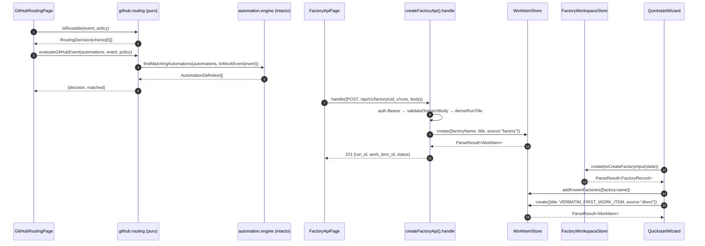
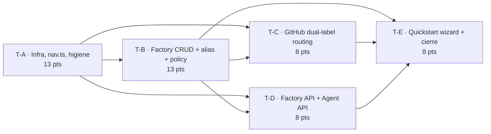

# TermCanvas Web — Diseño Incremental (G1–G6) + Auditoría T01–T16

> Autor: 高见远 (Gao) — Architect
> Fecha: 2026-08-30 · Commit base: `main-c2128e3a` (web/)
> Estado de partida verificado: `tsc --noEmit` 0 errores · `vitest run --pool=threads` 29 archivos / 804 tests verdes · `vite build` verde · `oxlint` 0 errores / 18 warnings (en `src/`)
> Alcance: **diseño + descomposición de tareas**. No incluye implementación.

---

## 0. Resumen ejecutivo

La réplica está **mucho más avanzada de lo que marca `WarpFactories.md` §17** (ese checklist quedó congelado en el commit `c1fc80c1`, 501 tests). **Dos ítems marcados PENDIENTES ya están implementados** y hay que corregir el checklist, no el código:

| Ítem §17 | Marcado | Realidad verificada |
|---|---|---|
| Factory MCP stub 19 tools | "Pendiente" | **Hecho** — `src/lib/factory/mcp/mcp.stub.ts` (447 LOC, 19 tools en `MCP_TOOL_NAMES`, `FactoryMcpStub`, `createMcpStub`) + `mcp.stub.test.ts` (392 LOC) |
| Benchmarks v1 | "Pendiente" | **Hecho** — `src/lib/factory/domain/benchmark.derive.ts` (`validateBenchmarkDefinition`, `deriveConfigResult`, `deriveBenchmark`, `createTaskFromRun`, Correctness built-in) + `benchmark.derive.test.ts` (278 LOC) + `BenchmarksPage.tsx` |

Los huecos reales confirmados leyendo código son exactamente los seis del encargo (G1–G6), más un séptimo hallazgo de higiene con impacto de señal: **`.oxlintrc.json` no ignora `dist-verify/`**, por lo que `npx oxlint` raíz reporta **2004 warnings, de los cuales ~1986 son ruido de bundle minificado**. Los 18 warnings reales viven todos en `src/`.

Plan: **5 tareas en 4 olas**, con la tarea de Factory CRUD (T-B) como hub del que cuelgan G1, G2 y G4.

---

## 1. Auditoría T01–T16

Leyenda: **C** = cubierto (cerrable) · **P** = parcial · **G** = gap (requiere trabajo)

| # | Ticket | Estado | Evidencia concreta (archivo :: export) | Qué falta |
|---|---|---|---|---|
| **T01** | Prefactor / App Shell | **P** | `vite.config.ts`, `src/main.tsx` (StrictMode → `WorkItemStoreProvider` → `App`), `src/App.tsx` (19 `lazy()`), `src/components/Sidebar.tsx` (409 LOC), `src/index.css` (@theme), `store/workItem.store.ts` (Observer: Map + `Set<listener>` + `version`), `hooks/useWorkItems.ts` (`useSyncExternalStore`), `lib/cn.ts`, `src/test-setup.ts`, 29 archivos de test | Sin `ErrorBoundary` pese a `lazy()`+`Suspense`; store solo tiene slice `workItems` (no `factories`/`runs`/`agents`); botones inertes (Search, toggle sidebar); `vitest` sin `pool: "threads"` → cuelga en Windows |
| **T02** | Factory Core + alias + 1 policy | **G** | `domain/settings.derive.ts :: ALIAS_MAX, ALIAS_PATTERN, validateForemanAlias, isAliasValid, normalizeAlias, CREDENTIAL_STRATEGIES` (puro, probado en `settings.test.ts`); `mcp/mcp.stub.ts :: create_factory` (regex alias + duplicado, **solo stub**) | **No existe** lista/estado de factories (hardcodeadas: `WorkItemStoreContext.tsx:10` y `App.tsx:42`); `+ Add factory` inerte; sin persistencia; sin enforce "una factory = una policy"; sin glosario → **G3** |
| **T03** | Work Item lifecycle | **C** | `domain/workItem.machine.ts :: canTransition, nextStageForIntake, WorkItemMachine, transitionWorkItem`; `domain/workItem.rules.ts :: decideSkipTriage, decideSkipPlanning, createForemanDecision, isHumanGateBlocking`; `store/workItem.store.ts :: create/transition/cancel/list`; `components/activity/ActivityBoard|Card|Detail` (kanban, Stop task sin confirmación, Event history) | Solo residual: `View agent` es stub (sin backend real). Cerrable |
| **T04** | Agentes + harness + 1 foreman | **P** | `schemas/agent.schema.ts`, `parsers/agent.parser.ts`, `store/factoryRegistry.ts` (invariante `foreman_count` + alias `MAIN`), `components/agents/*`, `hooks/useFactoryBundle.ts` (7 agentes: foreman/reviewer/triage/spec/implement/verify/security) | Falta editor Warp-managed que "valida y commitea"; tooltip de optimización por rol; gate Free→solo `oz`. Residual P2 |
| **T05** | Skills global vs per-agent | **C** | `domain/skill.registry.ts :: parseSkillMd, isSkillVisibleToAgent, listSkillsForAgent, listFactoryWideSkills, listPerAgentSkills, getBuiltinSkills, resolveSkillsForAgent, categorizeSkills` + `skill.registry.test.ts` (251 LOC) + `SkillsPage` | Residual: edición de `SKILL.md` desde UI (self-improvement real) — fuera de v1 |
| **T06** | Definitions as Code | **P** | 6 schemas zod `.strict()`+`superRefine` (`factory/agent/runner/automation/scorer/common`), 5 parsers, `store/factoryRegistry.ts :: parseBundle/parseMinimal` (invariantes `foreman_count`, `missing_runner`), `domain/validation.derive.ts :: SCHEMA_URLS, SCHEMA_AUTH, VALIDATE_TOOL, validateWithParser, WARP_FACTORY_EXAMPLES, COPYABLE_EXAMPLES`, `domain/errors.ts :: formatZodIssues` + `ValidationPage` (live textarea) | `formatZodIssues` produce `file.field`, **no `file+line`** (`FileParseError` declara `line?/col?` pero nadie los rellena); `skills/` no entra en `RegistryInput`; check `warp/factory-config` no aplica (sin backend) |
| **T07** | Automations engine | **P** | `domain/automation.engine.ts :: matchesTrigger, matchesAutomation, findMatchingAutomations, evaluateEvent, isScheduleTrigger, describeFilter` (AND entre filtros / OR dentro, `in`/`not_in`, filtro vacío = match todo, schedule); `schemas/automation.schema.ts` (`enabled` default true, `agent` default foreman, `model` xor `harness`, schedule obligatorio si provider=schedule); `AutomationsPage` (simulador con provider/event/repos/labels/branches/base_branches/schedule + 3 presets + contador matched/N); `troubleshooting.data.ts :: TWO_RUNS_WARNING` (overlapping) | **No existe catálogo de eventos GitHub como dato** (sí existen `SLACK_EVENTS`, `LINEAR_TRIGGERS`, `GITLAB_TRIGGERS` en `integrations.deep.ts`); falta tabla "Appears on" de los 12 filtros (US-075); falta editor crear/editar (hoy read-only GitHub-backed) |
| **T08** | Runners | **C** | `domain/runner.derive.ts :: HOSTED_MAX_VCPUS=32, HOSTED_MAX_MEMORY_GB=64, ALLOWED_MAC_VERSIONS, isHostedLimitExceeded, validateRunner*, resolveEffectiveRunnerForAgent/Automation, deriveRunnerUsage` (350 LOC de tests) + `RunnersPage`/`RunnerDetail` + tabla Environment vs Runner vs Host | Residual: cola por team, placeholder OTel en self-hosted |
| **T09** | GitHub dual-label routing | **G** | `components/integrations/IntegrationsPage.tsx` (tabla 9 providers §9) y `domain/integrations.deep.ts` con **datos de Slack/Linear/Jira/GitLab pero cero datos de GitHub** | **Nada** de §9 GitHub: ni `GITHUB_EVENTS` (20), ni los 12 filtros con "Appears on", ni `factory:<foremanName>` + `@warp-factory`, ni CI re-run, ni simulador. `automation.engine.ts` es genérico (provider+event+filter) → **G1** |
| **T10** | Slack deep dive | **P** | `domain/integrations.deep.ts :: SLACK_EVENTS, SLACK_EVENTS_FULL, SLACK_PRIVACY, isSlackAccountLinkRequired, isSlackEventSupported` + `components/integrations-deep/SlackPage.tsx` | Página **inalcanzable desde la UI**; falta Home tab y demo `reaction_added` → **G5** (+ residual P2) |
| **T11** | Linear/Jira/Schedule/Factory/GitLab | **P** | `integrations.deep.ts :: LINEAR_*` (triggers, filters, `LINEAR_EVENTS_OUTPUTS`, `doesLinearCommentCauseLoop`, `isLinearNarrowEditableInEditor`), `JIRA_*` (CLOUD_ONLY, ROVO_REQUIRED, `JIRA_FILTER_KEYS`), `GITLAB_*` (host, plan, bot name `formatGitLabBotName`, `GITLAB_BOT_RESPONSE`, `GITLAB_DEFINITION_HOSTING_SUPPORTED`); `automation.engine.ts` schedule; `automation.schema.ts` provider `factory` | Páginas `GitLabPage/SlackPage/LinearPage/JiraPage` **inalcanzables** → **G5** |
| **T12** | Factory Dashboard | **P** | `domain/dashboard.derive.ts` (8 métricas + disclaimers; 563 LOC de tests), `DashboardPage`+`MetricCard`, `ActivityBoard|Card|Detail` (kanban + Stop task + Event history), `RunsPage|RunCard|RunDetail` (timeline/cost/Sub-agents/View session), `SettingsPage` (Identity/Repos/`credentialStrategy`/Analysis model/Runners/Integrations/Deletion), `FactoryDefinitionPage({ mode })` (warp-managed/github-backed/live-managed), `SecretsPage`, `IntegrationsPage`, `McpsPage`, `Sidebar` con items team-level arriba (§10) | `SettingsPage`/`FactoryDefinitionPage` reciben `mode` por props pero **nadie se los pasa** (siempre default); fábrica hardcodeada `factoryName="payments-factory"` → se resuelve con **G3 + G5** |
| **T13** | Measure and Improve | **C** | `schemas/scorer.schema.ts`+`parsers/scorer.parser.ts`+`domain/scorer.derive.ts` (invariante ≥1 label ≥passing y ≥1 <passing, `samplingRate`, re-score); `domain/benchmark.derive.ts` + `BenchmarksPage` (single agent, N tasks/configs/repetitions, Correctness built-in, sin ganador); `SelfImprovementPage` + `mockSelfImprovementPRs` | Cerrable. **Actualizar §17** que lo marca pendiente |
| **T14** | Factory MCP + Factory API | **P** | **MCP**: `mcp/mcp.stub.ts :: FactoryMcpStub` (19 tools, `getToolDefs`, worktree guidance con `start_working`, `message_foreman`, `list_notification_routes` best-effort, headless `Bearer`, sin scopes, warning no-claim/lock) + `mcp.stub.test.ts`; `McpsPage` team-level. **Factory API**: **no existe nada** | Falta todo §19: `GET /api/v1/factory?search`, `GET /factory/{uid}`, `POST /factory/{uid}/runs`, Agent API `GET //followups//cancel`, `ticket_ref` regex, curl + OzAPI → **G2**. Además `McpStubPage.tsx` (167 LOC) **nunca se importa** → **G5/G6** |
| **T15** | Infra, Sizing, Governance | **P** | `domain/infra.derive.ts :: DEPLOYMENT_PATTERNS (3), CONTROL_VS_EXECUTION, RUNNER_BACKENDS, OTEL_METRICS, EXECUTION_HOST_COMPARISON, TEAM_CHOICES (3), CREDENTIAL_BOUNDARIES (4), ZDR_NOTE, GOVERNANCE_NOTE, METERING_NOTE, DEPLOYMENT_CHECKLIST (7)` + `InfraPage` (263 LOC) + `infra.test.ts` (216 LOC) | Falta **quickstart wizard 7 pasos** + first work item verbatim + prompt MCP onboarding → **G4** |
| **T16** | Troubleshooting Help Center | **C** | `domain/troubleshooting.data.ts :: SETUP_ROWS (4), WORK_NOT_STARTING_LEAD, WORK_SOURCES (5), TWO_RUNS_WARNING, RUNS_ROWS (3), TROUBLESHOOTING_META` + `TroubleshootingPage` + `HelpSection` (366 LOC de tests) | Residual: enlaces `?` desde Activity/Runs/Automations; item `Help` separado en nav → **G5** |

### 1.1 Hallazgos que cambian el plan

1. **T13 y la mitad de T14 ya están hechos** (§17 desactualizado). No hay que invertir ni un punto ahí; hay que **corregir el checklist** y dedicarlo a G1–G6.
2. **`analisis-repositorio.md` no existe** en el worktree (ni en la raíz ni en `web/`). No se pudo contrastar; la auditoría de arriba está hecha **leyendo el código**, que es la fuente fiable.
3. **`McpStubPage.tsx` está terminado y no está cableado**: es la UI de los 19 tools. Cablearlo cuesta una línea de nav y cierra el último hueco de T14 en UI (ver G5).
4. **`ActivityColumn.tsx` + `ActivityFilters.tsx` son incompatibles con `ActivityBoard`**: son columnas de kanban horizontal (`w-[280px]`) mientras `ActivityBoard` renderiza un board vertical apilado y colapsable (`max-w-[640px]`, `collapsed`). Cablearlos sería un rework visual sin tests que lo protejan → **se recomienda borrarlos** y, en su lugar, dar vida al toggle `includeTerminals` (hoy `useState(false)` con `void`) que es lo que pide US-102 ("Stage: agregar Complete/Cancelled").
5. **`WorkItemStore.setKnownFactories()` reemplaza** el set completo. `FactoryMcpStub` lo llama en su constructor y **borraría** las factories creadas por el usuario. Hay que añadir `addKnownFactories()` (aditivo) sin tocar la semántica del método existente.
6. **El primer work item verbatim de §14 mide 186 caracteres** → cabe en el límite de 200 de `WorkItemStore.create`. No hace falta truncar (verificado).
7. **T03 y T08 son cerrables ya**; T15 está cerrado salvo el wizard.

---

## 2. Principios de diseño que atraviesan G1–G6

1. **Puro / React separados**: cada gap = módulo puro en `lib/factory/**` (sin React, sin I/O, determinista) + página en `components/**` que solo renderiza y delega.
2. **OCP sobre modificación**: **no se edita la firma ni la semántica de ningún export existente**. Todo se añade (nuevos módulos, o parámetros **opcionales** al final). Ninguno de los 804 tests cambia de comportamiento.
3. **Errores como valores**: todo lo que puede fallar devuelve `ParseResult<T>` con `ParseIssue { path, message, code }`. Cero excepciones.
4. **DIP**: el almacenamiento se inyecta como puerto (`KeyValuePort`); el reloj y los IDs se inyectan como funciones para que los tests sean deterministas.
5. **Traza obligatoria**: cada módulo nuevo abre con cabecera `// <principio SOLID>` + `// Source: WarpFactories.md §N` y cada regla de UI cita `§N` y `US-NNN`.
6. **Cero dependencias nuevas**: solo React 19, zod, yaml, motion, lucide-react, clsx/tailwind-merge.
7. **UI**: español en copia, inglés en identificadores. Layout canónico de página (copiado de `ValidationPage.tsx`):
   `<div className="flex min-h-0 flex-1 flex-col overflow-auto bg-[#f8f8f8]">` → header 44px `wilson › <Page>` + badge `WarpFactories.md §N + US-NNN` → `<div className="mx-auto w-full max-w-[1080px] p-4">` → `<section className="rounded-[12px] border border-zinc-200 bg-white p-4 shadow-sm">`.
8. **Mínimos campos (Nielsen + Fitts)**: un solo input obligatorio por pantalla, defaults sensibles, *progressive disclosure* (el alias se auto-copia del nombre y solo se edita si el usuario lo pide), acciones primarias grandes y a la izquierda, presets de un clic para los casos frecuentes.

---

## 3. G1 — GitHub dual-label routing (T09, US-076, P0)

### 3.1 Módulos

| Archivo | Acción | Responsabilidad |
|---|---|---|
| `src/lib/factory/domain/github.routing.ts` | **nuevo** | Núcleo puro: extracción de contenido, 5 checks, decisión con traza |
| `src/lib/factory/domain/github.routing.derive.ts` | **nuevo** | Datos para UI: `GITHUB_EVENTS` (20), tabla de 12 filtros con "Appears on", presets del simulador, copy ES |
| `src/components/routing/GitHubRoutingPage.tsx` | **nuevo** | Simulador: pega un evento → traza por check |
| `src/lib/factory/domain/integrations.deep.ts` | **modificar (solo añadir)** | Añadir sección `// ── GitHub ──` (hoy el único provider §9 sin datos) |
| `src/lib/factory/__tests__/github.routing.test.ts` | **nuevo** | Tests Gherkin de US-076 |

`automation.engine.ts` **no se toca**.

### 3.2 API pública

```ts
// github.routing.ts
// SRP: solo evaluación del dual-requirement — sin I/O, sin store, sin React.
// OCP: agregar check = agregar entrada en ROUTING_CHECK_ORDER; automation.engine intacto.
// Source: WarpFactories.md §9 "Mencionar la factory (routing exacto — dual requirement)"

export const DEFAULT_WARP_HANDLE = "@warp-factory";
export const FACTORY_LABEL_PREFIX = "factory:";

/** Orden de evaluación de los checks (el UI lo respeta para la traza). */
export const ROUTING_CHECK_ORDER = [
  "new_content",
  "not_bot_author",
  "label_present",
  "not_code_block",
  "mention_present",
] as const;
export type RoutingCheckId = (typeof ROUTING_CHECK_ORDER)[number];

export interface RoutingCheck {
  readonly id: RoutingCheckId;
  readonly label: string;   // ES: "Solo new content cuenta"
  readonly ok: boolean;
  readonly detail: string;  // ES: por qué pasó o falló, con el valor que se vio
  readonly source: string;  // "WarpFactories.md §9"
}

export interface GitHubRoutingEvent {
  readonly provider: "github";
  readonly event: string;                    // issue_created | issue_comment_created | pull_request_opened | ...
  readonly repo: string;                     // "acme/payments-service"
  readonly number?: number;
  readonly labels: readonly string[];
  readonly body: string;                     // body del issue/PR o del comentario nuevo
  readonly isEdit: boolean;                  // true → ignorado (§9: edits ignorados)
  readonly authorIsBot: boolean;             // true → ignorado (§9: bot mentions ignoradas)
  readonly mentioned?: readonly string[];    // handles/users mencionados
  readonly assigned?: readonly string[];     // assignees (cuenta como mention, §9)
}

export interface RoutingPolicy {
  readonly foremanName: string;              // alias de la factory → factory:<foremanName>
  readonly handle: string;                   // default "@warp-factory"; custom "@org/team" (§9)
  readonly requireFactoryLabel: boolean;     // default true; false → "remover label filter" (§9)
}

export interface RoutingDecision {
  readonly routable: boolean;
  readonly checks: readonly RoutingCheck[];  // siempre los 5, en ROUTING_CHECK_ORDER
  readonly reason: string;                   // ES, una frase
  readonly expectedLabel: string;            // "factory:payments"
  readonly matchedHandle?: string;           // handle que disparó, si alguno
}

// —— helpers puros exportados (testeables uno a uno) ——
export function factoryLabel(foremanName: string): string;
export function stripCodeBlocks(markdown: string): string;      // elimina ``` fences, ~~~ fences y `inline`
export function findMention(text: string, handle: string): string | undefined; // case-insensitive, word-boundary
export function hasFactoryLabel(labels: readonly string[], foremanName: string): boolean; // case-insensitive
export function continuationKey(event: GitHubRoutingEvent): string;  // "acme/payments-service#42" — dedupe

// —— API principal ——
export function isRoutable(event: GitHubRoutingEvent, policy: RoutingPolicy): RoutingDecision;

// —— composición con automation.engine (OCP: delega, no modifica) ——
export function toMockEvent(event: GitHubRoutingEvent): MockEvent; // importa el tipo de automation.engine
export function evaluateGitHubEvent(
  automations: readonly AutomationDefinition[],
  event: GitHubRoutingEvent,
  policy: RoutingPolicy
): { decision: RoutingDecision; matched: readonly AutomationDefinition[] };
```

Reglas (§9) codificadas en `isRoutable`:

| Check | Pasa si | Falla si | `source` |
|---|---|---|---|
| `new_content` | `event.isEdit === false` | edición de issue/comentario existente | §9 "Solo new content cuenta (edits ignorados)" |
| `not_bot_author` | `event.authorIsBot === false` | autor bot | §9 "bot mentions ignoradas" |
| `label_present` | `labels` incluye `factory:<foremanName>` (case-insensitive) **o** `policy.requireFactoryLabel === false` | falta el label | §9 "Label `factory:<foremanName>`" |
| `not_code_block` | tras `stripCodeBlocks(body)` el texto no está vacío | la única mención vivía dentro de un bloque de código | §9 "mentions dentro de code blocks ignoradas" |
| `mention_present` | `stripCodeBlocks(body)` contiene `policy.handle` (case-insensitive, word-boundary) **o** `mentioned`/`assigned` lo contienen | ni mention ni assign | §9 "Mention o assign `@warp-factory`" |

`routable = checks.every(c => c.ok)`. **Todos los checks se evalúan siempre** (no hay cortocircuito) para que la traza esté completa — es la gracia del panel.

Composición: `evaluateGitHubEvent` = `isRoutable` → si no es routable, `matched = []` (sin consultar el engine); si lo es, `findMatchingAutomations(automations, toMockEvent(event))`. `toMockEvent` mapea `repo → repos[]`, `labels`, `event`, `provider`, y deja el resto como `unknown`. **Ningún export de `automation.engine.ts` cambia**, por lo que `automation.engine.test.ts` (393 LOC) sigue verde por construcción.

`github.routing.derive.ts` aporta `GITHUB_EVENTS` (los 20 de §9: 4 issues + 9 PRs + 2 reviews + 5 code/CI), `GITHUB_FILTER_APPEARS_ON` (los 12 filtros con su lista de eventos, US-075), y 4 presets de un clic para el simulador: *"Mention sin label"*, *"Label sin mention"*, *"Mention en code block"*, *"Edit con mention"*.

### 3.3 UI — `GitHubRoutingPage.tsx`

Dos columnas (`lg:grid-cols-[1.1fr_0.9fr]`, como `ValidationPage`):
- **Izquierda**: `factory` (selector → alias), `handle` (input, default `@warp-factory`), `requerir label` (toggle), `repo`, `evento` (select con los 20), `labels` (tags), `body` (textarea, se pega el issue/comentario con sus ```), `es edición` y `autor es bot` (toggles). Presets arriba.
- **Derecha**: veredicto (`✓ Enruta` / `✗ No enruta` + `reason`) y **traza por check**: 5 filas `✓/✗ · label · detail · source`. Debajo, si routable: `matched` (N automatizations que disparan) con el `MockEvent` JSON generado y el `continuationKey` para dedupe.
- Cierre: nota §9 "PRs que abre la factory llevan su label automáticamente" + `factoryLabel(alias)` copiable.

---

## 4. G2 — Factory API + Agent API stub (T14 / US-149…US-155)

### 4.1 Módulos

| Archivo | Acción | Responsabilidad |
|---|---|---|
| `src/lib/factory/api/factoryApi.types.ts` | **nuevo** | DTOs, constantes de path, `TICKET_REF_PATTERN` |
| `src/lib/factory/api/factoryApi.router.ts` | **nuevo** | `handle(request) → response`: tabla de rutas, auth, validación, dispatch |
| `src/lib/factory/api/factoryApi.snippets.ts` | **nuevo** | Generación de `curl` y snippet `OzAPI` (Python) desde un request |
| `src/lib/factory/api/factoryApi.routes.ts` | **nuevo** | Catálogo de rutas para la UI (método, path, descripción ES, body por defecto) |
| `src/components/api/FactoryApiPage.tsx` | **nuevo** | Consola: elegir endpoint → editar JSON → dispatch → ver request/response + snippets |
| `src/lib/factory/__tests__/factoryApi.test.ts` | **nuevo** | Tests US-149…153, US-155 |

**No es un mock de `fetch`**: es una función pura de dispatch. La página llama a `handle()` y pinta el objeto devuelto.

### 4.2 API pública

```ts
// factoryApi.types.ts
// SRP: solo formas del contrato §19. DIP: sin importar store ni React.
// Source: WarpFactories.md §19 Factory API — Referencia Detallada

export const FACTORY_API_PREFIX = "/api/v1/factory";
export const AGENT_API_PREFIX = "/agent/runs";
export const TICKET_REF_PATTERN = /^[a-z]+:[A-Za-z0-9-_]+$/;   // §19 "Para TermCanvas"
export const DEFAULT_API_KEY = "warp_local_api_key";           // security fuera de alcance
export const MAX_RUN_TITLE = 80;

export type HttpMethod = "GET" | "POST";

export interface ApiRequest {
  readonly method: HttpMethod;
  readonly path: string;                                  // "/api/v1/factory/uid_x/runs"
  readonly query?: Readonly<Record<string, string>>;      // ?search=
  readonly headers?: Readonly<Record<string, string>>;    // Authorization: Bearer ...
  readonly body?: unknown;
}

export interface ApiResponse<T = unknown> {
  readonly status: number;                                // 200 | 201 | 400 | 401 | 404 | 422
  readonly headers: Readonly<Record<string, string>>;     // content-type: application/json
  readonly body: T;
}

export interface FactorySummary {
  readonly uid: string;
  readonly name: string;
  readonly alias?: string;
  readonly repositories: readonly { owner: string; name: string }[];
  readonly foreman: { name: string; agentType: string } | null;   // §19 "server resuelve el foreman"
}

export type RunStatus = "queued" | "running" | "completed" | "cancelled";

export interface DispatchedRun {
  readonly run_id: string;                                // "run_<workItemId>"
  readonly factory_uid: string;
  readonly work_item_id: string;
  readonly status: RunStatus;
  readonly prompt: string;
  readonly title: string;                                 // derivado si se omitió
  readonly ticket_ref?: string;
  readonly ticket_url?: string;
  readonly created_at: string;                            // ISO, del reloj inyectado
}

export interface ApiError { readonly error: string; readonly code: string; readonly detail?: string }
```

```ts
// factoryApi.router.ts
// SRP: solo dispatch HTTP→dominio. DIP: depende de WorkItemStore + lista de factories inyectada.
// OCP: agregar endpoint = agregar entrada en ROUTES, sin tocar handle().
// Source: WarpFactories.md §19

export interface FactoryApiDeps {
  readonly store: WorkItemStore;
  readonly factories: readonly FactorySummary[];   // snapshot; el router no muta factories
  readonly apiKey?: string;                        // omitido → auth desactivada (dev)
  readonly now?: () => string;                     // reloj determinista para tests
  readonly id?: () => string;
}

export interface RouteDef {
  readonly id: "factory.list" | "factory.get" | "factory.runs.create"
            | "agent.run.get" | "agent.run.followups" | "agent.run.cancel" | "agent.run.standalone";
  readonly method: HttpMethod;
  readonly path: string;                 // con :uid / :runId
  readonly description: string;          // ES, §19
  readonly trace: string;                // "WarpFactories.md §19 · US-149"
  readonly defaultQuery?: Readonly<Record<string, string>>;
  readonly defaultBody?: unknown;
}

export interface FactoryApi {
  handle(req: ApiRequest): ApiResponse;
  routes(): readonly RouteDef[];
}

export function createFactoryApi(deps: FactoryApiDeps): FactoryApi;

// helpers puros exportados para test unitario
export function deriveRunTitle(prompt: string, max?: number): string;   // 1ª línea, corta en espacio, sin "..."
export function validateDispatchBody(body: unknown): ParseResult<{
  prompt: string; title?: string; ticket_ref?: string; ticket_url?: string;
}>;
export function matchRoute(method: HttpMethod, path: string): { def: RouteDef; params: Record<string, string> } | null;
```

Tabla de rutas (paths **idénticos** a Warp, §19 — objetivo drop-in):

| id | Método + path | Comportamiento |
|---|---|---|
| `factory.list` | `GET /api/v1/factory` | `?search=` case-insensitive sobre `name` **y** `alias` (US-149) → `{ factories: FactorySummary[] }` |
| `factory.get` | `GET /api/v1/factory/:uid` | 404 `factory_not_found` |
| `factory.runs.create` | `POST /api/v1/factory/:uid/runs` | valida `prompt` required (400 `missing_prompt`), `ticket_ref` con `TICKET_REF_PATTERN` (422 `invalid_ticket_ref`), deriva `title`, resuelve foreman, `store.create({ source: "factory", sourceRef: ticket_ref ?? ticket_url, createdBy: "factory-api" })` → 201 `DispatchedRun` |
| `agent.run.get` | `GET /agent/runs/:runId` | resuelve `workItemId = runId.replace(/^run_/, "")` → estado + followups acumulados |
| `agent.run.followups` | `POST /agent/runs/:runId/followups` | `{ content }` → 201 `{ id, run_id, status }` (ledger en memoria del router) |
| `agent.run.cancel` | `POST /agent/runs/:runId/cancel` | `store.cancel(workItemId, "human", "cancelled via Agent API")` → `{ run_id, status: "cancelled" }` |
| `agent.run.standalone` | `POST /agent/run` | igual que `runs.create` pero sin `:uid` (§19 "standalone sin factory") |

Auth: si `deps.apiKey` está definido y el header `Authorization` no es `Bearer <apiKey>` → **401** `{ error: "unauthorized", code: "unauthorized" }`. Se evalúa **antes** que las rutas. (Seguridad fuera de alcance: la consola UI pre-rellena la key.)

Determinismo: `now()` y `id()` se inyectan; en la app se pasan `() => new Date().toISOString()` y un contador monótono. Cero `Math.random()`.

```ts
// factoryApi.snippets.ts
// SRP: solo generación de snippets copiables — puro, sin I/O.
export function toCurl(req: ApiRequest, apiKey: string, baseUrl?: string): string;
export function toOzApiSnippet(routeId: RouteDef["id"], req: ApiRequest): string; // Python, §19
export function toJson(value: unknown): string;   // JSON.stringify(…, 2) centralizado
```

### 4.3 UI — `FactoryApiPage.tsx`

- Selector de endpoint (7 rutas, con método en chip y `trace`).
- Editor de query (`search`) y de body JSON (pre-relleno desde `defaultBody`), header `Authorization` pre-relleno con la key.
- Botón **`Enviar`** → panel de respuesta: `status` con color, headers, y `body` en `<pre>` con botón Copiar.
- Dos bloques copiables generados desde el mismo request: **curl** y **OzAPI (Python)**.
- Tabla final "Factory API vs Agent API" (§19) + link a la guía Mattermost (US-154).
- Nota: "Dispatched run = ordinary cloud agent run" con el `run_id` resultante ya listo para pegar en `GET /agent/runs/{runId}`.

---

## 5. G3 — Factory CRUD + alias + una policy (T02 / US-001, 002, 005, 006)

### 5.1 Módulos

| Archivo | Acción | Responsabilidad |
|---|---|---|
| `src/lib/factory/domain/factory.record.ts` | **nuevo** | Tipo `FactoryRecord`, `CreateFactoryInput`, validación pura (reutiliza `settings.derive`) |
| `src/lib/factory/domain/factory.policy.ts` | **nuevo** | "Una factory = una policy" (§2, §14) + glosario triada (US-006) |
| `src/lib/factory/store/storage.port.ts` | **nuevo** | Puerto `KeyValuePort` + `createMemoryPort` + `createLocalStoragePort` |
| `src/lib/factory/store/factoryWorkspace.store.ts` | **nuevo** | Observer store (mismo patrón que `WorkItemStore`) + selección + hidratación |
| `src/lib/factory/store/FactoryWorkspaceProvider.tsx` | **nuevo** | **Solo** el componente Provider (evita el warning `only-export-components`) |
| `src/lib/factory/hooks/useFactories.ts` | **nuevo** | `useFactoryWorkspace`, `useSelectedFactory`, `useCreateFactory` |
| `src/components/factories/NewFactoryDialog.tsx` | **nuevo** | Alta en 1 campo (+ alias en disclosure, + abrir wizard) |
| `src/components/factories/FactoryGlossary.tsx` | **nuevo** | Glosario Warp Factories / factory / foreman (US-006) |
| `src/components/Sidebar.tsx` | **modificar** | Lista real de factories, `+ Add factory` activo, pin/expansión reales |
| `src/lib/factory/store/workItem.store.ts` | **modificar (+=)** | `addKnownFactories()` aditivo (no tocar `setKnownFactories`) |
| `src/lib/factory/hooks/useFactoryBundle.ts` | **modificar (+=)** | `getFactoryBundle(opts?)` con `name/alias/repos` opcionales; `getFactoryBundle()` sin args **idéntico** a hoy |
| `src/lib/factory/__tests__/factoryWorkspace.test.ts` | **nuevo** | Gherkin US-001/002/005 |

### 5.2 API pública

```ts
// domain/factory.record.ts
// SRP: solo forma y validación de una factory-instancia (§2 Factory vs Warp Factories).
// DIP: la unicidad se comprueba contra una lista inyectada; no lee stores.
// Source: WarpFactories.md §2, §10 Settings Identity, §14 Sizing · US-001, US-002

export const FACTORY_NAME_MAX = 60;
export const AGENT_TOGGLE_KEYS = ["triage", "spec", "implement", "review"] as const;
export type AgentToggleKey = (typeof AGENT_TOGGLE_KEYS)[number];

export interface FactoryRecord {
  readonly uid: string;                 // "uid_<slug>_<n>"
  readonly name: string;                // requerido (US-001)
  readonly alias: string;               // Foreman name — auto-copia name (US-001)
  readonly description?: string;
  readonly repositories: readonly RepositoryRef[];
  readonly integrations: readonly IntegrationType[];
  readonly agentToggles: Readonly<Record<AgentToggleKey, boolean>>;
  readonly policyId: string;            // una factory = una policy (US-005)
  readonly createdAt: string;
}

export interface CreateFactoryInput {
  readonly name: string;
  readonly alias?: string;              // ausente → defaultAliasFor(name)
  readonly description?: string;
  readonly repositories?: readonly RepositoryRef[];
  readonly integrations?: readonly IntegrationType[];
  readonly agentToggles?: Readonly<Record<AgentToggleKey, boolean>>;
}

export interface FactoryValidationOptions {
  readonly existing?: readonly FactoryRecord[];
  readonly now?: () => string;
  readonly uid?: (name: string) => string;
}

export function defaultAliasFor(name: string): string;         // name recortado a 60, charset saneado
export function slugifyUid(name: string): string;
export function validateFactoryName(name: string, existing?: readonly FactoryRecord[]): AliasValidationResult; // reexporta el shape de settings.derive
export function validateFactoryAlias(alias: string, existing?: readonly FactoryRecord[]): AliasValidationResult; // delega en settings.derive.validateForemanAlias
export function validateFactoryCreate(input: CreateFactoryInput, opts?: FactoryValidationOptions): ParseResult<FactoryRecord>;
export function renameFactory(record: FactoryRecord, patch: Partial<CreateFactoryInput>, existing: readonly FactoryRecord[]): ParseResult<FactoryRecord>;
```

Códigos de `ParseIssue`: `missing_name`, `name_charset`, `name_length`, `name_unique`, `alias_charset` (message ES: `alias solo [A-Za-z0-9 ._-], max 60` — literal de US-001), `alias_length`, `alias_unique`.

```ts
// domain/factory.policy.ts
// SRP: solo la regla "una policy por factory". DIP: recibe el record, no lo busca.
// Source: WarpFactories.md §2 "Cada factory aplica una sola policy", §14 Sizing · US-005
export interface FactoryPolicy {
  readonly id: string;
  readonly label: string;                 // ES
  readonly specApproval: boolean;         // §3 spec approval gate
  readonly requireReview: boolean;
  readonly mergePolicy: "never" | "human"; // §3: la factory nunca mergea
}
export const DEFAULT_POLICY: FactoryPolicy;
export function enforceSinglePolicy(record: FactoryRecord, candidate: FactoryPolicy): ParseResult<FactoryRecord>;
// code: "two_policies" · message ES: "Una factory aplica una sola policy. Para otra policy, creá una factory separada (§2, §14)."

// US-006 — triada, datos puros para el glosario
export interface GlossaryEntry { readonly term: string; readonly definition: string; readonly trace: string }
export const FACTORY_GLOSSARY: readonly GlossaryEntry[];  // Warp Factories (producto) / factory (instancia) / foreman (agente) — §15
```

```ts
// store/storage.port.ts
// DIP: el dominio y el store no conocen localStorage; solo este puerto.
export interface KeyValuePort {
  read(key: string): string | null;
  write(key: string, value: string): void;
}
export const WORKSPACE_STORAGE_KEY = "termcanvas.factory-workspace.v1";
export function createMemoryPort(seed?: Readonly<Record<string, string>>): KeyValuePort;
export function createLocalStoragePort(key?: string): KeyValuePort; // cae a memoria si no hay window (tests/SSR)
```

```ts
// store/factoryWorkspace.store.ts
// SRP: CRUD + selección de factories. Observer (igual que WorkItemStore): Map + Set<listener> + version.
// DIP: persistencia inyectada por puerto; sin localStorage directo.
export class FactoryWorkspaceStore {
  constructor(port?: KeyValuePort, seed?: readonly FactoryRecord[], now?: () => string);
  subscribe(cb: () => void): () => void;
  getVersion(): number;
  list(): readonly FactoryRecord[];
  getByUid(uid: string): FactoryRecord | undefined;
  getByName(name: string): FactoryRecord | undefined;
  getSelectedUid(): string;
  select(uid: string): void;                                   // persiste
  create(input: CreateFactoryInput): ParseResult<FactoryRecord>;   // valida + persiste + notifica
  update(uid: string, patch: Partial<CreateFactoryInput>): ParseResult<FactoryRecord>;
  setPolicy(uid: string, policy: FactoryPolicy): ParseResult<FactoryRecord>;
  remove(uid: string): ParseResult<void>;                      // irreversible (§10 Deletion)
  toSummaries(): readonly FactorySummary[];                    // ← para G2 (Factory API)
  static _reset(): void;
}
export const DEFAULT_FACTORY_SEED: readonly FactoryRecord[];   // payments-factory + termcanvas-factory
export function getDefaultWorkspace(): FactoryWorkspaceStore;  // singleton, igual patrón que getDefaultStore()
export function _resetDefaultWorkspace(store?: FactoryWorkspaceStore | null): void;
```

`DEFAULT_FACTORY_SEED` replica exactamente los dos nombres de `WorkItemStoreContext.tsx:10` para que ningún test existente cambie de comportamiento.

```ts
// hooks/useFactories.ts
export function useFactoryWorkspace(): { factories: readonly FactoryRecord[]; selected: FactoryRecord | undefined; select(uid: string): void; create(input: CreateFactoryInput): ParseResult<FactoryRecord>; setPolicy(uid: string, p: FactoryPolicy): ParseResult<FactoryRecord>; remove(uid: string): ParseResult<void>; store: FactoryWorkspaceStore };
export function useSelectedFactory(): FactoryRecord | undefined;
```

`main.tsx` pasa a ser: `StrictMode → WorkItemStoreProvider → FactoryWorkspaceProvider → App`.

### 5.3 UX (Nielsen + Fitts)

`NewFactoryDialog`:
1. **Un solo campo obligatorio**: `Nombre de la factory` (Fitts: input ancho, foco automático, `Enter` = crear).
2. El **alias/Foreman name** se muestra como texto secundario `Foreman name: <auto>` con un enlace *"Editar"* que lo convierte en input (progressive disclosure). Nunca se pide por defecto.
3. Repos: dos chips pre-marcados (`acme/payments-service`, `acme/payments-api`) — cero tecleo en el happy path.
4. Errores inline y en vivo (reutiliza `validateFactoryCreate` en cada keystroke), con el mensaje exacto de US-001.
5. Dos acciones: **primaria "Crear factory"** (izquierda, `bg-zinc-900`), secundaria *"Usar el wizard de 7 pasos →"* (G4).
6. Segunda policy: el intento muestra el error `two_policies` + un botón **"Crear factory separada"** que abre el diálogo con el nombre sugerido (US-005).

`Sidebar.tsx`: la sección *Factories* itera `useFactoryWorkspace().factories`; `+ Add factory` abre el diálogo; `devExPinned`/`wilsonPinned` pasan a derivarse de `record.pinned` (o se eliminan si no hay pinneo real — decisión: **eliminar** las dos constantes y dejar un único `pinned` por factory persistido, que es lo que el icono sugiere); la fila "DevEx Factory" deja de tener `onClick={() => {}}` y selecciona su factory.

---

## 6. G4 — Quickstart wizard 7 pasos (T15 / US-142, 143, 144)

### 6.1 Módulos

| Archivo | Acción | Responsabilidad |
|---|---|---|
| `src/lib/factory/domain/quickstart.wizard.ts` | **nuevo** | Máquina de estado pura (reducer) + validación por paso |
| `src/lib/factory/domain/quickstart.data.ts` | **nuevo** | `VERBATIM_FIRST_WORK_ITEM`, prompt MCP onboarding, copy de los 7 pasos |
| `src/lib/factory/hooks/useQuickstart.ts` | **nuevo** | Conecta el reducer con los dos stores (`create` factory + work item) |
| `src/components/quickstart/QuickstartWizard.tsx` | **nuevo** | UI de 7 pasos + reseña + botón final |
| `src/lib/factory/__tests__/quickstart.test.ts` | **nuevo** | US-142/143/144 |

### 6.2 API pública

```ts
// domain/quickstart.wizard.ts
// SRP: solo la máquina de estado del wizard. Pura: sin React, sin I/O.
// OCP: agregar paso = agregar entrada en QUICKSTART_STEPS + su STEP_COPY.
// Source: WarpFactories.md §14 "Quickstart conceptual (resumen wizard 7 pasos)" · US-142

export const QUICKSTART_STEPS = ["source", "repos", "identity", "slack", "agents", "tracker", "review"] as const;
export type QuickstartStep = (typeof QUICKSTART_STEPS)[number];

export interface QuickstartState {
  readonly stepIndex: number;
  readonly provider: "github" | "gitlab";
  readonly repos: readonly RepositoryRef[];               // 1–2 focused (§14)
  readonly name: string;
  readonly alias: string;                                 // auto = name
  readonly aliasTouched: boolean;                         // mientras sea false, alias sigue a name
  readonly slack: boolean;                                // optional
  readonly agents: Readonly<Record<AgentToggleKey, boolean>>;  // min 1; implement ON default
  readonly tracker: "none" | "linear" | "jira";           // optional
  readonly useMcpOnboarding: boolean;                     // camino alternativo US-144
}

export type QuickstartAction =
  | { type: "back" } | { type: "next" } | { type: "goto"; step: number } | { type: "reset" }
  | { type: "setProvider"; provider: QuickstartState["provider"] }
  | { type: "toggleRepo"; repo: RepositoryRef }
  | { type: "setName"; name: string }
  | { type: "setAlias"; alias: string }
  | { type: "toggleSlack" }
  | { type: "toggleAgent"; agent: AgentToggleKey }
  | { type: "setTracker"; tracker: QuickstartState["tracker"] }
  | { type: "setUseMcpOnboarding"; value: boolean };

export function initialQuickstartState(): QuickstartState;
export function quickstartReducer(s: QuickstartState, a: QuickstartAction): QuickstartState;
export function validateStep(s: QuickstartState, existing?: readonly FactoryRecord[]): ParseResult<QuickstartState>;
export function isStepComplete(s: QuickstartState): boolean;
export function isLastStep(s: QuickstartState): boolean;
export function toCreateFactoryInput(s: QuickstartState): CreateFactoryInput;
export function toFirstWorkItemInput(s: QuickstartState): CreateWorkItemInput;  // title = VERBATIM_FIRST_WORK_ITEM
export function progressLabel(s: QuickstartState): string;   // ES: "Paso 3 de 7 · Nombre"
```

Invariantes del reducer:
- `setName` propaga a `alias` **solo si** `aliasTouched === false` (US-001: "su alias inicial copia el name").
- `toggleRepo` limita a **2** repos (§14 "Select 1–2 focused repos"); el tercero reemplaza al más viejo.
- `toggleAgent` impide quedar con 0 agentes (§14 "min 1").
- `implement` arranca en `true` (§14 "Implement ON para quickstart").
- `next` no avanza si `!isStepComplete` (el botón se deshabilita, no hay error a posteriori).

```ts
// domain/quickstart.data.ts
// Source: WarpFactories.md §14 paso 4 (verbatim) · US-143, US-144
export const VERBATIM_FIRST_WORK_ITEM =
  'Add a "Local development" section to README.md that summarizes the setup steps from CONTRIBUTING.md. ' +
  'Keep the change to that one file, run the repo\'s lint check, and open a pull request.';  // 186 chars < 200 (límite del store)
export const MCP_ONBOARDING_PROMPT =
  'Set up a factory for me. Read https://docs.warp.dev/factories/factory-mcp.md, follow the setup instructions ' +
  'for your coding environment to connect to and authenticate with Factory MCP, then use Factory MCP to onboard me.';
export const STEP_COPY: Readonly<Record<QuickstartStep, { title: string; hint: string; trace: string }>>;
export const DEMO_REPOS: readonly RepositoryRef[];   // 4 repos acme/* para elegir
```

### 6.3 Finalización (`useQuickstart.ts`)

```ts
export function useQuickstart(): {
  state: QuickstartState;
  dispatch(action: QuickstartAction): void;
  stepResult: ParseResult<QuickstartState>;
  finish(): ParseResult<{ factory: FactoryRecord; workItem: WorkItem }>;
};
```

`finish()` (orquestación fina, la única impura):
1. `workspace.create(toCreateFactoryInput(state))`.
2. `workspace.select(factory.uid)`.
3. `workItemStore.addKnownFactories([factory.name])` — **aditivo**, no pisa los existentes.
4. `workItemStore.create(toFirstWorkItemInput(state))` con `source: "direct"`, `createdBy: "Benjamin Holmes"`, `foremanDecision: createForemanDecision({ title: VERBATIM_FIRST_WORK_ITEM })` (reutiliza `workItem.rules`).
5. Navega a `Activity` para que el usuario vea el work item recién creado.

Si el usuario eligió `useMcpOnboarding`, en lugar de los pasos 1–4 se muestra el `MCP_ONBOARDING_PROMPT` copiable + link al dashboard (US-144).

### 6.4 UI — `QuickstartWizard.tsx`

Barra de progreso con los 7 pasos (clicables los ya completos), **un control relevante por paso** (no formularios largos), presets donde aplique, y un panel derecho fijo con el *resumen vivo* de la factory que se va a crear (nombre, alias, repos, agentes, tracker). Último paso = reseña + botón **"Crear factory y enviar el primer work item"**.

---

## 7. G5 — Navegación: una sola fuente de verdad

### 7.1 Módulos

| Archivo | Acción | Responsabilidad |
|---|---|---|
| `src/nav.ts` | **nuevo** | `NavItemId` (unión literal), `NAV_ITEMS` con scope team/factory, helpers |
| `src/App.tsx` | **modificar** | `useState<NavItemId>`, `switch` **exhaustivo** con `assertNever` en `default` |
| `src/components/Sidebar.tsx` | **modificar** | Consume `NAV_ITEMS`; factories desde `useFactoryWorkspace()` |
| `src/components/integrations-deep/IntegrationsDeepDivesPage.tsx` | **modificar (+=)** | Acepta prop opcional `initialTab` (default `"gitlab"`) |

### 7.2 API pública

```ts
// src/nav.ts
// SRP: única fuente de verdad de la navegación (§10 Getting oriented).
// OCP: agregar página = agregar id + item + case en App (tsc falla si falta alguno).
// Source: WarpFactories.md §10 · §14 · §19 · §9

export const TEAM_NAV_IDS = [
  "Team Runs", "MCPs and apps", "Secrets", "Integrations", "Quickstart", "Help",
] as const;

export const FACTORY_NAV_IDS = [
  "Dashboard", "Activity", "Agents", "Automations", "Runs", "Runners", "Scorers", "Skills",
  "Benchmarks", "GitHub routing", "Factory API", "MCP tools", "Factory definition", "Settings",
  "Self-improvement", "Troubleshooting", "Infra", "Validation",
  "Integrations Deep Dives", "GitLab Deep Dive", "Slack Deep Dive", "Linear Deep Dive", "Jira Deep Dive",
] as const;

export type NavItemId = (typeof TEAM_NAV_IDS)[number] | (typeof FACTORY_NAV_IDS)[number];

export interface NavItem {
  readonly id: NavItemId;
  readonly label: string;
  readonly scope: "team" | "factory";
  readonly trace: string;                 // "§10", "§9 · US-076", "§19 · US-149"…
  readonly badge?: string;                // p.ej. "7" en Self-improvement
  readonly deepDiveTab?: "gitlab" | "slack" | "linear" | "jira";
}

export const NAV_ITEMS: readonly NavItem[];
export const DEFAULT_NAV_ITEM: NavItemId = "Dashboard";
export function navItemsByScope(scope: "team" | "factory"): readonly NavItem[];
export function getNavItem(id: NavItemId): NavItem | undefined;
export function isNavItemId(value: string): value is NavItemId;
export function assertNever(value: never): never;   // garantiza exhaustividad en App.tsx
```

Cambios netos en `App.tsx`:
- `const [activeItem, setActiveItem] = useState<NavItemId>(DEFAULT_NAV_ITEM)`.
- Los casos duplicados desaparecen: `Troubleshooting` y `Help` pasan a ser dos ids distintos que renderizan `TroubleshootingPage` (el item `Help` con el glosario inline de US-006).
- Los 4 deep dives dejan de colapsar en un solo case: `case "GitLab Deep Dive": return <IntegrationsDeepDivesPage initialTab="gitlab" />` etc.
- `default: return assertNever(activeItem)` → **ya no existe rama inalcanzable ni "Vista en construcción"**. Si se añade un id a `nav.ts` sin su case, `tsc` falla.
- Se eliminan los alias muertos.

`Sidebar.tsx` mantiene **exactamente** el lenguaje visual actual (272px, `motion` con stagger ~80ms, `Pin`, `ChevronDown`, `rounded-[8px]`/`rounded-[12px]`, `bg-[#fcfcfc]`, zinc/violet): solo cambia la fuente de los datos (de array literal inline a `navItemsByScope()`) y la lista de factories (de 2 filas hardcodeadas a `useFactoryWorkspace().factories`).

Páginas que pasan a ser alcanzables: `Integrations Deep Dives`, `GitLab/Slack/Linear/Jira Deep Dive`, `Help`, y las nuevas `GitHub routing`, `Factory API`, `MCP tools` (= `McpStubPage` cableado), `Quickstart`.

---

## 8. G6 — Higiene (mecánico, pero requerido)

| # | Ítem | Decisión | Acción concreta |
|---|---|---|---|
| H1 | `vitest.config.ts` | **Arreglar** | Añadir `pool: "threads"` (y `poolOptions: { threads: { singleThread: false } }` no hace falta). El `forks` por defecto cuelga >5 min en esta ruta de Windows |
| H2 | `ErrorBoundary` | **Añadir** | `src/components/ErrorBoundary.tsx` (class component, `getDerivedStateFromError`, fallback ES con el mensaje y "Recargar"). Envolver el `<Suspense>` en `App.tsx`. **Ojo**: `erasableSyntaxOnly` prohíbe `constructor` con parameter properties → usar `constructor(props: Props) { super(props); … }` |
| H3 | `components/mcp/McpStubPage.tsx` (167 LOC) | **Cablear** | Añadirlo a `nav.ts` como `MCP tools` (factory-scope). **Cambio obligatorio al cablearlo**: hoy crea su propio `WorkItemStore` en `useMemo` → sustituirlo por `useWorkItemStore()` para que vea los work items de la app |
| H4 | `ActivityColumn.tsx` + `ActivityFilters.tsx` | **Borrar** | Son columnas de kanban horizontal (`w-[280px]`); `ActivityBoard` es un board vertical apilado/colapsable. Incompatibles. En su lugar: dar setter real a `includeTerminals` (hoy `useState(false)` + `void`) y añadir el toggle `Complete/Cancelled` en la barra de pills (US-102) |
| H5 | `parsers/yaml.utils.ts::parseFrontmatterSafe` | **Borrar** | Stub que siempre falla con `not_implemented`; `frontmatter.utils.ts` es la implementación real que usan los parsers |
| H6 | `hooks/useFactoryBundle.ts::loadDevSamples` | **Borrar** | Junto con el `void loadDevSamples;` y el `import("../fixtures/samples")` dinámico |
| H7 | `src/lib/utils.ts` | **Borrar** | Solo re-exporta `cn`. Único consumidor: `src/lib/__tests__/cn.test.ts:3` → cambiar el import a `../cn` |
| H8 | `.oxlintrc.json` | **Arreglar** | Añadir `"ignorePatterns": ["dist-verify/**", "dist/**", "node_modules/**"]`. Esto baja el reporte de 2004 → 18 warnings reales |
| H9 | `src/index.css` `@theme` | **Re-alinear al tema claro** | `--color-background: hsl(0 0% 98%)`, `--color-foreground: hsl(0 0% 9%)`, `--color-border: hsl(0 0% 90%)`, `--color-input: hsl(0 0% 90%)`, `--color-ring: hsl(263 70% 60%)`. Añadir tokens semánticos para eliminar los hex hardcodeados: `--color-canvas: #f6f6f6`, `--color-panel: #f8f8f8`, `--color-subsurface: #fcfcfc` → sustituir mecánicamente `bg-[#f6f6f6]`→`bg-canvas`, `bg-[#f8f8f8]`→`bg-panel`, `bg-[#fcfcfc]`→`bg-subsurface` |
| H10 | Scrollbar oscuro | **Arreglar** | `::-webkit-scrollbar-track { background: #f4f4f5 }`, `::-webkit-scrollbar-thumb { background: #d4d4d8 }`, `:hover { #a1a1aa }`. `::selection` → `rgba(139,92,246,0.18)` |
| H11 | `.grid-pattern` | **Borrar** | No referenciada en ningún `.tsx` y su gradiente es oscuro |
| H12 | `DashboardPage.tsx:70` (`use-memo` + `exhaustive-deps`) | **Arreglar** | `const { store, items } = useWorkItems({ includeTerminals: true })` ya expone `items`; usar `useMemo(…, [store, bundleResult, items])`. `items` es la señal reactiva correcta y elimina `store.getVersion()` del array |
| H13 | `hooks/useWorkItems.ts:14` y `:30` (`exhaustive-deps`) | **Arreglar** | Extraer los campos del filtro a variables locales (`const { stage, createdBy, search, factoryName, includeTerminals } = filter`) y usarlas como deps + `store` y `version`. Silencia "missing store" y "unnecessary version" a la vez |
| H14 | `ActivityBoard.tsx:58` (`set-state-in-effect`) | **Arreglar** | Eliminar el `useEffect` de auto-selección: `const selectedItem = selectedId ? store.getById(selectedId) : (grouped.get("Triage")?.[0] ?? null)`. Derivar en lugar de efectar — también mata el riesgo de `act()` |
| H15 | `ActivityBoard.tsx:91` (`useMemo` dep `items`) | **Arreglar** | Al quitar el effect (H14), el `useMemo` de `selectedItem` se elimina junto con él |
| H16 | 5× `react(only-export-components)` | **Arreglar** | `store/WorkItemStoreContext.tsx` (3) y `components/secrets/SecretsRedacted.tsx` (2): mover los no-componentes (`getDefaultStore`, `_resetDefaultStore`, `useWorkItemStore`, helpers/constantes) a archivos `.ts` hermanos y dejar el `.tsx` exportando **solo** el componente. **Nota**: los tests importan `getDefaultStore`/`_resetDefaultStore` desde `WorkItemStoreContext` → re-exportarlos desde ahí no sirve (vuelve a disparar la regla); hay que actualizar los imports en los tests (`workItem.store.context.test.tsx`, `agents.page.test.ts`) |
| H17 | 3× `react(no-children-prop)` | **Arreglar** | `React.createElement(C, { children: x })` → `React.createElement(C, null, x)`. Sitios: `workItem.store.context.test.tsx:13`, `troubleshooting.test.ts:199`, `troubleshooting.test.ts:209` |
| H18 | `agents.page.test.ts:348` (`no-unused-vars` en catch) | **Arreglar** | `catch { AgentsPage = null; }` (sin parámetro) |
| H19 | `AgentDetail.tsx:94` (`no-useless-escape`) | **Arreglar** | Quitar el `\` delante de `/` |
| H20 | `agents.page.test.ts` — "update inside a test was not wrapped in act(...)" | **Arreglar** | Envolver los `render(React.createElement(AgentsPage))` en `act(...)` importado de `react` (React 19 lo exporta): `await act(async () => { render(…) })` |
| H21 | `Sidebar.tsx` botones inertes | **Arreglar** | `Search` → abre un filtro de nav (o se elimina si no hay búsqueda de páginas; **decisión: eliminarlo** — no hay contenido que buscar y un botón que no hace nada viola la heurística de visibilidad del estado). Toggle sidebar → colapsa a 56px (estado real en `App.tsx`). Fila "DevEx Factory" → selecciona esa factory |

---

## 9. Diagramas

### 9.1 Flujo de llamada — G1 routing, G2 dispatch, G3+G4 alta (Mermaid)

Ver `docs/sequence-diagram.mermaid`. Resumen:



### 9.2 Clases (Mermaid)

Ver `docs/class-diagram.mermaid`.

---

## 10. Lista de tareas ordenada

> Regla de agrupación: **máximo 5 tareas**, cada una con ≥3 archivos, agrupadas por módulo/layer, con la primera tarea como infraestructura.

### T-A — Infraestructura, navegación única e higiene (Wave 0)

| Campo | Valor |
|---|---|
| **Título** | `nav.ts` única fuente de verdad + ErrorBoundary + higiene (G5, G6) |
| **Tickets/US** | T01 (cierra huecos), T12/T15/T16 (reachability), US-006 (Help), US-102 (toggle terminales) |
| **Tamaño** | **13** |
| **Depende de** | — |
| **Archivos** | `src/nav.ts` (nuevo), `src/App.tsx`, `src/components/Sidebar.tsx`, `src/components/ErrorBoundary.tsx` (nuevo), `src/components/integrations-deep/IntegrationsDeepDivesPage.tsx`, `src/main.tsx`, `vitest.config.ts`, `.oxlintrc.json`, `src/index.css`, `src/components/activity/ActivityBoard.tsx`, `src/components/dashboard/DashboardPage.tsx`, `src/lib/factory/hooks/useWorkItems.ts`, `src/lib/factory/store/WorkItemStoreContext.tsx`, `src/lib/factory/store/workItemStore.context.ts` (nuevo), `src/components/secrets/SecretsRedacted.tsx`, `src/components/agents/AgentDetail.tsx`, `src/lib/utils.ts` (borrar), `src/lib/__tests__/cn.test.ts`, `src/components/activity/ActivityColumn.tsx` (borrar), `src/components/activity/ActivityFilters.tsx` (borrar), `src/lib/factory/parsers/yaml.utils.ts`, `src/lib/factory/hooks/useFactoryBundle.ts`, `src/lib/factory/__tests__/agents.page.test.ts`, `src/lib/factory/__tests__/troubleshooting.test.ts`, `src/lib/factory/__tests__/workItem.store.context.test.tsx` |

**Criterios de aceptación**

```gherkin
Scenario: Toda página es alcanzable desde el sidebar
  Given la app cargada
  When recorro los items del sidebar
  Then cada NavItemId de nav.ts tiene un item visible y renderiza una página
  And no existe ninguna rama "Vista en construcción"

Scenario: Un render que explota no tira la app
  Given un componente que lanza en render
  When se monta bajo ErrorBoundary
  Then veo el fallback en español con el mensaje y la app sigue navegable

Scenario: Suite de tests corre en threads
  Given vitest.config.ts con pool: "threads"
  When ejecuto npx vitest run
  Then termina en verde en ~76s (sin colgarse)

Scenario: Lint sin ruido
  Given .oxlintrc.json ignora dist-verify/**
  When ejecuto npx oxlint
  Then reporta 0 errores y 0 warnings
```

### T-B — Factory CRUD, alias, una policy y persistencia (Wave 1)

| Campo | Valor |
|---|---|
| **Título** | Factory Core: crear/listar/abrir + validación de alias + una policy + glosario (G3) |
| **Tickets/US** | **T02** (cierra), US-001, US-002, US-005, US-006, US-048, US-052 |
| **Tamaño** | **13** |
| **Depende de** | T-A |
| **Archivos** | `src/lib/factory/domain/factory.record.ts` (nuevo), `src/lib/factory/domain/factory.policy.ts` (nuevo), `src/lib/factory/store/storage.port.ts` (nuevo), `src/lib/factory/store/factoryWorkspace.store.ts` (nuevo), `src/lib/factory/store/FactoryWorkspaceProvider.tsx` (nuevo), `src/lib/factory/hooks/useFactories.ts` (nuevo), `src/components/factories/NewFactoryDialog.tsx` (nuevo), `src/components/factories/FactoryGlossary.tsx` (nuevo), `src/components/Sidebar.tsx`, `src/main.tsx`, `src/lib/factory/store/workItem.store.ts` (+`addKnownFactories`), `src/lib/factory/hooks/useFactoryBundle.ts` (+`opts?`), `src/lib/factory/index.ts`, `src/lib/factory/__tests__/factoryWorkspace.test.ts` (nuevo) |

**Criterios de aceptación**

```gherkin
Scenario: Crear factory mínima (US-001)
  Given abro "+ Add factory"
  When completo name="payments-factory" y confirmo
  Then la factory aparece en el sidebar y abre en Dashboard
  And su alias inicial es "payments-factory"

Scenario: Alias inválido rechazado (US-001)
  Given intento alias "pay/mnts!"
  When valido
  Then veo "alias solo [A-Za-z0-9 ._-], max 60"

Scenario: Duplicado case-insensitive rechazado (US-002)
  Given existe alias "Payments"
  When creo alias "payments"
  Then el sistema rechaza por unicidad

Scenario: Longitud límite (US-002)
  Given alias de 61 caracteres
  When guardo Settings > Identity
  Then veo error de longitud

Scenario: Segunda policy sugiere factory separada (US-005)
  Given factory con policy A
  When aplico policy B
  Then recibo error two_policies y un atajo para crear factory separada

Scenario: Glosario de la triada (US-006)
  Given abro Help
  Then veo Warp Factories (producto) / factory (instancia) / foreman (agente)

Scenario: Persistencia
  Given creo una factory
  When recargo la página
  Then la factory sigue en el sidebar

Scenario: Crear factory no pisa las conocidas del store
  Given el store conoce ["payments-factory","termcanvas-factory"]
  When creo "search-factory"
  Then el store conoce las tres
```

### T-C — GitHub dual-label routing (Wave 2)

| Campo | Valor |
|---|---|
| **Título** | Routing dual `factory:<foremanName>` + `@warp-factory` con traza por check (G1) |
| **Tickets/US** | **T09** (cierra), US-076, US-074, US-075 (parcial), US-077 |
| **Tamaño** | **8** |
| **Depende de** | T-A, T-B |
| **Archivos** | `src/lib/factory/domain/github.routing.ts` (nuevo), `src/lib/factory/domain/github.routing.derive.ts` (nuevo), `src/components/routing/GitHubRoutingPage.tsx` (nuevo), `src/lib/factory/domain/integrations.deep.ts` (añadir sección GitHub), `src/nav.ts`, `src/App.tsx`, `src/lib/factory/index.ts`, `src/lib/factory/__tests__/github.routing.test.ts` (nuevo) |

**Criterios de aceptación**

```gherkin
Scenario: Mention sin label no dispara (US-076)
  Given issue con @warp-factory sin label factory:payments
  When evalúo el routing
  Then no dispara y la traza marca label_present ✗

Scenario: Label sin mention no dispara (US-076)
  Given issue con label factory:payments sin mention
  When evalúo el routing
  Then no dispara y la traza marca mention_present ✗

Scenario: Ambos requisitos → dispara
  Given issue con label factory:payments y @warp-factory en el body
  When evalúo el routing
  Then dispara y veo las automations que matchean

Scenario: Code block ignorado (US-076)
  Given mention dentro de ```code```
  When evalúo el routing
  Then no dispara y la traza marca not_code_block ✗

Scenario: Edit y bot ignorados (US-076)
  Given edición de comentario con mention, o autor bot
  When evalúo el routing
  Then no dispara (new_content ✗ / not_bot_author ✗)

Scenario: Handle customizable (US-077)
  Given policy.handle = "@org/team"
  When el evento menciona @org/team con el label
  Then dispara

Scenario: Label filter removible (US-077)
  Given policy.requireFactoryLabel = false
  When cualquier mention en los repos
  Then dispara

Scenario: El engine genérico no cambia
  Given automation.engine.test.ts sin editar
  When corro la suite
  Then sigue verde
```

### T-D — Factory API + Agent API stub (Wave 3)

| Campo | Valor |
|---|---|
| **Título** | Dispatch layer puro `/api/v1/factory` + `/agent/runs` con mismos paths que Warp (G2) |
| **Tickets/US** | **T14** (cierra), US-149…US-155, T16 (enlace desde troubleshooting) |
| **Tamaño** | **8** |
| **Depende de** | T-A, T-B |
| **Archivos** | `src/lib/factory/api/factoryApi.types.ts` (nuevo), `src/lib/factory/api/factoryApi.router.ts` (nuevo), `src/lib/factory/api/factoryApi.routes.ts` (nuevo), `src/lib/factory/api/factoryApi.snippets.ts` (nuevo), `src/components/api/FactoryApiPage.tsx` (nuevo), `src/nav.ts`, `src/App.tsx`, `src/lib/factory/index.ts`, `src/lib/factory/__tests__/factoryApi.test.ts` (nuevo) |

**Criterios de aceptación**

```gherkin
Scenario: Search case-insensitive (US-149)
  Given factories "payments-factory" alias "payments"
  When GET /api/v1/factory?search=PAYMENTS
  Then 200 y la incluye

Scenario: Get por uid (US-149)
  Given uid existente
  When GET /api/v1/factory/{uid}
  Then 200 con name, alias, repositories y foreman resuelto
  And con uid inexistente → 404 factory_not_found

Scenario: Dispatch con solo prompt (US-150)
  Given POST /api/v1/factory/{uid}/runs {prompt:"Fix checkout race"}
  When el router procesa
  Then 201 con run_id, work_item_id y title derivado del prompt

Scenario: ticket_ref válido (US-153)
  Given ticket_ref "linear:PAY-123"
  When despacho
  Then 201 y el work item queda linkeado (sourceRef)

Scenario: ticket_ref inválido (US-153)
  Given ticket_ref "Linear:PAY 123"
  When despacho
  Then 422 invalid_ticket_ref

Scenario: prompt requerido (US-150)
  Given POST sin prompt
  When despacho
  Then 400 missing_prompt

Scenario: Auth Bearer (US-151)
  Given router con apiKey
  When llamo sin header o con key incorrecta
  Then 401 unauthorized

Scenario: Continuar como ordinary cloud agent run (US-152)
  Given un run despachado
  When GET /agent/runs/{runId}, POST /agent/runs/{runId}/followups y POST /agent/runs/{runId}/cancel
  Then veo estado, agrego follow-up y cancelo el work item

Scenario: Snippets drop-in (US-151, US-155)
  Given cualquier request ejecutado
  When abro los bloques
  Then veo curl y OzAPI (Python) con los mismos paths/fields que Warp

Scenario: Sin red
  Given el router
  When inspecciono sus imports
  Then no hay fetch, ni timers, ni Math.random
```

### T-E — Quickstart wizard 7 pasos + cierre de tickets (Wave 4)

| Campo | Valor |
|---|---|
| **Título** | Wizard 7 pasos + primer work item verbatim + cierre T01–T16 y §17 (G4) |
| **Tickets/US** | **T15** (cierra), US-142, US-143, US-144; cierre documental de T01–T16 |
| **Tamaño** | **8** |
| **Depende de** | T-B |
| **Archivos** | `src/lib/factory/domain/quickstart.wizard.ts` (nuevo), `src/lib/factory/domain/quickstart.data.ts` (nuevo), `src/lib/factory/hooks/useQuickstart.ts` (nuevo), `src/components/quickstart/QuickstartWizard.tsx` (nuevo), `src/components/factories/NewFactoryDialog.tsx`, `src/nav.ts`, `src/App.tsx`, `src/lib/factory/index.ts`, `src/lib/factory/__tests__/quickstart.test.ts` (nuevo), `WarpFactories.md` (§17), `WarpFactories-Tickets.md` (checks T01–T16) |

**Criterios de aceptación**

```gherkin
Scenario: Wizard 7 pasos (US-142)
  Given abro "+ Add factory > Usar el wizard de 7 pasos"
  When avanzo source → repos → identity → slack → agents → tracker → review
  Then cada paso permite volver y recuerda lo elegido

Scenario: 1-2 repos enfocados (US-142)
  Given el paso de repos
  When selecciono un tercer repo
  Then reemplaza al primero y nunca hay más de 2

Scenario: Implement ON y mínimo 1 agente (US-142)
  Given el paso de agentes
  Then Implement arranca activo
  And desactivar todos deja al menos uno activo

Scenario: Primer work item verbatim (US-143)
  Given confirmo el último paso
  When el sistema crea la factory
  Then crea un work item cuyo title es exactamente el texto de §14
  And queda visible en Activity

Scenario: Camino alternativo MCP (US-144)
  Given marco "prefiero configurarlo desde mi coding agent"
  When llego al final
  Then veo el prompt de onboarding MCP copiable + link al dashboard

Scenario: Cierre documental
  Given la auditoría de §1
  When actualizo WarpFactories.md §17 y WarpFactories-Tickets.md
  Then T13 y los 19 MCP tools de T14 figuran como cubiertos
  And G1..G6 figuran cerrados con su módulo y su test
```

### 10.1 Grafo de dependencias



### 10.2 Olas de implementación

| Ola | Tareas | Entregable demoable | Riesgo |
|---|---|---|---|
| **W0** | T-A | App con navegación completa, ErrorBoundary, lint limpio, tests en threads | Bajo (mecánico) |
| **W1** | T-B | Crear factories reales, alias validado, persistencia, una policy | Medio (toca `Sidebar`, `main.tsx`, contexto) |
| **W2** | T-C ∥ T-D | Simulador de routing dual + consola Factory API | Bajo (módulos nuevos aislados) |
| **W3** | T-E | Wizard 7 pasos → factory real + work item verbatim | Bajo (sobre T-B) |

T-C y T-D son **paralelizables** entre sí (no comparten archivos salvo `nav.ts`/`App.tsx`/`index.ts`, que se tocan en líneas distintas).

---

## 11. Convenciones compartidas (obligatorias para el implementador)

1. **Cabecera de módulo** — todo archivo nuevo en `lib/factory/domain/**` empieza con:
   ```ts
   // <Nombre> — SRP: <una responsabilidad>. DIP: <qué se inyecta>.
   // Source: WarpFactories.md §N · US-NNN
   ```
2. **Pureza** — `domain/**` no importa React, ni `store/**`, ni `localStorage`, ni `Date.now()` directo (el reloj se inyecta como `now?: () => string`). `schemas/**` no importa `parsers/**`. `components/**` no codifica reglas de negocio: las lee de un `*.derive.ts`.
3. **Errores como valores** — nada de `throw`. `ParseResult<T>` con `ParseIssue { path, message, code }`. Códigos en inglés (`alias_charset`, `two_policies`, `invalid_ticket_ref`), mensajes de UI en español.
4. **Inmutabilidad** — `readonly` en todos los campos de los tipos de dominio; las transiciones devuelven objetos nuevos (`{ ...prev, ... }`).
5. **OCP estricto** — no cambiar firmas existentes. Si hay que extender, **parámetro opcional al final** (`getFactoryBundle(opts?)`, `RunsPage({ initialTab })`) o función nueva (`addKnownFactories`). Si un export existente parece insuficiente, ** añadir **, nunca mutar.
6. **Imports de tipos** — con `verbatimModuleSyntax`, todo tipo importado va con `import type`.
7. **Sin nuevos warnings** — el PR de cada tarea debe dejar `npx oxlint` con ≤0 warnings en `src/`. Consecuencias prácticas: los `.tsx` exportan **solo componentes** (helpers/constantes a un `.ts` hermano); nada de `React.createElement(C, { children })`; nada de `useState(x)` sin setter (si no hay setter es una constante, no estado).
8. **Tests** — Vitest + jsdom + Testing Library, mismos patrones que los 28 archivos existentes. Nombrar el test por el módulo (`github.routing.test.ts`). **Todo test que renderiza** envuelve en `act`. `WorkItemStore._resetIdSeq()` / `_resetDefaultStore()` en `beforeEach` cuando se crean work items.
9. **Runner** — `npx vitest run --pool=threads` (el pool `forks` cuelga en esta ruta de Windows).
10. **UI** — layout canónico de `ValidationPage.tsx` (ver §2.7). Español en toda la copia; inglés en identificadores y comentarios. Citar la traza en el badge del header: `WarpFactories.md §9 + US-076`.
11. **UX** — un campo obligatorio por pantalla; defaults sensibles; *progressive disclosure* para lo avanzado; presets de un clic para los casos frecuentes; acción primaria grande a la izquierda.
12. **Cero dependencias nuevas.** Sin router, sin state manager, sin cliente HTTP.
13. **Barrel** — añadir exports nuevos a `src/lib/factory/index.ts` con cuidado: ya hay dos colisiones conocidas (`SelfImprovementPR` vs `BenchmarkSelfImprovementPR`). Cualquier tipo nuevo con nombre probable (`Factory*`, `Policy*`) se exporta de forma **explícita** (`export type { ... }`), no con `export *`.
14. **Commits** — uno por tarea (T-A…T-E), con el body citando los tickets/US que cierra.

---

## 12. Riesgos y cómo evitarlos

| # | Riesgo | Impacto | Mitigación |
|---|---|---|---|
| R1 | **Añadir campos a `domain/types.ts`** rompe `factory.schema.ts` (`.strict()`) y los parsers | 🔴 Alto | **No tocar `types.ts`.** Todos los tipos nuevos viven en módulos nuevos (`factory.record.ts`, `github.routing.ts`, `factoryApi.types.ts`) que **importan** los existentes |
| R2 | **Ensanchar `automation.engine.ts`** cambia el matching y rompe `automation.engine.test.ts` (393 LOC) | 🔴 Alto | Cero ediciones a ese archivo. El routing dual se evalúa **antes** en `github.routing.ts` y solo delega vía `findMatchingAutomations` si es routable |
| R3 | `setKnownFactories()` **reemplaza** el set; `FactoryMcpStub` la llama en su constructor y borraría factories creadas | 🟠 Medio | Añadir `addKnownFactories()` (solo `for…add`). No cambiar la semántica del método existente: `factoryRegistry.test.ts` y `mcp.stub.test.ts` lo ejercitan |
| R4 | `WorkItemStoreContext.tsx:10` hardcodea 2 factories; `App.tsx:42` hardcodea `factoryName="payments-factory"` | 🟠 Medio | T-B introduce el workspace con **el mismo seed** (`payments-factory`, `termcanvas-factory`) y el mismo default de selección → ningún test cambia de comportamiento. `App.tsx` pasa a leer `useSelectedFactory()` |
| R5 | `useFactoryBundle()` devuelve un bundle único; con N factories hay que parametrizarlo | 🟠 Medio | `getFactoryBundle(opts?: { name?, alias?, repositories? })`. **Sin args se comporta exactamente igual** → 0 tests afectados. Páginas que hoy llaman sin args siguen compilando |
| R6 | Mover exports fuera de `.tsx` (H16) rompe imports en tests | 🟠 Medio | Actualizar `workItem.store.context.test.tsx` y `agents.page.test.ts` en la misma tarea T-A; `tsc --noEmit` es el gate |
| R7 | `erasableSyntaxOnly` prohíbe parameter properties y enums | 🟡 Bajo-medio | `ErrorBoundary` con `constructor(props: Props) { super(props); this.state = … }`. Nada de `enum`, nada de `#private`, nada de decoradores |
| R8 | `noUnusedLocals`/`noUnusedParameters` al borrar `void loadDevSamples`, `const [includeTerminals]` | 🟡 Bajo | Al borrar el `void`, borrar también la función; al usar `includeTerminals`, borrar el `void` y el comentario. `tsc` es el gate |
| R9 | Re-alinear los tokens de `index.css` puede cambiar algo visualmente | 🟡 Bajo | Los componentes fijan explícitamente `border-zinc-200`, `text-zinc-*`, `bg-white`; los tokens solo afectan a `* { border-color }`, al scrollbar y a `::selection`. Hacerlo en T-A, verificar con `vite build` y un smoke de las páginas |
| R10 | Cablear `McpStubPage` con su propio `WorkItemStore` daría una UI desconectada de los work items reales | 🟠 Medio | Cambiarlo a `useWorkItemStore()` **dentro de T-A**, al cablearlo. Si no se hace, la página parece vacía |
| R11 | Borrar `ActivityColumn`/`ActivityFilters` deja imports huérfanos | 🟢 Bajo | Verificado: nadie los importa (grep). Solo se borran los archivos |
| R12 | Borrar `src/lib/utils.ts` rompe `cn.test.ts` | 🟢 Bajo | Único consumidor; se actualiza el import a `../cn` |
| R13 | `localStorage` en tests puede ensuciar estado entre archivos | 🟡 Bajo | `FactoryWorkspaceStore` recibe el puerto por constructor; en producción `main.tsx` inyecta `createLocalStoragePort()`, y los tests `createMemoryPort()`. Un test explícito cubre el port de localStorage con jsdom |
| R14 | Violación de la regla de dependencias `domain → store` | 🟠 Medio | `FactoryApi.router.ts` (que necesita el store) vive en `lib/factory/api/`, **no** en `domain/`. El dominio sigue sin conocer el store. Revisar imports en cada PR |
| R15 | El título verbatim de §14 (186 chars) supere el límite de 200 del store | 🟢 Bajo | Ya medido: 186. `toFirstWorkItemInput` lo usa tal cual; añadir un test que verifique `title.length <= 200` |
| R16 | Colisión de nombres en el barrel `index.ts` | 🟡 Bajo | Exportar los tipos nuevos de forma explícita y agrupada (`export type { FactoryRecord, CreateFactoryInput }`), nunca `export *` desde `factory.record.ts` |
| R17 | `pool: "threads"` + jsdom puede comportarse distinto en CI | 🟡 Bajo | Ya verificado local (76 s, 804 tests). Si en CI falla, alternativa: `pool: "forks"` + `poolOptions.forks.singleFork` |

---

## 13. Fuera de alcance (confirmado)

- Backend real, red, `fetch`, timers, persistencia en servidor.
- Seguridad (autenticación real, CSP, XSS más allá de lo que ya valida `WorkItemStore`).
- `warp/factory-config` como check real de PR (no hay CI ni repo remoto).
- Edición de definition files vía PR, Home tab de Slack, integraciones OAuth reales.
- Managed self-hosted workers, BYO inference/storage, metering real, self-improvement automático.

---

*Fin del documento de diseño incremental. Diagramas extraíbles: `docs/class-diagram.mermaid`, `docs/sequence-diagram.mermaid`.*
