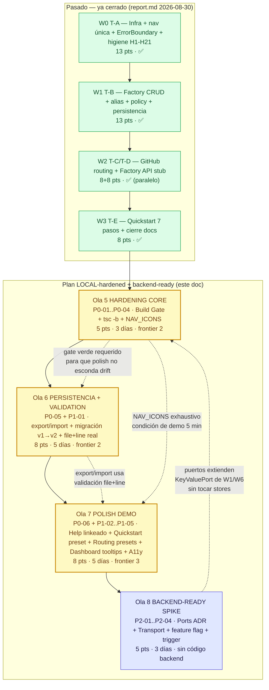
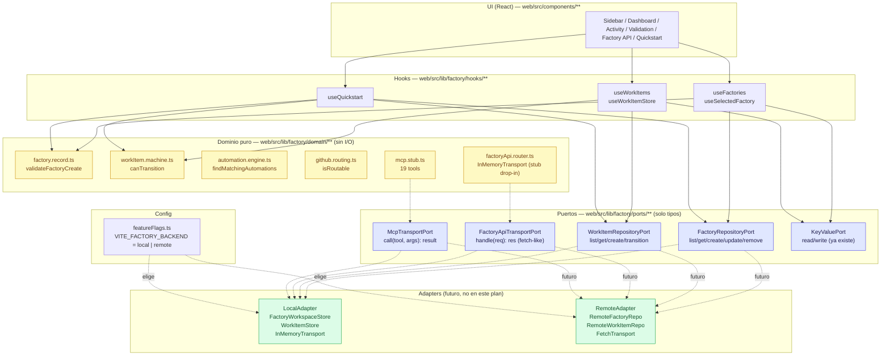
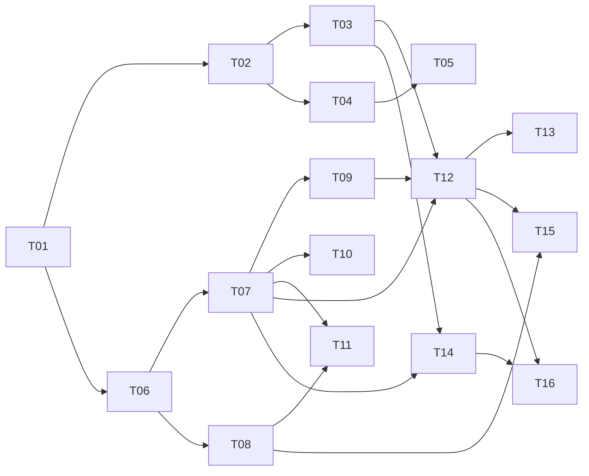
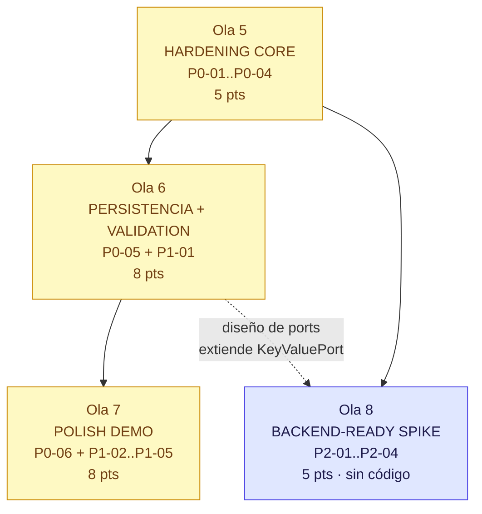
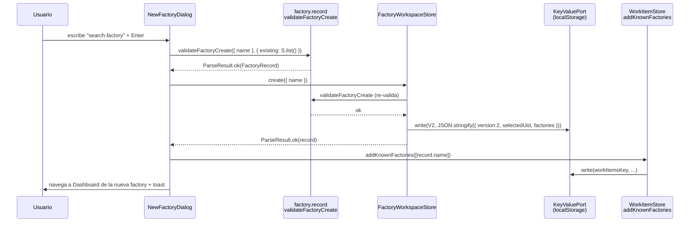
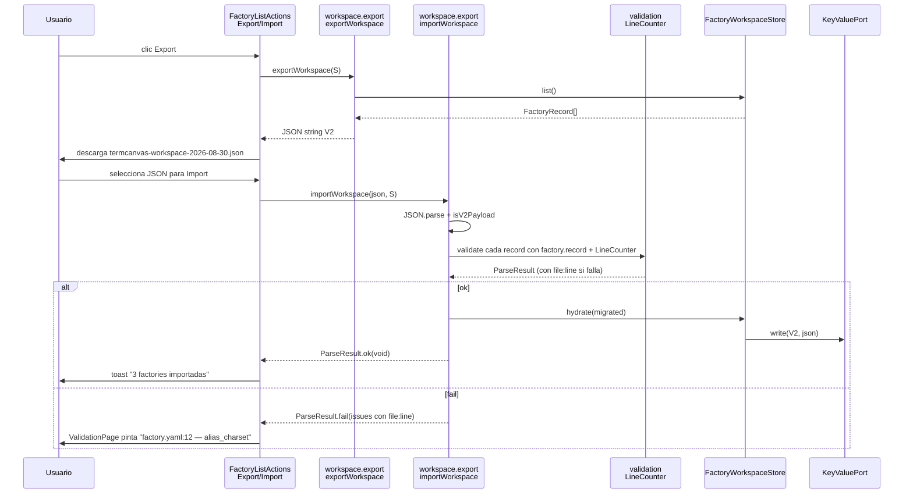
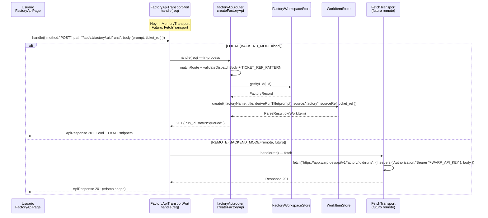
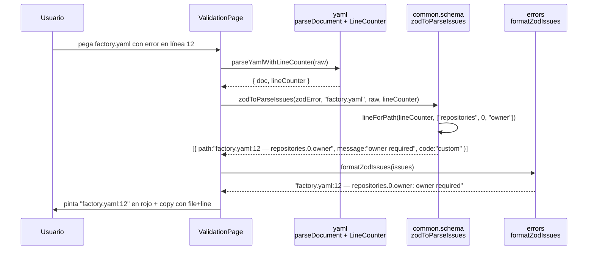

# PLAN DE OLAS — TermCanvas Warp Factories Simulator (LOCAL-first, backend-ready sin backend)

> **Autor:** Gao — Architect · Equipo `software-termcanvas-waves`
> **Fecha:** 2026-08-30 · Rama base `main-c2128e3a` (`web/` package)
> **Entrada:** `PRD-WAVES-EVALUACION.md` (Alice, 2026-08-30) + `WarpFactories.md` 19 § + `WarpFactories-UserStories.md` 155 US + `WarpFactories-Tickets.md` 16 tickets (410 pts) + `docs/INCREMENTAL-DESIGN.md` G1-G6 + `report.md` 4 olas T-A..T-E + verificación viva `tsc --noEmit 0 / tsc -b 11 errores / vitest 847 verde / vite build verde`
> **Stack congelado:** Vite 8.2 + React 19.2 + TS 6.0 + Tailwind 4.1 + `zod` + `yaml` + `motion`/`framer-motion` + `lucide-react` + `clsx`/`tailwind-merge`, pnpm, sin backend, storage `KeyValuePort` (memory + localStorage), dominio puro separado de React.
> **Decisión de producto vigente:** **solo LOCAL por ahora** · *team leader no codea* · backend es spike de diseño sin código hasta trigger.
> **Objetivo de este plan:** llevar la réplica de **LOCAL slices con deuda `tsc -b`** → **LOCAL-hardened demo 5 min irrompible + backend-ready sin codear backend**, con receipt único verificable y coste de arrepentimiento mínimo si Warp abre Early Access.

---

## Índice

1. [Contexto y objetivos](#1-contexto-y-objetivos)
2. [Principios arquitectónicos / constraints](#2-principios-arquitectónicos--constraints)
3. [Estado actual → estado objetivo](#3-estado-actual--estado-objetivo)
4. [Mapa de olas con dependencias](#4-mapa-de-olas-con-dependencias)
5. [Tabla resumen de olas](#5-tabla-resumen-de-olas)
6. [Deuda `tsc -b`: diagnóstico y fixes (11 errores en 7 categorías)](#6-deuda-tsc--b-diagnóstico-y-fixes)
7. [Detalle por ola (checklist, archivos, interfaces, DoD, tests, riesgos)](#7-detalle-por-ola)
   - [Ola 5 — HARDENING CORE: Build Gate + `tsc -b` + `NAV_ICONS`](#ola-5--hardening-core-build-gate--tsc--b--nav_icons-p0-01--p0-04)
   - [Ola 6 — PERSISTENCIA + VALIDATION : localStorage robusto + `file+line` real](#ola-6--persistencia--validation-p0-05--p1-01)
   - [Ola 7 — POLISH DEMO : Quickstart + Routing + Dashboard + A11y/i18n](#ola-7--polish-demo-p0-06--p1-02--p1-05)
   - [Ola 8 — BACKEND-READY SPIKE : puertos, adapters, feature flag, ADR (sin backend)](#ola-8--backend-ready-spike-p2-01--p2-04-sin-código)
8. [Preparación backend sin implementar](#8-preparación-backend-sin-implementar)
9. [Trigger para backend real](#9-trigger-para-backend-real)
10. [Alternativas consideradas y tradeoffs](#10-alternativas-consideradas-y-tradeoffs)
11. [Respuestas a las 10 preguntas abiertas del PRD §7](#11-respuestas-a-las-10-preguntas-abiertas-del-prd-7)
12. [Shared Knowledge — convenciones cross-file](#12-shared-knowledge--convenciones-cross-file)
13. [Grafos de dependencia](#13-grafos-de-dependencia)
14. [Métricas de éxito y receipt canónico](#14-métricas-de-éxito-y-receipt-canónico)
15. [Pendientes, backlog P2+ y fuera de scope](#15-pendientes-backlog-p2-y-fuera-de-scope)
16. [Apéndice A — Inventario de archivos por ola](#apéndice-a--inventario-de-archivos-por-ola)
17. [Apéndice B — Interfaces clave (TS signatures)](#apéndice-b--interfaces-clave-ts-signatures)
18. [Apéndice C — Flujos clave (sequence)](#apéndice-c--flujos-clave-sequence)

---

## 1. Contexto y objetivos

### 1.1 Por qué este plan existe

La réplica LOCAL está **demo-funcional** (33 archivos de test / 847 tests, dominio puro impecable, 16 tickets con slices LOCAL demoables, 29 `NavItemId` con `assertNever` exhaustivo, 7 pasos Quickstart, 5 checks GitHub routing, 7 rutas Factory API stub) **pero con deuda de build oculta**: `tsc --noEmit 0` vs `tsc -b 11 errores` vs `vite build verde`. El `report.md` y `WarpFactories-Tickets.md` dicen "build verde" sin calificar — eso erosiona confianza. Antes de decidir backend, hay que cerrar el **LOCAL-hardening** y dejar un **receipt único** que no mienta.

El riesgo estratégico es alto: Warp lanzó Early Access 2026-08-18 ($10k qualifying, docs actualizadas 2026-08-28). Si abre en Q4 2026, una inversión grande en paridad 1:1 + backend tiene **alto arrepentimiento**. El plan maximiza valor con **mínimo arrepentimiento**: demo LOCAL irrompible sin credenciales + diseño de puertos para swap futuro sin rewrite.

### 1.2 Objetivos ortogonales (del PRD, se mantienen)

| ID | Objetivo | Verbo | Medida |
|----|----------|-------|--------|
| **O1** | **Demo LOCAL irrompible (sin credenciales)** | Cualquiera clona `web/`, `pnpm i && pnpm --filter web dev`, y en 5 min crea factory → simula routing dual-label → dispara Factory API → completa Quickstart 7 pasos, sin `warp_local_api_key` ni OAuth. | Guion `docs/DEMO-5MIN.md` ejecutable + video/gif. |
| **O2** | **Confianza verificable (receipt único)** | Un único comando canónico define "verde". Docs/tickets/report citan commit + comando, sin "build verde" ambiguo. | `pnpm check` verde en CI local y docs. |
| **O3** | **Backend opcional por puertos (sin rewrite)** | El día con credenciales / Warp abierto, el paso a backend es cambiar un `port` (storage, transport), no reescribir dominio. | ADR + tipos `*Port` + feature flag, 0 líneas de backend real. |

### 1.3 No-objetivos (explícitos, no negociables)

- ❌ No DB, no auth server, no deploy, no secrets server, no OTel real, no metering real.
- ❌ No integraciones live (GitHub App install, Slack OAuth, Linear/Jira/GitLab/MCP live, harness `claude/codex/gemini` con secrets) — quedan como slices LOCAL + doc estática.
- ❌ No Playwright E2E hasta MCP disponible — `jsdom` + `vitest` es DoD.
- ❌ No cambiar `schemaVersion v1alpha1` ni agregar features de Warp fuera de `WarpFactories.md` 2026-08-29.
- ❌ No nuevas dependencias salvo justificación escrita en ADR.

---

## 2. Principios arquitectónicos / constraints

### 2.1 Constraints innegociables (del PRD §3.4 + verificados en repo)

| ID | Constraint | Evidencia en repo |
|----|------------|-------------------|
| C1 | **Solo LOCAL** — todo P0/P1 demoa sin B1–B10 | `factoryApi.router.ts` in-process, `mcp.stub.ts` 19 tools, `storage.port.ts` localStorage |
| C2 | **Sin credenciales** — no pedir tokens; stubs con mismos paths que Warp | `FACTORY_API_PREFIX /api/v1/factory`, `AGENT_API_PREFIX /agent/runs`, `TICKET_REF_PATTERN` |
| C3 | **Sin Playwright/debugger** — `jsdom` + `vitest` | `vitest.config.ts` `environment: jsdom`, `pool: threads` |
| C4 | **Stack congelado** — Vite 8.2 / React 19.2 / TS 6.0 / Tailwind 4.1 / zod / yaml / pnpm | `web/package.json` + `web/vite.config.ts` alias `motion: motion/react` |
| C5 | **Team leader no codea** — olas diseñadas para agents | Este plan entrega file lists + interfaces + DoD, no código |
| C6 | **Puro / React separado, OCP estricto, DIP por puertos** | `domain/` sin React, `automation.engine.ts` intacto 393 LOC, `KeyValuePort` inyectado |

### 2.2 Principios de diseño (G1–G6, se mantienen y se extienden)

1. **Puro / React separados.** Cada feature = módulo puro en `web/src/lib/factory/**` (sin React, sin I/O, determinista) + una página en `web/src/components/**` que solo renderiza y delega. Regla: `domain/` no importa de `components/`, nunca.
2. **OCP sobre modificación.** No se edita firma ni semántica de ningún export existente. Todo se añade (nuevos módulos o params `opts?` al final). Los 847 tests siguen verdes por construcción. Agregar campo = `expand–contract` si toca `factory.yaml` schema.
3. **Errores como valores — `ParseResult<T>`.** Todo lo que puede fallar devuelve `ParseResult<T>` con `ParseIssue { path, message, code }`. Cero `throw` en dominio. UI decide cómo pintar `path file:line`.
4. **DIP — puertos pequeños.** Persistencia (`KeyValuePort`), reloj (`now: () => string`), IDs (`uid: () => string`), transport (`FactoryApiTransportPort`) se inyectan. Dominio no conoce `localStorage`/`fetch`.
5. **Traza obligatoria.** Cada módulo puro abre con `// SRP` + `// Source: WarpFactories.md §N` + `// US-NNN`. Cada regla de UI cita `§N` y `US-NNN`. Cada error tiene `trace` y `code` testeable.
6. **Cero deps nuevas.** Solo React 19, zod, yaml, motion, lucide-react, clsx/tailwind-merge. Nueva dep = ADR con alternativas y coste bundle.
7. **Layout canónico de página** (copiado de `ValidationPage.tsx`, unificado en `docs/INCREMENTAL-DESIGN.md §2.7`):
   ```tsx
   <div className="flex min-h-0 flex-1 flex-col overflow-auto bg-panel">
     <div className="flex h-[44px] items-center px-4">wilson › Page + badge §N</div>
     <div className="mx-auto w-full max-w-[1080px] p-4">
       <section className="rounded-[12px] border border-zinc-200 bg-white p-4 shadow-sm">
   ```
8. **Mínimos campos (Nielsen + Fitts).** Un solo input obligatorio por pantalla, defaults sensibles, *progressive disclosure* (alias auto-copia `name`), acción primaria grande a la izquierda (`bg-zinc-900`), presets de 1 clic.
9. **Determinismo testeable.** Reloj/ID inyectados, `Math.random` prohibido, `pool: threads` en Windows, `Object.freeze` en seeds si aporta.

### 2.3 Filosofía del plan (qué lo hace "súper completo")

- **Olas = frontera ancha, no cadena lineal.** Cada ola agrupa features que pueden avanzar en paralelo (frontier-width ≥2) y deja siempre un incremento demoable. Ninguna ola bloquea a la siguiente salvo donde hay dependencia real de tipos (ej. `tsc -b` verde antes de polish).
- **Deuda primero, valor después, apuesta al final.** Ola 5 cierra el build (sin eso nada es creíble), olas 6–7 maximizan valor LOCAL visible, ola 8 apuesta a futuro sin coste hundido.
- **Recibo antes que relato.** Toda afirmación "verde/completo" debe citar `commit + comando + salida` — el plan mismo incluye el script que lo hace imposible de falsificar.

---

## 3. Estado actual → estado objetivo

### 3.1 Tabla de salud — hoy (verificado 2026-08-30, PRD §1.1)

| Dimensión | Hoy | Objetivo tras olas 5–7 | Ola que lo cierra |
|-----------|-----|------------------------|-------------------|
| **Dominio puro** | 🟢 35 archivos, OCP intacto | 🟢 igual + 3 módulos nuevos (`workspace.migration.ts`, `exportImport.ts`, `validation.lineCounter.ts`) sin mutar engine | 6 |
| **Tests** | 🟢 33 / 847 `threads` | 🟢 ≥860 / 0 flakes | 5–7 |
| **`tsc --noEmit`** | 🟢 0 | 🟢 0 | 5 |
| **`tsc -b`** | 🔴 **11 errores** | 🟢 **0** | **5** |
| **`vite build`** | 🟡 verde escondiendo `tsc -b` | 🟢 verde coincidente con `tsc -b` | 5 |
| **`oxlint`** | 🟢 0 en `src/` (158 files) | 🟢 0 + sin ignores ad-hoc | 5 |
| **`pnpm check`** | 🔴 no existe | 🟢 existe, usado en pre-commit | 5 |
| **Navegación** | 🟢 29 ids, `assertNever` | 🟢 29 ids, `NAV_ICONS` exhaustivo testeado | 5 |
| **Persistencia** | 🟡 localStorage sin migración/export | 🟢 v1→v2 migración + export/import + quota handling | 6 |
| **Dashboard/Activity/Runs** | 🟡 slices con disclaimers | 🟢 disclaimers con tooltip + `file+line` en Validation | 6–7 |
| **Docs** | 🟡 §17 OK, Tickets/report con "build verde" ambiguo | 🟢 todos citan receipt canónico | 5 |
| **Backend** | 🔵 bloqueado por diseño | 🔵 diseño de puertos listo, 0 líneas backend | 8 |

### 3.2 Qué NO se toca (referencia sólida)

- `src/lib/factory/domain/automation.engine.ts` (393 LOC, OCP).
- `src/lib/factory/domain/workItem.machine.ts` + `workItem.rules.ts`.
- `src/lib/factory/domain/factory.record.ts` + `factory.policy.ts` + `storage.port.ts` + `factoryWorkspace.store.ts` (observer `Map`+`Set<listener>`+`version`).
- `src/nav.ts` como única fuente de verdad (29 ids, `assertNever`).

---

## 4. Mapa de olas con dependencias

### 4.1 Vista global (desde cierre T-A..T-E hasta LOCAL-hardened + backend-ready)



### 4.2 Orden recomendado y frontier-width

1. **Ola 5 primero, sin excepción.** Sin `tsc -b 0` y `pnpm check`, cualquier polish posterior puede introducir drift silencioso. Es el único gate que bloquea a las demás.
2. **Ola 6 y el diseño de Ola 8 pueden solaparse** (un dev en persistencia, otro —o el mismo en spike de ½ jornada— dibujando puertos). Pero Ola 6 no debe cerrarse sin que su `exportJSON` pase por el `file+line` real si se eligió `yaml` LineCounter.
3. **Ola 7 al final del hardening.** Es la que deja la demo de 5 min grabable; necesita persistencia y validación ya verdes para no re-grabar.
4. **Ola 8 no bloquea demo.** Puede ir en paralelo a Ola 7 si hay capacidad, pero nunca antes que Ola 5 (los tipos de puertos deben compilar).

**Frontier-width por ola:**

| Ola | Width | Tareas paralelizables |
|-----|-------|-----------------------|
| 5 | 2 | `tsc -b` fixes (código) ‖ `pnpm check` + docs receipt (tooling) |
| 6 | 2 | `workspace migration + export/import` ‖ `validation file+line` (yaml LineCounter) |
| 7 | 3 | `Help linkeado` ‖ `Quickstart/Routing presets` ‖ `Dashboard disclaimers + A11y` |
| 8 | 1 | Spike de diseño (ADR + tipos), sin paralelismo de código |

---

## 5. Tabla resumen de olas

| Ola | Nombre | Objetivo en 1 frase | Tickets origen | Pts (Fib) | Duración (1 dev) | Depende de | Demo al cierre |
|-----|--------|---------------------|----------------|-----------|------------------|------------|----------------|
| **5** | **HARDENING CORE** | Cerrar `tsc -b` + gate único + `NAV_ICONS` exhaustivo + docs alineados | P0-01, P0-02, P0-03, P0-04 (T01, T12, H) | **5** (3+1+1) | **3 días** | W3 (T-E) | `pnpm check` verde pegable; `NavItemId` sin icono = `tsc` rojo |
| **6** | **PERSISTENCIA + VALIDATION** | Persistencia LOCAL robusta (migración, export/import, quota) + `file+line` real en ValidationPage | P0-05 (T02/D7), P1-01 (T06/US-058) | **8** (5+3) | **5 días** | Ola 5 | Exporto 3 factories con pin/policy y reimporto idéntico; Validation pinta `factory.yaml:12` |
| **7** | **POLISH DEMO** | Demo 5 min sin credenciales pulida + Help linkeado + presets + disclaimers visibles + A11y | P0-06 (T16/US-145→148), P1-02 (T15/US-142), P1-03 (T09/US-076), P1-04 (T12/US-096→101), P1-05 (DoD) | **8** (2+2+2+2) | **5 días** | Olas 5, 6 | Guion `DEMO-5MIN.md` ejecutable de 5 min sin cortes |
| **8** | **BACKEND-READY SPIKE** | Diseño de puertos/transport/feature-flag/trigger listo para swap sin rewrite (sin código backend) | P2-01..P2-04 (T02,T14,T15,R1) | **5** (3+1+1) | **2–3 días** | Ola 5 (tipos) | ADR `docs/ADR-001-ports-backend.md` + diagrama control vs execution + tabla B1–B8→env vars |
| | **Total plan** | LOCAL irrompible + recibo + backend-ready | P0×6 + P1×5 + P2×4 | **26** | **~3 semanas** (15 días hábiles) | — | Demo + receipt + ADR |

> **Nota de estimación:** Fibonacci relativo a `T-B 13 pts`. Ola 5 es pequeña pero crítica (CPL alto). Ola 6 es la única con esfuerzo medio-alto (persistencia + yaml LineCounter). Ola 8 es spike sin código — su valor es evitar rewrite futuro, no story points de feature.

---

## 6. Deuda `tsc -b`: diagnóstico y fixes

### 6.1 Verificación viva (2026-08-30, `web/`)

```
tsc --noEmit              → 0 errores  (tsconfig.app.json, bundler, skipLibCheck, DOM)
tsc -b                    → 11 errores (project references: tsconfig.json → tsconfig.app.json + tsconfig.node.json, erasableSyntaxOnly, noUnusedLocals/Parameters, force moduleDetection)
vite build                → verde (no typechequea, esconde los 11)
vitest run --pool=threads → 33 / 847 verde
oxlint                    → 0 en src/ (158 files, ignorePatterns dist-verify/**)
```

**Por qué `tsc --noEmit` no ve lo que `tsc -b` sí ve:** `tsc -b` respeta `references` y compila cada proyecto con su `tsBuildInfo` y checks de referencia cruzada + `erasableSyntaxOnly`/`verbatimModuleSyntax` estrictos. `vitest` y `vite` usan `esbuild`/`bundler` que transpilan sin validar referencias. El drift no es "config rota", es **código que solo es válido en modo bundler laxo**.

**Comando canónico futuro (definición de "verde"):**
```bash
pnpm --filter web exec tsc --noEmit && pnpm --filter web exec tsc -b && pnpm --filter web test -- --pool=threads --run && pnpm --filter web build && pnpm --filter web exec oxlint
# o, tras Ola 5: pnpm --filter web check
```
Todo doc que diga "build verde" debe citar **commit + este comando + salida**.

### 6.2 Los 11 errores agrupados en 7 categorías (con fix prescrito)

| # | Categoría | Fichero(s) : línea | Error `tsc -b` literal | Causa raíz | Fix prescrito (OCP, sin cambiar semántica) | Ola |
|---|-----------|--------------------|------------------------|------------|--------------------------------------------|-----|
| **E1** | `NAV_ICONS` incompleto | `web/src/components/Sidebar.tsx:33` | `TS2741: Property '"Factory API"' is missing in type 'Record<NavItemId, LucideIcon>' but required in type 'Record<NavItemId, LucideIcon>'` | Se añadió `Factory API` a `FACTORY_NAV_IDS` en `nav.ts` (29 ids) pero `NAV_ICONS` quedó con 28 entradas. `Record<NavItemId, …>` exige exhaustividad; `tsc --noEmit` en modo bundler no lo exigió por `skipLibCheck` + cache. `Sidebar` colapsado usa `NAV_ICONS[item.id]` sin fallback. | **Fix A (recomendado):** añadir ` "Factory API": LayoutGrid` (o icono semántico `Plug`/`Waypoints` si aporta) en `NAV_ICONS` + test `NAV_ITEMS.every(id => id in NAV_ICONS)` (P0-04). **Fix B (alternativa):** `Record<NavItemId, LucideIcon>` → `Partial<Record<…>>` + fallback `?? LayoutGrid` — no recomendado porque silencia futuros desyncs. | 5 |
| **E2** | `container` usado antes de asignar | `web/src/lib/factory/__tests__/agents.page.test.ts:403` | `TS2454: Variable 'container' is used before being assigned.` | `let container: HTMLElement;` declarado fuera de `act`, asignado dentro de `await act(async () => { container = render(...).container; })`, leído después. `tsc --noEmit` lo toleró por `verbatimModuleSyntax` + `erasableSyntaxOnly` no estricto en tests; `tsc -b` aplica `noUnusedLocals` + control flow analysis estricto. | ```ts\nlet container!: HTMLElement; // definite assignment\n// o\nconst { container } = render(...); // sin let\n// o\nlet container = document.createElement('div');\n``` + habilitar `eslint` `no-use-before-define` equivalente. No cambiar semántica del test. | 5 |
| **E3a** | `sort` en `readonly string[]` | `web/src/lib/factory/__tests__/factoryWorkspace.test.ts:213` | `TS2339: Property 'sort' does not exist on type 'readonly string[]'.` | `getKnownFactories(): readonly string[]` devuelve `readonly`; `sort()` muta. `tsc -b` con `noUnusedParameters`/`erasableSyntaxOnly` no permite mutar readonly. | ```ts\nexpect([...workItems.getKnownFactories()].sort()).toEqual([...])\n// o con toSorted (ES2023):\nexpect(workItems.getKnownFactories().toSorted()).toEqual([...])\n``` | 5 |
| **E3b** | `source` missing en `CreateWorkItemInput` | `web/src/lib/factory/__tests__/factoryWorkspace.test.ts:219,231` | `TS2345: Argument of type '{ factoryName, title, createdBy }' is not assignable to parameter of type 'CreateWorkItemInput'. Property 'source' is missing` | `CreateWorkItemInput` exige `source: WorkItemSource` (US-007 intake), pero el test lo omitió. `tsc --noEmit` no lo vio porque `vitest` compila tests con `esbuild` sin `strict` de referencias. | ```ts\nworkItems.create({ factoryName: \"termcanvas-factory\", title: \"t\", createdBy: \"me\", source: \"direct\" })\n``` Ambos call sites idem. Si se quiere ergonomía, añadir helper `makeDirectInput(factoryName, title, createdBy)` pero no hacer `source` opcional (rompe traza). | 5 |
| **E4** | `AutomationDefinition` incompleto | `web/src/lib/factory/__tests__/github.routing.test.ts:122,133` | `TS2739: Type '{ name, enabled, triggers }' is missing the following properties from type 'AutomationDefinition': agent, prompt, rawPath` | `AutomationDefinition` (de `automation.schema.ts` / `factoryRegistry.ts`) exige `agent`, `prompt`, `rawPath` (US-054). El test pasó `{ name, enabled, triggers }` mínimo para probar `evaluateGitHubEvent` — `tsc -b` no permite omitir. | **Fix recomendado (OCP):** helper `makeAutomationStub(overrides)` que rellena `agent: \"foreman\", prompt: \"stub\", rawPath: \"automations/stub/automation.md\"` + `satisfies AutomationDefinition`:\n```ts\nconst automation = { name: \"route\", enabled: true, agent: \"foreman\", prompt: \"stub\", rawPath: \"automations/route/automation.md\", triggers: [{ provider: \"github\", event: \"issue_comment_created\", filter: {} }] } satisfies AutomationDefinition;\n``` No relajar `AutomationDefinition` a `Partial`. | 5 |
| **E5** | `HelpSectionProps.children` required pero tests omiten | `web/src/lib/factory/__tests__/troubleshooting.test.ts:199,209` | `TS2769: No overload matches this call. Property 'children' is missing in type '{ id, title, description }' but required in type 'HelpSectionProps'.` | `HelpSectionProps { children: ReactNode }` es required, pero dos tests hacen `React.createElement(HelpSection, { id, title, description })` sin children. `tsc --noEmit` lo toleró por `jsx: react-jsx` + `skipLibCheck`; `tsc -b` aplica `noUnusedLocals` + `verbatimModuleSyntax` estricto. | **Opción A (UI correcta):** `children: ReactNode` → `children?: ReactNode` en `HelpSection.tsx`, y `{children}` renderiza `null` si ausente. Mantiene compat y cierra `no-children-prop` de `oxlint` (ver H17). **Opción B:** fixear tests a `React.createElement(HelpSection, {…}, \"Body\")` o `createElement(HelpSection, {…}, null, \"Body\")`. **Recomendado: A** (componente presentational no debe exigir children para existir; los 2 tests sin children son válidos como “sección vacía”). | 5 |
| **E6** | `WorkItemStoreContext` `children` required | `web/src/lib/factory/__tests__/workItem.store.context.test.tsx:13` | `TS2769: Property 'children' is missing in type '{ store }' but required in type '{ store?: WorkItemStore; children: ReactNode }'` | `WorkItemStoreProvider({ store, children }: { store?: WorkItemStore; children: ReactNode })` exige `children`, pero el test hace `createElement(WorkItemStoreProvider, { store: custom }, children)` mal tipado — el 3er arg de `createElement` es `children`, no un field. `tsc -b` ve `Attributes & { store, children }` y exige `children`. | ```ts\ncreateElement(WorkItemStoreProvider, { store: custom }, children)\n// o\nrender(<WorkItemStoreProvider store={custom}><div>child</div></WorkItemStoreProvider>)\n``` No hacer `children` opcional en el Provider (rompe `WorkItemStoreContext.tsx` H16). Fix solo en test. | 5 |
| **E7** | `PropertyKey[]` vs `(string \| number)[]` | `web/src/lib/factory/schemas/common.schema.ts:91` | `TS2345: Argument of type 'PropertyKey[]' is not assignable to parameter of type '(string | number)[]'. Type 'symbol' is not assignable to type 'string | number'.` | `Object.keys(obj)` tipa como `string[]` en DOM lib, pero `Reflect.ownKeys`/`Object.getOwnPropertySymbols` tipan como `PropertyKey[]` (incluye `symbol`). Algún helper en `common.schema.ts:91` pasa `PropertyKey[]` a función que espera `(string|number)[]`. | ```ts\n// antes\nfunction foo(keys: PropertyKey[]) { bar(keys); } // bar(keys: (string|number)[])\n// después\nfunction foo(keys: PropertyKey[]) { bar(keys.filter((k): k is string => typeof k === \"string\")); }\n// o narrow con typeof k !== \"symbol\"\n``` Alternativa: `bar` acepta `PropertyKey[]` y filtra dentro — preferido si `bar` es de dominio (no Zod lib). No usar `as string[]`. | 5 |

> **Total 11 errores → 7 categorías → todos P0 y todos en Ola 5.** Ninguno requiere refactor de dominio; son fixes de 1–3 líneas cada uno + 2 tests con helper. El tiempo dominante es verificar el gate completo, no el fix.

### 6.3 Decisión de config (responde PRD §7 pregunta 1)

**¿`tsc -b` debe ser el gate canónico o colapsar references a un solo `tsconfig.json`?**

- **Decisión: mantener `tsconfig.json` con `references` + `tsc -b` como gate canónico.** No colapsar.
- **Por qué:** `references` da builds incrementales correctos (`tsBuildInfo` por proyecto), separa `src` (DOM, `bundler`, `react-jsx`) de `vite.config.ts`/`vitest.config.ts` (Node, `nodenext`), y es el modo que detectó los 11 errores. Colapsar a un solo `tsconfig.json` ocultaría la diferencia DOM vs Node y haría `vite.config.ts` compilar con `lib: DOM` innecesario.
- **Qué comando va a `pnpm check`:** `tsc --noEmit && tsc -b && vitest run --pool=threads && vite build && oxlint`. `tsc --noEmit` se mantiene como fast-fail (1s) antes del más lento `tsc -b` (2–3s) — redundante pero pedagógico. Si se quiere ahorrar 1s, dejar solo `tsc -b` (ya cubre `src` y `node`).

---

## 7. Detalle por ola

### Ola 5 — HARDENING CORE: Build Gate + `tsc -b` + `NAV_ICONS` (P0-01 → P0-04)

**Objetivo:** que `pnpm check` sea la definición única de "verde" y que `tsc -b` pase de 11 → 0 sin cambiar semántica de dominio.

**Tickets que cierra:** P0-01 (D1–D6), P0-02 (gate), P0-03 (docs receipt), P0-04 (NAV_ICONS). Traza T01, T12, H.

**Archivos**

| Ruta relativa `web/` | Acción | Motivo |
|----------------------|--------|--------|
| `package.json` | **modificar** | Añadir `scripts.check = "tsc --noEmit && tsc -b && vitest run --pool=threads && vite build && oxlint"` + `scripts.check:quick = "tsc -b && vitest run --pool=threads"` |
| `.husky/pre-commit` | **nuevo** (opcional, P0-02) | `pnpm --filter web exec tsc -b --pretty` como fast gate (no bloqueante si no hay husky) |
| `src/components/Sidebar.tsx` | **modificar** | Añadir `"Factory API": LayoutGrid` a `NAV_ICONS` (E1) |
| `src/nav.ts` | **no tocar** (verificar) | Ya tiene 29 ids; añadir test de exhaustividad fuera |
| `src/lib/factory/schemas/common.schema.ts` | **modificar** | Narrow `PropertyKey[]` → `string[]` (E7) |
| `src/components/help/HelpSection.tsx` | **modificar** | `children: ReactNode` → `children?: ReactNode` (E5, PRD §7-4) |
| `src/lib/factory/__tests__/agents.page.test.ts` | **modificar** | Fix `container` definite assignment (E2) |
| `src/lib/factory/__tests__/factoryWorkspace.test.ts` | **modificar** | `[...]sort()` + `source: \"direct\"` (E3a, E3b) |
| `src/lib/factory/__tests__/github.routing.test.ts` | **modificar** | Helper `makeAutomationStub` con `agent/prompt/rawPath` (E4) |
| `src/lib/factory/__tests__/troubleshooting.test.ts` | **modificar** | Pasar `children` o aceptar `children?` (E5) |
| `src/lib/factory/__tests__/workItem.store.context.test.tsx` | **modificar** | `createElement` con 3er arg `children` (E6) |
| `src/lib/factory/__tests__/navIcons.test.ts` | **nuevo** | `NAV_ITEMS.every(id => id in NAV_ICONS)` + `Object.keys(NAV_ICONS).length === NAV_ITEMS.length` |
| `WarpFactories-Tickets.md` | **modificar** | Closure matrix + receipt versionado (P0-03) |
| `report.md` | **modificar** | Validación global con `tsc -b 0` + commit hash (P0-03) |
| `docs/RECEIPT.md` | **nuevo** (recomendado, ver §11-8) | `commit · tsc --noEmit 0 · tsc -b 0 · 847+ tests · vite build · oxlint 0` pegable |
| `README.md` | **modificar** | Documentar `pnpm check` + `DEMO-5MIN.md` |

**Interfaces clave (no nuevas, solo fixes)**

```ts
// nav.test.ts — nuevo test de exhaustividad (P0-04)
// Source: WarpFactories.md §10 · PRD P0-04
import { NAV_ITEMS } from "../src/nav";
import { NAV_ICONS } from "../src/components/Sidebar"; // o exportar NAV_ICONS desde nav.ts si se mueve

export function assertNavIconsExhaustive(): void {
  for (const item of NAV_ITEMS) {
    if (!(item.id in NAV_ICONS)) throw new Error(`NAV_ICONS missing: ${item.id}`);
  }
  // + test inverso: no hay iconos huérfanos
  expect(Object.keys(NAV_ICONS)).toHaveLength(NAV_ITEMS.length);
}
```

**P0-04 alternativa de diseño (PRD §7-3):** si se quiere `nav.ts` 100% puro sin iconos, mover `NAV_ICONS` a `src/nav.icons.ts` con `satisfies Record<NavItemId, LucideIcon>` y test allí. No meter `icon` en `NavItem` (acopla `lucide-react` a dominio puro y rompe SRP).

**Criterios DoD**

- [ ] `pnpm --filter web exec tsc -b` → 0 errores (de 11 → 0)
- [ ] `pnpm --filter web check` existe y pasa (5 subcomandos)
- [ ] `vitest run --pool=threads` ≥847 verdes, sin bajar
- [ ] `vite build` verde (chunks dentro de presupuesto)
- [ ] `oxlint` 0 en `src/` (158 files)
- [ ] `WarpFactories-Tickets.md` + `report.md` citan `commit · comando · salida` (grep "build verde" sin comando = 0)
- [ ] Test `navIcons.test.ts` verde

**Tests**

- `navIcons.test.ts` (2 tests: every id has icon, no orphan icons)
- Re-verde de los 7 archivos tocados (no nuevos tests funcionales — los fixes no cambian comportamiento)

**Riesgos y mitigación**

| Riesgo | Prob | Mitigación |
|--------|------|------------|
| Fix `children?` rompe A11y `aria-labelledby` si sección vacía | Baja | `HelpSection` renderiza `aria-labelledby` siempre; `children ?? null` no afecta |
| `PropertyKey` narrow oculta bug real de `symbol` | Baja | Añadir test con `Object.getOwnPropertySymbols` si el helper es crítico |
| `pnpm check` lento (15–20s) desalienta pre-commit | Media | `check:quick` (solo `tsc -b + vitest`) para pre-commit; `check` completo en CI local manual |

**Estimación:** 5 pts (Fib) · 3 días · frontier 2 (fixes ‖ tooling+docs).

---

### Ola 6 — PERSISTENCIA + VALIDATION (P0-05 + P1-01)

**Objetivo:** persistencia LOCAL robusta (migración no destructiva, export/import validado, quota handling) + `file+line` real en ValidationPage (no `file.field` marketing).

**Tickets que cierra:** P0-05 (T02, D7), P1-01 (T06, US-058).

**Por qué juntas:** `exportJSON` debe ser `v1alpha1` compatible y validarse con el parser que ya reporta `file:line`; si se hace `file+line` después, hay que re-tocar export.

**Archivos**

| Ruta relativa `web/` | Acción | Motivo |
|----------------------|--------|--------|
| `src/lib/factory/store/storage.port.ts` | **modificar (+=)** | Añadir `WORKSPACE_STORAGE_KEY_V2 = \"termcanvas.factory-workspace.v2\"` + helpers `readJson/writeJson` con try/catch quota |
| `src/lib/factory/store/workspace.migration.ts` | **nuevo** | `migrateV1toV2(rawV1): PersistedWorkspaceV2` + `isV1Payload`, `isV2Payload` — puro, sin I/O |
| `src/lib/factory/store/workspace.export.ts` | **nuevo** | `exportWorkspace(store): string` (JSON `v1alpha1` compatible) + `importWorkspace(json, store, opts): ParseResult<void>` validado por `factory.parser` |
| `src/lib/factory/store/factoryWorkspace.store.ts` | **modificar (+=)** | Integrar migración `v1→v2` no destructiva en `hydrate()`, exponer `exportJSON()/importJSON()` que delegan a `workspace.export.ts` |
| `src/lib/factory/domain/validation.lineCounter.ts` | **nuevo** | Wrapper `LineCounter` de `yaml` (`parseDocument` con `LineCounter`) para mapear `ZodIssue.path` → `line/col` real |
| `src/lib/factory/parsers/yaml.utils.ts` | **modificar (+=)** | Añadir `parseYamlWithLineCounter(raw): { doc, lineCounter }` sin romper `parseYamlSafe` existente |
| `src/lib/factory/schemas/common.schema.ts` | **modificar (+=)** | `zodToParseIssues` con `raw` + `lineCounter` → `path: \"factory.yaml:12 — repositories.0.owner\"` (P1-01) |
| `src/lib/factory/domain/errors.ts` | **verificar** | `formatZodIssues` ya produce `file.field`; extender a `file:line — field` si hay `line` |
| `src/components/validation/ValidationPage.tsx` | **modificar** | Pintar `file:line` real (usar `lineCounter`), no `file.field`; mantener fallback sin `line` |
| `src/lib/factory/__tests__/workspace.migration.test.ts` | **nuevo** | Gherkin P0-05: export→import idéntico, migración v1→v2, snapshot corrupto → seed |
| `src/lib/factory/__tests__/validation.lineCounter.test.ts` | **nuevo** | `factory.yaml:12` para `repositories.0.owner` con `LineCounter` |
| `src/components/factories/FactoryListActions.tsx` | **nuevo** (pequeño) | Botones Export/Import en `Settings` o `Factories` header (reusa `FactoryWorkspaceStore`) |

**Interfaces clave**

```ts
// workspace.migration.ts — puro, sin React, sin I/O
// Source: WarpFactories.md §2 · D7 · PRD P0-05
export const WORKSPACE_STORAGE_KEY_V2 = "termcanvas.factory-workspace.v2";
export interface PersistedWorkspaceV1 { readonly selectedUid: string; readonly factories: readonly FactoryRecord[]; }
export interface PersistedWorkspaceV2 {
  readonly version: 2;
  readonly selectedUid: string;
  readonly factories: readonly FactoryRecord[];
  readonly exportedAt?: string; // ISO, solo para export
}
export function isV1Payload(v: unknown): v is PersistedWorkspaceV1;
export function isV2Payload(v: unknown): v is PersistedWorkspaceV2;
export function migrateV1toV2(v1: PersistedWorkspaceV1, now?: () => string): PersistedWorkspaceV2;
export function migrateIfNeeded(raw: string | null): PersistedWorkspaceV2 | null; // null → seed

// workspace.export.ts — puro salvo store inyectado
// Source: PRD P0-05 Gherkin
export function exportWorkspace(store: FactoryWorkspaceStore, now?: () => string): string; // JSON.stringify V2
export function importWorkspace(json: string, store: FactoryWorkspaceStore): ParseResult<void>;
// - valida JSON.parse + isV2Payload + factory.parser por record
// - no pisa si hay error (ParseResult.fail con file:line)
// - quota exceeded → ParseResult.fail code "quota_exceeded"

// validation.lineCounter.ts — wrapper yaml
// Source: WarpFactories.md §7 · US-058 · PRD P1-01
import { LineCounter, parseDocument } from "yaml";
export interface YamlWithLines { readonly doc: ReturnType<typeof parseDocument>; readonly lineCounter: LineCounter; }
export function parseYamlWithLineCounter(raw: string): YamlWithLines;
export function lineForPath(lc: LineCounter, path: (string|number)[]): { line: number; col: number } | undefined;
```

**Validación file+line — decisión (PRD §7-5)**

- **Elegido:** `yaml` con `LineCounter` (ya es dep, 0 coste bundle). `yaml` expone `LineCounter` que mapea offset → `{ line, col }` sin re-parsear. Costo: ~20 LOC wrapper + 1 test con fixture `factory.yaml` real. Alternativa `yaml` sin `LineCounter` (buscar `key:` con `findLineForPath` actual) ya existe en `common.schema.ts` y es frágil (falsos positivos con `key:` en valores). Se mantiene como fallback si `LineCounter` no resuelve, pero el path primario es `LineCounter`.
- **Qué NO hacer:** no se usa `js-yaml` ni nueva dep.

**Persistencia — decisiones (PRD §7-2)**

- **KeyValuePort con localStorage alcanza** (no IndexedDB). Razón: factories + work items son <100 KB JSON (2 factories seed ~1.5 KB, 50 factories ~40 KB), muy por debajo de quota 5 MB. IndexedDB aportaría complejidad (versiones, transacciones, async) sin beneficio LOCAL. Se deja ADR note "si >500 factories, evaluar IndexedDB".
- **Export JSON es `v1alpha1` compatible** en forma (cada record tiene `name/alias/repositories` que el parser ya valida), pero el export es del **workspace** (`PersistedWorkspaceV2`), no de `factory.yaml` — no confundir. El import valida cada `FactoryRecord` con `validateFactoryCreate` (mismos `code` que `factory.record.ts`).
- **Migración `v1→v2` no destructiva:** `hydrate()` lee `V2` si existe; si solo hay `V1`, migra en memoria, escribe `V2` y mantiene `V1` sin borrar (rollback manual posible). Snapshot corrupto → seed (ya implementado para V1, se extiende a V2).

**Criterios DoD**

- [ ] `FactoryWorkspaceStore` con `exportJSON`/`importJSON` (validado por `factory.parser`), migración `v1→v2` testeada, quota handling sin throw
- [ ] `ValidationPage` pinta `factory.yaml:12` (no `factory.name`) para error en `repositories.0.owner` línea 12 de fixture real
- [ ] `workspace.migration.test.ts` ≥6 tests: export→import idéntico, pin/policy preservados, v1→v2, corrupto→seed, quota→fail
- [ ] `validation.lineCounter.test.ts` ≥3 tests con `LineCounter`
- [ ] `tsc -b 0`, `vitest` ≥853 verdes (847 + ≥6 nuevos)

**Riesgos y mitigación**

| Riesgo | Prob | Mitigación |
|--------|------|------------|
| Migración borra `V1` y no hay rollback | Baja | Mantener `V1` sin borrar en primera versión; borrar en V3 si se confirma |
| `LineCounter` no resuelve path anidado (`repositories.0.owner`) | Media | Fallback a `findLineForPath` existente + test con YAML real anidado |
| Export grande excede quota localStorage | Baja | `importWorkspace` captura `QuotaExceededError` → `ParseResult.fail` con `quota_exceeded` + UI toast, no throw |

**Estimación:** 8 pts (5 persistencia + 3 validation) · 5 días · frontier 2 (migración/export ‖ lineCounter).

---

### Ola 7 — POLISH DEMO (P0-06 + P1-02 → P1-05)

**Objetivo:** demo de 5 min sin credenciales pulida, Help linkeado donde duele, presets de 1 clic, disclaimers visibles, A11y/i18n polish, sin deuda nueva.

**Tickets que cierra:** P0-06 (T16, US-145→148), P1-02 (T15, US-142), P1-03 (T09, US-076), P1-04 (T12, US-096→101), P1-05 (DoD).

**Archivos**

| Ruta relativa `web/` | Acción | Motivo |
|----------------------|--------|--------|
| `src/components/help/HelpLinks.tsx` | **nuevo** | Componente `?` reutilizable que enlaza a `TroubleshootingPage#<anchor>` (P0-06) |
| `src/components/activity/ActivityBoard.tsx` | **modificar (+=)** | Añadir `?` que abre `Troubleshooting > One action → two runs` / `Stop task` |
| `src/components/runs/RunsPage.tsx` | **modificar (+=)** | `?` → `Troubleshooting > Runs` |
| `src/components/automations/AutomationsPage.tsx` | **modificar (+=)** | `?` → `Troubleshooting > Work isn't starting` |
| `src/components/factory-api/FactoryApiPage.tsx` | **modificar (+=)** | `?` → `Troubleshooting > Factory API` |
| `src/components/routing/GitHubRoutingPage.tsx` | **modificar (+=)** | 4 presets 1 clic + `factory:<alias>` copiable + `continuationKey` visible (P1-03) |
| `src/lib/factory/domain/github.routing.derive.ts` | **modificar (+=)** | Pulir copy ES, presets con `trace` |
| `src/components/quickstart/QuickstartWizard.tsx` | **modificar (+=)** | Límite 2 repos con feedback "2 máx — el 3º reemplaza al más viejo" + tooltip chip deshabilitado (P1-02) |
| `src/lib/factory/domain/quickstart.wizard.ts` | **verificar** | Ya limita a 2 (reemplaza al más viejo) — solo falta UX |
| `src/components/dashboard/DashboardPage.tsx` | **modificar (+=)** | Tooltips disclaimers 8 métricas: `merged>opened`, `Autonomy push`, `Cost S/M/L/XL 100/500/1000`, `Scorer 3 newest sin date filter` (P1-04) |
| `src/lib/factory/domain/dashboard.derive.ts` | **verificar** | Ya tiene disclaimers — solo exponerlos como `tooltip` prop |
| `src/components/help/TroubleshootingPage.tsx` | **modificar (+=)** | Añadir `id` anchors para deep-link desde `?` |
| `src/components/a11y/*` o edits inline | **modificar** | `aria-current`, `aria-label`, `children?`, focus ring, `aria-expanded` (P1-05, H16/H17) |
| `docs/DEMO-5MIN.md` | **nuevo** | Guion 5 min con comandos + screenshots/gif (P0-06 métrica) |
| `src/lib/factory/__tests__/helpLinks.test.ts` | **nuevo** | `?` renderiza y linkea a `#anchor` correcto |
| `src/lib/factory/__tests__/dashboard.disclaimers.test.ts` | **nuevo** | 8 métricas tienen `tooltip` no vacío |

**Interfaces clave**

```ts
// HelpLinks.tsx — reutilizable
// Source: WarpFactories.md §18 · PRD P0-06
export interface HelpLinkProps { readonly anchor: TroubleshootingAnchor; readonly label?: string; }
export type TroubleshootingAnchor =
  | "setup" | "work-not-starting" | "two-runs" | "runs-stuck" | "no-pr" | "factory-api";
export function HelpLink({ anchor, label }: HelpLinkProps): JSX.Element; // <a href="#${anchor}" aria-label>
export const TROUBLESHOOTING_ANCHORS: Record<TroubleshootingAnchor, string>; // id usados en TroubleshootingPage
```

**Criterios DoD**

- [ ] `?` en Activity/Runs/Automations/Factory API abre `Troubleshooting` en el anchor correcto (4 tests)
- [ ] Quickstart: 3er repo chip deshabilitado con tooltip "2 máx — el 3º reemplaza al más viejo" (1 test)
- [ ] GitHub Routing: 4 presets 1 clic + `factory:<alias>` copiable + `continuationKey` visible (3 tests)
- [ ] Dashboard: 8 métricas con `title`/`tooltip` que contienen disclaimers (8 tests o 1 parametrizado)
- [ ] A11y: `aria-current="page"` en `Sidebar` activo, `aria-expanded` en factory node, `children?` en `HelpSection` (oxlint 0)
- [ ] `docs/DEMO-5MIN.md` ejecutable por tercero sin preguntar (checklist con `pnpm i && pnpm dev`)

**Riesgos y mitigación**

| Riesgo | Prob | Mitigación |
|--------|------|------------|
| `?` deep-link rompe si `TroubleshootingPage` es `lazy()` | Media | `HelpLink` usa `onNavigate("Troubleshooting")` + `location.hash = anchor` + `useEffect` scroll, no `<a href>` nativo |
| Tooltip de 8 métricas ensucia UI | Baja | `MetricCard` con `info` icon `ⓘ` que muestra tooltip on hover/focus, no texto inline |
| A11y `children?` permite `<HelpSection>` vacía sin contenido | Baja | Test que sección vacía renderiza `aria-labelledby` igual; no es error |

**Estimación:** 8 pts · 5 días · frontier 3 (`?` links ‖ Quickstart/Routing presets ‖ Dashboard/A11y).

---

### Ola 8 — BACKEND-READY SPIKE (P2-01 → P2-04, sin código)

**Objetivo:** dejar el diseño de puertos listo para que el día con credenciales el swap sea un `port` y no un rewrite. **0 líneas de backend real.**

**Tickets que cierra:** P2-01 (ADR ports), P2-02 (contrato `ticket_ref`/`search`), P2-03 (B1–B8 → env vars), P2-04 (trigger).

**Archivos**

| Ruta relativa `web/` | Acción | Motivo |
|----------------------|--------|--------|
| `docs/ADR-001-ports-backend.md` | **nuevo** | ADR con `FactoryRepositoryPort`, `WorkItemRepositoryPort`, `FactoryApiTransportPort`, `McpTransportPort`, diagrama control vs execution, decisiones |
| `src/lib/factory/ports/factory.ports.ts` | **nuevo** (solo tipos, sin impl) | Tipos `*Port` + `PortResult<T>` (alias de `ParseResult`) — ver §8 |
| `src/lib/factory/ports/transport.types.ts` | **nuevo** (solo tipos) | `FactoryApiTransportPort` (`fetch` vs in-process) + `McpTransportPort` |
| `src/lib/factory/config/featureFlags.ts` | **nuevo** (solo tipos + const) | `VITE_FACTORY_BACKEND = \"local\" \| \"remote\"` + `isBackendEnabled()` |
| `src/lib/factory/__tests__/ports.contract.test.ts` | **nuevo** (solo tipos, no impl) | Test que `InMemoryTransport` (stub actual) satisface `FactoryApiTransportPort` (type-level) |
| `docs/BACKEND-TRIGGER.md` | **nuevo** | Criterio P2-04 con fecha 2026-11-01 y señales Warp |
| `docs/ENV-MAP.md` | **nuevo** | Tabla B1–B8 → env vars / secrets scoping (P2-03) |

**Qué NO se hace:** no DB, no `fetch` real, no `InMemoryTransport` nuevo (el stub `factoryApi.router.ts` y `mcp.stub.ts` ya son el `InMemoryTransport`), no server, no deploy.

**Criterios DoD**

- [ ] `docs/ADR-001-ports-backend.md` con 4 ports + diagrama + tabla B1–B8→env vars + decisión `fetch`-like vs `handle(ApiRequest)`
- [ ] `src/lib/factory/ports/*.ts` solo tipos, `tsc -b 0`, sin runtime nuevo
- [ ] `featureFlags.ts` con `VITE_FACTORY_BACKEND` y `isBackendEnabled()` testeable
- [ ] `docs/BACKEND-TRIGGER.md` con condiciones negocio/técnicas y fecha

**Riesgos y mitigación**

| Riesgo | Prob | Mitigación |
|--------|------|------------|
| Ports sobrediseñados (YAGNI) | Media | Solo 4 ports mínimos, sin generics innecesarios; ADR explica "por qué no más" |
| Feature flag sin uso confunde | Baja | Flag solo en `config/featureFlags.ts` + doc, no en runtime de stores aún |

**Estimación:** 5 pts · 2–3 días · spike sin código · frontier 1.

---

## 8. Preparación backend sin implementar

### 8.1 Principio: puertos pequeños, no capas

El dominio no conocerá `fetch`, `localStorage`, `IndexedDB` ni `WebSocket`. Conocerá 4 puertos de 3–5 métodos cada uno. La UI conocerá un `feature flag` que elige el adapter. El día del backend, se implementa `RemoteFactoryApiTransport` que habla `fetch` contra `https://app.warp.dev` y se inyecta donde hoy está `InMemoryTransport` — sin tocar `AutomationEngine`, `WorkItemMachine` ni `FactoryRecord`.

### 8.2 Diagrama — Control vs Execution + ports



**Lectura:** hoy todo va por `AL` (LOCAL). El día con backend, `FF=remote` inyecta `AR` sin tocar `Domain` ni `UI`. `KeyValuePort` ya existe y es el ejemplo a seguir.

### 8.3 Los 4 puertos (solo tipos, sin impl en este plan)

Ver **Apéndice B** para signatures completas. Resumen:

| Puerto | Métodos (3–5) | Hoy (LOCAL) | Futuro (remote) | Elección de transport |
|--------|---------------|-------------|-----------------|----------------------|
| `FactoryRepositoryPort` | `list()`, `getByUid()`, `getByName()`, `create()`, `update()`, `remove()`, `subscribe()` | `FactoryWorkspaceStore` (Map+Set+version) | `RemoteFactoryRepo` (`fetch /api/v1/factory`) | N/A |
| `WorkItemRepositoryPort` | `list()`, `getById()`, `create()`, `transition()`, `subscribe()` | `WorkItemStore` | `RemoteWorkItemRepo` (`fetch /api/v1/work-items`) | N/A |
| `FactoryApiTransportPort` | `handle(req: ApiRequest): ApiResponse` | `createFactoryApi({ store, factories })` in-process | `FetchTransport` (`fetch` + `Bearer`) | **`handle(ApiRequest)→ApiResponse` (no `fetch`-like `Request→Response`) — ya existe como `FactoryApi.handle`, es más testeable y canonicaliza `TICKET_REF_PATTERN` + `search` case-insensitive en un solo sitio.** |
| `McpTransportPort` | `call(tool, args)`, `listTools()` | `FactoryMcpStub` (19 tools) | `McpFetchTransport` (`POST /api/v1/mcp/factory` streamable) | `call` con `ParseResult`, no `fetch` crudo |

**Decisión `FactoryApiTransportPort` (PRD §7-7):** `handle(ApiRequest)→ApiResponse` (objeto tipado `ApiRequest { method, path, query, headers, body }`) en lugar de `fetch(Request)→Response` nativo. Razones: (1) ya existe (`factoryApi.router.ts`), (2) evita `Request`/`Response` de DOM en dominio puro, (3) centraliza `TICKET_REF_PATTERN` y `search` case-insensitive, (4) permite `toCurl`/`toOzApiSnippet` sin serializar `Request`. El `FetchTransport` futuro adaptará `ApiRequest→fetch` internamente.

### 8.4 Feature flag

```ts
// web/src/lib/factory/config/featureFlags.ts — solo const + fn pura, sin I/O
export type BackendMode = "local" | "remote";
export const BACKEND_MODE: BackendMode = (import.meta.env.VITE_FACTORY_BACKEND as BackendMode) ?? "local";
export function isBackendEnabled(): boolean { return BACKEND_MODE === "remote"; }
// Uso futuro (no en este plan):
// const transport: FactoryApiTransportPort = isBackendEnabled() ? new FetchTransport(env) : createFactoryApi({ store, factories });
```

Env vars (solo tabla en `docs/ENV-MAP.md` en este plan, sin código):

| Bloqueante | Env var / secret | Port | Boundary |
|------------|------------------|------|----------|
| B1 GitHub App | `GITHUB_APP_ID`, `GITHUB_APP_PRIVATE_KEY`, `GITHUB_INSTALLATION_ID` | `FactoryApiTransportPort` (repos) | execution |
| B2 Slack OAuth | `SLACK_BOT_TOKEN`, `SLACK_SIGNING_SECRET` | `McpTransportPort` | execution |
| B3 Linear/Jira | `LINEAR_OAUTH_TOKEN`, `JIRA_ROVO_API_KEY`, `JIRA_PROJECT_KEYS` | `FactoryApiTransportPort` | execution |
| B4 GitLab | `GITLAB_MANAGER_TOKEN`, `GITLAB_BOT_NAME`, `GITLAB_GROUP_ID` | `FactoryApiTransportPort` | execution |
| B5 Factory MCP live | `WARP_API_KEY` (`Bearer`) | `McpTransportPort` | harness auth |
| B6 Factory API live | `WARP_API_KEY` | `FactoryApiTransportPort` | harness auth |
| B7 Harness credentials | `ANTHROPIC_API_KEY`, `CODEX_API_KEY`, `GEMINI_API_KEY` | `McpTransportPort` | inference |
| B8 Self-hosted runner | `SELF_HOSTED_WORKER_ID`, `OTEL_ENDPOINT` | `WorkItemRepositoryPort` | execution |

### 8.5 Qué NO se implementa en este plan (y por qué)

- No `FetchTransport` ni `Remote*Repo` — requieren `fetch` real + env + deploy + manejo de `401/422` con `ParseResult` que ya está diseñado pero no codeado.
- No `IndexedDB` — `KeyValuePort` + `localStorage` alcanza para <100 KB (ver §7 Ola 6).
- No `InMemoryTransport` nuevo — `factoryApi.router.ts` y `mcp.stub.ts` ya lo son; solo se les pondrá `satisfies FactoryApiTransportPort` en Ola 8 para verificar contrato a nivel tipos.

---

## 9. Trigger para backend real

### 9.1 Decisión recomendada (del PRD §6.2, se concreta)

> **No escribir ni una línea de backend hasta que se cumplan las dos puertas P0 y al menos una señal de negocio.**

### 9.2 Puertas técnicas (deben estar verdes antes de siquiera evaluar backend)

| Puerta | Criterio | Verifica |
|--------|----------|----------|
| **G-T1** | `tsc -b 0` + `pnpm check` verde en `main` | `pnpm --filter web check` |
| **G-T2** | `docs/RECEIPT.md` con commit + salida pegable, 0 docs con "build verde" sin comando | `grep -r "build verde" web/docs web/*.md` sin match sin comando |
| **G-T3** | `docs/ADR-001-ports-backend.md` + `ports/*.ts` tipos + `featureFlags.ts` merged | `tsc -b 0` con ports |
| **G-T4** | Demo 5 min ejecutable por tercero (`docs/DEMO-5MIN.md`) | Checklist manual |

### 9.3 Señales de negocio (al menos una)

| Señal | Qué significa | Acción si se da | Si no se da |
|-------|---------------|-----------------|-------------|
| **S-N1** | Warp sigue en Early Access **cerrado** al **2026-11-01** (sin apertura pública, docs siguen en `v1alpha1`, sin `v1` estable) | Spike backend 2 semanas (implementar `FetchTransport` + `RemoteFactoryRepo` contra credenciales B1–B3 disponibles) | Si abre, **congelar réplica** como `TermCanvas — Warp Factories Simulator (LOCAL)` (ver §9.4) |
| **S-N2** | Hay pedido explícito con **credenciales B1–B3 disponibles** (GitHub App + Slack + Linear/Jira) y 2+ repos con demanda | Implementar backend con scope mínimo: `Factory API live` + `GitHub routing live` (no MCP live aún) | Sin credenciales, no hay backend que codear — LOCAL es el producto |
| **S-N3** | Warp actualiza docs a `v1` estable con breaking changes (`v1alpha1` → `v1`) | Mantener `v1alpha1` congelado, documentar diff en `docs/WARP-V1-DIFF.md`, decidir si se migra | Si no hay `v1`, no migrar |

**Fecha trigger:** **2026-11-01** — si al 2026-11-01 Warp sigue cerrado **y** hay demanda (S-N2), se abre spike backend. Si Warp abrió antes, se congela (ver §9.4). La fecha es arbitraria pero útil: evita scope creep R7 y da 2 meses desde 2026-08-30 para hardening LOCAL.

### 9.4 Qué hacer si Warp abre Early Access público (escenario de alto arrepentimiento)

| Acción | Por qué |
|--------|---------|
| **Congelar** réplica en `v1alpha1` y publicarla como **`TermCanvas — Warp Factories Simulator (LOCAL)`** — "simulador sin credits para training/onboarding, offline demo, y contraste qué aprendimos replicando" | Valor diferencial: Warp real requiere team + credits ($10k qualifying); el simulador no. No compite como reemplazo, compite como onboarding. |
| **No invertir** en backend — Warp abierto hace que backend propio sea obsoleto (reimplementar lo que Warp ya da). | Evita coste hundido. |
| **Documentar** `docs/WARP-OPEN-NOTE.md` con qué se aprendió y qué diff hay con Warp real. | Capitaliza la inversión LOCAL. |

---

## 10. Alternativas consideradas y tradeoffs

### 10.1 ¿Backend ya o LOCAL-hardening primero?

| Dimensión | Backend **ya** (descartado) | LOCAL-hardening **primero** (elegido) |
|-----------|-----------------------------|---------------------------------------|
| **Valor demo 5 min** | Se diluye — 1–2 semanas de backend no mejoran el onboarding sin credenciales | Se maximiza — demo impecable sin credenciales es el valor incremental más seguro |
| **Costo** | Alto: DB, auth, deploy, secrets, OTel, metering credits (B8), 3–4 semanas para algo creíble | Bajo: 1.5 semanas hardening (Olas 5–7) + 2–3 días ADR (Ola 8), sin infra |
| **Riesgo Warp abre** | 🔴 Alto arrepentimiento — backend queda obsoleto si Warp abre Q4 2026 | 🟢 Bajo arrepentimiento — hardening sirve igual como simulador/training |
| **Riesgo técnico** | Medio: sin puertos bien definidos, backend acopla dominio a infra → rewrite futuro | Bajo: puertos primero (Ola 8), backend después sin rewrite |
| **B1–B8** | Bloquea igual — backend sin credenciales externas sigue mock | No bloquea — LOCAL no necesita B1–B8 |
| **Señal para decidir** | Ninguna — apuesta a ciegas | Trigger temporal 2026-11-01 + señales S-N1/S-N2 (ver §9) |

**Conclusión:** LOCAL-hardening primero, spike de diseño en paralelo, backend solo con trigger.

### 10.2 Alternativas de persistencia

| Opción | Pros | Contras | Decisión |
|--------|------|---------|----------|
| **A: `KeyValuePort` + `localStorage` + migración V1→V2 (elegida)** | Simple, sync, ya existe, <100 KB, sin async, sin nueva dep, testeable con `createMemoryPort` | Límite 5 MB, sync bloquea main thread (irrelevante para <100 KB) | ✅ Elegida para Olas 6–7 |
| B: `IndexedDB` | Async, quota mayor (50 MB+), transacciones | Complejidad (versiones, `onblocked`, async en dominio puro, tests con fake-indexeddb), sobreingeniería para <100 KB | ❌ Descartada; re-evaluar si >500 factories |
| C: `localStorage` sin migración (actual) | Cero trabajo | Frágil, sin export/import, corrupto → pérdida, sin versionado | ❌ Estado actual a superar |

### 10.3 Alternativas de `file+line` real (P1-01)

| Opción | Pros | Contras | Decisión |
|--------|------|---------|----------|
| **A: `yaml` `LineCounter` (elegida)** | Ya es dep, `parseDocument(raw, { lineCounter })` da `line/col` preciso, sin nueva dep | Requiere wrapper `lineForPath` para `ZodIssue.path` | ✅ Elegida |
| B: `findLineForPath` actual (buscar `key:`) | Ya existe, 0 LOC nuevo | Frágil, falsos positivos si valor contiene `key:`, no da `col` | Fallback si `LineCounter` no resuelve |
| C: `yaml` AST walk completo | Preciso | Más LOC, overkill para `file:line` | ❌ No necesario |

### 10.4 Alternativas de `NAV_ICONS` exhaustividad (PRD §7-3)

| Opción | Pros | Contras | Decisión |
|--------|------|---------|----------|
| **A: `NAV_ICONS: Record<NavItemId, LucideIcon>` + test (elegida)** | `tsc` falla si falta icono, test previene orphan | Acopla `Sidebar.tsx` a `nav.ts` vía tipos | ✅ Elegida (Ola 5) |
| B: `Partial<Record<…>>` + fallback `?? LayoutGrid` | Nunca falla `tsc` | Silencia desyncs futuros (el bug que causó E1) | ❌ Descartada |
| C: `icon` en `NavItem` (`nav.ts` con `LucideIcon`) | Exhaustivo por construcción | Acopla `lucide-react` a dominio puro (`nav.ts` deja de ser puro data) | ❌ SRP violado |

### 10.5 Alternativas de build gate

| Opción | Pros | Contras | Decisión |
|--------|------|---------|----------|
| **A: `tsc --noEmit && tsc -b && vitest --pool=threads && vite build && oxlint` (elegida)** | Cubre todo, fast-fail `tsc --noEmit` 1s antes de `tsc -b` 2–3s, pedagógico | 1s redundante (`tsc -b` ya cubre `src`) | ✅ Elegida; `check:quick` para pre-commit |
| B: Solo `tsc -b` | Más rápido 1s | Menos pedagógico, `tsc --noEmit` es el comando que la gente conoce | Alternativa válida si se quiere ahorrar 1s |
| C: Colapsar `references` a un solo `tsconfig.json` | Un solo `tsc --noEmit` | Pierde separación DOM vs Node, oculta drift futuro | ❌ Descartada (ver §6.3) |

---

## 11. Respuestas a las 10 preguntas abiertas del PRD §7

### P1 — Build gate: ¿`tsc -b` canónico o colapsar references?

**Respuesta:** mantener `references` + `tsc -b` canónico (ver §6.3). `pnpm check = tsc --noEmit && tsc -b && vitest --pool=threads && vite build && oxlint`. `tsc --noEmit` se mantiene como fast-fail; `check:quick = tsc -b && vitest` para pre-commit.

### P2 — Persistencia: ¿`KeyValuePort` + localStorage alcanza o IndexedDB?

**Respuesta:** `KeyValuePort` + `localStorage` alcanza (ver §10.2). `IndexedDB` solo si >500 factories o >1 MB. Export JSON es **workspace V2** (`PersistedWorkspaceV2`), no `factory.yaml`; su validación reusa `factory.parser` pero no es `v1alpha1` file. Ver §7 Ola 6 para migración `v1→v2` y quota handling.

### P3 — `NAV_ICONS` exhaustividad: ¿`Record` + test o `icon` en `NavItem`?

**Respuesta:** `Record<NavItemId, LucideIcon>` con `satisfies` + test `navIcons.test.ts` (ver §10.4). No derivar `icon` en `NavItem` (SRP: `nav.ts` puro, sin `lucide-react`).

### P4 — `children` required vs optional

**Respuesta:** `HelpSectionProps.children?: ReactNode` (opcional) — componente presentational no debe exigir children para existir; los 2 tests sin children son válidos como sección vacía. `WorkItemStoreProvider` mantiene `children: ReactNode` required (no se toa — fix solo en test con 3er arg de `createElement`). Cierra H16/H17 de `oxlint`.

### P5 — Validation `file+line`: ¿`yaml` `LineCounter` o `file.field`?

**Respuesta:** `yaml` `LineCounter` (ver §7 Ola 6 y §10.3). Costo 20 LOC + 3 tests. Se mantiene `findLineForPath` como fallback. `formatZodIssues` pasa de `file.field` a `file:line — field`.

### P6 — Ola 4.5 sizing: ¿una ola o dos? ¿Puntos?

**Respuesta:** dos olas de hardening (Ola 5 de 3 días + Ola 6 de 5 días) + una de polish (Ola 7 de 5 días). No una sola ola de 13 días (frontier-width colapsa, sin demo intermedia). Puntos: Ola 5 = 5, Ola 6 = 8, Ola 7 = 8, Ola 8 = 5 (total 26). Con 1 dev, 3 semanas. Ver §5.

### P7 — Backend ports: ¿`fetch`-like o `handle(ApiRequest)`?

**Respuesta:** `handle(ApiRequest)→ApiResponse` (ver §8.3). El stub `createFactoryApi({ store, factories })` se mantiene como `InMemoryTransport` y en Ola 8 se verifica `satisfies FactoryApiTransportPort`.

### P8 — Docs receipt: ¿dónde vive?

**Respuesta:** `docs/RECEIPT.md` versionado por commit como fuente canónica + `report.md` y `WarpFactories-Tickets.md` lo citan. `README.md` documenta `pnpm check`. PR template (futuro) exige pegar salida de `pnpm check`. Ver §6.1 y §7 Ola 5.

### P9 — Playwright: ¿`jsdom` permanente?

**Respuesta:** sí, `jsdom` + `vitest` es DoD permanente para LOCAL. Playwright queda como P2 opcional si MCP vuelve (ver `report.md` B9). No bloquear olas por Playwright.

### P10 — Trigger backend: ¿fecha 2026-11-01 o señal?

**Respuesta:** ambos — fecha 2026-11-01 **como trigger temporal** + señales S-N1/S-N2/S-N3 (ver §9). Fecha evita scope creep R7; señales evitan fecha ciega. Si Warp abre antes, se congela aunque no haya llegado la fecha.

---

## 12. Shared Knowledge — convenciones cross-file

> Lo que todo agent debe respetar al tocar cualquier archivo de este plan.

```ts
// 1. Respuestas API
// Toda API (Factory API stub, MCP stub) responde { status, headers, body } con body = FactorySummary | DispatchedRun | ApiError
// ApiError = { error: string, code: string, detail?: string } — code testeable (missing_prompt, invalid_ticket_ref, factory_not_found)

// 2. Errores de dominio
// Todo dominio que puede fallar devuelve ParseResult<T> con issues: ParseIssue { path: string, message: string, code: string }
// path = "file:line — field" si hay lineCounter, si no "file.field". code es snake_case testeable (alias_charset, two_policies, quota_exceeded)

// 3. Fechas
// Todas ISO 8601 UTC (new Date().toISOString()), inyectadas vía now: () => string para tests deterministas. Nunca Date.now() directo en dominio.

// 4. Auth
// LOCAL: sin auth (apiKey undefined) o DEFAULT_API_KEY = "warp_local_api_key" pre-rellenada en FactoryApiPage. Remote futuro: Bearer <apiKey>.

// 5. Nombres / aliases
// Factory name: required, alias auto-copia name, regex [A-Za-z0-9 ._-] max 60, único case-insensitive por workspace → code alias_charset / alias_length / alias_unique, message ES literal "alias solo [A-Za-z0-9 ._-], max 60".

// 6. Layout canónico
// Toda página: <div className="flex min-h-0 flex-1 flex-col overflow-auto bg-panel"> → header 44px wilson › Page + badge §N → <div className="mx-auto w-full max-w-[1080px] p-4"> → <section className="rounded-[12px] border border-zinc-200 bg-white p-4 shadow-sm">

// 7. Tokens de color (Tailwind 4.1 @theme en src/index.css)
// bg-canvas (#f6f6f6), bg-panel (#f8f8f8), bg-subsurface (#fcfcfc), text-zinc-900, border-zinc-200, ring-violet-500/20
// No hex hardcodeado fuera de @theme. scrollbar: track #f4f4f5, thumb #d4d4d8, hover #a1a1aa, selection rgba(139,92,246,0.18)

// 8. Navegación
// nav.ts es única fuente de verdad: 6 team + 23 factory ids = 29 NavItemId. App.tsx switch exhaustivo con default: assertNever(activeItem) — nuevo id sin case = tsc rojo. Sidebar consume navItemsByScope() + useFactoryWorkspace().factories.

// 9. Storage
// KeyValuePort (read/write) inyectado; WORKSPACE_STORAGE_KEY = termcanvas.factory-workspace.v1, V2 = termcanvas.factory-workspace.v2. createMemoryPort para tests/SSR, createLocalStoragePort para prod (cae a memoria si no hay window). PersistedWorkspace { selectedUid, factories, version? }.

// 10. Determinismo
// Reloj e IDs inyectados: now?: () => string, uid?: (name: string) => string, id?: () => string. Cero Math.random(). pool: threads en vitest.config.ts.

// 11. Idioma
// Artefactos técnicos (ids, code, trace, schemas) en inglés. Copia UI en español rioplatense. Tests en inglés con descripciones ES donde aporta (Gherkin).

// 12. OCP / DIP
// No mutar firmas existentes. Agregar params opts? al final o nuevos módulos. Dominio no importa React ni localStorage. Stores reciben port/reloj/máquina.

// 13. Traza
// Cada módulo: // SRP + // Source: WarpFactories.md §N + US-NNN. Cada error: path + code + trace. Cada preset: trace a § y US.

// 14. Receipt
// Definición de "verde": pnpm --filter web check (tsc --noEmit && tsc -b && vitest run --pool=threads && vite build && oxlint) en 0. Todo doc que diga "build verde" cita commit + comando + salida.
```

---

## 13. Grafos de dependencia

### 13.1 Tickets T01–T16 (trazabilidad, del `WarpFactories-Tickets.md` — no se reordena)



### 13.2 Olas 5–8 (plan LOCAL-hardened)



### 13.3 Dependencias entre issues nuevos (T17–T21, si se crean en tracker)

```
T17 (Ola 5: tsc -b + gate)          — bloquea: T18, T19, T20, T21
T18 (Ola 6: persistencia+validation) — bloquea: T20 (export usa file+line)
T19 (Ola 8: ports ADR)              — bloquea: nada (spike, no codea)
T20 (Ola 7: polish demo)            — bloquea: nada (cierra demo)
```

Recomendación tracker: si se usa GitHub/Linear, crear `T17..T21` con `Blocked by T17` donde aplica; si se queda local, `.scratch/warp-factories/issues/17-*.md`.

---

## 14. Métricas de éxito y receipt canónico

### 14.1 Métricas (PRD §8 + extensión)

| Métrica | Hoy | Objetivo tras Olas 5–8 | Cómo se mide |
|---------|-----|------------------------|--------------|
| `tsc -b` | 11 errores | **0** | `pnpm --filter web exec tsc -b` |
| `pnpm check` | no existe | **existe y pasa** | `pnpm --filter web check` |
| Tests | 847 PASSED | **≥860 PASSED** (sin bajar, +13 nuevos) | `vitest run --pool=threads` |
| Build | `vite build` verde, `tsc -b` rojo | **ambos verdes** | receipt canónico |
| Docs drift | 2 docs con "build verde" ambiguo | **0** — todos citan receipt + commit | `grep -r "build verde" web/docs web/*.md` sin match sin comando |
| Demo 5 min sin credenciales | manual, no guionado | **guionado** `docs/DEMO-5MIN.md` ejecutable | Checklist con `pnpm i && pnpm dev` |
| Persistencia | localStorage sin export | **export/import OK** + migración `v1→v2` | P0-05 Gherkin: 3 factories con pin → export → import en otro browser idéntico |
| Validation `file+line` | `file.field` | **`file:line — field`** (`factory.yaml:12`) | P1-01: error en `repositories.0.owner` línea 12 |
| Help linkeado | `?` solo en algunos | **`?` en 4 páginas** → anchor correcto | P0-06 Gherkin |
| Ports ADR | no existe | **existe** `docs/ADR-001-ports-backend.md` + `ports/*.ts` tipos | `tsc -b 0` con ports |

### 14.2 Receipt canónico (a pegar en `docs/RECEIPT.md`, `report.md`, `WarpFactories-Tickets.md`)

```markdown
## Validation receipt — commit <hash> (2026-08-30+)

- `pnpm --filter web exec tsc --noEmit` → 0 errores
- `pnpm --filter web exec tsc -b` → 0 errores
- `pnpm --filter web exec vitest run --pool=threads` → 33+ archivos / 860+ tests verdes
- `pnpm --filter web build` → verde (chunks index/vendor/anim/parse dentro de presupuesto)
- `pnpm --filter web exec oxlint` → 0 warnings / 0 errores (158+ files, ignorePatterns dist-verify/**, dist/**, node_modules/**)

Comando único: `pnpm --filter web check` (tsc --noEmit && tsc -b && vitest run --pool=threads && vite build && oxlint)
Playwright MCP / debugger MCP: no disponibles (limitación registrada, no bloqueante).
```

Regla: toda mención futura de "build verde / tests verdes" debe citar este bloque con **hash + comando**.

---

## 15. Pendientes, backlog P2+ y fuera de scope

### 15.1 Pendientes que quedan tras Olas 5–8 (no bloquean demo LOCAL)

| ID | Pendiente | Estado tras plan | Próximo trigger |
|----|-----------|------------------|-----------------|
| **B1–B8** | GitHub App, Slack OAuth, Linear/Jira, GitLab, MCP live, Factory API live, harness, self-hosted runner | Diseñados (tabla `docs/ENV-MAP.md`), no implementados | Señal S-N2 (credenciales disponibles) |
| **Playwright E2E** | Smoke browser nav, routing simulator, API console | No disponible, `jsdom` es DoD | Si MCP vuelve (B9) |
| **Paridad 100% Warp** | `warp/factory-config` atómico real en GitHub, `Self-improvement` con PRs reales, benchmark execution real, `Factory definition` GitHub-backed/Live-managed completo | Slices LOCAL completos, live bloqueado por diseño | Solo si Warp sigue cerrado y hay demanda + trigger 2026-11-01 |

### 15.2 Backlog P2+ (no hacer antes que P0/P1, solo si sobra capacidad)

- `P2-01..P2-04` ya están en Ola 8 como spike sin código — no hacer más P2 antes de Olas 5–7.
- Posibles P2 futuros (no en este plan): `IndexedDB` si >500 factories, `benchmark execution real` si se pide, `PR check warp/factory-config` atómico en GitHub si hay B1.

### 15.3 Fuera de scope explícito (no hacer)

- Backend real (DB, auth, deploy, secrets server, OTel).
- Cambio de `v1alpha1` → `v1` sin señal Warp.
- Nuevas deps (solo con ADR).
- Paridad 1:1 con Warp si Warp abre (congelar como simulador).

---

## Apéndice A — Inventario de archivos por ola

### A.1 Resumen

| Ola | Nuevos | Modificados | Total tocados |
|-----|--------|-------------|---------------|
| 5 | 2 (`navIcons.test.ts`, `RECEIPT.md`) + 1 opcional (`.husky/pre-commit`) | 9 | 11 |
| 6 | 4 (`workspace.migration.ts`, `workspace.export.ts`, `validation.lineCounter.ts`, `FactoryListActions.tsx`) + 2 tests | 5 | 11 |
| 7 | 2 (`HelpLinks.tsx`, `DEMO-5MIN.md`) + 2 tests | 6 | 10 |
| 8 | 5 (`ADR-001`, `factory.ports.ts`, `transport.types.ts`, `featureFlags.ts`, `BACKEND-TRIGGER.md` + `ENV-MAP.md`) + 1 test | 0 | 6 |
| **Total plan** | **~15 nuevos** | **~20 modificados** | **~38** |

### A.2 Lista exhaustiva (rutas relativas `web/`)

```
# Ola 5 — HARDENING CORE
web/package.json
web/.husky/pre-commit                          # opcional
web/src/components/Sidebar.tsx
web/src/components/help/HelpSection.tsx
web/src/lib/factory/schemas/common.schema.ts
web/src/lib/factory/__tests__/agents.page.test.ts
web/src/lib/factory/__tests__/factoryWorkspace.test.ts
web/src/lib/factory/__tests__/github.routing.test.ts
web/src/lib/factory/__tests__/troubleshooting.test.ts
web/src/lib/factory/__tests__/workItem.store.context.test.tsx
web/src/lib/factory/__tests__/navIcons.test.ts          # nuevo
web/docs/RECEIPT.md                                       # nuevo
web/WarpFactories-Tickets.md
web/report.md
web/README.md

# Ola 6 — PERSISTENCIA + VALIDATION
web/src/lib/factory/store/storage.port.ts
web/src/lib/factory/store/workspace.migration.ts          # nuevo
web/src/lib/factory/store/workspace.export.ts             # nuevo
web/src/lib/factory/store/factoryWorkspace.store.ts
web/src/lib/factory/domain/validation.lineCounter.ts      # nuevo
web/src/lib/factory/parsers/yaml.utils.ts
web/src/lib/factory/schemas/common.schema.ts              # (2ª vez, lineCounter)
web/src/lib/factory/domain/errors.ts
web/src/components/validation/ValidationPage.tsx
web/src/components/factories/FactoryListActions.tsx       # nuevo (pequeño)
web/src/lib/factory/__tests__/workspace.migration.test.ts # nuevo
web/src/lib/factory/__tests__/validation.lineCounter.test.ts # nuevo

# Ola 7 — POLISH DEMO
web/src/components/help/HelpLinks.tsx                     # nuevo
web/src/components/help/TroubleshootingPage.tsx
web/src/components/activity/ActivityBoard.tsx
web/src/components/runs/RunsPage.tsx
web/src/components/automations/AutomationsPage.tsx
web/src/components/factory-api/FactoryApiPage.tsx
web/src/components/routing/GitHubRoutingPage.tsx
web/src/lib/factory/domain/github.routing.derive.ts
web/src/components/quickstart/QuickstartWizard.tsx
web/src/components/dashboard/DashboardPage.tsx
web/docs/DEMO-5MIN.md                                      # nuevo
web/src/lib/factory/__tests__/helpLinks.test.ts           # nuevo
web/src/lib/factory/__tests__/dashboard.disclaimers.test.ts # nuevo

# Ola 8 — BACKEND-READY SPIKE (solo docs + tipos)
web/docs/ADR-001-ports-backend.md                          # nuevo
web/docs/BACKEND-TRIGGER.md                                # nuevo
web/docs/ENV-MAP.md                                        # nuevo
web/src/lib/factory/ports/factory.ports.ts                 # nuevo (solo tipos)
web/src/lib/factory/ports/transport.types.ts               # nuevo (solo tipos)
web/src/lib/factory/config/featureFlags.ts                 # nuevo (solo const)
web/src/lib/factory/__tests__/ports.contract.test.ts       # nuevo (solo tipos)
```

---

## Apéndice B — Interfaces clave (TS signatures)

### B.1 Persistencia V2 + export/import (Ola 6)

```ts
// web/src/lib/factory/store/workspace.migration.ts
export const WORKSPACE_STORAGE_KEY_V2 = "termcanvas.factory-workspace.v2";
export interface PersistedWorkspaceV1 {
  readonly selectedUid: string;
  readonly factories: readonly FactoryRecord[];
}
export interface PersistedWorkspaceV2 {
  readonly version: 2;
  readonly selectedUid: string;
  readonly factories: readonly FactoryRecord[];
  readonly exportedAt?: string;
}
export function isV1Payload(v: unknown): v is PersistedWorkspaceV1;
export function isV2Payload(v: unknown): v is PersistedWorkspaceV2;
export function migrateV1toV2(v1: PersistedWorkspaceV1, now?: () => string): PersistedWorkspaceV2;
export function migrateIfNeeded(raw: string | null): PersistedWorkspaceV2 | null;

// web/src/lib/factory/store/workspace.export.ts
import type { FactoryWorkspaceStore } from "./factoryWorkspace.store";
import type { ParseResult } from "../domain/result";
export function exportWorkspace(store: FactoryWorkspaceStore, now?: () => string): string;
export function importWorkspace(json: string, store: FactoryWorkspaceStore): ParseResult<void>;

// web/src/lib/factory/domain/validation.lineCounter.ts
import { LineCounter, parseDocument } from "yaml";
export interface YamlWithLines { readonly doc: ReturnType<typeof parseDocument>; readonly lineCounter: LineCounter; }
export function parseYamlWithLineCounter(raw: string): YamlWithLines;
export function lineForPath(lc: LineCounter, path: (string|number)[]): { line: number; col: number } | undefined;
```

### B.2 Help linkeado (Ola 7)

```ts
// web/src/components/help/HelpLinks.tsx
export type TroubleshootingAnchor = "setup" | "work-not-starting" | "two-runs" | "runs-stuck" | "no-pr" | "factory-api";
export interface HelpLinkProps { readonly anchor: TroubleshootingAnchor; readonly label?: string; }
export function HelpLink(props: HelpLinkProps): JSX.Element;
export const TROUBLESHOOTING_ANCHORS: Record<TroubleshootingAnchor, string>;
```

### B.3 Puertos backend-ready (Ola 8, solo tipos — sin impl)

```ts
// web/src/lib/factory/ports/factory.ports.ts
import type { ParseResult } from "../domain/result";
import type { FactoryRecord, CreateFactoryInput, FactorySummary } from "../domain/factory.record";
import type { WorkItem, CreateWorkItemInput, WorkItemStage } from "../domain/workItem.types";
import type { ApiRequest, ApiResponse } from "../domain/factoryApi.types";

export type PortResult<T> = ParseResult<T>;

// SRP: solo factories. DIP: UI/hooks dependen de esta abstracción, no de FactoryWorkspaceStore.
export interface FactoryRepositoryPort {
  list(): readonly FactoryRecord[];
  getByUid(uid: string): FactoryRecord | undefined;
  getByName(name: string): FactoryRecord | undefined; // case-insensitive
  create(input: CreateFactoryInput): PortResult<FactoryRecord>;
  update(uid: string, patch: Partial<CreateFactoryInput>): PortResult<FactoryRecord>;
  remove(uid: string): PortResult<void>;
  toSummaries(): readonly FactorySummary[];
  subscribe(cb: () => void): () => void;
  getVersion(): number;
}

// SRP: solo work items. OCP: agregar transición = agregar método, no tocar FactoryRepositoryPort.
export interface WorkItemRepositoryPort {
  list(): readonly WorkItem[];
  getById(id: string): WorkItem | undefined;
  create(input: CreateWorkItemInput): PortResult<WorkItem>;
  transition(id: string, to: WorkItemStage, actor: string, reason?: string): PortResult<WorkItem>;
  subscribe(cb: () => void): () => void;
  getVersion(): number;
}

// web/src/lib/factory/ports/transport.types.ts
import type { ApiRequest, ApiResponse } from "../domain/factoryApi.types";

// SRP: solo transport para Factory API. DIP: dominio no conoce fetch.
export interface FactoryApiTransportPort {
  handle(req: ApiRequest): ApiResponse | Promise<ApiResponse>;
  routes(): readonly { id: string; method: string; path: string }[];
}

// SRP: solo MCP. 19 tools, headless Bearer, best-effort sin scopes.
export interface McpTransportPort {
  call(tool: string, args: unknown): Promise<ParseResult<unknown>>;
  listTools(): readonly { name: string; description: string }[];
}

// web/src/lib/factory/config/featureFlags.ts
export type BackendMode = "local" | "remote";
export const BACKEND_MODE: BackendMode;
export function isBackendEnabled(): boolean; // BACKEND_MODE === "remote"
```

### B.4 Contratos existentes que se mantienen (referencia)

```ts
// web/src/lib/factory/domain/result.ts
export class ParseResult<T> {
  static ok<T>(value: T): ParseResult<T>;
  static fail<T>(issues: ParseIssue[]): ParseResult<T>;
  static singleFail<T>(path: string, message: string, code?: string): ParseResult<T>;
  map<U>(fn: (v: T) => U): ParseResult<U>;
  flatMap<U>(fn: (v: T) => ParseResult<U>): ParseResult<U>;
  getOrThrow(): T;
}
export type ParseIssue = { path: string; message: string; code: string };

// web/src/lib/factory/store/storage.port.ts (ya existe)
export interface KeyValuePort { read(key: string): string | null; write(key: string, value: string): void; }
export const WORKSPACE_STORAGE_KEY: string;
export function createMemoryPort(seed?: Record<string,string>): KeyValuePort;
export function createLocalStoragePort(namespace?: string): KeyValuePort;

// web/src/lib/factory/domain/factoryApi.types.ts (ya existe)
export const FACTORY_API_PREFIX: string; // "/api/v1/factory"
export const AGENT_API_PREFIX: string;   // "/agent/runs"
export const TICKET_REF_PATTERN: RegExp; // /^[a-z]+:[A-Za-z0-9-_]+$/
export interface ApiRequest { readonly method: "GET"|"POST"; readonly path: string; readonly query?: Record<string,string>; readonly headers?: Record<string,string>; readonly body?: unknown; }
export interface ApiResponse<T=unknown> { readonly status: number; readonly headers: Record<string,string>; readonly body: T; }
```

---

## Apéndice C — Flujos clave (sequence)

### C.1 Crear factory (LOCAL, con persistencia V2)



### C.2 Export / Import workspace (Ola 6)



### C.3 Factory API stub drop-in (LOCAL) y futuro remote



### C.4 Validación con file+line real (Ola 6)



---

## Cierre

Este plan convierte la réplica de **"demo que funciona pero con build mentiroso"** a **"demo que no se rompe y con recibo que no miente"** en 3 semanas y 26 puntos, sin backend, con la opción de backend diseñada pero no pagada. Si Warp abre, el trabajo no se pierde: queda un **simulador LOCAL** con valor propio (sin credits, offline, training). Si no abre y hay demanda, el swap a backend es un `port`.

**Próximo paso inmediato (Ola 5, día 1):** crear `T17 — Hardening Core` con los 11 fixes `tsc -b` + `pnpm check` + `RECEIPT.md` y asignarlo. Todo lo demás espera a que `tsc -b` esté en 0.

---

*Plan LOCAL-first, backend-ready sin backend — diseñado para que el próximo agent lo ejecute sin preguntar. Identificadores en inglés, traza a `WarpFactories.md` § y `US-NNN` en cada módulo.*
