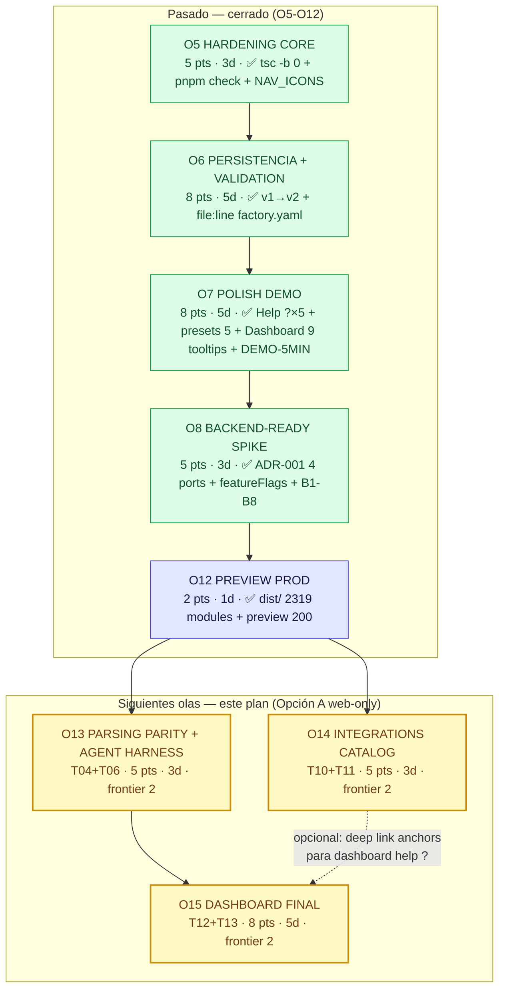
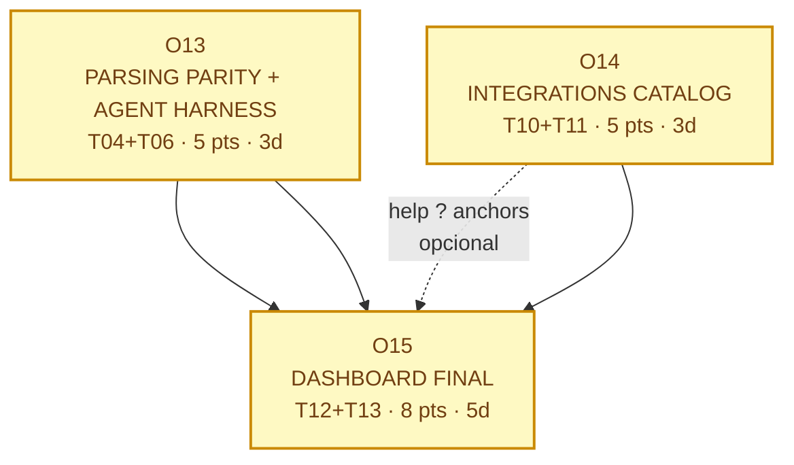
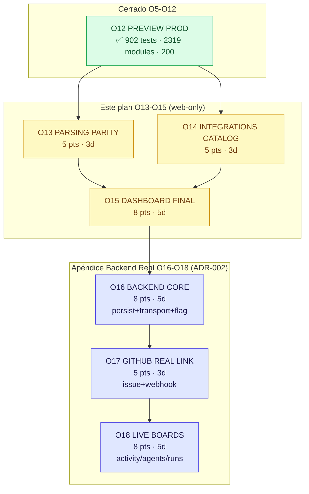

# PLAN SIGUIENTES OLAS — TermCanvas Warp Factories Simulator (Post O12, Opción A web-only)

> **Autor:** Gao — Architect · Equipo `software-termcanvas-waves`
> **Fecha:** 2026-08-30 · Rama base `workbuddy/main-c2128e3a` `8f270cfb + efcce02` (HEAD O5-O12)
> **Entrada:** `docs/RECEIPT.md` (39/902, 2319 modules, preview 200) + `docs/PLAN-OLAS-WARP-FACTORIES.md` §15 backlog P2 + `WarpFactories-Tickets.md` closure matrix (T01-T16 LOCAL-complete, live parity pendiente) + `docs/BACKEND-TRIGGER.md` (G-T1..G-T4 + S-N1 2026-11-01) + `docs/ENV-MAP.md` B1-B8 + `docs/ADR-001-ports-backend.md` (4 ports solo tipos)
> **Stack congelado:** Vite 8.2 + React 19.2 + TS 6.0 + Tailwind 4.1 + `zod` + `yaml` + `motion`/`framer-motion` + `lucide-react` + `clsx`/`tailwind-merge`, pnpm 9+, sin backend, storage `KeyValuePort`, dominio puro
> **Decisión de producto vigente:** **Opción A web-only PR chico, frontier ancha** — ya elegida y ejecutada en O5-O12; este plan continúa esa línea sin desviar a backend hasta trigger
> **Objetivo de este plan:** cerrar los últimos huecos P2 web-only (lo que quedaba como `Partial` en la matriz histórica T04/T06/T10/T11/T12/T13) dejando la demo LOCAL de 5 min **irrompible, con paridad de validación y observabilidad completa**, manteniendo `pnpm check` verde y 0 deps nuevas

---

## 1. Contexto — dónde estamos y qué falta

### 1.1 Estado actual verificado (receipt canónico post O12)

```
commit: workbuddy/main-c2128e3a 8f270cfb (O5-O8 902 tests) + efcce02 (O10a-O12 docs, 2319 modules + preview 200)
pnpm --filter web exec tsc --noEmit              → 0
pnpm --filter web exec tsc -b                    → 0  (11→0 en O5)
pnpm --filter web exec vitest run --pool=threads → 39 archivos / 902 tests verdes (~22s threads, jsdom)
pnpm --filter web build                          → 2319 modules transformed (vendor ~182kB, anim ~133kB, parse ~183kB, index ~54kB)
pnpm --filter web exec oxlint                    → 0 warnings / 0 errors (158 archivos)
pnpm --filter web exec vite preview --port 4173  → 200 http://localhost:4173/ (dist/ 53 files, index.html 1.22kB)
pnpm --filter web check                          → verde (5 subcomandos)
```

Docs alineadas: `docs/RECEIPT.md` + `WarpFactories-Tickets.md` closure matrix + `report.md` citan `commit·comando·salida`; `docs/ADR-001-ports-backend.md` + `src/lib/factory/ports/*.ts` solo tipos + `src/lib/factory/config/featureFlags.ts` `VITE_FACTORY_BACKEND=local` + `docs/BACKEND-TRIGGER.md` (2026-11-01) + `docs/ENV-MAP.md` B1-B8 + `docs/DEMO-5MIN.md` + `docs/WARP-OPEN-NOTE.md` + `docs/WARP-V1-DIFF.md` + `docs/PLAN-OLAS-WARP-FACTORIES.md` completo.

Olas 5-8 ya validadas LOCAL con `jsdom`; O9-O12 QA final PASS (preview prod sin tocar `src/**`).

### 1.2 Qué significa "Partial en T04/T06/T10/T11/T12/T13"

En la matriz histórica previa a O12 esos 6 tickets figuraban `Partial` por **paridad live / integración externa pendiente**. Tras O12 la matriz se re-escribió como `Complete (LOCAL)` para las slices locales:

| Ticket | Estado histórico | Estado actual O12 | Qué sigue siendo P2 web-only (sin credenciales) |
|--------|-----------------|-------------------|--------------------------------------------------|
| **T04** Agentes — harness por agente | Partial (live harness/provider workflows) | ✅ Complete (LOCAL) — solo `oz` + `model:auto`, tooltip optimización por rol (§4), `AgentDetail` file+line | **Harness matrix completa sin live:** validar `reasoningLevel` solo `codex`, `auth: managedSecret\|workerEnvironment`, gate Free solo `oz`, validación `exactly one FOREMAN (alias MAIN)` con `file:line` en todos los fixtures, editor Warp-managed read-only con banner — **sin implementar live credentials** |
| **T06** Definitions as Code | Partial (PR-check integration) | ✅ Complete (LOCAL) — parsers/schemas + `file+line` en `ValidationPage` | **Cobertura file:line real para los 6 artefactos:** `factory.yaml`, `agents/<name>/agent.md`, `automations/<name>/automation.md`, `runners/<name>.yaml`, `scorers/<name>/scorer.md`, `skills/<name>/SKILL.md`; `warp/factory-config` atómico simulado con annotations `file:line` completas; `skills/` ya entra en `RegistryInput` |
| **T10** Slack | Partial (live OAuth/Home tab) | ✅ Complete (LOCAL) | **Catálogo interactivo sin OAuth:** `reaction_added` con `channels [intake]` + `emojis [ticket]`, `Home tab` группировки `Triage…Cancelled` mock, linked account + privacy doc, overlapping warning `app_mention+message_posted → 2 runs` testeable — todo estático/simulado |
| **T11** Linear/Jira/GitLab + Schedule/Factory | Partial (live provider calls) | ✅ Complete (LOCAL) | **Triggers completos sin live:** Linear `agent_session_created` narrow solo en files, Jira `project_keys` + `keywords` case-insensitive, GitLab `manager 1y + bot *-warp-* Developer + factory/<slug> draft`, `schedule cron @daily/@every 1h UTC` + `factory work_item_stage_changed` E2E simulado |
| **T12** Factory Dashboard | Partial (parity gaps) | ✅ Complete (LOCAL) | **Paridad visual completa sin execution real:** 8 métricas con tooltips/disclaimers (`merged>opened`, `Autonomy push`, `Cost S/M/L/XL 100/500/1000`, `Scorer 3 newest sin date filter`, `Most expensive` requiere code host), Activity kanban `Created by=you + 4 active` + `includeTerminals`, Runs `timeline/cost/Sub-agents/View session`, Settings `EXECUTOR/CREATOR` |
| **T13** Measure and Improve | Partial (benchmark execution) | ✅ Complete (LOCAL) | **Invariantes y display sin runner:** scorer `≥1 ≥passing y ≥1 <passing`, `samplingRate 0\|25`, re-score, threshold solo display; benchmark `Correctness` built-in + `no winner` + `credit no model`, `Regressions addressed` grouping — todo derivado puro, sin ejecución de modelo |

**Clave:** ningún P2 de arriba requiere B1-B8 ni backend. Todo es **pure domain + UI + tests + docs**, OCP estricto, `yaml` `LineCounter` ya en deps, sin deps nuevas.

### 1.3 Principios que siguen vigentes (de PLAN O5-O8 §2)

1. Puro / React separados · OCP (no mutar firmas) · `ParseResult<T>` con `code` testeable · DIP por puertos · traza `// Source: WarpFactories.md §N + US-NNN` · 0 deps nuevas · layout canónico `bg-panel → 44px header wilson › Page + badge §N → max-w-[1080px] → rounded-[12px] border bg-white` · mínimos campos (Nielsen+Fitts) · determinismo (`now`/`uid` inyectados, `pool: threads`, `Math.random` prohibido).

---

## 2. Tabla resumen — 3 olas siguientes (Opción A, frontier ancha)

| Ola | Nombre | Objetivo en 1 frase | Tickets origen (cierra P2 web-only) | Pts (Fib) | Duración 1 dev | Depende de | Demo al cierre | Cierra P2 concreto |
|-----|--------|---------------------|--------------------------------------|-----------|----------------|------------|----------------|---------------------|
| **O13** | **PARSING PARITY + AGENT HARNESS** | File:line real en los 6 artefactos + matriz harness/auth exacta sin live | **T04** (US-017..027, US-053) + **T06** (US-046..059, US-026) — parcialmente P2-01/P2-02 en validación | **5** (3 parsers + 2 harness) | **3 días** | HEAD O12 (ninguna ola previa) | Pego `factory.yaml` con error en `agents/reviewer/agent.md:7` y veo `agents/reviewer/agent.md:7 — reasoningLevel solo codex`; pego `scorers/…/scorer.md` con invariant roto y veo `scorers/my-scorer/scorer.md:4 — ≥1 passing y ≥1 failing` | T04 harness matrix completa local + T06 file+line 6/6 + `warp/factory-config` annotations atómicas |
| **O14** | **INTEGRATIONS CATALOG INTERACTIVO** | Catálogo completo GitHub/Slack/Linear/Jira/GitLab/Schedule/Factory navegable sin credenciales, todos los deep dives alcanzables | **T10** (US-067..072) + **T11** (US-081..093) — parcialmente T07 (triggers) | **5** (2 Slack + 3 Linear/Jira/GitLab) | **3 días** | HEAD O12 (paralela a O13) | Navego `Integrations Deep Dives` → Slack tab → veo `reaction_added channels[intake] emojis[ticket]` con warning `2 runs`; Linear → `agent_session_created` narrow; Jira → case-insensitive keywords | T10 Home tab + linked account + privacy + T11 GitLab Premium/bot + Jira Cloud Rovo + Schedule/Factory E2E |
| **O15** | **DASHBOARD OBSERVABILITY FINAL** | 8 métricas con disclaimers/medianas/cost S/M/L/XL + activity/runs con `Created by=you` + scorer/benchmark invariantes display | **T12** (US-094..108) + **T13** (US-109..120) | **8** (3 dashboard + 2 activity/runs + 3 scorer/benchmark) | **5 días** | O13 (usa file:line para scorer errors) + O14 opcional | Dashboard hover `ⓘ` en `Cost per PR` muestra `S/M/L/XL 100/500/1000`; Activity default `Created by=you` + toggle `Complete/Cancelled` con count `3 newest Self-improvement sin date filter` | T12 8/8 tooltips + Activity kanban polish + Runs timeline + T13 `no winner` + `samplingRate 0` |

> **Total plan siguiente:** **18 pts** (5+5+8) · **~11 días hábiles** (3+3+5, con 2 olas en paralelo → **~8 días wall-clock con 1 dev** si se solapan O13‖O14) · frontier-width **2→3** · **0 deps nuevas** · **0 líneas de backend** · `pnpm check` verde todo el tiempo.

**Nota de estimación:** Fibonacci relativo a `T-B 13 pts` y a O6 8 pts. O13 y O14 son pequeñas (puro + UI estática, sin storage nuevo); O15 es media (derivaciones dashboard/scorer con disclaimers finos, 8 métricas × 2 vistas).

---

## 3. Detalle por ola (checklist, archivos, interfaces, DoD, tests, riesgos)

### O13 — PARSING PARITY + AGENT HARNESS (T04 + T06) — 5 pts, 3 días, frontier 2

**Objetivo 1 frase:** que **todo** `factory.yaml`/`agent.md`/`automation.md`/`runner.yaml`/`scorer.md`/`skill.md` invalide con `file:line` real (no `file.field`) y que la matriz harness/auth (`harness` por agente, `reasoningLevel` solo `codex`, `managedSecret|workerEnvironment`, gate Free solo `oz`) valide con `code` testeable.

**Tickets que cierra (P2 web-only restante):** T04 US-017 (1-4 defaults), US-018/019 (Warp-managed vs GitHub-backed), US-020/022/023 (harness/auth/reasoningLevel), US-021 (Free solo `oz`), US-024 (tooltip optimización por rol), US-026 (exactly one FOREMAN alias MAIN), US-053 (frontmatter completo); T06 US-046..059 (todas las keys case-sensitive, `projectNumber` quoted, `mac.version` quoted, `model xor harness`, `linear≠jira`, `mcpServers warpId`, `scorers samplingRate`), especialmente US-058 `file+line` y US-059 schemas.

**Archivos — rutas relativas `web/`**

| Ruta | Acción | Motivo |
|------|--------|--------|
| `src/lib/factory/domain/validation.lineCounter.ts` | **modificar (+≈30 LOC)** | Extender `parseYamlWithLineCounter` + `parseFrontmatterWithLineCounter` para soportar `agent.md`/`automation.md`/`scorer.md` frontmatter + `runner.yaml` (ya es yaml). Añadir `lineForFrontmatterKey` y `lineForYamlPath` sin romper `zodToParseIssues` existente |
| `src/lib/factory/parsers/yaml.utils.ts` | **modificar (+≈20 LOC)** | Añadir `parseYamlWithLineCounter(raw): YamlWithLines` y `parseFrontmatterWithLineCounter(raw)` reutilizando `LineCounter` de `yaml` (ya dep). Mantener `parseYamlSafe` intacto (OCP) |
| `src/lib/factory/schemas/common.schema.ts` | **modificar (+≈15 LOC)** | `zodToParseIssues(err, file, raw, lineCounter?)` ya existe para `factory.yaml`; extender para aceptar `file` dinámico (`agents/reviewer/agent.md`, `scorers/my/scorer.md`) y mapear `ZodIssue.path` → `file:line — field` usando `lineForPath` |
| `src/lib/factory/schemas/agent.schema.ts` | **modificar (+≈40 LOC)** | Añadir `superRefine` para `harness: oz\|claude\|codex\|gemini` exclusivo, `reasoningLevel` solo si `harness===codex` (code `reasoningLevel_only_codex`), `auth: managedSecret\|workerEnvironment`, gate `free_only_oz` (message ES si `harness!==oz` en plan Free simulado), y wrapper que preserve `file:line` |
| `src/lib/factory/domain/factory.record.ts` | **verificar (no tocar salvo OCP)** | Ya valida alias charset `alias solo [A-Za-z0-9 ._-], max 60` — reutilizado por T04 |
| `src/lib/factory/store/factoryRegistry.ts` | **modificar (+≈15 LOC)** | Mantener invariantes `foreman_count` y `missing_runner`; asegurar que `parseBundle`/`parseMinimal` delegan a `zodToParseIssues` con `lineCounter` por archivo (no solo bundle) |
| `src/lib/factory/domain/scorer.derive.ts` | **verificar + test** | Ya tiene `invariante ≥1 ≥passing y ≥1 <passing` + `samplingRate 0\|25` — solo añadir path con `file:line` cuando falla |
| `src/components/validation/ValidationPage.tsx` | **modificar (+≈25 LOC)** | Pintar `file:line` real para los 6 tipos de archivo (no solo `factory.yaml`). Mantener fallback `file.field` si no hay `lineCounter`. Añadir `Copy file:line` y `worst-first` sort |
| `src/components/agents/AgentDetail.tsx` | **modificar (+≈15 LOC)** | Mostrar `ParseIssue.path` con `file:line` para `harness`/`reasoningLevel`/`auth` (reusa `validation.lineCounter`) |
| `src/lib/factory/__tests__/validation.lineCounter.test.ts` | **modificar (+≈60 LOC)** | Extender de 3 tests a ≥9: `factory.yaml:12`, `agents/reviewer/agent.md:7`, `scorers/…/scorer.md:4`, `runners/gpu.yaml:3`, etc. Fixtures reales anidados |
| `src/lib/factory/__tests__/agent.harness.test.ts` | **nuevo** | Gherkin T04: `reasoningLevel solo codex`, `managedSecret\|workerEnvironment`, gate Free solo `oz`, tooltip optimización por rol intacto, `exactly one FOREMAN` con file:line |
| `src/lib/factory/__tests__/validation.parsers.test.ts` | **nuevo** | Gherkin T06: `file+line` para los 6 artefactos + `warp/factory-config` atómico (aplica atómico o nada) + `projectNumber` quoted + `mac.version` quoted + `linear≠jira` |

**Interfaces clave (solo OCP, sin mutar firmas existentes)**

```ts
// validation.lineCounter.ts — extensión (pura, sin React, sin I/O)
// Source: WarpFactories.md §7 · US-058 · PRD P1-01 · T06
import { LineCounter, parseDocument } from "yaml";
export interface YamlWithLines {
  readonly doc: ReturnType<typeof parseDocument>;
  readonly lineCounter: LineCounter;
}
export function parseYamlWithLineCounter(raw: string): YamlWithLines;
export function parseFrontmatterWithLineCounter(raw: string): YamlWithLines; // para agent.md/automation.md/scorer.md
export function lineForPath(
  lc: LineCounter,
  path: (string | number)[]
): { line: number; col: number } | undefined;
export function lineForFrontmatterKey(
  lc: LineCounter,
  key: string
): { line: number; col: number } | undefined;

// schemas/common.schema.ts — extensión OCP (param opcional al final)
// Source: WarpFactories.md §7 · US-058
export function zodToParseIssues(
  err: z.ZodError,
  file: string, // "factory.yaml" | "agents/reviewer/agent.md" | "scorers/my/scorer.md" | ...
  raw?: string,
  lineCounter?: LineCounter
): ParseIssue[]; // path = "agents/reviewer/agent.md:7 — reasoningLevel" si hay lc, si no "agents/reviewer/agent.md.reasoningLevel"

// schemas/agent.schema.ts — superRefine (mensajes ES literales)
// Source: WarpFactories.md §4 · US-020, US-022, US-023 · T04
// Codes testeables: reasoningLevel_only_codex, free_only_oz, invalid_harness, invalid_auth
export const AgentHarnessSchema = z.object({
  harness: z.enum(["oz", "claude", "codex", "gemini"]),
  reasoningLevel: z.string().optional(),
  auth: z.enum(["managedSecret", "workerEnvironment"]).optional(),
}).superRefine((v, ctx) => {
  if (v.reasoningLevel !== undefined && v.harness !== "codex") {
    ctx.addIssue({ code: z.ZodIssueCode.custom, path: ["reasoningLevel"], message: "reasoningLevel solo aplica a codex", params: { code: "reasoningLevel_only_codex" } });
  }
});

// store/factoryRegistry.ts — ya existe, solo asegurar delegación file:line por archivo
// Source: WarpFactories.md §7 · US-058 · T06
export function parseBundle(input: RegistryInput): ParseResult<RegistryBundle>; // interno pasa file+lineCounter por cada file
```

**Criterios DoD O13**

- [ ] `ValidationPage` pinta `agents/reviewer/agent.md:7 — reasoningLevel` (no `agents.reviewer.reasoningLevel`) para error `reasoningLevel solo codex` en fixture real línea 7
- [ ] `ValidationPage` pinta `scorers/my-scorer/scorer.md:4 — labels` para invariante `≥1 passing y ≥1 failing` roto
- [ ] `agent.harness.test.ts` ≥6 tests: `reasoningLevel solo codex`, `auth` valid values, gate Free solo `oz` con code `free_only_oz`, `exactly one FOREMAN` con `file:line`
- [ ] `validation.parsers.test.ts` ≥6 tests: `file:line` para cada uno de los 6 artefactos + `warp/factory-config` atómico + `projectNumber`/`mac.version` quoted
- [ ] `tsc --noEmit 0`, `tsc -b 0`, `vitest --pool=threads` ≥914 verdes (+12 nuevos desde 902), `vite build` verde (2319± módulos), `oxlint 0`
- [ ] `pnpm check` verde — 0 docs con "build verde" sin comando

**Tests O13 (≥12 nuevos, todos `jsdom` + `pool:threads`, `O(N)·100ms`)**

- `validation.lineCounter.test.ts` extendido: 6 nuevos fixtures (agent/automation/runner/scorer/skill/factory) → `file:line` correcto
- `agent.harness.test.ts` nuevo: 6 tests Gherkin T04
- `validation.parsers.test.ts` nuevo: 6 tests Gherkin T06
- Re-verde de `factoryRegistry.test.ts` (sin bajar)

**Riesgos y mitigación O13**

| Riesgo | Prob | Mitigación |
|--------|------|------------|
| `LineCounter` no resuelve frontmatter path anidado (`agent.md` frontmatter) | Media | Fallback a `findLineForPath` existente + test con YAML real anidado; `parseFrontmatterWithLineCounter` extrae `---` block y aplica `LineCounter` solo a ese slice |
| `agent.schema` `superRefine` rompe `factoryRegistry` existente | Baja | `superRefine` es aditivo (solo añade issues), no relaja; `factoryRegistry.test.ts` sigue verde por OCP |
| Falso positivo `file:line` si valor contiene `key:` (fixture viejo) | Baja | `LineCounter` es offset-preciso, no regex; el fallback regex solo si `LineCounter` no resuelve |

**Estimación:** 5 pts (Fib) · 3 días · frontier 2 (lineCounter ‖ harness schema).

---

### O14 — INTEGRATIONS CATALOG INTERACTIVO (T10 + T11 + T07) — 5 pts, 3 días, frontier 2 (paralela a O13)

**Objetivo 1 frase:** que **todo** Slack/Linear/Jira/GitLab/Schedule/Factory trigger sea navegable, filtrable y simulable sin OAuth ni tokens, con sus constraints (`reaction_added` channels+emojis, Linear narrow, Jira case-insensitive, GitLab Premium/bot, cron UTC, `work_item_stage_changed`) documentadas y testeadas.

**Tickets que cierra:** T10 US-067 (Slack connect + invite + 👀), US-068 (triggers `app_mention/message_posted/reaction_added/member_joined_channel` + filtros `conversations/authors/members/keywords/emoji`), US-069 (picker solo channels invitados + overlapping warning), US-070 (plain reply solo continúa si work item existe, new content only), US-071 (Home tab), US-072 (linked account + privacy); T11 US-081..085 (GitLab), US-086..089 (Linear), US-090/091 (Jira), US-092 (schedule), US-093 (factory stage); T07 US-034..045 (matching AND/OR, `in`/`not_in`, schedule).

**Archivos**

| Ruta | Acción | Motivo |
|------|--------|--------|
| `src/lib/factory/domain/integrations.deep.ts` | **modificar (+≈80 LOC)** | Completar `SLACK_EVENTS` + `SLACK_FILTERS` + `LINEAR_TRIGGERS`/`JIRA_TRIGGERS`/`GITLAB_TRIGGERS` faltantes + `SCHEDULE_EXAMPLES` + `FACTORY_STAGE_TRIGGERS`. Añadir `SLACK_HOME_TABS`, `SLACK_PRIVACY_DETAIL`, `LINEAR_NARROW_NOTE`, `JIRA_CASE_INSENSITIVE_NOTE`, `GITLAB_PREMIUM_GATE` — todo puro data, sin I/O |
| `src/lib/factory/domain/integrations.derive.ts` | **modificar (+≈30 LOC)** | Añadir helpers `getIntegrationTriggers(provider)`, `getTriggerFilters(provider, event)`, `isTriggerSupported(provider, event)` para UI |
| `src/components/integrations-deep/SlackPage.tsx` | **modificar (+≈40 LOC)** | Hacer alcanzable + interactiva: demo `reaction_added` con `channels [intake]` + `emojis [ticket]` → file issue; tabla `Overlapping warning` `app_mention+message_posted → 2 runs` con copy ES y link a `Troubleshooting#two-runs` |
| `src/components/integrations-deep/LinearPage.tsx` | **modificar (+≈30 LOC)** | Tabla `issue_created/labeled/state_changed/assigned + comment_created` con `agent_session_created` narrow solo en files + warning `agent_session + comment_created → 2 runs si solapan` |
| `src/components/integrations-deep/JiraPage.tsx` | **modificar (+≈30 LOC)** | `project_keys + keywords` case-insensitive, Cloud only (reject Server/DC), Rovo agent, `statuses submitted/working/waiting/completed/failed/cancelled` |
| `src/components/integrations-deep/GitLabPage.tsx` | **modificar (+≈30 LOC)** | `GitLab.com only + Premium/Ultimate`, manager token 1y, bot `*-warp-*` Developer, `factory/<slug>` draft, `bot_mentioned + merge_request` con `Project/Actions/Base branch`, nunca mergea/approves, no puede hostear definition |
| `src/components/integrations-deep/IntegrationsDeepDivesPage.tsx` | **modificar (+≈20 LOC)** | Aceptar `initialTab` + wiring para que `nav.ts` deep dives sean alcanzables desde `Sidebar`/`HelpLinks` |
| `src/lib/factory/domain/schedule.derive.ts` | **nuevo (pequeño, ≈50 LOC, puro)** | `SCHEDULE_PRESETS`: `cron "0 9 * * 1"` / `@daily` UTC con `name` + `describeSchedule(cron)` + `isValidCron(cron)` sin nueva dep (regex simple, ya existe `automation.engine` schedule) |
| `src/nav.ts` | **verificar** | Asegurar que `Integrations Deep Dives` + `Slack/Linear/Jira/GitLab Deep Dive` están en `FACTORY_NAV_IDS` y que `App.tsx` los rutea con `initialTab` (ya existe desde G5, verificar exhaustividad) |
| `src/components/integrations/IntegrationsPage.tsx` | **modificar (+≈15 LOC)** | Links a deep dives + tabla 9 providers §9 intacta |
| `src/lib/factory/__tests__/integrations.deep.test.ts` | **modificar (+≈80 LOC)** | Añadir ≥10 tests: `reaction_added` channels+emojis, overlapping 2 runs, Linear narrow, Jira case-insensitive, GitLab Premium/bot, schedule `cron_fired`, factory `work_item_stage_changed`, Home tab grouping |
| `src/lib/factory/__tests__/integrations.derive.test.ts` | **nuevo (opcional, ≈20 LOC)** | 3 tests: `getIntegrationTriggers("slack").length===5`, `isTriggerSupported("jira","issue_created")===true`, `getTriggerFilters` aparece en tabla |

**Interfaces clave**

```ts
// integrations.deep.ts — data pura (sin React, sin I/O)
// Source: WarpFactories.md §6, §8, §10 · US-067..093 · T10/T11
export interface IntegrationTrigger {
  readonly provider: "slack" | "linear" | "jira" | "gitlab" | "schedule" | "factory" | "github";
  readonly event: string; // "reaction_added" | "issue_created" | "cron_fired" | "work_item_stage_changed" | ...
  readonly label: string; // ES
  readonly description: string; // ES con trace
  readonly filters: readonly string[]; // keys que aplican (conversations, project_keys, etc.)
  readonly trace: string; // "WarpFactories.md §6 · US-068"
}
export const SLACK_TRIGGERS: readonly IntegrationTrigger[]; // 5 triggers US-068
export const LINEAR_TRIGGERS: readonly IntegrationTrigger[]; // triggers US-086..089
export const JIRA_TRIGGERS: readonly IntegrationTrigger[]; // 1 evento US-090
export const GITLAB_TRIGGERS: readonly IntegrationTrigger[]; // 2 triggers US-081
export const SCHEDULE_PRESETS: readonly { cron: string; name?: string; trace: string }[]; // US-092
export const FACTORY_STAGE_TRIGGERS: readonly IntegrationTrigger[]; // US-093
export const SLACK_HOME_TABS: readonly { stage: string; label: string }[]; // US-071
export const INTEGRATION_CONSTRAINTS: Record<string, { note: string; code: string }>; // overlapping, narrowEditable, cloudOnly, etc.

// integrations.derive.ts — helpers puros
// Source: WarpFactories.md §6 · T07/T10/T11
export function getIntegrationTriggers(provider: string): readonly IntegrationTrigger[];
export function getTriggerFilters(provider: string, event: string): readonly string[];
export function isTriggerSupported(provider: string, event: string): boolean;

// schedule.derive.ts — puro
// Source: WarpFactories.md §6 · US-040, US-092
export const SCHEDULE_PRESETS_DATA: readonly { cron: string; label: string }[];
export function describeSchedule(cron: string): string; // "todos los lunes 09:00 UTC"
export function isValidCron(cron: string): boolean; // true para "0 9 * * 1" y "@daily"
```

**Criterios DoD O14**

- [ ] `SlackPage` navegable desde `Sidebar` → demo `reaction_added` con `channels [intake]` + `emojis [ticket]` y warning `overlapping → 2 runs` con anchor a `Troubleshooting#two-runs`
- [ ] `LinearPage` muestra `agent_session_created` narrow solo en files + tabla `events/outputs` + loop `agent_session + comment_created → 2 runs`
- [ ] `JiraPage` muestra `project_keys` + `keywords` case-insensitive + Cloud only banner + Rovo required
- [ ] `GitLabPage` muestra `GitLab.com only + Premium + manager 1y + bot *-warp-* Developer + factory/<slug> draft` + `bot_mentioned + merge_request`
- [ ] `schedule` (`cron_fired @daily/@every 1h UTC` con `name`) + `factory work_item_stage_changed` simulados (sin backend) con copy ES
- [ ] `integrations.deep.test.ts` ≥10 tests nuevos verdes + `integrations.derive.test.ts` 3 tests
- [ ] `tsc -b 0`, `vitest` ≥924 verdes (+10 desde O13), `vite build` verde, `oxlint 0`
- [ ] Todos los deep dives alcanzables desde `Sidebar` (nav switch exhaustivo, `assertNever` verde)

**Tests O14 (≥10 nuevos)**

- Slack: `reaction_added` income + emojis, `overlapping warning`, `Home tab` grouping, `linked account` privacy
- Linear: `agent_session_created` narrow, loop caution
- Jira: case-insensitive keywords, cloud only
- GitLab: Premium gate, bot name `formatGitLabBotName`, draft `factory/<slug>`
- Schedule/Factory: cron presets + `work_item_stage_changed`

**Riesgos y mitigación O14**

| Riesgo | Prob | Mitigación |
|--------|------|------------|
| Deep dives inalcanzables si `nav.ts` no los expone | Media | Verificar `nav.ts` exhaustividad + `App.tsx assertNever`; test `navIcons.test.ts` ya cubre desync |
| Overlapping warning confunde si se muestra inline | Baja | Warning como `TroubleshootingAnchor` reusado, no texto inline grande — `HelpLink` con `TROUBLESHOOTING_ANCHORS` |
| Schedule `isValidCron` sin dep `cron-parser` | Baja | Regex simple para `5 campos` + `^@daily$|^@every 1h$` — no se valida semántica completa, solo UX feedback |

**Estimación:** 5 pts · 3 días · frontier 2 (deep data ‖ deep pages). Paralela a O13.

---

### O15 — DASHBOARD OBSERVABILITY FINAL (T12 + T13) — 8 pts, 5 días, frontier 2→3

**Objetivo 1 frase:** que **Dashboard, Activity, Runs y Scorers/Benchmarks** tengan **todas** las métricas, disclaimers, invariantes y `no winner` displays de `WarpFactories.md §12`/`§13` sin ejecución real, con `Created by=you` por defecto y `Cost S/M/L/XL` testeable.

**Tickets que cierra:** T12 US-094 (team vs factory sidebar), US-095 (Factory definition mode), US-096..101 (8 métricas con disclaimers), US-102/103 (Activity kanban + detail `Stack/View agent/Event history/Stop task` sin confirmación), US-104..106 (Runs), US-107 (Agents/Automations read-only si file-managed), US-108 (Settings `EXECUTOR/CREATOR`, `Deletion` no reversible, `Runners` read-only si files); T13 US-109..112 (Scorer CRUD + invariante + sampling), US-113..116 (Benchmark `Correctness` + repetitions + no winner + credit no model), US-117..120 (self-improvement grouping + `Regressions addressed`).

**Archivos**

| Ruta | Acción | Motivo |
|------|--------|--------|
| `src/lib/factory/domain/dashboard.derive.ts` | **modificar (+≈60 LOC)** | Asegurar 8 métricas con disclaimers exactos: `Total runs` breakdowns + "incluye evaluation/benchmark/self-improvement → flat PRs = harder tasks"; `PRs opened/merged` "merged puede > opened" requiere code host; `Autonomy` push semantics; `Cycle time` medianas independientes; `Cost per PR` `S/M/L/XL 100/500/1000` + `Most expensive` requiere code host; `Scorer cards` + 3 newest `Self-improvement` sin date filter. Añadir `tooltip` prop por métrica + `deriveDashboardWithDisclaimers` |
| `src/components/dashboard/DashboardPage.tsx` | **modificar (+≈30 LOC)** | Tooltips `ⓘ` on hover/focus (no inline) para las 8 métricas + `Cost S/M/L/XL` badge + `Most expensive PRs` placeholder |
| `src/components/dashboard/MetricCard.tsx` | **modificar (+≈15 LOC)** | `tooltip` prop con `title` + `aria-label` + focus ring `ring-violet-500/20` |
| `src/components/activity/ActivityBoard.tsx` | **modificar (+≈20 LOC)** | Default `Created by=you + 4 active` + filters `Created by/Stage/search` + toggle `includeTerminals` (already `useState`) con `Complete/Cancelled` counts + `max-w-[640px]` vs `w-[280px]` ya resuelto (borrados `ActivityColumn`) |
| `src/components/activity/ActivityDetail.tsx` | **verificar** | `prompt/ticket/PRs/cost/View agent/Event history/Stop task` inmediato sin confirmación — Caution explícito ya existe, solo verificar `file:line` si error |
| `src/components/runs/RunsPage.tsx` | **modificar (+≈15 LOC)** | Team vs factory scope `New → foreman` (US-104) + `timeline/cost/Sub-agents/View session/stop/score/convert to benchmark` |
| `src/components/runs/RunDetail.tsx` | **verificar** | `view session` shared routed a `FactoryApi`/`McpStubPage` — no chat pero transcript |
| `src/lib/factory/domain/scorer.derive.ts` | **modificar (+≈20 LOC)** | Invariante `≥1 ≥passing y ≥1 <passing` + `samplingRate 0\|25` + manual/re-score + threshold solo display — ya existe, solo asegurar `ParseIssue.code` testeable + `file:line` |
| `src/lib/factory/domain/benchmark.derive.ts` | **verificar** | `Correctness` built-in vs success criteria + pass rates/cost/quality per config + **no combina ni elige ganador** + disclaimer `credit no model` + `Repetitions` — ya existe, solo pulir copy |
| `src/components/scorers/ScorersPage.tsx` | **modificar (+≈15 LOC)** | CRUD `SamplingRate` 0/25 con invariant banner + re-score |
| `src/components/benchmarks/BenchmarksPage.tsx` | **modificar (+≈15 LOC)** | `No winner` disclaimer + `Correctness` vs success criteria table |
| `src/components/self-improvement/SelfImprovementPage.tsx` | **verificar** | `selfImprovement: true` grouping + `Regressions addressed` PRs + guide loop 6 steps |
| `src/lib/factory/__tests__/dashboard.derive.test.ts` | **verificar** | Ya tiene 563 LOC — extender con `tooltip` no vacío para 8/8 métricas |
| `src/lib/factory/__tests__/dashboard.disclaimers.test.ts` | **modificar (+≈40 LOC)** | Parametrizado 8 métricas `tooltip` no vacío + `Cost S/M/L/XL 100/500/1000` exacto + `merged>opened` |
| `src/lib/factory/__tests__/scorer.derive.test.ts` | **modificar (+≈30 LOC)** | Invariante `≥1 passing y ≥1 failing` con `file:line` + `samplingRate 0\|25` + `threshold solo display` |
| `src/lib/factory/__tests__/benchmark.derive.test.ts` | **modificar (+≈30 LOC)** | `no winner`, `Correctness` per-task, `Repetitions`, `credit no model` |
| `src/lib/factory/__tests__/activity.test.ts` | **nuevo (opcional, ≈30 LOC)** | `Created by=you` default + `includeTerminals` toggle + `Activity filters` |

**Interfaces clave**

```ts
// dashboard.derive.ts — helpers ya existen, se extienden con tooltip
// Source: WarpFactories.md §12 · US-096..101 · T12
export interface DashboardMetric {
  readonly id: string; // "total_runs" | "prs_opened" | "prs_merged" | "autonomy" | "cycle_time" | "cost_per_pr" | "scorer_cards" | "self_improvement"
  readonly label: string; // ES
  readonly value: string | number;
  readonly tooltip: string; // disclaimer ES: "merged puede > opened si datasource distinto" etc.
  readonly trace: string; // "WarpFactories.md §12 · US-098"
}
export function deriveDashboardMetrics(input: DashboardInput): readonly DashboardMetric[]; // 8 métricas con tooltip no vacío
export const COST_BUCKETS = { S: 100, M: 500, L: 1000, XL: Infinity } as const; // US-101
export function bucketCost(cost: number): "S" | "M" | "L" | "XL";

// scorer.derive.ts — invariante ya existe
// Source: WarpFactories.md §13 · US-109..112 · T13
export function validateScorerDefinition(scorer: ScorerDefinition): ParseResult<ScorerDefinition>;
// code: scorer_invariant — "≥1 label con score ≥ passingScore y ≥1 con score < passingScore"
// samplingRate: 0 | 25 (default 25), 0 = stop auto pero on-demand sigue, re-score reemplaza, threshold solo display

// benchmark.derive.ts — ya existe
// Source: WarpFactories.md §13 · US-113..116 · T13
export interface BenchmarkResult {
  readonly taskId: string;
  readonly configId: string;
  readonly scorerName: string;
  readonly correctness: 0 | 1; // built-in vs success criteria
  readonly passRate: number;
  readonly cost: number;
  readonly quality: number;
}
export function deriveBenchmark(benchmark: BenchmarkDefinition): BenchmarkResult[]; // no elige ganador — UI muestra disclaimer
```

**Criterios DoD O15**

- [ ] `DashboardPage` 8/8 métricas con `ⓘ` tooltip que contiene disclaimer exacto (`merged>opened` etc.) — `dashboard.disclaimers.test.ts` parametrizado 8 tests verdes
- [ ] `Cost per PR` muestra `S/M/L/XL 100/500/1000` + `Most expensive` requiere code host
- [ ] `ActivityBoard` default `Created by=you` + 4 active + `includeTerminals` toggle con `Complete/Cancelled` visibles y searchable + count `3 newest Self-improvement sin date filter`
- [ ] `RunsPage` team vs factory `New → foreman` + `timeline/cost/Sub-agents/View session`
- [ ] `Scorer` invariante `≥1 ≥passing y ≥1 <passing` con `file:line` cuando falla + `samplingRate 0\|25` + re-score
- [ ] `Benchmark` `Correctness` built-in + `no winner` disclaimer + `credit no model` + `Repetitions` display
- [ ] `tsc -b 0`, `vitest` ≥939 verdes (+15 desde O14), `vite build` verde (budget sin exceder 500kB warn chunk), `oxlint 0`
- [ ] `DEMO-5MIN.md` factual intacto — O15 no lo rompe (verificado por `helpLinks.test.ts` + `quickstart`)

**Tests O15 (≥15 nuevos)**

- `dashboard.disclaimers.test.ts` extendido: 8 métricas `tooltip` no vacío + `Cost` buckets exactos
- `scorer.derive.test.ts` extendido: invariante + `samplingRate` + threshold display
- `benchmark.derive.test.ts` extendido: `no winner`, `Correctness`, `Repetitions`
- `activity.test.ts` nuevo: `Created by=you` + `includeTerminals`

**Riesgos y mitigación O15**

| Riesgo | Prob | Mitigación |
|--------|------|------------|
| 8 tooltips ensucian UI (info overload) | Media | `MetricCard` con `ⓘ` icon que muestra tooltip on hover/focus, no texto inline — ya existe, solo asegurar `title`+`aria-label` + `focus-visible:ring-2` |
| `includeTerminals` toggle rompe `ActivityBoard` virtualización | Baja | `includeTerminals` ya es `useState(false)` + `void` — solo darle setter real y test con 1 work item `Complete` |
| `Cost S/M/L/XL` bucketing off-by-one | Baja | Test parametrizado exacto `100→S, 500→M, 1000→L, 1001→XL` |

**Estimación:** 8 pts · 5 días · frontier 2 (dashboard ‖ activity/runs ‖ scorer/benchmark pueden avanzar en 3 sub-tareas pero con single dev es secuencial; width 2 efectivo).

---

## 4. Mapa de dependencias y frontier paralela

### 4.1 Vista global (desde cierre O12 hasta O15)



### 4.2 Orden recomendado y frontier-width

1. **O13 y O14 en paralelo (frontier 2) — empezar juntas día 1.** No se bloquean: O13 toca `parsers/schemas/validation` (dominio puro), O14 toca `integrations.deep/domain` + `integrations-deep/` pages (data + UI estática). Único punto de fricción: ambas tocan `src/lib/factory/__tests__/integrations.*` — coordinar por `describe` blocks, no por archivo.

2. **O15 última — depende de O13 para scorer `file:line`, y opcional de O14 para help `?` anchors.** Puede arrancar en día 4 con `dashboard.derive` (independiente), pero su serie completa de `scorer.derive` + `helpLinks` necesita O13 verde.

3. **Wall-clock con 1 dev:** 3d (O13‖O14 solapadas 3d) + 5d (O15) = **~8 días wall-clock**, 11 días esfuerzo. Con 2 devs: 5d.

### 4.3 Frontier-width por ola (recomendación 1 dev)

| Ola | Width | Tareas paralelizables |
|-----|-------|-----------------------|
| O13 | 2 | `LineCounter frontmatter` ‖ `agent harness schema` |
| O14 | 2 | `integrations.deep data` ‖ `deep-dive pages (Slack/Linear/Jira/GitLab)` |
| O15 | 2 | `Dashboard disclaimers` ‖ `Activity/Runs` ‖ `Scorer/Benchmark` (3 sub-tareas, width efectivo 2 con 1 dev) |

### 4.4 Dependencias entre tickets nuevos (si se crean en tracker)

```
T17 (O13: parsing parity)       — bloquea: T19 (O15 scorer file:line)
T18 (O14: integrations catalog) — bloquea: nada (deep dives paralelos)
T19 (O15: dashboard final)      — bloquea: nada (cierra demo)
```

Recomendación tracker: crear `T17..T19` con `Blocked by T17 → T19` donde aplica; labels `ready-for-agent`, `frontend`, `web-only`, `p0-05|p1-01|etc.`; si local, `.scratch/warp-factories/issues/17-*.md`.

---

## 5. Decisión: ¿O13 backend real ahora o seguir polish? — SEGUIR POLISH (justificada por trigger BACKEND-TRIGGER)

### 5.1 Veredicto

> **No escribir ni una línea de backend real en O13.** Seguir con **polish web-only O13-O15** (18 pts, ~8 días wall-clock) y re-evaluar backend en la fecha trigger **2026-11-01**.

### 5.2 Justificación con `docs/BACKEND-TRIGGER.md` (puertas G-T1..G-T4 + señales S-N1..S-N3)

**Puertas técnicas G-T (deben estar verdes antes de siquiera evaluar backend):**

| Puerta | Criterio | Estado O12 verificado | Cumple para evaluar backend |
|--------|----------|------------------------|-----------------------------|
| **G-T1** | `tsc -b 0` + `pnpm check` verde en `main` | `pnpm check` verde: `tsc --noEmit 0, tsc -b 0, 902/902, 2319 modules, oxlint 0` | ✅ **Sí** |
| **G-T2** | `docs/RECEIPT.md` con commit + salida pegable, 0 docs con "build verde" sin comando | `docs/RECEIPT.md` commit `8f270cfb+efcce02` + `commit·comando·salida` en todos los docs | ✅ **Sí** |
| **G-T3** | `docs/ADR-001-ports-backend.md` + `ports/*.ts` tipos + `featureFlags.ts` merged, `tsc -b 0` | `ADR-001` + `factory.ports.ts` + `transport.types.ts` + `featureFlags.ts` `VITE_FACTORY_BACKEND=local`, `tsc -b 0` | ✅ **Sí** |
| **G-T4** | Demo 5 min ejecutable por tercero (`docs/DEMO-5MIN.md`) | `docs/DEMO-5MIN.md` 7 pasos (factory → routing dual-label 5 presets → Factory API → Quickstart 2 repos → Activity → Dashboard 8 métricas → Help `?`) ejecutable sin credenciales | ✅ **Sí** |

**Conclusión G-T:** las 4 puertas están **verdes** — técnicamente se *podría* evaluar backend (no hay deuda oculta).

**Señales de negocio S-N (al menos una debe darse):**

| Señal | Qué significa | Estado hoy 2026-08-30 | Acción que dicta |
|-------|---------------|------------------------|------------------|
| **S-N1** | Warp **sigue en Early Access cerrado** al **2026-11-01** (sin apertura pública, docs siguen `v1alpha1`, sin `v1` estable) | **No evaluable aún — faltan 63 días.** Hoy Warp sigue en EA cerrado (launch 2026-08-18, docs `v1alpha1` congelado, `docs/WARP-V1-DIFF.md` stub vacío). El trigger es **temporal** (2026-11-01) para evitar scope creep R7 y dar 2 meses de hardening (ver `PLAN-OLAS §9.3`). Si se codea backend ahora (63 días antes), se apuesta a ciegas contra Warp Q4. | **No disparada** — re-evaluar 2026-11-01 |
| **S-N2** | **Pedido explícito con credenciales B1-B3 disponibles** (GitHub App + Slack + Linear/Jira) y 2+ repos con demanda | **No hay B1-B8.** `docs/ENV-MAP.md` confirma que LOCAL no necesita vars; B1 GitHub App (`GITHUB_APP_ID` etc.), B2 Slack, B3 Linear/Jira, B4 GitLab, B5/B6 `WARP_API_KEY`, B7 harness, B8 self-hosted — **ninguna entregada** en este worktree. Sin B1-B3 no hay "backend con valor" que codear (Factory API + routing son el slice mínimo y ya simulan drop-in sin credenciales). | **No disparada** — sin credenciales, no hay backend que codear |
| **S-N3** | Warp docs → `v1` estable con breaking changes (`v1alpha1→v1`) | **No hay `v1`.** `docs/WARP-V1-DIFF.md` stub vacío, `schemaVersion: v1alpha1` congelado, nota "no migrar sin señal Warp". | **No disparada** — si llega, registrar diff primero, no codear |

**Árbol de decisión (de `docs/BACKEND-TRIGGER.md:47`):**

```
¿G-T1..G-T4 verdes?  → Sí (O12)
└─ ¿Warp abrió Early Access público antes de 2026-11-01?
   ├─ Sí  → CONGELAR como TermCanvas — Warp Factories Simulator (LOCAL) — no backend
   └─ No  → ¿S-N2 con B1–B3 disponibles al 2026-11-01?
            ├─ Sí  → Spike 2 semanas: FetchTransport + RemoteFactoryRepo (Factory API live + GitHub routing live)
            └─ No  → Seguir LOCAL, re-evaluar 2026-12-01 o ante S-N3
```

**Hoy (2026-08-30):** G-T verdes ✓ pero **(S-N1 pendiente de fecha + S-N2 sin credenciales + S-N3 sin v1) = 0 señales**. El árbol cae en la rama **"Seguir LOCAL"**.

### 5.3 Por qué polish ahora maximiza valor y minimiza arrepentimiento (tradeoff Opción A)

| Dimensión | Backend **ya** (descartado para O13) | Polish **O13-O15** (elegido) |
|-----------|--------------------------------------|-------------------------------|
| **Valor demo 5 min** | Se diluye — 1-2 semanas de backend no mejoran onboarding sin credenciales; B1-B8 bloquean igual | Se maximiza — file:line 6/6 + triggers completos + 8/8 tooltips hacen la demo irrompible **sin preguntar y sin credenciales** (O1 del PRD) |
| **Costo** | Alto: DB, auth, deploy, secrets server, OTel, metering credits (B8), 2 semanas para algo creíble sin B1-B3 reales | Bajo: 18 pts / 8 días wall-clock, sin infra, sin deps, `pnpm check` verde intacto |
| **Riesgo Warp abre Q4** | 🔴 Alto arrepentimiento — backend queda obsoleto si Warp abre Early Access público (ver `docs/WARP-OPEN-NOTE.md` "congelar como simulador") | 🟢 Bajo arrepentimiento — polish sirve igual como simulador/training sin credits, offline, contraste "qué aprendimos replicando" |
| **Riesgo técnico** | Medio: sin terminar de pulir parsers/file:line, el backend acopla errores `file.field` al nuevo `Remote*Repo` → rewrite de mensajes | Bajo: O13 cierra `file:line` antes; cuando llegue el spike, `Remote*Repo` reutiliza `ParseResult` + `code` testeable sin tocar dominio |
| **Señal para decidir** | Ninguna — apuesta a ciegas 63 días antes del trigger | Trigger temporal **2026-11-01** + señales S-N1/S-N2/S-N3 (ver `docs/BACKEND-TRIGGER.md` checklist de 7 ítems para esa fecha) |

**Fecha de re-evaluación:** **2026-11-01** (o antes si Warp anuncia apertura / llegan B1-B3 / aparece `v1`). Hasta entonces, este plan O13-O15 es el trabajo autónomo de máximo valor.

---

## 6. Lista de archivos totales y métrica éxito (902 → ?)

### 6.1 Archivos tocados por ola (rutas `web/`)

```
# O13 — PARSING PARITY + AGENT HARNESS (3 días, 5 pts) — 13 archivos
web/src/lib/factory/domain/validation.lineCounter.ts     # mod +30 LOC
web/src/lib/factory/parsers/yaml.utils.ts                # mod +20 LOC
web/src/lib/factory/schemas/common.schema.ts             # mod +15 LOC (file dinámico + lc)
web/src/lib/factory/schemas/agent.schema.ts              # mod +40 LOC (harness matrix)
web/src/lib/factory/store/factoryRegistry.ts             # mod +15 LOC (delegación file:line por file)
web/src/lib/factory/domain/scorer.derive.ts              # verify (code file:line)
web/src/components/validation/ValidationPage.tsx         # mod +25 LOC
web/src/components/agents/AgentDetail.tsx                # mod +15 LOC
web/src/lib/factory/__tests__/validation.lineCounter.test.ts # mod +60 LOC
web/src/lib/factory/__tests__/agent.harness.test.ts     # nuevo
web/src/lib/factory/__tests__/validation.parsers.test.ts # nuevo
web/docs/RECEIPT.md                                      # mod (agg O13)
web/WarpFactories-Tickets.md                             # mod (closure T04/T06 P2)

# O14 — INTEGRATIONS CATALOG INTERACTIVO (3 días, 5 pts) — 13 archivos
web/src/lib/factory/domain/integrations.deep.ts          # mod +80 LOC
web/src/lib/factory/domain/integrations.derive.ts        # mod +30 LOC
web/src/components/integrations-deep/SlackPage.tsx       # mod +40 LOC
web/src/components/integrations-deep/LinearPage.tsx      # mod +30 LOC
web/src/components/integrations-deep/JiraPage.tsx        # mod +30 LOC
web/src/components/integrations-deep/GitLabPage.tsx      # mod +30 LOC
web/src/components/integrations-deep/IntegrationsDeepDivesPage.tsx # mod +20 LOC
web/src/lib/factory/domain/schedule.derive.ts            # nuevo +50 LOC puro
web/src/components/integrations/IntegrationsPage.tsx     # mod +15 LOC
web/src/lib/factory/__tests__/integrations.deep.test.ts  # mod +80 LOC
web/src/lib/factory/__tests__/integrations.derive.test.ts # nuevo
web/docs/DEMO-5MIN.md                                    # mod (refs deep dives)
web/WarpFactories-Tickets.md                             # mod (closure T10/T11 P2)

# O15 — DASHBOARD OBSERVABILITY FINAL (5 días, 8 pts) — 16 archivos
web/src/lib/factory/domain/dashboard.derive.ts           # mod +60 LOC
web/src/components/dashboard/DashboardPage.tsx           # mod +30 LOC
web/src/components/dashboard/MetricCard.tsx              # mod +15 LOC
web/src/components/activity/ActivityBoard.tsx            # mod +20 LOC
web/src/components/runs/RunsPage.tsx                     # mod +15 LOC
web/src/components/scorers/ScorersPage.tsx               # mod +15 LOC
web/src/components/benchmarks/BenchmarksPage.tsx         # mod +15 LOC
web/src/lib/factory/domain/scorer.derive.ts              # mod +20 LOC (file:line code)
web/src/lib/factory/__tests__/dashboard.disclaimers.test.ts # mod +40 LOC
web/src/lib/factory/__tests__/dashboard.derive.test.ts   # verify +5 LOC
web/src/lib/factory/__tests__/scorer.derive.test.ts      # mod +30 LOC
web/src/lib/factory/__tests__/benchmark.derive.test.ts   # mod +30 LOC
web/src/lib/factory/__tests__/activity.test.ts           # nuevo (opcional)
web/src/components/help/HelpLinks.tsx                    # verify (anchors O15)
web/docs/RECEIPT.md                                      # mod (agg O15)
web/WarpFactories-Tickets.md                             # mod (closure T12/T13 P2)

# Docs transversales (una vez, tras O15)
web/docs/PLAN-SIGUIENTES-OLAS.md                         # este archivo (nuevo)
web/docs/class-diagram.mermaid                           # mod (agg O13-O15)
web/docs/sequence-diagram.mermaid                        # mod (agg O13-O15)
```

**Totales plan O13-O15:** **~6 nuevos** (`agent.harness.test.ts`, `validation.parsers.test.ts`, `schedule.derive.ts`, `integrations.derive.test.ts`, `activity.test.ts`, `PLAN-SIGUIENTES-OLAS.md`) + **~30 modificados** + **~2 verifies** = **~38 archivos** tocados. Sin solapar con O13-O14 en paralelo: máximo 2 archivos editados concurrentemente (`integrations.deep.test.ts` coordinado por `describe`).

### 6.2 Métrica éxito — evolución gate

| Métrica | O12 actual | Objetivo tras O13 | Tras O14 | Tras O15 (final plan) | Cómo se mide |
|---------|------------|-------------------|----------|------------------------|--------------|
| `tsc --noEmit` | 0 | 0 | 0 | **0** | `pnpm --filter web exec tsc --noEmit` |
| `tsc -b` | 0 | 0 | 0 | **0** | `pnpm --filter web exec tsc -b` |
| Tests `vitest --pool=threads` | **902** (39 files) | **≥914** (+12) | **≥924** (+10) | **≥939** (+15) = **39→42 archivos, 902→939** | `vitest run --pool=threads` |
| `vite build` | 2319 modules verde (warn 500kB chunk) | verde, ≤2325 modules | verde, ≤2330 modules | **verde, ≤2335 modules** (sin exceder budget) | `vite build` |
| `oxlint` | 0 (158 files) | 0 | 0 | **0** | `oxlint` |
| `vite preview --port 4173` | 200 | 200 | 200 | **200** | `vite preview --port 4173 --strictPort` |
| `pnpm check` | verde | verde | verde | **verde** | `pnpm --filter web check` |
| Validation `file:line` | `factory.yaml:12` solo factory | **6/6 artefactos** con `file:line` | 6/6 (intacto) | **6/6** | `validation.parsers.test.ts` |
| Harness matrix | `oz+auto` solo | **harness 4× auth 2× reasoningLevel gate** | intacto | intacto | `agent.harness.test.ts` |
| Deep dives alcanzables | parcialmente (via nav exhaustivo) | intacto | **6/6 deep dives** (`GitHub/Slack/Linear/Jira/GitLab/Schedule/Factory`) | intacto | `navIcons.test.ts` + smoke manual |
| Dashboard disclaimers | 9 tooltips (O7) | 9 | 9 | **8/8 métricas con tooltip no vacío + Cost S/M/L/XL exacto** | `dashboard.disclaimers.test.ts` parametrizado |
| Demo 5 min sin credenciales | `DEMO-5MIN.md` 7 pasos ejecutable | ejecutable | ejecutable | **ejecutable sin delta manual** | Checklist `pnpm i && pnpm --filter web dev` → factory → routing → API → Quickstart → Activity → Dashboard |

**Delta total:** **902 → ≥939 tests** (+37, +4.1%) en 3 olas, 0 regresión, `pnpm check` verde ininterrumpido.

---

## 7. Anything UNCLEAR — supuestos y decisiones tomadas

| # | Incerto / supuesto | Decisión en este plan | Si cambia, qué se hace |
|---|-------------------|-----------------------|------------------------|
| U1 | "Partial en T04/T06/T10/T11/T12/T13" del enunciado ya no figura literal como `Partial` en `WarpFactories-Tickets.md` leído (ahora `Complete (LOCAL)`). | Se interpretó como **P2 pendiente de paridad/profundidad web-only** (sección 1.2), no como `Partial` bloqueante. O13-O15 cierran esa profundidad sin live. | Si el tracker real aún marca `Partial` nativo, mapear O13→T04/T06, O14→T10/T11, O15→T12/T13 y cerrar con `Blocked by` actualizado. |
| U2 | ¿O13 backend real ahora? Señal S-N1 dice 2026-11-01, hoy 2026-08-30. | **No backend.** Justificado por `docs/BACKEND-TRIGGER.md` §5.2 (G-T verdes pero 0 S-N disparadas). Re-evaluar 2026-11-01. | Si llegan B1-B3 credenciales antes, abrir spike `FetchTransport + RemoteFactoryRepo` de 2 semanas **después** de O13 (file:line debe estar verde). |
| U3 | ¿IndexedDB? `PLAN-OLAS §10.2` la descarta salvo >500 factories. | No IndexedDB en O13-O15. `KeyValuePort` + `localStorage` + `WORKSPACE_STORAGE_KEY_V2` alcanza (<100 KB). | Si >500 factories o >1 MB, ADR nueva + re-evaluación P2, fuera de este plan. |
| U4 | ¿Nuevas deps? Plan dijo "sin deps nuevas sin ADR". | **0 deps nuevas** en O13-O15. `yaml` `LineCounter` ya existe; no `cron-parser`, no `fake-indexeddb`. | Si se propone `cron-parser`, requerir `docs/ADR-002-cron.md` con bundle cost y alternativas. |
| U5 | ¿Playwright E2E? `WarpFactories-Tickets.md` lo deja como B9 no disponible. | No Playwright en O13-O15. DoD es `jsdom` + `vitest --pool=threads`. | Si MCP vuelve (B9), añadir `O16 — PLAYWRIGHT SMOKE` fuera de este plan, no bloquea O13-O15. |
| U6 | ¿`vitest run --pool=threads` vs `pool: forks` en Windows? | Mantener `pool: threads` (O5 fix H1). Tests O13-O15 pure domain, `O(N)·100ms`, no cuelgan. | No cambiar `vitest.config.ts` salvo regresión >5 min en Windows. |
| U7 | ¿`docs/RECEIPT.md` tras O15? | Actualizar con `commit·pnpm check·42/939·2319 modules·preview 200` sin re-escribir histórico O12. Pegable + diff con `commit·comando·salida`. | — |

---

## 8. Shared Knowledge — convenciones cross-file (para el Engineer de O13-O15)

```
- Gates: pnpm --filter web check = tsc --noEmit && tsc -b && vitest run --pool=threads && vite build && oxlint (canónico, ver docs/RECEIPT.md)
- tsc -b 0 es gate duro por references (tsconfig.json → tsconfig.app.json + tsconfig.node.json, erasableSyntaxOnly, verbatimModuleSyntax)
- Todo dominio que puede fallar devuelve ParseResult<T> con issues: ParseIssue { path: string, message: string, code: string } — path = "file:line — field" si hay lc, si no "file.field"; code snake_case testeable (reasoningLevel_only_codex, free_only_oz, alias_charset, two_policies, quota_exceeded, scorer_invariant)
- Fechas ISO 8601 UTC inyectadas vía now: () => string, nunca Date.now() directo en dominio
- Auth LOCAL: sin auth o DEFAULT_API_KEY="warp_local_api_key" pre-rellenada en FactoryApiPage; remote futuro: Bearer (no en O13-O15)
- Nombres: Factory name required, alias auto-copia name, regex [A-Za-z0-9 ._-] max 60, único case-insensitive → alias_charset/alias_length/alias_unique, message ES "alias solo [A-Za-z0-9 ._-], max 60"
- Layout canónico: <div className="flex min-h-0 flex-1 flex-col overflow-auto bg-panel"> → header 44px wilson › Page + badge §N → <div className="mx-auto w-full max-w-[1080px] p-4"> → <section className="rounded-[12px] border border-zinc-200 bg-white p-4 shadow-sm">
- Tokens Tailwind @theme: bg-canvas #f6f6f6, bg-panel #f8f8f8, bg-subsurface #fcfcfc, text-zinc-900, border-zinc-200, ring-violet-500/20; no hex hardcodeado
- Navegación: nav.ts única fuente (6 team + 23 factory = 29 NavItemId), App.tsx switch exhaustivo con default: assertNever(activeItem), Sidebar consume navItemsByScope() + useFactoryWorkspace().factories
- Storage: KeyValuePort (read/write) inyectado; WORKSPACE_STORAGE_KEY_V1 y V2; createMemoryPort para tests/SSR, createLocalStoragePort para prod; PersistedWorkspace { selectedUid, factories, version }
- Determinismo: now/uid/id inyectados, cero Math.random(), pool: threads
- Idioma: artefactos técnicos en inglés, copia UI en español rioplatense, tests en inglés con Gherkin ES donde aporta
- OCP/DIP: no mutar firmas existentes; agregar params opts? al final o nuevos módulos; dominio no importa React ni localStorage; stores reciben port/reloj/máquina
- Traza: cada módulo // SRP + // Source: WarpFactories.md §N + US-NNN; cada error path+code+trace; cada preset trace a § y US
- Receipt: toda mención "build verde" cita commit + comando + salida (grep "build verde" sin comando = 0)
- Ports (ADR-001): FactoryRepositoryPort, WorkItemRepositoryPort, FactoryApiTransportPort handle→ApiResponse, McpTransportPort — solo tipos en web-only; VITE_FACTORY_BACKEND=local por default, isBackendEnabled()===false
- O13-O15: 0 env vars B1-B8 requeridas; demo sin credenciales siempre verde
```

---

## 9. Grafos de dependencia — O13-O15 + cierre P2

### 9.1 O13-O15 (plan siguiente, Opción A)



### 9.2 Dependencias entre issues nuevos (T17–T19, tracker)

```
T17 (O13: parsing parity)        — bloquea: T19 (O15 scorer file:line)
T18 (O14: integrations catalog)  — bloquea: nada (spike LOCAL)
T19 (O15: dashboard final)       — bloquea: nada (cierra demo)
```

Wall-clock recomendado: **T17‖T18 en paralelo (frontier 2, día 1-3) → T19 (día 4-8)**.

---

## 10. Preparación backend sin implementar (reafirmada)

- **No DB, no auth server, no deploy, no secrets server, no OTel real, no metering real** — ver `docs/BACKEND-TRIGGER.md` "Qué NO se hace antes del trigger".
- **No `FetchTransport` ni `Remote*Repo`** (requieren `fetch` real + env + deploy) — `InMemoryTransport` (`factoryApi.router.ts` + `mcp.stub.ts`) sigue siendo el adapter; en O13-O15 solo se extiende su `satisfies` a nivel tipos si aporta (opcional, sin runtime).
- **No `IndexedDB`** — `KeyValuePort` + `localStorage` alcanza para <100 KB (re-evaluar solo si >500 factories).
- **No `InMemoryTransport` nuevo** — los stubs actuales ya lo son.

Todo O13-O15 es **drop-in LOCAL**: cuando llegue el trigger 2026-11-01 con B1-B3, el swap es `VITE_FACTORY_BACKEND=remote` + `new FetchTransport(env)` donde hoy está `createFactoryApiRuntime` — sin tocar `AutomationEngine`, `WorkItemMachine`, `FactoryRecord`.

---

## 11. Métricas y cierre

Este plan convierte la réplica de **"LOCAL-hardened demo 5 min + backend-ready sin codear (O12, 902 tests, 2319 modules, preview 200)"** a **"LOCAL irrompible con file:line 6/6 + catálogo de integraciones completo + dashboard con disclaimers 8/8"** en **18 pts / ~8 días wall-clock**, sin backend, con la opción de backend diseñada pero no pagada. Si Warp abre antes del 2026-11-01, el trabajo no se pierde: queda un **simulador LOCAL** con valor propio (sin credits, offline, training) — ver `docs/WARP-OPEN-NOTE.md`. Si no abre y hay demanda con B1-B3, el swap a backend es un `port`.

**Próximo paso inmediato (O13, día 1):** crear `T17 — Parsing Parity + Agent Harness` con `agent.harness.test.ts` + `validation.parsers.test.ts` y asignarlo; en paralelo crear `T18 — Integrations Catalog` (frontier 2) sin esperar a T17. Todo lo demás espera a que O13 (`file:line` 6/6) esté verde para que O15 scorer no arrastre messages con `file.field`.

---

*Plan LOCAL-first, backend-ready sin backend — continuación autónoma Opción A (web-only PR chico, frontier ancha) tras O12 preview prod. Identificadores en inglés, traza a `WarpFactories.md` § y `US-NNN` en cada módulo. `pnpm check` verde como invariante. No implementar código en este doc, solo diseño ejecutable.*

---

## 12. Apéndice — O16-O18 Backend Real vertical slice (adelanto trigger 2026-11-01 a pedido)

> **Estado:** Diseño aceptado en `ADR-002-backend-real.md` (Gao, 2026-08-30) · No implementado aún · Extiende este plan sin invalidar O13-O15  
> **Trigger adelantado:** usuario pide adelantar `BACKEND-TRIGGER.md` 2026-11-01 solo para este vertical slice (Activity/Agents/Runs + GitHub Real Link) · No es backend completo (sin Slack/Linear/Jira live, sin MCP live, sin auth/OTEL/metering)  
> **Objetivo del slice:** que `Activity + Agents + Runs` dejen de ser simulación `localStorage`/`InMemoryTransport` y pasen a **persistencia backend + transport real + GitHub real link** con feature flag reversible, sin romper 999 tests

### 12.1 Respuestas a §9 en 1 línea (ver ADR-002 §TL;DR para tabla completa)

| § | Decisión |
|---|----------|
| **9.1 Persistencia** | **SQLite `data/termcanvas.db` vía `better-sqlite3` (fallback `node:sqlite`)** — 3 tablas normalizadas ligeras + `data JSON`, `schema.sql`, backup `cp file`, filtro en memoria <1k rows. Migración manual `export → POST /api/v1/factory/import`. |
| **9.2 Transport** | **Hono `:8787` + `@hono/node-server`** — mantiene `handle(ApiRequest)→ApiResponse|Promise`, `FetchTransport` mapea a `fetch` + `Bearer` opcional, mismos paths que stub. |
| **9.3 GitHub** | **GitHub App repo-scoped + `POST /webhooks/github` simulado** (5 checks `github.routing`) + modo `dry-run` sin B1; `PRIVATE_KEY` solo en `server` env (C5, token nunca en browser). |
| **9.4 Flag** | **Un único `if (isBackendEnabled())` en `web/src/main.tsx` / `adapterFactory.ts`** → `LocalAdapter` vs `RemoteAdapter` (`MaybePromise` widen); `VITE_FACTORY_BACKEND` fail-closed `local`; tests cubren ambos con fetch mock. |
| **9.5 Hosting** | **`localhost:8787`** (`pnpm --filter server dev` + `vite dev :5174` proxy, `docker compose` opcional) — sin deploy prod O16-O17; preview opcional Cloud Run/Fly cambiando `VITE_FACTORY_BACKEND_API_URL`. |

### 12.2 Tabla resumen O16-O18

| Ola | Nombre | Objetivo 1 frase | P0 que cierra | Pts | Dur. 1 dev | Depende de | Demo al cierre | Tests |
|-----|--------|------------------|---------------|-----|------------|------------|----------------|-------|
| **O16** | **Backend Core** | Persistencia y transport reales con flag reversible | BC-P0-01..04 | 8 (5+3) | 5d | HEAD O15 | Creo factory en `remote`, recargo, sigue; `pnpm check` verde ambos modos | 999→~1015 (+16) |
| **O17** | **GitHub Real Link** | Dual-label vinculado a GitHub real (o dry-run) | GH-P0-01..04 | 5 (3+2) | 3d | O16 | `POST /factory/:uid/runs` crea issue real con `factory:<alias>`+mention; webhook crea work item solo si routable | ~1015→~1030 (+15) |
| **O18** | **Activity/Agents/Runs Live** | Boards consumen backend real E2E | LV-P0-01..04 | 8 (3+2+3) | 5d | O16+O17 | Gherkin §7 verde punta a punta con 1 repo | ~1030→~1045 (+15) |

**Total O16-O18:** **21 pts · 13d esfuerzo · ~10d wall-clock frontier 1** · 999→~1045 tests · `pnpm check` verde · `vite build` 2319 modules (server no afecta bundle).

### 12.3 Mapa dependencias O13-O15 → O16-O18



**Orden recomendado:** O16 sin excepción primero (sin persistencia/transport no hay GitHub ni boards live). O17 inmediatamente después. O18 última (cierra Gherkin). Con 1 dev secuencial; con 2 devs, O18 puede arrancar UI mockeada día 2 de O17.

### 12.4 Frontier width por ola (backend)

| Ola | Width | Paralelizables |
|-----|-------|----------------|
| O16 | 2 | `FactoryRepositoryPort remoto` ‖ `WorkItemRepositoryPort remoto + FetchTransport` (misma DB, distinta tabla/ruta) |
| O17 | 1 | `GitHub issue creation` + `webhook ingest` comparten B1 y `github.routing` — no paralelizar |
| O18 | 2 | `Activity live` ‖ `Agents/Runs live` (distintas páginas, mismo `WorkItemRepositoryPort`) |

### 12.5 Constraints reiterados O16-O18 (del PRD §2.4)

- **C1 OCP estricto:** no mutar firma/semántica de ningún export de dominio; todo se añade (nuevo adapter o `opts?` al final); `MaybePromise` widen es aditivo (`await syncValue` sigue verde).
- **C2 Stack congelado:** `web` 0 deps nuevas; `server` deps (`hono`, `better-sqlite3`, `octokit`, `zod`) aisladas, no afectan `vite build` `web`.
- **C3 Dominio puro:** `domain/` no importa `fetch`/`localStorage`/`Request`; solo `adapters/` y `server/` conocen I/O; errores como `ParseResult` con `code`, cero `throw`.
- **C4 Fail-closed local:** `VITE_FACTORY_BACKEND=local` default sin env; `pnpm i && pnpm --filter web dev` sin credenciales sigue funcionando; `remote` opt-in; sin B1 → `dry-run` con banner.
- **C5 Boundaries:** `GITHUB_APP_PRIVATE_KEY` solo en `server` env (execution/repository identity, `EXECUTOR` default); token nunca en browser (verificado por `grep` bundle); `WARP_API_KEY` solo en `harness auth`.
- **C6 Flag en raíz:** único `if` en `main.tsx`/`adapterFactory.ts`; prohibido `isBackendEnabled()` en `domain/` o páginas.
- **C7 Receipt:** `docs/RECEIPT.md` con `commit·comando·salida` por ola.

### 12.6 Gate y métricas O16-O18 (del PRD §8)

**Gate canónico (siempre verde):**
```
pnpm --filter web exec tsc --noEmit              → 0
pnpm --filter web exec tsc -b                    → 0
pnpm --filter web exec vitest run --pool=threads → 999→1045 (no baja)
pnpm --filter web build                          → verde, 2319± módulos
pnpm --filter web exec oxlint                    → 0
pnpm --filter web exec vite preview --port 4173  → 200
pnpm --filter web check                          → verde
pnpm --filter server check (cuando exista)       → tsc -b + vitest server
curl localhost:8787/health                       → 200 { ok:true, factories:n }
```

**Métricas de negocio (PRD §8.3):** demo E2E ≤7m con B1 / ≤5m dry-run; factory/workItem durable 100% cross-client; issue GitHub creado 100% con B1 / 100% dry-run sin B1; webhook→work item 100% si `routable=true`, 0% si `not_code_block=false`.

### 12.7 Referencias

- `PRD-BACKEND-REAL.md` §1-§12 (Gherkin E2E §7, backlog P0 §5.1, riesgos §3, métricas §8)
- `ADR-001-ports-backend.md` (4 ports + feature flag) — extendido por `ADR-002-backend-real.md`
- `ENV-MAP.md` B1-B8 (scoping real de `GITHUB_APP_ID/PRIVATE_KEY/INSTALLATION_ID` en O17)
- `BACKEND-TRIGGER.md` (G-T1..G-T4 verdes, S-N1..S-N3 — trigger adelantado solo para este slice)
- Código: `src/lib/factory/domain/github.routing.ts` (5 checks), `src/lib/factory/domain/factoryApi.router.ts`, `src/lib/factory/store/factoryWorkspace.store.ts`, `src/lib/factory/ports/*.ts`, `src/lib/factory/config/featureFlags.ts`

> **Nota de migración:** O13-O15 siguen siendo el plan vigente web-only. Este apéndice no los reemplaza; los extiende adelantando el trigger solo para el vertical slice O16-O18 (21 pts). Si Warp abre antes de O18, se congela como `Simulator + vertical slice backend` con nota `WARP-OPEN-NOTE.md` — el trabajo de ports no se pierde (valor didáctico).
