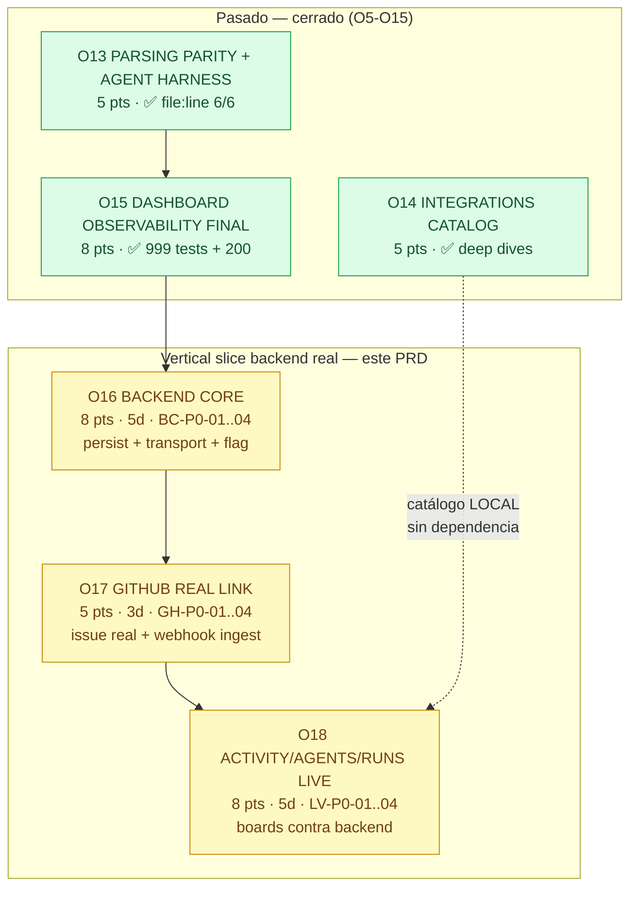

# PRD — Backend Real Olas 16–18 · Vertical Slice Activity / Agents / Runs con GitHub Real Link

> **Rol:** Xu — Product Manager · Equipo `software-termcanvas-backend`  
> **Fecha:** 2026-08-30 · Rama base `workbuddy/main-c2128e3a`  
> **Commits base:** `8f270cfb` (O5–O8 LOCAL-hardened 902 tests) + `efcce02` (O10a–O12 TOOLCHAIN dual + preview 200, 2319 modules) + `3232edd` (O13–O15 parsing parity + catalog + dashboard final)  
> **Estado actual verificado:** `tsc --noEmit 0` · `tsc -b 0` · `vitest 999 tests (pool:threads, jsdom)` · `vite build 2319 modules` · `vite preview 200` · `oxlint 0`  
> **Stack congelado:** Vite 8.2 · React 19.2 · TS 6.0 · Tailwind 4.1 · zod · yaml · pnpm · sin backend (KeyValuePort memory/localStorage)  
> **Diseño backend-ready ya existente:** `ADR-001` (4 ports + feature flag `VITE_FACTORY_BACKEND local|remote`) · `ENV-MAP.md` B1–B8 · `BACKEND-TRIGGER.md` 2026-11-01 (no disparado, usuario pide adelantar)  
> **Tipo de PRD:** Incremental — **solo vertical slice O16–O18**, no producto completo. Objetivo: que **Activity + Agents + Runs funcionen con datos reales** y **GitHub vinculado a funciones reales** con feature flag.

---

## TL;DR

Se adelanta el trigger de backend a petición del usuario sin esperar al 2026-11-01. En tres olas (16–18) se entrega **un único vertical slice** que hace que **Activity, Agents y Runs dejen de ser simulación local** y pasen a **persistencia backend + transport real + GitHub real link** — sin romper los 999 tests ni el demo LOCAL sin credenciales.

- **O16 — Backend Core:** `FactoryRepositoryPort` y `WorkItemRepositoryPort` con implementación remota real, `FactoryApiTransportPort` vía `FetchTransport`, y `VITE_FACTORY_BACKEND` inyectado en composición raíz (fail-closed `local`).
- **O17 — GitHub Real Link:** el routing dual-label ya validado localmente se vincula a funciones reales GitHub (crear issue con `factory:<alias>` + mention `@warp-factory`, ingest de webhook, verificación label/mention contra API) detrás de feature flag y sin exigir credenciales para demo local.
- **O18 — Activity / Agents / Runs Live:** los tres boards consumen los ports remotos: Activity con datos backend + filtros `Created by`/`Stage`/`includeTerminals`, Agents CRUD persistido, Runs con timeline/cost/sub-agents real.

Fuera de slice: Slack/Linear/Jira/GitLab live, MCP live, metering/OTel real, auth server, multi-team, deploy prod. Todo sigue siendo LOCAL por defecto; `remote` es opt-in y requiere credenciales B1 solo para la parte GitHub.

**DoD del slice:** `pnpm check` verde (tsc + 999+ tests + build + oxlint) · demo 5 min sigue funcionando sin env vars · con `VITE_FACTORY_BACKEND=remote` y backend corriendo, crear factory → crear issue GitHub → ver work item en Activity → ver run en Runs funciona E2E con un repo de prueba.

---

## 1. Estado actual — lo que ya funciona y lo que no

### 1.1 Lo que ya funciona (LOCAL-hardened, 0 credenciales)

| Área | Estado | Evidencia |
|------|--------|-----------|
| Demo 5 min sin credenciales | 🟢 Irrompible | `DEMO-5MIN.md` 7 pasos: factory → routing dual-label 5 presets → Factory API → Quickstart → Activity → Dashboard |
| Factory CRUD + alias + policy | 🟢 Completo LOCAL | `FactoryWorkspaceStore` (Map+Set+version sobre `KeyValuePort` memory/localStorage) + `validateFactoryCreate` + `enforceSinglePolicy` |
| Work items + máquina de estados | 🟢 Completo LOCAL | `WorkItemStore` (Map + `WorkItemMachine` + `nextStageForIntake` + gates humanas) · `ActivityBoard/Card/Detail` con filtros y timeline |
| GitHub routing dual-label | 🟢 Simulado con traza | `github.routing.ts` 5 checks (`new_content`, `not_bot`, `label_present`, `not_code_block`, `mention_present`) + `stripCodeBlocks` + `continuationKey` — todo determinista, sin API real |
| Factory API stub | 🟢 Drop-in | `factoryApi.router.ts` + `mcp.stub.ts` (19 tools) in-process · `TICKET_REF_PATTERN` + `search` case-insensitive centralizados |
| Dashboard/Activity/Runs UI | 🟢 Completo LOCAL | Activity kanban, Agents con harness matrix, Runs con timeline/cost/Sub-agents/View session (datos in-memory) |
| Ports + feature flag | 🟢 Solo tipos, sin runtime | `FactoryRepositoryPort`, `WorkItemRepositoryPort`, `FactoryApiTransportPort(handle)`, `McpTransportPort`, `KeyValuePort` + `VITE_FACTORY_BACKEND=local` (fail-closed) · `ports.contract.test.ts` verifica que los stubs actuales ya satisfacen los ports |
| Validación file:line | 🟢 Completa | `yaml` LineCounter para los 6 artefactos (`factory.yaml`, `agent.md`, etc.) |

### 1.2 Lo que NO funciona aún (brecha del slice)

| Brecha | Por qué importa para Activity/Agents/Runs |
|--------|-------------------------------------------|
| **Persistencia es solo `localStorage` + memory** | Al recargar en otro dispositivo o limpiar storage, factories/work items se pierden. No hay fuente única para Activity/Runs si hay más de un cliente. |
| **Transport es in-process** | `Factory API` y `MCP` no salen del browser. No hay `fetch` real, no hay `Bearer`, no hay 401/422 reales de red. |
| **`WorkItemStore` es in-memory sin backend** | `transition` y `history` no son durables ni auditables. Runs no tiene `run_id` durable ni followups persistidos fuera de la pestaña. |
| **GitHub es simulación** | Validar `factory:<alias>` + `@warp-factory` es string-match local. No se crea issue, no se pone label, no se menciona, no se ingesta webhook real. |
| **Feature flag no se usa en runtime** | `isBackendEnabled()` existe pero no elige adapter en `main.tsx`/hooks. El swap aún es doc, no runtime. |

**Conclusión:** el producto es demoable y testeable, pero Activity/Agents/Runs no tienen **durabilidad** ni **vinculación GitHub real**. O16–O18 cierran exactamente esa brecha con un slice mínimo y reversible.

---

## 2. Objetivos, no-objetivos, usuarios, constraints

### 2.1 Objetivos — 3 ortogonales, medibles

| ID | Objetivo | Verbo | Medida (observable en demo) |
|----|----------|-------|-----------------------------|
| **O1** | **Vertical slice live para Activity / Agents / Runs** | Activity, Agents y Runs dejan de leer `memory/localStorage` y leen **backend real** (Factory + WorkItem persistidos, Runs con timeline/cost real) | Con `VITE_FACTORY_BACKEND=remote` y backend corriendo: crear factory → aparece en lista tras reload · crear work item → aparece en Activity con filtros `Created by=you` + `includeTerminals` · crear run vía Factory API → aparece en Runs con `run_id` y es consultable vía `GET /agent/runs/:id` |
| **O2** | **GitHub Real Link detrás de feature flag** | El routing dual-label ya validado se **vincula a funciones GitHub reales** (crear issue con label + mention, ingest webhook que crea work item) sin romper el modo local | Con `B1` (GitHub App) configurado: `POST /factory/:uid/runs` con `prompt` crea issue real en `owner/repo` con `factory:<alias>` y body con mention · webhook `issue_comment_created` con label+mention correcta crea work item visible en Activity · Sin `B1`: mismo flujo en modo `dry-run` (simulación) con aviso explícito, y `pnpm check` no exige credenciales |
| **O3** | **Migración segura sin regresión ni rewrite** | El paso a backend es **cambio de port**, no de dominio: **999 tests verdes**, `tsc -b 0`, `vite preview 200`, OCP/DIP intactos, demo 5 min sin credenciales sigue funcionando | `pnpm --filter web check` verde en `local` y en `remote` (con backend mock) · 0 `throw` nuevo en dominio · docs `RECEIPT.md` con `commit·comando·salida` · rollback a `local` es cambiar una env var |

### 2.2 No-objetivos — explícitamente fuera de O16–O18

- ❌ No paridad 1:1 con Warp (no se reimplementa Warp completo, solo el slice Activity/Agents/Runs).
- ❌ No Slack / Linear / Jira / GitLab live (B2–B4 quedan como catálogo LOCAL; solo GitHub B1 entra en este slice).
- ❌ No MCP live (B5) ni harness `claude/codex/gemini` con secrets (B7).
- ❌ No auth server, no multi-tenant, no RBAC, no org/team management.
- ❌ No metering real de credits ni OTel real (B8 solo stub).
- ❌ No deploy prod público ni SLA; backend corre local primero (`localhost` o `docker compose`), luego preview si se decide.
- ❌ No migración de `schemaVersion v1alpha1` ni IndexedDB (re-evaluar solo si >500 factories o >1 MB — hoy <100 KB).
- ❌ No Playwright E2E (sigue `jsdom` + `vitest`, `pool:threads`).

### 2.3 Usuarios

| Rol | Quién es | Job to be done en este slice | Criterio de éxito para él |
|-----|----------|------------------------------|---------------------------|
| **Owner** (admin de factory) | Crea y configura factories, decide repos y alias, dispara runs | "Quiero crear una factory y que **quede guardada** para todo el equipo, no solo en mi browser" + "Quiero que un issue GitHub con `factory:<mi-alias>` realmente dispare trabajo" | Crea factory → recarga → sigue ahí. Issue con label+mention → aparece work item en Activity sin pasos manuales extra. |
| **Dev** (usuario diario) | Usa Activity para triage/planning/building/reviewing, consulta Agents y Runs | "Quiero ver **mis** work items y el timeline real de cada run sin perderlos al cerrar la pestaña" | Activity filtra `Created by=you` por defecto contra backend real. Runs muestra `timeline / cost / Sub-agents / View session` con datos persistidos, no mock. |

No hay roles nuevos en este slice. `Owner` y `Dev` ya existen en la navegación actual; solo cambia que sus datos son durables y GitHub está vinculado.

### 2.4 Constraints — innegociables

| ID | Constraint | Implicación concreta |
|----|------------|----------------------|
| **C1** | **Sin romper 999 tests ni `tsc -b 0`** | OCP estricto: no se muta firma ni semántica de ningún export de dominio. Todo se añade (nuevos adapters o `opts?` al final). `pnpm check` sigue siendo el gate único. |
| **C2** | **Stack congelado** | Vite 8.2 + React 19.2 + TS 6 + Tailwind 4.1 + zod + yaml + pnpm. Nueva dep solo con ADR (ej. driver Postgres, fetch wrapper) y justificación de bundle. |
| **C3** | **Dominio puro separado de React y de I/O** | `domain/` no importa `fetch`, `localStorage`, `Request`. Los ports son la única seam. Factory API y MCP siguen usando `ParseResult<T>` (errores como valores, cero `throw`). |
| **C4** | **Solo LOCAL por defecto, sin credenciales obligatorias** | `VITE_FACTORY_BACKEND=local` es fail-closed. `pnpm i && pnpm --filter web dev` sigue funcionando sin env vars. `remote` es opt-in explícito y toda función GitHub real tiene modo `dry-run` con aviso cuando `B1` no está. |
| **C5** | **4 credential boundaries respetados** | B1 GitHub App en boundary `execution / repository identity` con `EXECUTOR` default, nunca en browser. `WARP_API_KEY` (B5/B6) solo en `harness auth`. Tokens nunca viajan al cliente; el browser habla solo con el backend propio, el backend habla con GitHub. |
| **C6** | **DIP por ports + feature flag en composición raíz** | `main.tsx` o capa `hooks` elige `LocalAdapter` vs `RemoteAdapter` según `isBackendEnabled()`. Dominio y UI no conocen la elección. El flag no se esparce por componentes. |
| **C7** | **Receipt verificable** | Toda afirmación "verde/completo" cita `commit · pnpm check · salida`. `RECEIPT.md` se actualiza por ola. |

---

## 3. Riesgos y mitigaciones

| # | Riesgo | Prob. | Impacto | Mitigación en el PRD |
|---|--------|-------|---------|----------------------|
| **R1** | Warp abre Early Access público en Q4 y el backend propio queda obsoleto (alto arrepentimiento) | Media | Alto | Slice mínimo y reversible (O16–O18 solo Activity/Agents/Runs, sin infra pesada). Si Warp abre, se congela como `TermCanvas — Warp Factories Simulator (LOCAL)` según `BACKEND-TRIGGER.md` "Si Warp abre". El trabajo de ports no se pierde (valor didáctico y trazabilidad). |
| **R2** | Elección prematura de DB/tecnología acopla el dominio | Media | Alto | ADR-001 ya desacopla: el slice solo exige implementar `FactoryRepositoryPort`/`WorkItemRepositoryPort` y `FetchTransport` contra un backend propio. La elección concreta (Postgres, SQLite, KV, Supabase, etc.) es decisión de arquitecto con ADR ligero, no del PRD. El contrato es el port, no la DB. |
| **R3** | Credenciales GitHub B1 mal scopadas (token en browser, instalación sin acceso al repo) | Media | Alto | Arquitectura: browser → backend propio → GitHub App. `GITHUB_APP_ID/PRIVATE_KEY/INSTALLATION_ID` solo en env del backend (boundary `execution`). CI de verificación: sin B1, el flujo es `dry-run` testeable; con B1, smoke contra 1 repo de prueba, no contra todos. |
| **R4** | Migración `localStorage v2 → backend` con pérdida de datos o doble fuente de verdad | Media | Medio | Estrategia migración no destructiva: al activar `remote`, el primer arranque hace `exportWorkspace` → `POST /api/v1/factory/import` validado por `factory.parser` (mismo `code` que validación file:line). `localStorage v2` se conserva hasta confirmación manual. Rollback es `VITE_FACTORY_BACKEND=local`. |
| **R5** | 999 tests se vuelven flaky al introducir async/network | Media | Medio | `ports.contract.test.ts` ya aísla el contrato: el `InMemoryTransport` sigue siendo el default en tests. Los adapters remotos se testean con `fetch` mockeado y `createMemoryPort`, no contra red real. `vitest pool:threads` se mantiene. |
| **R6** | Scope creep: el slice se expande a Slack/Linear/Jira o a auth/metering | Baja | Medio | Backlog P1/P2 explícito como "no en O16–O18". El DoD de cada ola nombra exactamente qué queda fuera. El trigger original 2026-11-01 se adelanta solo para este vertical slice, no para backend completo. |
| **R7** | Feature flag esparcido por componentes rompe OCP | Baja | Medio | Flag solo en `config/featureFlags.ts` + composición raíz (`main.tsx` o `hooks/use*`). Prohibido `if (isBackendEnabled())` dentro de `domain/` o de páginas. |

---

## 4. Alcance del vertical slice O16–O18 — qué entra y qué no

### Entra (P0 del slice, E2E demostrable)

1. **Backend Core con ports reales** — `FactoryWorkspaceStore` y `WorkItemStore` con implementación remota que persiste en backend propio; `FactoryApiTransportPort` con `FetchTransport` real (handle → fetch + Bearer opcional); `McpTransportPort` sigue stub local pero ya atraviesa el mismo `handle` para que Activity/Runs no conozcan el origen.
2. **GitHub Real Link mínimo** — con B1 disponible: crear issue real con `factory:<alias>` + mention, ingest de webhook GitHub que aplica los 5 checks de `github.routing` y crea work item si `routable=true`. Sin B1: mismo flujo en `dry-run` con banner "simulación — sin GitHub App".
3. **Activity / Agents / Runs Live** — Activity board contra `WorkItemRepositoryPort` remoto (filtros, `Created by=you`, `includeTerminals`, `Event history`), Agents CRUD persistido (incl. harness matrix y `file:line` si hay error), Runs con `run_id` durable + timeline + followups.

### No entra en O16–O18 (queda para P1/P2 o trigger futuro)

- Slack `reaction_added` con `channels[intake]`/`emojis[ticket]` live, Linear `agent_session_created`, Jira/GitLab/Schedule/Factory live.
- MCP live, `WARP_API_KEY` harness, `OTEL_ENDPOINT`/self-hosted runner, metering/credits, ZDR.
- Auth real (solo `Bearer` opcional local), multi-team, RBAC, org-level settings.
- Deploy prod, CDN, observabilidad prod.

**Regla de oro del slice:** si no se necesita para que **Activity → Agents → Runs → GitHub** funcione E2E con un repo de prueba, no entra en O16–O18.

---

## 5. Backlog priorizado P0 / P1 / P2

> Prioridad: **P0 Must have** (el slice no es slice sin esto), **P1 Should have** (valor alto, entra si O16–O18 deja holgura), **P2 Nice to have** (siguiente ola, O19+). Cada P0 lleva owner funcional y criterios Gherkin donde aporta valor. Valor/esfuerzo se resume en §6.

### 5.1 P0 — Must have (sin esto no hay slice)

#### P0-Backend Core

| ID | Historia | Objetivo que cierra |
|----|----------|---------------------|
| **BC-P0-01** | Como owner, quiero que las factories que creo **persistan en backend** de modo que al recargar o abrir en otro navegador sigan ahí, sin depender de `localStorage`. | O1, O3 |
| **BC-P0-02** | Como dev, quiero que los work items que creo y transiciono **queden guardados con su history** en backend, de modo que Activity y Runs muestren el mismo estado en cualquier cliente. | O1, O3 |
| **BC-P0-03** | Como sistema, quiero que el **Factory API y Agent API salgan del in-process** y viajen por `FetchTransport` real contra un backend propio, de modo que `handle(ApiRequest)` sea `fetch` con `Bearer` opcional y errores mapeados a `ParseResult` con `code` testeable. | O1, O3 |
| **BC-P0-04** | Como equipo, quiero que el **feature flag `VITE_FACTORY_BACKEND=local\|remote` elija adapter en la composición raíz** y que el default sea `local` (fail-closed), de modo que el repo siga funcionando sin env vars y `remote` sea opt-in reversible. | O3 |

**Criterios Gherkin — Backend Core**

```gherkin
Característica: Backend Core — persistencia y transport reales con fallback local

  Escenario: Factory persiste en backend y sobrevive a reload (O1)
    Dado que VITE_FACTORY_BACKEND=remote y el backend está corriendo
    Cuando creo una factory "payments-factory-2" con alias "payments-2" y un repo acme/payments-service
    Y recargo la página
    Entonces la factory "payments-factory-2" sigue en la lista y es seleccionable
    Y toSummaries() incluye esa factory con el mismo uid

  Escenario: Work item persiste con history y es visible en Activity desde otro cliente (O1)
    Dado una factory persistida "payments-factory"
    Cuando creo un work item "Fix checkout race" con foremanDecision que entra en Triage
    Y transiciono ese work item a Planning con actor human y humanApproval pending
    Entonces GET /agent/runs/<run_id> devuelve ese work item con history de 2 eventos
    Y un segundo cliente que abre Activity ve el mismo work item en la columna Triage/Planning

  Escenario: Transport real mapea errores a ParseResult con code testeable (O3)
    Dado VITE_FACTORY_BACKEND=remote
    Cuando hago POST /api/v1/factory/<uid>/runs con ticket_ref "PAY-123" inválido
    Entonces la respuesta es 400 con code "invalid_ticket_ref" (mismo que stub)
    Y no se crea work item ni run

  Escenario: Fail-closed sin credenciales (C4, O3)
    Dado que no hay VITE_FACTORY_BACKEND seteada y no hay B1
    Cuando clono el repo y ejecuto pnpm i && pnpm --filter web dev
    Entonces la app arranca en modo local sin pedir tokens
    Y pnpm --filter web check pasa con los mismos 999+ tests
```

**Notas de implementación (sin código, para arquitecto):** BC-P0-01/02 deben satisfacer `FactoryRepositoryPort` y `WorkItemRepositoryPort` ya tipados; el backend propio expone `GET /api/v1/factory`, `POST /factory/:uid/runs`, `GET /agent/runs/:id` con los mismos paths que el stub para que `toCurl`/`toOzApiSnippet` sigan válidos. BC-P0-04 debe inyectar el adapter en `main.tsx` o capa `hooks`, no en cada página.

---

#### P0-GitHub Real Link (dual-label → funciones reales)

| ID | Historia | Objetivo que cierra |
|----|----------|---------------------|
| **GH-P0-01** | Como owner, quiero que al disparar un run vía Factory API con B1 configurado se **cree un issue real en GitHub** con label `factory:<alias>` y body con mención del handle, de modo que el repo refleje el trabajo sin pasos manuales. | O2 |
| **GH-P0-02** | Como sistema, quiero **ingerir el webhook GitHub** (`issue_comment_created`, `issue_created`, etc.) y aplicar los **5 checks de routing** ya existentes para crear un work item solo cuando `routable=true`, de modo que el dual-label siga siendo la única puerta. | O2, O1 |
| **GH-P0-03** | Como dev, quiero que la validación de label y mention **use la API real cuando hay B1** (verifica que la label existe y que el handle es válido) y caiga a validación local con aviso cuando no hay B1, de modo que el demo local no se rompa. | O2, O3, C4 |
| **GH-P0-04** | Como equipo, quiero que **ningún token GitHub llegue al browser**: el browser habla solo con el backend propio y el backend habla con GitHub usando `GITHUB_APP_ID/PRIVATE_KEY/INSTALLATION_ID` en boundary `execution`. | C5, O3 |

**Criterios Gherkin — GitHub Real Link**

```gherkin
Característica: GitHub Real Link — dual-label vinculado a GitHub real detrás de flag

  Escenario: Crear issue real desde Factory API cuando hay B1 (O2)
    Dado VITE_FACTORY_BACKEND=remote y B1 GitHub App instalada en acme/payments-service
    Cuando hago POST /api/v1/factory/<uid>/runs con prompt "Fix checkout race" y repo owner acme/payments-service
    Entonces se crea un issue en GitHub con label "factory:<alias>" y body que contiene la mención configurada
    Y la respuesta 201 incluye ticket_ref con el número del issue real
    Y ese issue es visible en GitHub en acme/payments-service/issues

  Escenario: Webhook GitHub crea work item solo si dual-label pasa (O2)
    Dado un issue en acme/payments-service con label "factory:payments"
    Cuando llega un webhook issue_comment_created con body "Por favor @warp-factory revisá esto" y no es edición ni bot ni code block
    Entonces el backend crea un work item en la factory con source github y continuationKey "acme/payments-service#<number>"
    Y ese work item aparece en Activity en la columna Triage
    Cuando el mismo evento llega con body dentro de ```code fence``` que contiene la mención
    Entonces no se crea work item y la traza indica not_code_block=false

  Escenario: Dry-run sin B1 no rompe demo local (C4, O3)
    Dado VITE_FACTORY_BACKEND=local o remote sin B1
    Cuando hago POST /factory/<uid>/runs con el mismo prompt
    Entonces la respuesta es 201 en modo simulación con banner "dry-run — sin GitHub App"
    Y se crea un work item local visible en Activity pero no se llama a api.github.com
    Y pnpm --filter web check pasa sin requerir GITHUB_*

  Escenario: Tokens nunca en browser (C5)
    Dado que el backend tiene GITHUB_APP_PRIVATE_KEY en env
    Cuando inspecciono el tráfico del browser y el bundle web
    Entonces no hay private key ni installation token en headers, body ni source maps
    Y el browser solo hace fetch contra el backend propio
```

**Dependencia B1:** GH-P0-01/02 requieren `GITHUB_APP_ID`, `GITHUB_APP_PRIVATE_KEY`, `GITHUB_INSTALLATION_ID` con acceso al repo de prueba. Sin ellos, el slice entrega GH-P0-03/04 en modo `dry-run` y queda GH-P0-01/02 como `P0 con flag` (testeable con mock de GitHub, no bloquea `pnpm check`).

---

#### P0-Activity / Agents / Runs Live

| ID | Historia | Objetivo que cierra |
|----|----------|---------------------|
| **LV-P0-01** | Como dev, quiero que **Activity board lea del backend real** (WorkItemRepositoryPort remoto) con filtros `Created by`, `Stage`, `search` y toggle `includeTerminals`, de modo que vea los work items reales con paginación y `Event history` persistido. | O1 |
| **LV-P0-02** | Como owner, quiero que **Agents sea CRUD persistido** (harness por agente, `reasoningLevel` solo `codex`, auth `managedSecret\|workerEnvironment`) de modo que al editar un agente y recargar, el cambio siga y los errores sigan mostrando `file:line` cuando aplique. | O1 |
| **LV-P0-03** | Como dev, quiero que **Runs muestre timeline real** (queued → running → completed/cancelled, `cost`, `Sub-agents`, `View session`, `Stop task` inmediato) con datos del backend, no del stub in-memory de la pestaña. | O1 |
| **LV-P0-04** | Como owner, quiero que **Factory definition / Settings** lean y escriban contra backend (identity, repos, `credentialStrategy EXECUTOR/CREATOR`, `Deletion` irreversible) de modo que dos clientes vean la misma definición. | O1 |

**Criterios Gherkin — Live boards**

```gherkin
Característica: Activity / Agents / Runs Live — UI consume backend real

  Escenario: Activity live con filtros contra backend (LV-P0-01)
    Dado 3 work items en backend: uno mío en Triage, uno mío en Complete, uno de otro usuario en Triage
    Cuando abro Activity
    Entonces por defecto veo Created by=you + 4 active (no veo el Complete)
    Cuando activo includeTerminals
    Entonces veo también Complete/Cancelled con el count correcto y siguen siendo buscables por search

  Escenario: Agents CRUD persistido con validación file:line (LV-P0-02)
    Dado una factory con agente reviewer harness oz
    Cuando edito ese agente y pongo reasoningLevel con harness oz
    Entonces veo error "reasoningLevel solo aplica a codex" con path que incluye agent file:line
    Cuando corrijo a harness codex y guardo
    Y recargo
    Entonces el agente sigue en codex con reasoningLevel guardado

  Escenario: Runs timeline real (LV-P0-03)
    Dado un run creado vía Factory API que está en running
    Cuando abro Runs y entro al detalle de ese run_id
    Entonces veo timeline, cost, Sub-agents y View session con transcript persistido
    Cuando hago Stop task
    Entonces el run pasa a cancelled sin confirmación extra (ya existe) y el cambio persiste tras reload

  Escenario: Settings persistido cross-client (LV-P0-04)
    Dado que cambio credentialStrategy a CREATOR en Settings y guardo
    Cuando otro cliente abre Settings de esa factory
    Entonces ve CREATOR, y al volver a cambiar a EXECUTOR el cambio es visible para ambos tras reload
```

---

### 5.2 P1 — Should have (entra si O16 deja holgura, o va a O18 pulido)

| ID | Historia / mejora | Por qué es P1 y no P0 | Esfuerzo |
|----|-------------------|----------------------|----------|
| **BC-P1-01** | Search y paginación server-side en `GET /api/v1/factory?search` y `list work items` | Sin esto el slice funciona con <100 factories/work items; con paginación escala a cientos sin cambiar contrato | Medio |
| **BC-P1-02** | Export/import contra backend (`exportWorkspace` → `POST /import` validado) | Migración manual útil para demo multi-device; no bloquea E2E con un repo de prueba | Bajo |
| **BC-P1-03** | Health check `/health` y `GET /api/v1/factory` con `version` para `RECEIPT.md` | Observabilidad mínima para saber qué backend está corriendo | Bajo |
| **GH-P1-01** | Comentar issue real desde `POST /agent/runs/:id/followups` (escribe comentario en GitHub) | Cierra el loop GitHub más allá de creación; requiere B1 y manejo de rate limit | Medio |
| **GH-P1-02** | Re-run de workflow_dispatch / label sync real (verifica que la label `factory:<alias>` existe, si no la crea) | Reduce fricción de setup de repo; no necesario para un repo ya preparado | Bajo |
| **LV-P1-01** | Paginación Activity + "3 newest Self-improvement sin date filter" contra backend | Paridad Dashboard ya existe local; llevarlo a backend es polish | Medio |
| **LV-P1-02** | `View session` transcript con followups acumulados y `convert to benchmark` persistido | Profundiza Runs sin requerir MCP live | Medio |

### 5.3 P2 — Nice to have (O19+ , fuera de O16–O18)

| ID | Idea | Por qué queda fuera del slice |
|----|------|-------------------------------|
| **BC-P2-01** | Reemplazar `localStorage v2` por `IndexedDB` o `KeyValuePort` híbrido | Hoy <100 KB, muy por debajo de quota 5 MB; re-evaluar solo si >500 factories o >1 MB — ADR-001 ya lo documenta |
| **BC-P2-02** | Sync offline / optimistic UI con cola | Complejidad sin valor para vertical slice con un repo de prueba |
| **GH-P2-01** | GitHub Enterprise / GitLab `GITLAB_MANAGER_TOKEN` live, Linear/Jira live, Slack `reaction_added` live | B2–B4 completos; cada uno es un slice propio de 2 semanas — no entra en 3 olas |
| **LV-P2-01** | OTEL real (`OTEL_ENDPOINT`, worker health, task throughput) y metering S/M/L/XL real | B8; requiere runner self-hosted — fuera de web slice |
| **LV-P2-02** | Auth real multi-user, org/team, secrets manager, RBAC | Infra de producto completo — fuera de vertical slice |
| **GH-P2-03** | `factory work_item_stage_changed` trigger live | Depende de WorkItem transitions reales ya — útil pero no bloquea GitHub dual-label |

---

## 6. Matriz valor / esfuerzo

> Escala: **Valor** = cuánto acerca al demo E2E Activity/Agents/Runs + GitHub real para owner/dev. **Esfuerzo** = días-hombre con 1 dev, asumiendo ports ya tipados y dominio puro intacto. Ubicación aproximada, no medición exacta.

```
Valor
  ↑
Alto |  BC-P0-01  BC-P0-02  GH-P0-02
     |  Factory   WorkItem  Webhook
     |  persist   persist   ingest
     |              LV-P0-01
     |              Activity live
     |  GH-P0-01   LV-P0-03
     |  Crear issue  Runs live
     |  BC-P0-03  BC-P0-04  GH-P0-04
     |  FetchTrans Feature  Secrets
     |  port      flag      boundary
     |                          
     |  BC-P1-01  GH-P1-01  LV-P1-02
Medio|  Search    Comentar  Transcript
     |  server    issue     persist
     |  BC-P1-03  LV-P1-01
     |  Health    Paginate
     |                          
     |  BC-P2-01  GH-P2-01  LV-P2-01
Bajo |  IndexedDB Slack/etc OTEL
     |                          
     +--------------------------------→ Esfuerzo
       Bajo      Medio      Alto
```

**Lectura para O16–O18:**

- **Hacer primero (alto valor, bajo→medio esfuerzo):** BC-P0-01/02/04 (persistencia + flag), GH-P0-04 (boundary), GH-P0-01 (crear issue). Son el núcleo del slice y desbloquean todo lo demás.
- **Hacer segundo (alto valor, esfuerzo medio):** GH-P0-02 (webhook ingest), LV-P0-01/03 (Activity/Runs live), BC-P0-03 (FetchTransport). Requieren wiring pero ya tienen contrato.
- **Si queda holgura:** BC-P1-01/03, GH-P1-01, LV-P1-02.
- **No hacer en O16–O18:** todo P2 — es cebo de scope creep con alto arrepentimiento si Warp abre.

---

## 7. Gherkin E2E del vertical slice completo (lo que debe pasar en demo)

```gherkin
Característica: Vertical slice Activity + Agents + Runs con GitHub Real Link — demo E2E 5 min con backend real

  Antecedentes:
    Dado VITE_FACTORY_BACKEND=remote y el backend propio corriendo en localhost:8787
    Y B1 GitHub App instalada en acme/payments-service (o modo dry-run si no hay B1)

  Escenario: Demo E2E 5 min con backend real y GitHub vinculado
    # 1. Factory persiste en backend
    Cuando creo una factory "demo-factory" con repo acme/payments-service
    Entonces la factory aparece en la lista y tras recargar sigue ahí con el mismo uid

    # 2. GitHub Real Link — crear issue real
    Cuando disparo POST /api/v1/factory/<uid>/runs con prompt "Add Local development section to README" y ticket_ref "github:42"
    # con B1: crea issue real con factory:demo-factory + mention; sin B1: dry-run con mismo 201 y banner
    Entonces hay un run 201 con run_id y ticket_ref, y en GitHub (o dry-run) hay un issue con label factory:demo-factory

    # 3. Webhook → work item en Activity
    Cuando GitHub entrega webhook issue_comment_created con body "@warp-factory por favor revisá" y label factory:demo-factory (o simulo el webhook vía POST /webhooks/github en dry-run)
    Entonces el backend crea un work item con source github y continuationKey "acme/payments-service#<n>"
    Y al abrir Activity veo ese work item en Triage con Created by correcto y Event history con el body del comentario

    # 4. Agents CRUD persistido
    Cuando edito el agente reviewer y cambio su harness a codex con reasoningLevel
    Y recargo la página
    Entonces el cambio persiste y Validation no reporta error; si pongo reasoningLevel con oz veo error con file:line

    # 5. Runs timeline real
    Cuando abro Runs y entro al run_id creado en el paso 2
    Entonces veo timeline (queued/running), cost, Sub-agents y View session con transcript
    Y al hacer Stop task el run pasa a cancelled y tras recargar sigue cancelled

    # 6. Rollback seguro
    Cuando cambio VITE_FACTORY_BACKEND a local y recargo
    Entonces la app vuelve a localStorage v2 sin pedir credenciales y pnpm --filter web check sigue verde
```

Este Gherkin es el **criterio de aceptación del slice completo** (O18 DoD). Cada uno de sus 6 pasos mapea a un P0 de §5.1. Si un paso falla, el slice no está hecho.

---

## 8. Métricas de éxito y DoD por ola

### 8.1 Gate canónico (siempre verde)

```
pnpm --filter web exec tsc --noEmit              → 0
pnpm --filter web exec tsc -b                    → 0
pnpm --filter web exec vitest run --pool=threads → 999+ tests (no baja, sube)
pnpm --filter web build                          → verde, 2319± módulos, sin exceder budget 500kB warn
pnpm --filter web exec oxlint                    → 0
pnpm --filter web exec vite preview --port 4173  → 200
pnpm --filter web check                          → verde
```

### 8.2 DoD por ola

| Ola | Nombre | Objetivo en 1 frase | DoD medible | Tests | Docs |
|-----|--------|---------------------|-------------|-------|------|
| **O16** | **Backend Core** | Persistencia y transport reales con flag reversible | Factory y work item creados en `remote` sobreviven a reload y son visibles desde segundo cliente · `FetchTransport` contra backend propio con `Bearer` opcional y `code` testeable · `VITE_FACTORY_BACKEND=local` sigue funcionando sin env · `ports.contract.test.ts` verde + nuevos tests de `Remote*Repo` con fetch mock | 999 → ~1015 (+~16: persistencia, transport, flag) | `RECEIPT.md` + `ADR-002-backend-core.md` ligero (elección DB/transport) |
| **O17** | **GitHub Real Link** | Dual-label vinculado a GitHub real detrás de flag | Con B1: `POST /factory/:uid/runs` crea issue real con `factory:<alias>` + mention · webhook GitHub ingerido crea work item solo si `routable=true` (5 checks) · Sin B1: dry-run con banner y 201 simulado, `pnpm check` no exige `GITHUB_*` · Tokens nunca en browser (verificado por grep de bundle) | ~1015 → ~1030 (+~15: webhook ingest, dry-run, label/mention verification) | `ENV-MAP.md` actualizado (B1 scoping real) + `DEMO-5MIN.md` con variante `remote` |
| **O18** | **Activity / Agents / Runs Live** | Boards consumen backend real E2E | Activity live con `Created by=you`/`includeTerminals`/`search` contra backend · Agents CRUD persistido con `file:line` en error · Runs con `run_id` durable + timeline/cost/Sub-agents/View session + `Stop task` persistido · Settings `EXECUTOR/CREATOR` y `Deletion` persistidos cross-client · Gherkin E2E de §7 verde | ~1030 → ~1045 (+~15: activity/agents/runs live) | `RECEIPT.md` final con `commit·comando·salida` + `WARP-V1-DIFF.md` intacto |

**Total O16–O18:** **999 → ~1045 tests** (+46, +4.6%) · 0 regresión · `pnpm check` verde ininterrumpido · `vite build` sin nuevas deps pesadas.

### 8.3 Métricas de negocio del slice (para decidir si seguir a O19)

| Métrica | Cómo se mide | Umbral de éxito del slice |
|---------|--------------|---------------------------|
| Tiempo demo E2E con backend real | Cronómetro `DEMO-5MIN.md` variante `remote` (factory → issue GitHub → Activity → Runs) | ≤ 7 min con B1, ≤ 5 min en dry-run sin B1 |
| Factory/WorkItem durables | Crear en cliente A, reload en cliente B | 100% visibles en B |
| GitHub issue creado | `POST /factory/:uid/runs` → issue en `acme/payments-service` | Con B1: 100% creado con label+mention correcta; sin B1: 100% dry-run con banner |
| Webhook → work item | Webhook `issue_comment_created` con dual-label correcta → work item en Activity | 100% cuando `routable=true`, 0% cuando `not_code_block=false` u otro check falla |

Si alguna métrica no se cumple al cierre de O18, el slice no se da por hecho aunque `pnpm check` esté verde.

---

## 9. Preguntas para arquitecto — decisiones que debe resolver antes de O16

> Estas preguntas no bloquean el PRD; bloquean el inicio de código de O16. La respuesta debe quedar en un ADR ligero (no más de 1 página) antes de implementar `Remote*Repo`/`FetchTransport`.

### 9.1 Elección de persistencia (BC-P0-01/02)

| Pregunta | Opciones a evaluar | Criterio de decisión |
|----------|-------------------|---------------------|
| ¿Qué DB/KV para el backend propio del slice? | (a) **Postgres** (Supabase/Neon/Railway) · (b) **SQLite** en disco (mejor para `docker compose` local) · (c) **KV simple** (ej. `better-sqlite3` + json, o `lowdb`, o Postgres con tabla jsonb) · (d) Reusar `KeyValuePort` del backend con file json | Elegir la que deje el **contrato de port intacto**, con **mínima infra para el vertical slice** (un repo de prueba, <100 factories, <1k work items), **migrations simples** y **backup trivial**. No se necesita escala ni particionado en O16–O18. Documentar por qué no IndexedDB (ya descartada en ADR-001 salvo >500 factories) y por qué no Dynamo/Firestore (overkill). |
| ¿Esquema: tablas normalizadas vs jsonb vs file? | `factories` + `work_items` + `runs`/`followups` normalizadas vs `payload jsonb` vs file `workspace.json` por env | Normalizado gana para queries `search` y `stage`; jsonb gana para iterar rápido sin migrations. Para el slice, jsonb o file pueden bastar si el query es solo `list` + filtro en memoria (<1k rows). Decidir con costo de migración futura a la vista. |
| ¿Migración `localStorage v2 → backend`? | (a) Export/import manual vía `workspace.export.ts` · (b) Auto-migración en primer arranque `remote` | (a) es más segura y testeable; (b) suma magia y riesgo de doble fuente. Recomendación PRD: (a) manual con botón Import en Settings + doc, no auto-migración silenciosa. |

### 9.2 Elección de transport (BC-P0-03)

| Pregunta | Opciones | Criterio |
|----------|---------|----------|
| ¿Framework del backend propio? | (a) **Hono** / **Express** / **Fastify** en Node · (b) **Next API routes** (si el hosting es Vercel) · (c) **Bun/Hono** | El que **reutilice los mismos paths** que el stub (`/api/v1/factory`, `/agent/runs/:id`) y permita `handle(ApiRequest)` → `fetch` sin reescribir `TICKET_REF_PATTERN`/`search` case-insensitive. Debe ser testeable con `vitest` sin server real (fetch mock). |
| ¿Contrato `handle(ApiRequest)→ApiResponse` se mantiene? | Sí (ADR-001) vs migrar a `fetch Request→Response` nativo | PRD asume **sí se mantiene** (es el port ya tipado y testeado). El arquitecto confirma o propone ADR de cambio con justificación. |
| ¿Auth del backend propio? | `Bearer` opcional local (`warp_local_api_key`) vs `Bearer` real con `WARP_API_KEY` vs sin auth en localhost | Para el slice: `Bearer` opcional, `401` solo si `WARP_API_KEY` está seteada. En `localhost` sin env, sin auth (igual que stub). En preview con env, `Bearer` requerido. |

### 9.3 GitHub auth y B1 scoping (GH-P0-04)

| Pregunta | Opciones | Criterio |
|----------|---------|----------|
| ¿GitHub App vs PAT vs OAuth? | **GitHub App** (`APP_ID`+`PRIVATE_KEY`+`INSTALLATION_ID`) es la opción canónica de Warp y de `ENV-MAP.md` B1. PAT es más simple pero no escala y expone token personal. | **GitHub App** para el slice (coherente con Warp). PAT solo como fallback local documentado, nunca en prod. |
| ¿Dónde vive `GITHUB_APP_PRIVATE_KEY`? | Solo en env del backend (Node), nunca en `VITE_*` ni en bundle | Confirmar boundary `execution / repository identity` y `EXECUTOR` default. El browser nunca ve la key. |
| ¿Instalación por repo vs org? | Instalación con acceso a `acme/payments-service` (repo de prueba) vs org entera | Para el slice: instalación **repo-scoped** al repo de prueba. Documentar cómo rotar y cómo añadir repos sin reinstalar. |
| ¿Webhook: real `smee.io`/ngrok vs simulado `POST /webhooks/github`? | (a) Webhook real vía `smee`/`ngrok` a localhost · (b) Endpoint simulado `POST /webhooks/github` que acepta payload GitHub y aplica `isRoutable` | (b) para O17 (testeable sin túnel). (a) opcional P1 si se quiere demo con GitHub real sin simular payload. |

### 9.4 Feature flag migration path (BC-P0-04)

| Pregunta | Opciones | Criterio |
|----------|---------|----------|
| ¿Dónde se elige el adapter? | (a) `main.tsx` (composición raíz) · (b) `hooks/useFactories`/`useWorkItems` · (c) `store/*` | (a) es la más OCP: un único `if (isBackendEnabled())` que inyecta `RemoteAdapter` vs `LocalAdapter`. Prohibido esparcir `isBackendEnabled()` por páginas o `domain/`. |
| ¿`VITE_FACTORY_BACKEND` es suficiente? | `VITE_` es build-time (Vite). Para runtime preview puede necesitar `window.__ENV__` o `/config` endpoint | Para el slice local (`vite dev`), `VITE_` alcanza. Si se quiere toggle sin rebuild en preview, el arquitecto propone `runtime config` ligero (no bloquea O16). |
| ¿Tests deben cubrir ambos modos? | Solo `local` vs ambos | `local` sigue siendo el default en CI. Un job o `describe` extra con `VITE_FACTORY_BACKEND=remote` y fetch mock cubre `remote` sin requerir B1. |

### 9.5 Hosting y deploy del backend del slice (no es P0, pero decidir temprano)

| Pregunta | Opciones | Criterio |
|----------|---------|----------|
| ¿Dónde corre el backend en O16–O18? | (a) `localhost:8787` con `pnpm --filter web dev` + `pnpm --filter server dev` (o `docker compose`) · (b) Preview en Vercel/Cloud Run/Fly | (a) para O16–O17 (sin deploy). (b) opcional en O18 si se quiere demo compartida. El PRD no exige deploy prod; exige que el backend sea **local-first** igual que el frontend. |

**Entregable del arquitecto antes de O16:** ADR ligero (≤1 página) con tabla de decisión para 9.1–9.4 y diagrama de secuencia `browser → backend propio → GitHub` con boundaries.

---

## 10. Plan de olas O16–O18 — dependencias, duraciones, frontier width

### 10.1 Resumen en tabla

| Ola | Nombre | Objetivo en 1 frase | P0 que cierra | Pts (Fib) | Duración 1 dev | Depende de | Demo al cierre |
|-----|--------|---------------------|---------------|-----------|----------------|------------|----------------|
| **O16** | **Backend Core** | Persistencia y transport reales con flag reversible | BC-P0-01..04 | 8 (5 persist + 3 transport/flag) | 5 días | HEAD actual (O15) — ninguna ola previa | Creo factory en `remote`, recargo, sigue ahí; `pnpm check` verde en ambos modos |
| **O17** | **GitHub Real Link** | Dual-label vinculado a GitHub real (o dry-run) | GH-P0-01..04 | 5 (3 issue+webhook + 2 boundary/dry-run) | 3 días | O16 (necesita persistencia y transport reales) | `POST /factory/:uid/runs` crea issue real con label+mention; webhook crea work item solo si routable |
| **O18** | **Activity / Agents / Runs Live** | Boards consumen backend real E2E | LV-P0-01..04 | 8 (3 activity + 2 agents + 3 runs) | 5 días | O16 + O17 | Gherkin E2E de §7 verde de punta a punta con un repo de prueba |

> **Total O16–O18:** **21 pts** · **13 días esfuerzo** · **~10 días wall-clock** con frontier 1 (olas secuenciales; O17 no puede ir antes que O16) · **0 deps nuevas sin ADR** · `pnpm check` verde todo el tiempo.

### 10.2 Mapa de dependencias



**Orden recomendado:** O16 primero sin excepción (sin persistencia/transport no hay GitHub real ni boards live). O17 inmediatamente después (depende de O16). O18 última (usa todo lo anterior y cierra el Gherkin E2E). No hay paralelismo útil con 1 dev; con 2 devs, O18 puede arrancar su parte de UI mockeada en día 2 de O17, pero no antes.

### 10.3 Frontier width por ola

| Ola | Width | Tareas paralelizables |
|-----|-------|-----------------------|
| O16 | 2 | `FactoryRepositoryPort remoto` ‖ `WorkItemRepositoryPort remoto + FetchTransport` (mismo backend, distinta tabla/ruta) |
| O17 | 1 | `GitHub issue creation` + `webhook ingest` comparten B1 y `github.routing` — no paralelizar |
| O18 | 2 | `Activity live` ‖ `Agents/Runs live` (distintas páginas, mismo `WorkItemRepositoryPort`) |

---

## 11. Supuestos y decisiones tomadas

| # | Supuesto / decisión | Qué se hace si cambia |
|---|---------------------|----------------------|
| **S1** | Se adelanta el trigger 2026-11-01 solo para este vertical slice (21 pts), no para backend completo. | Si Warp abre antes de O18, se congela el slice como está y se publica como `Simulator + vertical slice backend` con nota `WARP-OPEN-NOTE.md` — el trabajo de ports no se pierde. |
| **S2** | El usuario pide olas autónomas: los subagentes siguen con `software-termcanvas-backend` vinculados a las funciones GitHub definidas en este PRD y en `github.routing.ts`. | El PM no orquesta implementación; solo define el contrato. Los subagentes implementan contra los ports y el Gherkin de §7. |
| **S3** | Backend propio del slice corre local primero (`localhost:8787` o `docker compose`), no requiere deploy prod para cerrar O18. | Si se pide demo compartida, se añade deploy preview en O18 sin cambiar el contrato (mismo `FetchTransport` con baseUrl distinta). |
| **S4** | Sin B1, GitHub Real Link se entrega en modo `dry-run` testeable (no bloquea `pnpm check`). | Si B1 llega a mitad de O17, se activa el path real sin re-trabajo: el mismo `handle` ya distingue `dry-run` vs `fetch GitHub`. |
| **S5** | No se introduce IndexedDB ni nuevas deps sin ADR. | Si el arquitecto elige SQLite/Postgres, la dep es del backend (`server/`), no de `web/` — no afecta bundle de `web`. |

---

## 12. Referencias y traza

- `ADR-001` — 4 ports (`FactoryRepositoryPort`, `WorkItemRepositoryPort`, `FactoryApiTransportPort(handle)`, `McpTransportPort`) + `KeyValuePort` + `VITE_FACTORY_BACKEND local|remote`
- `ENV-MAP.md` — B1 GitHub App (`GITHUB_APP_ID`, `GITHUB_APP_PRIVATE_KEY`, `GITHUB_INSTALLATION_ID`) · B2 Slack · B3 Linear/Jira · B4 GitLab · B5/B6 `WARP_API_KEY` · B7 harness · B8 runner — boundaries `execution`/`harness auth`/`inference`/`repository identity`, `EXECUTOR` default
- `BACKEND-TRIGGER.md` — puertas G-T1..G-T4 (ya verdes) y señales S-N1..S-N3 (trigger 2026-11-01 adelantado a pedido)
- `PLAN-OLAS-WARP-FACTORIES.md` §8 + Apéndice B — diseño de ports y feature flag
- `PLAN-SIGUIENTES-OLAS.md` O13–O15 — estado base 999 tests, 2319 modules, preview 200
- `RECEIPT.md` — gate `pnpm check` + 11 errores `tsc -b` 11→0
- `INCREMENTAL-DESIGN.md` G1–G6 — principios OCP/DIP/`ParseResult`/traza
- `WarpFactories.md` §9 (GitHub dual-label), §10 (Factory Dashboard), §12 (Activity/Runs), §14 (Sizing), §19 (Factory API)
- Código fuente de referencia: `src/lib/factory/domain/github.routing.ts` (5 checks), `src/lib/factory/domain/factoryApi.router.ts`, `src/lib/factory/store/factoryWorkspace.store.ts`, `src/lib/factory/store/workItem.store.ts`, `src/lib/factory/ports/*.ts`, `src/lib/factory/config/featureFlags.ts`, `src/lib/factory/__tests__/ports.contract.test.ts`

---

*PRD incremental O16–O18 — vertical slice backend real para Activity/Agents/Runs con GitHub Real Link. No reemplaza `PLAN-OLAS-WARP-FACTORIES.md` ni `PLAN-SIGUIENTES-OLAS.md`; los extiende adelantando el trigger solo para este slice. Próximo paso: arquitecto responde §9 en ADR ligero y subagentes arrancan O16 contra los ports y el Gherkin de §7.*
