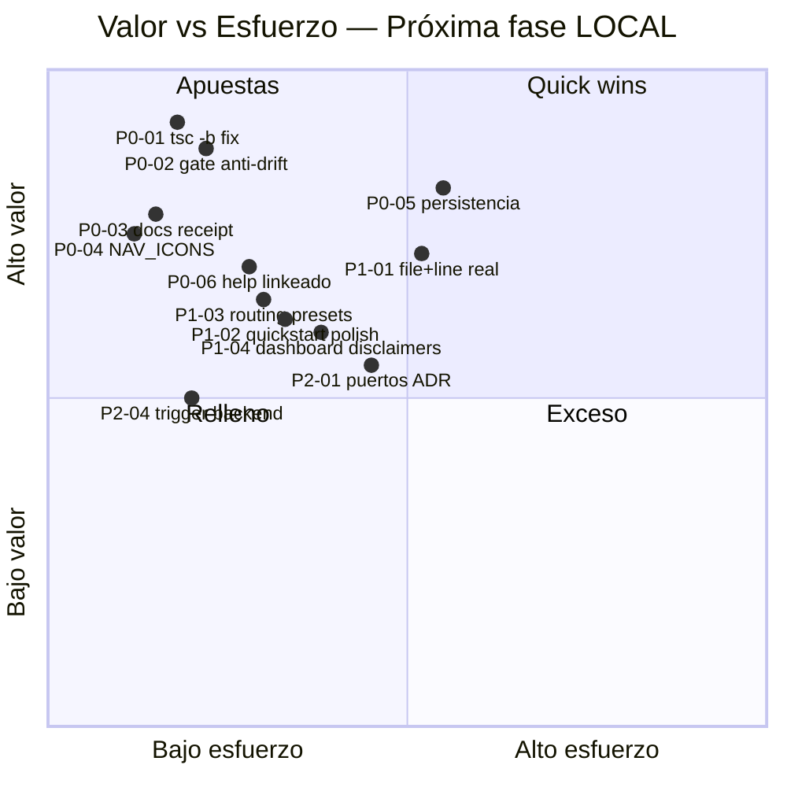

# PRD — Evaluación Waves & Producto Incremental (TermCanvas Warp Factories)

> **Autor:** Alice — Product Manager · Equipo software-termcanvas-waves
> **Fecha:** 2026-08-30 (verificación técnica en vivo)
> **Fuente de verdad:** `WarpFactories.md` (19 secciones, 1276 líneas, Early Access 2026-08-18) · `WarpFactories-UserStories.md` (155 US, 18 épicas) · `WarpFactories-Tickets.md` (16 tickets, 410 pts) · `docs/INCREMENTAL-DESIGN.md` (G1–G6, 1060 líneas) · `report.md` (cierre olas T-A..T-E)
> **Stack:** Vite 8.2 + React 19.2 + TS 6.0 + Tailwind 4.1 + zod + yaml, pnpm · Package `web/`
> **Instrucción del usuario:** *“Por el momento lo dejaremos solo LOCAL”* · *“VOS SOS EL TEAM LEADER NO CODEAS”* — plan en olas, duda si siguiente paso es backend o algo previo.

---

## TL;DR

**Estado REAL hoy:** la réplica LOCAL está **sólida como demo funcional** (33 archivos / 847 tests verdes, dominio puro impecable, 16 tickets con slices locales demoables) pero tiene **deuda de build oculta** y **drift de docs** que hay que cerrar antes de pensar en backend.

**Verificación 2026-08-30 en esta sesión:**

- `vitest run --pool=threads` → **847/847 PASSED** (~15s) ✅
- `tsc --noEmit` → **0 errores** ✅
- `tsc -b` (project references) → **11 errores TS** ❌ — `Sidebar` missing icon `Factory API`, `children` missing en tests, `PropertyKey[]` vs `string[]`, `CreateWorkItemInput.source` missing
- `vite build` → **verde** (sí compila, pero esconde el drift de `tsc -b`) ⚠️
- `oxlint` → 0 warnings en `src/` ✅ (pero solo porque hay ignore fix en `INCREMENTAL-DESIGN` G6-H8)

**Recomendación de producto:**

1.  **NO hacer backend ahora.** Hacer **Ola 4.5 — LOCAL-hardening** (1–1.5 semanas, solo P0): cerrar build gate, alinear docs y dejar la demo 100% presentable sin credenciales.
2.  Luego **spike de diseño backend** (sin código): definir puertos/contratos para que el día que Warp abra o se consigan credenciales, el swap sea un `port` y no un rewrite.
3.  Recién después decidir si se invierte en backend real. Si Warp abre Early Access público en Q4 2026, la réplica pierde valor estratégico — el hardening LOCAL es la inversión de menor arrepentimiento.

**Próxima ola propuesta:** 6 items P0 (build gate + docs + persistencia), 5 items P1 (UX/polish), 4 items P2 (preparación backend opcional). Todo LOCAL, sin B1–B8, sin Playwright/debugger.

---

## 1. Estado actual REAL (no el reporte viejo)

### 1.1 Tabla de salud — verificado en vivo

| Dimensión | Estado | Evidencia | Riesgo |
|-----------|--------|-----------|--------|
| **Dominio puro** | 🟢 Sólido | `src/lib/factory/domain/` 35 archivos, `workItem.machine.ts`, `automation.engine.ts` (393 LOC intacto OCP), `factory.record.ts`, `github.routing.ts`, `factoryApi.router.ts`, `quickstart.wizard.ts` | Ninguno |
| **Tests** | 🟢 Sólido | 33 archivos / 847 tests PASSED, pool `threads` fix (antes 804, hang en `forks` en Windows). Nuevos: factoryWorkspace, github.routing, factoryApi, quickstart | Bajo — pero **no cubren `tsc -b`** |
| **Typecheck `tsc --noEmit`** | 🟢 Pasa | 0 errores | Falso verde |
| **Typecheck `tsc -b`** | 🔴 Roto | **11 errores**: `Sidebar.tsx:33` `Factory API` icon missing, `agents.page.test.ts` container usado antes de asignar, `factoryWorkspace.test.ts` `sort` en readonly + `source` missing, `github.routing.test.ts` `AutomationDefinition` incompleto, `troubleshooting.test.ts` `children` missing, `workItem.store.context.test.tsx` `children` missing, `common.schema.ts` `PropertyKey[]` | **Alto** — deploy `tsc -b && vite build` falla aunque `vite build` solo pase |
| **Build `vite build`** | 🟡 Falso verde | Pasa (57k index, 181k vendor, 132k anim) — Vite no typechequea estricto, esconde los 11 errores | Medio — drift tests-vs-build |
| **Lint `oxlint`** | 🟢 Pasable | 0 warnings en `src/` (158 files) con `ignorePatterns: dist-verify/**` (G6-H8) | Bajo |
| **Navegación** | 🟢 Sólido | `nav.ts` única fuente de verdad (6 team + 23 factory ids), `assertNever` exhaustivo, `Sidebar` con lista real de factories, `+ Add factory` activo, `FactoryGlossary` | Bajo |
| **Persistencia** | 🟡 Funcional | `factoryWorkspace.store.ts` con `KeyValuePort` (memory + localStorage), `storage.port.ts` DIP, seed idéntico a `WorkItemStore`, pin/selección OK | Medio — sin migración, sin export |
| **Dashboard / Activity / Runs** | 🟡 Slice LOCAL | 8 métricas con disclaimers, kanban `includeTerminals`, detail `Stop task` sin confirmación, `View session`, `Settings` warp-managed LOCAL | Medio — paridad completa pendiente pero no bloquea demo |
| **Integraciones live** | 🔵 Bloqueado por diseño | T04/T06/T10/T11/T12/T13 parciales — UI/slice LOCAL completo, live requiere credenciales externas B1–B8 | Esperable en LOCAL-only |
| **Docs** | 🟡 Drift | `WarpFactories.md §17` ya corregido (MCP 19 tools + Benchmarks marcados hecho), pero `WarpFactories-Tickets.md` y `report.md` dicen “build verde” cuando `tsc -b` está rojo. Closure matrix `Complete (LOCAL slice)` confunde con “Complete producto” | Medio — erosiona confianza |

### 1.2 Qué está sólido (no tocar)

- **Arquitectura de dominio:** separación puro/React, OCP estricto (no se mutó `automation.engine.ts`), DIP por puertos, errores como valores `ParseResult`. Es referencia.
- **Cobertura de User Stories LOCAL:** E01, E02, E04, E06 (LOCAL), E07, E09 (routing local), E14 (stub), E16 (quickstart), E17 (help) — todas demoables sin credenciales.
- **Quickstart Wizard 7 pasos:** `quickstart.wizard.ts` reducer puro, `implement ON`, máx 2 repos, alias sigue a name, verbatim 186 chars, `useQuickstart` orquesta create→select→workItem→nav Activity.
- **GitHub dual-routing:** 5 checks con traza completa (`new_content`, `not_bot_author`, `label_present`, `not_code_block`, `mention_present`), `stripCodeBlocks`, `findMention`, exclusiones edit/bot/code.
- **Factory API stub drop-in:** mismos paths que Warp (`GET /api/v1/factory?search` case-insensitive, `POST /runs` con `ticket_ref` regex, `GET /followups/cancel`), `curl` + `OzAPI` snippets.
- **Navegación y shell:** `ErrorBoundary`, theme claro, `Sidebar` daily vs motor (Fitts/Nielsen), `Help` linkeado.

### 1.3 Deuda técnica concreta (lo que hay que pagar antes del backend)

| # | Deuda | Impacto | Dónde |
|---|-------|---------|-------|
| **D1** | `tsc -b` roto (11 errores) vs `tsc --noEmit` verde | Bloquea `pnpm build` canónico y CI futuro. Falso verde actual es `vite build` sin typecheck | `Sidebar.tsx`, `*.test.ts` (4 archivos), `common.schema.ts` |
| **D2** | Tests escriben contra tipos incompletos ( AutomationDefinition sin `agent/prompt/rawPath` ) | Tests pasan pero no representan contrato real; refactor futuro rompe silencioso | `github.routing.test.ts:122/133` |
| **D3** | `PropertyKey[]` vs `string[]` en `common.schema.ts:91` | Error `tsc -b` que indica `Object.keys` tipado como `PropertyKey` sin narrow | `common.schema.ts` |
| **D4** | `HelpSection` / `WorkItemStoreContext` `children` required pero tests omiten | Inconsistencia API componente — `children` debería ser opcional o tests deben proveerlo | `troubleshooting.test.ts`, `workItem.store.context.test.tsx` |
| **D5** | Docs dicen “build verde” cuando no lo es | Reporte 2026-08-30 quedará obsoleto en 1 semana si no se versiona receipt | `WarpFactories-Tickets.md:54`, `report.md:29` |
| **D6** | `nav.ts` ↔ `Sidebar.tsx` desync: `NAV_ICONS` no tiene `Factory API` | Caso típico de agregar id sin completar mapa — `assertNever` protege `App.tsx` pero no `Sidebar` | `Sidebar.tsx:33` |
| **D7** | Persistencia sin versionado/migración | `WORKSPACE_STORAGE_KEY = termcanvas.factory-workspace.v1` sin handler de migración v1→v2 | `storage.port.ts` |

### 1.4 Drift docs/tests/build

```
WarpFactories.md §17  → corregido 2026-08-30 (847 tests, MCP 19 tools + Benchmarks como hecho) ✅
WarpFactories-Tickets.md → closure matrix dice "Vite production build passed" pero tsc -b falla ❌
report.md            → receipt "tsc --noEmit 0 + vite build verde" esconde tsc -b roto ❌
vitest               → 847 verdes pero no garantiza tsc -b (ver D2) ⚠️
```

**Regla a instalar:** un único **receipt canónico** (`tsc --noEmit && tsc -b && vitest --pool=threads && vite build && oxlint`) con salida pegable. Todo doc que diga “build verde” debe citar ese comando y su hash de commit.

---

## 2. Riesgos

### 2.1 Matriz de riesgos (probabilidad × impacto)

| # | Riesgo | Prob | Impacto | Exposición | Mitigación propuesta |
|---|--------|------|---------|------------|----------------------|
| **R1** | **Warp abre Early Access público** y la réplica pierde razón de ser | Alta (launch 2026-08-18, docs actualizadas 2026-08-28, $10k qualifying) | 🔴 Alto | **LOCAL-hardening de bajo costo** + no invertir en backend hasta señal. Posicionar réplica como “simulador LOCAL sin credits” si abre | No construir backend; documentar valor diferencial LOCAL |
| **R2** | **Build drift** se agrava (más `tsc -b` rojos silenciosos) | Alta (ya 11) | 🟡 Medio | Gate P0: `tsc -b` en pre-commit + CI. Tomar D1 como P0 | P0-01 + P0-02 |
| **R3** | **Docs drift** erosiona confianza (“¿está verde o no?”) | Media | 🟡 Medio | Receipt único versionado por commit. Prohibir “build verde” sin comando | P0-03 |
| **R4** | **Credenciales B1–B8 nunca llegan** (GitHub App, Slack OAuth, Linear/Jira, MCP, harness, self-hosted) | Alta (decisión externa) | 🟢 Bajo en LOCAL | Diseño LOCAL-first: todo valor demo sin credenciales. Backend solo como `port` mock | No-objetivo explícito |
| **R5** | **Playwright/debugger siguen no disponibles** | Alta (ya reportado) | 🟢 Bajo | No prometer E2E browser. Cubrir con `jsdom` + `vitest` + `View session` stubs | Constraints |
| **R6** | **Single bus factor** (1 dev, 157 archivos, 410 pts) | Media | 🟡 Medio | Slices verticales pequeños, ADRs, `nav.ts` como contrato | G1–G6 documentados |
| **R7** | **Scope creep: “ya que estamos, hagamos backend”** | Media | 🔴 Alto | Decisión explícita “backend NO ahora” con spike previo | §7 de este PRD |
| **R8** | **Persistencia local frágil** (localStorage sin migración) | Media | 🟡 Medio | P0-05: export/import + versionado | P1 |

### 2.2 Valor de seguir invirtiendo si Warp abre

| Escenario | Valor de la réplica LOCAL | Qué hacer |
|-----------|---------------------------|-----------|
| **Warp sigue Early Access cerrado** (team + credits) | Alto — única forma de probar Warp Factories sin $10k ni Warp team | Hardening LOCAL + preparar backend como opción |
| **Warp abre público en Q4 2026** | Bajo como “reemplazo”, **medio como simulador** — valor pasa a ser: onboarding sin credits, training, offline demo, y contraste “qué aprendimos replicando” | Congelar réplica, publicarla como `TermCanvas — Warp Factories Simulator (LOCAL)`, no backend |
| **Warp cambia API/schema `v1alpha1` → `v1`** | Medio — réplica queda desactualizada pero sirve como spec viva para migrar | Mantener `v1alpha1` congelado, documentar diff |

**Conclusión:** el valor incremental más seguro es **hacer que LOCAL sea impecable** (demo de 5 minutos que no se rompe). Backend es apuesta.

---

## 3. Producto incremental — definición

### 3.1 Objetivos (3, ortogonales)

**O1 — Demo LOCAL irrompible (sin credenciales)**
> Cualquier persona clona `web/`, hace `pnpm i && pnpm --filter web dev` y en 5 minutos crea una factory, simula routing GitHub dual-label, dispara Factory API y completa el Quickstart de 7 pasos, sin `warp_local_api_key` ni OAuth, con build y tests verdes reproducibles.

**O2 — Confianza verificable (receipt único)**
> Un solo comando canónico (`tsc --noEmit && tsc -b && vitest --pool=threads && vite build && oxlint`) es la definición de “verde”. Docs, tickets y report citan ese comando + commit, sin “build verde” ambiguo.

**O3 — Backend opcional por puertos (sin rewrite)**
> El día que haya credenciales o Warp abra, el paso a backend real es cambiar un `port` (storage, factory API fetch, MCP transport), no reescribir dominio. Dejar el diseño listo, sin implementar backend aún.

### 3.2 No-objetivos (qué NO haremos en la próxima fase)

- ❌ **No backend real** (no DB, no auth, no deploy, no secrets server, no OTel real). Solo diseño de puertos.
- ❌ **No integraciones live** (no GitHub App install, no Slack OAuth, no Linear/Jira/GitLab/MCP live, no harness `claude/codex/gemini` con secrets). Todo queda como slice LOCAL + doc estática.
- ❌ **No paridad 100% Warp** (no `warp/factory-config` atómico en GitHub, no `Self-improvement` con PRs reales, no benchmark execution real, no `Factory definition` GitHub-backed/Live-managed completo).
- ❌ **No Playwright E2E** hasta tener MCP disponible (se registra como limitación, no bloqueante).
- ❌ **No cambiar `v1alpha1`** ni agregar features de Warp que no estén en `WarpFactories.md` 2026-08-29.

### 3.3 Usuarios (3)

| Usuario | Job principal | Qué valora en LOCAL | Qué NO necesita |
|---------|---------------|---------------------|-----------------|
| **Team Owner** | Crear una factory, entender sizing/policy, decidir si Warp vale los $10k | Quickstart 7 pasos, glosario triada, dashboard con 8 métricas y disclaimers, `Sizing` 3 patterns | Credenciales, billing |
| **Developer** | Simular SDLC completo: intake → Triage→Planning→Building→Reviewing→handoff con evidencia, sin merge | Activity kanban, GitHub routing simulator, Factory API console con `curl`/OzAPI, `View session`/`Event history` | Merge real, branch protection real |
| **Admin/Reviewer** | Validar `factory.yaml` y automations sin romper la factory | `ValidationPage` con `file+line`, `AutomationsPage` matching AND/OR + `in`/`not_in`, `RunnersPage` con 32/64 limits | GitHub PR checks reales |

### 3.4 Constraints (innegociables)

- `C1` **Solo LOCAL** — por decisión explícita del usuario. Todo P0/P1 debe demoar sin B1–B8.
- `C2` **Sin credenciales** — no pedir tokens. Mocks con mismos paths que Warp para swap futuro.
- `C3` **Sin Playwright/debugger** — validación con `jsdom` + `vitest`.
- `C4` **Stack congelado** — Vite 8.2/React 19.2/TS 6.0/Tailwind 4.1/zod/yaml, pnpm, sin deps nuevas salvo justificación.
- `C5` **Team leader no codea** — este PRD es para que el arquitecto diseñe olas y los agents implementen; el PM no entrega código.
- `C6` **157 archivos, 35 de dominio, 32 tests** — mantener SRP/OCP/DIP, no inflar `src/` con scaffolding backend prematuro.

---

## 4. Épicas incrementales / Backlog priorizado

> **Convención:** `P0` Must (próxima ola, sin esto no hay demo confiable) · `P1` Should (pulido, valor visible) · `P2` Could (preparación opcional, sin código backend). Cada item cita `Traza` y trae Gherkin donde aporta valor.

### P0 — Must (Ola 4.5 — LOCAL-hardening, ~1–1.5 semanas)

| ID | Título | Traza | Qué entrega | Criterio Gherkin |
|----|--------|-------|-------------|------------------|
| **P0-01** | **Cerrar `tsc -b` (D1–D6)** | T01, T04, T06 | `pnpm --filter web exec tsc -b` en 0 errores. Fix: `Sidebar.tsx` agregar `Factory API` icon, `HelpSectionProps.children` opcional o tests con children, `WorkItemStoreContext` children opcional, `common.schema.ts` narrow `PropertyKey[]` → `string[]`, `factoryWorkspace.test.ts` tipos correctos, `github.routing.test.ts` fixtures con `agent/prompt/rawPath` | ```gherkin Scenario: Build canónico verde Given commit main-c2128e3a When corro tsc --noEmit && tsc -b && vite build Then los tres pasan con 0 errores ``` |
| **P0-02** | **Gate único anti-drift** | T01 DoD | Script `pnpm --filter web check` que corre `tsc --noEmit && tsc -b && vitest run --pool=threads && vite build && oxlint` y falla si alguno falla. Documentado en `README.md` + `.husky/pre-commit` opcional | ```gherkin Scenario: Drift no pasa silencioso Given introduzco error TS solo visible en tsc -b When corro pnpm check Then falla en tsc -b con file+line ``` |
| **P0-03** | **Alinear docs y receipt versionado** | T01–T16 | Actualizar `WarpFactories-Tickets.md` Implementation closure matrix + `report.md` Validación global para citar receipt canónico con commit + comando. Eliminar “Vite production build passed” sin calificar. `WarpFactories.md §17` ya OK — solo agregar nota “receipt: <commit> tsc -b 0” | ```gherkin Scenario: Docs citan receipt Given abro WarpFactories-Tickets.md Then veo "Validation receipt: <commit> · tsc --noEmit 0 · tsc -b 0 · 847 tests · vite build ok" ``` |
| **P0-04** | **Mapa `NAV_ICONS` completo y test de exhaustividad** | T12, nav.ts | `Sidebar.tsx` cubre los 29 `NavItemId` (falta `Factory API`). Agregar test que `NAV_ITEMS.every(id => id in NAV_ICONS)` | ```gherkin Scenario: Nuevo NavItemId sin icono falla Given agrego NavItemId "Foo" sin entrada en NAV_ICONS When corro tsc -b Then error TS2741 ``` |
| **P0-05** | **Persistencia LOCAL robusta (export/import + versionado)** | T02, D7 | `FactoryWorkspaceStore` con `exportJSON`/`importJSON` (validado por `factory.parser`), migración `v1`→`v2` no destructiva, y `localStorage` quota handling. Sin backend | ```gherkin Scenario: Exporto y reimporto Given tengo 3 factories con pin y policy When exporto JSON y lo importo en otro browser Then veo las 3 idénticas ``` |
| **P0-06** | **Help linkeado desde donde duele** | T16, US-145→148 | `?` en `Activity`/`Runs`/`Automations`/`Factory API` enlaza al fix correspondiente en `TroubleshootingPage`. Métrica: 0 páginas sin `trace` | ```gherkin Scenario: Estoy atascado en Automations When clickeo ? Then abre Troubleshooting > One action → two runs ``` |

### P1 — Should (pulido LOCAL, valor demo inmediato)

| ID | Título | Traza | Qué entrega | Notas |
|----|--------|-------|-------------|-------|
| **P1-01** | **ValidationPage `file+line` real** | T06, US-058 | `formatZodIssues` + `yaml.utils` reportan `line`/`col` reales (hoy `file.field`). `ValidationPage` pinta `factory.yaml:12` no `factory.name`. Reusa `frontmatter.utils` | Sin esto el error “file+line” es marketing |
| **P1-02** | **Quickstart: límite 2 repos con feedback** | T15, US-142 | Wizard muestra “2 max — el 3º reemplaza al más viejo” y deshabilita 3er chip con tooltip. Ya está en reducer, falta UX | Fitts: 1 control relevante por paso |
| **P1-03** | **GitHub routing: presets + copy** | T09, US-076 | `GitHubRoutingPage` 4 presets de 1 clic + `factory:<alias>` copiable + `continuationKey` visible. Ya existe, pulir copy ES | Valor demo 30s |
| **P1-04** | **Dashboard disclaimers visibles** | T12, US-096→101 | 8 métricas con tooltips: `merged puede > opened`, `Autonomy push semantics`, `Cost S/M/L/XL 100/500/1000`, `Scorer 3 newest` sin date filter | Evita malinterpretar métricas |
| **P1-05** | **A11y + i18n polish** | DoD | Labels, focus, `aria-current`, `children` opcional, artefactos técnicos en inglés, copia ES en UI | Cierra H16–H17 |

### P2 — Could (preparación backend opcional, sin implementar backend)

| ID | Título | Traza | Qué entrega | Por qué P2 y no P0 |
|----|--------|-------|-------------|-------------------|
| **P2-01** | **Diseño de puertos backend (ADR)** | T02, T14 | ADR: `KeyValuePort` ya existe → extender a `FactoryRepositoryPort`, `WorkItemRepositoryPort`, `FactoryApiTransportPort` (fetch vs in-process). Diagrama control vs execution. Sin código | Si se hace backend sin esto, se reescribe dominio |
| **P2-02** | **Contrato `ticket_ref` + `search` case-insensitive** | T14, US-149→153 | Spec de `TICKET_REF_PATTERN` y `GET /api/v1/factory?search=` con ejemplos, para que futuro backend no rompa stubs | Ya está en tests, falta ADR |
| **P2-03** | **Mapeo B1–B8 → env vars / secrets scoping** | T15, §13 | Tabla: cada bloqueante B1–B8 qué env var/secret/port necesita, 4 credential boundaries, `EXECUTOR` vs `CREATOR` | Sin esto el día de las credenciales se improvisa |
| **P2-04** | **Decisión “cuándo backend” con trigger** | R1, §7 | Definir trigger: “si Warp sigue cerrado en 2026-11-01 y hay 2+ repos con demanda, spike backend de 2 semanas; si abre, congelar” | Evita scope creep R7 |

---

## 5. Matriz Valor / Esfuerzo



**Lectura:** P0-01→P0-04 son **quick wins** (alto valor, bajo esfuerzo, 1–2 días). P0-05 y P1-01 son las únicas apuestas con esfuerzo medio pero valor alto. P2 es relleno deliberado — no hacer antes que P0.

---

## 6. Decisión Backend: ¿ahora o después?

### 6.1 Tradeoffs

| Dimensión | Backend **ahora** | Backend **después** (recomendado) |
|-----------|-------------------|-----------------------------------|
| **Valor LOCAL** | Se diluye — 1–2 semanas de backend no mejoran demo de 5 min | Se maximiza — demo impecable sin credenciales |
| **Costo** | Alto: DB, auth, deploy, secrets, OTel, metering credits (`T15` B8). 3–4 semanas para algo creíble | Bajo: 1.5 semanas de hardening + 2 días de ADR puertos |
| **Riesgo Warp abre** | 🔴 Alto arrepentimiento — backend queda obsoleto si Warp abre | 🟢 Bajo arrepentimiento — hardening sirve igual como simulador |
| **Riesgo técnico** | Medio: sin puertos bien definidos, backend acopla dominio a infra | Bajo: puertos primero, backend después sin rewrite |
| **B1–B8** | Bloquea igual — backend sin credenciales externas sigue mock | No bloquea — LOCAL no necesita B1–B8 |
| **Señal para decidir** | Ninguna — se apuesta a ciegas | Trigger temporal: 2026-11-01 (ver P2-04) |

### 6.2 Recomendación (Alice)

> **Después.** Hacer **Ola 4.5 LOCAL-hardening (P0)** y en paralelo un **spike de diseño** (P2-01→P2-03) de 2 días que deje los puertos dibujados y el ADR escrito. No escribir ni una línea de backend hasta que:
>
> 1. `tsc -b` esté verde y el receipt sea único, **y**
> 2. Warp siga en Early Access cerrado al 2026-11-01 **o** haya pedido explícito con credenciales B1–B3 disponibles.

Si Warp abre antes, **congelar** la réplica y publicarla como *“TermCanvas Warp Factories Simulator — LOCAL-only, sin credits, para training/onboarding”*.

### 6.3 Qué debe dejar el spike (sin código backend)

- ADR `docs/ADR-001-ports-backend.md` con `FactoryRepositoryPort`, `WorkItemRepositoryPort`, `FactoryApiTransportPort`, `McpTransportPort`.
- Tabla B1–B8 → env vars (`WARP_API_KEY`, `GITHUB_APP_ID`, `SLACK_BOT_TOKEN`, `LINEAR_OAUTH`, `JIRA_ROVO`, `ANTHROPIC_API_KEY`, `SELF_HOSTED_WORKER_ID`).
- Diagrama control vs execution (ya en `infra.derive.ts`, solo promover a ADR).
- Criterio de trigger P2-04 con fecha.

---

## 7. Preguntas abiertas para Arquitectura (qué debe resolver en diseño de olas)

**Para el arquitecto (Gao) — responder antes de arrancar Ola 4.5:**

1. **Build gate:** ¿`tsc -b` debe ser el gate canónico o conviene colapsar `tsconfig.json` references a un solo `tsconfig.json`? Hoy `tsc --noEmit` pasa y `tsc -b` no — ¿es deuda de config o de código? ¿Qué comando va al `pnpm check`?
2. **Persistencia:** ¿`KeyValuePort` con `localStorage` alcanza o proponés `IndexedDB` para factories + work items con migración `v1→v2`? ¿Export JSON debe ser `v1alpha1` compatible?
3. **`NAV_ICONS` exhaustividad:** ¿preferís `Record<NavItemId, LucideIcon>` con `satisfies` + test, o derivar iconos desde `NAV_ITEMS` (agregar `icon` al `NavItem`)? Hoy `nav.ts` es puro y `Sidebar.tsx` mapea — ¿se mantiene SRP?
4. **`children` required vs optional:** `HelpSectionProps` y `WorkItemStoreContext` exigen `children` pero tests lo omiten — ¿firma correcta es `children?: ReactNode` o hay que fixear tests? Afecta `tsc -b`.
5. **Validation `file+line`:** `formatZodIssues` hoy no tiene `line` — ¿se usa `yaml` parser con `LineCounter` o se mantiene `file.field` y se renuncia a `file+line` en LOCAL? ¿Costo?
6. **Ola 4.5 sizing:** ¿P0-01→P0-06 en una ola o en dos (P0-01→P0-04 primero, P0-05→P0-06 después)? Con 1 dev, ¿estimación en puntos Fibonacci para cada P0?
7. **Backend ports:** ¿`FactoryApiTransportPort` debe ser `fetch`-like (`Request→Response`) o `handle(ApiRequest)→ApiResponse` como hoy? ¿El stub in-process se mantiene como `createFactoryApi({ store, factories })` o se extrae a `InMemoryTransport`?
8. **Docs receipt:** ¿dónde vive el receipt canónico — `report.md` o `docs/RECEIPT.md` versionado por commit? ¿Se exige en PR template?
9. **Playwright:** si sigue no disponible en 3 olas, ¿se acepta `jsdom` como DoD permanente para LOCAL o se deja `P2` para E2E real?
10. **Trigger backend:** ¿fecha 2026-11-01 es razonable o preferís trigger por señal (ej. “Warp docs actualizadas con `v1` estable”)?

---

## 8. Métricas de éxito (próxima ola 4.5)

| Métrica | Hoy | Objetivo Ola 4.5 | Cómo se mide |
|---------|-----|------------------|--------------|
| `tsc -b` | 11 errores | **0** | `pnpm --filter web exec tsc -b` |
| `pnpm check` (gate único) | no existe | **existe y pasa** | `pnpm --filter web check` |
| Tests | 847 PASSED | **≥847 PASSED** (sin bajar) | `vitest run --pool=threads` |
| Build | `vite build` verde, `tsc -b` rojo | **ambos verdes** | receipt canónico |
| Docs drift | 2 docs con “build verde” ambiguo | **0** — todos citan receipt + commit | grep “build verde” sin comando = 0 |
| Demo 5 min sin credenciales | manual, no guionado | **guionado**: 1 factory → routing simulator → Factory API → Quickstart → Activity | `docs/DEMO-5MIN.md` |
| Persistencia | localStorage sin export | **export/import OK** | P0-05 Gherkin |

---

## 9. Apéndice — trazabilidad

- **Tickets T01–T16:** todos con slice LOCAL demoable; parciales = live bloqueado por B1–B8 (no deuda LOCAL). No reabrir T04/T06/T10/T11/T12/T13 como “incompleto” — son P2 si acaso.
- **Bloqueantes B1–B10:** ninguno impide P0/P1. B9–B10 (Playwright/debugger) registrados como limitación, no bloqueante.
- **Memoria Engram:** 904 sesiones, foco LOCAL-only estable. Este PRD respeta “solo LOCAL” y “team leader no codea” — propone olas para que el arquitecto diseñe y los agents implementen.
- **Proyecto:** `snake_case` sugerido si hace falta repo nuevo: `termcanvas_warp_sim` (actual `web/` ya está). Lenguaje: español rioplatense en producto, inglés en artefactos técnicos.

---

*PRD incremental simple — listo para que arquitectura diseñe Ola 4.5 (Gao) y delivery la ejecute en slices verticales. Sin código, solo decisiones.*
